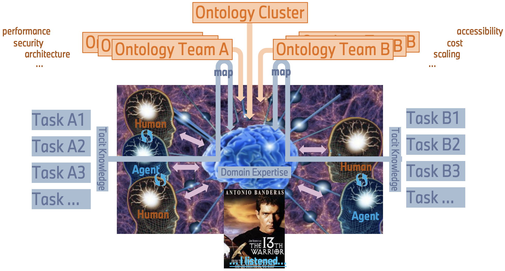
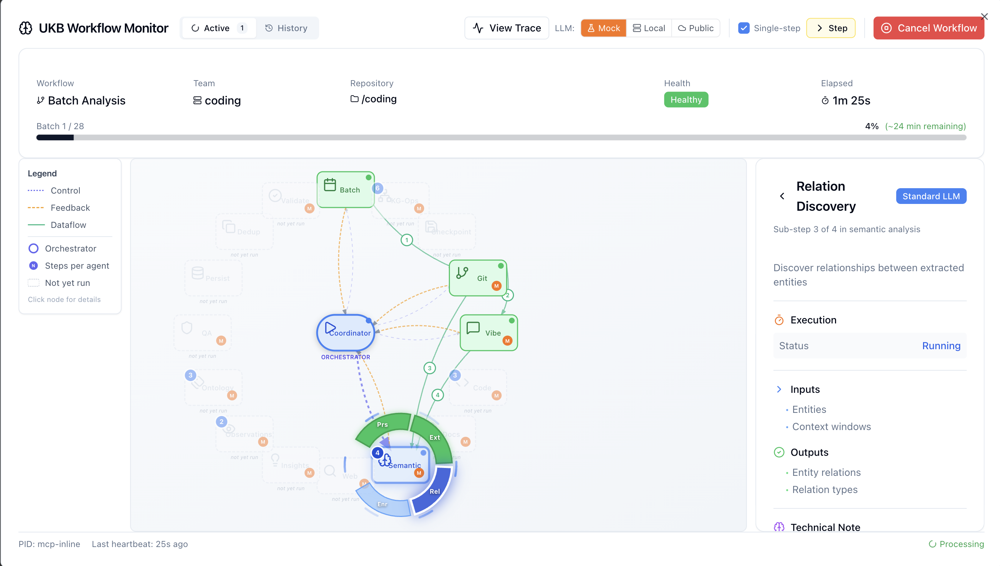
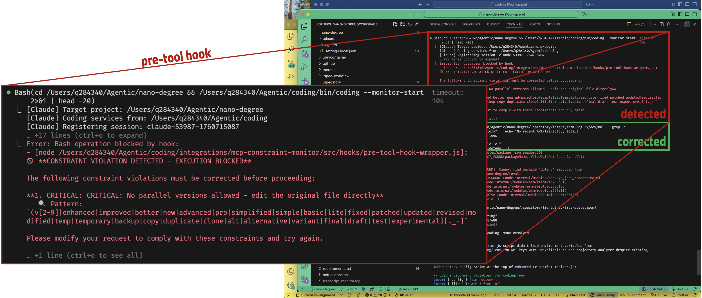
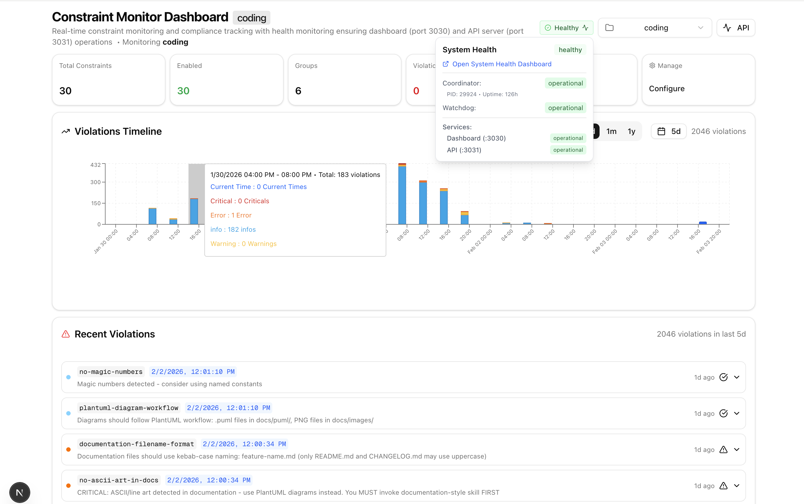

# Building a Self-Learning Layer for AI Coding Assistants

**An experiment in 100% vibe coding: creating infrastructure that captures conversations, prevents mistakes, and builds collective intelligence for development teams.**


---

This project started as an experiment. A question, really: what happens if you let AI coding assistants build their own support infrastructure, without writing a single line of code yourself - only describing what you want?

The answer, it turns out, is surprisingly functional, robust and performant software.

**Coding** is an infrastructure layer built entirely through "vibe coding" - a form of declarative programming where I describe intentions and let AI assistants handle the implementation. Some parts work beautifully. Others need refinement. But the core is solid enough that I'm using it daily, and I think the patterns here might be useful to others building in this space.

What I've learned: vibe coding fundamentally shifts the focus from syntax to architecture and design. Instead of wrestling with "how do I express this in a programming language," you're thinking about solutions - system structure, data flow, component boundaries. The cognitive load moves from implementation details to the bigger picture.

But here's the thing: **a sound understanding of software architecture is still essential**. Perhaps more essential than ever. When you're describing systems at a high level, you need to know what good architecture looks like. The AI handles the syntax; you need to provide the vision. In my experience, the more seasoned the developer, the better the vibed code. Domain expertise and architectural intuition translate directly into better outcomes.

This isn't polished product software. It's a working experiment - a foundation that can be forked, adapted, and evolved. With AI coding assistants becoming increasingly capable, we're entering an era where "useful fragments" might be more valuable than monolithic applications. Fork it, point your AI assistant at it, and shape it into what you need.

The age of custom-made software is approaching.

---

## The Problems We're Solving

AI coding assistants are everywhere now. Claude Code, GitHub Copilot, Codex, Gemini CLI - pick your favorite.

But two things keep bothering me:

**First, the amnesia problem.** Every time I start a new session, my assistant has forgotten everything. That bug we debugged together last week? Gone. The architectural decision we made yesterday? Vanished. The pattern we established for handling errors in this codebase? It needs to rediscover it from scratch.

We've essentially built incredibly smart assistants with permanent amnesia.

**Second, the scalability problem.** What if you could have a team of senior developers who all share the same deep knowledge - not just of the codebase, but of every discussion, every decision, every pattern that's ever been established? A collective brain that grows smarter with every interaction?


*The vision: humans and AI agents sharing domain expertise through a collective knowledge system, with team-specific ontologies feeding into shared understanding.*

That's the bigger vision here. Not just memory for one assistant, but **shared intelligence across agents and team members**. Every conversation feeds a knowledge graph. Every pattern gets captured. Every new team member (human or AI) can tap into the accumulated wisdom of everyone who came before.

---

## What Coding Does

The system has four main layers:

1. **Live Session Logging** - Multi-layer intelligent classification
2. **Knowledge Extraction** - Multi-agent AI system building a collective brain
3. **Constraint Enforcement** - Blocks mistakes before execution
4. **Health Monitoring** - Multi-layer watchdog architecture

Let me walk you through each.

---

## Live Session Logging: Capturing Everything

The foundation is a real-time monitoring system called LSL (Live Session Logging).

It captures every prompt, every tool call, every response - but here's where it gets interesting: it uses a **5-layer classification system** to intelligently route content.


*Session logs organized by time slots, with intelligent routing - notice how "from-curriculum-alignment" files are automatically routed (to project Coding) based on semantic classification.*

| Layer | What It Does | Speed |
|-------|--------------|-------|
| Session Filter | Tracks conversation context | Instant |
| Path Analyzer | Pattern-matches file operations | Less than 1ms |
| Keyword Matcher | Fast keyword classification | Less than 10ms |
| Embedding Classifier | Semantic vector similarity | Around 50ms |
| Semantic Analyzer | LLM-powered understanding | From 10ms (cached) up to 500-800ms |

Why layers? Because not everything needs deep analysis. A simple file read can be classified in under a millisecond. Complex discussions about architecture might need the semantic analyzer. The system short-circuits at the first confident decision.

The classification determines routing. Content about the Coding infrastructure itself goes to one log. Content about your actual project goes to another. Multiple projects, multiple developers - the system keeps everything organized automatically.

**Privacy is baked in.** Before anything gets stored, a configurable redactor strips sensitive data - API keys, tokens, passwords, email addresses, corporate identifiers. At present: 13 pattern types, low millisecond overhead per exchange.

---

## Knowledge Extraction: Building the Collective Brain

Capturing conversations is just the start. The real value comes from extracting **actionable knowledge** that any team member or AI agent can access.

The system aims to learn a programmer's ways by quietly observing - watching how we approach specific problems and what solutions we arrive at. Think of Antonio Banderas in the 1999 film [*The 13th Warrior*](https://www.youtube.com/watch?v=9Y7zq1gGEAU), where he plays a captured Arab poet who learns to speak "Viking" (Old Norse) simply by listening to his captors' conversations around the campfire. Given a certain cultural overlap - both parties are human, they eat, they drink, they make jokes about each other's mothers - a shared ontology, if you like - he manages to extract enough meaning to finally begin communicating. In his case, flawlessly. It's Hollywood, after all.

That's the idea here. The system observes conversations, git commits, debugging sessions. It looks for patterns in how problems are framed and solved. Over time, it builds understanding - not through explicit teaching, but through quiet observation of the shared "ontology" between developer and codebase.

A multi-agent (currently 14 agents) AI system analyzes git history and conversation logs, extracting patterns and insights into a searchable knowledge graph.


*The WF modal in the health monitor dashboard can be used to visualize the flow of information through the multi-agent system which is called when demanding an update of the knowledge base (ukb).*

A visualization of the (configurable) multi-agent system has been added to the health board to better understand what is going on inside the multi-agent system used for semantic analysis of repositories.

Exposed as MCP server, the updating of the knowledge base can be done from within the coding agent: ask for an update of the knowledge-base (ukb) for an incremental update - since the last time we ran 'ukb'. Use 'ukb full' and 'ukb full debug' to run a full analysis of the entire repo - from the very first commit until today. In "debug" mode you can single-step through the agentic workflow, switch from publicly hosted LLMs to locally run LLMs (Docker Model Runner with llama.cpp) or use mocked LLM calls.


*Use the tracing tool to inspect what goes into each agent, what comes back from the LLM, number of tokens, latencies, etc.*

The integrated tracing tool can be used to inspect each step of the workflow, allowing the spotting of bottlenecks and misbehaving agents. The result of an updated knowledge-base can be viewed using the 'vkb' viewer:


*The VKB (Visualize Knowledge Base) interface: filter by team/scope, explore entity relationships, view observations and detailed insights with auto-generated diagrams.*

Each insight gets classified into one of five entity types:

- **ImplementationPattern** - Code patterns and best practices
- **ArchitecturalDecision** - System design choices with rationale
- **TechnicalSolution** - Problem-solving approaches
- **WorkflowPattern** - Development process patterns
- **ConfigurationPattern** - Setup and configuration knowledge


*Knowledge flows from multiple projects into a central graph database, with git-tracked JSON exports enabling team collaboration.*

**This is where the "collective brain" vision comes in.** When a new developer joins, they don't just get access to code - they get access to the reasoning behind every significant decision. When a new AI agent starts a session, it can query the accumulated knowledge of every previous session.

The more you use it, the smarter it gets. Patterns compound.

*Note: The knowledge extraction system is functional but still being refined. The multi-agent workflow for semantic analysis works, but some edge cases need attention. This is one of the areas where contributions would be particularly valuable.*

---

## Constraint Enforcement: Preventing Mistakes Before They Happen

This is my favorite part, and it's working well.

Most code quality tools catch problems **after** you've written the code. Linters run post-hoc. Code reviews happen after commits. By then, the mistake is already made.

Coding takes a different approach: it uses **PreToolUse hooks** to intercept AI actions before they execute.


*A constraint violation being detected and blocked in real-time. The AI tried to create a parallel file version - the hook caught it, blocked execution, and the AI corrected its approach.*

When the AI wants to write code, the PreToolUse hook fires first. It evaluates 20+ constraints against the proposed action. If the constraint severity is CRITICAL or ERROR, the tool call is blocked entirely. WARNING and INFO severity allows the action but provides feedback.


*The constraint monitoring dashboard: violation timeline, severity breakdown, and real-time feed of recent violations.*

The system currently enforces around 20 constraints (configurable, per-project) across several categories:

**Security (blocks 100% of violations)**
- No hardcoded secrets
- No dangerous function usage

**Architecture (blocks 100% of violations)**
- No parallel/duplicate files (prevents `-v2.js` proliferation)
- Debug before speculating
- No evolutionary naming (`-new`, `-fixed` suffixes)

**Code Quality**
- Proper error handling
- No debug statements in production code
- Modern variable declarations only

When a critical constraint is violated, the tool call simply doesn't execute. The AI gets feedback about why, and can adjust its approach. It's like having a code reviewer that never sleeps and catches issues at the moment of creation.

---

## Health Monitoring: Self-Healing Infrastructure

Running multiple services, databases, and monitoring processes requires robust health management.


*The health dashboard: real-time status of databases (Qdrant, CGR Cache), services (VKB Server, Constraint Monitor), processes, API quotas, and UKB workflows - all with auto-healing active.*

The system uses a 4-layer watchdog architecture:


*The process monitoring architecture: session management, service coordination, process state management with atomic operations, and a monitoring layer with watchdog and verifier.*

If a process crashes, the watchdog detects it and restarts automatically. Services register themselves and can be queried for health status. The entire system is designed to run unattended for extended periods.

---

## Provider Agnostic, Agent Agnostic

One design principle I aimed for: **no lock-in**.

The system is designed to work with any AI coding assistant. Currently it's optimized for Claude Code (installation process, status line integration and hook functions), but the architecture supports GitHub Copilot, Codex, Gemini CLI, and others. Should be straight-forward to extend this to other environments, as they become increasingly similar and, by and large, support similar mechanisms (eg. hook functions).

Similarly, it's not locked to any LLM provider. You can use:

- **Groq** (fast, cheap - my default)
- **Anthropic** (high quality)
- **OpenAI** (GPT-4 when needed)
- **Local models** via Docker Model Runner or llama.cpp (free, private)

The system automatically routes based on content sensitivity. Discussing API architecture? Send it to the cloud for fast, accurate analysis. Processing something with potential credentials? Route it locally - the data never leaves your machine.

Budget tracking is built in with configurable limits and automatic fallback to local models when thresholds are reached.

---

## Ontology-Based Classification

One of the more sophisticated aspects is the ontology system for knowledge classification.


*The full pipeline: from transcript capture through classification to storage, with ontology-based entity typing and a spec workflow for requirements management.*

This enables structured knowledge that can be queried semantically, not just by keyword matching. More work is needed to improve this aspect - a lot of publications talk about ontologies and GraphRAG these days... should be easy to incorporate some of the shared ideas in the provided ontology classes.

---

## Zero-Friction Deployment

All of this runs in Docker. One command starts everything:

```bash
coding
```

That's it. The infrastructure spins up in containers, your AI assistant connects, and you're working with full session logging, knowledge extraction, and constraint enforcement.

The dashboard is at `localhost:3030`. The knowledge graph viewer is at `localhost:8080`. Health monitoring shows you exactly what's running and catches problems automatically.

If a process crashes or a status has gone stale, the multi-layer watchdog and process monitoring architecture detects it and restarts or refreshes the status. Sessions can run for days without intervention. Unused open coding sessions are detected as such and treated as dormant.

---

## Current State: What Works, What's WIP

Let me be honest about where things stand:

**Production-ready:**
- Live Session Logging with 5-layer classification
- Constraint enforcement with PreToolUse hooks
- Health monitoring and automatic recovery
- Knowledge graph storage and visualization
- Multi-project support

**Working but needs refinement:**
- Continuous learning (automatic knowledge extraction)
- Trajectory detection (recognizing exploring vs. implementing vs. debugging)
- Some edge cases in the multi-agent workflow, which has grown from a much simpler set-up to what might have become a slightly too complicated configuration

**The code itself reflects its vibe-coded origins.** There are inconsistencies. Some abstractions could be cleaner. But it works, and more importantly, the patterns are sound.

---

## Why Open Source This?

I think we're entering a new era of software development. AI coding assistants are getting good enough that the barrier to customization is dropping dramatically.

Instead of choosing between "use this SaaS product as-is" or "build everything from scratch," there's a middle path: **take useful fragments, point your AI assistant at them, and shape them into exactly what you need.**

This project is one of those fragments. The patterns for session logging, knowledge extraction, constraint enforcement - these are reusable. Fork it, strip out what you don't need, add what you do.

The age of custom-made software is approaching. And AI coding assistants make it accessible to far more people than ever before.

---

## Documentation

Full documentation is available at **[fwornle.github.io/coding](https://fwornle.github.io/coding)**.

The documentation itself was produced in a fully vibed manner - including all the PlantUML architecture diagrams. It covers installation, configuration, all core systems, integrations, and deep-dive guides.

---

## Getting Started

```bash
git clone --recurse-submodules https://github.com/fwornle/coding ~/Agentic/coding
cd ~/Agentic/coding && ./install.sh
source ~/.bashrc
coding
```

---

## What's Next

The vision is AI assistants that genuinely learn from every interaction - not just within a session, but across sessions, across team members, building a collective intelligence that makes everyone more effective.

We're not fully there yet. But this is a solid foundation, and I'm curious to see what others build on top of it.

If you're working on similar problems - AI memory, team knowledge sharing, constraint systems - I'd love to hear about your approach. This space is moving fast, and there's a lot to figure out together.

---

*MIT licensed. Contributions welcome. This is an experiment - treat it accordingly.*

*This article was produced over breakfast - in a fully vibed manner, of course.*
