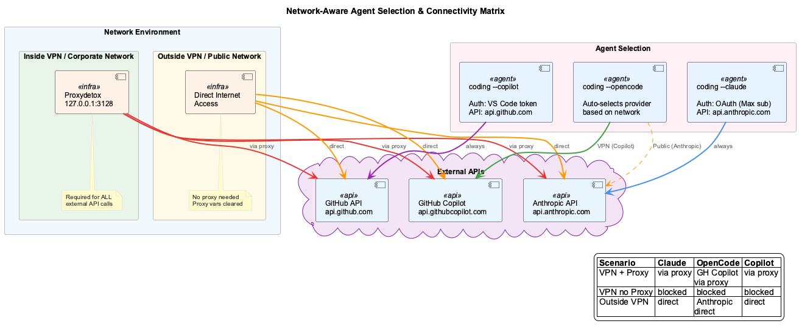

# Commands

CLI commands and shell usage reference.

## Core Commands

### coding

Launch a coding agent with all integrations (Docker services, LSL, health monitoring, constraints).

```bash
# Launch specific agents
coding --claude      # Claude Code (Anthropic OAuth / Max subscription)
coding --opencode    # OpenCode (auto-selects provider based on network)
coding --copilot     # GitHub Copilot CLI
coding --copi        # Alias for --copilot

# Specify project directory
coding --project ~/my-project

# Clean start (kills all coding processes, frees all ports, then launches)
coding --force
coding --force --claude

# Dry run (validates config, network, Docker — does not launch)
coding --opencode --dry-run

# Docker mode
touch .docker-mode && coding --claude

# Help
coding --help
```

### Network-Aware Agent Selection

The launcher automatically detects your network environment and configures each agent accordingly:



| Agent | Inside VPN (proxy) | Outside VPN (direct) | Provider |
|---|---|---|---|
| `--claude` | Works via proxy | Works direct | Anthropic (OAuth / Max) |
| `--opencode` | GitHub Copilot Enterprise | Anthropic direct | Auto-selected |
| `--copilot` | Works via proxy | Works direct | GitHub Copilot CLI |

**Auto-configuration:**

- **Inside VPN**: proxy auto-detected (proxydetox on 127.0.0.1:3128), all APIs routed through proxy
- **Outside VPN**: proxy env vars cleared, direct connections used
- **OpenCode** switches model: `github-copilot-enterprise/claude-opus-4.6` (VPN) → `claude-opus-4-6` (public)
- Each agent validates its API endpoint is reachable before launch

### `--force` Flag

Performs a full cleanup before startup — use when ports are stuck or orphaned processes prevent launch:

1. Stops all Docker coding containers (`docker compose down`)
2. Kills process supervisors and health monitors (prevents respawning)
3. Kills all processes on coding ports (3030-3033, 3847-3850, 8080, 9090, 12435)
4. Kills remaining coding-repo node processes
5. Verifies all ports are free
6. Proceeds with normal startup

```bash
# When "address already in use" errors block startup
coding --force

# Equivalent to a clean reboot of all coding services
coding --force --claude
```

### vkb

View Knowledge Base visualization.

```bash
# Open in browser
vkb

# Version info
vkb --version

# Debug mode
vkb --debug
```

## Testing Commands

### Installation Test

```bash
# Check-only mode (default, safe)
./scripts/test-coding.sh

# Interactive repair
./scripts/test-coding.sh --interactive

# Auto-repair coding-internal issues
./scripts/test-coding.sh --auto-repair

# Help
./scripts/test-coding.sh --help
```

### LSL Validation

```bash
# Validate LSL configuration
node scripts/validate-lsl-config.js

# Generate repair script
node scripts/validate-lsl-config.js --generate-repair
```

## Docker Commands

### Start/Stop Services

```bash
# Start all services
docker compose -f docker/docker-compose.yml up -d

# Stop all services
docker compose -f docker/docker-compose.yml down

# Restart
docker compose -f docker/docker-compose.yml restart
```

### View Logs

```bash
# All services
docker compose -f docker/docker-compose.yml logs -f

# Specific service
docker compose -f docker/docker-compose.yml logs -f coding-services
```

### Rebuild

```bash
# Rebuild after code changes
docker compose -f docker/docker-compose.yml build --no-cache
docker compose -f docker/docker-compose.yml up -d

# Remove volumes (data loss!)
docker compose -f docker/docker-compose.yml down -v
```

## Health Checks

### Docker Mode

```bash
# All health endpoints
for port in 3847 3848 3849 3850; do
  echo "Port $port: $(curl -s http://localhost:$port/health | jq -r '.status')"
done
```

### Native Mode

```bash
# LSL monitor health
cat .health/coding-transcript-monitor-health.json | jq '{status, activity}'

# Container status
docker compose -f docker/docker-compose.yml ps
```

## Knowledge Base

### Within Claude Code Session

```
# Incremental analysis
"ukb" or "update knowledge base"

# Full analysis
"full ukb" or "fully update knowledge base"
```

### Command Line

```bash
# Purge entities from date
node scripts/purge-knowledge-entities.js 2025-12-23

# Dry run
node scripts/purge-knowledge-entities.js 2025-12-23 --dry-run

# With options
node scripts/purge-knowledge-entities.js 2025-12-23 --team=coding --verbose
```

## LSL Recovery

```bash
# Recover LSL files from transcripts
PROJECT_PATH=/path/to/project CODING_REPO=/path/to/coding \
  node scripts/batch-lsl-processor.js from-transcripts ~/.claude/projects/-path-to-project

# Recover specific date range
PROJECT_PATH=/path/to/project CODING_REPO=/path/to/coding \
  node scripts/batch-lsl-processor.js retroactive 2024-12-01 2024-12-03
```

## Git Submodules

```bash
# Update all submodules
git submodule update --remote

# Initialize missing submodules
git submodule update --init --recursive

# Update specific submodule
git submodule update --remote integrations/mcp-server-semantic-analysis
```

## Debugging

### Enable Debug Output

```bash
# LSL debugging
DEBUG_STATUS=1 TRANSCRIPT_DEBUG=true node scripts/enhanced-transcript-monitor.js

# Full debug mode
DEBUG_LSL=1 node scripts/generate-proper-lsl-from-transcripts.js --mode=foreign --verbose
```

### Process Management

```bash
# Clean start - kill ALL coding processes and restart fresh
coding --force

# Find running monitors
ps aux | grep enhanced-transcript-monitor

# Kill monitors
pkill -f enhanced-transcript-monitor

# Restart monitoring
coding --restart-monitor
```
