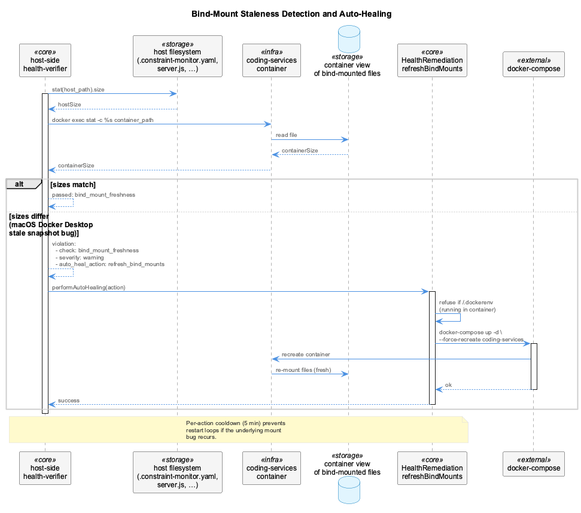
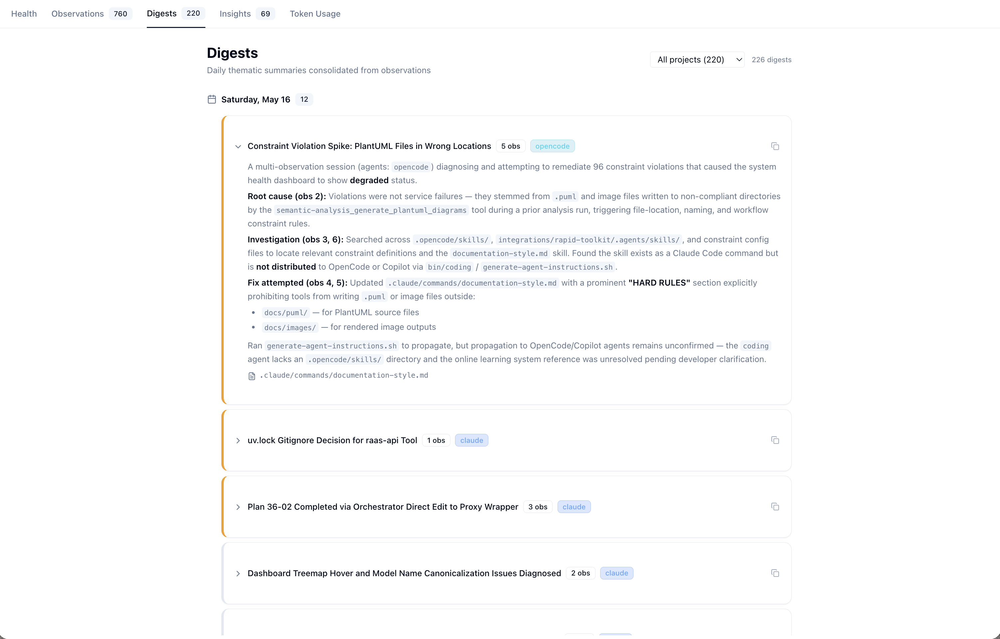
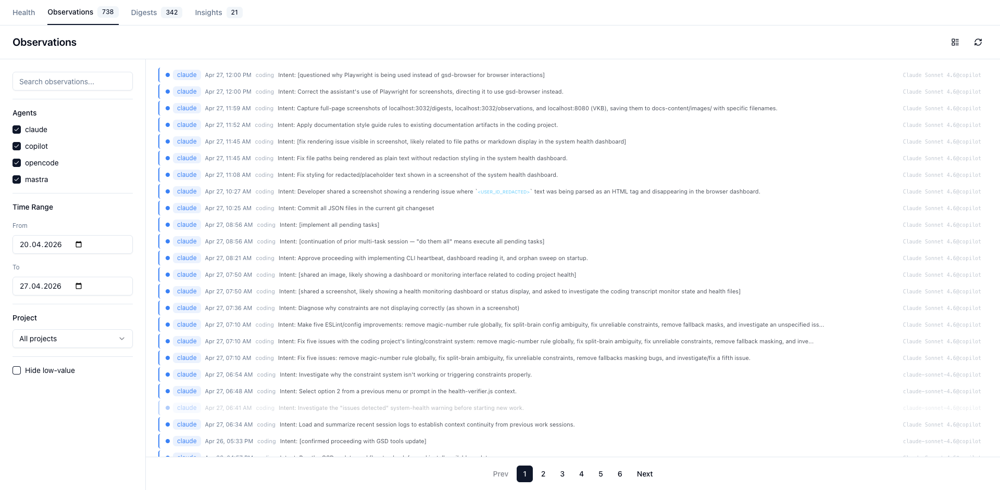
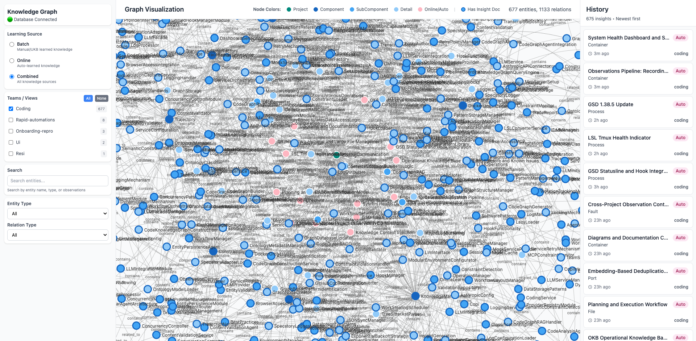

# Release Notes

Highlights since the v6.0 Knowledge Context Injection milestone (commit `0fdb7665`). Grouped by subsystem.

---

## Knowledge Injection — Copilot per-turn injection is now version-adaptive multi-channel (2026-07-19)

GitHub Copilot previously received only a session-start baseline; per-turn injection was blocked because Copilot filesystem hooks can only inject via an `additionalContext` field, and *which* event's `additionalContext` is honored changes between Copilot versions (`postToolUse` on ≤ 1.0.71; `userPromptSubmitted` newly on 1.0.72+, where `postToolUse` went flaky). A fixed channel was never upgrade-safe.

`src/hooks/copilot-channel-capabilities.js` now maps the installed Copilot version to the set of channels to emit on, and that set *is* the deduplication:

| Copilot version | Emit set | Result |
|-----------------|----------|--------|
| ≤ 1.0.71 | `postToolUse` only | injected once |
| 1.0.72 – 1.0.x | `userPromptSubmitted` only | injected once, no duplicate |
| unknown / ≥ 1.1.0 | both (fail-safe) | delivery guaranteed, tolerates one duplicate |

Retrieval runs at most once per turn (block cached in the session stash; the fail-safe second channel reuses it). Overrides: `COPILOT_KB_CHANNELS` (force set / `none`), `COPILOT_VERSION` (test). `scripts/verify-copilot-hook-injection.sh` reports which channel delivers after an upgrade, to keep the map honest. Resolver + end-to-end tests under `tests/experiments/copilot-*.test.mjs`.

See [Knowledge Context Injection](architecture/knowledge-injection.md#github-copilot-per-turn-version-adaptive-multi-channel).

---

## Observational Memory — SQLite → km-core cutover complete (2026-06-05)

Phase 44 Plans 12 → 18 finished cutting every production code path off the legacy `.observations/observations.db` SQLite file. The file was archived to `.observations/observations.db.archived.2026-06-05` after Plan 44-18 Tasks 1-4 landed (commits `cf6c8da45` → `c837dc421`).

| Surface | Path | Pre-cutover | Post-cutover |
|---------|------|-------------|--------------|
| Write path | `src/live-logging/ObservationWriter.js` | SQLite single-owner writer (Plan 44-13) | km-core `GraphKMStore.putEntity` |
| Consolidator + insights re-synth | `src/live-logging/ObservationConsolidator.js` | SQLite reads for day-range scan + insight metadata | km-core `findByOntologyClass` + `getEntity` (Plan 44-17) |
| Retention pruner | `src/live-logging/ObservationPruner.js` | SQLite cutoff DELETE | km-core `findByOntologyClass` + per-entity `deleteEntity` (Plan 44-18 Task 2) |
| Retrieval freshness-rerank | `src/retrieval/retrieval-service.js` | SQLite `json_extract` over insights | km-core `getEntity` per insight id (Plan 44-18 Task 3) |
| obs-api `/health` | `scripts/observations-api-server.mjs` | reported `dbPath` + `dbExists` for the SQLite file | reports km-core readiness only (Plan 44-18 Task 5) |

The deferred Plan 44-12 § "fully unused observations.db" success criterion — carried through 44-13, 44-14, 44-17 — is now honored. obs-api keeps running cleanly with no SQLite handle; the `DB_PATH` constant was dropped from the script in the Task 5 cleanup commit. The archived file is preserved in `.observations/` (gitignored under `*.db.archived*`) for one-shot historical inspection should a regression need pre-cutover data.

---

## Constraint System

A run-through of the persisted `violation-history.json` showed that 9,387 of 9,780 lifetime violations (96 %) were `no-magic-numbers` — its `\b\d{2,}\b` pattern matched any 2+ digit number including port numbers, PIDs, and Bash command digits. Critical-severity rules like `no-hardcoded-secrets` had fired exactly once in the same window. A second sweep uncovered a config split-brain: host hooks loaded `${CODING_REPO}/.constraint-monitor.yaml` while the in-container dashboard loaded a stale `integrations/mcp-constraint-monitor/constraints.yaml`. Same rules diverged across the two — `no-console-log` ran as `error` on the host but `warning` in the dashboard.

| Change | Where | Effect |
|--------|-------|--------|
| `no-magic-numbers` retired | YAMLs across all projects + integration defaults | Dashboard noise dropped from ~9.8k entries to ~80 real violations |
| Single canonical config | `.constraint-monitor.yaml` is the only source; bind-mounted into the container; `findProjectConfig()` throws when missing instead of falling back | Dashboard, hooks and tests now agree on the rule set |
| `semantic_validation` removed | Stripped flag from all YAMLs; deleted the LLM-suppression branch in `constraint-engine.js` | Regex matches are authoritative — `no-hardcoded-secrets`, `no-eval-usage`, `debug-not-speculate`, `no-ukb-bash-command` all fire reliably again |
| Engine errors re-thrown | `checkConstraintsDirectly` no longer returns zero violations on engine failure | Surface bugs (split-brain, missing config, …) instead of pretending nothing was checked |
| `no-backup-files` rule corrected | Added `applies_to: file_path` + `tool_filter: ['Edit','Write']` | The filename-only pattern now actually matches filenames |

See [Constraint System](core-systems/constraints.md).

---

## Health Monitoring

### Phase 33 follow-on: statusline + ETM pipeline (May 8)

Five intertwined bugs surfaced during a single debugging pass after the Phase 33 coordinator cutover. All fixed; published-doc set rewritten.

| Symptom | Root cause | Fix |
|---------|-----------|-----|
| `monitoring:health-verifier STOPPED` permanent on dashboard | `[program:health-verifier]` ran `health-verifier.js start`, but the daemon subcommand was deleted in plan 33-04. Block had been kept with `autostart=false` as a transitional shim. | Removed the supervisord block entirely (treatment matches the earlier `browser-access` removal). |
| `[LSL🔴]` red on healthy panes; "RA" project missing from rollup | The badge logic in `combined-status-line.js` matched only by `(tmuxPane, project)` then `(sid, project)` keys; ETMs are project-singletons and inherit only the launcher's TMUX_PANE/CLAUDE_SESSION_ID, so per-pane lookups missed. | Added a project-level fallback that aggregates "best verdict" across all heartbeat entries for the project; also `degraded` heartbeats now correctly surface as `[LSL🟡]`. |
| LSL files stop appearing; observations stop appearing; ETMs report `running` for hours with `exchangeCount=0` | The host-side ETM inherited `CODING_TOOLS_PATH=/coding` (the in-container bind-mount path) from the `claude-mcp` launcher. The redactor tried to load `/coding/.specstory/config/redaction-patterns.json` (doesn't exist on host); `initialize()` threw *after* the singleton variable was assigned, so every later `redact()` call returned "not initialized" and stalled the whole pipeline. | New `resolveHostCodingPath()` rejects in-container paths and falls back to `__dirname/..`. Redactor singleton is now assigned only after `initialize()` resolves so a thrown init doesn't poison the cache. |
| `[🏥⏰]` stale verifier badge stuck for 28 h | `getHealthVerifierStatus()` read `.health/verification-status.json`. Plan 33-04 retired the file but the badge still tried. | Migrated to `GET :3034/health/state`; synthesizes `criticalCount` / `overallStatus` from coordinator services + databases + container probe. |
| Right-edge residue: `12:411`, `12:5096`, `13:0656` | Two stacked layers: (a) the wrapper did `.trim()` on cached output, dropping all space padding; (b) tmux's `#(shell-cmd)` then strips trailing ASCII whitespace from the producer output. Padding was being lost twice. | Wrapper preserves trailing whitespace. Producer pads to ≥220 codepoints (lower-bound cell count, computed via `[...s].length`) and ends with a non-breaking space (U+00A0) that survives ASCII trim. tmux always truncates to exactly 200 cells, fully overwriting prior-render residue. |
| Project shows 🟢 despite hours of inactivity (cooling lifecycle broken) | Phase 33's coordinator surfaces `lsl_by_project` as a 3-state rollup; the per-project user-activity age (the signal the lifecycle depends on) was never plumbed through. | Statusline now stats `lsl[*].transcriptPath` mtime client-side and buckets into the documented thresholds. The 🟢 → 🟠 → 🟤 → ⚫ → 💤 lifecycle is restored. |

See [Health Monitoring](architecture/health-monitoring.md), [Status Line](guides/status-line.md), and the updated [`health-monitoring-overview.png`](images/health-monitoring-overview.png) / [`health-coordinator-architecture.png`](images/health-coordinator-architecture.png) diagrams.

### `host.docker.internal` rewriting

The host-side `health-verifier` daemon kept reporting the LLM CLI proxy "unavailable" because `host.docker.internal` doesn't resolve outside Docker (the rule is shared with the in-container verifier, where it works). `checkHTTPHealth` now rewrites `host.docker.internal:*` → `localhost:*` when running on the host (`/.dockerenv` not present).

### Bind-mount staleness supervision

macOS Docker Desktop occasionally caches single-file bind-mounts and stops reflecting later host edits — what the dashboard saw inside the container was a truncated snapshot of `server.js` (195901 bytes vs 200086 on the host), which broke startup with a syntax error mid-line.

A new `verifyBindMountFreshness` check compares host `stat` vs `docker exec stat` for each watched file. On size mismatch it raises a `bind_mount_freshness` violation and the `refresh_bind_mounts` remediation runs `docker-compose up -d --force-recreate coding-services`.

Watched files: `.constraint-monitor.yaml`, `.global-lsl-registry.json`, `server.js`, `consolidate-observations.js`. Add more in `config/health-verification-rules.json` under `services.bind_mount_freshness.files`.

See [Health Monitoring](architecture/health-monitoring.md).

---

## Observational Memory

### Single-owner observations gateway (May 3)

Periodic `observations.db.corrupted-*` files (10+ in 8 days) were traced to the canonical SQLite-on-Docker-Desktop-Mac corruption pattern: the host transcript monitor and the in-container dashboard both opened the file across the bind-mount boundary, and Apple Virtualization VM bind-mounts don't provide mmap coherence for SQLite's WAL/SHM shared memory.

A new host service — the **Observations API server** at `scripts/observations-api-server.mjs` (port 12436) — is now the single owner of `observations.db`. Every other consumer reaches the DB exclusively through this HTTP gateway:

| Consumer | Before | After |
|----------|--------|-------|
| Transcript monitor | `new ObservationWriter()` (direct SQLite) | `new ObservationApiClient()` POSTing `/api/observations/messages` |
| Dashboard reads (9 endpoints) | per-process readonly handle | thin HTTP forwarders to `host.docker.internal:12436` |
| Dashboard `POST /api/retrieve` | RetrievalService in container, opens DB | forward to host (RetrievalService runs in-process inside obs-api) |
| Dashboard `POST /api/consolidation/run` | spawn `consolidate-observations.js` child | forward to host (ObservationConsolidator runs in-process inside obs-api) |
| Container `.observations` mount | bind-mounted rw | **mount removed entirely** |

Pattern mirrors the OKB/VKB approach: one process owns the DB, everyone else over HTTP. Same five-phase rollout structure (build, migrate reads, migrate writes, migrate consolidation, drop bind mount). Verified by zero new corruption files in the 48 h window after cutover.

### Per-project consolidation (Apr 26)

Phases A/B/C/D made the pipeline project-aware end-to-end:

- Observations carry a `project` column populated by the LSL classifier
- `ObservationConsolidator` partitions observations by project before LLM grouping
- Insight synthesis runs per project — no more cross-project narrative bleed
- Digests/Insights pages have a project selector; API accepts `?project=<name>`

### Consolidator heartbeat + orphan sweep (Apr, superseded May 3)

Detached spawn originally protected the SQLite WAL across dashboard restarts but left orphans immortal — a 21-hour 0%-CPU run on the live dashboard prompted the work. The CLI wrote `.observations/consolidation-heartbeat.json` every ~2 s; any stderr line refreshed it; the dashboard swept stale heartbeats on startup.

This whole arrangement was **superseded by the single-owner gateway above**: consolidation now runs in-process inside the host obs-api server, which already owns the SQLite handle. No spawn, no second writer, no orphan-child timeout enforcement to worry about. The heartbeat file is still written (now by the obs-api itself) and surfaced via `/api/consolidation/status` so the dashboard's progress indicator continues to work.

### Mixed-topic safeguards in the knowledge graph

A bug walk-through discovered a "GSD Statusline and Hook Integration" entity that bundled a GSD changelog with an LSL tmux-indicator description. Cause: fuzzy name dedup at Jaccard ≥ 0.7 with no content check — `hook` + `integration` overlap was enough to trigger a merge.

Three guards now run in `persistence-agent.ts`:

| Gate | Threshold | Notes |
|------|-----------|-------|
| Name match | Jaccard ≥ 0.85 over non-generic words; stop-list filters `hook`, `integration`, `system`, … | Requires ≥1 shared non-generic word |
| Content veto | Observation Jaccard ≥ 0.15 | Refuses merges where content disagrees |
| Mixed-topic detector | Pairwise observation Jaccard < 0.10 sets `metadata.mixed_topics: true` | Surfaced as an amber panel in the VKB Node Details |

### Sanitizer + redaction-pattern correction

- `ObservationSanitizer` repairs legacy `<AWS_SECRET_REDACTED>frag` corruption using sibling fields as the recovery oracle (e.g. matches by basename across `modifiedFiles` arrays).
- The `aws_secret_standalone` regex got lookarounds so a 40-char run inside a base64-like path can no longer be eaten as a "secret".

See [Observational Memory](core-systems/observational-memory.md).

---

---

## Token Usage

### Phase 36: per-(window, user) hourly exports + model-name canonicalization + treemap hover (May 16)

The Token Usage dashboard had two structural problems and one cosmetic one. All three closed in Phase 36 (7 plans).

**Per-(window, user) hourly exports.** The single `.data/llm-proxy-export/token-usage.json` blob ballooned past 600 KB / 1457 rows after ~24 h on a single contributor and would have caused git merge conflicts as soon as a second user pushed exports. Switched to the same filesystem convention LSL uses: `YYYY/MM/YYYY-MM-DD_HHMM-HHMM_<hash6>.json`. The time-window string is now sourced from the health coordinator's new `/health/state.lsl_meta.current_window` field (single source of truth, computed by `getTimeWindow(utcToLocalTime(now))`); the proxy fetches with a 30 s cache + local fallback. The 6-char user-hash is exported by the wrapper script (`_work/rapid-llm-proxy/bin/start-llm-proxy.sh`) as `LLM_PROXY_USER_HASH` before `exec node`, derived from `scripts/user-hash-generator.js` — same hash logic used everywhere else in the project so it cross-machine-reproduces deterministically.

**Cross-user merge contract.** A `user_hash` column and `UNIQUE INDEX (user_hash, id)` discriminate rows. `hydrateFromExports()` runs on every proxy boot (the old `count > 0 → return` early-exit is gone) and recursively walks `<baseDir>/**/*.json`, inserting with `ON CONFLICT(user_hash, id) DO NOTHING`. After `git pull` brings down a peer's `..._<other-hash>.json`, the next proxy kickstart ingests it and the peer's rows appear in the dashboard alongside yours. The composite key supplies idempotency, not skipping.

**`.gitignore` cleanup.** `.db-wal` / `.db-shm` / `.db-journal` weren't covered by the old `*.db` rule, so `.data/llm-proxy/` kept showing dirty in `git status` whenever the SQLite WAL had data. Replaced the single `*.db` line with explicit per-suffix entries matching the existing `.data/knowledge.db` precedent. `!.data/llm-proxy-export/` allow-list preserves the new per-hour files for git.

**Model-name canonicalization.** The "By Model" panel was showing 8 rows for what is really 3 Claude models — each provider returns its own spelling and the proxy was recording the raw string verbatim. `canonicalizeModelName(raw)` now lives next to the existing model-maps in `proxy-bridge/server.mjs` and is applied once at the `logTokenCall` site. The raw spelling is preserved per row in a new `model_raw` column (same PRAGMA-guarded ALTER pattern as `user_hash`) so debugging "did Copilot serve the dated snapshot or the rolling alias?" still works. An idempotent backfill on proxy init rewrites pre-existing rows once (`WHERE model_raw IS NULL`); re-runs are no-ops.

| Family | Variants seen pre-canonicalization | Canonical |
|---|---|---|
| Sonnet 4.6 | `claude-sonnet-4-6` (CLI), `claude-sonnet-4.6` (Copilot), `Claude Sonnet 4.6` (Anthropic), bare `sonnet` (CLI fallback) | `claude-sonnet-4.6` |
| Haiku 4.5 | `claude-haiku-4-5-20251001` (Copilot dated), `claude-haiku-4.5`, `Claude Haiku 4.5` | `claude-haiku-4.5` |
| Opus 4.6 | (proactive) | `claude-opus-4.6` |

**Treemap hover tooltip.** The "Hover for details" subtitle on the Token Consumption by Process treemap was aspirational — `recharts.Treemap` had no `<Tooltip>` child, and the inline label only renders for boxes ≥ 40×30 px so smaller processes were silent. Added a `TreemapTooltip` component (process / total / in/out split / calls / avg latency) wired as a Tooltip child, plus an SVG `<title>` element inside each rect for screen-reader/native-browser fallback. Playwright-verified on both small (`reap-final`, 81×44 px) and large (`observation-writer`, 981×352 px) boxes.

See [Token Usage](architecture/token-usage.md) and the updated [`token-usage-architecture.png`](images/token-usage-architecture.png) / [`health-mon-tokens-usage.png`](images/health-mon-tokens-usage.png) diagrams.

---

## Dashboard / VKB rendering

| Fix | Symptom |
|-----|---------|
| `escapeHtml` pre-pass in `renderMarkdown` | `<USER_ID_REDACTED>` rendered as an unknown HTML element and disappeared, producing visually broken paths like `/Users//Agentic/...` |
| Redaction-token styling | All `<*_REDACTED>` markers now render as smaller (`text-[0.78em]`) sky-blue spans across observations, digests, and insights |
| `renderWithRedactionStyling` helper | Plain-text path renders (digest `filesTouched`, observation compact-row summaries) get the same treatment |
| VKB mixed-topic panel | Entities with `metadata.mixed_topics: true` get an amber warning in the Node Details sidebar |
| Hanging-indent bullets | Wrapped bullet text now aligns to the body, not under the marker |

---

## Other

- `coding-services` Docker config: `CODING_REPO=/coding` env var; bind-mounts for `.constraint-monitor.yaml`, `.mcp-sync/`, the dashboard `server.js`, and the consolidator CLI.
- `gsd-update` workflow: bumped to GSD `1.38.5` after the previous run; 7 custom skills (codecraft-zuul-api, ddad-rpu, find-docs, fix-vulnerabilities, get-codeowner, raas-api, s3-session-search) were preserved across the install.
- Cross-team relations + project-anchor connection in the KG so insights from online learning attach to the right project node.
