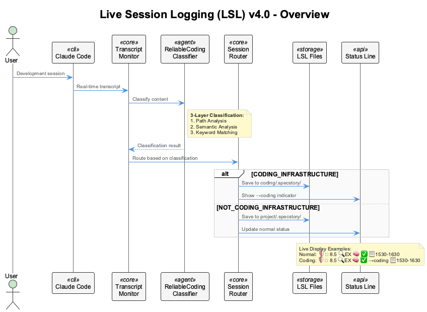
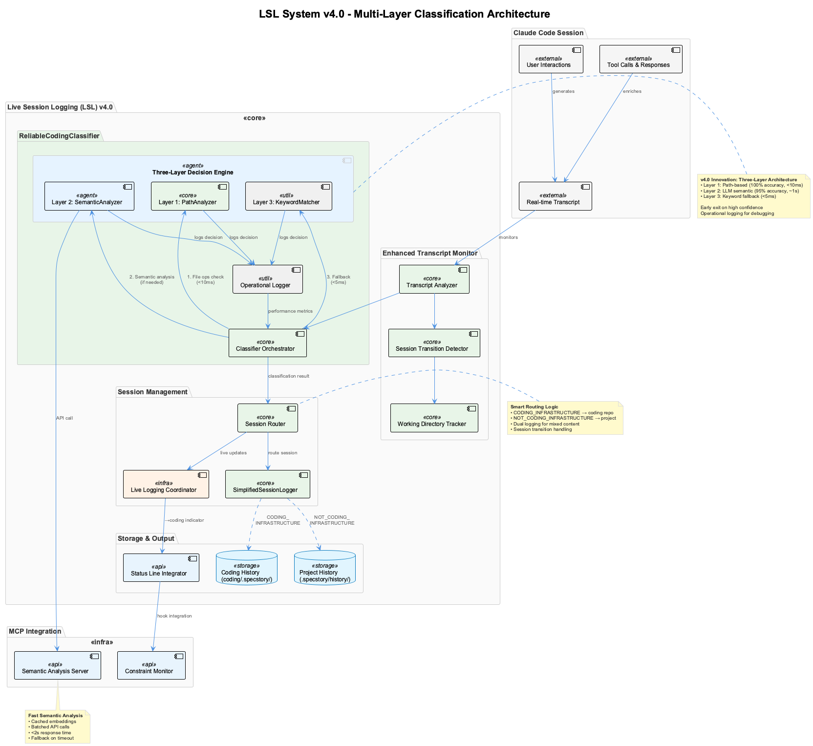
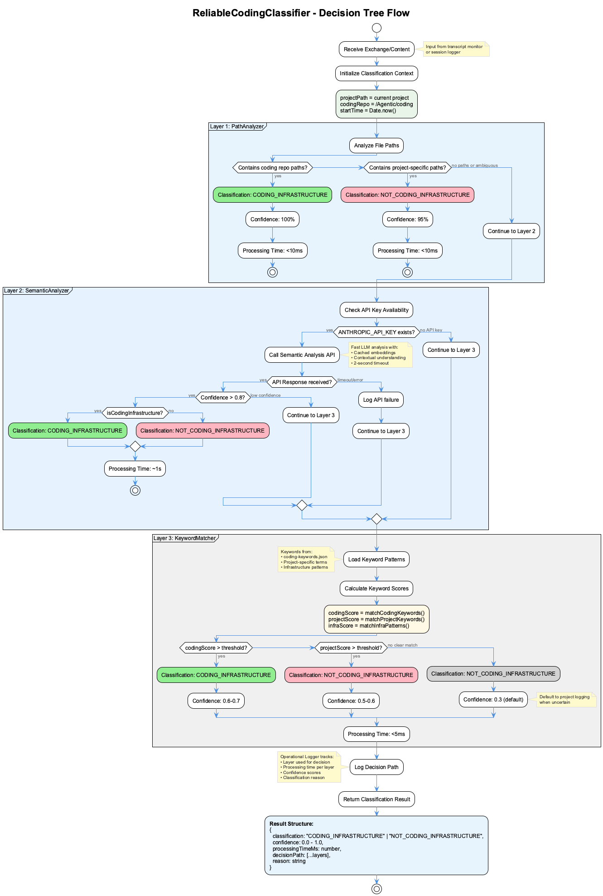
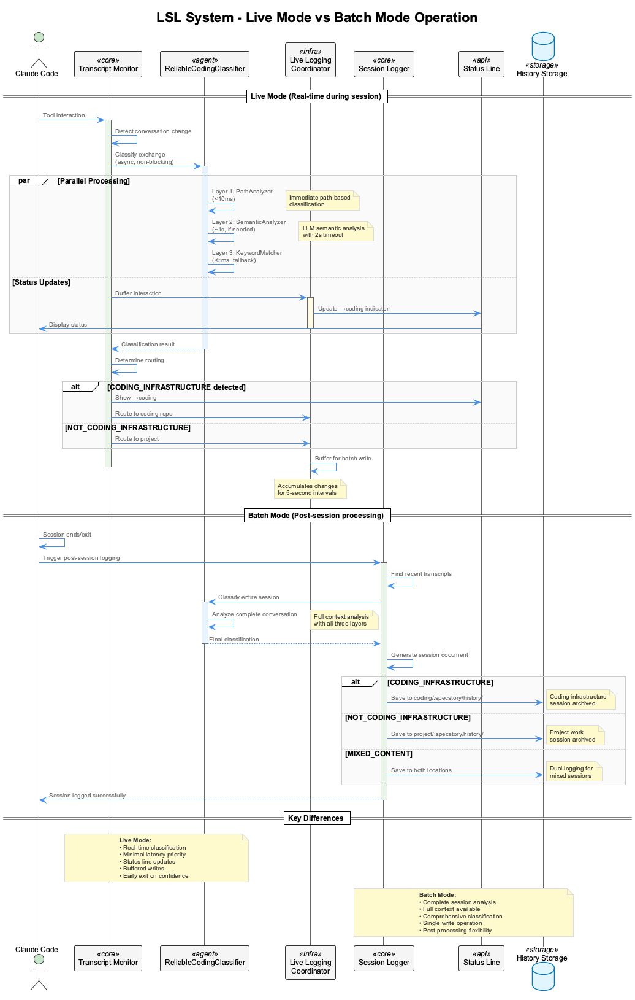

# Live Session Logging (LSL) System v4.0 Documentation

## Table of Contents
1. [Overview](#overview)
2. [Architecture](#architecture)
3. [ReliableCodingClassifier](#reliablecodingclassifier)
4. [Operating Modes](#operating-modes)
5. [Components](#components)
6. [Configuration](#configuration)
7. [Troubleshooting](#troubleshooting)

## Overview

The Live Session Logging (LSL) system is an intelligent session monitoring and classification framework for Claude Code. It automatically detects, classifies, and routes development sessions to appropriate storage locations based on whether work is being done on the coding infrastructure itself or on other projects.

### Key Features
- **Real-time Classification**: Sub-second classification during active sessions
- **95%+ Accuracy**: Three-layer decision engine for reliable classification
- **Smart Routing**: Automatic routing to appropriate `.specstory/history/` directories
- **Live Status Updates**: Visual indicator (`→coding`) when working on infrastructure
- **Dual-mode Operation**: Live monitoring during sessions, batch processing post-session



## Architecture

The LSL v4.0 architecture introduces a sophisticated multi-layer classification system that replaces the previous FastEmbeddingClassifier with the ReliableCodingClassifier.



### Core Components

1. **Enhanced Transcript Monitor**
   - Monitors real-time Claude Code transcripts
   - Detects session transitions and context changes
   - Tracks working directory for path resolution

2. **ReliableCodingClassifier**
   - Three-layer decision engine
   - <2 second total processing time
   - 95%+ classification accuracy
   - Operational logging for debugging

3. **Session Management**
   - Routes sessions based on classification
   - Manages dual logging for mixed content
   - Integrates with status line for live updates

4. **Storage System**
   - Project history: `<project>/.specstory/history/`
   - Coding history: `/Agentic/coding/.specstory/history/`
   - Timestamped session files with full conversation context

## ReliableCodingClassifier

The heart of LSL v4.0 is the ReliableCodingClassifier, implementing a three-layer decision architecture:



### Layer 1: PathAnalyzer
- **Purpose**: Fast path-based classification
- **Speed**: <10ms
- **Accuracy**: 100% for path-containing content
- **Method**: Analyzes file paths mentioned in exchanges
- **Early Exit**: Returns immediately on high-confidence path match

### Layer 2: SemanticAnalyzer
- **Purpose**: LLM-based semantic understanding
- **Speed**: ~1 second (2s timeout)
- **Accuracy**: 95% for complex content
- **Method**: Uses Anthropic API for semantic analysis
- **Features**:
  - Cached embeddings for performance
  - Contextual understanding of code discussions
  - Fallback on API timeout or errors

### Layer 3: KeywordMatcher
- **Purpose**: Fast fallback classification
- **Speed**: <5ms
- **Accuracy**: 60-70% for keyword-rich content
- **Method**: Pattern matching against keyword databases
- **Sources**:
  - `coding-keywords.json`
  - Project-specific patterns
  - Infrastructure terminology

### Classification Results

The classifier returns a structured result:

```javascript
{
  classification: "CODING_INFRASTRUCTURE" | "NOT_CODING_INFRASTRUCTURE",
  confidence: 0.0 - 1.0,
  processingTimeMs: number,
  decisionPath: [
    { layer: "PathAnalyzer", confidence: 0.95, timeMs: 8 },
    { layer: "SemanticAnalyzer", confidence: 0.85, timeMs: 1200 },
    { layer: "KeywordMatcher", confidence: 0.65, timeMs: 3 }
  ],
  reason: "Detected coding repository paths in exchange"
}
```

## Operating Modes

The LSL system operates in two distinct modes to balance real-time performance with comprehensive analysis:



### Live Mode (Real-time)
- **When**: During active Claude Code sessions
- **Priority**: Minimal latency (<2s)
- **Features**:
  - Non-blocking classification
  - Immediate status line updates
  - Buffered writes (5-second intervals)
  - Early exit on high confidence

### Batch Mode (Post-session)
- **When**: On session end or `coding` script exit
- **Priority**: Comprehensive analysis
- **Features**:
  - Full conversation context
  - Complete classification with all layers
  - Single atomic write operation
  - Handles session recovery on crashes

## Components

### File Structure

```
/Agentic/coding/
├── src/live-logging/
│   ├── ReliableCodingClassifier.js    # Main classifier
│   ├── PathAnalyzer.js                # Layer 1 implementation
│   ├── SemanticAnalyzer.js            # Layer 2 implementation
│   ├── KeywordMatcher.js              # Layer 3 implementation
│   ├── OperationalLogger.js           # Decision logging
│   └── StatusLineIntegrator.js        # Live status updates
│
├── scripts/
│   ├── enhanced-transcript-monitor.js  # Real-time monitoring
│   ├── live-logging-coordinator.js     # Session coordination
│   ├── simplified-session-logger.js    # Batch processing
│   └── start-services.sh              # Service startup
│
└── docs/
    ├── LSL-SYSTEM-DOCUMENTATION.md    # This document
    ├── puml/                           # PlantUML diagrams
    └── images/                         # Generated diagrams
```

### Key Scripts

1. **enhanced-transcript-monitor.js**
   - Monitors Claude Code transcript files
   - Detects conversation changes
   - Triggers classification on new exchanges
   - Updates status line in real-time

2. **live-logging-coordinator.js**
   - Coordinates between monitor and classifier
   - Manages buffered writes
   - Handles MCP integration
   - Maintains session state

3. **simplified-session-logger.js**
   - Post-session batch processing
   - Full conversation extraction
   - Final classification and routing
   - Fallback for failed live logging

4. **start-services.sh**
   - Starts all LSL components
   - Verifies service health
   - Manages process lifecycle
   - Integrates with `coding` script

## Configuration

### Environment Variables

```bash
# Required
CODING_REPO=/Users/q284340/Agentic/coding
CODING_TARGET_PROJECT=/path/to/current/project

# Optional (for semantic analysis)
ANTHROPIC_API_KEY=your-api-key
OPENAI_API_KEY=your-api-key  # Fallback

# Debug
DEBUG_LSL=true  # Enable debug logging
```

### Keyword Configuration

Edit `scripts/coding-keywords.json` to customize classification keywords:

```json
{
  "codingInfrastructure": [
    "LSL", "transcript", "classifier", "session-logger",
    "coding-repo", "status-line", "MCP", "constraint-monitor"
  ],
  "projectSpecific": [
    "your-project-terms", "domain-keywords"
  ]
}
```

### Status Line Integration

The LSL system integrates with the Claude Code status line to show real-time classification:

- Normal: `🛡️ 8.5 🔍EX 🧠 ✅ 📋1530-1630`
- Coding: `🛡️ 8.5 🔍EX 🧠 ✅ →coding 📋1530-1630`

## Troubleshooting

### Common Issues

1. **Services Not Starting (2/4 running)**
   - Check if old processes are still running: `ps aux | grep -E "transcript|logging"`
   - Kill stale processes: `pkill -f "enhanced-transcript-monitor"`
   - Restart services: `coding` (restarts automatically)

2. **Null Pointer Errors**
   - Ensure classifier is initialized: Check `await classifier.initialize()`
   - Verify environment variables are set
   - Check for missing dependencies

3. **Classification Errors**
   - Verify API keys for semantic analysis
   - Check keyword configuration file exists
   - Review operational logs in `live-logging.log`

4. **Wrong Classification**
   - Review decision path in logs
   - Adjust keyword patterns if needed
   - Check if semantic analyzer has API access

### Debug Commands

```bash
# Check service status
ps aux | grep -E "transcript|logging|coordinator"

# View live logs
tail -f /Users/q284340/Agentic/coding/live-logging.log

# Test classifier directly
node /Users/q284340/Agentic/coding/scripts/validate-classifier.js

# Check session files
ls -la ~/.specstory/history/*.md
```

### Log Files

- `live-logging.log` - Live logging coordinator output
- `transcript-monitor.log` - Transcript monitor activity
- `vkb-server.log` - Knowledge base server logs
- `.services-running.json` - Current service status

## Performance Metrics

### Classification Speed
- **PathAnalyzer**: <10ms (instant for path detection)
- **SemanticAnalyzer**: ~1s average (2s timeout)
- **KeywordMatcher**: <5ms (pattern matching)
- **Total**: <2s worst case, <15ms best case

### Accuracy Rates
- **Path-based**: 100% (when paths present)
- **Semantic**: 95% (with API access)
- **Keyword**: 60-70% (fallback)
- **Overall**: 95%+ (combined layers)

### Resource Usage
- **Memory**: ~100MB for LSL processes
- **CPU**: <5% during monitoring
- **Disk**: Session files ~10-50KB each
- **Network**: Minimal (only for semantic API)

## Future Enhancements

1. **Machine Learning Integration**
   - Train custom models on session history
   - Improve keyword patterns automatically
   - Adaptive confidence thresholds

2. **Enhanced Semantic Analysis**
   - Local LLM integration for offline mode
   - Multi-model consensus for critical decisions
   - Context-aware embeddings

3. **Advanced Routing**
   - Multi-project simultaneous tracking
   - Custom routing rules per project
   - Team collaboration features

4. **Performance Optimizations**
   - Parallel layer processing
   - Predictive caching
   - Streaming classification

---

## Related Documentation

- [Simplified Startup System](simplified-startup-system.md)
- [Multi-Topic Session Splitting](MULTI-TOPIC-SESSION-SPLITTING.md)
- [Coding Infrastructure README](../README.md)

---

*Last Updated: September 2025 | Version: 4.0*