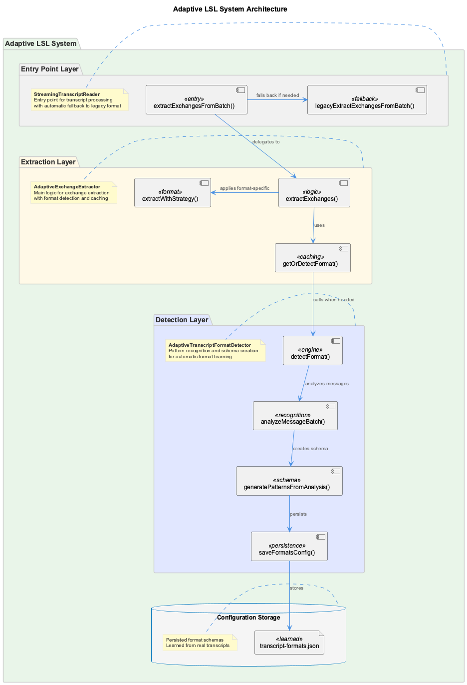

# Adaptive Transcript Format Detection System

## Overview

The Adaptive Transcript Format Detection System automatically learns and adapts to changes in Claude Code transcript formats, ensuring robust LSL (Live Session Logging) functionality even when transcript structures evolve.

## Problem Solved

Previously, the LSL system was hardcoded to handle specific transcript formats. When Claude Code changed its transcript format from `user`/`assistant` messages to `human_turn_start`/`claude_turn_start`, the system failed to extract exchanges, resulting in missing LSL files.

## Architecture



The system consists of four layers:
1. **Entry Point Layer** (StreamingTranscriptReader) - Entry points with automatic fallback
2. **Extraction Layer** (AdaptiveExchangeExtractor) - Main logic with format detection and caching
3. **Detection Layer** (AdaptiveTranscriptFormatDetector) - Pattern recognition and schema creation
4. **Configuration Storage** - Persisted format schemas learned from real transcripts

## Key Components

### 1. AdaptiveTranscriptFormatDetector

**Purpose**: Analyzes transcript messages to detect patterns and create format schemas.

**Features**:
- **Pattern Recognition**: Identifies message types, structures, and exchange patterns
- **Confidence Scoring**: Calculates reliability metrics for detected formats
- **Schema Generation**: Creates extraction rules from detected patterns
- **Persistence**: Stores learned formats in JSON config file

**Core Methods**:
```javascript
// Detect format from message batch
const formatResult = detector.detectFormat(messages);

// Get extraction strategy for detected format
const strategy = detector.getExtractionStrategy(formatResult);
```

### 2. AdaptiveExchangeExtractor

**Purpose**: Applies appropriate extraction strategy based on detected format.

**Features**:
- **Dynamic Strategy Selection**: Chooses extraction method based on format
- **Caching**: Avoids re-detecting formats for similar message batches
- **Fallback Handling**: Gracefully handles unknown formats
- **Performance Tracking**: Monitors extraction statistics

**Core Methods**:
```javascript
// Extract exchanges using adaptive method
const exchanges = extractor.extractExchanges(messages);

// Get performance statistics
const stats = extractor.getStats();
```

### 3. Configuration System

**Location**: `/Users/<username>/Agentic/coding/config/transcript-formats.json`

**Structure**:
```json
{
  "version": "1.0",
  "lastUpdated": "2025-09-16T04:59:38.760Z",
  "formats": {
    "claude-code-v2": {
      "id": "claude-code-v2",
      "name": "Claude Code V2 Format",
      "patterns": {
        "userTurnStart": { "type": "human_turn_start", "required": ["uuid", "timestamp"] },
        "assistantTurnEnd": { "type": "claude_turn_end", "required": ["content"] }
      },
      "confidence": 1.0,
      "firstSeen": "2025-09-15T00:00:00.000Z",
      "lastSeen": "2025-09-16T04:59:38.760Z"
    }
  }
}
```

## Currently Supported Formats

### 1. Claude Legacy V1 (Sept 13-14, 2025)
- **Message Types**: `user`, `assistant`
- **Structure**: `{ type: "user", message: { role: "user", content: "..." } }`
- **Tool Handling**: Tool calls embedded in message content arrays

### 2. Claude Code V2 (Sept 15+, 2025)
- **Message Types**: `human_turn_start`, `human_turn_end`, `claude_turn_start`, `claude_turn_end`
- **Structure**: Separate turn boundaries with content in `*_turn_end` messages
- **Tool Handling**: Dedicated `tool_use` and `tool_result` message types

## Usage

### Basic Usage (Automatic)
```javascript
import StreamingTranscriptReader from './StreamingTranscriptReader.js';

// Adaptive extraction is enabled by default
const exchanges = StreamingTranscriptReader.extractExchangesFromBatch(messages);
```

### Advanced Usage (Custom Config)
```javascript
import AdaptiveExchangeExtractor from './AdaptiveExchangeExtractor.js';

const extractor = new AdaptiveExchangeExtractor({
  debug: true,
  configPath: '/custom/path/transcript-formats.json',
  formatCacheTTL: 600000, // 10 minutes
  minSampleSize: 100
});

const exchanges = extractor.extractExchanges(messages);
const stats = extractor.getStats();
```

### Legacy Mode (Backwards Compatibility)
```javascript
// Disable adaptive extraction to use legacy method
const exchanges = StreamingTranscriptReader.extractExchangesFromBatch(messages, {
  useAdaptiveExtraction: false
});
```

## How It Handles Format Changes

### 1. New Format Detection
When a new transcript format is encountered:

1. **Analysis**: System analyzes message structure patterns
2. **Confidence Scoring**: Calculates reliability of detected patterns
3. **Schema Creation**: Generates extraction rules automatically
4. **Storage**: Saves new format to config file
5. **Application**: Uses new rules for future extractions

### 2. Format Evolution
When existing formats change slightly:

1. **Pattern Matching**: Attempts to match against known formats
2. **Adaptation**: Updates existing format confidence and patterns
3. **Fallback**: Uses robust fallback extraction if confidence drops
4. **Learning**: Gradually adapts to format variations

### 3. Graceful Degradation
When format detection fails:

1. **Fallback Mode**: Uses comprehensive legacy extraction method
2. **Still Functional**: Continues to extract exchanges successfully
3. **No Data Loss**: Ensures LSL files are still generated
4. **Self-Recovery**: Learns from successful extractions

## Testing

Run the test suite to verify adaptive detection:

```bash
node scripts/test-adaptive-extraction.js
```

**Test Coverage**:
- Format detection accuracy
- Extraction comparison (adaptive vs legacy)
- Performance statistics
- Config file generation
- Future format simulation

## Benefits

### 1. **Robustness**
- ✅ Automatically handles format changes
- ✅ No manual code updates required
- ✅ Graceful fallback for edge cases

### 2. **Self-Improving**
- ✅ Learns from every transcript processed
- ✅ Improves accuracy over time
- ✅ Adapts to format variations

### 3. **Performance**
- ✅ Caches format detection results
- ✅ Avoids redundant analysis
- ✅ Maintains extraction speed

### 4. **Maintainability**
- ✅ Reduces manual maintenance overhead
- ✅ Clear configuration management
- ✅ Comprehensive logging and debugging

## Configuration Options

### AdaptiveTranscriptFormatDetector Options
```javascript
{
  configPath: '/path/to/transcript-formats.json',  // Config file location
  sampleSize: 100,                                // Messages to analyze
  confidenceThreshold: 0.8,                       // Minimum confidence for detection
  debug: false                                     // Enable debug logging
}
```

### AdaptiveExchangeExtractor Options
```javascript
{
  debug: false,                 // Enable debug logging
  formatCacheTTL: 300000,      // Cache TTL in milliseconds (5 min)
  minSampleSize: 50,           // Minimum messages for format detection
  configPath: '/custom/path'   // Custom config file path
}
```

## Monitoring and Debugging

### Debug Logging
Enable debug logging to monitor format detection:

```javascript
const extractor = new AdaptiveExchangeExtractor({ debug: true });
```

**Debug Output**:
```
[AdaptiveFormatDetector] Loaded 2 known formats from config
[AdaptiveExtractor] Using extraction strategy for format: claude-legacy-v1
[AdaptiveExtractor] Extracted 1578 exchanges using format: claude-legacy-v1
```

### Statistics Monitoring
Track system performance:

```javascript
const stats = extractor.getStats();
console.log(stats);
// {
//   formatsDetected: 2,
//   exchangesExtracted: 1578,
//   cacheHits: 15,
//   cacheMisses: 3,
//   knownFormats: 2
// }
```

## Future Format Resilience

The system is designed to handle unknown future formats:

1. **Automatic Learning**: New formats are detected and learned automatically
2. **Pattern Recognition**: Advanced analysis identifies exchange boundaries
3. **Fallback Safety**: Always maintains extraction capability
4. **Continuous Improvement**: Each processed transcript improves the system

This ensures the LSL system remains functional regardless of how Claude Code's transcript format evolves in the future.