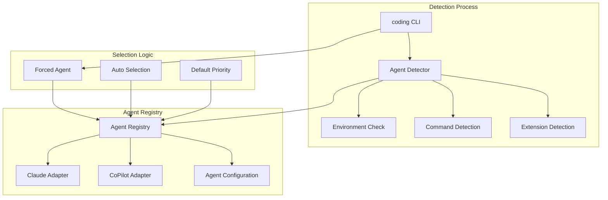
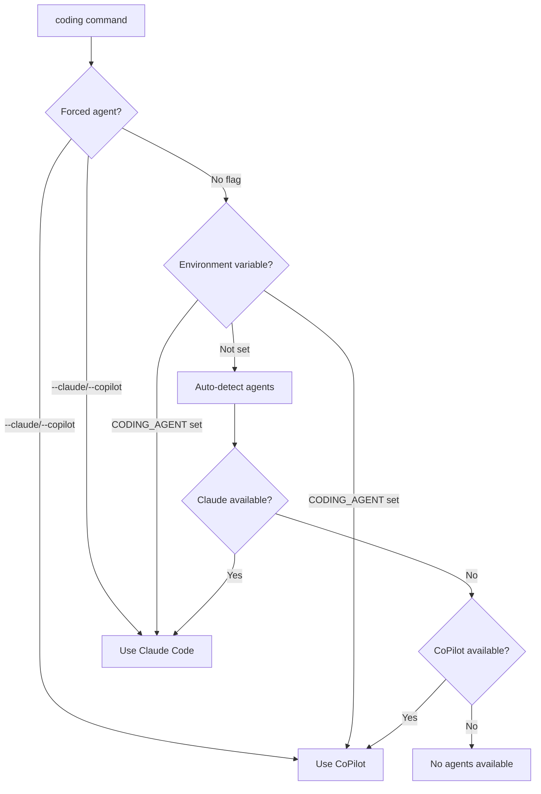
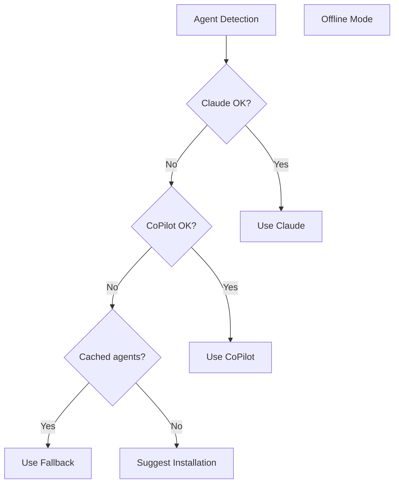

# Agent Detection & Switching Architecture

This document describes how the agent-agnostic coding tools detect, select, and switch between different AI coding agents.

## Overview

The agent detection system provides automatic discovery and selection of available AI coding agents, with support for manual override and configuration persistence.

## Architecture



## Agent Detection Methods

### 1. Claude Code Detection

```javascript
async detectClaude() {
  // Check for claude command
  const hasClaudeCLI = await commandExists('claude');
  
  // Check for MCP configuration
  const mcpConfigPaths = [
    '~/.config/claude/claude_desktop_config.json',
    '~/Library/Application Support/Claude/claude_desktop_config.json'
  ];
  
  for (const configPath of mcpConfigPaths) {
    if (await fileExists(configPath)) {
      return true;
    }
  }
  
  return false;
}
```

**Detection Criteria:**
- ✅ `claude` command available in PATH
- ✅ MCP configuration file exists
- ✅ MCP servers properly configured

### 2. GitHub CoPilot Detection

```javascript
async detectCoPilot() {
  // Check for GitHub CLI
  const hasGHCLI = await commandExists('gh');
  if (!hasGHCLI) return false;

  // Check for CoPilot extension
  const extensionList = await executeCommand('gh extension list');
  return extensionList.includes('copilot');
}
```

**Detection Criteria:**
- ✅ `gh` command available in PATH
- ✅ CoPilot extension installed (`gh extension list | grep copilot`)

### 3. Specstory Extension Detection

```javascript
async detectSpecstoryExtension() {
  const vscodeExtPath = getVSCodeExtensionsPath();
  const specstoryPaths = await glob(`${vscodeExtPath}/*specstory*`);
  return specstoryPaths.length > 0;
}
```

**Detection Criteria:**
- ✅ VSCode extensions directory accessible
- ✅ Specstory extension installed

## Agent Selection Priority

### Default Priority Order

1. **Claude Code** (if available)
   - Mature MCP integration
   - Full feature set
   - Proven stability

2. **GitHub CoPilot** (if Claude unavailable)
   - Fallback services provide feature parity
   - Wide availability
   - Good performance

### Selection Logic



## Command-Line Interface

### Agent Selection Flags

```bash
# Auto-detection (default)
coding

# Force specific agent
coding --claude
coding --copilot
coding --agent claude
coding --agent copilot

# With commands
coding --copilot suggest "add error handling"
coding --claude explain "this function"
```

### Environment Variables

```bash
# Persistent agent selection
export CODING_AGENT="copilot"

# Agent-specific configuration
export CODING_TOOLS_GRAPH_DB="~/.memory.json"
export CLAUDE_MCP_CONFIG="~/custom-mcp.json"
```

## Agent Capabilities

### Capability Matrix

| Capability | Claude Code | CoPilot | Detection Method |
|------------|-------------|---------|------------------|
| **Code Chat** | ✅ Native | ✅ Native | Command availability |
| **Memory Graph** | ✅ MCP | ✅ Graphology | MCP config / Node.js |
| **Browser Automation** | ✅ MCP | ✅ Playwright | MCP config / npm package |
| **Conversation Logging** | ✅ MCP | ✅ Specstory/File | MCP config / VSCode ext |
| **Code Suggestions** | ✅ Native | ✅ Native | Command availability |

### Capability Detection

```javascript
class AgentDetector {
  getCapabilities(agent) {
    const capabilities = {
      claude: ['mcp', 'memory', 'browser', 'logging'],
      copilot: ['code-completion', 'chat']
    };
    
    // Add dynamic capabilities based on environment
    if (agent === 'copilot') {
      if (this.hasNodeJS()) capabilities.copilot.push('memory');
      if (this.hasPlaywright()) capabilities.copilot.push('browser');
      if (this.hasSpecstory()) capabilities.copilot.push('logging');
    }
    
    return capabilities[agent] || [];
  }
}
```

## Configuration Management

### Agent Configuration File

```json
{
  "defaultAgent": "claude",
  "agents": {
    "claude": {
      "command": "claude",
      "configPath": "claude-code-mcp-processed.json",
      "features": {
        "memory": "mcp",
        "browser": "mcp",
        "logging": "mcp"
      },
      "healthCheck": {
        "command": "claude --version",
        "timeout": 5000
      }
    },
    "copilot": {
      "command": "gh copilot",
      "features": {
        "memory": "graphology",
        "browser": "playwright", 
        "logging": "specstory-or-file"
      },
      "healthCheck": {
        "command": "gh copilot --version",
        "timeout": 5000
      }
    }
  }
}
```

### Health Checks

```javascript
async function healthCheck(agent) {
  const config = getAgentConfig(agent);
  
  try {
    await executeCommand(config.healthCheck.command, {
      timeout: config.healthCheck.timeout
    });
    return { healthy: true };
  } catch (error) {
    return { 
      healthy: false, 
      error: error.message 
    };
  }
}
```

## Error Handling

### Detection Failures

```javascript
class AgentDetectionError extends Error {
  constructor(agent, reason) {
    super(`Failed to detect ${agent}: ${reason}`);
    this.agent = agent;
    this.reason = reason;
  }
}

// Graceful degradation
async function detectWithFallback() {
  try {
    return await detector.detectAll();
  } catch (error) {
    console.warn('Detection failed, using cached results');
    return getCachedDetectionResults();
  }
}
```

### Agent Unavailability



## Testing

### Detection Tests

```javascript
describe('Agent Detection', () => {
  test('detects Claude when available', async () => {
    mockCommand('claude', { exists: true });
    mockFile('~/.config/claude/claude_desktop_config.json', { exists: true });
    
    const result = await detector.detectClaude();
    expect(result).toBe(true);
  });
  
  test('detects CoPilot when available', async () => {
    mockCommand('gh', { exists: true });
    mockCommand('gh extension list', { output: 'copilot' });
    
    const result = await detector.detectCoPilot();
    expect(result).toBe(true);
  });
});
```

### Integration Tests

```bash
# Test agent switching
npm run test:agent-switching

# Test capability detection
npm run test:capabilities

# Test fallback behavior
npm run test:fallbacks
```

## Performance Considerations

### Caching

```javascript
class CachedAgentDetector extends AgentDetector {
  constructor(cacheTimeout = 60000) {
    super();
    this.cache = new Map();
    this.cacheTimeout = cacheTimeout;
  }
  
  async detectAll() {
    const cacheKey = 'agent-detection';
    const cached = this.cache.get(cacheKey);
    
    if (cached && Date.now() - cached.timestamp < this.cacheTimeout) {
      return cached.result;
    }
    
    const result = await super.detectAll();
    this.cache.set(cacheKey, {
      result,
      timestamp: Date.now()
    });
    
    return result;
  }
}
```

### Parallel Detection

```javascript
async detectAll() {
  // Run all detections in parallel
  const [claude, copilot, specstory] = await Promise.all([
    this.detectClaude(),
    this.detectCoPilot(), 
    this.detectSpecstoryExtension()
  ]);
  
  return { claude, copilot, specstory };
}
```

## Security Considerations

### Command Injection Prevention

```javascript
async function safeExecuteCommand(command) {
  // Validate command against whitelist
  const allowedCommands = ['claude', 'gh', 'node', 'npm'];
  const baseCommand = command.split(' ')[0];
  
  if (!allowedCommands.includes(baseCommand)) {
    throw new Error(`Command not allowed: ${baseCommand}`);
  }
  
  return await executeCommand(command);
}
```

### Path Traversal Prevention

```javascript
function safePath(inputPath) {
  const resolved = path.resolve(inputPath);
  const safe = path.normalize(resolved);
  
  // Prevent path traversal
  if (safe.includes('..') || !safe.startsWith(os.homedir())) {
    throw new Error('Unsafe path detected');
  }
  
  return safe;
}
```

This agent detection system ensures reliable, secure, and performant discovery and selection of AI coding agents while providing flexibility for both automatic and manual agent selection.