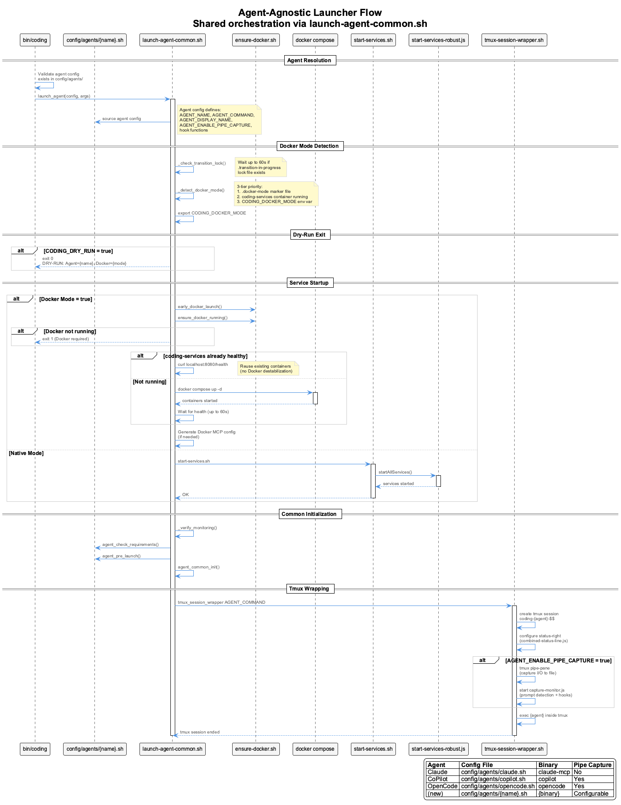

# Agent Integration Guide

**Adding New Coding Agents to the Coding System**

This guide provides step-by-step instructions for integrating new AI coding assistants into the agent-agnostic Coding system.

---

## Table of Contents

1. [Overview](#overview)
2. [Architecture](#architecture)
3. [Integration Requirements](#integration-requirements)
4. [Step-by-Step Integration](#step-by-step-integration)
5. [API Contract](#api-contract)
6. [Testing](#testing)
7. [Examples](#examples)

---

## Overview

The Coding system is designed to support multiple AI coding assistants through a unified adapter pattern. All agents share common infrastructure:

- **Live Session Logging (LSL)** - Automatic transcript monitoring
- **Knowledge Management** - VKB server and semantic analysis
- **Constraint Monitoring** - Real-time code quality enforcement
- **Health Monitoring** - System status and recovery
- **Browser Automation** - Playwright integration
- **Session Continuity** - Cross-session context

---

## Architecture

### Agent-Agnostic Design


The system follows a layered architecture:

1. **Agent Layer** - Your AI coding assistant (Claude, CoPilot, etc.)
2. **Launcher Layer** - Agent-specific startup scripts
3. **Common Setup Layer** - Shared initialization (LSL, monitoring, gitignore)
4. **Shared Services Layer** - VKB, Semantic Analysis, Constraints, LSL
5. **Adapter Layer** - Abstract interface + agent implementations

### Integration Flow


When integrating a new agent:
1. Agent detection checks availability
2. Registry provides adapter instance
3. Launcher sources common setup
4. Docker mode detection (3-tier: marker file, container check, env var)
5. Services start (Docker compose or native, based on mode)
6. Agent launches with full integration

### Launcher Docker Mode Flow



Both `launch-claude.sh` and `launch-copilot.sh` share identical Docker mode logic:
- Transition lock checking (waits for mode transitions)
- 3-tier Docker mode detection
- Conditional Docker/native service startup
- Container reuse (health check before starting new containers)
- Docker MCP config generation

---

## Integration Requirements

### Minimum Requirements

#### 1. **CLI Availability**
Your agent must be accessible via command-line interface.

```bash
# Example
$ newagent --version
newagent v1.0.0
```

#### 2. **Transcript Generation**
Your agent must write conversation transcripts in JSONL format.

**Required transcript format:**
```jsonl
{"type":"prompt_set","timestamp":1234567890,"messages":[...],"toolUses":[...]}
```

**Transcript location:**
- Must write to `~/.claude/projects/{project-hash}/` or similar
- Must be accessible for LSL system monitoring
- Must update in real-time during session

#### 3. **AgentAdapter Implementation**
You must implement the `AgentAdapter` interface (see [API Contract](#api-contract)).

#### 4. **Launcher Script**
Create `scripts/launch-{agent}.sh` that:
- Sources `agent-common-setup.sh`
- Checks transition lock (Docker mode transitions)
- Detects Docker mode (`.docker-mode` marker, running containers, env var)
- Starts shared services (Docker compose or native, based on mode)
- Calls `agent_common_init()`
- Launches your agent

---

## Step-by-Step Integration

### Step 1: Create Agent Adapter

Create `lib/adapters/{agent-name}.js`:

```javascript
import AgentAdapter from '../agent-adapter.js';

class MyAgentAdapter extends AgentAdapter {
  constructor(config = {}) {
    super(config);
    this.capabilities = ['memory', 'browser', 'logging'];
  }

  async initialize() {
    // Initialize services, check requirements
    this.initialized = true;
  }

  async cleanup() {
    // Cleanup resources
  }

  async executeCommand(command, args = []) {
    // Execute agent command
    return await executeCommand(`myagent ${command} ${args.join(' ')}`);
  }

  // Implement all required methods (see API Contract)
  async memoryCreate(entities) { /* ... */ }
  async memorySearch(query) { /* ... */ }
  async browserNavigate(url) { /* ... */ }
  async logConversation(data) { /* ... */ }
  // ... (see full API contract below)
}

export default MyAgentAdapter;
```

### Step 2: Register Adapter

Update `lib/agent-registry.js`:

```javascript
import MyAgentAdapter from './adapters/myagent.js';

// Register built-in adapters
registry.register('claude', ClaudeMCPAdapter);
registry.register('copilot', CoPilotAdapter);
registry.register('myagent', MyAgentAdapter);  // Add your agent
```

### Step 3: Add Agent Detection

Update `lib/agent-detector.js`:

```javascript
class AgentDetector {
  constructor() {
    this.detectionMethods = {
      claude: this.detectClaude.bind(this),
      copilot: this.detectCoPilot.bind(this),
      myagent: this.detectMyAgent.bind(this)  // Add detection
    };
    this.capabilities = {
      claude: ['mcp', 'memory', 'browser', 'logging'],
      copilot: ['code-completion', 'chat'],
      myagent: ['memory', 'browser', 'logging']  // Add capabilities
    };
  }

  async detectMyAgent() {
    // Check if your agent is installed and available
    const hasMyAgent = await commandExists('myagent');
    if (!hasMyAgent) return false;

    // Additional checks (config files, etc.)
    return true;
  }
}
```

### Step 4: Create Launcher Script

Create `scripts/launch-myagent.sh`:

```bash
#!/bin/bash

# Launch My Agent with integrated services
# Supports both native and Docker modes

set -e

SCRIPT_DIR="$(cd "$(dirname "${BASH_SOURCE[0]}")" && pwd)"
CODING_REPO="$(dirname "$SCRIPT_DIR")"
export CODING_REPO

# Source agent-common setup functions
source "$SCRIPT_DIR/agent-common-setup.sh"

log() {
  echo "[MyAgent] $1"
}

# ============================================
# Docker Mode Transition Check
# ============================================
check_transition_lock() {
  local lock_file="$CODING_REPO/.transition-in-progress"
  local wait_count=0
  local max_wait=60
  while [ -f "$lock_file" ] && [ $wait_count -lt $max_wait ]; do
    if [ $wait_count -eq 0 ]; then
      log "⏳ Docker mode transition in progress, waiting..."
    fi
    sleep 1
    ((wait_count++))
  done
}
check_transition_lock

# ============================================
# Docker Mode Detection
# ============================================
DOCKER_MODE=false
if [ -f "$CODING_REPO/.docker-mode" ]; then
  DOCKER_MODE=true
fi
if timeout 5 docker ps --format '{{.Names}}' 2>/dev/null | grep -q "coding-services"; then
  DOCKER_MODE=true
fi
if [ "$CODING_DOCKER_MODE" = "true" ]; then
  DOCKER_MODE=true
fi
export CODING_DOCKER_MODE="$DOCKER_MODE"

# Generate unique session ID
SESSION_ID="myagent-$$-$(date +%s)"
export MYAGENT_SESSION_ID="$SESSION_ID"

# Register session with Process State Manager
register_session() {
  log "Registering session: $SESSION_ID"
  node "$SCRIPT_DIR/psm-register-session.js" "$SESSION_ID" "$$" "$TARGET_PROJECT_DIR" 2>/dev/null || {
    log "Warning: Failed to register session"
  }
}

# Cleanup handler
cleanup_session() {
  log "Session ending - cleaning up services..."
  node "$SCRIPT_DIR/psm-session-cleanup.js" "$SESSION_ID" 2>/dev/null || {
    log "Warning: Session cleanup failed"
  }
}

trap cleanup_session EXIT INT TERM

# ... (monitoring verification, target project setup, env loading) ...

# Docker Auto-Start (shared logic)
source "$SCRIPT_DIR/ensure-docker.sh"
detect_platform

# Start Services (Docker or Native mode)
if [ "$DOCKER_MODE" = true ]; then
  # Docker mode: reuse coding-services container
  if curl -sf http://localhost:8080/health >/dev/null 2>&1; then
    log "✅ coding-services already running - reusing"
  else
    docker compose -f "$CODING_REPO/docker/docker-compose.yml" up -d
    # ... health check loop ...
  fi
else
  # Native mode: start-services.sh
  "$CODING_REPO/start-services.sh"
fi

# Run agent-common initialization (LSL, monitoring, gitignore, etc.)
agent_common_init "$TARGET_PROJECT_DIR" "$CODING_REPO"

# Set environment variables
export CODING_AGENT="myagent"
export CODING_TOOLS_PATH="$CODING_REPO"
export TRANSCRIPT_SOURCE_PROJECT="$TARGET_PROJECT_DIR"

# Change to target project directory
cd "$TARGET_PROJECT_DIR"
log "Changed working directory to: $(pwd)"

# Launch your agent
log "Launching My Agent..."
exec myagent "$@"
```

Make it executable:
```bash
chmod +x scripts/launch-myagent.sh
```

### Step 5: Update Main Launcher

Update `bin/coding` to add routing:

```bash
case "$AGENT" in
  claude)
    log "Launching Claude Code with MCP..."
    exec "$SCRIPT_DIR/../scripts/launch-claude.sh" "${ARGS[@]}"
    ;;
  copilot)
    log "Launching CoPilot with fallback services..."
    exec "$SCRIPT_DIR/../scripts/launch-copilot.sh" "${ARGS[@]}"
    ;;
  myagent)  # Add your agent
    log "Launching My Agent with integrated services..."
    exec "$SCRIPT_DIR/../scripts/launch-myagent.sh" "${ARGS[@]}"
    ;;
esac
```

### Step 6: Test Integration

```bash
# Test detection
./bin/coding --help

# Test launch
./bin/coding --agent myagent

# Verify services
./bin/coding --lsl-status
```

---

## API Contract

### AgentAdapter Interface

**All agents MUST implement these methods:**

#### Lifecycle Methods

```typescript
/**
 * Initialize the adapter and required services
 * Called once during adapter instantiation
 */
async initialize(): Promise<void>

/**
 * Cleanup resources when shutting down
 * Called during graceful termination
 */
async cleanup(): Promise<void>
```

#### Command Execution

```typescript
/**
 * Execute a command with the agent
 * @param command - Command to execute
 * @param args - Command arguments
 * @returns Command result
 */
async executeCommand(command: string, args: string[]): Promise<any>
```

#### Memory Operations

```typescript
/**
 * Create entities in the knowledge graph
 * @param entities - Array of entity objects
 * @returns Creation result with counts
 */
async memoryCreate(entities: Entity[]): Promise<CreateResult>

/**
 * Create relations between entities
 * @param relations - Array of relation objects
 * @returns Creation result
 */
async memoryCreateRelations(relations: Relation[]): Promise<CreateResult>

/**
 * Search for nodes in the knowledge graph
 * @param query - Search query string
 * @returns Array of matching entities
 */
async memorySearch(query: string): Promise<Entity[]>

/**
 * Read the entire knowledge graph
 * @returns Full graph data (nodes + edges)
 */
async memoryRead(): Promise<GraphData>

/**
 * Delete entities from the knowledge graph
 * @param entityNames - Names of entities to delete
 * @returns Deletion result with counts
 */
async memoryDelete(entityNames: string[]): Promise<DeleteResult>
```

#### Browser Operations

```typescript
/**
 * Navigate to a URL in the browser
 * @param url - URL to navigate to
 * @returns Navigation result
 */
async browserNavigate(url: string): Promise<NavigationResult>

/**
 * Perform an action on a web page
 * @param action - Action description (e.g., "Click the login button")
 * @param variables - Variables for action templates
 * @returns Action result
 */
async browserAct(action: string, variables: Record<string, any>): Promise<ActionResult>

/**
 * Extract content from the current page
 * @returns Extracted text content
 */
async browserExtract(): Promise<string>

/**
 * Take a screenshot of the current page
 * @param options - Screenshot options (fullPage, etc.)
 * @returns Screenshot buffer
 */
async browserScreenshot(options?: ScreenshotOptions): Promise<Buffer>
```

#### Logging Operations

```typescript
/**
 * Log a conversation entry
 * @param data - Conversation data to log
 * @returns Log result with file path
 */
async logConversation(data: ConversationEntry): Promise<LogResult>

/**
 * Read conversation history
 * @param options - Query options (limit, startDate, etc.)
 * @returns Array of conversation entries
 */
async readConversationHistory(options?: HistoryOptions): Promise<ConversationEntry[]>
```

#### Utility Methods

```typescript
/**
 * Check if the adapter has a specific capability
 * @param capability - Capability to check
 * @returns true if capability is supported
 */
hasCapability(capability: string): boolean

/**
 * Get all capabilities of this adapter
 * @returns Array of capability strings
 */
getCapabilities(): string[]

/**
 * Check if the adapter is initialized
 * @returns true if initialized
 */
isInitialized(): boolean
```

### Type Definitions

```typescript
interface Entity {
  name: string;
  entityType: string;
  observations: string[];
  significance?: number;
  created?: string;
  lastUpdated?: string;
  metadata?: Record<string, any>;
}

interface Relation {
  from: string;
  to: string;
  relationType: string;
  created?: string;
  metadata?: Record<string, any>;
}

interface GraphData {
  nodes: Entity[];
  edges: Relation[];
  metadata?: {
    nodeCount: number;
    edgeCount: number;
    lastAccessed: string;
  };
}

interface CreateResult {
  success: boolean;
  created?: number;
  updated?: number;
  total?: number;
  errors?: string[];
}

interface DeleteResult {
  success: boolean;
  deleted: number;
  notFound: number;
}

interface NavigationResult {
  success: boolean;
  url?: string;
  error?: string;
}

interface ActionResult {
  success: boolean;
  result?: any;
  error?: string;
}

interface ConversationEntry {
  timestamp: string;
  type: string;
  content: any;
  metadata?: Record<string, any>;
}

interface LogResult {
  success: boolean;
  logFile?: string;
  error?: string;
}

interface HistoryOptions {
  limit?: number;
  startDate?: Date;
  endDate?: Date;
  type?: string;
}
```

---

## Testing

### Test Checklist

- [ ] **Detection**: Agent detected by `AgentDetector`
- [ ] **Launch**: Agent starts via `./bin/coding --agent myagent`
- [ ] **LSL**: Transcripts monitored and classified
- [ ] **Gitignore**: `.specstory/logs/` tracked in git
- [ ] **Monitoring**: StatusLine health monitoring active
- [ ] **Memory**: Knowledge operations work
- [ ] **Browser**: Browser automation functional
- [ ] **Logging**: Session logs created
- [ ] **Cleanup**: Graceful shutdown works
- [ ] **Cross-session**: Session continuity maintained

### Validation Commands

```bash
# Check agent detection
./bin/coding --help

# Launch agent
./bin/coding --agent myagent

# Check LSL status
./bin/coding --lsl-status

# Verify gitignore
git check-ignore .specstory/logs/

# Check services
ps aux | grep "vkb-server\|semantic-analysis\|constraint-monitor"

# Check session logs
ls -la .specstory/history/

# Check classification logs
ls -la .specstory/logs/classification/
```

---

## Examples

### Claude Code Integration

See `lib/adapters/claude-mcp.js` and `scripts/launch-claude.sh` for reference implementation.

**Key features:**
- MCP servers for memory/browser/logging
- Automatic MCP config detection
- Memory sync on startup

### GitHub CoPilot Integration

See `lib/adapters/copilot.js` and `scripts/launch-copilot.sh` for reference implementation.

**Key features:**
- Full Docker mode support (identical to Claude launcher)
- Transition lock checking and Docker mode detection
- Docker/Native conditional service startup
- Container reuse (detects already-running coding-services)
- Fallback services (Graphology, Playwright)
- HTTP adapter server for tool integration
- GitHub CLI verification

---

## Troubleshooting

### Agent Not Detected

Check:
1. Is the agent command in PATH?
2. Does `detectMyAgent()` method work correctly?
3. Is the agent registered in `agent-registry.js`?

### LSL Not Working

Check:
1. Does agent write transcripts in JSONL format?
2. Is transcript directory accessible?
3. Is `.specstory/logs/` tracked in git?

### Services Not Starting

Check:
1. Are required ports available (8080, etc.)?
2. Is Docker running (for Constraint Monitor)?
3. Does `start-services.sh` complete successfully?

### Memory Operations Failing

Check:
1. Is adapter initialized?
2. Are memory operations implemented?
3. Is VKB server running on port 8080?

---

## References

- [Agent Adapter API Reference](integrations/api-reference.md)
- [Architecture Overview](architecture/README.md)
- [Live Session Logging](lsl/README.md)
- [Constraint Monitoring](constraints/README.md)
- [Status Line System](health-system/README.md)

---

## Support

For questions or issues:
1. Check existing integrations (Claude, CoPilot)
2. Review API contract and requirements
3. Test with validation commands
4. Open GitHub issue with integration details
