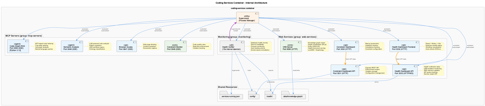

# Coding System Architecture Report

A comprehensive overview of the "coding" infrastructure system - a containerized development environment providing MCP servers, knowledge management, code analysis, and health monitoring services.

---

## System Overview

The coding system runs as a Docker Compose stack with 4 containers and 8 internal services, designed to augment Claude Code (CLI agent) with specialized AI-powered tools.

| Metric | Value |
|--------|-------|
| Total Containers | 4 |
| Internal Services | 8 (managed by supervisord) |
| Exposed Ports | 11 |
| Total Memory Usage | ~1.13 GB |
| Total CPU Usage | ~3.15% |
| Network | Bridge (coding-network) |

---

## Container Architecture


### Containers

| Container | Image | Role | Ports | Memory |
|-----------|-------|------|-------|--------|
| `coding-services` | docker-coding-services | Main application (8 services) | 8080, 3032-3033, 3847-3850 | ~17.9% |
| `coding-qdrant` | qdrant/qdrant:latest | Vector database | 6333, 6334 | ~2.7% |
| `coding-memgraph` | memgraph-platform:latest | Graph database (code) | 7687, 3100 | ~2.6% |
| `coding-redis` | redis:7-alpine | Cache & state | 6379 | ~0.1% |

### Container Dependencies

```
coding-services
  ├── depends_on: qdrant (healthy)
  ├── depends_on: redis (healthy)
  └── depends_on: memgraph (healthy)
```

All containers communicate over the `coding-network` bridge network using container hostnames (`qdrant`, `redis`, `memgraph`).

---

## Internal Services (coding-services container)



The `coding-services` container runs **supervisord** as PID 1, managing 8 services organized into 3 groups:

### Group: mcp-servers (priority: 100)

These are MCP (Model Context Protocol) servers exposed via SSE (Server-Sent Events), consumed by Claude Code.

| Service | Port | Language | Purpose |
|---------|------|----------|---------|
| **semantic-analysis** | 3848 | TypeScript | LLM-powered code analysis, UKB workflow engine, ontology classification, pattern extraction |
| **browser-access** | 3847 | TypeScript | Web page fetching, content extraction, screenshot capture |
| **constraint-monitor** | 3849 | TypeScript | Code quality rules enforcement, real-time violation tracking |
| **code-graph-rag** | 3850 | Python 3.12 | AST-based code indexing via Tree-sitter, call graph analysis, natural language code queries |

### Group: web-services (priority: 50)

User-facing web applications and APIs.

| Service | Port | Purpose |
|---------|------|---------|
| **vkb-server** | 8080 | Knowledge graph viewer (D3.js visualization), entity CRUD API, insight document serving |
| **health-dashboard** | 3033 | Health verification API, UKB workflow monitoring, SSE real-time updates, API quota checking |
| **health-dashboard-frontend** | 3032 | React + Redux UI, real-time health status, workflow visualization |

### Group: monitoring (priority: 200)

Background monitoring services.

| Service | Interval | Purpose |
|---------|----------|---------|
| **health-verifier** | 15s | Database health checks, service availability, process monitoring, Docker-aware auto-healing |

---

## Data Flow


### Storage Layer Interactions

| Service | Qdrant | Redis | Memgraph | LevelDB |
|---------|--------|-------|----------|---------|
| semantic-analysis | Embeddings & search | Response cache | - | - |
| code-graph-rag | - | - | AST nodes & relations | - |
| constraint-monitor | Constraint embeddings | Enforcement state | - | - |
| vkb-server | Semantic search | - | - | Knowledge graph (Graphology) |
| UKB workflow | Entity vectors | - | - | Persist entities |

### Knowledge Management Pipeline

```
Git History / Session Logs
       │
       ▼
  Semantic Analysis (LLM)
       │
       ▼
  Ontology Classification
       │
       ▼
  Entity Deduplication
       │
       ▼
  Quality Assurance
       │
       ▼
  Persistence (LevelDB + Qdrant)
       │
       ▼
  VKB Viewer (visualization)
```

---

## Port Map

### External Access (host → container)

| Port | Service | Protocol | URL |
|------|---------|----------|-----|
| 8080 | VKB Knowledge Viewer | HTTP | http://localhost:8080 |
| 3032 | Health Dashboard UI | HTTP | http://localhost:3032 |
| 3033 | Health Dashboard API | HTTP/WS | http://localhost:3033 |
| 3847 | Browser Access MCP | SSE | http://localhost:3847 |
| 3848 | Semantic Analysis MCP | SSE | http://localhost:3848 |
| 3849 | Constraint Monitor MCP | SSE | http://localhost:3849 |
| 3850 | Code-Graph-RAG MCP | SSE | http://localhost:3850 |
| 6333 | Qdrant HTTP API | HTTP | http://localhost:6333 |
| 6334 | Qdrant gRPC | gRPC | localhost:6334 |
| 6379 | Redis | Redis protocol | localhost:6379 |
| 7687 | Memgraph Bolt | Bolt | localhost:7687 |
| 3100 | Memgraph Lab | HTTP | http://localhost:3100 |

### Internal Network (container → container)

| From | To | Address | Purpose |
|------|----|---------|---------|
| coding-services | qdrant | http://qdrant:6333 | Vector operations |
| coding-services | redis | redis://redis:6379 | Caching |
| coding-services | memgraph | bolt://memgraph:7687 | Code graph queries |

---

## Volume Mounts

### Docker-Managed Volumes

| Volume | Container | Mount Point | Purpose |
|--------|-----------|-------------|---------|
| qdrant-data | coding-qdrant | /qdrant/storage | Vector data persistence |
| redis-data | coding-redis | /data | Cache persistence (AOF) |
| memgraph-data | coding-memgraph | /var/lib/memgraph | Graph data persistence |

### Bind Mounts (host → coding-services)

| Host Path | Container Path | Mode | Purpose |
|-----------|---------------|------|---------|
| .data/ | /coding/.data | rw | Knowledge graph (LevelDB) |
| .specstory/ | /coding/.specstory | rw | Session logs (LSL) |
| .env | /coding/.env | ro | API keys & configuration |
| ~/Agentic/ | /workspace | ro | Source code workspace |

---

## Health Monitoring

The health-verifier daemon runs every 15 seconds and checks:

| Category | Check | Docker Behavior |
|----------|-------|-----------------|
| Databases | Qdrant availability | Uses QDRANT_URL env var (container hostname) |
| Databases | LevelDB lock | Disabled (VKB owns lock legitimately) |
| Services | VKB Server (:8080) | HTTP health check |
| Services | Constraint Monitor (:3849) | HTTP health check |
| Services | Health Dashboard API (:3033) | HTTP health check |
| Services | Dashboard frontend (:3030) | Disabled in Docker |
| Services | Transcript Monitor (LSL) | Disabled in Docker |
| Processes | Stale PIDs | PSM registry cleanup |

### Auto-Healing (Docker Mode)

When violations are detected, remediation uses `supervisorctl`:

```
restart_vkb_server        → supervisorctl restart web-services:vkb-server
restart_constraint_monitor → supervisorctl restart mcp-servers:constraint-monitor
restart_health_api        → supervisorctl restart web-services:health-dashboard
restart_health_frontend   → supervisorctl restart web-services:health-dashboard-frontend
kill_lock_holder          → SKIPPED (VKB owns lock)
start_qdrant             → SKIPPED (external container)
```

---

## Technology Stack

| Layer | Technology |
|-------|-----------|
| Process Management | supervisord |
| Container Orchestration | Docker Compose |
| Runtime (Node.js) | Node.js 22 (bookworm) |
| Runtime (Python) | Python 3.12 (via uv) |
| Frontend | React 18 + Redux Toolkit + Vite |
| Graph Storage | Graphology + LevelDB (classic-level) |
| Vector DB | Qdrant |
| Graph DB (Code) | Memgraph |
| Cache | Redis 7 |
| Code Parsing | Tree-sitter (multi-language) |
| MCP Transport | SSE (Server-Sent Events) |
| Health Monitoring | Custom daemon + proper-lockfile |
| Build System | Multi-stage Dockerfile |

---

## Docker Mode Transition

The system supports seamless switching between native (launchd) and Docker modes:

- **Native Mode**: Services run directly on macOS via launchd agents
- **Docker Mode**: All services containerized in the stack above
- **Transition**: Managed by `docker-mode-transition.js` with lock-based coordination
- **Indicator**: Status line shows `[🐳]` when in Docker mode

---

## Resource Usage (observed)

| Container | CPU | Memory | Notes |
|-----------|-----|--------|-------|
| coding-services | 2.35% | 17.89% (~1.34 GB) | 8 Node.js + 1 Python process |
| coding-qdrant | 1.11% | 2.71% (~202 MB) | Vector index in memory |
| coding-memgraph | 0.03% | 2.64% (~197 MB) | Idle (awaiting queries) |
| coding-redis | 0.53% | 0.11% (~8 MB) | Minimal cache usage |
| **Total** | **~4%** | **~23%** (~1.75 GB) | Well within 4G limit |

---

## Configuration Files

| File | Purpose |
|------|---------|
| `docker/docker-compose.yml` | Container orchestration |
| `docker/Dockerfile.coding-services` | Multi-stage build (5 stages) |
| `docker/supervisord.conf` | Process management |
| `docker/entrypoint.sh` | Database readiness + env setup |
| `config/health-verification-rules.json` | Health check rules |
| `.dockerignore` | Build context optimization |
| `.env` | API keys (ANTHROPIC, OPENAI, GOOGLE) |

---

*Generated: 2026-01-23 | System Status: Healthy (0 violations)*
