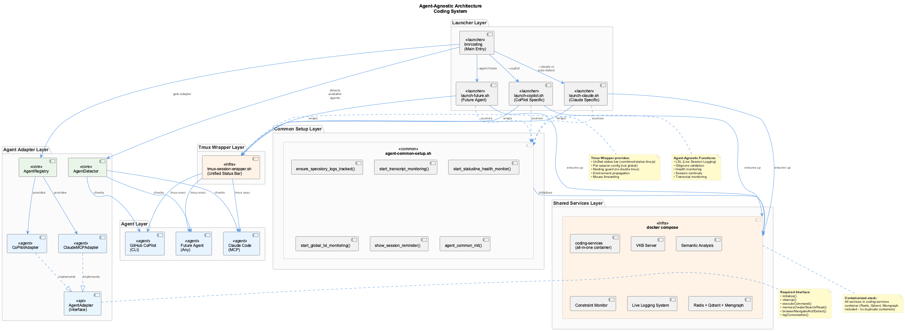
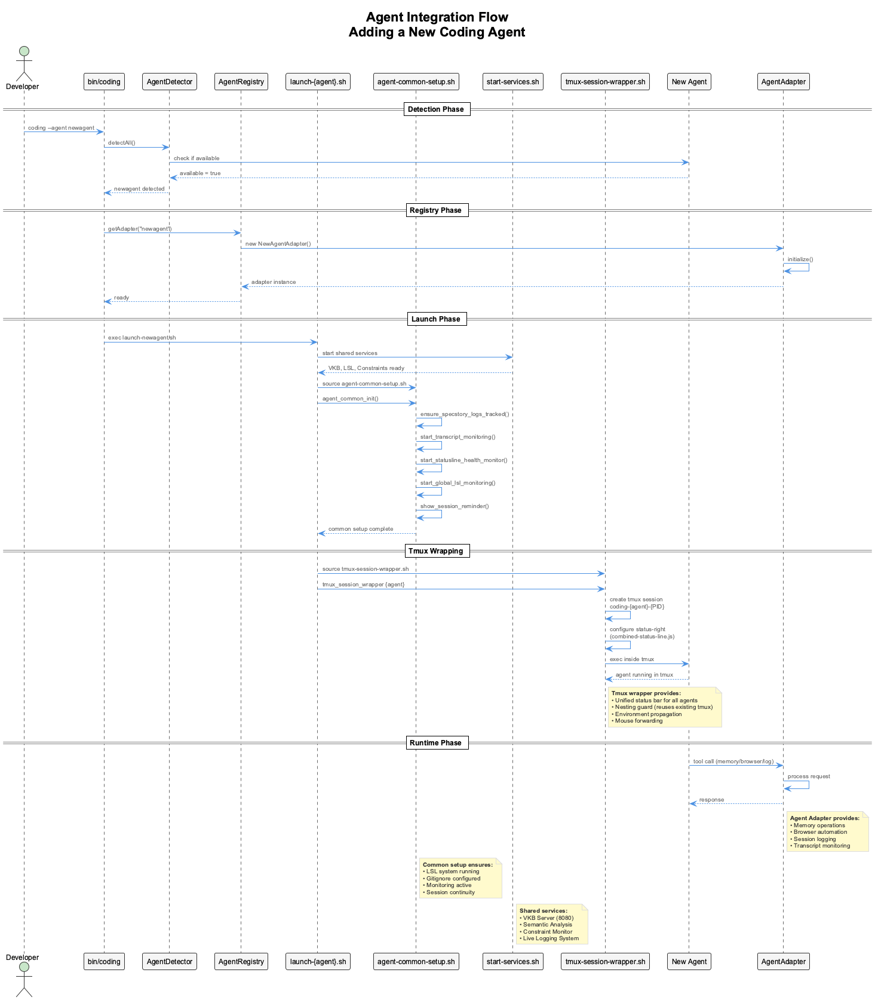

# Architecture Documentation

**Purpose**: Technical architecture documentation for the Coding system

---

## Overview

This section contains architectural documentation for developers who need to understand or modify the Coding system's internal structure.

> **Note**: Most system architecture is already covered in other sections:
> - [System Overview](../system-overview.md) - High-level architecture
> - [Core Systems](../) - Individual system architectures
> - [Integrations](../integrations/) - Integration component architectures

---

## Architecture Topics

### Core Architecture Concepts

Already documented in other sections:

- **[4-Layer Monitoring](../health-system/README.md#architecture)** - System health monitoring architecture
- **[LSL Classification](../lsl/README.md#architecture)** - Conversation classification and routing
- **[Constraint Monitoring](../constraints/README.md#architecture)** - Real-time constraint enforcement
- **[Trajectory Generation](../trajectories/README.md#architecture)** - Project analysis system

### Legacy Architecture Docs

The following architecture files are preserved for reference but have been superseded by the consolidated documentation:

- **agent-agnostic.md** - Agent-agnostic design (see [System Overview](../system-overview.md))
- **agent-detection.md** - Agent detection implementation details
- **cross-project-knowledge.md** - Cross-project knowledge sharing (see [Knowledge Management](../knowledge-management/README.md))
- **fallback-services.md** - Fallback services for CoPilot integration
- **unified-knowledge-flow.md** - Knowledge flow architecture
- **unified-memory-systems.md** - Multi-database synchronization
- **unified-system-overview.md** - Unified system architecture

These files will be moved to `.obsolete/docs/architecture/` during Phase 2H cleanup.

---

## Key Architectural Principles

### 1. Agent-Agnostic Design

The system supports multiple AI coding assistants through a unified adapter pattern with shared infrastructure:



**Architecture Layers:**

1. **Agent Layer** - AI coding assistants (Claude, CoPilot, future agents)
2. **Tmux Wrapper Layer** - All agents wrapped in tmux sessions via shared `tmux-session-wrapper.sh` for unified status bar
3. **Launcher Layer** - Agent-specific startup scripts (`launch-claude.sh`, `launch-copilot.sh`)
4. **Common Setup Layer** - Shared initialization (`agent-common-setup.sh`)
5. **Shared Services** - VKB, Semantic Analysis, Constraint Monitor, LSL
6. **Adapter Layer** - Abstract interface + agent implementations

**Benefits**:
- No vendor lock-in
- Consistent features across agents
- Team flexibility

### 2. Knowledge Persistence

Multi-tier knowledge storage for reliability and performance:

```
Runtime (Fast):
- MCP Memory (Claude)
- Graphology Graph (CoPilot)

Persistence (Reliable):
- shared-memory-*.json (git-tracked)
- .specstory/history/*.md (session logs)
```

### 3. Real-Time Quality Enforcement

PreToolUse hooks intercept tool calls BEFORE execution:

```
Claude attempts tool → PreToolUse Hook → Constraint Monitor
                                        ↓
                                    Violation? → Block
                                        ↓
                                       No → Allow
```

### 4. Monitoring & Observability

4-layer health monitoring with progressive escalation:

```
Layer 4: Service-Level Health (ukb, vkb, semantic-analysis)
Layer 3: System Verifier (LSL, constraints, trajectory)
Layer 2: System Coordinator (overall health, metrics)
Layer 1: System Watchdog (critical failures, alerts)
```

---

## Development Patterns

### Pattern: Constraint-Based Development

Define constraints before implementation:

```yaml
constraints:
  - id: no-parallel-versions
    pattern: /(v\d+|enhanced|improved|new|fixed)_/
    severity: CRITICAL
    message: Never create parallel versions - edit originals
```

### Pattern: Agent Detection

Automatic detection with fallback:

```javascript
const detector = new AgentDetector();
const available = await detector.detectAll();
// { claude: true, copilot: false }

const best = await detector.getBest();
// 'claude'
```

### Pattern: Knowledge Capture

Structured insight capture:

```bash
# Auto-analysis from git commits
ukb

# Structured interactive capture
ukb --interactive

# Visualization
vkb
```

---

## Adding New Agents

The system makes it easy to add new AI coding assistants. See the [Agent Integration Guide](../agent-integration-guide.md) for step-by-step instructions.



**Integration Steps:**
1. Implement `AgentAdapter` interface
2. Register adapter in `agent-registry.js`
3. Add detection in `agent-detector.js`
4. Create launcher script `launch-{agent}.sh` (using `tmux_session_wrapper` for the final launch)
5. Update `bin/coding` routing
6. Test with validation commands (verify tmux status bar renders)

**Required APIs:**
- Transcript generation (JSONL format)
- AgentAdapter interface implementation
- Memory operations (create/search/read)
- Browser automation (navigate/act/extract)
- Session logging

See [API Contract](../integrations/api-reference.md) for complete details.

---

## Deployment Modes

The Coding system supports two deployment modes:

### Native Mode (Default)

MCP servers run as native stdio processes, started and managed by Claude CLI:

- **Pros**: Simple setup, no Docker required, lower memory footprint
- **Cons**: Processes restart with each session
- **Best for**: Individual developers, single-machine setups

### Docker Mode (Containerized)

MCP servers run as HTTP/SSE services in Docker containers:


**Architecture:**
- **Host**: Claude CLI + lightweight stdio proxies
- **Container**: MCP SSE servers (semantic-analysis:3848, browser-access:3847, constraint-monitor:3849, code-graph-rag:3850)
- **Databases**: Qdrant:6333, Redis:6379, Memgraph:7687

**Pros**:
- Persistent services across sessions
- Shared browser automation across parallel Claude sessions
- Better resource isolation
- Easy database management

**Cons**: Docker required, slightly higher memory footprint

**Best for**: Teams, multi-session workflows, CI/CD environments

**Enable Docker mode:**
```bash
# Create marker file
touch .docker-mode

# Or set environment variable
export CODING_DOCKER_MODE=true

# Start services
coding --claude
```

See [docker/README.md](../../docker/README.md) for detailed Docker deployment instructions.

---

## Architecture Diagrams

Key architecture diagrams are located in `docs/puml/`:

- **Docker Architecture** - [puml](../puml/docker-architecture.puml) | [png](../images/docker-architecture.png)
- **Agent-Agnostic Architecture (Components)** - [puml](../puml/agent-agnostic-architecture-components.puml) | [png](../images/agent-agnostic-architecture-components.png)
- **Agent-Agnostic Architecture (Sequence)** - [puml](../puml/agent-agnostic-architecture-sequence.puml) | [png](../images/agent-agnostic-architecture-sequence.png)
- **Agent Integration Flow** - [puml](../puml/agent-integration-flow.puml) | [png](../images/agent-integration-flow.png)
- **4-Layer Monitoring** - [puml](../puml/4-layer-monitoring-architecture.puml)
- **LSL Classification** - [puml](../puml/lsl-5-layer-classification.puml)
- **Constraint Monitor** - [puml](../puml/constraint-monitor-architecture.puml)

Additional diagrams available in `docs/puml/`:

- **4-layer-monitoring-architecture.png** - Health monitoring layers
- **lsl-4-layer-classification.png** - LSL classification system
- **constraint-monitor-components.png** - Constraint monitoring architecture
- **status-line-system.png** - Status line architecture
- **statusline-architecture.png** - Detailed status line flow

All diagrams have corresponding PlantUML sources in `docs/puml/`.

---

## See Also

- [System Overview](../system-overview.md) - High-level system architecture
- [Core Systems](../) - Individual system documentation
- [Integrations](../integrations/) - Integration component architectures
- [Getting Started](../getting-started.md) - Installation and configuration
