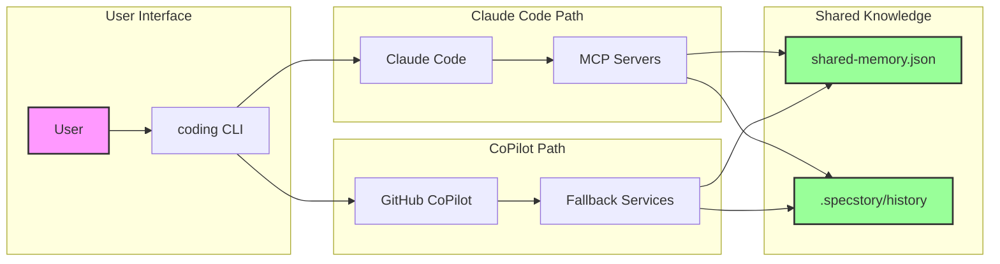
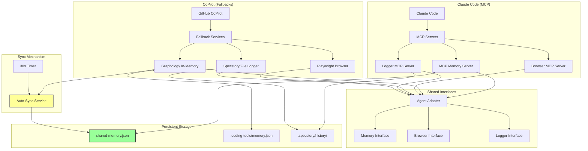
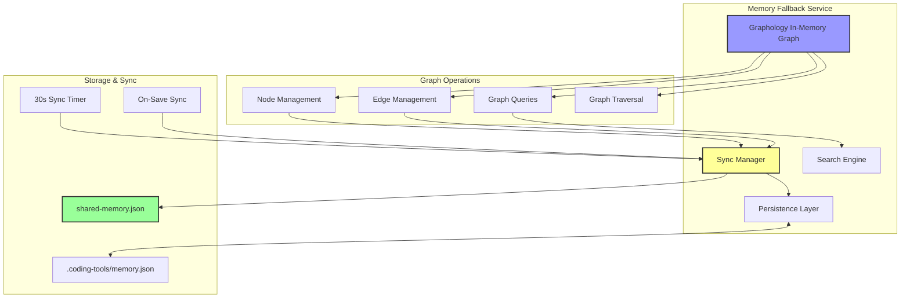
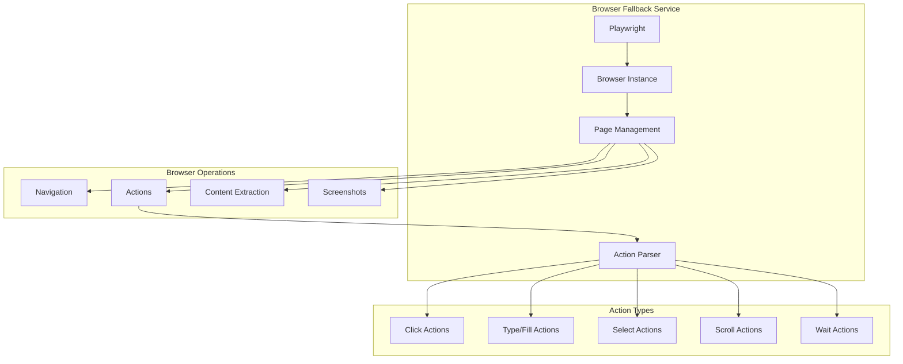
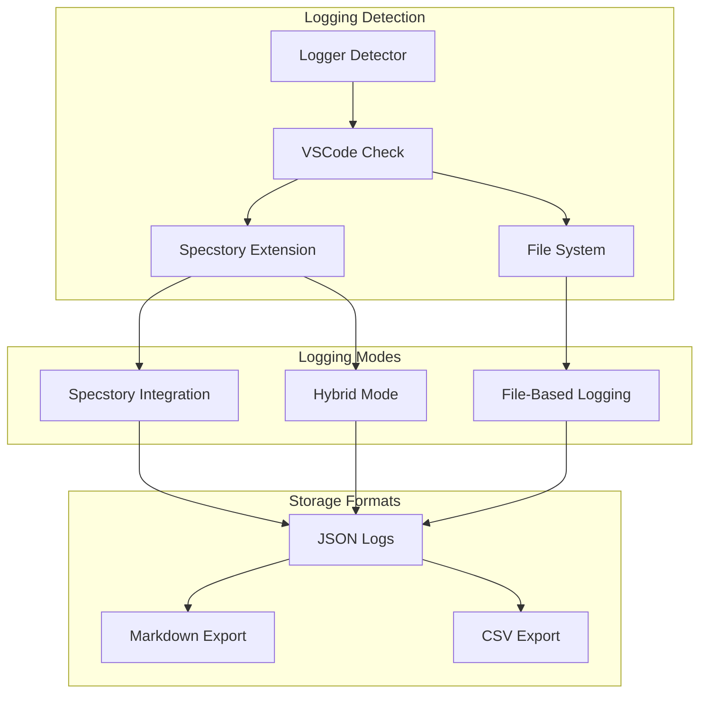
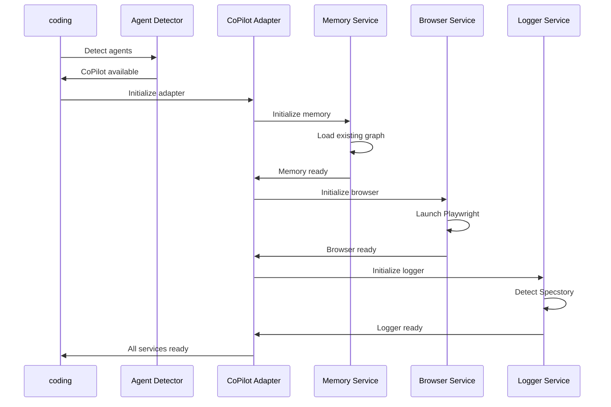

# Fallback Services Architecture

This document describes the fallback services that provide feature parity for GitHub CoPilot users, ensuring they have access to the same memory, browser automation, and logging capabilities as Claude Code users.

## Overview

The fallback services system implements the same feature set as Claude Code's MCP servers using pure JavaScript solutions, ensuring no agent lock-in and consistent functionality across different AI coding assistants.

## Simplified Overview

### High-Level Architecture



### Key Concepts

1. **Agent Selection**: The system automatically detects and uses the best available agent
2. **Feature Parity**: Both paths provide identical functionality
3. **Shared Storage**: Knowledge persists across agents via shared files
4. **Transparent Switching**: Users can switch agents without losing context

## Detailed Architecture



## Detailed Architecture Diagrams

### Agent-Agnostic Architecture Overview


This diagram shows the complete flow from agent detection to service implementation, highlighting how:

- Claude Code uses MCP servers for all operations
- CoPilot uses fallback services (Graphology, Playwright, File/Specstory logging)
- Both paths provide identical functionality through unified adapters

### Graphology Memory Architecture


This detailed view shows the Graphology memory service architecture, including:

- In-memory graph operations for high performance
- Automatic synchronization with shared-memory.json
- Periodic and immediate sync strategies
- Cross-agent compatibility layer

### Fallback Services Detailed Architecture


This comprehensive diagram illustrates the complete fallback services ecosystem:

- All service components and their interactions
- HTTP server and WebSocket real-time communication
- Multi-modal logging with Specstory integration
- Natural language action parsing for browser automation
- Health monitoring and service lifecycle management

## Memory Fallback Service (Graphology)

### Why Graphology?

After evaluating multiple graph database options, **Graphology** was chosen for the memory fallback because:

- ✅ **Pure JavaScript** - No native dependencies
- ✅ **Lightweight** - Small footprint, fast startup
- ✅ **Feature-rich** - Full graph operations, algorithms
- ✅ **Persistent** - JSON serialization/deserialization
- ✅ **Compatible** - Can import/export MCP memory format

### Memory Service Architecture



### Implementation

```javascript
class MemoryFallbackService {
  constructor(config) {
    this.graph = new Graph({ multi: true });
    this.dbPath = config.dbPath || '.coding-tools/memory.json';
    this.sharedMemoryPath = config.sharedMemoryPath || 'shared-memory.json';
    this.syncInterval = null;
  }

  async initialize() {
    // Load from shared-memory.json first (source of truth)
    await this.loadFromSharedMemory();
    
    // Start auto-sync every 30 seconds
    this.syncInterval = setInterval(() => {
      this.syncToSharedMemory().catch(console.error);
    }, 30000);
  }

  async createEntities(entities) {
    for (const entity of entities) {
      const nodeId = this.getNodeId(entity.name);
      this.graph.addNode(nodeId, {
        ...entity,
        created: new Date().toISOString()
      });
    }
    
    // Save to local storage
    await this.saveGraph();
    
    // Sync to shared-memory.json immediately
    await this.syncToSharedMemory();
  }

  async syncToSharedMemory() {
    // Export graph to shared-memory.json format
    const entities = this.graph.mapNodes((node, attrs) => ({
      name: attrs.name,
      entityType: attrs.entityType,
      observations: attrs.observations || [],
      significance: attrs.significance || 5,
      metadata: {
        created_at: attrs.created,
        last_updated: attrs.lastUpdated || new Date().toISOString()
      }
    }));
    
    const relations = this.graph.mapEdges((edge, attrs, source, target) => ({
      from: this.graph.getNodeAttribute(source, 'name'),
      to: this.graph.getNodeAttribute(target, 'name'),
      relationType: attrs.relationType
    }));
    
    // Write to shared-memory.json
    const sharedMemory = {
      entities,
      relations,
      metadata: {
        last_updated: new Date().toISOString(),
        total_entities: entities.length,
        total_relations: relations.length
      }
    };
    
    await fs.writeFile(this.sharedMemoryPath, JSON.stringify(sharedMemory, null, 2));
  }
}
```

### Synchronization Strategy

The memory fallback service maintains consistency between the in-memory Graphology graph and the shared-memory.json file:

1. **On Startup**:
   - Loads entities and relations from shared-memory.json
   - Initializes the Graphology graph with this data
   - Starts the auto-sync timer

2. **On Modification**:
   - Updates the in-memory Graphology graph immediately
   - Saves to local memory.json for fast recovery
   - Syncs to shared-memory.json for cross-agent compatibility

3. **Periodic Sync**:
   - Every 30 seconds, exports the entire graph to shared-memory.json
   - Ensures eventual consistency even if immediate syncs fail

4. **On Shutdown**:
   - Final sync to ensure all changes are persisted
   - Clears the sync timer

### Performance Characteristics

| Operation | Complexity | Performance |
|-----------|------------|-------------|
| **Add Node** | O(1) | ~0.1ms |
| **Add Edge** | O(1) | ~0.1ms |
| **Search** | O(n) | ~1ms/1000 nodes |
| **Traversal** | O(V+E) | ~5ms/1000 nodes |
| **Local Save** | O(V+E) | ~10ms/1000 nodes |
| **Shared Sync** | O(V+E) | ~20ms/1000 nodes |

## Browser Fallback Service (Playwright)

### Browser Service Architecture



### Implementation

```javascript
class BrowserFallbackService {
  async initialize() {
    this.browser = await playwright.chromium.launch({
      headless: false
    });
    this.page = await this.browser.newPage();
  }

  async act(action, variables = {}) {
    const actionLower = action.toLowerCase();
    
    if (actionLower.includes('click')) {
      const selector = this.extractSelector(action, variables);
      await this.page.click(selector);
      return { success: true, action: 'clicked', selector };
    }
    
    if (actionLower.includes('type')) {
      const selector = this.extractSelector(action, variables);
      const text = this.extractText(action, variables);
      await this.page.fill(selector, text);
      return { success: true, action: 'typed', selector, text };
    }
    
    // Additional action types...
  }
}
```

### Action Parser

The action parser interprets natural language commands into browser actions:

```javascript
class ActionParser {
  parseAction(action) {
    const patterns = [
      { 
        pattern: /click (?:the )?(.+)/i, 
        type: 'click',
        extract: (match) => ({ selector: match[1] })
      },
      { 
        pattern: /type "(.+)" (?:in|into) (?:the )?(.+)/i, 
        type: 'type',
        extract: (match) => ({ text: match[1], selector: match[2] })
      },
      {
        pattern: /scroll (?:to )?(.+)/i,
        type: 'scroll',
        extract: (match) => ({ target: match[1] })
      }
    ];
    
    for (const { pattern, type, extract } of patterns) {
      const match = action.match(pattern);
      if (match) {
        return { type, ...extract(match) };
      }
    }
    
    throw new Error(`Could not parse action: ${action}`);
  }
}
```

## Logging Fallback Service

### Multi-Modal Logging Strategy



### Specstory Integration

```javascript
class SpecstoryAdapter {
  async initialize() {
    // Try multiple connection methods
    this.extensionApi = await this.connectViaHTTP() || 
                       await this.connectViaIPC() ||
                       await this.connectViaFileWatch();
    return !!this.extensionApi;
  }

  async connectViaHTTP() {
    const ports = [7357, 7358, 7359];
    for (const port of ports) {
      try {
        const response = await this.httpRequest({
          hostname: 'localhost',
          port,
          path: '/api/status'
        });
        
        if (response.includes('specstory')) {
          return { log: (data) => this.httpLog(port, data) };
        }
      } catch (error) {
        // Try next port
      }
    }
    return null;
  }

  async connectViaFileWatch() {
    const watchDir = path.join(os.homedir(), '.specstory', 'watch');
    await fs.mkdir(watchDir, { recursive: true });
    
    return {
      log: async (data) => {
        const filename = `${Date.now()}-${process.pid}.json`;
        await fs.writeFile(
          path.join(watchDir, filename),
          JSON.stringify(data, null, 2)
        );
      }
    };
  }
}
```

### File-Based Logging

```javascript
class LoggerFallbackService {
  async logConversation(entry) {
    // Try Specstory first
    if (this.hasSpecstory) {
      const logged = await this.specstoryAdapter.logConversation(entry);
      if (logged) return { success: true, method: 'specstory' };
    }
    
    // Fallback to file-based
    const sessionFile = path.join(this.logDir, `${this.sessionId}.json`);
    const session = JSON.parse(await fs.readFile(sessionFile, 'utf8'));
    
    session.entries.push({
      ...entry,
      timestamp: new Date().toISOString(),
      index: session.entries.length
    });
    
    await fs.writeFile(sessionFile, JSON.stringify(session, null, 2));
    return { success: true, method: 'file' };
  }
}
```

## Service Lifecycle Management

### Initialization Sequence



### Cleanup and Shutdown

```javascript
class CoPilotAdapter {
  async cleanup() {
    const cleanupTasks = [];
    
    if (this.memoryService) {
      cleanupTasks.push(this.memoryService.saveGraph());
    }
    
    if (this.browserService) {
      cleanupTasks.push(this.browserService.closeBrowser());
    }
    
    if (this.loggingService) {
      cleanupTasks.push(this.loggingService.flushLogs());
    }
    
    await Promise.all(cleanupTasks);
  }
}
```

## Error Handling and Resilience

### Graceful Degradation

```javascript
class ResilientService {
  async executeWithFallback(operation, fallback) {
    try {
      return await operation();
    } catch (error) {
      console.warn(`Primary operation failed: ${error.message}`);
      return await fallback();
    }
  }
  
  async memoryCreate(entities) {
    return await this.executeWithFallback(
      () => this.memoryService.createEntities(entities),
      () => this.saveToFileSystem(entities)
    );
  }
}
```

### Service Health Monitoring

```javascript
class ServiceHealthMonitor {
  constructor(services) {
    this.services = services;
    this.healthChecks = new Map();
  }
  
  async checkHealth() {
    const results = {};
    
    for (const [name, service] of Object.entries(this.services)) {
      try {
        const health = await service.healthCheck();
        results[name] = { status: 'healthy', ...health };
      } catch (error) {
        results[name] = { status: 'unhealthy', error: error.message };
      }
    }
    
    return results;
  }
}
```

## Performance Optimization

### Lazy Loading

```javascript
class LazyService {
  constructor() {
    this._service = null;
  }
  
  async getService() {
    if (!this._service) {
      this._service = await this.initializeService();
    }
    return this._service;
  }
  
  async operation() {
    const service = await this.getService();
    return await service.operation();
  }
}
```

### Caching Strategy

```javascript
class CachedMemoryService {
  constructor(baseService) {
    this.baseService = baseService;
    this.cache = new LRUCache({ maxSize: 1000 });
  }
  
  async searchNodes(query) {
    const cacheKey = `search:${query}`;
    
    if (this.cache.has(cacheKey)) {
      return this.cache.get(cacheKey);
    }
    
    const results = await this.baseService.searchNodes(query);
    this.cache.set(cacheKey, results);
    return results;
  }
}
```

## Compatibility and Migration

### MCP Format Compatibility

```javascript
class MCPCompatibilityLayer {
  convertToMCPFormat(graphData) {
    return {
      nodes: graphData.nodes.map(node => ({
        name: node.name,
        entityType: node.entityType,
        observations: node.observations || []
      })),
      edges: graphData.edges.map(edge => ({
        from: edge.from,
        to: edge.to,
        relationType: edge.relationType
      }))
    };
  }
  
  convertFromMCPFormat(mcpData) {
    return {
      nodes: mcpData.nodes || [],
      edges: mcpData.edges || []
    };
  }
}
```

### Data Migration

```javascript
async function migrateFromClaudeToGraph() {
  // Read MCP memory data
  const mcpData = await readMCPMemory();
  
  // Initialize graph service
  const graphService = new MemoryFallbackService();
  await graphService.initialize();
  
  // Import data
  await graphService.importFromMCP(mcpData);
  
  console.log('Migration completed successfully');
}
```

## Testing Strategy

### Unit Tests

```javascript
describe('Fallback Services', () => {
  test('Memory service CRUD operations', async () => {
    const memory = new MemoryFallbackService();
    await memory.initialize();
    
    await memory.createEntities([testEntity]);
    const results = await memory.searchNodes('test');
    expect(results).toHaveLength(1);
  });
  
  test('Browser service navigation', async () => {
    const browser = new BrowserFallbackService();
    await browser.initialize();
    
    const result = await browser.navigate('https://example.com');
    expect(result.success).toBe(true);
  });
});
```

### Integration Tests

```javascript
describe('Service Integration', () => {
  test('CoPilot adapter full workflow', async () => {
    const adapter = new CoPilotAdapter();
    await adapter.initialize();
    
    // Test memory operations
    await adapter.memoryCreate([testEntity]);
    const results = await adapter.memorySearch('test');
    expect(results).toHaveLength(1);
    
    // Test browser operations
    await adapter.browserNavigate('https://example.com');
    const content = await adapter.browserExtract();
    expect(content).toBeDefined();
    
    await adapter.cleanup();
  });
});
```

## Architecture Benefits

### Cross-Agent Compatibility

The fallback services architecture provides several key benefits:

1. **Unified Knowledge Base**:
   - Both Claude Code and CoPilot share the same shared-memory.json
   - Knowledge captured in one agent is immediately available to the other
   - Teams can collaborate regardless of their preferred agent

2. **Performance Optimization**:
   - Graphology provides fast in-memory graph operations for CoPilot
   - Sync mechanism ensures data persistence without blocking operations
   - Local caching reduces latency for frequent queries

3. **Graceful Degradation**:
   - If one service fails, others continue to operate
   - Multiple sync mechanisms ensure data is never lost
   - Fallback options for every critical feature

4. **Developer Experience**:
   - Same commands (ukb, vkb) work identically across agents
   - Transparent switching between agents
   - No lock-in to a specific AI coding assistant

### Future Enhancements

The architecture is designed to support future enhancements:

- **Additional Agents**: Easy to add support for new AI coding assistants
- **Advanced Graph Features**: Can leverage Graphology's rich algorithm library
- **Real-time Collaboration**: WebSocket support for live knowledge sharing
- **Cloud Sync**: Optional cloud backup for distributed teams

This fallback services architecture ensures that GitHub CoPilot users have access to the same powerful features as Claude Code users, while maintaining performance, reliability, and compatibility across the agent-agnostic ecosystem.

