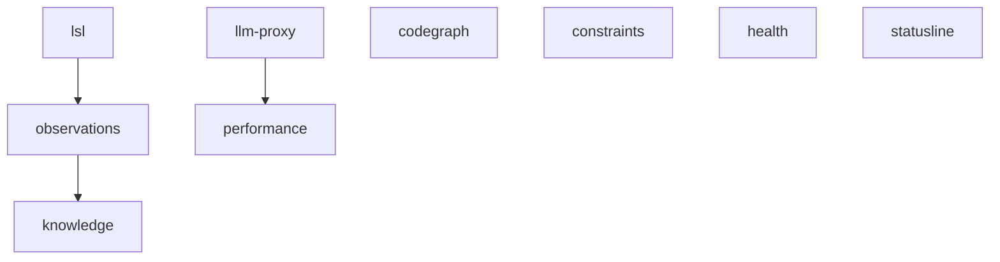

# Feature Modularity

`coding` composes from nine independently switchable features. This document is the
**contract**: for every feature it names every artifact that must be gated — daemons,
container programs, ports, hooks, dashboard surfaces, status-line badges and CLIs.

Enforcement points are scattered across shell, Node, Docker and React. The matrix below
is what stops one being missed; it is the reference an implementer checks against, and
the checklist a reviewer uses.

**Default is all-on.** With no `features.yaml` anywhere, the resolved set is identical to
the historical single-stack behaviour. Upgrading changes nothing until the user opts in.

## The nine features

| id | what the user calls it |
|----|------------------------|
| `lsl` | verbatim session logging (`.specstory` markdown) |
| `observations` | the observation → digest → insight pipeline |
| `knowledge` | semantic analysis, UKB workflows, the knowledge graph, VKB |
| `codegraph` | the graphify code knowledge graph |
| `constraints` | constraint monitoring / guardrails |
| `llm-proxy` | rapid-llm-proxy, routing and token accounting |
| `performance` | measurement, experiments, kgbench |
| `health` | health coordinator and the monitoring dashboard |
| `statusline` | the tmux / agent status line |

`core` is not a feature. `bin/coding`, agent detection and launch, `config/`,
`.coding/runtime/` and the feature resolver itself are always present.

## Dependencies

A feature whose dependency is off is **auto-disabled** with a recorded reason. A
dependency is never silently switched back on — that would undo an explicit user choice.



| dependent | requires | why |
|-----------|----------|-----|
| `observations` | `lsl` | the observation tap lives inside the enhanced transcript monitor; nothing else produces observations |
| `knowledge` | `observations` | UKB wave-analysis consumes observations and digests |
| `performance` | `llm-proxy` | token attribution is read off the proxy's usage tap |

`health` has no dependencies, but disabling it removes the dashboard — which is also the
feature editor. The CLI says so rather than refusing the choice; `bin/coding-features`
remains fully capable on its own.

## Host daemons

Platform service manager: launchd (macOS), systemd `--user` (Linux), Scheduled Tasks
(Windows). Labels below are the macOS spelling; the other platforms use the same stem.

| label | script | feature |
|-------|--------|---------|
| `com.coding.lsl-lock-sweeper` | `scripts/lsl-lock-sweeper-job.sh` | `lsl` |
| `com.coding.sub-agent-live-claude` | `scripts/sub-agent-live-claude.mjs` | `lsl` |
| `com.coding.sub-agent-live-copilot` | `scripts/sub-agent-live-copilot.mjs` | `lsl` |
| `com.coding.sub-agent-live-opencode` | `scripts/sub-agent-live-opencode.mjs` | `lsl` |
| `com.coding.sub-agent-sweep` | `scripts/sub-agent-sweep-job.sh` | `lsl` |
| `com.coding.obs-api` | `scripts/observations-api-server.mjs` | `observations` |
| `com.coding.digest-refs-sweeper` | `scripts/digest-refs-sweeper-job.sh` | `observations` |
| `com.coding.llm-cli-proxy` | `bin/start-llm-proxy.sh` | `llm-proxy` |
| `com.coding.prompt-classifier` | `scripts/prompt-classifier-service.mjs` | `llm-proxy` |
| `com.coding.measurement-reconciler` | `scripts/measurement-reconciler.mjs` | `performance` |
| `com.coding.auto-measure-foreground` | `scripts/auto-measure-foreground.mjs` | `performance` |
| `com.coding.context-turns-sweeper` | `scripts/context-turns-sweeper-job.sh` | `performance` |
| `com.coding.health-coordinator` | `scripts/health-coordinator.js` | `health` |

## Launch-time host services

Started by `scripts/start-services-robust.js` (`SERVICE_CONFIGS`). Each entry carries a
`feature` key; disabled entries are reported in a `disabled` bucket, never as a failure.

| config key | display name | feature |
|------------|--------------|---------|
| `transcriptMonitor` | Transcript Monitor | `lsl` |
| `liveLoggingCoordinator` | Live Logging Coordinator | `lsl` |
| `observationsApi` | Observations API | `observations` |
| `vkbServer` | VKB Server | `knowledge` |
| `constraintMonitor` | Constraint Monitor | `constraints` |
| `llmCliProxy` | LLM CLI Proxy | `llm-proxy` |
| `healthVerifier` | Health Verifier | `health` |
| `statuslineHealthMonitor` | StatusLine Health Monitor | `health` |
| `systemHealthDashboardAPI` | System Health Dashboard API | `health` |
| `systemHealthDashboardFrontend` | System Health Dashboard Frontend | `health` |

`transcriptMonitor`, `liveLoggingCoordinator` and `vkbServer` are `required: true` today.
Required-ness applies **only when the owning feature is on**; a disabled required service
is a skip, not a blocked launch.

## Container programs

One container (`coding-services`) running supervisord. `docker/entrypoint.sh` generates
`/etc/supervisor/conf.d/features.conf` from the resolved set, setting `autostart=false`
for programs whose feature is off.

| program | command | feature |
|---------|---------|---------|
| `semantic-analysis` | `integrations/semantic-analysis/dist/sse-server.js` | `knowledge` |
| `vkb-server` | `lib/vkb-server/express-server.js` | `knowledge` |
| `embedding-listener` | `dist/embedding/listener.js` | `knowledge` |
| `graphify` | `/usr/local/bin/graphify-serve.sh` | `codegraph` |
| `constraint-monitor` | `integrations/constraint-monitor/src/sse-server.js` | `constraints` |
| `constraint-dashboard` | `next start -p 3030` | `constraints` |
| `constraint-dashboard-api` | `integrations/constraint-monitor/src/dashboard-server.js` | `constraints` |
| `health-dashboard` | `integrations/system-health-dashboard/server.js` | `health` |
| `health-dashboard-frontend` | `integrations/system-health-dashboard/static-server.js` | `health` |

Sidecar containers:

| container | feature |
|-----------|---------|
| `coding-qdrant` | `knowledge` or `constraints` (either keeps it) |
| `coding-redis` | `constraints` |

**Docker is conditional.** Only `knowledge`, `codegraph` and `constraints` require the
container; when all three are off, nothing does. `_start_services()` in
`scripts/launch-agent-common.sh` must skip Docker entirely rather than exiting 1 — this
is what makes a proxy-only or logging-only install work on a machine without Docker.

`health` deliberately does **not** require Docker. The coordinator and both dashboard
servers have host implementations started by `scripts/start-services-robust.js`; the
supervisord programs of the same name are the containerised alternative, not a
requirement.

## Ports

| port | owner | feature |
|------|-------|---------|
| 3030 | Constraint Dashboard | `constraints` |
| 3031 | Constraint Dashboard API | `constraints` |
| 3032 | Health Dashboard (frontend) | `health` |
| 3033 | Health API / coordinator | `health` |
| 3848 | Semantic Analysis SSE | `knowledge` |
| 3849 | Constraint Monitor SSE | `constraints` |
| 3851 | Graphify HTTP MCP | `codegraph` |
| 8080 | VKB Server | `knowledge` |
| 12435 | rapid-llm-proxy | `llm-proxy` |
| 12436 | Observations API | `observations` |
| 12437 | Prompt classifier | `llm-proxy` |

## Agent hooks

Contributed by `codingHooks()` in `scripts/build-claude-runtime-config.mjs` — the single
source of truth for both wrapper scope (`--settings`) and `--install-global`. Filtering
happens there, so the two scopes cannot drift.

| event | script | feature |
|-------|--------|---------|
| `PreToolUse` | `integrations/constraint-monitor/src/hooks/pre-tool-hook-wrapper.js` | `constraints` |
| `PostToolUse` | `scripts/tool-interaction-hook-wrapper.js` | `lsl` |
| `UserPromptSubmit` | `scripts/health-prompt-hook.js` | `health` |

Hook changes apply to **new sessions only** — `--settings` is fixed at launch. The UI
labels this rather than implying a live effect.

## Status-line badges

`buildCombinedStatus()` in `scripts/combined-status-line.js`. Gate the **collector** as
well as the `parts.push`, so a disabled feature costs no probes. Disabled badges are
omitted entirely — no greying, no placeholder.

| badge | meaning | feature |
|-------|---------|---------|
| `[🏥●]` | overall health verdict | `health` |
| `[N:…]` `[P:…]` | network location, proxydetox state | `health` |
| `[Cc…]` | per-project session letters | `lsl` |
| `[LSL●]` | live-session-logging health | `lsl` |
| `[📋tranche]` `[→target]` | log tranche / redirect target | `lsl` |
| `[📚●]` | observation pipeline freshness | `observations` |
| `[🔒NN%]` | constraint compliance + violations | `constraints` |
| `[🧠●]` | proxy semantic readiness | `llm-proxy` |
| `[D:n]` | classifier downgrades | `llm-proxy` |
| `[L:n]` | completions served by local hardware | `llm-proxy` |
| `[🧠n⏳]` | running / stale / frozen UKB workflows | `knowledge` |
| context gauge, clock | — | always (core) |

`scripts/claude-statusline.cjs` and `scripts/status-line-fast.cjs` gate the same set.

## Dashboard surfaces

Nav tabs (`src/components/nav-bar.tsx`) are **omitted** when disabled — a greyed tab that
routes nowhere is worse than no tab. Their routes still resolve, rendering a
"this feature is off" panel so a bookmarked URL explains itself.

| tab | route | feature |
|-----|-------|---------|
| Health | `/` | `health` |
| Sessions | `/sessions` | `lsl` |
| Observations | `/observations` | `observations` |
| Digests | `/digests` | `observations` |
| Insights | `/insights` | `observations` |
| Coverage | `/coverage` | `knowledge` |
| Token Usage | `/token-usage` | `llm-proxy` |
| Performance | `/performance` | `performance` |

Health-page tiles (`src/components/system-health-dashboard.tsx`) are **greyed** when
disabled, carrying a `Disabled` chip whose tooltip is the resolver's reason string.

| tile | feature |
|------|---------|
| Databases | `knowledge` (LevelDB, Qdrant), `constraints` (Qdrant, Redis) |
| Code Graph | `codegraph` |
| Services | per-row, by the owning feature |
| Processes | core — always shown |
| UKB Workflows | `knowledge` |
| LLM Proxy Health | `llm-proxy` |

## CLIs

Each guards on its feature and exits 2 with an actionable message
(`feature 'knowledge' is disabled — enable with: coding-features set knowledge on`).

| command | feature |
|---------|---------|
| `bin/semantic`, `bin/vkb`, `bin/ckb`, `bin/clean-knowledge-base` | `knowledge` |
| `bin/graphify`, `bin/codegraph`, `bin/graph-sync` | `codegraph` |
| `bin/constraints` | `constraints` |
| `bin/llm` | `llm-proxy` |
| `bin/log-session` | `lsl` |
| `bin/status`, `bin/mcp-status` | core — always work, and report the active profile |

## Configuration

Four layers, last wins, deep-merged per feature key.

| layer | source | purpose |
|-------|--------|---------|
| 1 | `lib/features/defaults.mjs` | built-in, all-on |
| 2 | `<repo>/config/features.yaml` | committed team/project default |
| 3 | `~/.coding/features.yaml` | this machine; **what the dashboard writes**; gitignored |
| 4 | `CODING_FEATURE_<ID>=on\|off` | env override, for CI and the test matrix |

```yaml
# ~/.coding/features.yaml
profile: proxy-only
features:
  lsl: on
  observations: off
```

Env ids upper-case with `-` → `_`: `llm-proxy` becomes `CODING_FEATURE_LLM_PROXY`.

Presets live in `config/feature-profiles.yaml`:

| profile | on |
|---------|-----|
| `full` | everything (the default) |
| `proxy-only` | `llm-proxy`, `statusline` |
| `logging-only` | `lsl`, `statusline`, `health` |
| `minimal` | `statusline` |

## Apply tiers

Config is always hot-loaded; what differs is how far a running system can honour it.
Every tier is surfaced per feature in the dashboard so nothing pretends to be live when
it is not.

| tier | applies to | mechanism |
|------|-----------|-----------|
| **live** | status line, dashboard gating, health-coordinator checks, CLI gates | all read the mtime-cached resolver on next use; no restart |
| **applied on save** | host daemons, container programs | `scripts/apply-features.mjs` diffs desired vs running and starts/stops only the delta |
| **next session** | agent hooks | `--settings` is fixed at launch |

## Resolver

`lib/features/resolve.cjs` is the implementation — CommonJS, because the status line is
CJS and must not pay an ESM bridge on every render. `lib/features/index.mjs` re-exports it
for ESM callers. Caching and invalidation follow
`_work/rapid-llm-proxy/proxy-bridge/routing-config.mjs`: stamp the input mtimes, re-parse
only on change, and throw rather than fall back to defaults on malformed input.

```js
loadFeatures({ force })   // { profile, features: {id: {enabled, reason, source}}, warnings, layers }
isEnabled(id)             // boolean
explain(id)               // human-readable reason
invalidateFeatures()      // after a write
```

`.coding/runtime/features.json` is a flat derived snapshot, written on every launch and
every apply, so bash, Python and the container read one JSON instead of re-implementing
the layering.

## Related

- [System overview](./system-overview.md)
- [Health monitoring](./health-monitoring.md)
- [LLM routing](./llm-routing.md)
- [Install scope and host impact](../install-scope-and-host-impact.md)
