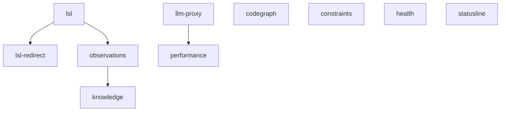

# Feature Modularity

`coding` composes from nine independently switchable features. This document is the
**contract**: for every feature it names every artifact that must be gated — daemons,
container programs, ports, hooks, dashboard surfaces, status-line badges and CLIs.

Enforcement points are scattered across shell, Node, Docker and React. The matrix below
is what stops one being missed; it is the reference an implementer checks against, and
the checklist a reviewer uses.

**Default is all-on.** With no `features.yaml` anywhere, the resolved set is identical to
the historical single-stack behaviour. Upgrading changes nothing until the user opts in.

## The ten features

| id | what the user calls it |
|----|------------------------|
| `lsl` | verbatim session logging (`.specstory` markdown) |
| `lsl-redirect` | filing tools-infrastructure turns into the tools repo |
| `observations` | the observation → digest → insight pipeline |
| `knowledge` | semantic analysis, UKB workflows, the knowledge graph |
| `codegraph` | the graphify code knowledge graph |
| `constraints` | constraint monitoring / guardrails |
| `llm-proxy` | rapid-llm-proxy, routing and token accounting |
| `performance` | measurement, experiments, kgbench |
| `health` | health coordinator and the monitoring dashboard |
| `statusline` | the tmux / agent status line |

`core` is not a feature. `bin/coding`, agent detection and launch, `config/`,
`.coding/runtime/` and the feature resolver itself are always present.

## Dependencies

A feature whose dependency is off is **auto-disabled** with a recorded reason. A
dependency is never silently switched back on — that would undo an explicit user choice.


```mermaid
graph TD
    lsl --> lslredirect["lsl-redirect"]
    lsl --> observations
    observations --> knowledge
    llmproxy["llm-proxy"] --> performance
    codegraph
    constraints
    health
    statusline
```

| dependent | requires | why |
|-----------|----------|-----|
| `lsl-redirect` | `lsl` | it re-targets where the transcript monitor writes; with no transcript there is nothing to re-target |
| `observations` | `lsl` | the observation tap lives inside the enhanced transcript monitor; nothing else produces observations |
| `knowledge` | `observations` | UKB wave-analysis consumes observations and digests |
| `performance` | `llm-proxy` | token attribution is read off the proxy's usage tap |

`health` has no dependencies, but disabling it removes the dashboard — which is also the
feature editor. The CLI says so rather than refusing the choice; `bin/coding-features`
remains fully capable on its own.

## Host daemons

Platform service manager: launchd (macOS), systemd `--user` (Linux), Scheduled Tasks
(Windows). Labels below are the macOS spelling; the other platforms use the same stem.

| label | script | feature |
|-------|--------|---------|
| `com.coding.lsl-lock-sweeper` | `scripts/lsl-lock-sweeper-job.sh` | `lsl` |
| `com.coding.sub-agent-live-claude` | `scripts/sub-agent-live-claude.mjs` | `lsl` |
| `com.coding.sub-agent-live-copilot` | `scripts/sub-agent-live-copilot.mjs` | `lsl` |
| `com.coding.sub-agent-live-opencode` | `scripts/sub-agent-live-opencode.mjs` | `lsl` |
| `com.coding.sub-agent-sweep` | `scripts/sub-agent-sweep-job.sh` | `lsl` |
| `com.coding.obs-api` | `scripts/observations-api-server.mjs` | `observations` |
| `com.coding.digest-refs-sweeper` | `scripts/digest-refs-sweeper-job.sh` | `observations` |
| `com.coding.llm-cli-proxy` | `scripts/llm-proxy-service.sh` | `llm-proxy` |
| `com.coding.prompt-classifier` | `scripts/prompt-classifier-service.mjs` | `llm-proxy` |
| `com.coding.measurement-reconciler` | `scripts/measurement-reconciler.mjs` | `performance` |
| `com.coding.context-turns-sweeper` | `scripts/context-turns-sweeper-job.sh` | `performance` |
| `com.coding.health-coordinator` | `scripts/health-coordinator.js` | `health` |

**How they get installed.** Every label above has a template in `launchd/` (macOS) and
in `systemd/` (Linux, WSL): `<id>.service`, plus `<id>.timer` for an interval job (the
sweepers — launchd's `StartInterval`). Both use the `__CODING_REPO__` token, rendered for
the checkout by `scripts/lib/launchd-plist.sh` / `scripts/lib/systemd-unit.sh`; the units
also take `__NODE_DIR__`, because a user manager inherits no shell PATH and node is as
often under `$HOME` (nvm, fnm) as in `/usr/bin`. `tests/features/systemd-units.test.mjs`
keeps each unit equal to its plist (command line, working directory, log, environment,
restart policy, interval). `install.sh`'s `install_feature_daemons` step reads `DAEMONS`
from `lib/features/daemons.mjs`, keeps the ids whose feature is on, and hands them to
`scripts/install-launchd-daemons.sh` or `scripts/install-systemd-daemons.sh <id>...` —
idempotent: an up-to-date running job is left alone. The proxy is the exception,
installed by `setup_llm_cli_proxy` (opt-in, `CODING_INSTALL_SYSTEM_SERVICES=1`).
`uninstall.sh` removes every installed job that has a template, and leaves hand-made
ones alone.

**WSL needs systemd.** A WSL distribution without `systemd=true` in `/etc/wsl.conf` has
no user service manager: the installer installs no daemons there, says how to enable it,
and records a warning. There is deliberately no fallback supervisor — it would be a third
service manager to keep alive, and systemd is the default for new WSL distributions.
A Linux account without a running user manager (ssh-only, no lingering) gets the same
treatment with `sudo loginctl enable-linger $USER` as the fix; with lingering off the
daemons stop at logout, which the installer points out. Native Windows is not supported
(`bin/coding.bat` points to WSL).

`auto-measure-foreground` is not a daemon: nothing ever ran it as one, so it has no unit.
It stays runnable by hand (`node scripts/auto-measure-foreground.mjs --once`).

**Overlapping sessions are not measured.** `measurement-reconciler` binds an agent's
live session to that agent's one proxy slot. When a second session of the same agent
is active too, it binds NEITHER: the slot cannot tell their requests apart, and
binding the newest booked each session's traffic to the other half the time. Those
rows land unattributed, and measurement resumes once one session has been quiet for
`freshnessMs` (2 min).

### The ETM is neither a daemon nor a container program

`scripts/enhanced-transcript-monitor.js` — the writer behind `lsl` — is the one artifact
with no supervisor entry of either kind. The health coordinator spawns it per project
with `detached: true` + `unref()`, so it has no label to stop and it outlives whoever
started it. Three places therefore have to agree, and for a while only the first did:

| path | where | what it does when `lsl` is off |
|------|-------|-------------------------------|
| launch | `SERVICE_CONFIGS.transcriptMonitor` | not started |
| coordinator safety-net | `ensureEtmForActiveProjects()` | does not spawn |
| coordinator reap | `reapEtmsForClosedSessions()` | SIGTERMs every running ETM |
| apply | `reconcileEtm()` in `scripts/apply-features.mjs` | SIGTERMs every running ETM |

The last two overlap on purpose. The coordinator can only reap while it is itself
running, and `minimal` stops it in the same pass that switches `lsl` off —
which used to leave detached ETMs writing `.specstory/history` indefinitely (measured:
two of them, up 8-9 hours, under `minimal`). `reconcileEtm` only ever stops; spawning
stays the coordinator's job, so an apply cannot become a second spawner racing the first.

### `lsl-redirect` owns a decision, not an artifact

`lsl-redirect` has no daemon, no container program, no port and no health rule. What it
gates is one branch inside the ETM: whether a prompt set written while working in project
X may be filed under the **tools** repo instead of X, because the classifier judged it to
be about the toolchain.

That branch is useful to whoever develops this toolchain and actively wrong for everyone
else — for a team using it, their own sessions leave their own scope. It was
unconditional until this feature existed: `determineTargetProject()` special-cased
`basename(projectPath) === 'coding'`, no spawner ever passed a mode to disable it, and the
ETM did not read the feature system at all.

| path | what it does when `lsl-redirect` is off |
|------|----------------------------------------|
| `determineTargetProject()` | returns the local project unconditionally |
| the 5-layer coding classifier | never constructed |
| `ClassificationLogger` foreign log | never written into the tools repo |
| `getRedirectStatus()` + the `[→target]` badge | not computed, not rendered |

Because a profile turns OFF everything it does not name, the four install tiers gate
this simply by not listing it. Only `full` — the developer profile — lists it.

## Launch-time host services

Started by `scripts/start-services-robust.js` (`SERVICE_CONFIGS`). Each entry carries a
`feature` key; disabled entries are reported in a `disabled` bucket, never as a failure.

| config key | display name | feature |
|------------|--------------|---------|
| `transcriptMonitor` | Transcript Monitor | `lsl` |
| `liveLoggingCoordinator` | Live Logging Coordinator | `lsl` |
| `observationsApi` | Observations API | `observations` |
| `constraintMonitor` | Constraint Monitor | `constraints` |
| `llmCliProxy` | LLM CLI Proxy | `llm-proxy` |
| `statuslineHealthMonitor` | StatusLine Health Monitor | `health` |
| `systemHealthDashboardAPI` | System Health Dashboard API | `health` |
| `systemHealthDashboardFrontend` | System Health Dashboard Frontend | `health` |

`transcriptMonitor` and `liveLoggingCoordinator` are `required: true` today.
Required-ness applies **only when the owning feature is on**; a disabled required service
is a skip, not a blocked launch.

## Container programs

One container (`coding-services`) running supervisord. `docker/entrypoint.sh` generates
`/etc/supervisor/conf.d/features.conf` from the resolved set, setting `autostart=false`
for programs whose feature is off.

| program | command | feature |
|---------|---------|---------|
| `semantic-analysis` | `integrations/semantic-analysis/dist/sse-server.js` | `knowledge` |
| `embedding-listener` | `dist/embedding/listener.js` | `knowledge` |
| `graphify` | `/usr/local/bin/graphify-serve.sh` | `codegraph` |
| `constraint-monitor` | `integrations/constraint-monitor/src/sse-server.js` | `constraints` |
| `constraint-dashboard` | `next start -p 3030` | `constraints` |
| `constraint-dashboard-api` | `integrations/constraint-monitor/src/dashboard-server.js` | `constraints` |
| `health-dashboard` | `integrations/system-health-dashboard/server.js` | `health` |
| `health-dashboard-frontend` | `integrations/system-health-dashboard/static-server.js` | `health` |

Sidecar containers:

| container | feature |
|-----------|---------|
| `coding-qdrant` | `knowledge` or `constraints` (either keeps it) |
| `coding-redis` | `constraints` |

**Docker is conditional.** Only `knowledge`, `codegraph` and `constraints` require the
container; when all three are off, nothing does. `_start_services()` in
`scripts/launch-agent-common.sh` must skip Docker entirely rather than exiting 1 — this
is what makes a `harness` install work on a machine without Docker.

`health` deliberately does **not** require Docker. The coordinator and both dashboard
servers have host implementations started by `scripts/start-services-robust.js`; the
supervisord programs of the same name are the containerised alternative, not a
requirement.

## Ports

| port | owner | feature |
|------|-------|---------|
| 3030 | Constraint Dashboard | `constraints` |
| 3031 | Constraint Dashboard API | `constraints` |
| 3032 | Health Dashboard (frontend) | `health` |
| 3033 | Health API / coordinator | `health` |
| 3848 | Semantic Analysis SSE | `knowledge` |
| 3849 | Constraint Monitor SSE | `constraints` |
| 3851 | Graphify HTTP MCP | `codegraph` |
| 12435 | rapid-llm-proxy | `llm-proxy` |
| 12436 | Observations API | `observations` |
| 12437 | Prompt classifier | `llm-proxy` |

## Agent hooks

Contributed by `codingHooks()` in `scripts/build-claude-runtime-config.mjs` — the single
source of truth for both wrapper scope (`--settings`) and `--install-global`. Filtering
happens there, so the two scopes cannot drift.

| event | script | feature |
|-------|--------|---------|
| `PreToolUse` | `integrations/constraint-monitor/src/hooks/pre-tool-hook-wrapper.js` | `constraints` |
| `PostToolUse` | `scripts/tool-interaction-hook-wrapper.js` | `lsl` |
| `UserPromptSubmit` | `scripts/health-prompt-hook.js` | `health` |

Hook changes apply to **new sessions only** — `--settings` is fixed at launch. The UI
labels this rather than implying a live effect.

## Status-line badges

`buildCombinedStatus()` in `scripts/combined-status-line.js`. Gate the **collector** as
well as the `parts.push`, so a disabled feature costs no probes. Disabled badges are
omitted entirely — no greying, no placeholder.

| badge | meaning | feature |
|-------|---------|---------|
| `[🏥●]` | overall health verdict | `health` |
| `[N:…]` `[P:…]` | network location, proxydetox state | `health` |
| `[Cc…]` | per-project session letters | `lsl` |
| `[LSL●]` | live-session-logging health | `lsl` |
| `[📋tranche]` | log tranche | `lsl` |
| `[→target]` | redirect target | `lsl-redirect` |
| `[📚●]` | observation pipeline freshness | `observations` |
| `[🔒NN%]` | constraint compliance + violations | `constraints` |
| `[🧠●]` | proxy semantic readiness | `llm-proxy` |
| `[D:n]` | classifier downgrades | `llm-proxy` |
| `[L:n]` | completions served by local hardware | `llm-proxy` |
| `[🧠n⏳]` | running / stale / frozen UKB workflows | `knowledge` |
| context gauge, clock | — | always (core) (but see `statusline` below) |

`scripts/status-line-fast.cjs` and `scripts/combined-status-line-wrapper.js` do not gate
badges themselves — they read the per-pane render cache that `combined-status-line.js`
writes, so the gating happens once, upstream.

### Switching off the status line itself

`statusline` gates the *whole surface*, not a badge, so it is checked before anything
else: all four renderers print nothing and **exit 0**.

| program | surface |
|---------|---------|
| `scripts/combined-status-line.js` | full render + cache writer |
| `scripts/status-line-fast.cjs` | tmux per-session `status-right` |
| `scripts/combined-status-line-wrapper.js` | tmux global `status-right` |
| `scripts/claude-statusline.cjs` | Claude Code's in-terminal `statusLine` |

The shared check is `lib/statusline/feature-gate.cjs`. Two things about it are load-bearing:

- **Exit 0, not 1.** `status-right` is wrapped in `#(… || echo '[Status Offline]')`. A
  non-zero exit would replace the deliberately-empty line with an outage banner, which is
  the most misleading thing a "switched off" feature could do.
- **Fail-open.** An unreadable config renders the line, per the display/start asymmetry
  above. The user who actually turned it off has a readable config, so the honest answer
  and the safe answer coincide.

Known consequence, worth stating: `claude-statusline.cjs` wraps
`~/.claude/hooks/gsd-statusline.js`, which is also what writes
`$TMPDIR/claude-ctx-<session>.json` for GSD's own context-monitor hook. Off means that
upstream is not spawned, so that bridge stops too. Nothing in *this* repo is left
half-fed — the tmux gauge is the other reader and it is off by the same switch — but
GSD's monitor is. Turning the feature back on restores it, live.

No shipped profile switches it off; every tier and `minimal` keep
it, because a pared-down install is exactly the one where the user most needs a visible
sign of what is still running.

### Borrowing a cached render

`status-line-fast.cjs` serves a cold cache key by adopting a fresh *sibling* cache and
re-underlining it for this project. It may only borrow across the components it can fix
up — project and agent. Width and the feature fingerprint it cannot, so
`borrowTail()` in `lib/statusline/pane-cache-key.cjs` builds the required filename tail
and lives beside the key builder rather than being mirrored into the reader.

This was width-only until it bit: `paneIdentity()` appends `-f<hash>` *after* `-w<width>`,
so on any pared-down install `endsWith('-w220.txt')` matched no fingerprinted sibling at
all. Borrowing silently never fired, every new pane paid a full render, and the symptom
read as "I switched a feature off and the status line broke".

## Dashboard surfaces

### Where the API lives

The `/features` API is served by the **health coordinator** (`scripts/health-coordinator.js`,
port 3034), not by the dashboard server. The dashboard server runs *inside* the
coding-services container; the file being edited is `~/.coding/features.yaml` on the
**host**, which is not mounted, and applying a change runs `launchctl` / `systemctl` /
`schtasks`, none of which exist in the container. `integrations/system-health-dashboard/server.js`
reverse-proxies `/api/features` to it, the same way it already proxies
`/health/remediate`, `/experiments/run` and `/kgbench/run`.

| endpoint | coordinator route | does |
|----------|-------------------|------|
| `GET /api/features` | `GET /features` | resolved set + available profiles |
| `PUT /api/features` | `PUT /features` | validate, write `~/.coding/features.yaml`, re-resolve |
| `POST /api/features/apply` | `POST /features/apply` | run `scripts/apply-features.mjs` |

`~/.coding/features.yaml` has exactly one writer implementation
(`lib/features/write.mjs`), shared by the coordinator and `bin/coding-features`.

### Rendering

The dashboard **fails open**: if the coordinator is unreachable, everything renders as
enabled and an error is shown. A dashboard that silently loses half its navigation
because a host service blipped is indistinguishable from a broken build; briefly offering
a tab for a feature that is off costs an empty panel and an honest message.

Nav tabs (`src/components/nav-bar.tsx`) are **omitted** when disabled — a greyed tab that
routes nowhere is worse than no tab. Their routes still resolve, rendering a
"this feature is off" panel (`src/components/feature-disabled.tsx`) so a bookmarked URL
explains itself. The Features entry is always present, so there is always a way back.

| tab | route | feature |
|-----|-------|---------|
| Health | `/` | `health` |
| Sessions | `/sessions` | `lsl` |
| Observations | `/observations` | `observations` |
| Digests | `/digests` | `observations` |
| Insights | `/insights` | `observations` |
| Coverage | `/coverage` | `knowledge` |
| Token Usage | `/token-usage` | `llm-proxy` |
| Performance | `/performance` | `performance` |

Health-page tiles (`src/components/system-health-dashboard.tsx`) are **greyed** when
disabled, carrying a `Disabled` chip whose tooltip is the resolver's reason string.

Tiles are **greyed** rather than removed, unlike tabs: the health grid is a fixed
inventory of what this system *can* monitor, and a hole in it reads as something having
gone missing rather than something switched off. A greyed tile is inert — its modal would
open onto a service that is not running.

| tile | feature |
|------|---------|
| Databases | `knowledge` (LevelDB, Qdrant), `constraints` (Qdrant, Redis) |
| Code Graph | `codegraph` |
| Services | per-row, by the owning feature |
| Processes | core — always shown |
| UKB Workflows | `knowledge` |
| LLM Proxy Health | `llm-proxy` |

## CLIs

Each guards on its feature and exits 2 with an actionable message
(`feature 'knowledge' is disabled — enable with: coding-features set knowledge on`).

The guard is one shared helper, `lib/features/require-feature.sh`, so the wording is
identical everywhere.

| command | feature |
|---------|---------|
| `bin/semantic`, `bin/clean-knowledge-base`, `bin/fix-knowledge-base` | `knowledge` |
| `bin/graphify`, `bin/codegraph` | `codegraph` |
| `bin/constraints` | `constraints` |
| `bin/log-session` | `lsl` |
| `bin/status`, `bin/mcp-status`, `bin/coding-features` | core — always work, and report the active profile |

`bin/llm` is deliberately **not** gated on `llm-proxy`: it queries Docker Model Runner
directly (`/engines/v1/chat/completions`), not rapid-llm-proxy.

## Coordinator health checks

Rules in `config/health-verification-rules.json` carry an optional `feature` — an id, or
a list meaning **any-of** (`qdrant_availability` is `["knowledge", "constraints"]`, since
either keeps Qdrant in use). `forEachEnabledRule()` in `scripts/health-coordinator.js`
skips a rule whose feature is off.

Skipped, not failed: checking a service the user deliberately stopped would paint the
dashboard and the status line red for a system working exactly as configured — the single
loudest way to make a pared-down install look broken. Rules without a `feature` are core
and always run.

| rule | feature |
|------|---------|
| `databases.leveldb_lock_check`, `leveldb_accessibility`, `graph_integrity` | `knowledge` |
| `databases.qdrant_availability` | `knowledge` or `constraints` |
| `semantic_analysis_sse` | `knowledge` |
| `services.constraint_monitor`, `dashboard_server` | `constraints` |
| `services.health_dashboard_api`, `health_dashboard_frontend` | `health` |
| `services.llm_cli_proxy` | `llm-proxy` |
| `services.obs_api` | `observations` |
| `services.enhanced_transcript_monitor` | `lsl` |
| everything under `processes` and `files` | core — always run |

## Configuration

Four layers, last wins, deep-merged per feature key.

| layer | source | purpose |
|-------|--------|---------|
| 1 | `lib/features/catalogue.cjs` | built-in, all-on |
| 2 | `<repo>/config/features.yaml` | committed team/project default |
| 3 | `~/.coding/features.yaml` | this machine; **what the dashboard writes** |
| 4 | `CODING_FEATURE_<ID>=on\|off` | env override, for CI and the test matrix |

**Layer 2 ships inert** — `config/features.yaml` is entirely comments. That is not
the same as a file listing every feature as `on`: such a file would silently override
any future change to the built-in defaults with a stale answer nobody had revisited,
and the override would be invisible precisely because it agreed with what you expected.
A project pins what it needs by uncommenting; everything else keeps following the
defaults.

Layer 3 beats layer 2 on purpose. A committed default is a *default*, not a policy — a
developer can always switch something back on locally.

A layer that exists but states no opinion does **not** appear in `layers`: "layers
applied" means "layers that decided something", and listing a file that changed nothing
sends whoever is debugging a feature to read the wrong file. Such a layer is still
validated, so a typo in an otherwise-empty file is a loud error rather than silence.

```yaml
# ~/.coding/features.yaml
profile: harness
features:
  lsl: on
  observations: off
```

Env ids upper-case with `-` → `_`: `llm-proxy` becomes `CODING_FEATURE_LLM_PROXY`.

Presets live in `config/feature-profiles.yaml`. The four **install tiers** are what
`./install.sh` offers (interactive default and unattended default: `harness`). Each is a
superset of the one above it, and none carries `lsl-redirect`:

| tier | on | Docker |
|------|-----|--------|
| `harness` | `llm-proxy`, `health`, `statusline` — launcher, status line, health monitoring, LLM proxy + token measurement | no |
| `learning` | harness + `lsl`, `observations`, `knowledge` — session logging, online learning, UKB, viewer | yes |
| `learning-perf` | learning + `performance` | yes |
| `everything` | learning-perf + `constraints`, `codegraph` | yes |

Two more profiles are never offered by the installer:

| profile | on |
|---------|-----|
| `full` | everything **plus `lsl-redirect`** — the developer profile, for working on coding itself. Also what an absent configuration resolves to |
| `minimal` | `statusline` — the empty baseline `--features=a,b` builds on |

Retired names still resolve (an `alias:` entry), so an existing `features.yaml` keeps
working; they are hidden from `coding-features profiles` and the dashboard, and the
resolver's reason string says `alias of '<tier>'`:

| retired | resolves to |
|---------|-------------|
| `km` | `learning` |
| `km-perf` | `learning-perf` |
| `proxy-only` | `harness` (now also keeps `health`) |
| `logging-only` | `learning` (needs Docker — it kept LSL, and a launcher asking for Docker is loud where losing session logging would be silent) |

### What the installer does per tier

Every install step whose output belongs to a feature is gated on it
(`tests/features/installer-gating.test.mjs`). Base steps run on every tier: dependency
check, `gsd-browser`, the launcher, shell setup.

| step | feature |
|------|---------|
| LLM proxy clone + build (failure **aborts** the install; `--ci` records it as a failure) | `llm-proxy` |
| local LLM (Docker Model Runner / Ollama) | `llm-proxy` |
| PlantUML | `knowledge` |
| knowledge DBs, OKB snapshot guard, semantic-analysis, viewer | `knowledge` |
| session-history repo, enhanced LSL | `lsl` |
| constraint monitor | `constraints` |
| graphify, and the code-graph MCP entry in every generated MCP config | `codegraph` |
| global Claude hooks (`--global-agents`) — delegated to `build-claude-runtime-config.mjs --install-global`, one hook per feature | `constraints` / `lsl` / `health` |
| slash commands, per launch and global copy (`lib/features/skills.cjs`) | per skill |

## Apply tiers

Config is always hot-loaded; what differs is how far a running system can honour it.
Every tier is surfaced per feature in the dashboard so nothing pretends to be live when
it is not.

| tier | applies to | mechanism |
|------|-----------|-----------|
| **live** | status line, dashboard gating, health-coordinator checks, CLI gates | all read the mtime-cached resolver on next use; no restart |
| **applied on save** | host daemons, container programs | `scripts/apply-features.mjs` diffs desired vs running and starts/stops only the delta |
| **next session** | agent hooks | `--settings` is fixed at launch |

## Resolver

`lib/features/resolve.cjs` is the implementation — CommonJS, because the status line is
CJS and must not pay an ESM bridge on every render. `lib/features/index.mjs` re-exports it
for ESM callers. Caching and invalidation follow
`_work/rapid-llm-proxy/proxy-bridge/routing-config.mjs`: stamp the input mtimes, re-parse
only on change, and throw rather than fall back to defaults on malformed input.

```js
loadFeatures({ force })   // { profile, features: {id: {enabled, reason, source}}, warnings, layers }
isEnabled(id)             // boolean
explain(id)               // human-readable reason
invalidateFeatures()      // after a write
```

`.coding/runtime/features.json` is a flat derived snapshot, written on every launch and
every apply, so bash, Python and the container read one JSON instead of re-implementing
the layering.

## Related

- [System overview](./system-overview.md)
- [Health monitoring](./health-monitoring.md)
- [LLM routing](./llm-routing.md)
- [Install scope and host impact](../install-scope-and-host-impact.md)
