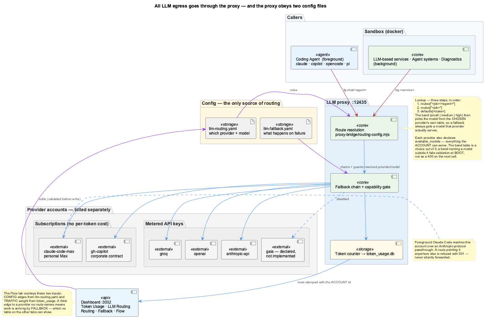
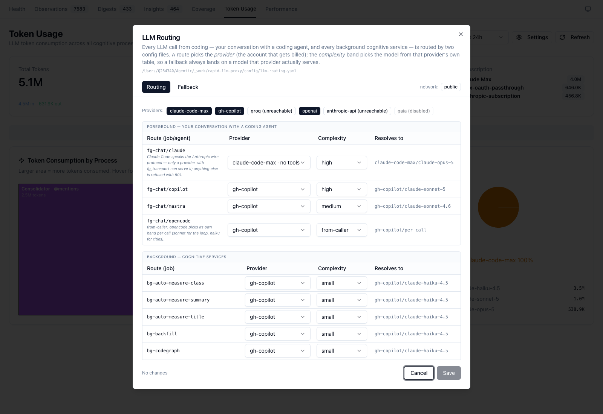
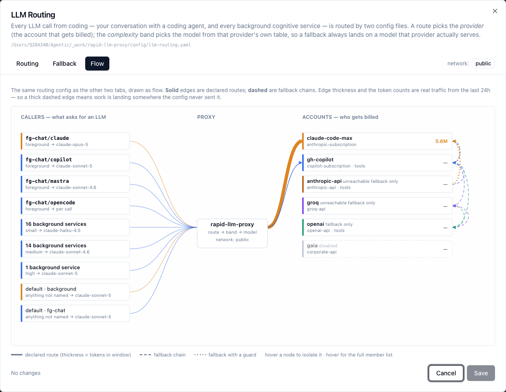

# LLM Routing

Every LLM call made anywhere in coding — your conversation with a coding agent, and every
background cognitive service in the container — goes through the llm-proxy on `:12435`, and
the proxy decides where it goes from **two YAML files**. Nothing else routes. There are no
hardcoded provider chains, no policy hidden in startup scripts, and no heuristics that
quietly reorder things.



| File | Answers |
|------|---------|
| `config/llm-routing.yaml` | Which **provider** and **model** serves a given piece of work |
| `config/llm-fallback.yaml` | What happens when that provider **can't** |

Both live in the `rapid-llm-proxy` repo, next to the code that obeys them.

---

## Naming: providers are accounts, not companies

A provider id names the **account that gets billed**, not the company that owns the model.
`claude-code-max` (personal Max subscription) and `anthropic-api` (metered API key) both
serve Claude models and are emphatically not the same thing — one is flat-rate, the other
is per-token.

This matters because it used to be collapsed. The dashboard normalized `claude-code` →
`anthropic`, which merged subscription traffic with API-key traffic under one label, so the
By Provider pie could read *"anthropic 100%"* and tell you nothing about where the money
went. Model names alone have the same problem: `claude-sonnet-5` on the corporate Copilot
contract and `claude-sonnet-5` on a metered key are different money.

So a model is **always** written `<provider>/<model>`:

```
claude-code-max/claude-opus-5     personal Max subscription
gh-copilot/claude-sonnet-5        corporate Copilot contract
groq/openai/gpt-oss-120b          Groq API key
```

That form is used identically in the proxy logs, in `token_usage.provider`, on the
dashboard, and here.

### The catalogue

| Provider id | Account | Tools? | Notes |
|---|---|---|---|
| `claude-code-max` | `anthropic-subscription` | no | The only provider that can serve **foreground Claude Code** |
| `gh-copilot` | `copilot-subscription` | yes | Corporate contract, enterprise endpoint |
| `groq` | `groq-api` | no | Fast and cheap; no Claude models |
| `openai` | `openai-api` | yes | |
| `anthropic-api` | `anthropic-api` | yes | Metered — distinct from `claude-code-max` |
| `gaia` | `corporate-api` | — | Declared for completeness; **disabled**, no implementation yet |

### `available_models` — the catalogue, separate from the choice

Each provider declares two different things, and the distinction matters:

```yaml
gh-copilot:
  available_models:            # everything this ACCOUNT can serve
    - claude-haiku-4.5
    - claude-sonnet-4.6
    - claude-sonnet-5
    - gpt-4o
    - gpt-4o-mini
  models:                      # which of them each BAND currently picks
    small:  claude-haiku-4.5
    medium: claude-sonnet-4.6
    high:   claude-sonnet-5
```

`models` is a **choice out of** `available_models`. A band naming a model outside the
catalogue **fails validation at boot**, with a message naming the key — so a stale id is
caught the moment a vendor retires it, rather than as a `400` on the next call. It is also
what lets the dashboard offer *alternatives* for a band: without a catalogue there is
nothing to choose from.

These lists are what each account **verifiably serves**, taken from 30 days of `token_usage`
plus a catalogue probe — not from a vendor page. Notably the Copilot leg rejects every
`opus` id with `400 The requested model is not supported`, so none is listed under
`gh-copilot`. The Copilot CLI's *own* BYOK path does serve opus, but that is a different
catalogue reached by a different route — **do not copy ids between the two**.

The field is optional, and an **empty list constrains nothing**, so a provider can be
declared before anyone has probed it. `gaia` is exactly that case. Without that escape
hatch, adding the field to one provider would break every other.

---

## How a route is chosen

Lookup is **three steps, in order**. No wildcards, no scoring, no tie-breaks:

1. `routes["<job>/<agent>"]` — foreground, where the agent matters
2. `routes["<job>"]` — background, where it doesn't
3. `defaults[<class>]` — class is `fg-chat` for `fg-*` jobs, `background` otherwise

`job` is `fg-chat` for a coding-agent conversation, or `bg-<service>` for a background
service (the `process` field the caller sends to `/api/complete`).

The route picks a **provider**. The **complexity band** then picks the model from *that
provider's own table*:

```yaml
routes:
  fg-chat/claude:        { provider: claude-code-max, complexity: high }
  bg-observation-writer: { provider: gh-copilot,      complexity: small }

providers:
  gh-copilot:
    models: { small: claude-haiku-4.5, medium: claude-sonnet-4.6, high: claude-sonnet-5 }
  claude-code-max:
    models: { small: claude-haiku-4.5, medium: claude-sonnet-5,   high: claude-opus-5 }
```

Deriving the model this way — rather than pinning `provider` *and* `model` per row — is what
makes fallback safe. When `bg-observation-writer` falls from `gh-copilot` to
`claude-code-max`, it lands on *that* provider's `small` model. The old scheme carried the
pinned model across "similar" providers and could hand Groq a Claude model id.

### `complexity: from-caller`

One route uses it: `fg-chat/opencode`. OpenCode picks its own model per call — sonnet for
the agentic loop, haiku for titles — and flattening that to a single band would make every
cheap call expensive. The caller supplies the band; if it sends none, the class default
applies. **The provider is still ours to decide.**

Two routes use it: `fg-chat/opencode` and `fg-chat/pi`.

This is the *only* caller input to routing. `body.provider` and `body.subscription` are
deliberately ignored: a caller that can re-route itself is a caller that can quietly move
spend onto a different account.

#### How a caller spells the band

`proxy-bridge/caller-complexity.mjs` accepts three spellings, strongest first:

| Signal | Who sends it |
|---|---|
| `complexity` on the body | every background service, and the internal `/api/complete` callers |
| `x-complexity` request header | a client that can set headers but not body fields |
| `reasoning_effort` on the body | any OpenAI-shaped client — this is how **pi** does it |

The third is the one that made `fg-chat/pi` work. pi has no `complexity` field and no way to
add one per turn, so it sent nothing, every turn fell to `defaults.fg-chat` (**high**), and
nothing pi did was ever eligible for the semantic offload — "how many r's in strawberry" was
answered by `gh-copilot/claude-sonnet-5` while the local Qwen sat idle (2026-08-28).

pi *does* put its per-turn thinking level on the wire as OpenAI's `reasoning_effort`.
`config/agents/pi.sh` gives its model a `thinkingLevelMap` that maps pi's level names onto
band names, so the value that arrives **is** the band and neither side keeps a private table
that can drift:

| pi thinking level | band | effect |
|---|---|---|
| `off` / `minimal` / `low` | `small` | eligible for the offload → free local model |
| `medium` | `medium` | stays on the route's provider |
| `high` | `high` | stays on the route's provider |
| `xhigh` / `max` | *(hidden)* | no band above `high` exists to map them to |

So **lowering pi's thinking level is what routes a cheap turn to the local model.** The raw
OpenAI words (`low`, `minimal`, `xhigh`, …) are accepted too, for a client with no such map.

This is deliberately **not** a classifier. Nothing reads prompt content; every input is a
field the caller set on purpose, and `GET /api/llm/routing/resolve?…&complexity=<band>`
reproduces the decision exactly.

---

## Semantic offload: network-scoped, and opt-in per target

`semantic_routing` moves any call whose resolved band is in `offload_bands` to a **local,
unmetered** endpoint, inserting the route's own provider as the first fallback.

There are **two** such endpoints, because there is no one machine that is always reachable —
and each carries its own switch:

```yaml
semantic_routing:
  enabled: true
  offload_bands: [ small ]
  targets:
    - provider: qwen-local     # the on-prem V100 cluster, 10/8
      require_network: corporate
      enabled: true
    - provider: qwen-laptop    # llama.cpp on this laptop, 127.0.0.1:8081
      require_network: public
      enabled: false           # last resort — see the latency note below
```

Ordered; the first **enabled** entry whose network matches wins; an entry with no
`require_network` matches everywhere. Two entries claiming one network is refused at boot —
the second could never be reached, and whoever wrote it believes it can.

**`enabled` defaults to `false`.** Declaring a target says where an offload *could* go;
enabling it says work should actually be sent there. Keeping those apart is the point:
adding a target used to be sufficient to start serving traffic from it, which is how the
laptop endpoint took a day of background work nobody had asked it to take. An off target is
kept in the parsed config rather than dropped, so the dashboard can list it and switch it
back on, and `offloadSkipped` names it as `(off)` — "no target for this network" and "the
target for this network is switched off" are different operator errors.

Switch a target on or off in **Token Usage → Settings → Routing** (a checkbox beside each
target) or in the YAML directly. The dashboard's PATCH writes the `enabled` field
surgically when the target list is otherwise unchanged, so the prose explaining *why* a
target is set the way it is survives the save; only adding, removing or reordering targets
rewrites the sequence and drops their inline notes.

`enabled: true` with no target enabled is a **warning, not a boot failure**. Switching the
last one off is a single click, and a click must never leave the proxy unable to start;
everything simply routes by the pre-offload rules and says so on every resolve.

Until 2026-08-28 this block held a single `local_provider` with a single `require_network:
corporate`. Off the VPN there was therefore no local target *at all*, and every `small` call
went back to a paid account — silently, because "the local provider is unreachable" and
"there is no local provider here" produced the same non-event. `offloadSkipped` now says
which of the two it was. The old `local_provider` / `require_network` keys are refused by
name rather than half-honoured.

**Both targets fail closed.** Each is re-probed every 60s (`/models`, no tokens) and dropped
from every chain while unreachable, so a stopped `llama-server` or an off-VPN cluster costs
nothing beyond falling back to the provider the route named.

> **Why `qwen-laptop` ships switched off.** Reachability is not usability, and the probe
> above can only establish the first: the laptop answers `/models` on loopback in
> milliseconds and then generates an order of magnitude slower than the account it
> displaces. Measured 2026-08-29 over the 66 calls it served:
>
> | | calls | mean latency | worst |
> |---|---|---|---|
> | `qwen-laptop` | 66 | **47.0s** | **932s** (a 59-token `bg-observation-writer` call) |
> | `gh-copilot` | 3045 | 5.4s | — |
>
> Worse, the 48 calls that gave up (`Qwen laptop API timed out after 120000ms`) paid **92s on
> average before the real provider was even tried** — the offload made those calls slower
> than not having it. `offload_bands` is global, so all of this landed on the highest-volume
> background services (`bg-observation-writer`, `bg-auto-measure-title`), not only on
> interactive turns, and a 50s call sits uncomfortably close to the ETM's 60s `isProcessing`
> watchdog.
>
> Free is not the only axis. Turn it on for a session where cost genuinely beats latency —
> an unmetered laptop doing bulk cheap work off-VPN is a real case — and turn it back off.

---

## Per-provider timeouts

`providers.<id>.timeout_ms` caps how long the dispatcher waits for that endpoint
before the fallback chain takes over. Omitted means the 120s default.

```yaml
providers:
  qwen-laptop:
    impl: qwen-laptop
    timeout_ms: 20000
```

It is a property of the **endpoint**, not of the request. 120s is a reasonable
ceiling for a metered account working on a hard prompt. It is the wrong ceiling
for a semantic-offload target, where three things are true at once: the call was
sent there *because* it was small and cheap, the provider its route names is
sitting first in the fallback chain answering in ~5s, and the endpoint is a
single local process that can wedge. Waiting two minutes to discover that makes
the offload strictly worse than never having offloaded — measured on 2026-08-29,
48 such calls hit the ceiling and averaged **92s before the real provider was
even tried**, against a 5.4s direct call.

A value below 1000 is refused at boot on the assumption it was meant as seconds:
`timeout_ms: 20` would abort after 20ms and take the endpoint offline in a way
that reads as "the endpoint is broken".

---

## What `total_tokens` counts

`input_tokens` is **fresh (uncached) prompt tokens** and `total_tokens` is
`input + output`, on every provider. Prompt-cache traffic lives in
`cache_read_tokens` / `cache_write_tokens` and is **additive** to those.

This has to be stated because the two wires disagree and the column cannot
express both:

| | fresh prompt | cache reads |
|---|---|---|
| Anthropic | `usage.input_tokens` | `cache_read_input_tokens` — a separate, additive counter |
| OpenAI | — | `prompt_tokens` already **contains** them; `cached_tokens` is a breakdown |

The proxy recorded each provider's number verbatim, so one column held two
conventions and could not be summed across providers. `openAIFreshInputTokens()`
in `src/usage-cache.ts` now subtracts `cached_tokens` from `prompt_tokens` at the
parse boundary, making the OpenAI leg agree with the Anthropic one.

> **What it cost before the fix.** Over 24h on 2026-08-29 the dashboard reported
> intensively-used foreground Opus-5 at **726K** tokens — its 320.8M of cache
> reads were excluded — while a background classifier reported **51.9M** with its
> cache hits counted in full. A 450× understatement of the former, which inverted
> which of the two dominated the day and made a background job look like the
> largest consumer on the machine.

Two consequences for anyone reading these rows:

- **To display consumption, add the cache columns back.** `total_tokens` alone
  answers "what did we newly send and receive", not "what did this cost us".
  The dashboard's `allTokens()` helper is the canonical form.
- **Historical rows were repaired** by `scripts/backfill-openai-wire-cache-split.mjs`,
  which touches only providers served by the OpenAI HTTP leg and refuses to run
  twice (the correction is not self-marking — 3.4% of corrected rows still match
  the pattern that selected them, so re-running would subtract again).

---

## Fallback

`llm-fallback.yaml` gives each provider an ordered list of what to try next.

```yaml
chains:
  gh-copilot:
    - provider: claude-code-max
      when: { network: [public] }   # claude-code is firewall-blocked inside corporate/CN
    - provider: groq
    - provider: openai
```

- A candidate whose **guard** doesn't hold is skipped — not an error, the chain continues.
- Chains are **flat, not recursive**: falling back from A to B does not then consult B's own
  chain. One route means one visible list of at most a few attempts, not a graph to trace.
- Only the failure classes listed in `retry_on` advance the chain. A 400 for a malformed
  request, a 401, or a content-policy refusal surfaces to the caller verbatim — retrying a
  caller's bug across three providers just burns three quotas and hides the bug.

### Sensors are not policy

`detectNetworkMode()` still exists, but it is a **sensor**: it reports `public` or
`corporate` and decides nothing. The `when:` guards are the policy. Previously the sensor
was wired straight into a chain-order ternary, which is why "why did this call go there?"
had no answerable form.

### Tool capability

A request carrying `tools[]` may only land on a provider whose `capabilities.tools` is true.
With `enforce_capabilities: true`, a tools-bearing request with no capable provider **fails
loudly** rather than landing somewhere that silently drops the tools and returns prose.

> This is the mechanism behind the August 2026 outage: `gh-copilot` was the *only*
> tools-capable provider, so a single exhausted quota collapsed every agent chain to nothing
> at once. The gate is still correct — silently stripping tools is worse. The fix is to keep
> **more than one** capable provider in the config, not to turn the gate off.

---

## Foreground Claude

`fg-chat/claude` is special, and the config says so explicitly.

Claude Code speaks the **Anthropic wire protocol**. The proxy forwards those requests
verbatim to `api.anthropic.com` (`/v1/messages`) rather than selecting a provider — so only
a provider marked `fg_transport: anthropic-passthrough` can serve it. Today that is
`claude-code-max` alone.

Routing it anywhere else is refused **loudly**:

```
HTTP 501  ROUTE_NOT_IMPLEMENTED
foreground claude is routed to "gh-copilot" by defaults.fg-chat, but this endpoint
is an Anthropic-protocol passthrough and "gh-copilot" has no fg_transport.
```

The config validator catches the explicit case at boot, so a `fg-chat/claude` route naming a
transport-less provider will not even load. The 501 covers the subtler case where claude
falls through to a `defaults.fg-chat` that points elsewhere.

**Why not just make it work:** serving foreground Claude Code on an OpenAI-shaped provider
needs a full Anthropic↔OpenAI bridge — request/response translation, SSE re-framing, and
`tool_use` ↔ `tool_calls` mapping. That is a separate piece of work. Until it exists, the
combination is refused rather than silently ignored, which is what the old passthrough did:
it never read the config at all, so the config could say one thing while the route did
another.

---

## Editing it

### From the dashboard

**Token Usage → Settings** at [localhost:3032](http://localhost:3032/token-usage).



Foreground routes are separated from background services; the *Resolves to* column derives
`<provider>/<model>` live as you change the provider or band.


Saves are sent as a **patch of only what changed** and applied through the YAML document
API, so the extensive comments in both files survive editing. The proxy **validates before
writing** — a rejected save leaves both files byte-identical and returns a message naming
the offending key.

Provider badges show reachability (`unreachable`, `disabled`) separately from configuration.
A provider being logged out is a *runtime fact*, never a routing decision — conflating the
two is how "is it configured?" and "is it working?" became the same question.

### The Flow tab — config against reality

The two tables above are exact, but answering *"what goes where"* from them means holding
35 route rows and 5 chains in your head at once. The **Flow** tab draws the same data — it
is the same payload, not a second source of truth.



Two things are kept deliberately distinct, because conflating them is the failure mode this
whole page exists to avoid:

| | Means | Drawn as |
|---|---|---|
| **Config** | Where a call is **declared** to go | Solid edges, always drawn — even for a provider that has served nothing |
| **Traffic** | Where calls **actually went** | Edge thickness and the per-account token totals, from `token_usage` over the page's window |

So a thick edge to a provider no route names means work is **arriving by fallback**. The
screenshot above is that state: `gh-copilot` is the declared target of nearly every route
and served **zero tokens**, while `claude-code-max` carries the traffic through the chain —
because the Copilot quota is exhausted. Neither table shows this.

Reading it:

- The 31 background routes collapse to the **three `(provider, band)` pairs they actually
  target**. That fan-in is the point; 31 near-identical nodes would bury it. Hover a group
  for its member list.
- The four foreground routes stay individual, because there the **agent identity is the
  route key**.
- Accounts are ordered subscriptions → metered keys → disabled, the config's own grouping,
  and the one that answers *who is paying*.
- Dashed edges are fallback chains; dotted are chains with a guard.
- Account tooltips carry `available_models` — everything that account can serve, not just
  the three bands currently pointed at it.

The graph reads the **unsaved drafts**, so it is a live preview: change a provider on the
Routing tab and the edge moves before you press Save.

If `token_usage` is unreachable the graph still draws the configuration, just unweighted,
with a note saying so. A flow diagram that renders nothing because a metrics call failed
would be worse than one that renders the config alone.

### By hand

Edit the YAML directly. The proxy reloads on mtime change; no restart needed. A config that
will not parse **aborts proxy startup** rather than being partially applied — not knowing
where any call should go is not something to serve around.

---

## Runbook: why did this call go there?

Ask the proxy. It answers with the same decision the request path makes:

```bash
curl -s 'localhost:12435/api/llm/routing/resolve?job=bg-observation-writer' | jq -r .summary
# bg-observation-writer (step 2) -> gh-copilot/claude-haiku-4.5 > claude-code-max/claude-haiku-4.5 > groq/llama-3.1-8b-instant > openai/gpt-4o-mini
```

Useful parameters:

| Parameter | Effect |
|---|---|
| `job`, `agent` | The lookup key — e.g. `job=fg-chat&agent=opencode` |
| `complexity` | Only meaningful on a `from-caller` route |
| `tools=true` | Applies the capability gate; shows which providers get dropped and why |
| `network=corporate` | Evaluates guards for the *other* network without moving the laptop |

The full response includes `skipped[]` with a stated reason per dropped provider, and
`chain[].available` marking runtime reachability.

The proxy logs the same string on every request:

```
[llm-proxy] route bg-observation-writer (step 2) -> gh-copilot/claude-haiku-4.5 > … [network=public]
[llm-proxy] gh-copilot: QUOTA_EXHAUSTED: … [quota_exhausted] — falling back to claude-code-max/claude-haiku-4.5
```

### Diagnosing a surprise

1. **`/api/llm/routing/resolve`** — did the route resolve where you expected? The
   `matchedKey` and `step` tell you which of the three lookup steps fired. A `step: 3` means
   no rule matched and you got a class default.
2. **Check `skipped[]`** before assuming a bug. A guard or the capability gate may have
   removed the provider you expected, and it says which.
3. **Reproduce with `tools[]`.** A curl reproduction of an *agent* call that omits `tools[]`
   is not equivalent — it takes a different chain and can succeed where the agent fails,
   making the agent's problem look like an agent-side bug. Always include them.
4. **Read the log line.** `fallbackFrom` in the response body and the `[<failure_class>]` tag
   in the log say exactly why the chain advanced.

### After the fact: what routing actually did

`/resolve` answers what routing *would* do. For what it *did*, every `token_usage` row
carries the decision that produced it — `route_key`, `route_band`, `route_step`,
`offloaded_from`, `chain_position` (0 = the route's own provider served it, >0 = that many
fallback hops in) and `attempt_trail`, a JSON record of the candidates that failed or were
never tried. The trail stores error *classes*, never messages.

```bash
curl -s 'localhost:12435/api/llm/routing/behaviour?hours=24' | jq
```

It returns per-route call/token counts split by the provider that actually served, the
fallback edges that were really taken with their error classes, the skipped candidates
separated into `config` (fix by editing a YAML file) and `runtime` (fix by a login or a
VPN), and the reasons the semantic offload declined to move work.

The dashboard renders all of it at **Token Usage → Routing** — configuration and observed
behaviour side by side, with a per-call table whose rows expand into the full trail. That
tab is read-only; editing stays in **Token Usage → Settings**.

Two things to know when reading those numbers:

- **`routing_source`.** `live` was observed at dispatch. `backfill` was reconstructed
  afterwards by `scripts/backfill-routing-decisions.mjs`, which resolves against *today's*
  config and is therefore wrong wherever routing has since changed. Reconstructed rows are
  badged in the UI and only ever carry `route_key`/`route_band`/`route_step` — the
  fallback and offload fields are genuinely unrecoverable and are left empty rather than
  filled with a plausible zero.
- **`unrecorded_calls`.** Rows predating the columns entirely. They are excluded from every
  figure rather than counted as "went to plan", and the count is reported so you can see
  what share of the window the percentages actually cover.

---

## What this replaced

Routing used to be spread across nine surfaces. Recording them, because most of the
confusion came from the ones that *looked* authoritative and weren't:

| Surface | Was it consulted? |
|---|---|
| `config/llm-providers.yaml` (`provider_priority`, `network_overrides`, …) | **No** — `server.mjs` contains no YAML parsing. It configures the SDK's standalone path only. |
| `.data/llm-proxy/llm-settings.json` → `processOverrides` | Yes — the *de facto* config, 26 entries, all pinned to one provider |
| Hardcoded in `server.mjs` | Yes, and it silently overruled the overrides |
| `scripts/configure-wave-analysis-routing.sh` | Yes — 250 lines of shell+python that PUT policy at startup |
| `scripts/launch-agent-common.sh` | Yes — two *different* hardcoded models for the same agent |
| `lib/experiments/agent-routing.mjs` | Yes, for experiment cells |
| `~/.config/opencode/opencode.json` | Yes — opencode's own default |
| `integrations/semantic-analysis/config/model-tiers.yaml` | **No** — dead since a merge |

Five mechanisms inside `server.mjs` decided routing invisibly: a network-dependent
`preferenceOrder`, a hardcoded `{ copilot: true }` capability map, a `CLAUDE_FAMILY` set that
carried models across providers, a reachability heuristic that reordered the chain, and
substring matching on `body.subscription`. The first two became config keys. The last three
were **deleted** — an unreachable provider is just a failed attempt that advances the chain,
which the fallback config already describes.

`lib/experiments/agent-routing.mjs` deliberately still does **not** read the routing config.
An experiment cell's model is part of its identity: the variant name and composite `task_id`
key off the spec model so `task_hash` stays constant and runs stay comparable. If it followed
live config, editing a rule mid-campaign would change which model a cell launches on while
its recorded identity stayed the same. Reproducibility wins over config unification there.

---

## See also

- [Token Usage](./token-usage.md) — how per-call rows are captured and attributed
- **LLM Architecture** (`architecture/llm-architecture.md`, docs site) — provider
  implementations, the Claude worker pool, and the per-agent transports each provider uses
