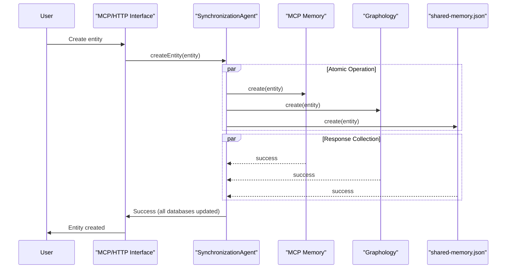
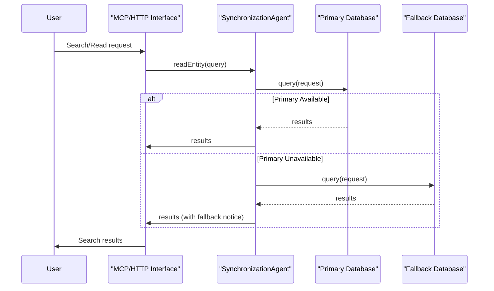
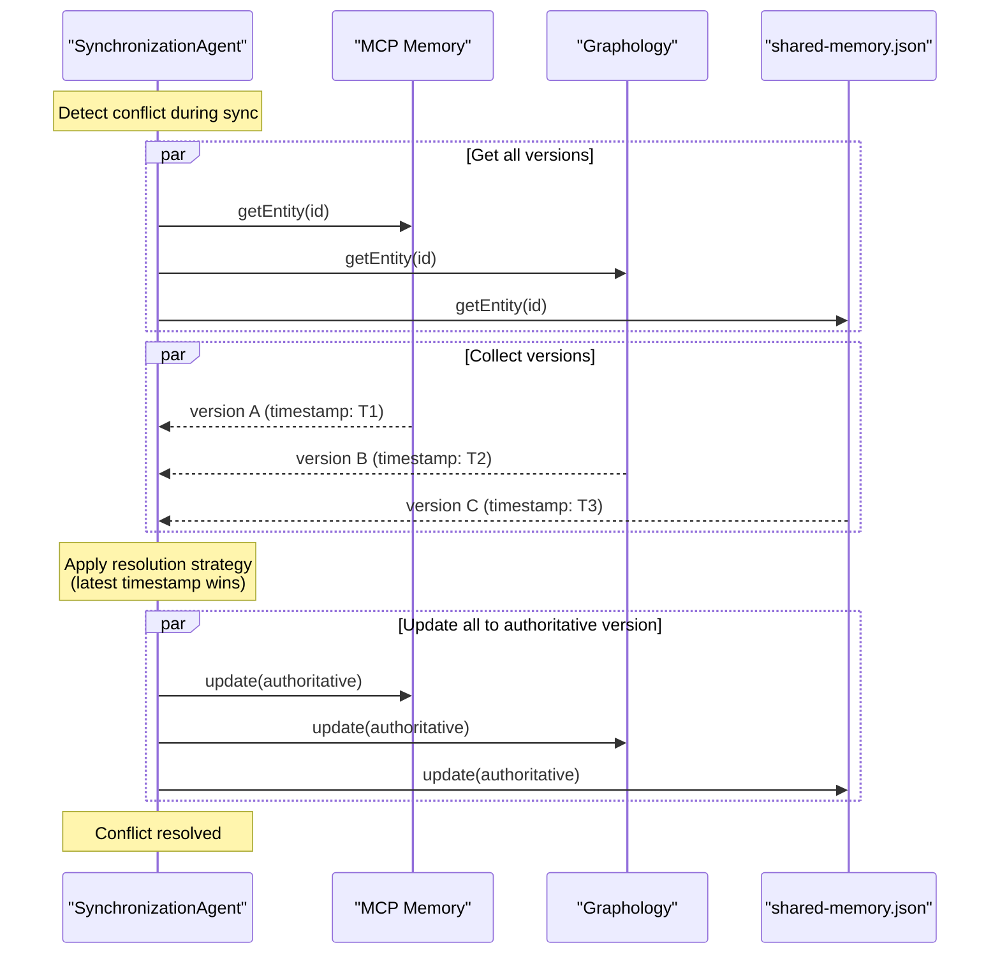

# Unified Multi-Database Memory Systems

## Overview

The unified system maintains knowledge consistency across three distinct storage systems through the **SynchronizationAgent**, which serves as the single source of truth for data integrity. This multi-database approach provides resilience, performance optimization, and seamless integration with different AI coding assistants.

## Architecture Principles

### 1. **Single Authority Pattern**
The SynchronizationAgent is the **only component** allowed to modify data across databases:
- No direct database writes from other agents
- All updates flow through SynchronizationAgent
- Atomic operations ensure consistency

### 2. **Multi-Database Synchronization**
Three databases serve different purposes but contain identical knowledge:
- **MCP Memory**: Fast in-memory access for Claude sessions
- **Graphology**: HTTP API access for CoPilot integration  
- **shared-memory.json**: Git-tracked persistence for team collaboration

### 3. **Conflict Resolution**
Automatic conflict resolution using:
- Timestamp-based precedence
- Merge strategies for observations
- Validation and consistency checks

## Database Architecture


### MCP Memory Database

#### Purpose
In-memory graph database providing fast access for Claude Code sessions via MCP protocol.

#### Characteristics
- **Storage**: RAM-based for speed
- **Persistence**: Session-based with cross-session continuity
- **Access**: Direct MCP protocol communication
- **Performance**: Millisecond response times
- **Capacity**: Limited by available memory

#### Schema
```typescript
interface MCPEntity {
  id: string;
  name: string;
  entityType: string;
  significance: number;
  observations: string[];
  metadata: {
    created: string;
    updated: string;
    source: 'mcp' | 'sync';
  };
  relationships: MCPRelationship[];
}

interface MCPRelationship {
  id: string;
  from: string;
  to: string;
  relationType: string;
  metadata: Record<string, any>;
}
```

#### API Interface
```typescript
// MCP Tool Calls
await mcp.callTool('create_knowledge_entity', {
  name: 'ReactHooksPattern',
  entityType: 'TechnicalPattern',
  significance: 8,
  observations: ['Use useEffect for side effects', 'useState for local state']
});

await mcp.callTool('search_knowledge', {
  query: 'React hooks',
  maxResults: 10
});
```

### Graphology Database

#### Purpose
Graph database optimized for HTTP API access, primarily serving VSCode CoPilot integration.

#### Characteristics
- **Storage**: Persistent graph structure
- **Persistence**: File-based with real-time updates
- **Access**: HTTP REST API
- **Performance**: Sub-second response times
- **Capacity**: Scalable to thousands of entities

#### Schema
```typescript
interface GraphologyNode {
  id: string;
  label: string;
  attributes: {
    type: string;
    significance: number;
    observations: string[];
    metadata: Record<string, any>;
    created: string;
    updated: string;
  };
}

interface GraphologyEdge {
  id: string;
  source: string;
  target: string;
  type: string;
  attributes: {
    metadata: Record<string, any>;
    created: string;
  };
}
```

#### API Interface
```bash
# REST API Endpoints
GET    /api/graph/full                    # Get complete graph
GET    /api/graph/status                  # Health check
POST   /api/graph/entity                  # Create entity
PUT    /api/graph/entity/:id              # Update entity
DELETE /api/graph/entity/:id              # Remove entity
POST   /api/graph/relation                # Create relationship
GET    /api/graph/search?q=query          # Search entities
```

### shared-memory.json (File System)

#### Purpose
Git-tracked authoritative knowledge base providing team collaboration and backup storage.

#### Characteristics
- **Storage**: JSON file in git repository
- **Persistence**: Version-controlled with full history
- **Access**: File system operations
- **Performance**: Optimized for batch operations
- **Capacity**: Practically unlimited

#### Schema
```json
{
  "metadata": {
    "version": "2.0.0",
    "total_entities": 42,
    "total_relations": 67,
    "last_updated": "2025-01-01T12:00:00Z",
    "schema_version": "enhanced-v2",
    "sync_status": {
      "mcp_last_sync": "2025-01-01T12:00:00Z",
      "graphology_last_sync": "2025-01-01T12:00:00Z"
    }
  },
  "entities": [
    {
      "name": "ReactHooksPattern",
      "entityType": "TechnicalPattern",
      "significance": 8,
      "observations": [
        {
          "type": "problem",
          "content": "Class components are verbose and hard to test",
          "date": "2025-01-01T10:00:00Z"
        },
        {
          "type": "solution",
          "content": "Use React hooks for simpler, more testable components",
          "date": "2025-01-01T10:00:00Z"
        }
      ],
      "metadata": {
        "created_at": "2025-01-01T10:00:00Z",
        "last_updated": "2025-01-01T12:00:00Z",
        "source": "unified-agent-system",
        "sync_version": 3
      }
    }
  ],
  "relations": [
    {
      "from": "ReactHooksPattern",
      "relationType": "implemented_in",
      "to": "MyReactProject",
      "metadata": {
        "created": "2025-01-01T10:30:00Z",
        "source": "agent-analysis"
      }
    }
  ]
}
```

## SynchronizationAgent Architecture

### Core Responsibilities

#### 1. **Multi-Adapter Management**
```typescript
class SynchronizationAgent {
  private mcpAdapter: MCPAdapter;
  private graphologyAdapter: GraphologyAdapter;
  private fileAdapter: FileSystemAdapter;
  
  async initialize() {
    // Initialize all adapters
    await this.mcpAdapter.connect();
    await this.graphologyAdapter.connect();
    await this.fileAdapter.validate();
    
    // Verify connectivity
    await this.testAllAdapters();
  }
}
```

#### 2. **Unified Operations**
```typescript
async createEntity(entity: KnowledgeEntity): Promise<SyncResult> {
  // Validate entity structure
  const validated = await this.validateEntity(entity);
  
  // Execute on all adapters atomically
  const results = await Promise.allSettled([
    this.mcpAdapter.createEntity(validated),
    this.graphologyAdapter.createEntity(validated),
    this.fileAdapter.createEntity(validated)
  ]);
  
  // Handle any failures
  return this.handleSyncResults(results);
}
```

#### 3. **Conflict Resolution**
```typescript
async resolveConflicts(): Promise<ConflictResolution> {
  // Get versions from all databases
  const [mcpEntities, graphologyEntities, fileEntities] = await Promise.all([
    this.mcpAdapter.getAllEntities(),
    this.graphologyAdapter.getAllEntities(),
    this.fileAdapter.getAllEntities()
  ]);
  
  // Identify conflicts
  const conflicts = this.identifyConflicts(mcpEntities, graphologyEntities, fileEntities);
  
  // Resolve using strategy
  return this.applyResolutionStrategy(conflicts);
}
```

### Synchronization Strategies

#### 1. **Real-Time Synchronization**
```typescript
// Immediate sync for user-initiated operations
async handleUserOperation(operation: UserOperation): Promise<void> {
  const result = await this.executeOnAllDatabases(operation);
  
  if (!result.allSucceeded) {
    // Rollback failed operations
    await this.rollbackFailedOperations(result);
    throw new SyncError('Operation failed on some databases');
  }
}
```

#### 2. **Batch Synchronization**
```typescript
// Periodic batch sync for consistency
async performBatchSync(): Promise<BatchSyncResult> {
  const operations = await this.collectPendingOperations();
  
  return this.executeBatchOperations(operations);
}
```

#### 3. **Recovery Synchronization**
```typescript
// Recovery after system restart or network issues
async performRecoverySync(): Promise<RecoveryResult> {
  // Identify last known good state
  const lastSync = await this.getLastSyncTimestamp();
  
  // Collect changes since last sync
  const changes = await this.getChangesSince(lastSync);
  
  // Apply changes to bring all databases in sync
  return this.applyRecoveryChanges(changes);
}
```

## Data Flow Patterns

### 1. **Create Operation Flow**



### 2. **Read Operation Flow**



### 3. **Conflict Resolution Flow**



## Performance Optimization

### Read Performance
```typescript
class SynchronizationAgent {
  // Prefer fastest database for reads
  async readEntity(id: string): Promise<Entity> {
    try {
      // Try MCP first (fastest)
      return await this.mcpAdapter.getEntity(id);
    } catch {
      try {
        // Fallback to Graphology
        return await this.graphologyAdapter.getEntity(id);
      } catch {
        // Final fallback to file
        return await this.fileAdapter.getEntity(id);
      }
    }
  }
}
```

### Write Performance
```typescript
class SynchronizationAgent {
  // Batch writes for better performance
  async batchWrite(entities: Entity[]): Promise<BatchResult> {
    const batches = this.chunkEntities(entities, BATCH_SIZE);
    
    const results = await Promise.all(
      batches.map(batch => this.writeBatch(batch))
    );
    
    return this.mergeBatchResults(results);
  }
}
```

### Caching Strategy
```typescript
class SynchronizationAgent {
  private cache = new Map<string, CachedEntity>();
  
  async getEntity(id: string): Promise<Entity> {
    // Check cache first
    const cached = this.cache.get(id);
    if (cached && !this.isCacheExpired(cached)) {
      return cached.entity;
    }
    
    // Fetch from database
    const entity = await this.readFromDatabase(id);
    this.cache.set(id, { entity, timestamp: Date.now() });
    
    return entity;
  }
}
```

## Monitoring and Diagnostics

### Health Monitoring
```typescript
interface DatabaseHealth {
  database: 'mcp' | 'graphology' | 'file';
  status: 'healthy' | 'degraded' | 'unavailable';
  latency: number;
  lastSync: string;
  errorCount: number;
}

async getSystemHealth(): Promise<DatabaseHealth[]> {
  return Promise.all([
    this.checkMCPHealth(),
    this.checkGraphologyHealth(),
    this.checkFileHealth()
  ]);
}
```

### Sync Status
```typescript
interface SyncStatus {
  lastFullSync: string;
  pendingOperations: number;
  conflictCount: number;
  databases: {
    mcp: { entities: number; lastUpdate: string };
    graphology: { entities: number; lastUpdate: string };
    file: { entities: number; lastUpdate: string };
  };
}
```

### Performance Metrics
```typescript
interface PerformanceMetrics {
  operations: {
    create: { count: number; avgLatency: number };
    read: { count: number; avgLatency: number };
    update: { count: number; avgLatency: number };
    delete: { count: number; avgLatency: number };
  };
  sync: {
    successRate: number;
    avgSyncTime: number;
    conflictRate: number;
  };
}
```

## Troubleshooting

### Common Issues

#### 1. **Database Out of Sync**
**Symptoms**: Different data across MCP, Graphology, and files
**Diagnosis**:
```bash
# Check sync status
curl http://localhost:8765/api/sync/status
# Compare entity counts
@KM compare databases
```
**Solution**:
```bash
# Force full resync
sync_with_ukb {"direction": "bidirectional", "force": true}
```

#### 2. **Performance Degradation**
**Symptoms**: Slow response times, timeouts
**Diagnosis**:
```bash
# Check database health
get_system_status
# Monitor sync operations
tail -f semantic-analysis-system/logs/sync.log
```
**Solution**:
```bash
# Clear cache and restart
@KM clear cache
@KM restart sync
```

#### 3. **Conflict Resolution Failures**
**Symptoms**: Repeated conflicts, inconsistent data
**Diagnosis**:
```bash
# Check for stuck conflicts
@KM list conflicts
# Review conflict resolution logs
tail -f semantic-analysis-system/logs/conflicts.log
```
**Solution**:
```bash
# Manual conflict resolution
@KM resolve conflicts --manual
# Or reset to authoritative source
@KM reset from shared-memory
```

## Configuration

### SynchronizationAgent Configuration
```yaml
# semantic-analysis-system/config/sync.yaml
synchronization:
  enabled: true
  adapters:
    mcp:
      enabled: true
      timeout: 30000
      retries: 3
    graphology:
      enabled: true
      host: localhost
      port: 8765
      timeout: 30000
    file:
      enabled: true
      path: ../shared-memory.json
      backup: true
  
  strategies:
    conflict_resolution: timestamp_wins
    batch_size: 50
    cache_ttl: 300000
    sync_interval: 60000
```

### Environment Variables
```bash
# Multi-database configuration
SYNC_ENABLED=true
MCP_ADAPTER_ENABLED=true
GRAPHOLOGY_ADAPTER_ENABLED=true
FILE_ADAPTER_ENABLED=true

# Performance tuning
SYNC_BATCH_SIZE=50
SYNC_CACHE_TTL=300000
SYNC_RETRY_COUNT=3
```

## See Also

- [System Overview](../system-overview.md)
- [SynchronizationAgent Implementation](../components/semantic-analysis/synchronization-agent.md)
- [MCP Memory Server Setup](../components/semantic-analysis/mcp-server-setup.md)
- [Graphology Integration](../integrations/graphology-integration.md)