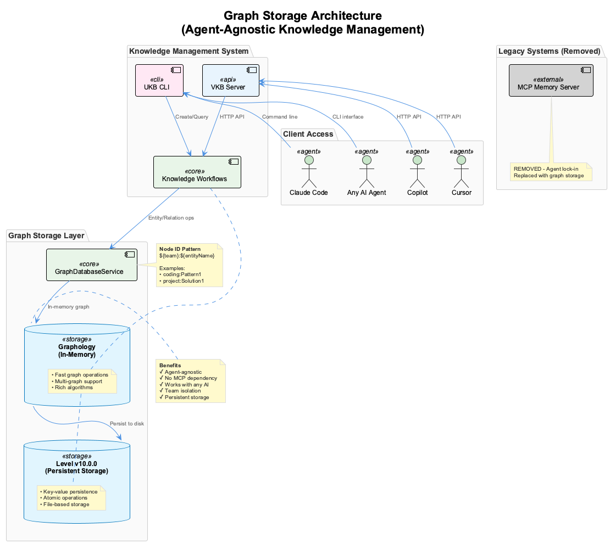
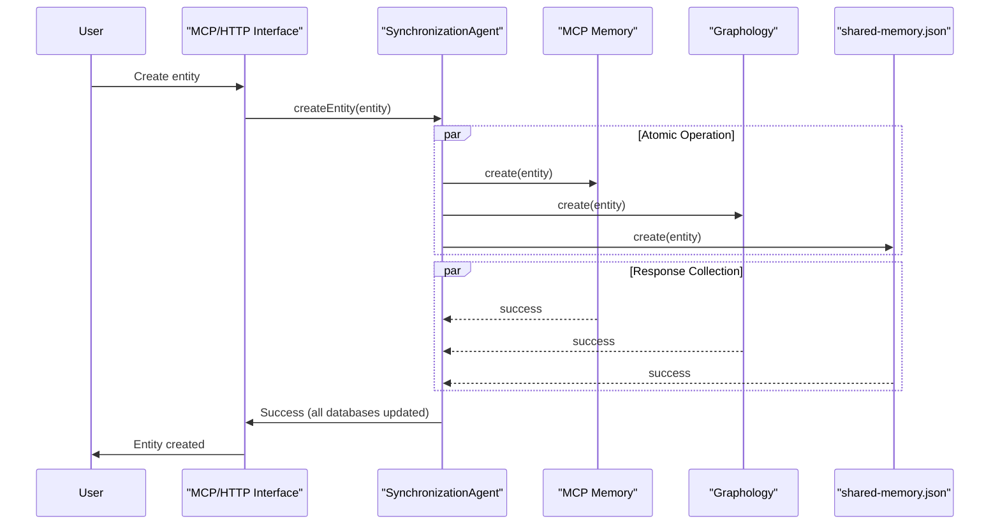
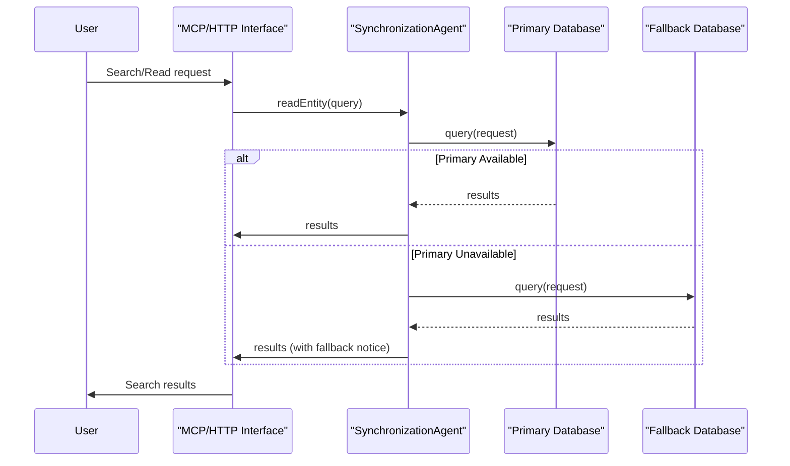
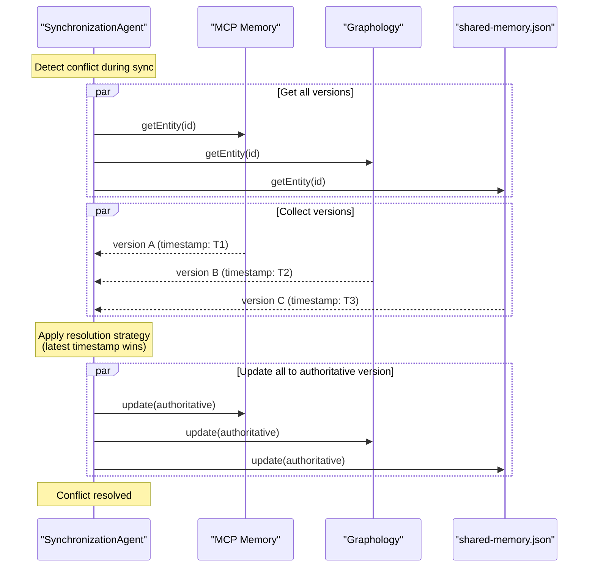

# Graph-Based Knowledge Storage Architecture

**Migration Completed**: 2025-10-22
**Status**: ✅ All knowledge now stored in Graph DB + Qdrant

## Overview

The knowledge management system uses a **graph-first storage architecture** that is agent-agnostic, eliminating dependency on Claude Code or MCP Memory server. This architecture provides persistent, high-performance knowledge storage that works with any AI coding assistant.

**Current State**: All online learning and batch operations write directly to Graph DB. SQLite is retained for analytics only (budget tracking, session metrics, embedding cache).

## Architecture Principles

### 1. **Agent-Agnostic Design**
The GraphDatabaseService is accessible to any coding agent:
- No MCP Memory server dependency
- Works with Claude Code, Copilot, Cursor, and others
- CLI and HTTP API access methods

### 2. **Graph-Native Storage**
Native graph database for knowledge representation:
- **Graphology**: In-memory graph with rich algorithms
- **Level**: Persistent key-value storage
- **Team Isolation**: Node ID pattern `${team}:${entityName}`

### 3. **Backward Compatibility**
Maintains API compatibility with previous SQLite format:
- VKB frontend works without changes
- Existing tools and scripts continue to function
- Gradual migration path from SQLite

## Database Architecture



### Graph Database Components

The knowledge management system uses two complementary storage layers:

#### 1. Graphology (In-Memory Graph)

**Purpose**: Fast in-memory graph operations with native support for graph algorithms.


The diagram above shows the Graphology-based memory fallback architecture used when MCP Memory is unavailable. It provides in-memory graph operations with periodic synchronization to .data/knowledge-export/*.json for cross-agent compatibility.

**Characteristics**:
- Pure JavaScript implementation
- Multi-graph support (multiple edges between nodes)
- Rich ecosystem of graph algorithms
- Fast traversals and queries
- Memory-efficient node/edge storage

**Schema**:
```typescript
// Node structure
graph.addNode('coding:PatternName', {
  name: 'PatternName',
  entityType: 'Pattern',
  team: 'coding',
  observations: string[],
  confidence: number,
  source: 'manual' | 'automated',
  metadata: Record<string, any>,
  createdAt: string,
  updatedAt: string
});

// Edge structure
graph.addEdge('coding:Pattern1', 'coding:Solution1', {
  relationType: 'implements' | 'solves' | 'uses',
  team: 'coding',
  confidence: number,
  metadata: Record<string, any>,
  createdAt: string
});
```

#### 2. Level v10.0.0 (Persistent Storage)

**Purpose**: Persistent key-value storage for graph state.

**Characteristics**:
- File-based persistence in `.data/knowledge-graph/`
- Atomic write operations
- Efficient key-value storage
- Automatic synchronization from Graphology
- Crash recovery support

**Storage Format**:
```typescript
// Persisted as key-value pairs
key: 'coding:PatternName'
value: {
  name: 'PatternName',
  entityType: 'Pattern',
  // ... all node attributes
  edges: [
    { target: 'coding:Solution1', relationType: 'implements', ... }
  ]
}
```

### Data Access Methods

The graph database is accessible through multiple interfaces for different use cases:

#### 1. CLI Access (UKB Commands)
```bash
# Create entity
ukb add "Pattern" "API Design Pattern"

# Query entities
ukb query --team coding --type Pattern

# View relationships
ukb relations --from "Pattern1"
```

**Used by**: Any CLI-based coding agent (Claude Code, Cursor, Aider, etc.)

#### 2. HTTP API (VKB Server)
```bash
# Get all entities for team
GET /api/entities?team=coding

# Get entity details
GET /api/entities/:id

# Get relationships
GET /api/relations?team=coding

# Create entity
POST /api/entities
{
  "name": "PatternName",
  "entityType": "Pattern",
  "team": "coding",
  "observations": [...]
}
```

**Used by**: Web interfaces, VS Code extensions, remote agents

#### 3. Direct API (JavaScript)
```typescript
import { DatabaseManager } from './databases/DatabaseManager.js';

const dbManager = new DatabaseManager({
  graphDbPath: '.data/knowledge-graph'
});

await dbManager.initialize();

// Store entity
await dbManager.graphDB.storeEntity({
  name: 'PatternName',
  entityType: 'Pattern',
  observations: ['observation 1'],
  confidence: 0.9
}, { team: 'coding' });

// Query entities
const entities = await dbManager.graphDB.queryEntities({
  team: 'coding',
  entityType: 'Pattern'
});

// Find related entities
const related = await dbManager.graphDB.findRelated(
  'PatternName',
  2,  // maxDepth
  { team: 'coding' }
);
```

**Used by**: Internal services, integrations, automated workflows

## SynchronizationAgent Architecture

### Core Responsibilities

#### 1. **Multi-Adapter Management**
```typescript
class SynchronizationAgent {
  private mcpAdapter: MCPAdapter;
  private graphologyAdapter: GraphologyAdapter;
  private fileAdapter: FileSystemAdapter;
  
  async initialize() {
    // Initialize all adapters
    await this.mcpAdapter.connect();
    await this.graphologyAdapter.connect();
    await this.fileAdapter.validate();
    
    // Verify connectivity
    await this.testAllAdapters();
  }
}
```

#### 2. **Unified Operations**
```typescript
async createEntity(entity: KnowledgeEntity): Promise<SyncResult> {
  // Validate entity structure
  const validated = await this.validateEntity(entity);
  
  // Execute on all adapters atomically
  const results = await Promise.allSettled([
    this.mcpAdapter.createEntity(validated),
    this.graphologyAdapter.createEntity(validated),
    this.fileAdapter.createEntity(validated)
  ]);
  
  // Handle any failures
  return this.handleSyncResults(results);
}
```

#### 3. **Conflict Resolution**
```typescript
async resolveConflicts(): Promise<ConflictResolution> {
  // Get versions from all databases
  const [mcpEntities, graphologyEntities, fileEntities] = await Promise.all([
    this.mcpAdapter.getAllEntities(),
    this.graphologyAdapter.getAllEntities(),
    this.fileAdapter.getAllEntities()
  ]);
  
  // Identify conflicts
  const conflicts = this.identifyConflicts(mcpEntities, graphologyEntities, fileEntities);
  
  // Resolve using strategy
  return this.applyResolutionStrategy(conflicts);
}
```

### Synchronization Strategies

#### 1. **Real-Time Synchronization**
```typescript
// Immediate sync for user-initiated operations
async handleUserOperation(operation: UserOperation): Promise<void> {
  const result = await this.executeOnAllDatabases(operation);
  
  if (!result.allSucceeded) {
    // Rollback failed operations
    await this.rollbackFailedOperations(result);
    throw new SyncError('Operation failed on some databases');
  }
}
```

#### 2. **Batch Synchronization**
```typescript
// Periodic batch sync for consistency
async performBatchSync(): Promise<BatchSyncResult> {
  const operations = await this.collectPendingOperations();
  
  return this.executeBatchOperations(operations);
}
```

#### 3. **Recovery Synchronization**
```typescript
// Recovery after system restart or network issues
async performRecoverySync(): Promise<RecoveryResult> {
  // Identify last known good state
  const lastSync = await this.getLastSyncTimestamp();
  
  // Collect changes since last sync
  const changes = await this.getChangesSince(lastSync);
  
  // Apply changes to bring all databases in sync
  return this.applyRecoveryChanges(changes);
}
```

## Data Flow Patterns

### 1. **Create Operation Flow**



### 2. **Read Operation Flow**



### 3. **Conflict Resolution Flow**



## Performance Optimization

### Read Performance
```typescript
class SynchronizationAgent {
  // Prefer fastest database for reads
  async readEntity(id: string): Promise<Entity> {
    try {
      // Try MCP first (fastest)
      return await this.mcpAdapter.getEntity(id);
    } catch {
      try {
        // Fallback to Graphology
        return await this.graphologyAdapter.getEntity(id);
      } catch {
        // Final fallback to file
        return await this.fileAdapter.getEntity(id);
      }
    }
  }
}
```

### Write Performance
```typescript
class SynchronizationAgent {
  // Batch writes for better performance
  async batchWrite(entities: Entity[]): Promise<BatchResult> {
    const batches = this.chunkEntities(entities, BATCH_SIZE);
    
    const results = await Promise.all(
      batches.map(batch => this.writeBatch(batch))
    );
    
    return this.mergeBatchResults(results);
  }
}
```

### Caching Strategy
```typescript
class SynchronizationAgent {
  private cache = new Map<string, CachedEntity>();
  
  async getEntity(id: string): Promise<Entity> {
    // Check cache first
    const cached = this.cache.get(id);
    if (cached && !this.isCacheExpired(cached)) {
      return cached.entity;
    }
    
    // Fetch from database
    const entity = await this.readFromDatabase(id);
    this.cache.set(id, { entity, timestamp: Date.now() });
    
    return entity;
  }
}
```

## Monitoring and Diagnostics

### Health Monitoring
```typescript
interface DatabaseHealth {
  database: 'mcp' | 'graphology' | 'file';
  status: 'healthy' | 'degraded' | 'unavailable';
  latency: number;
  lastSync: string;
  errorCount: number;
}

async getSystemHealth(): Promise<DatabaseHealth[]> {
  return Promise.all([
    this.checkMCPHealth(),
    this.checkGraphologyHealth(),
    this.checkFileHealth()
  ]);
}
```

### Sync Status
```typescript
interface SyncStatus {
  lastFullSync: string;
  pendingOperations: number;
  conflictCount: number;
  databases: {
    mcp: { entities: number; lastUpdate: string };
    graphology: { entities: number; lastUpdate: string };
    file: { entities: number; lastUpdate: string };
  };
}
```

### Performance Metrics
```typescript
interface PerformanceMetrics {
  operations: {
    create: { count: number; avgLatency: number };
    read: { count: number; avgLatency: number };
    update: { count: number; avgLatency: number };
    delete: { count: number; avgLatency: number };
  };
  sync: {
    successRate: number;
    avgSyncTime: number;
    conflictRate: number;
  };
}
```

## Troubleshooting

### Common Issues

#### 1. **Database Out of Sync**
**Symptoms**: Different data across MCP, Graphology, and files
**Diagnosis**:
```bash
# Check sync status
curl http://localhost:8765/api/sync/status
# Compare entity counts
@KM compare databases
```
**Solution**:
```bash
# Force full resync
sync_with_ukb {"direction": "bidirectional", "force": true}
```

#### 2. **Performance Degradation**
**Symptoms**: Slow response times, timeouts
**Diagnosis**:
```bash
# Check database health
get_system_status
# Monitor sync operations
tail -f semantic-analysis-system/logs/sync.log
```
**Solution**:
```bash
# Clear cache and restart
@KM clear cache
@KM restart sync
```

#### 3. **Conflict Resolution Failures**
**Symptoms**: Repeated conflicts, inconsistent data
**Diagnosis**:
```bash
# Check for stuck conflicts
@KM list conflicts
# Review conflict resolution logs
tail -f semantic-analysis-system/logs/conflicts.log
```
**Solution**:
```bash
# Manual conflict resolution
@KM resolve conflicts --manual
# Or reset to authoritative source
@KM reset from shared-memory
```

## Configuration

### SynchronizationAgent Configuration
```yaml
# semantic-analysis-system/config/sync.yaml
synchronization:
  enabled: true
  adapters:
    mcp:
      enabled: true
      timeout: 30000
      retries: 3
    graphology:
      enabled: true
      host: localhost
      port: 8765
      timeout: 30000
    file:
      enabled: true
      path: ../shared-memory.json
      backup: true
  
  strategies:
    conflict_resolution: timestamp_wins
    batch_size: 50
    cache_ttl: 300000
    sync_interval: 60000
```

### Environment Variables
```bash
# Multi-database configuration
SYNC_ENABLED=true
MCP_ADAPTER_ENABLED=true
GRAPHOLOGY_ADAPTER_ENABLED=true
FILE_ADAPTER_ENABLED=true

# Performance tuning
SYNC_BATCH_SIZE=50
SYNC_CACHE_TTL=300000
SYNC_RETRY_COUNT=3
```

## See Also

- [System Overview](../system-overview.md)
- [SynchronizationAgent Implementation](../components/semantic-analysis/synchronization-agent.md)
- [MCP Memory Server Setup](../components/semantic-analysis/mcp-server-setup.md)
- [Graphology Integration](../integrations/graphology-integration.md)