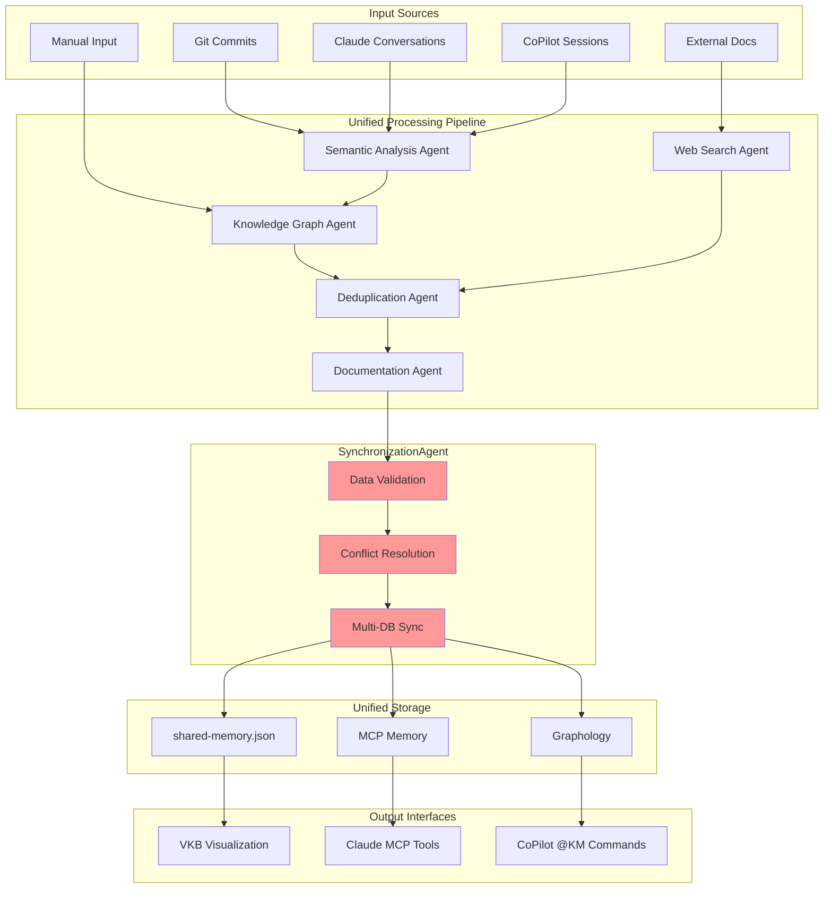

# Unified Knowledge Flow Architecture

## Overview

The unified knowledge flow ensures that insights, patterns, and learning extracted from both Claude Code and GitHub CoPilot sessions flow through the same semantic analysis pipeline and are consistently stored across all knowledge databases.

## Knowledge Flow Principles

### 1. **Single Processing Pipeline**
All knowledge extraction uses the same 7-agent system regardless of entry point:
- Same semantic analysis algorithms
- Same entity extraction logic  
- Same relationship mapping
- Same significance scoring

### 2. **Multi-Source Input**
Knowledge flows from multiple sources:
- Git repository commits
- AI conversation logs (.specstory/history/)
- Direct user input via unified commands
- External documentation research

### 3. **Unified Storage Target**
All knowledge flows to the same synchronized storage:
- MCP Memory (Claude sessions)
- Graphology (CoPilot integration)
- shared-memory.json (Git persistence)

## Knowledge Flow Diagram



## Detailed Knowledge Flow

### 1. Input Processing

#### Git Repository Analysis
```bash
# Triggered by unified commands
determine_insights {
  "repository": ".",
  "depth": 10,
  "significanceThreshold": 7
}
```

**Flow**:
1. Semantic Analysis Agent examines recent commits
2. Extracts patterns from code changes
3. Analyzes commit messages for intent
4. Scores significance based on impact

#### Conversation Log Processing
```bash
# Automatic processing of .specstory/history/
analyze_conversation {
  "conversationPath": ".specstory/history/latest.md",
  "extractInsights": true,
  "updateKnowledge": true
}
```

**Flow**:
1. Semantic Analysis Agent parses conversation logs
2. Identifies problem/solution patterns
3. Extracts technical insights
4. Links to code changes when available

#### Manual Knowledge Entry
```bash
# Direct insight capture
update_knowledge_base {
  "insights": [{
    "name": "ReactErrorBoundaryPattern",
    "problem": "Component errors crash entire app",
    "solution": "Use error boundaries with fallback UI",
    "significance": 8
  }]
}
```

**Flow**:
1. Knowledge Graph Agent validates input structure
2. Deduplication Agent checks for existing patterns
3. Documentation Agent creates structured records
4. SynchronizationAgent ensures multi-database consistency

### 2. Processing Pipeline

#### Semantic Analysis Agent
**Responsibilities**:
- Code pattern recognition
- Conversation insight extraction  
- Significance scoring
- Context analysis

**Input**: Raw commits, conversations, manual input
**Output**: Structured analysis results

```typescript
interface AnalysisResult {
  patterns: Pattern[];
  insights: Insight[];
  significance: number;
  context: AnalysisContext;
}
```

#### Knowledge Graph Agent
**Responsibilities**:
- Entity extraction and creation
- Relationship mapping
- Graph structure management
- Schema validation

**Input**: Analysis results from Semantic Analysis Agent
**Output**: Structured entities and relationships

```typescript
interface KnowledgeEntity {
  name: string;
  entityType: string;
  significance: number;
  observations: Observation[];
  metadata: EntityMetadata;
}
```

#### Web Search Agent
**Responsibilities**:
- External documentation research
- Technology reference gathering
- Context enrichment
- Validation of technical claims

**Input**: Entity names, technology references
**Output**: Enriched context and external references

#### Deduplication Agent
**Responsibilities**:
- Similarity detection
- Duplicate prevention
- Content normalization
- Quality filtering

**Input**: Candidate entities from Knowledge Graph Agent
**Output**: Validated, unique entities

#### Documentation Agent
**Responsibilities**:
- Markdown documentation generation
- Cross-reference creation
- Template application
- Structured formatting

**Input**: Validated entities from Deduplication Agent
**Output**: Rich documentation and formatted insights

### 3. SynchronizationAgent Processing

The SynchronizationAgent is the **critical component** ensuring data integrity across all storage systems.

#### Data Validation
```typescript
async validateEntity(entity: KnowledgeEntity): Promise<ValidationResult> {
  // Check schema compliance
  // Validate required fields
  // Ensure data consistency
  // Return validation status
}
```

#### Conflict Resolution
```typescript
async resolveConflicts(
  mcpVersion: Entity, 
  graphologyVersion: Entity, 
  fileVersion: Entity
): Promise<Entity> {
  // Compare timestamps
  // Merge observations
  // Resolve significance conflicts
  // Return authoritative version
}
```

#### Multi-Database Synchronization
```typescript
async synchronizeAll(entity: KnowledgeEntity): Promise<SyncResult> {
  const results = {
    mcp: await this.syncToMCP(entity),
    graphology: await this.syncToGraphology(entity),
    files: await this.syncToFiles(entity)
  };
  
  return this.validateSyncResults(results);
}
```

### 4. Storage Layer

#### MCP Memory (Claude Code)
- **Purpose**: In-memory graph for Claude sessions
- **Features**: Fast access, session persistence
- **Sync**: Real-time via SynchronizationAgent

#### Graphology (CoPilot Integration)
- **Purpose**: Graph database for VSCode CoPilot
- **Features**: HTTP API access, real-time updates
- **Sync**: Real-time via SynchronizationAgent

#### shared-memory.json (Git Persistence)
- **Purpose**: Authoritative, git-tracked knowledge base
- **Features**: Version control, team collaboration
- **Sync**: Batch updates via SynchronizationAgent

## Knowledge Flow Examples

### Example 1: Claude Code Session

```bash
# User starts Claude with unified system
claude-mcp

# User requests insight determination
determine_insights {
  "repository": ".",
  "conversationContext": "Refactoring React components",
  "depth": 5
}
```

**Knowledge Flow**:
1. **Semantic Analysis Agent** analyzes last 5 commits + current conversation
2. **Knowledge Graph Agent** extracts React refactoring patterns
3. **Web Search Agent** finds React best practices documentation
4. **Deduplication Agent** checks against existing React patterns
5. **Documentation Agent** creates structured React refactoring insights
6. **SynchronizationAgent** ensures insights appear in:
   - MCP Memory (immediate Claude access)
   - Graphology (available to CoPilot)
   - shared-memory.json (git-tracked for team)

### Example 2: CoPilot Session

```bash
# User starts CoPilot with unified system
coding --copilot

# User captures insight via VSCode
@KM update knowledge base "Use React.memo for expensive component re-renders"
```

**Knowledge Flow**:
1. **HTTP API** receives @KM command
2. **Knowledge Graph Agent** structures the React performance insight
3. **Deduplication Agent** checks against existing performance patterns
4. **Documentation Agent** creates detailed documentation
5. **SynchronizationAgent** ensures insight appears in:
   - Graphology (immediate CoPilot access)
   - MCP Memory (available to Claude)
   - shared-memory.json (git-tracked for team)

### Example 3: Cross-AI Learning

```bash
# Developer A uses Claude to solve async error handling
# SynchronizationAgent stores solution in all databases

# Developer B uses CoPilot and finds the same solution
@KM search "async error handling"
# Returns the solution from Developer A's Claude session
```

**Knowledge Flow**:
1. Developer A's Claude session creates async error handling pattern
2. SynchronizationAgent stores in MCP Memory, Graphology, and files
3. Developer B's CoPilot search queries Graphology
4. Same knowledge base provides consistent results

## Monitoring Knowledge Flow

### Real-Time Monitoring

```bash
# Monitor agent activities
tail -f semantic-analysis-system/logs/agents.log

# Check SynchronizationAgent status
curl http://localhost:8765/api/graph/status

# View workflow progress
get_workflow_status {"workflowId": "analysis-123"}  # Claude
@KM workflow status analysis-123                    # CoPilot
```

### Flow Validation

```bash
# Verify data consistency across databases
@KM validate sync  # CoPilot
sync_with_ukb {"direction": "bidirectional"}  # Claude

# Check for missing or duplicate entities
@KM check duplicates
```

## Performance Considerations

### Optimization Strategies

1. **Batch Processing**: Group similar operations to reduce sync overhead
2. **Caching**: Cache frequently accessed entities in memory
3. **Lazy Loading**: Load relationships on-demand
4. **Conflict Prevention**: Use timestamps and versioning to prevent conflicts

### Scaling Guidelines

- **Single User**: All agents run locally, shared-memory.json provides persistence
- **Small Team (2-5)**: Shared git repository, occasional sync conflicts
- **Large Team (5+)**: Consider centralized knowledge base with API access

## Troubleshooting Knowledge Flow

### Common Issues

#### 1. Knowledge Not Appearing Across All Systems
**Symptoms**: Insight created in Claude doesn't appear in CoPilot
**Solution**:
```bash
# Check SynchronizationAgent status
curl http://localhost:8765/api/graph/status
# Force manual sync
sync_with_ukb {"direction": "bidirectional"}
```

#### 2. Duplicate Insights
**Symptoms**: Same pattern appears multiple times
**Solution**:
```bash
# Run deduplication
@KM deduplicate
# Check deduplication agent logs
tail -f semantic-analysis-system/logs/deduplication.log
```

#### 3. Sync Conflicts
**Symptoms**: Different versions of same entity across databases
**Solution**:
```bash
# Check for conflicts
@KM check conflicts
# Resolve manually or automatically
@KM resolve conflicts --auto
```

## See Also

- [Unified System Overview](unified-system-overview.md)
- [Multi-Database Synchronization](unified-memory-systems.md)
- [SynchronizationAgent Architecture](../components/semantic-analysis/synchronization-agent.md)