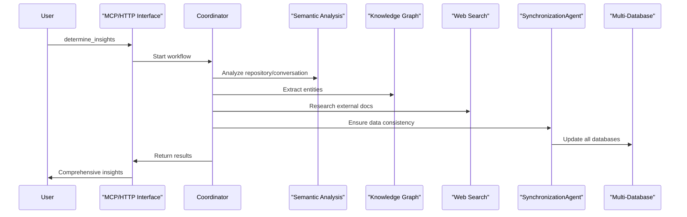
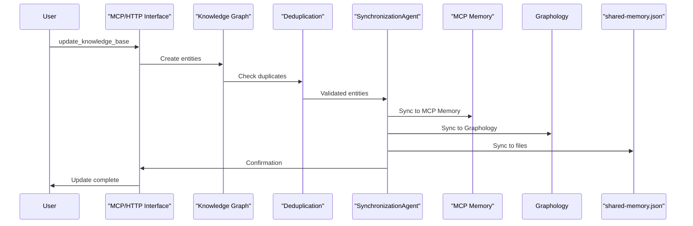
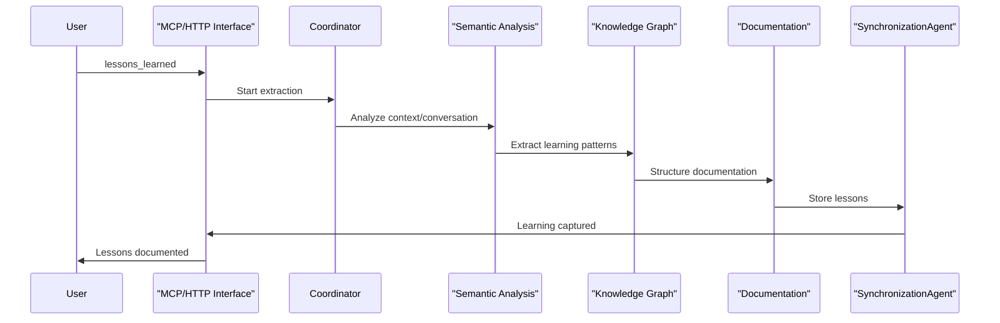

# Unified Semantic Analysis System Architecture

## Overview

The Unified Semantic Analysis & Knowledge Management System is designed around a **single agent infrastructure** that serves both Claude Code (via MCP tools) and GitHub CoPilot (via VSCode integration). This unified approach ensures consistent knowledge management, analysis quality, and data integrity regardless of which AI coding assistant is being used.

## Core Principles

### 1. **Single Agent Infrastructure**
Both Claude Code and GitHub CoPilot use the **SAME 7-agent system**:
- Semantic Analysis Agent
- Knowledge Graph Agent  
- Coordinator Agent
- Web Search Agent
- SynchronizationAgent
- Deduplication Agent
- Documentation Agent

### 2. **SynchronizationAgent as Single Source of Truth**
The SynchronizationAgent is the **sole authority** for data integrity, ensuring consistency across:
- MCP Memory (Claude Code sessions)
- Graphology (CoPilot integration)
- shared-memory.json (Git-tracked persistence)

### 3. **Unified Command Interface**
Three core commands work identically across both platforms:
- `determine_insights` - Comprehensive semantic analysis
- `update_knowledge_base` - Knowledge updates with full sync
- `lessons_learned` - Learning extraction and capture

## Architecture Diagram


## System Components

### AI Coding Assistant Layer

#### Claude Code (MCP Integration)
- **Interface**: MCP tools via `claude-mcp` command
- **Communication**: Direct MCP protocol to semantic analysis server
- **Commands**: Native MCP tool calls (determine_insights, update_knowledge_base, etc.)
- **Memory**: Persistent MCP Memory Server with cross-session continuity

#### GitHub CoPilot (VSCode Integration)  
- **Interface**: VSCode extension with @KM commands
- **Communication**: HTTP/WebSocket API to CoPilot HTTP server
- **Commands**: @KM prefixed commands (e.g., `@KM determine insights`)
- **Memory**: Graphology-based storage with HTTP API access

### Unified Interface Layer

#### MCP Server (Claude Code)
```typescript
// Available MCP Tools
determine_insights({
  repository: string,
  conversationContext: string,
  depth: number,
  significanceThreshold: number
})

update_knowledge_base({
  insights: Insight[],
  syncTargets: ['mcp', 'graphology', 'files']
})

lessons_learned({
  context: string,
  repository: string,
  focusAreas: string[],
  includeConversationHistory: boolean
})
```

#### HTTP API Server (CoPilot)
```bash
# VSCode CoPilot Commands
@KM determine insights "refactoring work" --depth 10
@KM update knowledge base "React error boundaries prevent crashes"
@KM lessons learned "debugging session" --focus patterns,solutions
@KM search "React error handling"
@KM system status
```

### Single Agent System Infrastructure

#### 1. Coordinator Agent
- **Role**: Orchestrates multi-agent workflows
- **Capabilities**: 
  - Workflow management and sequencing
  - Agent task distribution
  - Progress tracking and reporting
  - Error handling and recovery

#### 2. Semantic Analysis Agent
- **Role**: Core code and conversation analysis
- **Capabilities**:
  - Repository commit analysis
  - Conversation log processing
  - Pattern recognition in code changes
  - Significance scoring and classification

#### 3. Knowledge Graph Agent
- **Role**: Entity and relationship extraction
- **Capabilities**:
  - Structured knowledge extraction
  - Entity creation and management
  - Relationship mapping
  - Knowledge graph construction

#### 4. Web Search Agent
- **Role**: External documentation research
- **Capabilities**:
  - Technical documentation search
  - Technology-specific research
  - Reference gathering
  - Context enrichment

#### 5. SynchronizationAgent (CRITICAL)
- **Role**: Single source of truth for data integrity
- **Capabilities**:
  - Multi-database synchronization
  - Conflict resolution
  - Data consistency validation
  - Bidirectional sync operations

#### 6. Deduplication Agent
- **Role**: Prevents duplicate insights
- **Capabilities**:
  - Similarity detection
  - Duplicate prevention
  - Content normalization
  - Quality filtering

#### 7. Documentation Agent
- **Role**: Creates structured documentation
- **Capabilities**:
  - Markdown generation
  - Diagram creation
  - Cross-reference linking
  - Template application

### Multi-Database Storage Architecture

#### MCP Memory (Claude Code)
- **Purpose**: In-memory graph database for Claude sessions
- **Features**: Session persistence, cross-session continuity
- **Access**: Direct MCP protocol communication
- **Sync**: Managed by SynchronizationAgent

#### Graphology (CoPilot Integration)
- **Purpose**: Graph database for VSCode CoPilot integration
- **Features**: HTTP API access, real-time updates
- **Access**: REST API endpoints
- **Sync**: Managed by SynchronizationAgent

#### shared-memory.json (Git Persistence)
- **Purpose**: Git-tracked authoritative knowledge base
- **Features**: Version control, team collaboration, backup
- **Access**: File system operations
- **Sync**: Managed by SynchronizationAgent

### Communication Infrastructure

#### MQTT Broker
- **Purpose**: Asynchronous agent-to-agent communication
- **Port**: 1883
- **Features**: Message routing, pub/sub patterns, reliable delivery

#### JSON-RPC Server  
- **Purpose**: Synchronous agent method calls
- **Port**: 8080/3001
- **Features**: Direct method invocation, request/response patterns

### Visualization & Monitoring

#### VKB Web Interface
- **Purpose**: Interactive knowledge graph visualization
- **URL**: http://localhost:8080
- **Features**: Real-time graph updates, multi-database view, filtering

#### Progress Logging
- **Purpose**: Real-time agent activity monitoring
- **Features**: Workflow tracking, performance metrics, debugging info

#### System Status
- **Purpose**: Health monitoring and diagnostics
- **Features**: Service status, connectivity checks, error reporting

## Unified Workflows

### 1. Determine Insights Workflow



### 2. Update Knowledge Base Workflow



### 3. Lessons Learned Workflow



## Key Benefits

### 1. **Consistency Across AI Assistants**
- Same analysis quality regardless of Claude Code or CoPilot
- Identical knowledge base regardless of entry point
- Consistent command interface and behavior

### 2. **Data Integrity Guarantee**
- SynchronizationAgent ensures all databases stay in sync
- No data loss between different AI coding sessions
- Conflict resolution and consistency validation

### 3. **Unified Knowledge Accumulation**
- All insights flow into the same knowledge base
- Cross-AI-assistant learning and knowledge sharing
- Team collaboration regardless of preferred AI tool

### 4. **Transparent Operations**
- Real-time monitoring of all agent activities
- Clear workflow progress and status reporting
- Comprehensive system health monitoring

### 5. **Scalable Architecture**
- Agent system can handle multiple concurrent sessions
- Multi-database approach provides resilience and performance
- Modular design allows for easy agent additions/modifications

## Configuration

### Environment Variables
```bash
# Agent System
CODING_AGENT=claude|copilot
CODING_TOOLS_PATH=/path/to/coding
SEMANTIC_ANALYSIS_ENABLED=true

# API Keys (at least one required)
ANTHROPIC_API_KEY=sk-ant-...
OPENAI_API_KEY=sk-...

# Services
MQTT_BROKER_PORT=1883
RPC_SERVER_PORT=8080
HTTP_SERVER_PORT=8765
VKB_SERVER_PORT=8080
```

### Service Startup
```bash
# Start unified system with Claude Code
./bin/coding --claude

# Start unified system with CoPilot
./bin/coding --copilot

# Check system status
get_system_status  # In Claude
@KM system status  # In CoPilot
```

## Troubleshooting

### Common Issues

#### 1. Agent System Not Running
**Symptoms**: MCP tools or @KM commands fail with connection errors
**Solution**: 
```bash
# Check agent system status
ps aux | grep semantic-analysis
# Restart if needed
./scripts/restart-agents.sh
```

#### 2. Database Sync Issues
**Symptoms**: Different data in MCP vs Graphology vs files
**Solution**:
```bash
# Check SynchronizationAgent status
curl http://localhost:8765/api/graph/status
# Force resync
@KM sync databases  # In CoPilot
sync_with_ukb {"direction": "bidirectional"}  # In Claude
```

#### 3. Performance Issues
**Symptoms**: Slow response times, timeouts
**Solution**:
```bash
# Check system resources
@KM system status
# Monitor agent activities
tail -f semantic-analysis-system/logs/agents.log
```

## See Also

- [Unified Knowledge Flow](unified-knowledge-flow.md)
- [Multi-Database Synchronization](unified-memory-systems.md)
- [MCP Server Setup](../components/semantic-analysis/mcp-server-setup.md)
- [VSCode CoPilot Integration](../integrations/vscode-copilot-integration.md)