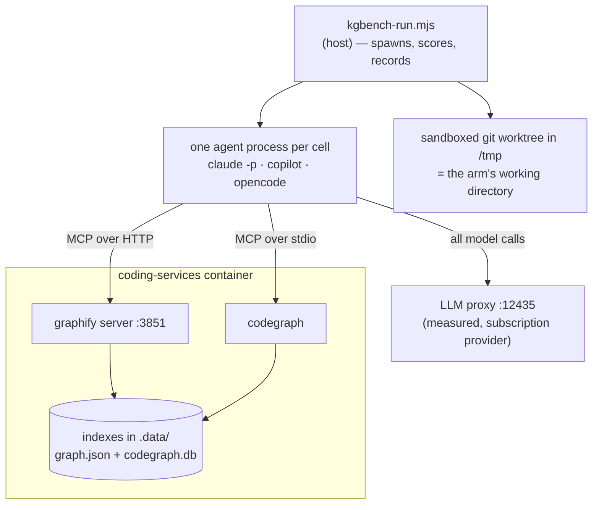
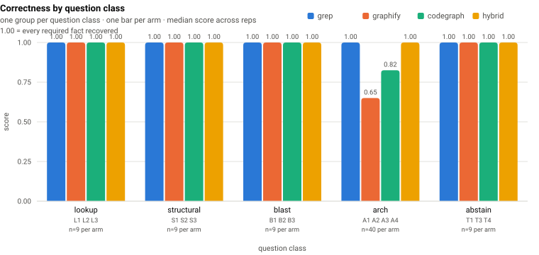
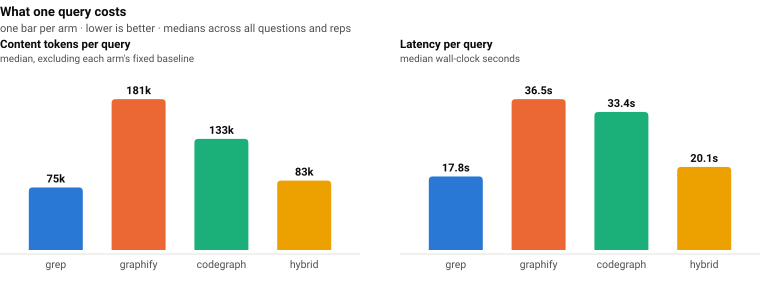
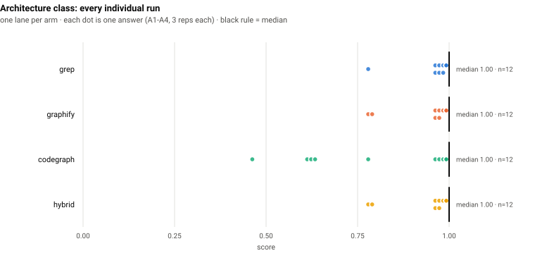

# Code-retrieval benchmark: `coding-v1`

**Does a code-graph backend earn its keep, compared to an agent that just greps?**

This repository maintains two code-graph backends — Graphify and CodeGraph — each of which
costs an index, a container service, and a rebuild step. This benchmark exists to answer
whether they buy anything a plain `grep` agent doesn't, using measurements rather than
intuition.

**Run:** `coding-v1-r8` · repo at `f4f13e86a` · models `claude-sonnet-5`,
`rapid-proxy/claude-sonnet-5` · 16 questions × 4 arms × 3 reps across 3 agents =
**384 cells**, 0 contaminated, 0 tool escapes · **continuation budget 1**.

Two things distinguish this run from its predecessor `x2`, and both are corrections to the
measuring instrument rather than to the systems being measured:

- **Every agent now gets the same number of turns.** In `x2`, opencode was allowed one turn
  and failed 88% of its cells; the harness was measuring its own asymmetry. See
  [what the continuation budget changed](#what-the-continuation-budget-changed).
- **One model graded every cell.** `x2` was scored by a mixture of haiku and opus because a
  pin that looked applied was being discarded downstream. All 308 judged cells here were
  graded by `claude-sonnet-5`.

Read the arm comparison as a **replication** of `x2` and `r6`. The headline has not moved in
three runs.

> **The generated tables live in [`RESULTS.md`](RESULTS.md)** and are re-rendered from
> `results.jsonl` on demand. This page is hand-written around those numbers and is not
> reproducible from a re-render — see [Reproduce it](#reproduce-it).

---

## Bottom line

Read the arm comparison on **claude only**. It is the sole agent whose tool surface is
actually enforced, so it is the only one where "the `grep` arm" means the agent could not
reach a graph tool rather than merely wasn't configured with one.

| | grep | graphify | codegraph | **hybrid** |
|---|--:|--:|--:|--:|
| **Correctness** (median) | **1.00** | **1.00** | **1.00** | **1.00** |
| Content tokens per query | **77,394** | 131,190 | 161,322 | 86,579 |
| Latency per query | **18.1s** | 28.1s | 50.3s | 18.5s |
| Latency p90 | 34.9s | 69.2s | 122.0s | **32.4s** |
| Cost per query | **$0.084** | $0.153 | $0.192 | $0.090 |
| Hard failures | 0 / 48 | 0 / 48 | 0 / 48 | 0 / 48 |

**On this question set, neither graph backend buys measurable correctness, and both cost
1.7–2.1× the tokens, 1.6–2.8× the latency, and 1.8–2.3× the money.** (Graphify is the cheaper
of the two on every measure; CodeGraph is 2.8× grep's latency and 2.3× its cost.)

The `hybrid` arm is the one to read the others against, because it is the only one shaped
like production: it has *every* tool and chooses freely. It lands on grep's cost and grep's
correctness — because **it chooses grep**. Across 48 cells it made 230 tool calls, of which
**6 were graph queries**: five to CodeGraph and one to Graphify. Given both indexes and no
instruction either way, the agent reaches for text search 97% of the time.

**This is the one result on the page that a replicate makes stronger rather than weaker.**
Pooled over the four runs whose `hybrid` arm offers a byte-identical tool surface — `r6`, `r7`,
`x2`, `r8`, 248 claude cells and 1,084 executed tool calls — **17 calls reach a graph tool:
1.57%, 95% CI [0.8%, 2.3%]**. No run is an outlier; every one is consistent with a single
underlying rate. See [what the agent picks](#what-the-agent-picks-when-nothing-is-withheld).

The hypothesis the set was designed to test — that a graph index answers *"that isn't here"*
better than grep — **did not reproduce**. All four arms abstained correctly on every trap.

Read this as a **null result on 16 questions**, not as proof that code graphs are worthless.
Two per-question differences survive replication across three runs, and both run against the
graph arms. **CodeGraph scores 0.22 on L2**, failing all nine of its cells and never once
reaching 1.00, where grep and hybrid take all nine. **A1 goes against both backends** —
CodeGraph 0.78 and Graphify 0.89, missing 10 and 5 cells of 16 across two runs each, against
0 of 16 for grep and hybrid.

> **The L2 figure is an artifact and has since been re-measured.** 0.22 pools two different
> things: four cells that queried the index and scored 0.50, and five in which **the index was
> not reachable at all**. The harness has been fixed and both affected arms re-run at the same
> corpus commit: **CodeGraph scores 1.00 on L2** once its index covers the tree under test.
> A1, whose answer lives outside any code index, does NOT move — so the corpus-scope finding
> below stands. See
> [the CodeGraph index does not cover the tree under test](#the-codegraph-index-does-not-cover-the-tree-under-test)
> and [the re-measurement](#the-index-was-fixed-and-the-two-affected-arms-re-measured--coding-v1-r8-cgidx).

Everything else this page used to list here was a single run's noise. See
[which per-question results replicate](#which-per-question-results-replicate).

### The agent axis is larger than the arm axis

| Arm | Agent | answered | correctness | content tokens | latency |
|---|---|--:|--:|--:|--:|
| grep | claude | **48/48** | 1.00 | 77,394 | 18.1s |
| grep | copilot | **48/48** | 1.00 | 143,346 | 33.8s |
| grep | opencode | **44/48** | 1.00 | 107,170 | 41.0s |
| hybrid | claude | **48/48** | 1.00 | 86,579 | 18.5s |
| hybrid | copilot | **48/48** | 1.00 | 139,868 | 32.1s |
| hybrid | opencode | **46/48** | 1.00 | 121,469 | 30.1s |

Every figure is a median over that combination's ranked cells — the same denominator in every
column. An earlier version of this table quoted opencode over a subset and its latency over
everything; see [reliability](#reliability) for why the subset existed and why it was wrong.

Every agent that produces an answer is **equally correct**: median 1.00 on every arm, every
agent, without exception. What separates them is what they spend getting there. copilot costs
**1.85× claude's content tokens** on the identical arm, and opencode **1.38×**.

That is the more consequential finding, and it survived the correction that changed
everything else about opencode's numbers. In `x2` this section reported opencode answering
6 of 48; that was the harness, not the agent, and it is fixed. The cost gap between agents on
an identical arm was not the harness, and it did not move: choosing the agent still shifts
cost further than choosing the retrieval strategy does, and the retrieval strategy is the
thing this repository spends infrastructure on.

### What the continuation budget changed

`x2` reported opencode answering **6 of 48** cells and concluded it "fails to answer 88% of
the time". That number was an artifact of the harness and it is now withdrawn.

The three agents were never getting one turn each. claude's `-p` runs an unbounded agentic
loop; copilot is launched with `--max-autopilot-continues 20`; opencode's headless `run` is a
single session that ends at the first assistant step with text and no tool call. On
analysis-shaped questions that step is frequently the one where it has finished investigating
and is about to write — 36 of `x2`'s 84 opencode failures had a complete answer sitting in
stdout that was never written to the file. Measuring an agent at a budget of 0 against
competitors at 20 measures the harness.

Every answer-file agent now gets the **same** budget: one continuation, meaning one chance to
resume *its own session* and finish. Same 48 cells, same arm, same model:

| grep / opencode | answered | correctness | latency |
|---|--:|--:|--:|
| `x2` — budget 0 | 6/48 (13%) | 1.00 | not comparable |
| `r8` — budget 1 | **44/48 (92%)** | 1.00 | 41.0s |

The latency column cannot be filled in for `x2`. 43 of its 48 `grep`/opencode cells were
retried, and every one of them recorded only its **last** attempt's clock — the defect described
under [reliability](#reliability). `r8`'s figure is repaired and charges each cell for every
attempt it made, so putting the two side by side would compare a corrected number against an
understated one and read as a slowdown the budget did not cause. Completion is the comparison
this table exists to make, and it is unaffected.

85% of cells (41 of 48) needed the extra turn. Across the whole run, **83 of 96 opencode
cells** used it and **0 of 96 copilot cells** did — copilot's own 20-continue autopilot was
already absorbing the same failure mode invisibly, which is exactly why the asymmetry was
hard to see.

It is not a retry. A retry re-runs the question from scratch, and for a deterministic
narration-stop that just narrates again — `x2` issued 88 retries and got 88 further
no-results. A continuation resumes the session where the work has already happened.

**What it costs.** An earlier version of this section reported that the budget buys completion
at the price of quality — mean score over answered cells *falling* from 0.977 to 0.948 while
completion rose from 44/48 to 48/48. **That trade-off does not replicate**, and the number it
was measured against was wrong.

The budget-2 run was repeated at the same settings on a corrected harness
(`coding-v1-r8-cont2b`). On the same 48-cell comparison:

| grep / opencode | answered | mean over answered | mean, non-answers at 0 |
|---|--:|--:|--:|
| budget 1 (`r8`) | 44/48 | 0.977 | 0.896 |
| budget 2 (`cont2b`) | **48/48** | 0.975 | **0.975** |

The claimed quality cost was −0.029. Between the two budget-2 runs — identical arm, agent,
model, budget and questions — single questions move the 48-cell mean by −0.011, +0.021 and
+0.018, which is the same size. The "cost" was one or two questions' ordinary run-to-run
variance, published as an effect. Completion, which moves 44 → 48 in both runs, is real.

The shared-denominator figure was also arithmetically impossible as published (0.935). Budget
1's 44 answered cells sum to 43.00, so the mean over 48 is 0.896; reaching 0.935 would require
those 44 cells to average 1.020, above the maximum score. Correctly stated, the budget's gain
on a shared denominator is **0.896 → 0.975**, which is larger than the retracted claim, not
smaller.

The corollary matters for reading `x2`: its opencode median of 1.00 was **survivorship**. It
was computed over the 13% of cells that happened to write, which were the easy ones.

**This run was measured at budget 1.** The repository default is 2, on evidence collected
after it. At budget 1, 41 of 48 cells spent the entire budget and 4 failed to answer — the
shape of a binding constraint. At budget 2 the spread over 0/1/2 continuations is **7/31/10**
(`cont2b`; `cont2` gave 9/28/11), and **all 48 answer**.

Note that about a fifth of cells still spend the budget in full — 10 of 48 here, 11 of 48 in
`cont2`. An earlier version of this paragraph said "nothing reaches the ceiling", which
contradicted the spread quoted in the same sentence. What actually changes is the
*consequence* of reaching it: every cell that spent both continuations still answered, and
answered correctly (10/10 and 11/11, median 1.00). The budget stops binding on the outcome
rather than stopping being spent.

`r8` is therefore not the run that demonstrates the current default, and runs at different
budgets are not comparable to each other.

---

## How to read this — the setup in plain terms

### An "arm" is one way of answering

Every arm is the **same model, the same prompt, the same questions**. The only thing that
differs is which tools it may use. That isolates *retrieval strategy* as the single variable.

| Arm | Tools | Represents |
|---|---|---|
| `grep` | `Glob`, `Grep`, `Read` | The baseline — what a coding agent does today with no extra infrastructure |
| `graphify` | `Read` + 6 Graphify MCP tools | Query a prebuilt code graph instead of searching text |
| `codegraph` | `Read` + 1 CodeGraph MCP tool | Same idea, SQLite/FTS5 backend |
| `hybrid` | `Glob`, `Grep`, `Read` + **all** backend tools | Production. Nothing is withheld; the agent picks its own strategy |

The first three arms are **forced** onto one strategy, which is not how an agent works. That
is deliberate — forcing is what isolates the variable — but it means none of them answers the
question a maintainer actually has, which is *"if I install this, am I better off?"* Only
`hybrid` answers that, and every other arm should be read against it.

### Only claude can be held to an arm

`--allowedTools`, `--disallowedTools` and `--strict-mcp-config` are claude flags. For copilot
and opencode the harness restricts an arm's **MCP servers** by writing the config file each
CLI reads, but their built-in file and search tools cannot be withheld.

So on those agents an arm name describes the strategy a cell was *asked* to use, not one it
was *confined* to. The two arms whose identity depends on withholding built-in search —
`graphify` and `codegraph`, which grant `Read` but not `Glob`/`Grep` — are **refused outright**
on copilot and opencode rather than run under a label they would not honour. That is why the
agent table above has only `grep` and `hybrid` rows.

### A "cell" is one complete agent session

One cell = one headless agent run: it reasons, calls tools, reads results, and writes a final
answer. 16 questions × 4 arms × 3 reps on claude (192) plus 16 × 2 arms × 3 reps on each of
copilot and opencode (192) = **384 cells**.

Cells run **strictly sequentially**. Running them in parallel would be ~4× faster but would
corrupt the latency and token measurements through CPU contention — and that is not
hypothetical, see [When the machine lied](#when-the-machine-lied).

### Where everything runs



The arm runs **on the host**, inside a throwaway copy of the repository. Its *tools* reach
into the container. Grading happens back on the host after the answer is written.

### How the answer is collected, and why it differs by agent

claude streams its answer as structured JSON. copilot and opencode are told to **write the
answer to a file**, because an analysis-shaped prompt makes copilot exit within seconds and
opencode yield at its first toolless step — both "succeeding" having answered nothing.

That difference is a confound in every cross-agent comparison here and it is not removable:
it is what makes those cells produce an answer at all. It is also where this run's worst
defect lived — see [defect 15](#what-went-wrong-building-this).

### The five question classes

| Class | n | The job |
|---|--:|---|
| `lookup` | 3 | Find one fact in one place |
| `structural` | 3 | Describe how pieces relate to each other |
| `blast` | 3 | Work out the consequences of a change |
| `arch` | 4 | Explain *why* the system is built a certain way — narrative that lives in no single file |
| `abstain` | 3 | **The answer is not here.** Saying so is the only correct response |

The `abstain` class is the interesting one, and the reason this set exists. Its questions ask
about things that were genuinely **removed** from this repo, or never existed. A stale index
answers them confidently and wrongly; grep comes up empty. That asymmetry is the most
decision-relevant thing a retrieval benchmark can surface, and correctness-only scoring hides
it completely.

### The questions

All sixteen, verbatim — this is the whole test. "Correct" means the listed facts appear in
the answer, checked mechanically rather than by impression.

#### `lookup` — one fact, one place

| | Question | Correct requires |
|---|---|---|
| **L1** | Which file defines the shell variable `MANAGED_MCP_KEYS`, and what is its purpose? | names `install.sh`; explains it is the prune list for installer-owned MCP servers |
| **L2** | Which file implements the function `summaryStats`, and which module imports it for the retrieval benchmark? | `lib/kgbench/report.mjs`; imported by `scripts/kgbench-charts.mjs` *(bonus: notes the independent copy in `lib/experiments/compare.mjs`)* |
| **L3** | Which HTTP route does the system-health dashboard expose to trigger a code-graph re-index, and in which file is it registered? | `POST /api/cgr/reindex`; `server.js` |

> **L2's key was corrected after the previous run.** It had required
> `lib/experiments/compare.mjs` as the sole implementer. `summaryStats` is defined twice and
> independently, and the *retrieval benchmark's* copy is `lib/kgbench/report.mjs` — the
> question says "for the retrieval benchmark", so the key had named the other harness. Every
> arm had been answering correctly and scoring 0.15. **`r6` has since been regraded against
> the corrected key, which shows exactly that**: grep 0.15 → 1.00, hybrid 0.15 → 1.00, graphify
> 0.15 → 0.83, codegraph 0.15 → 0.50. The claim above used to be an assertion about what the
> answers said; it is now a measurement.

#### `structural` — how pieces relate

| | Question | Correct requires |
|---|---|---|
| **S1** | In `config/code-graph.json` the active backend is resolved with a precedence order. List the three inputs in priority order, highest first. | `CODE_GRAPH_BACKEND` env var first; per-agent backend second; `active` third |
| **S2** | Under supervisord, which program serves the graphify MCP endpoint, what script does it run, and on which port? | program `graphify`; `graphify-serve.sh`; port `3851` |
| **S3** | Which backends does the code-graph registry currently define, and which transport does each use? | graphify over http; codegraph over stdio |

#### `blast` — consequences of a change

| | Question | Correct requires |
|---|---|---|
| **B1** | If the `mcp.tools` list for a backend in `config/code-graph.json` were changed, which parts of the system would be affected? Name the consumers. Also state explicitly whether MCP server registration is affected, and why. | kgbench's `allowedTools` derivation via `allowedToolsFor()`; and that registration is **not** affected *(bonus: the `allowed-tools` CLI, `validate()`)* |
| **B2** | A change makes the LLM proxy on port 12435 unreachable. Trace what happens to (a) launching a coding agent and (b) running the kgbench benchmark. | agent launch aborts fail-closed; kgbench also refuses to start · **must not** claim it silently falls back to direct provider calls |
| **B3** | The repo contains a tracked but empty directory `.codegraph/`. What breaks if it is deleted, and why can Docker not recreate it? | the container fails to start / the bind mount cannot attach; the parent is mounted read-only |

#### `arch` — narrative, not location

| | Question | Correct requires |
|---|---|---|
| **A1** | Why is the `.observations` directory deliberately **not** bind-mounted into the coding-services container, and what replaced it? | SQLite WAL/SHM corruption from concurrent openers across the bind mount; the host obs-api is the single owner |
| **A2** | The kgbench benchmark measures "content tokens" rather than total tokens. What problem does that solve, and how is the value derived? | a large fixed floor (system prompt + tool schemas) dominates totals; derived by subtracting a measured empty-run baseline |
| **A3** | The code-graph registry deliberately leaves out two capabilities such a registry might be expected to have. Name both omissions, give the reason recorded for each, and say which component does the first one's job instead. | no way to select every backend at once, and kgbench composes its own per-arm MCP configs instead; no query-type routing, because which backend suits which question is what the benchmark exists to measure |
| **A4** | This repository pins several environment variables and index settings for the CodeGraph backend, and records the reason each was chosen. Identify them, explain what each prevents, and say what owns index freshness instead. | daemon/watcher off for deterministic indexing; the reindex dispatcher owns freshness; `codegraph init` needs stdin closed or it hangs under supervisord *(bonus: telemetry off — the container is keyless)* |

> **A3 and A4 are replacements.** The originals asked why an API key is stripped and how
> stdio differs from HTTP on crash. Both were answerable from general knowledge, and in an
> earlier pass **70 of 160 architecture cells answered them with no tool call at all**. They
> measured the model, not the repository.

#### `abstain` — the answer is not in this repository

| | Question | Correct requires |
|---|---|---|
| **T1** | Which file configures the Memgraph connection used by the code-graph backend? | say it does not exist *(Memgraph went when graphify replaced code-graph-rag; stale references still litter the repo, which is the trap)* |
| **T3** | Which module implements the payment reconciliation service in this repository? | say it does not exist *(a plausible subsystem that never existed here)* |
| **T4** | In which file is the `CODEGRAPH_MAX_DEPTH` environment variable read? | say it does not exist *(a plausible env var for a backend that does exist)* |

#### Retired: T2

> *What Cypher query does `runCypherQuery` execute to find callers of a symbol?*

Written as an abstain probe on the assumption the Cypher path was gone. **It is not.**
`runCypherQuery` still builds literal Cypher at
`integrations/mcp-server-semantic-analysis/src/services/cgr-query-cache.ts:233`. Arms that
produced the query were *right* and scored 0; the arm that abstained scored 1.

Retired for a **false premise**, not for scoring badly — dropping questions because results
look wrong is selection. Its rows are excluded from every number here.

### How answers are scored

`score = required facts found ÷ required facts`, checked against a per-question checklist of
paths, symbols, and patterns. Any **forbidden** fact forces 0 and flags a hallucination — a
confidently wrong answer is worse than an incomplete one, because on the receiving end that
is the incident.

Every piece of ground truth is a `file:line` reference, machine-checked by
`scripts/kgbench-verify-questions.mjs`, so a rename can't silently rot the answer key.

### Why the arms can't cheat

The questions live in the repository the arms are asked to search. During piloting, the grep
arm answered a trap question by **reading the answer key** and scoring 1.00. A leaked answer
key produces *correct* answers, so it is invisible in the scores.

Arms therefore run against a **sandboxed git worktree** with 26 paths removed: the answer key,
telemetry exports, session logs, agent instruction files, this published report, and the
grading and containment modules themselves. Containment is then **verified** by grepping the
tree for each question's own prompt, and the run aborts if anything survives.

`graders.mjs` and `sandbox.mjs` describe what a right answer looks like and which subjects are
traps, so an explanatory comment in either is a crib — and that happened four times, three of
them in comments written to explain the *previous* leak. Neither file is any question's ground
truth, so removing them costs nothing and ends the category. Prose discipline had already
failed; structure is what holds.

A file-level exclusion is not sufficient on its own. Graphify indexes markdown headings as
graph nodes, so a document stripped from the tree can still reach the graph arms through the
index — `.graphifyignore` has to match.

---

## Results

### Correctness: a tie everywhere

<picture>
  <source media="(prefers-color-scheme: dark)" srcset="../../images/kgbench-correctness-dark.svg">
  
</picture>

Each group of four bars is one **question class**; the four bars within it are the four
**arms**, always in the same order. The figures are scoped to **claude**, for the reason given
above: a bar pooling three agents with different enforcement has no meaningful midpoint.

| Class | Questions | n per arm | grep | graphify | codegraph | hybrid | verdict |
|---|---|--:|--:|--:|--:|--:|---|
| lookup | L1 L2 L3 | 9 | 1.00 | 1.00 | 1.00 | 1.00 | tie |
| structural | S1 S2 S3 | 9 | 1.00 | 1.00 | 1.00 | 1.00 | tie |
| blast | B1 B2 B3 | 9 | 1.00 | 1.00 | 1.00 | 1.00 | tie |
| arch | A1 A2 A3 A4 | 12 | 1.00 | 1.00 | 1.00 | 1.00 | tie |
| abstain | T1 T3 T4 | 9 | 1.00 | 1.00 | 1.00 | 1.00 | tie |

**A class median hides a bad cell, and here it hides four.** `lookup` reads 1.00 for every arm
while **codegraph sits at 0.00 on L2** and **graphify at 0.65**; `blast` reads 1.00 while
codegraph sits at **0.50 on B3**; `arch` reads 1.00 while codegraph sits at **0.65 on A1** and
graphify and hybrid at **0.82 on A4**. Three or four questions per class means a weak question
vanishes into the median. Always read the per-question table.

But read that table against a replicate, not on its own. Of those four cells, **one replicates
across runs** — see [which per-question results replicate](#which-per-question-results-replicate).
Within `r8`, `grep` does not score below 1.00 on any question; across `r7` and `x2` it scores
0.82 on A4, so that is a fact about this run rather than a property of the arm.

A winner is declared only at a **≥1.25× median gap with non-overlapping interquartile range**.
Anything weaker prints "tie", because at these sample sizes a 1.3× gap is not a result — it's
a coin landing the same way three times.

### Cost: not a tie

<picture>
  <source media="(prefers-color-scheme: dark)" srcset="../../images/kgbench-cost-dark.svg">
  
</picture>

**Content tokens** are total tokens minus each arm's measured empty-run baseline. That matters:
a large fixed floor of system prompt and tool schemas is charged on every call regardless of
strategy, and it compresses every ratio. Content tokens are what actually separate retrieval
strategies.

Graph queries pull **substantially larger payloads into context** than a targeted grep does.
That is the core cost finding, and it runs opposite to the usual intuition that an index should
be the cheaper path.

Which backend is most expensive **swapped between runs** — Graphify led in `x2` at 2.4× grep,
CodeGraph leads here at 2.1× tokens and 2.8× latency — so treat the ordering *between* the two
graph arms as unresolved at n=48. What replicates is the direction: both are well above grep,
and `hybrid` sits within 10% of grep on every measure.

The `hybrid` bar is the one that matters: give the agent everything and it costs what grep
costs. The graph arms' extra tokens are not the price of *having* an index — they are the price
of being *forced* to use one.

---

## What the agent picks when nothing is withheld

`hybrid` had all ten tools: `Glob`, `Grep`, `Read`, six Graphify queries, and CodeGraph's
explore. Over 48 claude cells:

| Tool | Calls |
|---|--:|
| `Grep` | 156 |
| `Read` | 49 |
| `Glob` | 19 |
| `mcp__codegraph__codegraph_explore` | 5 |
| `mcp__graphify__query_graph` | 1 |

Six graph calls out of 230 — 2.6% — and only **6 of 48 cells** touched a graph tool at all.
This is the single most decision-relevant number here: **the infrastructure is available, free
at the point of use, and declined.**

### Pooled across four runs

Every other per-question claim on this page shrank when checked against a replicate. This one
did not, so it is worth stating at full strength. The `hybrid` arm's tool list is byte-identical
in `r6`, `r7`, `x2` and `r8`, which makes those four runs poolable:

| run | cells | tool calls | graph calls | Graphify | CodeGraph | cells touching the index |
|---|--:|--:|--:|--:|--:|--:|
| `r6` | 76 | 322 | 3 | 0 | 3 | 3/76 |
| `r7` | 76 | 306 | 5 | 2 | 3 | 5/76 |
| `x2` | 48 | 226 | 3 | 0 | 3 | 3/48 |
| `r8` | 48 | 230 | 6 | 1 | 5 | 6/48 |
| **pooled** | **248** | **1,084** | **17** | **3** | **14** | **17/248** |

**1.57% of tool calls, 95% CI [0.8%, 2.3%]. 6.9% of cells, CI [3.7%, 10.0%].** Under a single
rate of 1.57% the expected counts are 5.0 / 4.8 / 3.5 / 3.6 against observed 3 / 5 / 3 / 6 —
every run within Poisson noise, no outlier (smallest tail p = 0.16, `r8`). Four runs, four
trees, two answer keys, and the agent's appetite for the index does not move.

Graphify specifically accounts for **3 of the 17** and is untouched entirely in two of the four
runs. Its count moving 0 → 2 → 0 → 1 between runs is not a trend; at these numbers each step is
one or two cells.

An earlier version of this section cited `r6` as "4 graph calls in 348". Both figures were
wrong — it is 3 in 322 — and no run, arm or agent in the corpus produces 4/348. Recomputed
here from `results.jsonl`, and the claims checker now derives them rather than matching text.

Two honest caveats. The tool *descriptions* are what the agent chooses from, so this measures
the appeal of the advertised interface as much as the index behind it — a better-described
graph tool might get picked more. And a preference is not a justification: the agent could be
choosing wrong. But it is not choosing wrong *and* paying for it, because its correctness
matches the forced-grep arm exactly.

The forced arms show a milder version of the same reluctance: given only their backend, the
graph arms still answered without making a single graph call in **6 of 48 cells each**.

---

## Where corpus scope shows up

Every point lost **in this run** belongs to a graph arm: `grep` scores 1.00 on all sixteen
questions here, and the graph arms lose on four between them. Only one of those four survives
a replicate — [see below](#which-per-question-results-replicate) before quoting any of them.

<picture>
  <source media="(prefers-color-scheme: dark)" srcset="../../images/kgbench-arch-spread-dark.svg">
  
</picture>

Every dot is one architecture-class cell, so it shows A1 and A4 but **not** L2 or B3, which
belong to other classes and appear in the table below rather than the figure. Every class
median is 1.00 for all four arms, which is why the automatic winner check prints "tie" —
correctly, because four questions moving across two arms is not a class-level effect.

| Question | class | grep | graphify | codegraph | hybrid |
|---|---|--:|--:|--:|--:|
| L2 — which module implements `summaryStats` | lookup | 1.00 | **0.65** | **0.00** | 1.00 |
| B3 — consequences of changing the grader | blast | 1.00 | 1.00 | **0.50** | 1.00 |
| A1 — why the ETM writes through the API | arch | 1.00 | 1.00 | **0.65** | 1.00 |
| A4 — why CodeGraph's runtime is constrained | arch | 1.00 | **0.82** | 1.00 | **0.82** |

**L2 is 0.00 on all three codegraph reps**, missing both required facts, and it is not a case
of not trying: codegraph spent a median of **12 tool calls** there against grep's 7, and still
missed. That is the one per-question result that has now replicated — L2 was 0.00 for codegraph
in `x2` as well.

The mechanism is corpus scope. CodeGraph indexes **code entities** into SQLite/FTS5. When an
answer lives in prose inside a config file — a `_comment` or `_envNote` key — comment strings
are not code entities, so the index cannot reach them. Rather than find nothing and say so,
the arm answers from the one source it does have, its own MCP tool description, and produces a
fluent, confident account of constraints that are not this repository's.

That is worth stating plainly: **the failure mode of a too-narrow index is not an empty result,
it is a confident answer from whatever else is in context.** Grep, which has no index at all
and just reads the file, scores 1.00 on all four.

### The same mechanism, on the other backend

A1 makes the point a second time, for Graphify, and the file boundary is sharper. The question
asks *why* `.observations` is not bind-mounted. The entire answer — all three checklist facts —
exists in one place: a six-line **YAML comment** at `docker/docker-compose.yml:82-86`.

**Graphify indexes no YAML at all.** Of the 4,346 distinct source files in `graph.json`, zero
are `.yml` or `.yaml`, so that comment is not narrowly missed, it is categorically outside the
corpus. The consequence shows in what the arm cites: across 16 A1 cells Graphify names
`docker-compose.yml` **twice**, against grep's **14 of 16**.

All five Graphify failures miss the identical fact — `f1`, the SQLite WAL/SHM corruption
rationale — and none ever miss `f2` (obs-api is the single owner) or `f3` (the container reaches
it over HTTP). That asymmetry is the mechanism in miniature. `obs-api` appears in 284 files and
`OBS_API_URL` in 22, so both have a structural footprint the graph can reach. The *reason* has
none: it is prose, in a comment, in a file type the indexer skips.

And again the arm does not abstain. Side by side, same question, same run:

> **grep** (1.00, 3 tool calls) — "Previously the container and host both opened the same SQLite
> `observations.db` across the Docker bind-mount boundary, which caused WAL/SHM corruption from
> concurrent access."
>
> **graphify** (0.65, 5 tool calls) — "This confirms the mechanism and file evidence. I have
> enough to answer directly. […] the **obs-api HTTP service**, which owns the **LevelDB** lock
> […] specifically to avoid two writers racing on the shared store."

The shape is right and the substrate is wrong: the store is SQLite, not LevelDB. LevelDB is in
Graphify's index — it backs `.data/knowledge-graph/` — so the arm reached for the nearest
indexed neighbour and delivered it with a commit hash and a confident preamble.

**One caveat, because this is one question.** Failure is probabilistic rather than
deterministic: the WAL/SHM fact also survives in `docs/observations/README.md` and
`system-health-dashboard/server.js`, both of which Graphify *does* index, which is why 9 of its
14 non-citing cells still score 1.00.

### CodeGraph fails A1 the same way, and the earlier verdict here was a measurement artifact

This page previously said CodeGraph's A1 losses were a *different*, unexplained problem: it
"cites `docker-compose.yml` in 10 of 16 cells and still scores 1.00 in only 4 of those 10", so
"reaching the file is not its problem on A1, and what is remains unknown." **Both sentences were
wrong, and the metric behind them was measuring its own opposite.**

The citation test was `/docker-compose/i.test(answer)` — the file name appearing anywhere in
the text. Six of those ten "citations" are the arm saying it could **not** read the file:

> *"no live access to this repo's docker-compose right now — file tree here is stripped down for
> the benchmark"* — `r8` rep1, 0.65
>
> *"I can't grep the actual `docker-compose.yml` […] (no Bash/Grep tool, and this working tree
> has no `.codegraph` index), so treat this as inference from adjacent memory"* — `r8` rep3, 0.65
>
> *"the real 'coding' repo isn't checked out here, so I can't verify `docker-compose.yml`
> directly"* — `r7` rep7, 0.65

The other four are the opposite claim, and they are the four that score 1.00: *"Found the exact
answer in `docker/docker-compose.yml:82-86`."* **A keyword test counted the denials as
citations.** Reaching the file is precisely CodeGraph's problem on A1.

Classified by what the answer *claims* rather than which words it contains, all 64 A1 cells
across the four arms line up on one axis:

| The answer claims… | cells | scoring 1.00 | mean |
|---|--:|--:|--:|
| it **read** `docker-compose.yml` | 29 | **29** | **1.000** |
| the **repository is absent** | 6 | **0** | 0.650 |
| neither | 29 | 20 | 0.891 |

Twenty-nine cells claim to have read the file and twenty-nine score 1.00, with no exceptions in
any arm. The middle row is CodeGraph alone.

**The repository was not absent.** The run's sandbox is a full worktree at `f4f13e86a`
(`run.json` records `mode: worktree`, `verified: true`) whose exclusion list covers `.data`,
`.specstory`, `CLAUDE.md` and `.claude` — anti-leakage, not the source tree. `docker-compose.yml`
is present and carries all three facts at lines 82-86, which is how grep reads it in 16 of 16
cells. CodeGraph is **the only arm that ever asserts otherwise**, and it does so far more widely
than A1: **at least 18 cells of 172**, against 0 for grep, 0 for hybrid and 0 for Graphify. (An
earlier version of this paragraph said 7, from the same phrase-enumerating regex that
under-counted A1; 18 is a widened count and still a lower bound, since only A1's sixteen cells
have been read individually.)

Denying access is not uniformly fatal — it is fatal when nothing else carries the answer:

| Question | denial cells | scores |
|---|--:|---|
| A1 | 6 | 0.65 ×6 |
| L2 | 2 | 0.00 ×2 |
| T4 | 6 | 1.00 ×6 |
| T3 | 2 | 1.00 ×2 |
| B2, T1 | 1 each | 1.00 |

Where the fact is reachable from the index or correctly held in memory, the arm declares the
repository absent and answers correctly anyway. Where it is not — A1 and L2, the two questions
this page already identifies as living outside the index — the same declaration precedes the
worst scores on the page.

**Why it happens is the same mechanism as Graphify's, one level up.** The `codegraph` and
`graphify` arms are defined as `Read` plus their backend's MCP tools and **no `Glob`, no
`Grep`** — deliberately, since that is what distinguishes a code-graph arm from the baseline.
But `Read` needs a path you already have. With no search tool, the index *is* the path-discovery
mechanism, so a file the index does not cover is not merely un-summarised, it is
**unaddressable**. CodeGraph indexes code entities into SQLite/FTS5 and a YAML comment is not a
code entity, so the arm gets back no path — and from that it infers, wrongly, that the file does
not exist. Four times in sixteen it guessed `docker/docker-compose.yml` from prior knowledge and
scored 1.00; twice it recovered `f1` from indexed prose instead (`scripts/observations-api-server.mjs`,
`docs-content/core-systems/observational-memory.md`), the same redundancy that rescues 9 of
Graphify's 14 non-citing cells.

So A1 is not two mechanisms. It is one: **the answer lives in a file neither index covers, and
neither arm has a tool that can find a file its index does not already know about.** The two
backends differ only in bedside manner. Graphify asserts LevelDB with a confident preamble;
CodeGraph discloses and then asserts LevelDB anyway. Every one of the 10 failures names LevelDB
and none names SQLite. The disclosure is worth something and it is not worth much: the score is
0.65 either way.

**Every CodeGraph A1 cell was then read end to end**, because the classification above is
regex-derived and a regex is what produced the retracted verdict in the first place. Hand-audited,
all sixteen partition without a residue:

| What the answer says about its source | cells | scoring 1.00 |
|---|--:|--:|
| read `docker-compose.yml` | 4 | **4** |
| read an indexed prose file instead | 2 | **2** |
| denies repository access | 6 | 0 |
| cites memory as the source, no denial | 2 | 0 |
| says nothing about its source | 2 | 0 |

**Every cell that claims to have read a file scores 1.00 (6 of 6); every cell that claims no
file fails (10 of 10).** No cell reads a file and misreads it, and no cell answers from memory
and gets it right. That is a cleaner partition than the pooled table above, and it is only
visible by reading.

It also corrects a number this page published one commit ago. The claim was that "five failing
cells make no claim about the file in either direction". **It is two.** The regex behind the
five had enumerated the phrasings it expected — it missed `r7` rep8's *"no `.codegraph/` index
or file access available in this sandbox"*, which is a denial in words the pattern did not
list, and it counted `r7` rep1 and rep10 as silent when both name memory as their source. Of
the ten failures, **eight disclose that they are not reading from the repository.** Only two are
genuinely silent — `r7` rep4 and rep6, which state the LevelDB account flat, with no hedge and
no source, indistinguishable in the text from an arm that looked and misread.

### The CodeGraph index does not cover the tree under test

Chasing the L2 zeros turned up a defect in the harness rather than in the backend. The five
CodeGraph L2 cells that score 0.00 are not wrong answers. They are **refusals**, and they are
correct:

> *"I don't have a way to search this codebase right now — there's no `.codegraph` index for
> this project, and I don't have Grep/Glob/Bash tools available in this session (only `Read`
> and `codegraph_explore`). I can't reliably locate `summaryStats` or its importer without
> guessing at paths, which I'd rather not do."* — `r8` rep2, scored **0.00**

Three of the five ask the operator to run `codegraph init`. That is verbatim what the tool
tells them, and the reason is structural:

| | path |
|---|---|
| Arms run in | a git worktree under `os.tmpdir()` (`lib/kgbench/sandbox.mjs:364`) |
| Container mounts | `${HOME}/Agentic → /workspace:ro` only — `/var/folders` does not exist inside it |
| Index covers | `/workspace/coding`, the **main working tree** |
| MCP server's cwd | `/coding`, which reports `⚠ Not initialized` |

The CodeGraph MCP server is a container-side stdio process (`docker exec -i coding-services
codegraph serve --mcp`). **The sandbox worktree is invisible to it**, and its default project
resolves to an uninitialized directory, so a call succeeds only if the agent supplies
`projectPath: /workspace/coding` — a container path it cannot derive from its own environment.
Reproduced directly against the running container:

```
$ docker exec -w /workspace/coding coding-services codegraph status
  Project: /workspace/coding          Index Statistics: …
$ docker exec coding-services codegraph status          # default cwd /coding
  ⚠ Not initialized    ℹ Run "codegraph init" to initialize
```

**Two consequences, and the second is worse than the first.**

*It sometimes returns nothing.* At least **30 of 172** CodeGraph cells report the index
unreachable (a lower bound — the count comes from the answers' own words). It is not uniformly
costly: on T4 all nine such cells still score 1.00, because that question does not need
retrieval. It is very costly where the question does.

*When it does answer, it describes the wrong tree.* A successful `codegraph_explore` serves
`/workspace/coding` — the main repository — while every other arm searches the de-contaminated
worktree. The sandbox verifies containment by grepping the tree it builds; that guarantee does
not extend to an index of a different tree. **15 of the 31 sandbox-excluded paths are present
in the index**, including `lib/kgbench/graders.mjs`, `judge.mjs`, `sandbox.mjs` and ten test
files. The answer key is *not* among them (`config/kgbench/questions/` is JSON, and no JSON is
indexed), nor are the observation exports (`.data/` is not indexed) — so the contamination the
sandbox was built to stop did not get through this hole. No cell demonstrably exploited it
either: six answers across all four arms name an excluded path, but grep and hybrid do so
without any index, so those are inferences, not retrievals.

The index is also pinned to its own build commit rather than the run's — `6ecbbe7f` against
`f4f13e86a`. Here that is one file apart and immaterial, but nothing enforces it.

**What this costs the L2 result.** Split by whether the index answered:

| CodeGraph on L2 | cells | scores |
|---|--:|---|
| index unreachable | 5 | 0.00 ×5 — refusals |
| index reached | 4 | **0.50 ×4** — implementer right, importer wrong every time |

The published 0.22 blends a harness defect with a capability result. **The capability result
survives and is cleaner than the blend**: given a working index, CodeGraph named
`lib/kgbench/report.mjs` correctly and `scripts/kgbench-charts.mjs` wrongly in four cells out
of four, where grep and hybrid score 1.00. The 0.22 is not a number about CodeGraph.

**The scoring is what hid it.** A cell that says "I cannot search this repository, and I will
not guess" scores 0.00, while a cell that names one right file and one wrong one scores 0.50.
On this question the rubric pays better for guessing than for an accurate report of a broken
tool — which is exactly backwards from what you want an agent to do, and it is why five
correct diagnoses sat in the data for three runs looking like a retrieval failure.

### The index was fixed and the two affected arms re-measured — `coding-v1-r8-cgidx`

The harness was repaired and `codegraph` and `hybrid` re-run at **the same corpus commit**
(`f4f13e86a`, pinned with `--commit`), same questions, reps, agent, model, judge and
continuation budget. The index is the only variable. 96 cells, all `ok`, run id
`coding-v1-r8-cgidx`; provenance in that run's `REINDEXED.md`.

**The categorical result, which is the one this run is entitled to claim: cells reporting an
unreachable index went from 14 to 0.**

| CodeGraph | `r8` | `r8-cgidx` | Δ |
|---|--:|--:|--:|
| **L2** | 0.17 | **1.00** | **+0.83** |
| A2 | 0.83 | 1.00 | +0.17 |
| B3 | 0.50 | 0.67 | +0.17 |
| A4 | 0.94 | 0.54 | −0.39 |
| **A1** | 0.65 | **0.65** | **—** |
| eleven others | 1.00 | 1.00 | — |
| **arm mean** | 0.881 | **0.929** | |

**L2 was the page's cleanest per-question finding, and it was an artifact.** CodeGraph took
all nine of its cells once the index covered the corpus. What the arm had been failing was not
the question but the tool.

**A1 did not move, and that is the more informative half.** Still 0.65, still missing exactly
`f1`. Its answer is a six-line YAML comment and CodeGraph indexes no YAML, so the corpus-scope
finding above stands on its own and is independent of the harness defect. Had A1 moved, the
explanation this page gives for it would have been wrong.

**A4's drop is not attributed to the fix.** Its own history across runs is 0.82 (`r7`), **0.49**
(`x2`), 0.94 (`r8`); 0.54 sits inside that spread, on a question this page already classes as
bimodal with no arm effect. Three cells within a question's known range is not an effect,
[by this page's own rule](../measurement-lessons.md).

| Hybrid | `r8` | `r8-cgidx` |
|---|--:|--:|
| all sixteen questions | unchanged | unchanged |
| **arm mean** | 0.985 | **0.985** |

Hybrid's T3 first read 0.67 here, and that was a grader defect rather than an arm effect;
[it is now fixed and regraded](#hybrids-t3-was-a-grading-defect--since-fixed-and-regraded).
Not one of hybrid's sixteen questions moved in either direction.

#### The change is behavioural, and it is larger than any score

| CodeGraph | Read | codegraph MCP | MCP share |
|---|--:|--:|--:|
| `r8` (index served the wrong tree) | 427 | 67 | 14% |
| `r8-cgidx` | 94 | 136 | **59%** |

| Hybrid | Read | Grep/Glob | codegraph | graphify | graph share | cells using a graph tool |
|---|--:|--:|--:|--:|--:|--:|
| `r8` | 49 | 175 | 5 | 1 | 3% | **6 / 48** |
| `r8-cgidx` | 48 | 137 | 20 | 1 | 10% | **20 / 48** |

CodeGraph stopped compensating by reading files and started using its index. That reframes
every earlier CodeGraph number here: they measured an arm quietly degraded to *Read, with a
broken tool attached*.

**This qualifies the central result of this page.** "Agents overwhelmingly choose grep" was
measured while one of the two graph backends returned nothing. With it working, hybrid reaches
for a graph tool in **20 of 48 cells instead of 6**. The direction survives — grep and Read
still account for 89% of its calls, and **no question's score improved** — but the honest
statement is narrower than the original: *agents preferred grep, and preferred it far more
strongly when one backend was broken; with it fixed they consult the graph three times as
often and answer no better.* A tool being reached for and a tool being useful are different
claims, and only the second one is still clean.

#### Hybrid's T3 was a grading defect — since fixed and regraded

T3 is an abstain probe. One cell scored 0.00 with `hallucinated: true`, which would have been
the worst kind of regression — except the answer abstains, twice:

> *"There's no `"payment reconciliation"` module in this repo …"*
> *"No payment-processing/financial-transaction reconciliation module exists in this codebase."*

Both were missed by the matcher. The first because `\bno (?:module|…)\b` required the noun
immediately after *no*, and a quoted subject sat between them. The second because
`\bno\b[^.!?]{0,60}\b(?:exists?|…)\b` allowed sixty characters between *No* and *exists* and
this subject is **sixty-four**. The arm answered correctly and lost the cell by four
characters.

Both bounds were the same bound — how much may sit between the negator and its head — and both
were counted in the wrong unit. **The gap is now measured in words, not characters**,
because in a code repository the subject of an abstention is a hyphenated, slashed, dotted
compound: a character budget tightens exactly as the subject gets more technical, which is
backwards. Three words, sixty-four characters.

The fix moves **three cells in three runs** and nothing else — `r8` grep/T4, `x2` grep/T3, and
this run's hybrid/T3, each 0.00 → 1.00 with `hallucinated` cleared. All three were regraded from
the stored answers, so no cell was re-run and no measurement changed; the pre-regrade files sit
beside each `results.jsonl`. **Hybrid's arm mean is 0.985 both before and after the index fix.**
The apparent regression was entirely the grader's.

That the failing cell was also the only one of the three to call a graph tool is not
coincidence: the graph surfaced the *token*-reconciliation files, the arm named them while
ruling them out, and the longer subject phrase overran the window. **A working tool made the
answer more informative and the grader punished it for the extra words.**

### Which per-question results replicate

A three-rep median is a fragile statistic, so every per-question claim above was re-checked
against the two other runs that share this answer key (`r7`, `x2`).

**Counted in cells, not medians.** A per-question median hides a bad cell exactly the way a
class median hides a bad question, and it did: reading medians alone, B3 looks like an `r8`
artifact, because its `x2` failure is the minority cell in a 1.00 / 1.00 / 0.00 triple. The
table below therefore counts every claude cell scoring below 1.00, pooled over the three runs:

| Question | arm | cells < 1.00 | in runs | pooled mean | verdict |
|---|---|--:|---|--:|---|
| **L2** | **codegraph** | **9/9** | r7, x2, r8 | **0.22** | **replicates — never once reaches 1.00** |
| **A1** | **codegraph** | **10/16** | r7, r8 | **0.78** | **replicates** |
| **A1** | **graphify** | **5/16** | r7, x2 | **0.89** | **replicates** |
| B3 | codegraph | 3/9 | x2, r8 | 0.72 | real but thin — 3 cells, 2 runs |
| L2 | graphify | 2/9 | r8 | 0.91 | one run only |
| B3 | grep | 1/9 | x2 | 0.96 | one cell |
| B3 | hybrid | 1/9 | r8 | 0.96 | one cell |
| A4 | *all four arms* | 10–12/16 | all | 0.78–0.89 | no arm effect |

**L2 is the finding.** CodeGraph scores below 1.00 on every one of its nine cells across three
runs, and never exceeds 0.50. Nothing else on this page is that clean.

**A1 is the second finding, and it implicates both backends.** CodeGraph misses 10 of 16 across
two runs and Graphify 5 of 16 across two runs, against 0/16 for grep and hybrid. Earlier
versions of this page named CodeGraph on A1 and not Graphify; the cell counts say both.

**B3 was previously labelled an `r8` artifact here. That was wrong** — CodeGraph also fails a
cell in `x2`, which its 1.00 median concealed. Three failing cells across two runs is real but
thin, and it is quoted as such rather than as a finding.

**A4 is not a finding at all, and this page previously reported it as one.** It is a two-value
question — every cell scores 0.82 or 1.00 — so a three-rep median is decided by which value
happens to land twice. In `r8` all four arms produced both values, and the medians split
2–2 by coin flip. Pooled over 16 cells per arm the spread is 0.78–0.89 with `hybrid` the
**highest**, and `r7` alone, at ten reps per arm, puts all four arms at exactly 0.82. The
sentence claiming graphify and hybrid drop A4 is withdrawn.

**`grep` is not 1.00 everywhere either, once you stop reading medians.** It is 1.00 on all
sixteen questions *in `r8`* — a fact about this run, which earlier versions of this page
generalised. Pooled over the three runs it drops cells on four questions: A4 (10 of 16), and
one cell each on B1, B3 and T4. The T4 cell is its one hallucination. It was five questions and
two hallucinations until the abstain matcher was fixed: its `x2`/T3 cell was a correct
abstention the grader could not parse.

What survives across three runs is narrower than the old wording and still worth having:

- **No graph arm beats grep on any question in any run.** The direction never reverses —
  *except once, on three cells, in a run added later*. See the re-measurement below.
- **L2 fails the same way every time**, and A1 fails for both backends across two runs.
- Which *other* question a graph arm drops is noise, and A4 is not an arm effect at all.

### `r5`/`r6`'s rewritten questions, re-measured beside them

A3, A4 and B1 were rewritten after `r5` and `r6` ran, so those runs' scores for them describe a
question that no longer exists and cannot be regraded (defect 41). They have now been
**re-measured rather than patched**: two new runs, `coding-v1-r5-requestions` (69 cells) and
`coding-v1-r6-requestions` (52 cells), each pinned to **its own run's corpus commit**
(`199bf1f3f`, `fcfedffaa`) with that run's arms and rep counts, on `claude-sonnet-5`.

**They are deliberately NOT spliced into `r5`/`r6`.** Those runs recorded no model at all —
not run-level, not row-level — and judged with `claude-opus-4.8`. Overwriting three questions
inside them would leave one model answering A3/A4/B1 and an unknown one answering the other
thirteen, confounding arm with model on exactly the questions under test. A run's whole purpose
here is a *within-run* arm comparison, so the repair would have destroyed the thing being
repaired. Beside them, they cost nothing and confound nothing.

121 cells, all `ok`, **zero hallucinated, zero contaminated**.

Read the arm columns, not any before/after: the old scores answer different words, so a delta
across them mixes question, model and date. Within each re-measurement the question, model and
corpus are constant, which is what makes arm-vs-arm clean.

| | grep | graphify | codegraph | hybrid |
|---|--:|--:|--:|--:|
| A3 `@199bf1f3f` | 1.00 | 1.00 | 1.00 | — |
| A4 `@199bf1f3f` | **0.93** | 0.90 | 0.61 | — |
| B1 `@199bf1f3f` | 1.00 | 1.00 | 0.94 | — |
| A4 `@fcfedffaa` | 0.87 | 0.89 | 0.56 | **0.94** |
| B1 `@fcfedffaa` | 0.94 | **1.00** | **1.00** | 1.00 |

**The one result that is strong: CodeGraph collapses on A4, in both runs.** 0.61 and 0.56
against 0.87-0.94 for every other arm — the largest arm gap anywhere on this page, replicated
across two independent corpus commits older than any run behind the tables above. A4 asks what
pins CodeGraph's own env vars and what owns index freshness; the arm that *is* CodeGraph is the
one that cannot answer it.

**And the one that costs this page a claim.** On `r6`'s B1, graphify and codegraph both score
**1.00 against grep's 0.94** — the first time in this corpus that a forced-graph arm finishes
above grep by more than the 0.03 floor. By this page's own standard it is far too thin to be a
finding: grep lost exactly **one cell of three** (`rep3` = 0.82), and at three reps one cell
*is* 0.06. It is quoted for the same reason B3 is — not because it shows anything, but because
"the direction never reverses" was an absolute, and an absolute is refuted by one
counter-example or it is not an absolute. The honest version is *the direction reverses only
where a single cell can reverse it.*

Everything else replicates the published direction. A3 is a three-way tie at 1.00 — no arm
effect at all. A4's spread flips grep between first (`r5`, 0.93) and third (`r6`, 0.87), which
is exactly the two-value behaviour this page already describes for A4, on the same question
text.

---

## Reliability

| Arm | Agent | runs | answered | failed | hard-fail rate |
|---|---|--:|--:|--:|--:|
| grep | claude | 48 | 48 | 0 | 0% |
| grep | copilot | 48 | 48 | 0 | 0% |
| grep | opencode | 48 | 44 | 4 | 8% |
| graphify | claude | 48 | 48 | 0 | 0% |
| codegraph | claude | 48 | 48 | 0 | 0% |
| hybrid | claude | 48 | 48 | 0 | 0% |
| hybrid | copilot | 48 | 48 | 0 | 0% |
| hybrid | opencode | 48 | 46 | 2 | 4% |

**378 of 384 cells answered.** No stalls, no timeouts, no tool escapes, no contamination. All
six failures are opencode, and all six are the same termination behaviour that budget 1 does
not fully cover: the agent finished investigating, said so, and stopped without writing. Their
stdout tails read *"I have enough detail now"* and *"I have enough. Let me write the answer."*
Two separate 48-cell runs at budget 2 (`coding-v1-r8-cont2`, and `coding-v1-r8-cont2b` on the
corrected harness) each answered all 48.

Latency tails: p90 is 34.9s for grep, **32.4s for hybrid**, 69.2s for graphify and 122.0s for
codegraph. The arm with every tool available has the *tightest* tail of all — the same
inversion `x2` found.

**Three hallucinations in 384 cells, and all three are the arms with text search.** Two are T4
and one is T1 — abstain questions, where the correct answer is that the thing does not exist.
`grep`/claude fabricated once, `grep`/copilot once, `hybrid`/opencode once. Every cell scored
0.00 for it.

This count was four until the abstain matcher was fixed; the fourth was a correct abstention the
grader could not parse. Two of the five hallucinations this page once reported across all runs
were the grader's, not the arms'.

Neither forced graph arm hallucinated. An earlier version of this page called that "the one
result that favours an index", hedged it as too small to lean on, and leaned on it anyway.
**Checked against the other runs, it is indistinguishable from chance and is withdrawn.**

The per-run counts are **0, 0, 0, 3** for `r6`, `r7`, `x2`, `r8`. This run is the high outlier,
not the typical case — and it is now the only run with any hallucination at all. The cleanest comparison is claude alone — the only agent that runs all
four arms, so arm and agent are not confounded — which gives a perfectly balanced 72 abstain
cells per family across the four runs:

| | hallucinated |
|---|--:|
| text-search (`grep` + `hybrid`) | 1 / 72 |
| forced-graph (`graphify` + `codegraph`) | 0 / 72 |

At the pooled 0.7% rate the chance of seeing zero in the graph arms is **P = 0.61**. Pooling all
three agents gives 3/144 against 0/72 and P = 0.37. Neither is remotely near significance — and
both moved *further* from it when the grader was fixed, which is the direction a withdrawn claim
should move. The framing also fails inside its own family: both claude
hallucinations are `grep`'s, and `hybrid` — which has text search too — has none.

Settling this would need roughly **400 abstain cells per family** against the 72 available, a
purpose-built run several times the size of this one. Until someone funds that, "graph arms
don't fabricate" is not a result this benchmark has. What the four rows do support is narrower
and still useful: **abstain questions are where fabrication shows up at all** — every
hallucination in every run is T-class.

**The token-attribution warning on this page was wrong, and it has been withdrawn.** An earlier
version said 21 of opencode's 96 cells double-counted *a neighbouring cell's* session, and
excluded them from every opencode figure. Both the cause and the remedy were mistaken.

Those 21 cells are exactly the 21 cells that were **retried**. A retry is a fresh spawn, so it
opens a session of its own; the resolver judged ambiguity per *cell*, saw two sessions, and
flagged every retried cell in the run. The arithmetic that seemed to confirm the neighbour
theory — one flagged cell's 274,139 tokens being "its own 139,727 plus its predecessor's
134,412" — was reading the same cell's **first attempt** as a predecessor. The predecessor cell
was a third session, 172,223 tokens, never counted at all. Checked across the whole run, no
session's start falls inside more than one cell's window: there was no bleed to find.

So the sums were right and only the label was wrong — and excluding those rows made the numbers
worse, not better. A retried cell pays for two attempts, so dropping the retried cells dropped
the expensive ones: it pushed opencode's measured cost **down**. Restoring them moves its
content-token median from 90,109 to **107,170** on `grep` and 113,145 to **121,469** on
`hybrid`, and its cost relative to claude on an identical arm from 1.16× to **1.38×**. The
correction makes opencode look worse, which is the direction that says the exclusion was not
protecting anyone.

The underlying defect was in the runner, not the resolver. A cell's tokens were resolved over a
window spanning every attempt, but the row was built from the *last* attempt — so it recorded
that attempt's clock beside an all-attempts token total, and could not reproduce its own number.
`wall_s` was understated by the same mechanism: this section's own latency figures were medians
over cells charged for one attempt out of two. All of it is fixed; the run's rows were repaired
in place from the proxy DB, without re-running a cell, and the repair is checked by requiring
that per-attempt attribution and whole-span attribution agree to the token. **No claude or
copilot figure on this page moved.**

---

## What this does not show

- **One repository, one question set.** Nothing generalises to other repos without re-running.
- **`hybrid` measures a preference, not a verdict.** It shows what these models pick from these
  tool descriptions. A graph tool described differently could be picked more often. It does not
  show the graph is useless — it shows it is unchosen.
- **Indexing cost is excluded.** Per-query numbers ignore what it costs to build and keep the
  indexes fresh. That is a real expense on the graph side, so the graph backends look *better*
  here than their true total cost.
- **The indexes match the tree in this run.** Both were rebuilt at `f4f13e86a` immediately
  before launch, so unlike `x2` — where the graph was 71 files behind what the arms searched —
  staleness is not available as an explanation for the graph arms' losses here. They lost
  against a current index.
- **Corpus scope differs between backends** (graphify indexes docs and PDFs; code-only backends
  do not), so node/edge counts are not comparable at face value.
- **16 questions is small**, and `arch` is only 4. A null result at this size means "no effect
  detected", not "no effect exists".
- **Cross-agent comparison is confounded by elicitation.** claude streams structured JSON;
  copilot and opencode write to a file after a differently-shaped prompt. The confound is not
  removable — it is what makes those cells answer at all.
- **Only claude's arms are enforced.** copilot and opencode keep their built-in search on every
  arm, so their `grep` and `hybrid` rows differ by MCP configuration alone.
- **21 of opencode's 96 cells had their tokens re-resolved after the run**, because the runner
  recorded a window that did not cover the attempts it made. This page and `RESULTS.md` now agree
  on every figure; an earlier version of this page quoted a subset and did not.
- **Seven of those 21 rows gained tokens between the run and the repair** — six by about 700, one
  by 26,661 — because the proxy's token DB is append-only and the stop-adapters write late. The
  repaired rows carry the later, higher numbers; the rows that needed no repair carry what they
  were resolved to during the run. Exact reproducibility of a token figure is only ever "as of
  when that row was resolved".
- **This run was measured at continuation budget 1**, and the repository default is now 2. A
  run at a different budget is not comparable to this one on either completion or cost.
- **The scores are not comparable to `x2`'s.** `x2` was graded by a mixture of haiku and opus;
  every judged cell here was graded by `claude-sonnet-5`. Re-grading `x2` under this judge, not
  comparing the two tables, is the way to put them on one scale.

---

## Where the disagreements went

Twenty cells out of 384, and **every one of them `checklist_higher`** — the deterministic
checklist scored the answer above the judge, never once below. They fall on five questions:

| Question | grep | graphify | codegraph | hybrid | total |
|---|--:|--:|--:|--:|--:|
| A4 | 2 | 1 | 1 | 2 | 6 |
| B2 | 2 | — | 1 | 3 | 6 |
| B3 | 2 | — | — | 2 | 4 |
| A1 | — | — | 3 | — | 3 |
| A2 | — | — | 1 | — | 1 |
| **by arm** | **6** | **1** | **6** | **7** | **20** |

**This table is an alarm, not a diagnosis.** It says two graders differ; it does not say which
is wrong, and across every investigation on this set the cause has been a judge rubric, a false
answer key, a regex, a shared match token, or a matcher too loose and too narrow at once —
*never* a badly written question. Twice the arms were right and the key was wrong.

**Read the by-arm row first.** The disagreements are spread across all four arms — 6, 1, 6, 7 —
and every single one points the same direction. A defect that moves every arm alike is a grader
property, not an arm property: this is the judge applying a stricter reading of B2, B3, A1, A2
and A4 than the checklist does, on whoever answers them. It is a calibration gap between the
two scorers, and the questions it concentrates on are the ones worth re-reading.

The detector is also blind to the most common defect of all: because the judge's prompt is
built from the same checklist, a **wrong key makes both graders agree** and produces zero
disagreements.

**Unlike `x2`, one model graded everything.** All 308 judged cells were scored by
`claude-sonnet-5` via copilot. One cell — `hybrid`/copilot S1 rep1 — was initially graded by
`claude-haiku-4-5` when a transient copilot failure dropped the judge onto the `claude-code`
fallback, which ignores model selection; it was re-judged individually and returned the same
score. The manifest keeps that substitution event on record rather than erasing it.

The 76 unjudged cells are not a judge failure: they are the abstain questions, which carry no
checklist and are never judged by design, plus the six `no_result` rows.

Every median and ranking on this page uses the deterministic checklist score, so none of them
depends on the judge at all.

---

## Provenance of these numbers

**All 384 cells come from a single uninterrupted pass** at tree commit `f4f13e86a` — no
resume, no splice, no re-run. The manifest's `history` block is empty, which is what that looks
like. `x2` needed a page of provenance because half of it was re-run after a defect; this run
needs a paragraph.

Three things about it are worth stating anyway, because each would otherwise be invisible:

- **Both indexes were rebuilt at `f4f13e86a` immediately before launch**, so the arms and the
  graph backends saw the same tree. In `x2` the index was 71 files behind. Staleness is
  therefore not available as an explanation for anything here.
- **The working tree was dirty at launch** (`dirty: true`). Arms search the *commit*, not the
  working tree, so this affects nothing they could read; it is recorded because a reader
  comparing to a clean-tree run is entitled to know.
- **Two token figures were reconstructed after the run, not measured during it**, and both are
  labelled as such in the manifest:

| What | Why | How |
|---|---|---|
| 92 cells' tokens | copilot's and opencode's stop-adapters write their proxy rows up to a minute after the cell ends, long after the runner has recorded `unmeasured` | `kgbench-backfill-tokens.mjs`, from the `task_id` and wall-clock window stored on every row |
| `grep`/copilot's baseline floor | its single baseline probe timed out at 150s and produced 0 samples, which would have left all 48 of its cells without `content_tokens` | re-measured afterwards under the same arm, agent, model and sandbox commit — 3 samples, median 64,025, recorded as `proxy-db-session (post-hoc)` |

The floor is a property of the combination, not of any question, which is what makes measuring
it afterwards legitimate. It is disclosed on every affected row as `baseline_post_hoc` rather
than silently merged with the floors measured inline.

---

## What went wrong building this

Forty-two defects were found across the runs behind this page, and runs were discarded
repeatedly — two are still on disk carrying `VOID` in their name
(`coding-v1-VOID-tool-escape`, `coding-v1-x1-VOID-kb-injection`), and a third,
`coding-v1-x2`, was partially voided and repaired rather than thrown away. Every discard came
from a defect that would have produced a **plausible, publishable, wrong** result. They are
documented because the failure modes generalise to any agent benchmark.

| # | Defect | Why it mattered |
|---|---|---|
| 1 | **Arms were never isolated.** `--allowedTools` is a permission-*prompt* allowlist; `--dangerously-skip-permissions` skips consulting it. Every arm silently had the full toolset — the "grep" arm called `Bash` 59 times, the graphify arm called it 27 times and used *zero* graph tools. | The arms were the same agent wearing different labels. This also explains the predecessor run where both arms scored 1.00 on everything and "could not be told apart". |
| 2 | **The answer key was searchable.** An arm scored 1.00 by quoting a trap question's own provenance note. Telemetry exports leaked whole prompts too, because this project records the sessions in which its own benchmark was written. | A leaked answer key produces *correct* answers. It is invisible in the scores. |
| 3 | **13 of 17 questions were never graded.** Questions declare their checklist at the top level; the runner passed only `q.grader`, so they scored `null`. All four abstain questions had their fabrication check switched off entirely. | The one class built to detect fabrication could not detect fabrication. |
| 4 | **Correct abstentions were scored as hallucinations.** Forbidden-fact patterns encoded the *shape* of a path rather than the *claim*. | Produced a fake headline: "grep hallucinates 8%, graphify 0%". |
| 5 | **The host lied about latency.** Corporate AV saturated the machine; a 300s timer fired after 950s, and three cells were recorded as arm timeouts. | Blames the arm for the machine. Now detected as `host_stalled` and excluded rather than scored. |
| 6 | **The hybrid arm could not have worked as declared.** It granted every backend's tools while configuring one backend's server. Under `--strict-mcp-config` the unconfigured server's tools are *absent*, not refused — no error, no tool-escape flag. | It would have run as grep+graphify under a label saying grep+graphify+codegraph, filling a published column with numbers for a strategy nobody ran. Now a startup error. |
| 7 | **Comments in the grader were cribs.** Two illustrative examples in `graders.mjs` quoted real trap subjects. The grep arm grepped one and scored a perfect abstention off it — three rows, undetected. | Four leaks now, three of them comments explaining the previous leak. Fixed structurally: the grading and containment modules are stripped from the run tree. |
| 8 | **Publishing the questions contaminated the next run.** An earlier report listed every prompt, and Graphify indexes markdown *headings* as graph nodes — including one naming the abstain class as the-answer-is-not-here. | A file-level exclusion would have held for grep and leaked for the graph arms. `.graphifyignore` now excludes the report too. |
| 9 | **Contamination signals voided two correct answers.** A signal added to catch defect 7 fired on an answer that merely listed the file among grep hits, and a probe-detector fired on an arm that *inferred* a trap from finding nothing. | A voided correct answer biases the result exactly as much as a scored wrong one, and hides better — a missing row reads as caution. Signals are now split: citing a source voids, suspecting does not. |
| 10 | **Two questions measured the model, not the repository.** A3 and A4 were answerable from general knowledge; 70 of 160 architecture cells answered them with no tool call at all. | A class that requires no retrieval cannot distinguish retrieval strategies, and it dilutes every arm equally — which *looks* like a tie. |
| 11 | **The judge graded optional facts as required.** Its prompt listed every checklist item under one "REQUIRED FACTS" heading regardless of the `must` flag. | It marked answers down for omitting a *bonus*, manufacturing 10-of-12 disagreements on B3 and sending me looking for a bad question that did not exist. The two graders must see the same rubric or their disagreement measures the rubric, not the answer. |
| 12 | **An answer key asserted a consumer that does not exist.** B1 required naming MCP config generation as affected by `mcp.tools`; it is not. | Every arm got it right, was penalised by the judge for "contradicting" the key, and was handed the point anyway by a matcher that accepted the phrase inside a sentence denying it. Two graders cancelling out a wrong key is the worst case: the error is invisible in the score. |
| 13 | **Matchers could not read markdown.** `registration is **not** affected` failed a pattern for `is not affected` on the asterisks alone. | The fourth matcher-precision defect, and like the other three it destroyed a *correct* answer. Fixed once for every matcher by stripping emphasis before comparing. |
| 14 | **Long runs were being killed silently.** Two attempts were terminated part-way with no error and nothing in any project log. | Diagnosed, not guessed: the runner cleans up its worktree on SIGINT/SIGTERM but would *leak* it on SIGKILL, and no worktree leaked — so it caught a signal. Both deaths were runs tracked by a task manager, while the same workload detached ran on untouched. `kgbench-supervise.sh` now detaches and resumes on signal deaths only. |
| 15 | **A cell read the previous cell's answer file.** Cells share one worktree and the answer file has a fixed name; the runner never deleted it, and the reader only asked "is this file non-empty?". An agent that exited without writing inherited its predecessor's answer, recorded `ok`, and was graded against the wrong question — one text was scored against **eleven** different questions. | This inverted the mechanism's entire purpose. The answer file exists *so that* an early exit surfaces as `no_result` instead of a false success; staleness turned every early exit back into a false success **with a plausible answer attached**. It presented as opencode scoring a median of 0.00 on everything — indistinguishable from a capability finding, and reported as one until the distinct-answer count was checked. Now the file is deleted before each spawn, and a file older than the spawn is rejected outright. |
| 16 | **Publishing the report destroyed the report.** This page is hand-written around generated tables. Publishing was documented as rendering to a temp file and copying it onto this path, which replaces the analysis with the machine version. It happened twice — 619 lines at `f6bb7875c`, in a commit whose message is entirely about an answer key, and again on 2026-08-09. | Neither commit mentioned it, because a diff against the already-collapsed file shows only *growth*. The page carried a warning about exactly this — inside the file, so the first clobber destroyed the warning too. Prose inside the blast radius is not a control. Generated output now goes to `RESULTS.md`, and `--out` refuses any target without its generated marker. |
| 17 | **Tokens were attributed by timestamp, so each cell was charged part of its predecessor's.** A session does not stop when the process that started it does — its last calls are still being written while the next cell is already running. Summing the rows *stamped* inside a cell's window therefore mixed two cells. On `grep/L1 rep1`, 25,620 tokens of the previous cell's traffic; across the run, 94 of 96 opencode cells. | The old detector reported this as "more than one session ran concurrently", which reads as a *busy machine* — and sent an investigation hunting a background process that did not exist. The cells were simply adjacent, which is the normal case, not an anomaly. Attribution now follows whole sessions that BEGAN inside the window, so adjacency is charged correctly and "ambiguous" once again means something really did run alongside. opencode's medians fell 25–35%; copilot's did not move, which is how you know the correction was surgical. |
| 18 | **A re-attribution kept the verdict it had just overturned.** The offline re-resolver merges with `Object.assign`, which only overwrites keys the new result *has*. Every re-attributed cell kept `token_ambiguous: true` and the old "2 distinct sessions ran inside this cell's window" text, beside fresh fields stating it had been cleanly attributed to exactly one session. | The report reads the stale field, so the fix appeared to have done nothing: 94 ambiguous before, 94 after. Two more rounds of "why didn't that work" would have been spent on the attribution logic, which was already correct. Same shape as defect 15 — a merge that only ever adds lets a previous answer outlive the question. The resolver now declares every field it owns and the re-resolver clears them first, with a test that fails if a new field escapes the declaration. |

| 19 | **The harness answered its own question.** A comment in `runner.mjs` reproduced L1's prompt verbatim and named `install.sh` — L1's answer. The file cannot be excluded from the tree: it is B2's and A2's ground truth, so it has to stay readable *and* be clean. | The leak scanner saw it and let it through. It derives five overlapping windows per prompt and needs three before a hit is decisive; a one-line quotation matches two, so it was filed `weak` and the run proceeded. Every arm that grepped L1's subject was handed the answer by the thing grading it. Leak #5 in a series where each was a comment explaining the previous leak. |
| 20 | **The fix leaked twice more.** Replacing the subject left the *sentence frame* matching two of L1's windows — a crib is the question's form as much as its noun — and the paragraph documenting that put the frame straight back into the tree. | Three passes to remove one comment. The control is now mechanical instead of editorial: a needle hit anywhere under `lib/kgbench/` or `scripts/kgbench-*` is decisive regardless of window count, because between the questions and the code that runs them there is no shared vocabulary to tolerate. Prose about what not to write is not a control. |
| 21 | **The answer-file directive read as a prompt injection.** `agents.mjs` carries the instruction verbatim — *write your complete answer to `<file>`… the task is complete ONLY once it exists* — and it was inside the searchable tree. opencode found it, correctly classified it as an injection attempt, announced it was ignoring it, and stopped. | claude never sees the directive; copilot complied with it 96 times without comment. So the file penalised **exactly one agent**, which is the specific way a cross-agent comparison stops meaning anything. Now excluded outright; no question's evidence points there. |
| 22 | **One agent had no turns.** claude's `-p` runs an unbounded loop, copilot is launched with `--max-autopilot-continues 20`, and opencode's headless `run` ends at the first toolless step — a budget of zero. | That asymmetry, not retrieval, is what `x2`'s 88% opencode failure rate measured. 36 of its 84 failures had a finished answer in stdout with only the write missing. Every answer-file agent now gets the same budget, recorded per run and per cell. Retrying does not fix it: `x2` issued 88 retries and got 88 further no-results, because a deterministic narration-stop just narrates again. |
| 23 | **A 6% failure rate appeared in the record once.** opencode's CLI rejected 5.9% of its own bash calls for omitting a required `description` argument — 35 of 589. Exactly one reached a results row, because `stderr` is persisted as `slice(-300)` and only the occurrence that happened to land last survived. | Worse, a cell that *answers* keeps no stderr at all, so a rejection on a successful cell had no channel to the record whatsoever. A rate that shows up once reads as a curiosity, which is how it went uncosted through a 384-cell run. Now counted from the full buffer before truncation, and reported per agent as measurement provenance rather than as a score. |
| 24 | **A pin that was applied was then discarded.** The judge was pinned to `claude-code`/`claude-opus-5`, and the proxy logs show the pin being honoured — then `RATE_LIMITED`, then a CLI worker-pool fallback that returns `claude-haiku-4-5` whatever model it was asked for. The worker is spawned under `key=claude-opus-5` and still answers as haiku. | On one day that was 21 opus calls against 2,065 haiku ones, and the haiku stretch covered all of `x2`. Availability was never the problem — the model is served fine when the direct path is up — *reachability under load* was. Probing establishes that a provider **can** serve a model, not that it **will**. The judge is now pinned to a provider that honours the model rather than the one with the best catalogue. |
| 25 | **A baseline that misses its window is gone for the whole run.** `grep`/copilot's floor was measured with a single probe and a 150s wait; the probe's rows never arrived, and a cell's `content_tokens` is `in_tokens` minus that floor. | Unlike a cell's tokens, which are re-resolvable from the proxy DB afterwards, a baseline has no stored window to re-resolve from — all 48 cells would have lost the headline cost metric permanently. Recovered here only because the floor is a property of the *combination* rather than of any question, so it could be re-measured after the fact and is disclosed as post-hoc on every row it touched. |
| 26 | **The report never stated the terms it was measured under.** `run.json` had carried the continuation budget since the feature landed; the report never read the field. | The one term that makes two runs incomparable was absent from the document a reader compares runs with. Now on the second line, beside the commit and the model. |
| 27 | **A warning asserted a cause it had not established — twice.** The token-ambiguity note first said *another session of that agent runs alongside the benchmark; re-run those cells on an otherwise idle machine.* The machine was idle, so that remedy changed nothing. It was then rewritten to blame *the previous cell bleeding across the window boundary*, with arithmetic offered as proof: one flagged cell's 274,139 tokens being "its own 139,727 plus its predecessor's 134,412". | That was wrong too, and the arithmetic is what made it convincing. The 134,412 session was the **same cell's first attempt** — the cell had failed once and been retried. The actual predecessor was a third session of 172,223 tokens that was never counted. Across the whole run no session starts inside more than one cell's window, so the bleed never existed. A warning that confidently misdiagnoses is worse than one admitting ignorance, and a *second* confident misdiagnosis of the same rows is worse still: the second one was believed because it came with numbers. The warning now describes what was observed and names no cause. See defect 29 for the underlying bug, now **closed**. |
| 28 | **A flag was parsed, then dropped on detach.** The supervisor re-execs itself under `nohup` to escape the process group, and that relaunch enumerates its flags explicitly. `--continuations` was added to the parser but not to the relaunch. | The run would have proceeded silently at budget 0 while its log said otherwise. Caught before launch by stubbing `node` on `PATH` and reading the argv each pass actually received, rather than trusting that threading a flag through is trivial. |
| 29 | **A row described its last attempt while its tokens described the whole cell.** `runCell` resolved tokens over a window spanning every attempt, then built the row by spreading the *last* attempt's result. So a retried cell recorded that attempt's `started_at` and `wall_s` beside an all-attempts token total. Three consequences: the row could not reproduce its own number (re-resolving from its own window returns about half, which the offline backfill would have written back as an improvement); `wall_s` charged a cell that burned 73.6s as 35.6s; and every retried cell tripped the ambiguity check, because a retry is a fresh spawn and opens a session of its own. | The published analysis then *excluded* those 21 rows as over-counts — and since a retried cell pays for two attempts, excluding them pushed opencode's measured cost **down**, from 1.38× to 1.16× claude's. A correction applied in the wrong direction to correct data, on the strength of defect 27's confident wrong cause. Fixed at the source: the row now records the cell's span and per-attempt windows, ambiguity is judged per *attempt* (one session per attempt is a retry, two inside one attempt is an anomaly), and the backfill refuses any window narrower than the cell it describes. The run's rows were repaired offline from the proxy DB with no cell re-run, checked by requiring per-attempt and whole-span attribution to agree to the token. |
| 30 | **A wall-clock sum dropped its middle legs.** The continuation loop computed `wall_s` as `first + last`, which is exact at a budget of 1 and lossy at 2 — the value the repository had just adopted as its default. | Found while fixing 29, not by a failing test, because no test exercised the continuation loop's arithmetic at all. It also blocks repairing the budget-2 run the same way: with attempt 1's duration under-recorded, the walk-back that reconstructs earlier attempt windows lands too late, and the repair script's controls refuse all four of that run's retried cells rather than writing a plausible wrong answer. |
| 31 | **A published figure was arithmetically impossible, and nobody multiplied it out.** The budget comparison quoted a shared-denominator mean of `0.935` for budget 1. That run answered 44 of 48 cells with a score sum of 43.00, so the mean over 48 is 0.896; 0.935 would require those 44 cells to average 1.020, above the maximum score. | It survived because it sat between two figures that were right (0.977 over answered, 44/48 answered) and pointed the way the surrounding prose already argued. A number that agrees with the argument does not get checked. The correct value makes the budget look BETTER than the retracted claim — 0.896 → 0.975 rather than 0.935 → 0.948 — so the error was not motivated, merely unverified. The claims checker now recomputes it from the rows rather than matching the text. |
| 32 | **A trade-off was published from one run's noise.** The budget was reported to buy completion at the cost of quality, mean score over answered cells falling 0.977 → 0.948. Re-running the same 48 cells at the same budget on a corrected harness gives 0.975 — no fall. | The claimed effect was −0.029. Between two runs identical in arm, agent, model, budget and questions, single questions move the 48-cell mean by −0.011, +0.021 and +0.018. The effect was never larger than the noise, and it was published as a candid admission of a cost — the kind of claim that invites no scrutiny because it argues against its author. Per-question figures here need a replicate before they mean anything: within ONE run, a question's content tokens vary across its 3 reps by a median factor of 1.5× (claude), 1.7× (copilot), 1.9× (opencode), worst observed 12.5×. |
| 33 | **A two-value question was read as an arm difference.** A4 scores either 0.82 or 1.00 and nothing else, so a three-rep median is decided by which value lands twice. In `r8` all four arms produced both values and the medians split 2–2; the page reported that graphify and hybrid "drop A4". | Pooled over three runs the arms sit at 0.78–0.89 with **hybrid highest**, and `r7` alone at ten reps per arm puts all four at exactly 0.82. The tell was visible in the run's own data and never looked at: a per-question median is only meaningful if the underlying cells are not bimodal, and printing the distinct values per question would have shown A4 taking two. The claim is withdrawn, along with the neater sentence it supported — grep is 1.00 on all sixteen questions in `r8`, but scores 0.82 on A4 in `r7` and `x2`. |
| 34 | **A null result was published as evidence because it pointed somewhere flattering.** Zero hallucinations in the forced graph arms was called "the one result that favours an index", hedged as too small to lean on, and then leaned on. | Balanced claude-only across four runs it is 2/72 against 0/72, where the expected count under a shared rate is 1.0 and **P(observing zero) = 0.37**. Per-run counts are 0, 0, 1, 4 — `r8` is the outlier that made the pattern visible. Both claude hallucinations are `grep`'s while `hybrid`, also text-search, has none, so the framing fails inside its own family. Detecting a real 1.4% difference needs ~400 abstain cells per family against the 72 available. **Hedging a claim is not a substitute for testing it**: the hedge was accurate and the claim was still repeated in three places. |
| 35 | **A supporting citation matched no run in the corpus.** The tool-choice section cited `r6` as "4 graph calls in 348" as one of three replications. Scanning every (run, arm, agent) combination, nothing produces 4/348; `r6`'s hybrid arm is **3 in 322**, and the nearest 348-ish figure is `r6`'s *grep* arm at 0/350 — an arm with no graph tools at all. | It survived because it was corroborating evidence for a conclusion that is, as it turns out, correct: pooled over four runs the rate is 1.57% with every run inside Poisson noise. **A wrong number in support of a right answer is the hardest kind to find**, because the conclusion it serves keeps passing review. The fix is structural rather than careful reading — the claims checker now recomputes the pooled counts from `results.jsonl` across all four runs, and refuses to pool a run whose `hybrid` tool surface differs. |
| 36 | **The replication check itself read medians, and a median hid a cell.** The audit that withdrew A4 and the hallucination result graded each per-question claim on its per-run *medians*. On that basis B3 was published as an `r8`-only artifact. Counting cells instead, CodeGraph also fails a B3 cell in `x2` — the minority value of a 1.00 / 1.00 / 0.00 triple, invisible to the median. The same recount showed Graphify missing 5 of 16 A1 cells across two runs, a result no version of this page had mentioned. | The audit was written to catch exactly this failure and then committed it, one lesson late: **"a class median hides a bad question" and "a per-question median hides a bad cell" are the same defect at two scales**, and only the first had been internalised. Per-question verdicts are now counted in cells across every run sharing the answer key, and the claims checker computes those counts rather than pinning any median. |
| 37 | **A keyword-in-answer metric counted denials as citations, and a published verdict was built on it.** CodeGraph's A1 losses were reported as a separate, unexplained problem on the strength of `/docker-compose/i.test(answer)`: the arm "cites the file in 10 of 16 cells and still scores 1.00 in only 4 of those 10", therefore "reaching the file is not its problem". Six of those ten cells name the file only to say they could **not** read it — *"the real 'coding' repo isn't checked out here"*. Reaching the file was the entire problem. | **A substring test cannot tell an assertion from its negation**, and the direction it got wrong was the direction the conclusion turned on. Re-classified by what the answer claims rather than which words it contains, the axis is perfect: 29 of 29 cells claiming to have read the file score 1.00, and 0 of 5 claiming the repository is absent do. The checker now pins the claim classification, keeps the 4/10 artifact relabelled so it cannot be cited again, and verifies against `run.json` that the repository was in fact present. |
| 38 | **The regex written to fix defect 37 committed defect 37, one level in.** Replacing the substring test with a phrase-enumerating one — a list of the ways an answer might say it could not read the file — produced "five failing cells make no claim in either direction" and a cross-question total of 7. Reading all sixteen answers gives **two** silent cells and **at least 18** denial cells: the pattern missed `r7` rep8's *"no `.codegraph/` index or file access available in this sandbox"*, a denial phrased in words it had not listed, and scored two memory-attributed cells as silent. | **Enumerating phrasings is the same defect as matching a substring**: both decide a semantic question with a lexical test, and both fail silently by under-matching rather than loudly by erroring. The categories are now hand-audited from reading all sixteen answers end to end and pinned cell by cell; the regex survives only as a tripwire on the hit count, so changed data forces a re-read instead of letting a stale hand-audit describe it. The one cross-question figure still regex-derived is labelled a lower bound on the page. |
| 39 | **The CodeGraph arm's index never covered the tree the benchmark was testing.** Arms run in a worktree under `os.tmpdir()`; the container mounts only `${HOME}/Agentic`, so that worktree is invisible to the container-side MCP server, whose default project (`/coding`) is uninitialized. At least 30 of 172 CodeGraph cells report the index unreachable, and when it *does* answer it serves `/workspace/coding` — the main working tree, which is not the de-contaminated one every other arm searches. 15 of 31 sandbox-excluded paths are present in it (not the answer key, not the observation exports). | **The sandbox verifies containment of the tree it builds, and the codegraph arm reads an index of a different tree**, so the guarantee never applied to it. It surfaced only by chasing five L2 zeros that turned out to be correct refusals. Split by whether the index answered, L2 is 0.00×5 (harness) and 0.50×4 (capability) rather than a single 0.22 — the capability result is cleaner than the blend it was reported as. **FIXED** (`b48c2d38e`, `fddf1aacc`) and re-measured as `coding-v1-r8-cgidx`: the index is now built over a second worktree of the same commit with the same exclusions, and the MCP server is pinned to it. Unreachable-index cells 14 -> 0; L2 0.17 -> 1.00; A1 unchanged, which confirms corpus scope as a separate cause. The larger finding is behavioural — CodeGraph's MCP share went 14% -> 59% — so the earlier numbers measured an arm degraded to Read with a broken tool attached. |
| 40 | **A correct abstention was scored as a hallucination because its subject phrase was four characters too long.** Hybrid's T3 cell says *"No payment-processing/financial-transaction reconciliation module exists in this codebase"* and was graded 0.00 with `hallucinated: true`. The matcher allows sixty characters between *no* and *exists*; this subject spans sixty-four. A second abstention in the same answer was missed too, because `\bno (?:module|…)` requires the noun immediately after *no* and a quoted subject sat between them. | **The window was tuned on the answers that existed when it was written.** It is the same defect as Lesson 3's decoration mismatches, one layer up: not a character class but a LENGTH. Worse, the failing cell was the only one of three to call a graph tool — the graph surfaced adjacent real files, the arm named them while ruling them out, and the longer sentence overran the window. A working tool made the answer better and the grader punished the extra words. Counted properly hybrid's T3 is 1.00. **FIXED**: the gap between the negator and its head is now counted in WORDS, not characters, which also subsumes the adjacency defect. Regraded from stored answers across every run in the corpus; it moved exactly three cells — `r8` grep/T4, `x2` grep/T3, `r8-cgidx` hybrid/T3 — each 0.00 -> 1.00 with a false `hallucinated` cleared. The page's hallucination count drops 4 -> 3 and grep's pooled drop-list loses T3. |
| 41 | **Four runs were carrying scores from a superseded answer key, and a blind fix would have corrupted a fifth.** Reconciling every run against the current grader found 105 stale rows. Fourteen in `r5` and fourteen in `r6` were L2 and A1 scored with keys since corrected — L2's key had named the wrong file, so every arm scored **0.15 on a correct answer**. Six in `replication-full` were S1 cells that predate the contamination detector and cite the benchmark's own ground truth; they are now void rather than scored. | **The remaining 64 rows were the trap.** They were `r5`/`r6` cells for A3, A4 and B1 — questions whose PROMPTS were rewritten by `c31d07b02` after those runs executed. Their stored answers respond to different words, so re-scoring them with today's checklist is not a correction; it is a category error **that looks exactly like a correction, because it produces plausible numbers on real data**. A one-line regrade would have quietly rewritten a third of `r5`. The fix is structural: `kgbench-regrade.mjs` now reconstructs the question set from the run's own `commit` and refuses any question whose prompt moved, and refuses an entire run whose set cannot be recovered — which is what retires the two pilots, whose question file was never committed. *Cannot verify* is not *verified*. **PARTLY RESOLVED**: the 64 refused rows have been RE-MEASURED rather than regraded, as `coding-v1-r5-requestions` and `coding-v1-r6-requestions` at each run's own corpus commit — beside `r5`/`r6`, not inside them, because those runs recorded no model and splicing would confound arm with model on exactly the questions under test. `r5`/`r6`'s own A3/A4/B1 columns remain those of a superseded question set and always will; that is a fact about the runs, not a defect left open. |
| 42 | **A 121-cell run was killed twice, at cells 2 and 18, by the tool that launched it.** Neither death produced an error: the log simply stopped, `supervise.status` stayed `running`, and no process remained. The cause was the launching harness's 10-minute call ceiling killing the process group it hosted — `kgbench-supervise.sh` detaches, but detaching does not leave the group. | **A supervisor that survives signals does not survive its own parent's death, and the two failures are indistinguishable from the outside.** The tell is `status: running` with zero live processes, which is why the monitor now asserts BOTH rather than either. Re-hosting under `launchctl submit` fixed it. Nothing was lost at any point — the runner writes cells incrementally and resumes from `results.jsonl`, so the restart continued at cell 18 rather than redoing 18. **Incremental writes are what turned two silent kills into a delay instead of a loss**, and that property is worth more than the supervisor's retry logic. |

Defects 1–5 all pointed the **same direction** — flattering the graph arms, penalising grep.
Defects 7 and 9 point the other way. Defect 10 flattered nobody and hid everybody. Defect 15
manufactured a capability finding out of a termination bug, 16 destroyed the explanation of all
the others, and 17 quietly charged every cell part of its neighbour's bill. The lesson is not
"the graph arms were flattered", it is that **every measurement defect found here was invisible
in the output it produced.** Each one yielded a clean-looking table.

Defect 18 deserves its own line, because it is the failure mode of *fixing* things. It made a
correct fix look inert — the ambiguity count read 94 before and 94 after — by leaving the old
verdict in place beside the new evidence. A stale field that contradicts a fresh one is worse
than either a wrong answer or no answer, because it argues against the repair that just
succeeded. The same shape as defect 15, in the tooling rather than the data.

Defects 19–28 sharpen the same lesson rather than adding a new one, and three of them are worth
separating out.

**19 and 20 are the fifth and sixth leak in a series where every one was a comment explaining
the previous leak.** The pattern held right up to the fix: documenting that a sentence *frame*
leaks required quoting the frame. Editorial discipline has now failed six consecutive times at
the same task, so the control is no longer editorial — a scan runs against the harness's own
source and fails the run.

**22 and 23 are the same shape as 15: a harness artifact wearing a capability finding's
clothes.** `x2` published opencode at 13% completion and a median of 1.00; both numbers were
artifacts. The completion rate measured a turn budget nobody had equalised, and the 1.00 was
survivorship over the 13% of cells that happened to write. Correcting the first *lowered* the
second, because answering more questions means answering harder ones. An agent that looks
uniformly terrible, or uniformly perfect on a small denominator, is a hypothesis about the
harness before it is a finding about the agent.

**24 and 27 are both failures of a confident wrong answer over an honest absent one.** A pin
that logs itself as applied and is then discarded downstream is worse than no pin, and a
warning that names the wrong cause is worse than one that says it cannot tell — in each case
the reader stops looking, which is precisely what the mechanism was supposed to prevent.

Most were found by instrumentation rather than by reading results: the tool-surface check, the
containment scan, the orphaned-MCP-server guard, and the grader's own disagreement counter,
which exposed defects 11, 12 and 13. Defect 15 was caught by neither — it was caught by asking
why a plausible-looking 0.00 was so uniform, and then counting **distinct answer texts**. An
agent that fails everything is not a finding; it is a hypothesis, and the cheapest test of it
is whether its answers are even different from each other.

### A note on tuning the grader after seeing results

Scoring fixes across these runs changed rows that had already been graded, which is exactly the
shape of a result being massaged. What makes it defensible, and how to check:

- Every change was validated against **fabrication fixtures** that must still be caught, not
  just against the rows it fixed.
- Every change was applied by re-grading **all cells uniformly**, never one arm.
- The full diff is committed: `results.pre-regrade.jsonl` holds the original scores and
  `regrade.json` lists every row that moved.

### When the machine lied

Worth its own note, because it is easy to miss. Node timers cannot fire early, so a 300s
timeout completing at 950s is proof the process was starved, not that the work was slow.
Recorded naively, that becomes `hard_fail_rate` — a permanent, published claim that an arm
cannot answer a class of question, caused entirely by an antivirus scan.

---

## Reproduce it

```bash
# check every arm is available (fails loudly if an index or the proxy is missing)
node scripts/kgbench-run.mjs --set coding-v1 --preflight-only

# the full matrix, detached and self-resuming — USE THIS for anything long
scripts/kgbench-supervise.sh --run-id my-run --set coding-v1 --reps 3 \
                             --agents claude,copilot,opencode

# progress / outcome
cat .data/kgbench/runs/my-run/supervise.status
wc -l .data/kgbench/runs/my-run/results.jsonl

# re-apply a fixed grader to stored answers, without re-running the matrix
node scripts/kgbench-regrade.mjs --run my-run --dry-run

# render the generated tables and the figures
node scripts/kgbench-report.mjs --run my-run --out docs/benchmarks/coding-v1/RESULTS.md
node scripts/kgbench-charts.mjs --run my-run --agent claude --out docs/images

# does the prose on this page still match the data it describes?
node scripts/kgbench-verify-report-claims.mjs
```

**`RESULTS.md` is generated; this page is not.** `kgbench-report.mjs --out` refuses to write
to a file lacking its generated marker, so it can no longer replace this analysis with the
machine version — that happened twice before the guard existed (defect 16). After a
re-render, update the numbers quoted on this page **by hand**.

Pass `--agent` to the charts on any multi-agent run. Without it every bar pools agents whose
tool enforcement differs, which is the comparison this report marks as not meaningful; the
script warns when you do.

Full answers are stored, so a fixed grader can be **re-applied offline** instead of re-running
the matrix.

## Files

| Path | What |
|---|---|
| [`RESULTS.md`](RESULTS.md) | The generated tables for this run — re-rendered, never hand-edited |
| `config/kgbench/questions/coding-v1.json` | The questions, checklists, and `file:line` ground truth |
| `config/kgbench/arms.json` | Arm definitions — the tool surface each one gets |
| `lib/kgbench/sandbox.mjs` | The sandboxed run tree and containment verification |
| `lib/kgbench/graders.mjs` | Deterministic scoring; pure, so answers can be re-graded offline |
| `lib/kgbench/runner.mjs` | Cell execution, tool-surface enforcement, host-stall detection, answer-file freshness |
| `lib/kgbench/agents.mjs` | The agent axis — per-agent elicitation, enforcement, and the faithfulness refusal |
| `scripts/kgbench-charts.mjs` | Regenerates the figures on this page from `results.jsonl` |
| `scripts/kgbench-verify-report-claims.mjs` | Recomputes every number this page asserts from the run data, and fails on drift |
| `scripts/kgbench-supervise.sh` | Detached, self-resuming runner — survives a signalled process group |
| `lib/kgbench/judge.mjs` | The second scorer. Excluded from the run tree: its prompt states what a right answer contains |
| `scripts/kgbench-regrade.mjs` | Re-applies fixed graders to stored answers, without re-running cells |
| `.data/kgbench/runs/coding-v1-x2/` | Raw results, run manifest, and `REPAIRED.md` (the void and its resolution) |
| [`../measurement-lessons.md`](../measurement-lessons.md) | The defects above, written up as transferable lessons |
