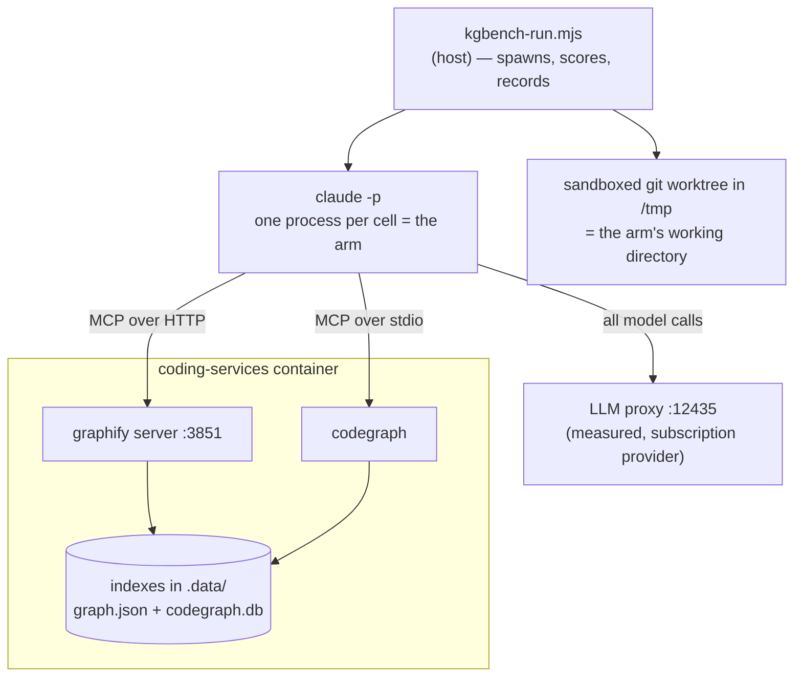

# Code-retrieval benchmark: `coding-v1`

**Does a code-graph backend earn its keep, compared to an agent that just greps?**

This repository maintains two code-graph backends — Graphify and CodeGraph — each of
which costs an index, a container service, and a rebuild step. This benchmark exists to
answer whether they buy anything a plain `grep` agent doesn't, using measurements rather
than intuition.

**Run:** `coding-v1-r5` · repo at `199bf1f3f` · model `claude-sonnet-5` ·
16 questions × 3 arms × 3–10 reps = **264 runs**, 0 failures.

---

## Bottom line

| | grep | graphify | codegraph |
|---|--:|--:|--:|
| **Correctness** (median) | **1.00** | **1.00** | **1.00** |
| Content tokens per query | **57,427** | 161,681 | 99,747 |
| Latency per query | **18.3s** | 28.4s | 28.1s |
| Cost per query | **$0.091** | $0.167 | $0.260 |
| Hard failures | 0 / 76 | 0 / 76 | 0 / 76 |
| Hallucinations | 0 | 0 | 0 |

**On this question set, neither graph backend buys measurable correctness, and both cost
roughly 1.7–2.8× the tokens, ~1.5× the latency, and 1.8–2.9× the money.**

The hypothesis this set was designed to test — that a graph index answers *"that isn't
here"* better than grep — **did not reproduce**. All three arms abstained correctly on
every trap question.

Read this as a **null result on 16 questions**, not as proof that code graphs are
worthless. See [What this does not show](#what-this-does-not-show).

---

## How to read this — the setup in plain terms

### An "arm" is one way of answering

Every arm is the **same model, the same prompt, the same questions**. The only thing
that differs is which tools it may use. That isolates *retrieval strategy* as the single
variable.

| Arm | Tools | Represents |
|---|---|---|
| `grep` | `Glob`, `Grep`, `Read` | The baseline — what a coding agent does today with no extra infrastructure |
| `graphify` | `Read` + 6 Graphify MCP tools | Query a prebuilt code graph instead of searching text |
| `codegraph` | `Read` + 1 CodeGraph MCP tool | Same idea, SQLite/FTS5 backend |

### A "cell" is one complete agent session

One cell = one headless `claude -p` run: the agent reasons, calls tools, reads results,
and writes a final answer. 16 questions × 3 arms × 3 reps = 144 cells, plus 7 extra reps
on the 4 architecture questions = **264 cells total**.

Cells run **strictly sequentially**. Running them in parallel would be ~4× faster but
would corrupt the latency and token measurements through CPU contention — and that is
not hypothetical, see [When the machine lied](#when-the-machine-lied).

### Where everything runs



The arm runs **on the host**, inside a throwaway copy of the repository. Its *tools*
reach into the container. Grading happens back on the host after the answer is written.

### The five question classes

| Class | n | What it asks |
|---|--:|---|
| `lookup` | 3 | Single-fact retrieval — *which file defines `MANAGED_MCP_KEYS`?* |
| `structural` | 3 | Relationships — *which backends exist and what transport does each use?* |
| `blast` | 3 | Consequences — *if this config field changed, what breaks?* |
| `arch` | 4 | Narrative — *why does the harness strip `ANTHROPIC_API_KEY`?* |
| `abstain` | 3 | **The answer is not here.** Saying so is the only correct response. |

The `abstain` class is the interesting one. Two of its questions ask about code that was
genuinely **removed** from this repo. A stale index will answer them confidently and
wrongly; grep comes up empty. That asymmetry is the most decision-relevant thing a
retrieval benchmark can surface, and no correctness-only scoring reveals it.

### How answers are scored

`score = required facts found ÷ required facts`, checked against a per-question
checklist of paths, symbols, and patterns. Any **forbidden** fact forces 0 and flags a
hallucination — a confidently wrong answer is worse than an incomplete one, because on
the receiving end that is the incident.

Every piece of ground truth is a `file:line` reference, machine-checked by
`scripts/kgbench-verify-questions.mjs`, so a rename can't silently rot the answer key.

### Why the arms can't cheat

The questions live in the repository the arms are asked to search. During piloting, the
grep arm answered a trap question by **reading the answer key** and scoring 1.00. A
leaked answer key produces *correct* answers, so it is invisible in the scores.

Arms therefore run against a **sandboxed git worktree** with the answer key, the
project's telemetry exports, session logs, and agent instruction files removed — and
containment is then **verified** by grepping the tree for each question's own prompt.
The run aborts if anything survives. Details in
[`docs/measurement/kgbench.md`](../../measurement/kgbench.md).

---

## Results

### Correctness: a tie everywhere

<picture>
  <source media="(prefers-color-scheme: dark)" srcset="../../images/kgbench-correctness-dark.svg">
  
</picture>

| Class | grep | graphify | codegraph | verdict |
|---|--:|--:|--:|---|
| lookup | 1.00 | 1.00 | 1.00 | tie |
| structural | 1.00 | 1.00 | 1.00 | tie |
| blast | 1.00 | 1.00 | 1.00 | tie |
| arch | 1.00 | 1.00 | 0.65 | tie (spreads overlap) |
| abstain | 1.00 | 1.00 | 1.00 | tie |

A winner is declared only at a **≥1.25× median gap with non-overlapping interquartile
range**. Anything weaker prints "tie", because at these sample sizes a 1.3× gap is not a
result — it's a coin landing the same way three times.

### Cost: not a tie

<picture>
  <source media="(prefers-color-scheme: dark)" srcset="../../images/kgbench-cost-dark.svg">
  
</picture>

**Content tokens** are total tokens minus each arm's measured empty-run baseline. That
matters: a large fixed floor of system prompt and tool schemas is charged on every call
regardless of strategy, and it compresses every ratio. Content tokens are what actually
separate retrieval strategies.

Graph queries pull **substantially larger payloads into context** than a targeted grep
does. That is the core cost finding, and it runs opposite to the usual intuition that an
index should be the cheaper path.

---

## The architecture class: what more evidence changed

The first pass (3 reps) showed grep 1.00, graphify 0.75, codegraph 0.50 — a 1.33× gap
that looked like a real advantage for grep. It was reported as a **tie** because the
score distributions overlapped, and the class was re-run at **10 reps** to settle it.

<picture>
  <source media="(prefers-color-scheme: dark)" srcset="../../images/kgbench-arch-spread-dark.svg">
  
</picture>

| Arm | n | mean | median | IQR | range |
|---|--:|--:|--:|---|---|
| grep | 40 | 0.76 | 1.00 | [0.50, 1.00] | 0.00 – 1.00 |
| graphify | 40 | 0.69 | 1.00 | [0.50, 1.00] | 0.00 – 1.00 |
| codegraph | 40 | 0.61 | 0.65 | [0.50, 1.00] | 0.00 – 1.00 |

**The apparent gap dissolved.** With more evidence, graphify's median moved 0.75 → 1.00
and codegraph's 0.50 → 0.65. All three arms have the **identical** interquartile range,
[0.50, 1.00]. The tie verdict was correct, and it is now robust rather than merely
under-powered.

The dot plot is the honest picture: every arm produces answers across the whole range on
these questions. **A bar chart of medians would have hidden that entirely** — which is
exactly why one is shown here.

Per question, the difficulty is not evenly spread:

| Question | grep | graphify | codegraph |
|---|--:|--:|--:|
| A1 — why the container mounts what it does | 1.00 | 0.90 | 0.79 |
| A2 — what the harness does that its predecessor didn't | 1.00 | 1.00 | 0.77 |
| A3 — why `ANTHROPIC_API_KEY` is stripped | 0.70 | 0.75 | 0.75 |
| A4 — how the backend registry resolves precedence | **0.35** | **0.10** | **0.15** |

**A4 defeats all three arms.** That is a question-quality signal, not an arm signal: when
every strategy fails the same question, suspect the question.

---

## Reliability

| Arm | runs | completed | failed | retry rate |
|---|--:|--:|--:|--:|
| grep | 76 | 76 | 0 | 0% |
| graphify | 76 | 76 | 0 | 0% |
| codegraph | 76 | 76 | 0 | 0% |

No stalls, no timeouts, no tool escapes, no contamination. In the earlier
[graphify-vs-grep](../graphify-vs-grep/) run the graph arm had a 7% hard-fail rate from
MCP stalls; that did not recur here.

---

## What this does not show

- **One repository, one model, one grader.** Everything here is `claude-sonnet-5` on this
  codebase. Nothing generalises to other repos or models without re-running.
- **The arms are forced.** Each is locked to a single strategy, which is *not* how an
  agent actually works. A `hybrid` arm (all tools, agent chooses) is the honest
  production number and is **not yet measured** — it is the most valuable next step.
- **Indexing cost is excluded.** Per-query numbers ignore what it costs to build and
  keep the indexes fresh. That is a real expense on the graph side and it is not counted
  here — so the graph backends look *better* than their true total cost.
- **16 questions is small**, and `arch` is only 4. A null result at this size means "no
  effect detected", not "no effect exists".
- **A4 is probably a bad question** (all arms ≤ 0.35). It drags the arch class down for
  everyone and should be rewritten or retired before the next run.
- **T2 was retired mid-run.** Its premise was false — it asserted `runCypherQuery` no
  longer exists, but it does, as a shim at `cgr-query-cache.ts:233`. Arms that produced
  the query were *right* and scored 0. Retired for a false premise, not for scoring
  badly; the distinction is recorded in the question itself.
- **T3 is contaminated for the grep arm in this run.** Its answers cite
  `lib/kgbench/graders.mjs` as evidence that the probe is a probe — a comment of mine
  leaked the subject into the searchable tree. Since fixed; discount that one cell.

---

## What went wrong building this

Five runs were started and four discarded. Every discard came from a defect that would
have produced a **plausible, publishable, wrong** result. They are documented because
the failure modes generalise to any agent benchmark.

| # | Defect | Why it mattered |
|---|---|---|
| 1 | **Arms were never isolated.** `--allowedTools` is a permission-*prompt* allowlist; `--dangerously-skip-permissions` skips consulting it. Every arm silently had the full toolset — the "grep" arm called `Bash` 59 times, the graphify arm called it 27 times and used *zero* graph tools. | The arms were the same agent wearing different labels. This also explains the predecessor run where both arms scored 1.00 on everything and "could not be told apart". |
| 2 | **The answer key was searchable.** An arm scored 1.00 by quoting a trap question's own provenance note. Telemetry exports leaked whole prompts too, because this project records the sessions in which its own benchmark was written. | A leaked answer key produces *correct* answers. It is invisible in the scores. |
| 3 | **13 of 17 questions were never graded.** Questions declare their checklist at the top level; the runner passed only `q.grader`, so they scored `null`. All four abstain questions had their fabrication check switched off entirely. | The one class built to detect fabrication could not detect fabrication. |
| 4 | **Correct abstentions were scored as hallucinations.** Forbidden-fact patterns encoded the *shape* of a path rather than the *claim*, and matched paths that answers merely mentioned while explaining what they'd ruled out. | Produced a fake headline: "grep hallucinates 8%, graphify 0%". After fixing, all three arms are at 0%. |
| 5 | **The host lied about latency.** Corporate AV saturated the machine; a 300s timer fired after 950s, and three cells were recorded as arm timeouts. | Blames the arm for the machine. Now detected as `host_stalled` and excluded rather than scored. |

Every artefact pointed the **same direction** — flattering the graph arms, penalising
grep. Stopping at any earlier point would have reported a graph advantage that does not
exist.

The harness now defends itself against each: it discovers the CLI's real tool surface
and denies everything not granted, then verifies from the session's own init event that
isolation applied; it verifies containment by grepping for each prompt; it refuses to
delete a question's own evidence; and it distinguishes a starved host from a slow arm.

### When the machine lied

Worth its own note, because it is easy to miss. Node timers cannot fire early, so a 300s
timeout completing at 950s is proof the process was starved, not that the work was slow.
Recorded naively, that becomes `hard_fail_rate` — a permanent, published claim that an
arm cannot answer a class of question, caused entirely by an antivirus scan.

---

## Reproduce it

```bash
# check every arm is available (fails loudly if an index or the proxy is missing)
node scripts/kgbench-run.mjs --set coding-v1 --preflight-only

# the full matrix
node scripts/kgbench-run.mjs --set coding-v1 --reps 3 --run-id my-run

# deepen a single class
node scripts/kgbench-run.mjs --set coding-v1 --reps 10 --only A1,A2,A3,A4 --run-id my-run

# render this report and the figures
node scripts/kgbench-report.mjs --run my-run --out docs/benchmarks/coding-v1/README.md
node scripts/kgbench-charts.mjs --run my-run --out docs/images
```

Full answers are stored, so a fixed grader can be **re-applied offline** instead of
re-running the matrix — which is how the false hallucination flags above were corrected
without spending another model call.

## Files

| Path | What |
|---|---|
| `config/kgbench/questions/coding-v1.json` | The questions, checklists, and `file:line` ground truth |
| `config/kgbench/arms.json` | Arm definitions — the tool surface each one gets |
| `lib/kgbench/sandbox.mjs` | The sandboxed run tree and containment verification |
| `lib/kgbench/graders.mjs` | Deterministic scoring; pure, so answers can be re-graded offline |
| `lib/kgbench/runner.mjs` | Cell execution, tool-surface enforcement, host-stall detection |
| `scripts/kgbench-charts.mjs` | Regenerates the figures on this page from `results.jsonl` |
| `.data/kgbench/runs/coding-v1-r5/` | Raw results (`results.jsonl`) and the run manifest |
| [`docs/measurement/kgbench.md`](../../measurement/kgbench.md) | Operator guide — prerequisites, containment, scoring |
