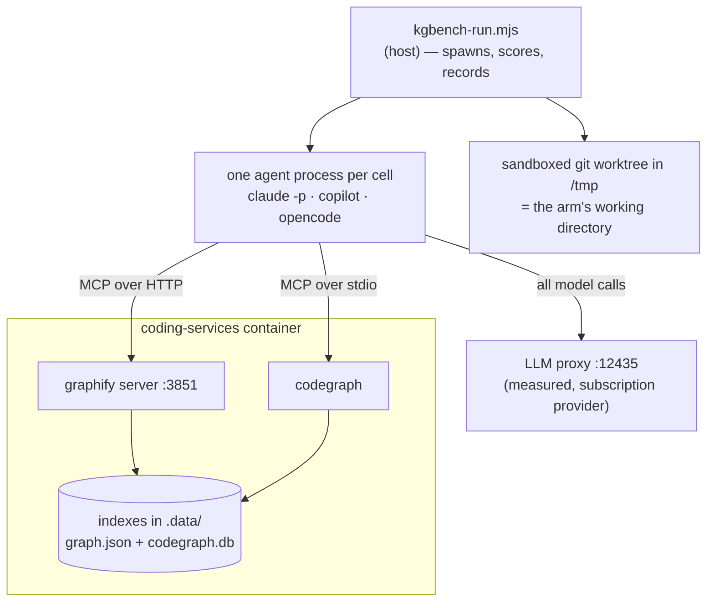

# Code-retrieval benchmark: `coding-v1`

**Does a code-graph backend earn its keep, compared to an agent that just greps?**

This repository maintains two code-graph backends — Graphify and CodeGraph — each of which
costs an index, a container service, and a rebuild step. This benchmark exists to answer
whether they buy anything a plain `grep` agent doesn't, using measurements rather than
intuition.

**Run:** `coding-v1-x2` · repo at `56d581a48` · models `claude-sonnet-5`,
`rapid-proxy/claude-sonnet-5` · 16 questions × 4 arms × 3 reps across 3 agents =
**384 cells**, 0 contaminated, 0 tool escapes.

This run adds an **agent axis** — the same arms run by claude, copilot and opencode — and it
turns out to matter more than the arms do. Its non-claude half was re-run after a harness
defect; see [Provenance](#provenance-of-these-numbers).

> **The generated tables live in [`RESULTS.md`](RESULTS.md)** and are re-rendered from
> `results.jsonl` on demand. This page is hand-written around those numbers and is not
> reproducible from a re-render — see [Reproduce it](#reproduce-it).

---

## Bottom line

Read the arm comparison on **claude only**. It is the sole agent whose tool surface is
actually enforced, so it is the only one where "the `grep` arm" means the agent could not
reach a graph tool rather than merely wasn't configured with one.

| | grep | graphify | codegraph | **hybrid** |
|---|--:|--:|--:|--:|
| **Correctness** (median) | **1.00** | **1.00** | **1.00** | **1.00** |
| Content tokens per query | **74,872** | 180,527 | 133,001 | 83,081 |
| Latency per query | **17.8s** | 36.5s | 33.4s | 20.1s |
| Latency p90 | 47.4s | 95.1s | 112.4s | **33.2s** |
| Cost per query | $0.091 | $0.194 | $0.165 | **$0.087** |
| Hard failures | 0 / 48 | 0 / 48 | 0 / 48 | 0 / 48 |

**On this question set, neither graph backend buys measurable correctness, and both cost
1.8–2.4× the tokens, 1.9–2.1× the latency, and 1.8–2.1× the money.**

The `hybrid` arm is the one to read the others against, because it is the only one shaped
like production: it has *every* tool and chooses freely. It lands on grep's cost and grep's
correctness — because **it chooses grep**. Across 48 cells it made 226 tool calls, of which
**3 were graph queries** and **none were Graphify**. Given the index, the agent declines to
use it.

This reproduces the same finding from the previous run (`r6`: 4 graph calls in 348, none
Graphify) on a different tree, a different question phrasing for two questions, and a
corrected answer key. It is the most stable result this benchmark has produced.

The hypothesis the set was designed to test — that a graph index answers *"that isn't here"*
better than grep — **did not reproduce**. All four arms abstained correctly on every trap.

Read this as a **null result on 16 questions**, not as proof that code graphs are worthless.
There is one real per-question difference, and it is CodeGraph's: it scores **0.00 on L2**
and **0.33 on A4** where every other arm scores 1.00 and 0.82. See
[where corpus scope shows up](#where-corpus-scope-shows-up).

### The agent axis is larger than the arm axis

New in this run, and the more consequential finding:

| Arm | Agent | answered | correctness | content tokens | latency |
|---|---|--:|--:|--:|--:|
| grep | claude | **48/48** | 1.00 | 74,872 | 17.8s |
| grep | copilot | **48/48** | 1.00 | 132,147 | 35.2s |
| grep | opencode | **6/48** | 1.00 | 43,571 | 23.4s |
| hybrid | claude | **48/48** | 1.00 | 83,081 | 20.1s |
| hybrid | copilot | **48/48** | 1.00 | 105,865 | 33.6s |
| hybrid | opencode | **6/48** | 1.00 | 79,003 | 18.3s |

Every agent that produces an answer is **equally correct**. What separates them is whether
they answer at all, and what they spend getting there. opencode **fails to answer 88% of the
time** — it terminates at its first toolless step, before writing anything — while copilot
answers everything at roughly **1.8× claude's token cost** on the same arm.

That reframes the whole exercise. On this question set, choosing the agent moves the outcome
far more than choosing the retrieval strategy, and the retrieval strategy is the thing this
repository spends infrastructure on.

---

## How to read this — the setup in plain terms

### An "arm" is one way of answering

Every arm is the **same model, the same prompt, the same questions**. The only thing that
differs is which tools it may use. That isolates *retrieval strategy* as the single variable.

| Arm | Tools | Represents |
|---|---|---|
| `grep` | `Glob`, `Grep`, `Read` | The baseline — what a coding agent does today with no extra infrastructure |
| `graphify` | `Read` + 6 Graphify MCP tools | Query a prebuilt code graph instead of searching text |
| `codegraph` | `Read` + 1 CodeGraph MCP tool | Same idea, SQLite/FTS5 backend |
| `hybrid` | `Glob`, `Grep`, `Read` + **all** backend tools | Production. Nothing is withheld; the agent picks its own strategy |

The first three arms are **forced** onto one strategy, which is not how an agent works. That
is deliberate — forcing is what isolates the variable — but it means none of them answers the
question a maintainer actually has, which is *"if I install this, am I better off?"* Only
`hybrid` answers that, and every other arm should be read against it.

### Only claude can be held to an arm

`--allowedTools`, `--disallowedTools` and `--strict-mcp-config` are claude flags. For copilot
and opencode the harness restricts an arm's **MCP servers** by writing the config file each
CLI reads, but their built-in file and search tools cannot be withheld.

So on those agents an arm name describes the strategy a cell was *asked* to use, not one it
was *confined* to. The two arms whose identity depends on withholding built-in search —
`graphify` and `codegraph`, which grant `Read` but not `Glob`/`Grep` — are **refused outright**
on copilot and opencode rather than run under a label they would not honour. That is why the
agent table above has only `grep` and `hybrid` rows.

### A "cell" is one complete agent session

One cell = one headless agent run: it reasons, calls tools, reads results, and writes a final
answer. 16 questions × 4 arms × 3 reps on claude (192) plus 16 × 2 arms × 3 reps on each of
copilot and opencode (192) = **384 cells**.

Cells run **strictly sequentially**. Running them in parallel would be ~4× faster but would
corrupt the latency and token measurements through CPU contention — and that is not
hypothetical, see [When the machine lied](#when-the-machine-lied).

### Where everything runs



The arm runs **on the host**, inside a throwaway copy of the repository. Its *tools* reach
into the container. Grading happens back on the host after the answer is written.

### How the answer is collected, and why it differs by agent

claude streams its answer as structured JSON. copilot and opencode are told to **write the
answer to a file**, because an analysis-shaped prompt makes copilot exit within seconds and
opencode yield at its first toolless step — both "succeeding" having answered nothing.

That difference is a confound in every cross-agent comparison here and it is not removable:
it is what makes those cells produce an answer at all. It is also where this run's worst
defect lived — see [defect 15](#what-went-wrong-building-this).

### The five question classes

| Class | n | The job |
|---|--:|---|
| `lookup` | 3 | Find one fact in one place |
| `structural` | 3 | Describe how pieces relate to each other |
| `blast` | 3 | Work out the consequences of a change |
| `arch` | 4 | Explain *why* the system is built a certain way — narrative that lives in no single file |
| `abstain` | 3 | **The answer is not here.** Saying so is the only correct response |

The `abstain` class is the interesting one, and the reason this set exists. Its questions ask
about things that were genuinely **removed** from this repo, or never existed. A stale index
answers them confidently and wrongly; grep comes up empty. That asymmetry is the most
decision-relevant thing a retrieval benchmark can surface, and correctness-only scoring hides
it completely.

### The questions

All sixteen, verbatim — this is the whole test. "Correct" means the listed facts appear in
the answer, checked mechanically rather than by impression.

#### `lookup` — one fact, one place

| | Question | Correct requires |
|---|---|---|
| **L1** | Which file defines the shell variable `MANAGED_MCP_KEYS`, and what is its purpose? | names `install.sh`; explains it is the prune list for installer-owned MCP servers |
| **L2** | Which file implements the function `summaryStats`, and which module imports it for the retrieval benchmark? | `lib/kgbench/report.mjs`; imported by `scripts/kgbench-charts.mjs` *(bonus: notes the independent copy in `lib/experiments/compare.mjs`)* |
| **L3** | Which HTTP route does the system-health dashboard expose to trigger a code-graph re-index, and in which file is it registered? | `POST /api/cgr/reindex`; `server.js` |

> **L2's key was corrected after the previous run.** It had required
> `lib/experiments/compare.mjs` as the sole implementer. `summaryStats` is defined twice and
> independently, and the *retrieval benchmark's* copy is `lib/kgbench/report.mjs` — the
> question says "for the retrieval benchmark", so the key had named the other harness. Every
> arm had been answering correctly and scoring 0.15.

#### `structural` — how pieces relate

| | Question | Correct requires |
|---|---|---|
| **S1** | In `config/code-graph.json` the active backend is resolved with a precedence order. List the three inputs in priority order, highest first. | `CODE_GRAPH_BACKEND` env var first; per-agent backend second; `active` third |
| **S2** | Under supervisord, which program serves the graphify MCP endpoint, what script does it run, and on which port? | program `graphify`; `graphify-serve.sh`; port `3851` |
| **S3** | Which backends does the code-graph registry currently define, and which transport does each use? | graphify over http; codegraph over stdio |

#### `blast` — consequences of a change

| | Question | Correct requires |
|---|---|---|
| **B1** | If the `mcp.tools` list for a backend in `config/code-graph.json` were changed, which parts of the system would be affected? Name the consumers. Also state explicitly whether MCP server registration is affected, and why. | kgbench's `allowedTools` derivation via `allowedToolsFor()`; and that registration is **not** affected *(bonus: the `allowed-tools` CLI, `validate()`)* |
| **B2** | A change makes the LLM proxy on port 12435 unreachable. Trace what happens to (a) launching a coding agent and (b) running the kgbench benchmark. | agent launch aborts fail-closed; kgbench also refuses to start · **must not** claim it silently falls back to direct provider calls |
| **B3** | The repo contains a tracked but empty directory `.codegraph/`. What breaks if it is deleted, and why can Docker not recreate it? | the container fails to start / the bind mount cannot attach; the parent is mounted read-only |

#### `arch` — narrative, not location

| | Question | Correct requires |
|---|---|---|
| **A1** | Why is the `.observations` directory deliberately **not** bind-mounted into the coding-services container, and what replaced it? | SQLite WAL/SHM corruption from concurrent openers across the bind mount; the host obs-api is the single owner |
| **A2** | The kgbench benchmark measures "content tokens" rather than total tokens. What problem does that solve, and how is the value derived? | a large fixed floor (system prompt + tool schemas) dominates totals; derived by subtracting a measured empty-run baseline |
| **A3** | The code-graph registry deliberately leaves out two capabilities such a registry might be expected to have. Name both omissions, give the reason recorded for each, and say which component does the first one's job instead. | no way to select every backend at once, and kgbench composes its own per-arm MCP configs instead; no query-type routing, because which backend suits which question is what the benchmark exists to measure |
| **A4** | This repository pins several environment variables and index settings for the CodeGraph backend, and records the reason each was chosen. Identify them, explain what each prevents, and say what owns index freshness instead. | daemon/watcher off for deterministic indexing; the reindex dispatcher owns freshness; `codegraph init` needs stdin closed or it hangs under supervisord *(bonus: telemetry off — the container is keyless)* |

> **A3 and A4 are replacements.** The originals asked why an API key is stripped and how
> stdio differs from HTTP on crash. Both were answerable from general knowledge, and in an
> earlier pass **70 of 160 architecture cells answered them with no tool call at all**. They
> measured the model, not the repository.

#### `abstain` — the answer is not in this repository

| | Question | Correct requires |
|---|---|---|
| **T1** | Which file configures the Memgraph connection used by the code-graph backend? | say it does not exist *(Memgraph went when graphify replaced code-graph-rag; stale references still litter the repo, which is the trap)* |
| **T3** | Which module implements the payment reconciliation service in this repository? | say it does not exist *(a plausible subsystem that never existed here)* |
| **T4** | In which file is the `CODEGRAPH_MAX_DEPTH` environment variable read? | say it does not exist *(a plausible env var for a backend that does exist)* |

#### Retired: T2

> *What Cypher query does `runCypherQuery` execute to find callers of a symbol?*

Written as an abstain probe on the assumption the Cypher path was gone. **It is not.**
`runCypherQuery` still builds literal Cypher at
`integrations/mcp-server-semantic-analysis/src/services/cgr-query-cache.ts:233`. Arms that
produced the query were *right* and scored 0; the arm that abstained scored 1.

Retired for a **false premise**, not for scoring badly — dropping questions because results
look wrong is selection. Its rows are excluded from every number here.

### How answers are scored

`score = required facts found ÷ required facts`, checked against a per-question checklist of
paths, symbols, and patterns. Any **forbidden** fact forces 0 and flags a hallucination — a
confidently wrong answer is worse than an incomplete one, because on the receiving end that
is the incident.

Every piece of ground truth is a `file:line` reference, machine-checked by
`scripts/kgbench-verify-questions.mjs`, so a rename can't silently rot the answer key.

### Why the arms can't cheat

The questions live in the repository the arms are asked to search. During piloting, the grep
arm answered a trap question by **reading the answer key** and scoring 1.00. A leaked answer
key produces *correct* answers, so it is invisible in the scores.

Arms therefore run against a **sandboxed git worktree** with 26 paths removed: the answer key,
telemetry exports, session logs, agent instruction files, this published report, and the
grading and containment modules themselves. Containment is then **verified** by grepping the
tree for each question's own prompt, and the run aborts if anything survives.

`graders.mjs` and `sandbox.mjs` describe what a right answer looks like and which subjects are
traps, so an explanatory comment in either is a crib — and that happened four times, three of
them in comments written to explain the *previous* leak. Neither file is any question's ground
truth, so removing them costs nothing and ends the category. Prose discipline had already
failed; structure is what holds.

A file-level exclusion is not sufficient on its own. Graphify indexes markdown headings as
graph nodes, so a document stripped from the tree can still reach the graph arms through the
index — `.graphifyignore` has to match.

---

## Results

### Correctness: a tie everywhere

<picture>
  <source media="(prefers-color-scheme: dark)" srcset="../../images/kgbench-correctness-dark.svg">
  
</picture>

Each group of four bars is one **question class**; the four bars within it are the four
**arms**, always in the same order. The figures are scoped to **claude**, for the reason given
above: a bar pooling three agents with different enforcement has no meaningful midpoint.

| Class | Questions | n per arm | grep | graphify | codegraph | hybrid | verdict |
|---|---|--:|--:|--:|--:|--:|---|
| lookup | L1 L2 L3 | 9 | 1.00 | 1.00 | 1.00 | 1.00 | tie |
| structural | S1 S2 S3 | 9 | 1.00 | 1.00 | 1.00 | 1.00 | tie |
| blast | B1 B2 B3 | 9 | 1.00 | 1.00 | 1.00 | 1.00 | tie |
| arch | A1 A2 A3 A4 | 12 | 1.00 | 1.00 | 1.00 | 1.00 | tie |
| abstain | T1 T3 T4 | 9 | 1.00 | 1.00 | 1.00 | 1.00 | tie |

**A class median hides a bad cell, and here it hides two.** `lookup` reads 1.00 for every arm
while **codegraph sits at 0.00 on L2**, and `arch` reads 1.00 for every arm while **codegraph
sits at 0.33 on A4** and every arm sits at 0.82. Three questions per class means one weak
question vanishes into the median. Always read the per-question table.

A winner is declared only at a **≥1.25× median gap with non-overlapping interquartile range**.
Anything weaker prints "tie", because at these sample sizes a 1.3× gap is not a result — it's
a coin landing the same way three times.

### Cost: not a tie

<picture>
  <source media="(prefers-color-scheme: dark)" srcset="../../images/kgbench-cost-dark.svg">
  
</picture>

**Content tokens** are total tokens minus each arm's measured empty-run baseline. That matters:
a large fixed floor of system prompt and tool schemas is charged on every call regardless of
strategy, and it compresses every ratio. Content tokens are what actually separate retrieval
strategies.

Graph queries pull **substantially larger payloads into context** than a targeted grep does.
That is the core cost finding, and it runs opposite to the usual intuition that an index should
be the cheaper path. Graphify is the most expensive arm in this run at 2.4× grep.

The `hybrid` bar is the one that matters: give the agent everything and it costs what grep
costs. The graph arms' extra tokens are not the price of *having* an index — they are the price
of being *forced* to use one.

---

## What the agent picks when nothing is withheld

`hybrid` had all ten tools: `Glob`, `Grep`, `Read`, six Graphify queries, and CodeGraph's
explore. Over 48 claude cells:

| Tool | Calls |
|---|--:|
| `Grep` | 150 |
| `Read` | 51 |
| `Glob` | 22 |
| `mcp__codegraph__codegraph_explore` | 3 |
| any Graphify tool | **0** |

Three graph calls out of 226, and Graphify never once. Only **3 of 48 cells** touched a graph
tool at all. This is the single most decision-relevant number here: **the infrastructure is
available, free at the point of use, and declined.**

Two honest caveats. The tool *descriptions* are what the agent chooses from, so this measures
the appeal of the advertised interface as much as the index behind it — a better-described
graph tool might get picked more. And a preference is not a justification: the agent could be
choosing wrong. But it is not choosing wrong *and* paying for it, because its correctness
matches the forced-grep arm exactly.

The forced arms show a milder version of the same reluctance: given only their backend, the
graph arms still answered without making a single graph call in **6 of 48 cells each**.

---

## Where corpus scope shows up

CodeGraph is the only arm that loses points anywhere, and both losses have the same shape.

<picture>
  <source media="(prefers-color-scheme: dark)" srcset="../../images/kgbench-arch-spread-dark.svg">
  
</picture>

Every dot is one architecture-class cell, so it shows A2 and A4 but **not** L2, which is a
`lookup` question and appears in the table below rather than the figure. The `arch` median is
1.00 for all four arms, which is why the automatic winner check prints "tie" — correctly,
because two questions moving is not a class-level effect.

| Question | grep | graphify | codegraph | hybrid |
|---|--:|--:|--:|--:|
| L2 — which module implements `summaryStats` | 1.00 | 1.00 | **0.00** | 1.00 |
| A2 — why "content tokens" rather than total | 1.00 | 1.00 | **0.65** | 1.00 |
| A4 — why CodeGraph's runtime is constrained | 0.82 | 0.82 | **0.33** | 0.82 |

**L2 is 0.00 on all three reps**, missing both required facts. **A4 is 0.33 on two of three.**
It is not a case of not trying: on A2 the codegraph arm made a median of **20 tool calls**,
more than any other arm on any question, and still missed a required fact.

The mechanism is corpus scope. CodeGraph indexes **code entities** into SQLite/FTS5. A4's
answer lives in prose inside a JSON config — the `_envNote` and `_indexNote` keys of
`config/code-graph.json` — and comment strings in a config file are not code entities, so its
index cannot reach them. Rather than find nothing and say so, the arm answers from the one
source it does have, its own MCP tool description, and produces a fluent, confident account of
constraints that are not this repository's.

That is worth stating plainly: **the failure mode of a too-narrow index is not an empty result,
it is a confident answer from whatever else is in context.** Graphify, which indexes documents
as well as code, scores 1.00 on L2 and 0.82 on A4. Grep, which has no index at all and just
reads the file, scores the same.

Note that A4 is 0.82 for *every* arm, codegraph included but worse. A fact no arm reliably
finds is a question worth re-reading before it is a finding about backends.

---

## Reliability

| Arm | Agent | runs | answered | failed | hard-fail rate |
|---|---|--:|--:|--:|--:|
| grep | claude | 48 | 48 | 0 | 0% |
| grep | copilot | 48 | 48 | 0 | 0% |
| grep | opencode | 48 | **6** | 42 | **88%** |
| graphify | claude | 48 | 48 | 0 | 0% |
| codegraph | claude | 48 | 48 | 0 | 0% |
| hybrid | claude | 48 | 48 | 0 | 0% |
| hybrid | copilot | 48 | 48 | 0 | 0% |
| hybrid | opencode | 48 | **6** | 42 | **88%** |

No stalls, no timeouts, no tool escapes, no contamination. Every failure in this run is
opencode declining to produce an answer, and none of them is a retrieval failure: the 12 cells
where it *did* answer score 1.00.

**opencode's 88% is a termination behaviour, not a capability finding.** It ends its run at the
first step that calls no tool, which on an analysis-shaped prompt is frequently the first step.
This is why the harness asks for an answer file at all — so that stopping early is recorded as
`no_result` rather than as a wrong answer. Getting that recording right is what
[defect 15](#what-went-wrong-building-this) is about.

Latency tails: p90 is 47s for grep, **33s for hybrid**, 95s for graphify and 112s for
codegraph. The arm with every tool available has the *tightest* tail of all.

**One hallucination in 384 cells**: `grep`/claude on T3 rep 1 asserted a path for the
non-existent payment reconciliation service. The same arm abstained correctly on the other two
reps and on both other traps. One row is not a rate, but it is the failure this class exists to
catch, and it came from the arm with no index.

---

## What this does not show

- **One repository, one question set.** Nothing generalises to other repos without re-running.
- **`hybrid` measures a preference, not a verdict.** It shows what these models pick from these
  tool descriptions. A graph tool described differently could be picked more often. It does not
  show the graph is useless — it shows it is unchosen.
- **Indexing cost is excluded.** Per-query numbers ignore what it costs to build and keep the
  indexes fresh. That is a real expense on the graph side, so the graph backends look *better*
  here than their true total cost.
- **The graph index is stale relative to the tree, deliberately.** It was built at `8a3ea3f0f`;
  the arms searched `56d581a48`. Rebuilding between the two halves of this run would have given
  the re-run half a fresher backend than the half it is compared against, which is a worse
  confound than the staleness. The residual difference is untested.
- **Corpus scope differs between backends** (graphify indexes docs and PDFs; code-only backends
  do not), so node/edge counts are not comparable at face value.
- **16 questions is small**, and `arch` is only 4. A null result at this size means "no effect
  detected", not "no effect exists".
- **Cross-agent comparison is confounded by elicitation.** claude streams structured JSON;
  copilot and opencode write to a file after a differently-shaped prompt. The confound is not
  removable — it is what makes those cells answer at all.
- **Only claude's arms are enforced.** copilot and opencode keep their built-in search on every
  arm, so their `grep` and `hybrid` rows differ by MCP configuration alone.
- **opencode's token figures rest on 6 ranked cells per arm.** Treat its cost numbers as
  indicative. They are no longer ambiguous — every non-claude cell is now attributed per
  session rather than per timestamp (defect 17), which removed a neighbour's trailing calls
  from 94 of 96 opencode cells and cut its medians by 25–35%. copilot's medians did not move
  at all, which is the check that the correction touched only the cells it should have.
- **The secondary judge changed model mid-run** (see below), so the disagreement section is
  weaker evidence than usual. Medians are unaffected — they use the deterministic checklist.

---

## Where the disagreements went

Eight cells out of 384, all `checklist_higher`:

| Question | Arm | checklist | judge |
|---|---|--:|--:|
| A4 | grep | 0.33 | 0.00 |
| L2 | graphify | 1.00 | 0.50 |
| A1 | graphify | 1.00 | 0.50 |
| B2 | codegraph | 1.00 | 0.50 |
| A2 | codegraph | 1.00 | 0.57 |
| A4 | codegraph | 0.33 | 0.00 |
| A4 | codegraph | 0.33 | 0.00 |
| B2 | hybrid | 1.00 | 0.50 |

**This table is an alarm, not a diagnosis.** It says two graders differ; it does not say which
is wrong, and across every investigation on this set the cause has been a judge rubric, a false
answer key, a regex, a shared match token, or a matcher too loose and too narrow at once —
*never* a badly written question. Twice the arms were right and the key was wrong.

The detector is also blind to the most common defect of all: because the judge's prompt is
built from the same checklist, a **wrong key makes both graders agree** and produces zero
disagreements.

**This run's disagreements carry an extra caveat: two different models did the judging.**
`claude-opus-5` was requested throughout. What the proxy actually served:

| Cells | judged by `claude-opus-5` | judged by `claude-haiku-4-5` | not judged |
|---|--:|--:|--:|
| claude | 3 | 150 | 39 |
| copilot | 20 | 58 | 18 |
| opencode | 0 | 10 | 86 |

The `claude-code` route ignores model selection and falls back to haiku, which is documented
behaviour. Within the copilot half the substitution is cleanly time-ordered — the first 20
cells got opus, everything after it got haiku — so it is a mid-run fallback rather than random
variation. The claude half had already been judged mostly by haiku in its earlier passes.

Two consequences worth stating separately. A disagreement in the table above may be a
difference between two judges rather than a difference in the answer. And the 143 unjudged
cells are not a judge failure: most are opencode's `no_result` rows, and abstain questions
carry no checklist and are never judged by design.

Every median and ranking on this page uses the deterministic checklist score, so none of them
is affected by any of this.

---

## Provenance of these numbers

Not every cell comes from one pass, and the report should say so rather than imply a single
sitting.

| Cells | What | Tree commit | When |
|---|---|---|---|
| 192 | all claude arms | `ebd7da004` | first passes |
| 192 | copilot + opencode, `grep` and `hybrid` | `56d581a48` | re-run after the stale-answer repair |

**The non-claude half was re-run because it was void, not because its results were
unwelcome.** Cells share one sandbox worktree and the answer file has a fixed name; the runner
never removed it between cells, so an agent that exited without writing left the *previous*
cell's answer in place to be read, recorded `ok`, and graded against the wrong question. One
opencode answer text was scored against **eleven** different questions.

Splicing two tree states is legitimate only if they are equivalent for the questions involved,
so that was checked rather than assumed:

- The only tree-visible difference between `ebd7da004` and `56d581a48` is `.gitignore`.
  Everything else that changed is kgbench harness, tests, docs, or `.data`.
- The question set and every answer key are **byte-identical** across both commits.
- The graph index was **not** rebuilt between the halves, deliberately, so both saw the same
  backend state.

Evidence the repair held, measured rather than asserted:

| | before | after |
|---|---|---|
| copilot distinct answers | 34 / 96 | **96 / 96** |
| answer text reused across *different* questions | 5 texts | **0, all agents** |
| (arm, question) groups with all reps byte-identical | 59 / 64 | **0 / 34** |

Full per-pass provenance is in the run manifest's `history` block, and
`.data/kgbench/runs/coding-v1-x2/REPAIRED.md` records the void and its resolution.

---

## What went wrong building this

Eighteen defects were found across the runs behind this page, and runs were discarded
repeatedly — two are still on disk carrying `VOID` in their name
(`coding-v1-VOID-tool-escape`, `coding-v1-x1-VOID-kb-injection`), and a third,
`coding-v1-x2`, was partially voided and repaired rather than thrown away. Every discard came
from a defect that would have produced a **plausible, publishable, wrong** result. They are
documented because the failure modes generalise to any agent benchmark.

| # | Defect | Why it mattered |
|---|---|---|
| 1 | **Arms were never isolated.** `--allowedTools` is a permission-*prompt* allowlist; `--dangerously-skip-permissions` skips consulting it. Every arm silently had the full toolset — the "grep" arm called `Bash` 59 times, the graphify arm called it 27 times and used *zero* graph tools. | The arms were the same agent wearing different labels. This also explains the predecessor run where both arms scored 1.00 on everything and "could not be told apart". |
| 2 | **The answer key was searchable.** An arm scored 1.00 by quoting a trap question's own provenance note. Telemetry exports leaked whole prompts too, because this project records the sessions in which its own benchmark was written. | A leaked answer key produces *correct* answers. It is invisible in the scores. |
| 3 | **13 of 17 questions were never graded.** Questions declare their checklist at the top level; the runner passed only `q.grader`, so they scored `null`. All four abstain questions had their fabrication check switched off entirely. | The one class built to detect fabrication could not detect fabrication. |
| 4 | **Correct abstentions were scored as hallucinations.** Forbidden-fact patterns encoded the *shape* of a path rather than the *claim*. | Produced a fake headline: "grep hallucinates 8%, graphify 0%". |
| 5 | **The host lied about latency.** Corporate AV saturated the machine; a 300s timer fired after 950s, and three cells were recorded as arm timeouts. | Blames the arm for the machine. Now detected as `host_stalled` and excluded rather than scored. |
| 6 | **The hybrid arm could not have worked as declared.** It granted every backend's tools while configuring one backend's server. Under `--strict-mcp-config` the unconfigured server's tools are *absent*, not refused — no error, no tool-escape flag. | It would have run as grep+graphify under a label saying grep+graphify+codegraph, filling a published column with numbers for a strategy nobody ran. Now a startup error. |
| 7 | **Comments in the grader were cribs.** Two illustrative examples in `graders.mjs` quoted real trap subjects. The grep arm grepped one and scored a perfect abstention off it — three rows, undetected. | Four leaks now, three of them comments explaining the previous leak. Fixed structurally: the grading and containment modules are stripped from the run tree. |
| 8 | **Publishing the questions contaminated the next run.** An earlier report listed every prompt, and Graphify indexes markdown *headings* as graph nodes — including one naming the abstain class as the-answer-is-not-here. | A file-level exclusion would have held for grep and leaked for the graph arms. `.graphifyignore` now excludes the report too. |
| 9 | **Contamination signals voided two correct answers.** A signal added to catch defect 7 fired on an answer that merely listed the file among grep hits, and a probe-detector fired on an arm that *inferred* a trap from finding nothing. | A voided correct answer biases the result exactly as much as a scored wrong one, and hides better — a missing row reads as caution. Signals are now split: citing a source voids, suspecting does not. |
| 10 | **Two questions measured the model, not the repository.** A3 and A4 were answerable from general knowledge; 70 of 160 architecture cells answered them with no tool call at all. | A class that requires no retrieval cannot distinguish retrieval strategies, and it dilutes every arm equally — which *looks* like a tie. |
| 11 | **The judge graded optional facts as required.** Its prompt listed every checklist item under one "REQUIRED FACTS" heading regardless of the `must` flag. | It marked answers down for omitting a *bonus*, manufacturing 10-of-12 disagreements on B3 and sending me looking for a bad question that did not exist. The two graders must see the same rubric or their disagreement measures the rubric, not the answer. |
| 12 | **An answer key asserted a consumer that does not exist.** B1 required naming MCP config generation as affected by `mcp.tools`; it is not. | Every arm got it right, was penalised by the judge for "contradicting" the key, and was handed the point anyway by a matcher that accepted the phrase inside a sentence denying it. Two graders cancelling out a wrong key is the worst case: the error is invisible in the score. |
| 13 | **Matchers could not read markdown.** `registration is **not** affected` failed a pattern for `is not affected` on the asterisks alone. | The fourth matcher-precision defect, and like the other three it destroyed a *correct* answer. Fixed once for every matcher by stripping emphasis before comparing. |
| 14 | **Long runs were being killed silently.** Two attempts were terminated part-way with no error and nothing in any project log. | Diagnosed, not guessed: the runner cleans up its worktree on SIGINT/SIGTERM but would *leak* it on SIGKILL, and no worktree leaked — so it caught a signal. Both deaths were runs tracked by a task manager, while the same workload detached ran on untouched. `kgbench-supervise.sh` now detaches and resumes on signal deaths only. |
| 15 | **A cell read the previous cell's answer file.** Cells share one worktree and the answer file has a fixed name; the runner never deleted it, and the reader only asked "is this file non-empty?". An agent that exited without writing inherited its predecessor's answer, recorded `ok`, and was graded against the wrong question — one text was scored against **eleven** different questions. | This inverted the mechanism's entire purpose. The answer file exists *so that* an early exit surfaces as `no_result` instead of a false success; staleness turned every early exit back into a false success **with a plausible answer attached**. It presented as opencode scoring a median of 0.00 on everything — indistinguishable from a capability finding, and reported as one until the distinct-answer count was checked. Now the file is deleted before each spawn, and a file older than the spawn is rejected outright. |
| 16 | **Publishing the report destroyed the report.** This page is hand-written around generated tables. Publishing was documented as rendering to a temp file and copying it onto this path, which replaces the analysis with the machine version. It happened twice — 619 lines at `f6bb7875c`, in a commit whose message is entirely about an answer key, and again on 2026-08-09. | Neither commit mentioned it, because a diff against the already-collapsed file shows only *growth*. The page carried a warning about exactly this — inside the file, so the first clobber destroyed the warning too. Prose inside the blast radius is not a control. Generated output now goes to `RESULTS.md`, and `--out` refuses any target without its generated marker. |
| 17 | **Tokens were attributed by timestamp, so each cell was charged part of its predecessor's.** A session does not stop when the process that started it does — its last calls are still being written while the next cell is already running. Summing the rows *stamped* inside a cell's window therefore mixed two cells. On `grep/L1 rep1`, 25,620 tokens of the previous cell's traffic; across the run, 94 of 96 opencode cells. | The old detector reported this as "more than one session ran concurrently", which reads as a *busy machine* — and sent an investigation hunting a background process that did not exist. The cells were simply adjacent, which is the normal case, not an anomaly. Attribution now follows whole sessions that BEGAN inside the window, so adjacency is charged correctly and "ambiguous" once again means something really did run alongside. opencode's medians fell 25–35%; copilot's did not move, which is how you know the correction was surgical. |
| 18 | **A re-attribution kept the verdict it had just overturned.** The offline re-resolver merges with `Object.assign`, which only overwrites keys the new result *has*. Every re-attributed cell kept `token_ambiguous: true` and the old "2 distinct sessions ran inside this cell's window" text, beside fresh fields stating it had been cleanly attributed to exactly one session. | The report reads the stale field, so the fix appeared to have done nothing: 94 ambiguous before, 94 after. Two more rounds of "why didn't that work" would have been spent on the attribution logic, which was already correct. Same shape as defect 15 — a merge that only ever adds lets a previous answer outlive the question. The resolver now declares every field it owns and the re-resolver clears them first, with a test that fails if a new field escapes the declaration. |

Defects 1–5 all pointed the **same direction** — flattering the graph arms, penalising grep.
Defects 7 and 9 point the other way. Defect 10 flattered nobody and hid everybody. Defect 15
manufactured a capability finding out of a termination bug, 16 destroyed the explanation of all
the others, and 17 quietly charged every cell part of its neighbour's bill. The lesson is not
"the graph arms were flattered", it is that **every measurement defect found here was invisible
in the output it produced.** Each one yielded a clean-looking table.

Defect 18 deserves its own line, because it is the failure mode of *fixing* things. It made a
correct fix look inert — the ambiguity count read 94 before and 94 after — by leaving the old
verdict in place beside the new evidence. A stale field that contradicts a fresh one is worse
than either a wrong answer or no answer, because it argues against the repair that just
succeeded. The same shape as defect 15, in the tooling rather than the data.

Most were found by instrumentation rather than by reading results: the tool-surface check, the
containment scan, the orphaned-MCP-server guard, and the grader's own disagreement counter,
which exposed defects 11, 12 and 13. Defect 15 was caught by neither — it was caught by asking
why a plausible-looking 0.00 was so uniform, and then counting **distinct answer texts**. An
agent that fails everything is not a finding; it is a hypothesis, and the cheapest test of it
is whether its answers are even different from each other.

### A note on tuning the grader after seeing results

Scoring fixes across these runs changed rows that had already been graded, which is exactly the
shape of a result being massaged. What makes it defensible, and how to check:

- Every change was validated against **fabrication fixtures** that must still be caught, not
  just against the rows it fixed.
- Every change was applied by re-grading **all cells uniformly**, never one arm.
- The full diff is committed: `results.pre-regrade.jsonl` holds the original scores and
  `regrade.json` lists every row that moved.

### When the machine lied

Worth its own note, because it is easy to miss. Node timers cannot fire early, so a 300s
timeout completing at 950s is proof the process was starved, not that the work was slow.
Recorded naively, that becomes `hard_fail_rate` — a permanent, published claim that an arm
cannot answer a class of question, caused entirely by an antivirus scan.

---

## Reproduce it

```bash
# check every arm is available (fails loudly if an index or the proxy is missing)
node scripts/kgbench-run.mjs --set coding-v1 --preflight-only

# the full matrix, detached and self-resuming — USE THIS for anything long
scripts/kgbench-supervise.sh --run-id my-run --set coding-v1 --reps 3 \
                             --agents claude,copilot,opencode

# progress / outcome
cat .data/kgbench/runs/my-run/supervise.status
wc -l .data/kgbench/runs/my-run/results.jsonl

# re-apply a fixed grader to stored answers, without re-running the matrix
node scripts/kgbench-regrade.mjs --run my-run --dry-run

# render the generated tables and the figures
node scripts/kgbench-report.mjs --run my-run --out docs/benchmarks/coding-v1/RESULTS.md
node scripts/kgbench-charts.mjs --run my-run --agent claude --out docs/images

# does the prose on this page still match the data it describes?
node scripts/kgbench-verify-report-claims.mjs
```

**`RESULTS.md` is generated; this page is not.** `kgbench-report.mjs --out` refuses to write
to a file lacking its generated marker, so it can no longer replace this analysis with the
machine version — that happened twice before the guard existed (defect 16). After a
re-render, update the numbers quoted on this page **by hand**.

Pass `--agent` to the charts on any multi-agent run. Without it every bar pools agents whose
tool enforcement differs, which is the comparison this report marks as not meaningful; the
script warns when you do.

Full answers are stored, so a fixed grader can be **re-applied offline** instead of re-running
the matrix.

## Files

| Path | What |
|---|---|
| [`RESULTS.md`](RESULTS.md) | The generated tables for this run — re-rendered, never hand-edited |
| `config/kgbench/questions/coding-v1.json` | The questions, checklists, and `file:line` ground truth |
| `config/kgbench/arms.json` | Arm definitions — the tool surface each one gets |
| `lib/kgbench/sandbox.mjs` | The sandboxed run tree and containment verification |
| `lib/kgbench/graders.mjs` | Deterministic scoring; pure, so answers can be re-graded offline |
| `lib/kgbench/runner.mjs` | Cell execution, tool-surface enforcement, host-stall detection, answer-file freshness |
| `lib/kgbench/agents.mjs` | The agent axis — per-agent elicitation, enforcement, and the faithfulness refusal |
| `scripts/kgbench-charts.mjs` | Regenerates the figures on this page from `results.jsonl` |
| `scripts/kgbench-verify-report-claims.mjs` | Recomputes every number this page asserts from the run data, and fails on drift |
| `scripts/kgbench-supervise.sh` | Detached, self-resuming runner — survives a signalled process group |
| `lib/kgbench/judge.mjs` | The second scorer. Excluded from the run tree: its prompt states what a right answer contains |
| `scripts/kgbench-regrade.mjs` | Re-applies fixed graders to stored answers, without re-running cells |
| `.data/kgbench/runs/coding-v1-x2/` | Raw results, run manifest, and `REPAIRED.md` (the void and its resolution) |
| [`../measurement-lessons.md`](../measurement-lessons.md) | The defects above, written up as transferable lessons |
