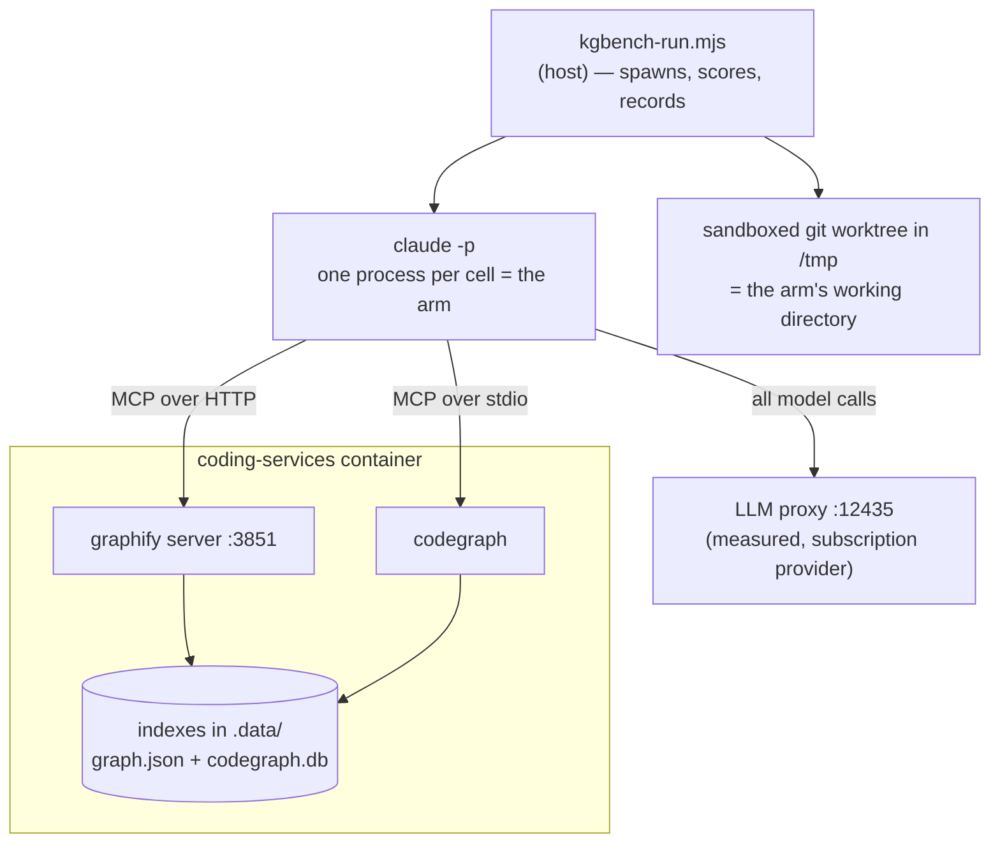

# Code-retrieval benchmark: `coding-v1`

**Does a code-graph backend earn its keep, compared to an agent that just greps?**

This repository maintains two code-graph backends — Graphify and CodeGraph — each of
which costs an index, a container service, and a rebuild step. This benchmark exists to
answer whether they buy anything a plain `grep` agent doesn't, using measurements rather
than intuition.

**Run:** `coding-v1-r6` · repo at `a54b1af78` · model `claude-sonnet-5` ·
16 questions × 4 arms × 3–10 reps = **304 runs**, 0 failures.
Supersedes `coding-v1-r5`, which had three contaminated rows — see
[What changed since r5](#what-changed-since-r5).

---

## Bottom line

| | grep | graphify | codegraph | **hybrid** |
|---|--:|--:|--:|--:|
| **Correctness** (median) | **1.00** | **1.00** | **1.00** | **1.00** |
| Content tokens per query | 55,656 | 86,971 | 122,414 | **56,965** |
| Latency per query | 16.2s | 20.1s | 32.4s | **14.1s** |
| Cost per query | **$0.066** | $0.111 | $0.158 | $0.072 |
| Hard failures | 0 / 76 | 0 / 76 | 0 / 76 | 0 / 76 |
| Hallucinations | 0 | 0 | 0 | 0 |

**On this question set, neither graph backend buys measurable correctness, and both cost
1.6–2.2× the tokens, 1.2–2.0× the latency, and 1.7–2.4× the money.**

The `hybrid` arm is the one to read the others against, because it is the only one shaped
like production: it has *every* tool and chooses freely. It lands on grep's cost and
grep's correctness — because **it chooses grep**. Across 76 cells it made 273 tool calls,
of which **3 were graph queries** and **none were Graphify**. Given the index, the agent
declines to use it.

The hypothesis this set was designed to test — that a graph index answers *"that isn't
here"* better than grep — **did not reproduce**. All four arms abstained correctly on
every trap question.

Read this as a **null result on 16 questions**, not as proof that code graphs are
worthless. Two of the four architecture questions turned out not to test retrieval at
all — see [What this does not show](#what-this-does-not-show).

---

## How to read this — the setup in plain terms

### An "arm" is one way of answering

Every arm is the **same model, the same prompt, the same questions**. The only thing
that differs is which tools it may use. That isolates *retrieval strategy* as the single
variable.

| Arm | Tools | Represents |
|---|---|---|
| `grep` | `Glob`, `Grep`, `Read` | The baseline — what a coding agent does today with no extra infrastructure |
| `graphify` | `Read` + 6 Graphify MCP tools | Query a prebuilt code graph instead of searching text |
| `codegraph` | `Read` + 1 CodeGraph MCP tool | Same idea, SQLite/FTS5 backend |
| `hybrid` | `Glob`, `Grep`, `Read` + **all** backend tools | Production. Nothing is withheld; the agent picks its own strategy |

The first three arms are **forced** onto one strategy, which is not how an agent works.
That is deliberate — forcing is what isolates the variable — but it means none of them
answers the question a maintainer actually has, which is *"if I install this, am I better
off?"* Only `hybrid` answers that, and every other arm should be read against it.

### A "cell" is one complete agent session

One cell = one headless `claude -p` run: the agent reasons, calls tools, reads results,
and writes a final answer. Twelve questions ran at 3 reps (12 × 4 arms × 3 = 144) and the
four architecture questions at 10 (4 × 4 arms × 10 = 160), for **304 cells total**.

Cells run **strictly sequentially**. Running them in parallel would be ~4× faster but
would corrupt the latency and token measurements through CPU contention — and that is
not hypothetical, see [When the machine lied](#when-the-machine-lied).

### Where everything runs



The arm runs **on the host**, inside a throwaway copy of the repository. Its *tools*
reach into the container. Grading happens back on the host after the answer is written.

### The five question classes

Questions are grouped by *what kind of work answering them takes*. Every chart in this
report is broken down by these five groups, so it is worth knowing what they are:

| Class | n | The job |
|---|--:|---|
| `lookup` | 3 | Find one fact in one place |
| `structural` | 3 | Describe how pieces relate to each other |
| `blast` | 3 | Work out the consequences of a change |
| `arch` | 4 | Explain *why* the system is built a certain way — narrative that lives in no single file |
| `abstain` | 3 | **The answer is not here.** Saying so is the only correct response |

The `abstain` class is the interesting one, and the reason this set exists. Its questions
ask about things that were genuinely **removed** from this repo, or never existed. A stale
index answers them confidently and wrongly; grep comes up empty. That asymmetry is the most
decision-relevant thing a retrieval benchmark can surface, and correctness-only scoring
hides it completely.

### The questions

All sixteen, verbatim — this is the whole test. Every arm was asked every question, and
"correct" means the listed facts appear in the answer, checked mechanically rather than
by impression.

#### `lookup` — one fact, one place

| | Question | Correct requires |
|---|---|---|
| **L1** | Which file defines the shell variable `MANAGED_MCP_KEYS`, and what is its purpose? | names `install.sh`; explains it is the prune list for installer-owned MCP servers |
| **L2** | Which file implements the function `summaryStats`, and which module imports it for the retrieval benchmark? | `lib/experiments/compare.mjs` · *(bonus: notes kgbench has its own copy)* |
| **L3** | Which HTTP route does the system-health dashboard expose to trigger a code-graph re-index, and in which file is it registered? | `POST /api/cgr/reindex`; `server.js` |

#### `structural` — how pieces relate

| | Question | Correct requires |
|---|---|---|
| **S1** | In `config/code-graph.json` the active backend is resolved with a precedence order. List the three inputs in priority order, highest first. | `CODE_GRAPH_BACKEND` env var first; per-agent backend second; `active` third |
| **S2** | Under supervisord, which program serves the graphify MCP endpoint, what script does it run, and on which port? | program `graphify`; `graphify-serve.sh`; port `3851` |
| **S3** | Which backends does the code-graph registry currently define, and which transport does each use? | graphify over http; codegraph over stdio |

#### `blast` — consequences of a change

| | Question | Correct requires |
|---|---|---|
| **B1** | If the `mcp.tools` list for a backend in `config/code-graph.json` were changed, which parts of the system would be affected? Name the consumers. | MCP config generation / agent registration; kgbench `allowedTools` derivation |
| **B2** | A change makes the LLM proxy on port 12435 unreachable. Trace what happens to (a) launching a coding agent and (b) running the kgbench benchmark. | agent launch aborts fail-closed; kgbench also refuses to start · **must not** claim it silently falls back to direct provider calls |
| **B3** | The repo contains a tracked but empty directory `.codegraph/`. What breaks if it is deleted, and why can Docker not recreate it? | the container fails to start / the bind mount cannot attach; the parent is mounted read-only |

#### `arch` — narrative, not location *(run at 10 reps)*

| | Question | Correct requires |
|---|---|---|
| **A1** | Why is the `.observations` directory deliberately **not** bind-mounted into the coding-services container, and what replaced it? | SQLite WAL/SHM corruption from concurrent openers across the bind mount; the host obs-api is the single owner |
| **A2** | The kgbench benchmark measures "content tokens" rather than total tokens. What problem does that solve, and how is the value derived? | a large fixed floor (system prompt + tool schemas) dominates totals; derived by subtracting a measured empty-run baseline |
| **A3** | Why does the benchmark harness strip `ANTHROPIC_API_KEY` from the environment of the agents it spawns? | a key takes precedence over the Max/subscription OAuth login; it would bypass the proxy / the measured path |
| **A4** | What is the difference in failure behaviour between a code-graph backend served over HTTP and one served over stdio, and why does it matter operationally? | a stdio crash takes down the whole MCP server list for the session; http fails per call / degrades gracefully |

#### `abstain` — the answer is not in this repository

The trap class. Each asks for something that does not exist; the **only** correct
response is to say so. A stale index answers confidently and wrongly.

| | Question | Correct requires |
|---|---|---|
| **T1** | Which file in this repository configures the Memgraph connection used by the code-graph backend? | say it does not exist · **must not** assert that some file configures Memgraph *(Memgraph was removed when graphify replaced code-graph-rag — stale references still litter the repo, which is the trap)* |
| **T3** | Which module implements the payment reconciliation service in this repository? | say it does not exist · **must not** assert a path for such a module *(a plausible-sounding subsystem that has never existed here)* |
| **T4** | In which file is the `CODEGRAPH_MAX_DEPTH` environment variable read? | say it does not exist · **must not** assert a file that reads it *(a plausible-sounding env var for a backend that does exist)* |

#### Retired: T2

> *What Cypher query does `runCypherQuery` execute to find callers of a symbol?*

Written as an abstain probe on the assumption the Cypher path was gone. **It is not.**
`runCypherQuery` still exists and still builds literal Cypher at
`integrations/mcp-server-semantic-analysis/src/services/cgr-query-cache.ts:233`. Arms that
produced the query were *right* and scored 0; the arm that abstained scored 1.

Retired for a **false premise**, not for scoring badly — dropping questions because
results look wrong is selection, and the distinction is recorded in the question file
itself. Its rows are excluded from every number in this report.

### How answers are scored

`score = required facts found ÷ required facts`, checked against a per-question
checklist of paths, symbols, and patterns. Any **forbidden** fact forces 0 and flags a
hallucination — a confidently wrong answer is worse than an incomplete one, because on
the receiving end that is the incident.

Every piece of ground truth is a `file:line` reference, machine-checked by
`scripts/kgbench-verify-questions.mjs`, so a rename can't silently rot the answer key.

### Why the arms can't cheat

The questions live in the repository the arms are asked to search. During piloting, the
grep arm answered a trap question by **reading the answer key** and scoring 1.00. A
leaked answer key produces *correct* answers, so it is invisible in the scores.

Arms therefore run against a **sandboxed git worktree** with 15 paths removed: the answer
key, the project's telemetry exports, session logs, agent instruction files, this
published report, and — added in this run — the **grading and containment modules
themselves**. Containment is then **verified** by grepping the tree for each question's
own prompt, and the run aborts if anything survives. It did abort, twice, during this
run's setup.

The last exclusion is the one worth explaining. `graders.mjs` and `sandbox.mjs` describe
what a right answer looks like and which subjects are traps, so an explanatory comment in
either is a crib — and that happened four times, three of them in comments written to
explain the *previous* leak. Neither file is any question's ground truth, so removing them
costs nothing and ends the category. Prose discipline had already failed; structure is
what holds.

A file-level exclusion is not sufficient on its own. Graphify indexes markdown headings as
graph nodes, so a document stripped from the tree can still reach the graph arms through
the index — `.graphifyignore` has to match. Details in
[`docs/measurement/kgbench.md`](../../measurement/kgbench.md).

---

## Results

### Correctness: a tie everywhere

<picture>
  <source media="(prefers-color-scheme: dark)" srcset="../../images/kgbench-correctness-dark.svg">
  
</picture>

Each group of four bars is one **question class**; the four bars within it are the
four **arms**, always in the same order.

| Class | Questions | n per arm | grep | graphify | codegraph | hybrid | verdict |
|---|---|--:|--:|--:|--:|--:|---|
| lookup | L1 L2 L3 | 9 | 1.00 | 1.00 | 1.00 | 1.00 | tie |
| structural | S1 S2 S3 | 9 | 1.00 | 1.00 | 1.00 | 1.00 | tie |
| blast | B1 B2 B3 | 9 | 1.00 | 1.00 | 1.00 | 1.00 | tie |
| arch | A1 A2 A3 A4 | 40 | 1.00 | 0.65 | 0.82 | 1.00 | tie (spreads overlap) |
| abstain | T1 T3 T4 | 9 | 1.00 | 1.00 | 1.00 | 1.00 | tie |

A class median can hide a bad question. `lookup` reads 1.00 for every arm, but **L2 sits
at 0.15 across all four** — every arm names kgbench's own `summaryStats` rather than the
`lib/experiments/compare.mjs` implementation the checklist wants. Three questions per
class means one weak question vanishes into the median. It did so in r5 too.

A winner is declared only at a **≥1.25× median gap with non-overlapping interquartile
range**. Anything weaker prints "tie", because at these sample sizes a 1.3× gap is not a
result — it's a coin landing the same way three times.

### Cost: not a tie

<picture>
  <source media="(prefers-color-scheme: dark)" srcset="../../images/kgbench-cost-dark.svg">
  
</picture>

**Content tokens** are total tokens minus each arm's measured empty-run baseline. That
matters: a large fixed floor of system prompt and tool schemas is charged on every call
regardless of strategy, and it compresses every ratio. Content tokens are what actually
separate retrieval strategies.

Graph queries pull **substantially larger payloads into context** than a targeted grep
does. That is the core cost finding, and it runs opposite to the usual intuition that an
index should be the cheaper path.

The `hybrid` bar is the one that matters: give the agent everything and it costs what
grep costs. The graph arms' extra tokens are not the price of *having* an index — they
are the price of being *forced* to use one.

---

## What the agent picks when nothing is withheld

`hybrid` had all ten tools: `Glob`, `Grep`, `Read`, six Graphify queries, and CodeGraph's
explore. Over 76 cells:

| Tool | Calls |
|---|--:|
| `Grep` | 195 |
| `Read` | 59 |
| `Glob` | 19 |
| `mcp__codegraph__codegraph_explore` | 3 |
| any Graphify tool | **0** |

Three graph calls out of 273, all on the same question (B1, "name the consumers of a
config field"), and Graphify never once. This is the single most decision-relevant number
here: **the infrastructure is available, free at the point of use, and declined.**

Two honest caveats. The tool *descriptions* are what the agent chooses from, so this
measures the appeal of the advertised interface as much as the index behind it — a
better-described graph tool might get picked more. And a preference is not a
justification: the agent could be choosing wrong. But it is not choosing wrong *and*
paying for it, because its correctness matches the forced-grep arm exactly.

The forced arms show the mirror image. Given only their backend, the graph arms still
went without it in **23 of 76 cells each** — they answered from the model's own knowledge
rather than querying, which is the next section.

---

## The architecture class: two of these questions don't test retrieval

<picture>
  <source media="(prefers-color-scheme: dark)" srcset="../../images/kgbench-arch-spread-dark.svg">
  
</picture>

| Arm | n | mean | median |
|---|--:|--:|--:|
| grep | 40 | 0.74 | 1.00 |
| graphify | 40 | 0.65 | 0.65 |
| codegraph | 40 | 0.63 | 0.82 |
| hybrid | 40 | 0.74 | 1.00 |

Every arm produces answers across the whole range. **A bar chart of medians would have
hidden that entirely** — which is why the dot plot is here.

But the more important finding is one this run surfaced by instrumenting tool calls:

| Question | cells answered with **zero tool calls** | median |
|---|--:|--:|
| A1 — why `.observations` is not bind-mounted | 0 / 40 | 1.00 |
| A2 — why "content tokens" rather than total | 0 / 40 | 1.00 |
| A3 — why `ANTHROPIC_API_KEY` is stripped | **36 / 40** | 0.50 |
| A4 — HTTP vs stdio failure behaviour | **34 / 40** | 0.00 |

**A3 and A4 are answered from the model's prior knowledge, not from this repository.**
Seventy of 160 architecture cells made no tool call at all — single-turn, no denied
attempts, just an answer. Both questions are general: why an API key beats an OAuth login,
and how stdio differs from HTTP on crash. Neither needs *this* codebase, so no retrieval
strategy can distinguish itself on them.

That reframes the arch tie. Restricted to the two questions that do require this
repository, every arm scores a median of **1.00**; restricted to the two that don't,
every arm scores **0.50**. The class was not measuring four architecture questions — it
was measuring two, plus two prior-knowledge questions that dilute every arm equally.

A4 is worse than merely non-retrieval: its median is 0.00 and the checklist disagrees
with the LLM judge on **35 of 40** cells. By this report's own rule — a question over 10%
disagreement is the question's problem — A4 is broken, and B1 and B3 (10 of 12 each) are
close behind.

**These questions are not retired here.** Dropping questions after seeing scores is
selection, and it is the same error the benchmark's own T2 note warns about. They are
reported as defective and left in every number above, so the medians on this page are the
pessimistic ones. Rewriting A3 and A4 to require repository-specific facts is the single
highest-value change to this set, and it should happen *before* the next run, not after.

---

## Reliability

| Arm | runs | completed | failed | retry rate |
|---|--:|--:|--:|--:|
| grep | 76 | 76 | 0 | 0% |
| graphify | 76 | 76 | 0 | 0% |
| codegraph | 76 | 76 | 0 | 0% |
| hybrid | 76 | 76 | 0 | 0% |

No stalls, no timeouts, no tool escapes, no contamination. In the earlier
[graphify-vs-grep](../graphify-vs-grep/) run the graph arm had a 7% hard-fail rate from
MCP stalls; that did not recur here.

Latency tails differ even though medians are close: p90 is 29s for grep and hybrid, 62s
for graphify, and **118s for codegraph**, with a single 268s worst case. Medians
understate what the stdio backend costs when it is slow.

---

## What this does not show

- **One repository, one model, one grader.** Everything here is `claude-sonnet-5` on this
  codebase. Nothing generalises to other repos or models without re-running.
- **`hybrid` measures a preference, not a verdict.** It shows what this model picks from
  these tool descriptions. A graph tool described differently, or a task shaped
  differently, could be picked more often. It does not show that the graph is useless —
  it shows it is unchosen.
- **Indexing cost is excluded.** Per-query numbers ignore what it costs to build and
  keep the indexes fresh. That is a real expense on the graph side and it is not counted
  here — so the graph backends look *better* than their true total cost.
- **16 questions is small**, and `arch` is only 4. A null result at this size means "no
  effect detected", not "no effect exists".
- **A3 and A4 do not test retrieval** — 70 of 160 arch cells answered them with no tool
  call at all. A4 additionally has a 35/40 checklist-vs-judge disagreement. Both are left
  in every number here rather than dropped after the fact, which makes the arch medians
  pessimistic for all four arms equally.
- **L2 scores 0.15 for every arm** and is masked by its class median. Also a question
  defect, also left in.
- **The abstain class may be guessable.** One answer concluded the question was a probe
  purely from finding nothing. Correct, and honestly reached — but a trap inferable from
  its phrasing measures something narrower than retrieval.
- **T2 was retired mid-run.** Its premise was false — it asserted `runCypherQuery` no
  longer exists, but it does, as a shim at `cgr-query-cache.ts:233`. Arms that produced
  the query were *right* and scored 0. Retired for a false premise, not for scoring
  badly; the distinction is recorded in the question itself.
- **Indexes are built from the real repo, not the sandbox.** The run tree strips
  benchmark-meta files, but the graph index is built from the working repository, so the
  two corpora are not identical. `.graphifyignore` now excludes the published report for
  this reason; the residual difference is untested.

---

## What changed since r5

r5 measured three arms and reported a clean sweep: every arm 1.00 on every class,
0 hallucinations, 0 contamination. Two of those claims were wrong.

| | r5 | r6 |
|---|---|---|
| Arms | 3 | 4 (adds `hybrid`) |
| Cells | 228 | 304 |
| Contaminated rows | reported 0 | **3 in r5**, found later; 0 in r6 |
| grep content tokens | 57,427 | 55,656 |
| graphify content tokens | 161,681 | **86,971** |
| codegraph content tokens | 99,747 | **122,414** |

**r5's abstain result was contaminated for grep on T3.** All three of its T3 reps cite
`lib/kgbench/graders.mjs`, where a comment of mine named the trap's subject; one reports
the probe as a probe. They scored 1.00 as clean abstentions and no signal caught them.
Re-scanning r5 with r6's detectors flags exactly those three rows and no others. The graph
arms had no `Grep` and abstained without the crib.

With the cribs removed, grep still abstains correctly on all three traps. **Removing the
contamination did not change the abstain conclusion** — it changed how much that
conclusion is worth, since one arm had been getting there partly by reading.

The token numbers moved substantially for both graph backends in opposite directions.
Between the runs the indexes were rebuilt and the tree changed, so r5-vs-r6 token deltas
should be read as *"this measurement is not stable across index rebuilds"* rather than as
either backend improving. That instability is itself worth knowing: a per-query token cost
that swings 1.9× on a reindex is not a fixed property of a backend.

r5's raw results remain in `.data/kgbench/runs/coding-v1-r5/` for comparison.

---

## What went wrong building this

Seven runs were started and five discarded. Every discard came from a defect that would
have produced a **plausible, publishable, wrong** result. They are documented because the
failure modes generalise to any agent benchmark.

| # | Defect | Why it mattered |
|---|---|---|
| 1 | **Arms were never isolated.** `--allowedTools` is a permission-*prompt* allowlist; `--dangerously-skip-permissions` skips consulting it. Every arm silently had the full toolset — the "grep" arm called `Bash` 59 times, the graphify arm called it 27 times and used *zero* graph tools. | The arms were the same agent wearing different labels. This also explains the predecessor run where both arms scored 1.00 on everything and "could not be told apart". |
| 2 | **The answer key was searchable.** An arm scored 1.00 by quoting a trap question's own provenance note. Telemetry exports leaked whole prompts too, because this project records the sessions in which its own benchmark was written. | A leaked answer key produces *correct* answers. It is invisible in the scores. |
| 3 | **13 of 17 questions were never graded.** Questions declare their checklist at the top level; the runner passed only `q.grader`, so they scored `null`. All four abstain questions had their fabrication check switched off entirely. | The one class built to detect fabrication could not detect fabrication. |
| 4 | **Correct abstentions were scored as hallucinations.** Forbidden-fact patterns encoded the *shape* of a path rather than the *claim*. | Produced a fake headline: "grep hallucinates 8%, graphify 0%". |
| 5 | **The host lied about latency.** Corporate AV saturated the machine; a 300s timer fired after 950s, and three cells were recorded as arm timeouts. | Blames the arm for the machine. Now detected as `host_stalled` and excluded rather than scored. |
| 6 | **The hybrid arm could not have worked as declared.** It granted every backend's tools while configuring one backend's server. Under `--strict-mcp-config` the unconfigured server's tools are *absent*, not refused — no error, no tool-escape flag. | It would have run as grep+graphify under a label saying grep+graphify+codegraph, and filled a published column with numbers for a strategy nobody ran. Now a startup error. |
| 7 | **Comments in the grader were cribs.** Two illustrative examples in `graders.mjs` quoted real trap subjects. In r5 the grep arm grepped one and scored a perfect abstention off it — three rows, undetected. | Four leaks now, three of them comments explaining the previous leak. Fixed structurally: the grading and containment modules are stripped from the run tree, since no question cites them. |
| 8 | **Publishing the questions contaminated the next run.** The r5 report lists every prompt, and Graphify indexes markdown *headings* as graph nodes — including one naming the abstain class as the-answer-is-not-here. | A file-level exclusion would have held for grep and leaked for the graph arms. `.graphifyignore` now excludes the report too. |
| 9 | **My own contamination signals voided two correct answers.** A signal added to catch defect 7 fired on an answer that merely listed the file among grep hits, and a probe-detector fired on an arm that *inferred* a trap from finding nothing. | A voided correct answer biases the result exactly as much as a scored wrong one, and hides better — a missing row reads as caution. Signals are now split: citing a source voids, suspecting does not. |

Defects 1–5 all pointed the **same direction** — flattering the graph arms, penalising
grep. Defects 7 and 9 point the other way: 7 handed the *baseline* a free abstention, and
9 deleted correct answers from whichever arm produced them. The lesson is not "the graph
arms were flattered", it is that **every measurement defect found here was invisible in
the output it produced.** Each one yielded a clean-looking table.

Six of these were found by instrumentation rather than by reading results: the tool-surface
check, the containment scan, the orphaned-MCP-server guard, and the grader's own
disagreement counter. The two that were not — defects 7 and 9 — were caught only because a
row was flagged mid-run and got read by hand.

### A note on tuning the grader after seeing results

Three scoring fixes in this run changed rows that had already been graded, which is
exactly the shape of a result being massaged. What makes it defensible, and how to check:

- Every change was validated against **fabrication fixtures** that must still be caught,
  not just against the rows it fixed.
- Every change was applied by re-grading **all 304 cells uniformly**, never one arm.
- The full diff is committed: `results.pre-regrade.jsonl` holds the original scores and
  `regrade.json` lists every row that moved. Three rows moved, all of them correct
  answers that had been marked wrong.

### When the machine lied

Worth its own note, because it is easy to miss. Node timers cannot fire early, so a 300s
timeout completing at 950s is proof the process was starved, not that the work was slow.
Recorded naively, that becomes `hard_fail_rate` — a permanent, published claim that an
arm cannot answer a class of question, caused entirely by an antivirus scan.

---

## Reproduce it

```bash
# check every arm is available (fails loudly if an index or the proxy is missing)
node scripts/kgbench-run.mjs --set coding-v1 --preflight-only

# the full matrix
node scripts/kgbench-run.mjs --set coding-v1 --reps 3 --run-id my-run

# deepen a single class
node scripts/kgbench-run.mjs --set coding-v1 --reps 10 --only A1,A2,A3,A4 --run-id my-run

# re-apply a fixed grader to stored answers, without re-running the matrix
node scripts/kgbench-regrade.mjs --run my-run --dry-run

# render the machine report and the figures
node scripts/kgbench-report.mjs --run my-run --out /tmp/report.md
node scripts/kgbench-charts.mjs --run my-run --out docs/images
```

Note that `kgbench-report.mjs --out` **overwrites** its target with the generated report.
This page is hand-written around those numbers, so render it elsewhere and copy what you
need — or you will replace this file with the machine version.

Full answers are stored, so a fixed grader can be **re-applied offline** instead of
re-running the matrix — which is how the false hallucination flags above were corrected
without spending another model call.

## Files

| Path | What |
|---|---|
| `config/kgbench/questions/coding-v1.json` | The questions, checklists, and `file:line` ground truth |
| `config/kgbench/arms.json` | Arm definitions — the tool surface each one gets |
| `lib/kgbench/sandbox.mjs` | The sandboxed run tree and containment verification |
| `lib/kgbench/graders.mjs` | Deterministic scoring; pure, so answers can be re-graded offline |
| `lib/kgbench/runner.mjs` | Cell execution, tool-surface enforcement, host-stall detection |
| `scripts/kgbench-charts.mjs` | Regenerates the figures on this page from `results.jsonl` |
| `scripts/kgbench-regrade.mjs` | Re-applies fixed graders to stored answers, without re-running cells |
| `.data/kgbench/runs/coding-v1-r6/` | Raw results, run manifest, and `regrade.json` (every score that moved) |
| [`docs/measurement/kgbench.md`](../../measurement/kgbench.md) | Operator guide — prerequisites, containment, scoring |
