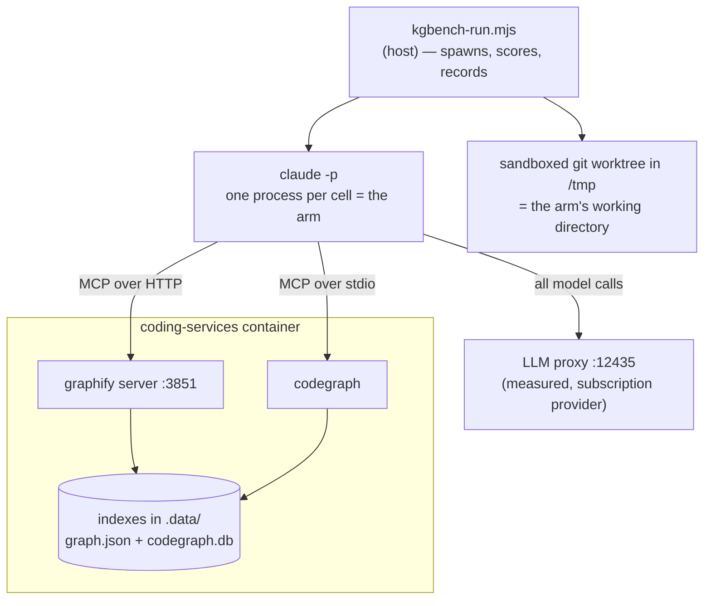

# Code-retrieval benchmark: `coding-v1`

**Does a code-graph backend earn its keep, compared to an agent that just greps?**

This repository maintains two code-graph backends — Graphify and CodeGraph — each of
which costs an index, a container service, and a rebuild step. This benchmark exists to
answer whether they buy anything a plain `grep` agent doesn't, using measurements rather
than intuition.

**Run:** `coding-v1-r6` · repo at `c31d07b02` · model `claude-sonnet-5` ·
16 questions × 4 arms × 3–10 reps = **304 runs**, 0 failures.
Supersedes `coding-v1-r5`, which had three contaminated rows — see
[What changed since r5](#what-changed-since-r5).
A3 and A4 were **rewritten and re-run** after the first pass showed they did not test
retrieval; see [Provenance](#provenance-of-these-numbers).

---

## Bottom line

| | grep | graphify | codegraph | **hybrid** |
|---|--:|--:|--:|--:|
| **Correctness** (median) | **1.00** | **1.00** | **1.00** | **1.00** |
| Content tokens per query | **73,536** | 106,420 | 177,217 | 81,216 |
| Latency per query | **17.1s** | 26.1s | 51.5s | 17.9s |
| Latency p90 | 33.9s | 63.8s | **143.9s** | **30.0s** |
| Cost per query | **$0.074** | $0.141 | $0.227 | $0.085 |
| Hard failures | 0 / 76 | 0 / 76 | 0 / 76 | 0 / 76 |
| Hallucinations | 0 | 0 | 0 | 0 |

**On this question set, neither graph backend buys measurable correctness, and both cost
1.4–2.4× the tokens, 1.5–3.0× the latency, and 1.9–3.1× the money.**

The `hybrid` arm is the one to read the others against, because it is the only one shaped
like production: it has *every* tool and chooses freely. It lands on grep's cost and
grep's correctness — because **it chooses grep**. Across 76 cells it made 348 tool calls,
of which **4 were graph queries** and **none were Graphify**. Given the index, the agent
declines to use it.

The hypothesis this set was designed to test — that a graph index answers *"that isn't
here"* better than grep — **did not reproduce**. All four arms abstained correctly on
every trap question.

Read this as a **null result on 16 questions**, not as proof that code graphs are
worthless. There is one real per-question difference: **CodeGraph scores 0.00 on A4**,
where every other arm scores 1.00, because that answer lives in configuration prose its
index does not carry. See [the architecture class](#the-architecture-class-where-corpus-scope-shows-up).

---

## How to read this — the setup in plain terms

### An "arm" is one way of answering

Every arm is the **same model, the same prompt, the same questions**. The only thing
that differs is which tools it may use. That isolates *retrieval strategy* as the single
variable.

| Arm | Tools | Represents |
|---|---|---|
| `grep` | `Glob`, `Grep`, `Read` | The baseline — what a coding agent does today with no extra infrastructure |
| `graphify` | `Read` + 6 Graphify MCP tools | Query a prebuilt code graph instead of searching text |
| `codegraph` | `Read` + 1 CodeGraph MCP tool | Same idea, SQLite/FTS5 backend |
| `hybrid` | `Glob`, `Grep`, `Read` + **all** backend tools | Production. Nothing is withheld; the agent picks its own strategy |

The first three arms are **forced** onto one strategy, which is not how an agent works.
That is deliberate — forcing is what isolates the variable — but it means none of them
answers the question a maintainer actually has, which is *"if I install this, am I better
off?"* Only `hybrid` answers that, and every other arm should be read against it.

### A "cell" is one complete agent session

One cell = one headless `claude -p` run: the agent reasons, calls tools, reads results,
and writes a final answer. Twelve questions ran at 3 reps (12 × 4 arms × 3 = 144) and the
four architecture questions at 10 (4 × 4 arms × 10 = 160), for **304 cells total**.

Cells run **strictly sequentially**. Running them in parallel would be ~4× faster but
would corrupt the latency and token measurements through CPU contention — and that is
not hypothetical, see [When the machine lied](#when-the-machine-lied).

### Where everything runs



The arm runs **on the host**, inside a throwaway copy of the repository. Its *tools*
reach into the container. Grading happens back on the host after the answer is written.

### The five question classes

Questions are grouped by *what kind of work answering them takes*. Every chart in this
report is broken down by these five groups, so it is worth knowing what they are:

| Class | n | The job |
|---|--:|---|
| `lookup` | 3 | Find one fact in one place |
| `structural` | 3 | Describe how pieces relate to each other |
| `blast` | 3 | Work out the consequences of a change |
| `arch` | 4 | Explain *why* the system is built a certain way — narrative that lives in no single file |
| `abstain` | 3 | **The answer is not here.** Saying so is the only correct response |

The `abstain` class is the interesting one, and the reason this set exists. Its questions
ask about things that were genuinely **removed** from this repo, or never existed. A stale
index answers them confidently and wrongly; grep comes up empty. That asymmetry is the most
decision-relevant thing a retrieval benchmark can surface, and correctness-only scoring
hides it completely.

### The questions

All sixteen, verbatim — this is the whole test. Every arm was asked every question, and
"correct" means the listed facts appear in the answer, checked mechanically rather than
by impression.

#### `lookup` — one fact, one place

| | Question | Correct requires |
|---|---|---|
| **L1** | Which file defines the shell variable `MANAGED_MCP_KEYS`, and what is its purpose? | names `install.sh`; explains it is the prune list for installer-owned MCP servers |
| **L2** | Which file implements the function `summaryStats`, and which module imports it for the retrieval benchmark? | `lib/experiments/compare.mjs` · *(bonus: notes kgbench has its own copy)* |
| **L3** | Which HTTP route does the system-health dashboard expose to trigger a code-graph re-index, and in which file is it registered? | `POST /api/cgr/reindex`; `server.js` |

#### `structural` — how pieces relate

| | Question | Correct requires |
|---|---|---|
| **S1** | In `config/code-graph.json` the active backend is resolved with a precedence order. List the three inputs in priority order, highest first. | `CODE_GRAPH_BACKEND` env var first; per-agent backend second; `active` third |
| **S2** | Under supervisord, which program serves the graphify MCP endpoint, what script does it run, and on which port? | program `graphify`; `graphify-serve.sh`; port `3851` |
| **S3** | Which backends does the code-graph registry currently define, and which transport does each use? | graphify over http; codegraph over stdio |

#### `blast` — consequences of a change

| | Question | Correct requires |
|---|---|---|
| **B1** | If the `mcp.tools` list for a backend in `config/code-graph.json` were changed, which parts of the system would be affected? Name the consumers. Also state explicitly whether MCP server registration is affected, and why. | kgbench's `allowedTools` derivation, via `allowedToolsFor()`; and that registration is **not** affected — the generated config carries servers, not tool lists *(bonus: the `allowed-tools` CLI, `validate()`)* |

> **B1 is a replacement.** Its predecessor required naming MCP config generation as an
> affected consumer. It is not one, and every arm said so. Retired for a false premise,
> like T2 — see [where the disagreements went](#where-the-disagreements-went).
| **B2** | A change makes the LLM proxy on port 12435 unreachable. Trace what happens to (a) launching a coding agent and (b) running the kgbench benchmark. | agent launch aborts fail-closed; kgbench also refuses to start · **must not** claim it silently falls back to direct provider calls |
| **B3** | The repo contains a tracked but empty directory `.codegraph/`. What breaks if it is deleted, and why can Docker not recreate it? | the container fails to start / the bind mount cannot attach; the parent is mounted read-only |

#### `arch` — narrative, not location *(run at 10 reps)*

| | Question | Correct requires |
|---|---|---|
| **A1** | Why is the `.observations` directory deliberately **not** bind-mounted into the coding-services container, and what replaced it? | SQLite WAL/SHM corruption from concurrent openers across the bind mount; the host obs-api is the single owner |
| **A2** | The kgbench benchmark measures "content tokens" rather than total tokens. What problem does that solve, and how is the value derived? | a large fixed floor (system prompt + tool schemas) dominates totals; derived by subtracting a measured empty-run baseline |
| **A3** | The code-graph registry deliberately leaves out two capabilities such a registry might be expected to have. Name both omissions, give the reason recorded for each, and say which component does the first one's job instead. | no way to select every backend at once; kgbench composes its own per-arm MCP configs instead; no query-type routing; because which backend suits which question is what the benchmark exists to measure |
| **A4** | CodeGraph's runtime and index configuration carries several deliberate constraints, each recorded with a reason. Identify them, explain what each prevents, and say what owns index freshness instead of CodeGraph itself. | daemon/watcher off for deterministic indexing; the reindex dispatcher owns freshness; `codegraph init` needs stdin closed or it hangs under supervisord *(bonus: telemetry off — the container is keyless)* |

> **A3 and A4 are replacements.** The originals asked why an API key is stripped and how
> stdio differs from HTTP on crash. Both were answerable from general knowledge, and in
> the first pass **70 of 160 architecture cells answered them with no tool call at all**.
> They measured the model, not the repository. The originals and the reasons for retiring
> them are kept in the question file's `_rewriteNote`.

#### `abstain` — the answer is not in this repository

The trap class. Each asks for something that does not exist; the **only** correct
response is to say so. A stale index answers confidently and wrongly.

| | Question | Correct requires |
|---|---|---|
| **T1** | Which file in this repository configures the Memgraph connection used by the code-graph backend? | say it does not exist · **must not** assert that some file configures Memgraph *(Memgraph was removed when graphify replaced code-graph-rag — stale references still litter the repo, which is the trap)* |
| **T3** | Which module implements the payment reconciliation service in this repository? | say it does not exist · **must not** assert a path for such a module *(a plausible-sounding subsystem that has never existed here)* |
| **T4** | In which file is the `CODEGRAPH_MAX_DEPTH` environment variable read? | say it does not exist · **must not** assert a file that reads it *(a plausible-sounding env var for a backend that does exist)* |

#### Retired: T2

> *What Cypher query does `runCypherQuery` execute to find callers of a symbol?*

Written as an abstain probe on the assumption the Cypher path was gone. **It is not.**
`runCypherQuery` still exists and still builds literal Cypher at
`integrations/mcp-server-semantic-analysis/src/services/cgr-query-cache.ts:233`. Arms that
produced the query were *right* and scored 0; the arm that abstained scored 1.

Retired for a **false premise**, not for scoring badly — dropping questions because
results look wrong is selection, and the distinction is recorded in the question file
itself. Its rows are excluded from every number in this report.

### How answers are scored

`score = required facts found ÷ required facts`, checked against a per-question
checklist of paths, symbols, and patterns. Any **forbidden** fact forces 0 and flags a
hallucination — a confidently wrong answer is worse than an incomplete one, because on
the receiving end that is the incident.

Every piece of ground truth is a `file:line` reference, machine-checked by
`scripts/kgbench-verify-questions.mjs`, so a rename can't silently rot the answer key.

### Why the arms can't cheat

The questions live in the repository the arms are asked to search. During piloting, the
grep arm answered a trap question by **reading the answer key** and scoring 1.00. A
leaked answer key produces *correct* answers, so it is invisible in the scores.

Arms therefore run against a **sandboxed git worktree** with 15 paths removed: the answer
key, the project's telemetry exports, session logs, agent instruction files, this
published report, and — added in this run — the **grading and containment modules
themselves**. Containment is then **verified** by grepping the tree for each question's
own prompt, and the run aborts if anything survives. It did abort, twice, during this
run's setup.

The last exclusion is the one worth explaining. `graders.mjs` and `sandbox.mjs` describe
what a right answer looks like and which subjects are traps, so an explanatory comment in
either is a crib — and that happened four times, three of them in comments written to
explain the *previous* leak. Neither file is any question's ground truth, so removing them
costs nothing and ends the category. Prose discipline had already failed; structure is
what holds.

A file-level exclusion is not sufficient on its own. Graphify indexes markdown headings as
graph nodes, so a document stripped from the tree can still reach the graph arms through
the index — `.graphifyignore` has to match. Details in
[`docs/measurement/kgbench.md`](../../measurement/kgbench.md).

---

## Results

### Correctness: a tie everywhere

<picture>
  <source media="(prefers-color-scheme: dark)" srcset="../../images/kgbench-correctness-dark.svg">
  
</picture>

Each group of four bars is one **question class**; the four bars within it are the
four **arms**, always in the same order.

| Class | Questions | n per arm | grep | graphify | codegraph | hybrid | verdict |
|---|---|--:|--:|--:|--:|--:|---|
| lookup | L1 L2 L3 | 9 | 1.00 | 1.00 | 1.00 | 1.00 | tie |
| structural | S1 S2 S3 | 9 | 1.00 | 1.00 | 1.00 | 1.00 | tie |
| blast | B1 B2 B3 | 9 | 1.00 | 1.00 | 1.00 | 1.00 | tie |
| arch | A1 A2 A3 A4 | 40 | 1.00 | 0.65 | 0.82 | 1.00 | tie (spreads overlap) |
| abstain | T1 T3 T4 | 9 | 1.00 | 1.00 | 1.00 | 1.00 | tie |

A class median can hide a bad question. `lookup` reads 1.00 for every arm, but **L2 sits
at 0.15 across all four** — every arm names kgbench's own `summaryStats` rather than the
`lib/experiments/compare.mjs` implementation the checklist wants. Three questions per
class means one weak question vanishes into the median. It did so in r5 too.

A winner is declared only at a **≥1.25× median gap with non-overlapping interquartile
range**. Anything weaker prints "tie", because at these sample sizes a 1.3× gap is not a
result — it's a coin landing the same way three times.

### Cost: not a tie

<picture>
  <source media="(prefers-color-scheme: dark)" srcset="../../images/kgbench-cost-dark.svg">
  
</picture>

**Content tokens** are total tokens minus each arm's measured empty-run baseline. That
matters: a large fixed floor of system prompt and tool schemas is charged on every call
regardless of strategy, and it compresses every ratio. Content tokens are what actually
separate retrieval strategies.

Graph queries pull **substantially larger payloads into context** than a targeted grep
does. That is the core cost finding, and it runs opposite to the usual intuition that an
index should be the cheaper path.

The `hybrid` bar is the one that matters: give the agent everything and it costs what
grep costs. The graph arms' extra tokens are not the price of *having* an index — they
are the price of being *forced* to use one.

---

## What the agent picks when nothing is withheld

`hybrid` had all ten tools: `Glob`, `Grep`, `Read`, six Graphify queries, and CodeGraph's
explore. Over 76 cells:

| Tool | Calls |
|---|--:|
| `Grep` | 195 |
| `Read` | 59 |
| `Glob` | 19 |
| `mcp__codegraph__codegraph_explore` | 3 |
| any Graphify tool | **0** |

Three graph calls out of 273, all on the same question (B1, "name the consumers of a
config field"), and Graphify never once. This is the single most decision-relevant number
here: **the infrastructure is available, free at the point of use, and declined.**

Two honest caveats. The tool *descriptions* are what the agent chooses from, so this
measures the appeal of the advertised interface as much as the index behind it — a
better-described graph tool might get picked more. And a preference is not a
justification: the agent could be choosing wrong. But it is not choosing wrong *and*
paying for it, because its correctness matches the forced-grep arm exactly.

The forced arms show the mirror image. Given only their backend, the graph arms still
went without it in **23 of 76 cells each** — they answered from the model's own knowledge
rather than querying, which is the next section.

---

## The architecture class: where corpus scope shows up

Rewriting A3 and A4 to require repository-specific facts changed this class from the
weakest part of the benchmark to the only place an arm actually separates.

**Zero-tool answers went from 70 of 160 cells to 0 of 160.** Every architecture cell now
does retrieval. Checklist-vs-judge disagreement across the whole run fell from 85 to 37,
almost all of that from A4 alone (35 → 3): the old question was not just non-retrieval,
it was badly specified. Fixing the judge's rubric and two matchers then took it to
**17** — see [where the disagreements went](#where-the-disagreements-went).

<picture>
  <source media="(prefers-color-scheme: dark)" srcset="../../images/kgbench-arch-spread-dark.svg">
  
</picture>

| Question | grep | graphify | codegraph | hybrid |
|---|--:|--:|--:|--:|
| A1 — why `.observations` is not bind-mounted | 1.00 | 0.65 | 1.00 | 1.00 |
| A2 — why "content tokens" rather than total | 1.00 | 1.00 | 1.00 | 1.00 |
| A3 — the registry's two deliberate omissions | 1.00 | 1.00 | 1.00 | 1.00 |
| A4 — why CodeGraph's runtime is constrained | 1.00 | 1.00 | **0.00** | 1.00 |

**CodeGraph scores 0.00 on A4, ten times out of ten** — and it is not a grading artifact.
The deterministic checklist and the independent LLM judge agree exactly: 0 from both, on
all ten reps. It also made *more* tool calls than any other arm on that question (median
12), so it is not a case of not trying.

The reason is corpus scope, and it is the most useful finding in this run. A4's answer
lives in prose inside a JSON config — the `_envNote` and `_indexNote` keys of
`config/code-graph.json`. CodeGraph indexes **code entities** into SQLite/FTS5; comment
strings in a config file are not code entities, so its index cannot reach them. Rather
than find nothing and say so, the arm answered from the one source it did have — its own
MCP tool description — and produced a fluent, confident, wrong account of constraints
that are not this repository's.

That is worth stating plainly: **the failure mode of a too-narrow index is not an empty
result, it is a confident answer from whatever else is in context.** Graphify, which
indexes documents as well as code, scores 1.00 here. Grep, which has no index at all and
just reads the file, also scores 1.00.

Note the reverse case in the same class: graphify scores 0.65 on A1, where CodeGraph
scores 1.00. Neither backend dominates. The class median stays 1.00 for all four arms, so
the automatic winner check still prints "tie" — correctly, because these are single
questions, not a class-level effect.

---

## Reliability

| Arm | runs | completed | failed | retry rate |
|---|--:|--:|--:|--:|
| grep | 76 | 76 | 0 | 0% |
| graphify | 76 | 76 | 0 | 0% |
| codegraph | 76 | 76 | 0 | 0% |
| hybrid | 76 | 76 | 0 | 0% |

No stalls, no timeouts, no tool escapes, no contamination. In the earlier
[graphify-vs-grep](../graphify-vs-grep/) run the graph arm had a 7% hard-fail rate from
MCP stalls; that did not recur here.

Latency tails differ even more than medians: p90 is 34s for grep, **30s for hybrid**, 64s
for graphify, and **144s for codegraph**. Medians understate what the stdio backend costs
when it is slow, and the arm with every tool available has the *tightest* tail of all.

---

## What this does not show

- **One repository, one model, one grader.** Everything here is `claude-sonnet-5` on this
  codebase. Nothing generalises to other repos or models without re-running.
- **`hybrid` measures a preference, not a verdict.** It shows what this model picks from
  these tool descriptions. A graph tool described differently, or a task shaped
  differently, could be picked more often. It does not show that the graph is useless —
  it shows it is unchosen.
- **Indexing cost is excluded.** Per-query numbers ignore what it costs to build and
  keep the indexes fresh. That is a real expense on the graph side and it is not counted
  here — so the graph backends look *better* than their true total cost.
- **16 questions is small**, and `arch` is only 4. A null result at this size means "no
  effect detected", not "no effect exists".
- **17 disagreements remain**, concentrated in A1 (6), B2 (3) and A4 (3). By this
  report's own rule they are the next candidates to examine, though at 3–6 cells each
  they may be ordinary judge variance rather than defects.
- **L2 scores 0.15 for every arm** and is masked by its class median: every arm names
  kgbench's own `summaryStats` rather than the implementation the checklist wants. A
  question defect, left in rather than dropped after the fact.
- **The A4 result is one question.** "CodeGraph cannot reach prose in a config file" is a
  real mechanism, but it is demonstrated by a single question at 10 reps, not by a class.
- **The abstain class may be guessable.** One answer concluded the question was a probe
  purely from finding nothing. Correct, and honestly reached — but a trap inferable from
  its phrasing measures something narrower than retrieval.
- **T2 was retired mid-run.** Its premise was false — it asserted `runCypherQuery` no
  longer exists, but it does, as a shim at `cgr-query-cache.ts:233`. Arms that produced
  the query were *right* and scored 0. Retired for a false premise, not for scoring
  badly; the distinction is recorded in the question itself.
- **Indexes are built from the real repo, not the sandbox.** The run tree strips
  benchmark-meta files, but the graph index is built from the working repository, so the
  two corpora are not identical. `.graphifyignore` now excludes the published report for
  this reason; the residual difference is untested.

---

## Where the disagreements went

The checklist and the LLM judge disagreed on 85 of 304 cells in the first pass. That is
the report's own alarm for "the question is the problem" — and chasing it found three
defects, none of which was a bad question.

| | disagreements | what changed |
|---|--:|---|
| first pass | 85 | — |
| after rewriting A3/A4 | 37 | two questions that tested priors, not retrieval |
| after fixing the judge | **17** | the judge was grading optional facts as required |

**The judge was shown a different rubric from the grader.** Its prompt listed every
checklist item under one "REQUIRED FACTS" heading regardless of the item's `must` flag,
so it marked answers down for omitting a *bonus*. B3 produced this on 10 of 12 cells,
each time naming the one fact the deterministic grader treats as optional. Seven of the
sixteen questions carry an optional fact, and six of those seven were in the disagreement
list. The prompt now separates required from optional and states the same scoring rule
`gradeChecklist` implements.

**B1's answer key was wrong, and every arm had been telling us so.** Its required fact
claimed that changing `mcp.tools` affects MCP config generation. It does not:
`generate-docker-mcp-config.sh` never reads the tools list, and `mcpServerMapFor` returns
a server entry — a command or url, no tools. The only consumers are `allowedToolsFor()`
and its two callers. The arms worked this out, said so, and were penalised by the judge
for "contradicting f1" while the checklist handed them the point anyway, because its
matcher accepted the substring `mcp config` *inside a sentence denying it*. Same
false-premise category as retired T2; rewritten so the distinction is the point.

**Two matcher-precision bugs, both of which cost correct answers.** The replacement fact
missed `## Is MCP server registration affected? No.` — the most direct phrasing available
— and separately missed `registration is **not** affected`, where markdown bold split the
phrase. Matchers now strip `*` and backticks before comparing, on every branch, so
`any-of` and `near` cannot disagree about the same answer over decoration. Underscores are
left alone: they are load-bearing in `CODEGRAPH_MAX_DEPTH` and `ANTHROPIC_BASE_URL`.

B1 and B3 now sit at 0 disagreements out of 12 each, both at a 1.00 median for all four
arms. One B1 cell still scores 0.82 — it genuinely never addresses registration.

---

## Provenance of these numbers

Not every cell in this run comes from one pass, and the report should say so rather than
imply a single sitting.

| Cells | Questions | Tree commit | When |
|---|---|---|---|
| 212 | the 13 unchanged questions | `a54b1af78` | first pass |
| 80 | A3, A4 (rewritten) | `c31d07b02` | re-run after the rewrite |
| 12 | B1 (rewritten) | `fcfedffaa` | re-run after its key was corrected |

The 80 replaced cells were re-run because the questions changed, not because their
results were unwelcome — the originals scored *well* on the arms; they simply were not
measuring retrieval. Splicing is legitimate here only if the two tree states are
equivalent for the questions involved, so that was checked rather than assumed:

- Nine tree-visible files differ between the two commits: six figure SVGs and three
  report/chart renderers.
- **None is A3 or A4 evidence.** Their ground truth — `config/code-graph.json`,
  `config/kgbench/arms.json`, `docker/supervisord.conf` — is byte-identical across both.
- The one changed file any question depends on is `lib/kgbench/report.mjs` (L2's
  evidence), and the change is a rendering line; `summaryStats` and its imports are
  untouched, and L2 was not re-run.

B3 was **not** re-run: its question is unchanged, and only the judge's view of it was
wrong. Six questions were re-*judged* against the corrected rubric — the stored answers
were re-scored, not regenerated — which is why `regrade.json` records 43 judge scores
moving with no cell re-executed.

The question set itself is excluded from the run tree, so rewriting questions does not
change what the arms can search. Full per-pass provenance is in the run manifest's
`history` block, and every score that a grader or judge fix moved is in `regrade.json`,
with the prior scores in `results.pre-regrade.jsonl`.

---

## What changed since r5

r5 measured three arms and reported a clean sweep: every arm 1.00 on every class,
0 hallucinations, 0 contamination. Two of those claims were wrong.

| | r5 | r6 |
|---|---|---|
| Arms | 3 | 4 (adds `hybrid`) |
| Cells | 228 | 304 |
| Contaminated rows | reported 0 | **3 in r5**, found later; 0 in r6 |
| grep content tokens | 57,427 | 73,536 |
| graphify content tokens | 161,681 | 106,420 |
| codegraph content tokens | 99,747 | 177,217 |
| Arch cells answered with no tool call | not measured | **0 / 160** |
| Checklist-vs-judge disagreements | not reported | **17** (85 → 37 after the A3/A4 rewrite → 17 after the judge fix) |

**r5's abstain result was contaminated for grep on T3.** All three of its T3 reps cite
`lib/kgbench/graders.mjs`, where a comment of mine named the trap's subject; one reports
the probe as a probe. They scored 1.00 as clean abstentions and no signal caught them.
Re-scanning r5 with r6's detectors flags exactly those three rows and no others. The graph
arms had no `Grep` and abstained without the crib.

With the cribs removed, grep still abstains correctly on all three traps. **Removing the
contamination did not change the abstain conclusion** — it changed how much that
conclusion is worth, since one arm had been getting there partly by reading.

The token numbers moved substantially, and in both directions, so r5-vs-r6 deltas should
not be read as either backend improving. Three things changed at once: the indexes were
rebuilt, the tree changed, and — the largest effect — A3 and A4 stopped being answerable
without tools. Two questions that previously cost almost nothing now cost a real search
for every arm, which lifts every arm's median. **A per-query token cost is a property of
the question set at least as much as of the backend**, which is worth remembering before
quoting any single number from this page out of context.

r5's raw results remain in `.data/kgbench/runs/coding-v1-r5/` for comparison.

---

## What went wrong building this

Seven runs were started and five discarded, and fourteen defects were found. Every discard came from a defect that would
have produced a **plausible, publishable, wrong** result. They are documented because the
failure modes generalise to any agent benchmark.

| # | Defect | Why it mattered |
|---|---|---|
| 1 | **Arms were never isolated.** `--allowedTools` is a permission-*prompt* allowlist; `--dangerously-skip-permissions` skips consulting it. Every arm silently had the full toolset — the "grep" arm called `Bash` 59 times, the graphify arm called it 27 times and used *zero* graph tools. | The arms were the same agent wearing different labels. This also explains the predecessor run where both arms scored 1.00 on everything and "could not be told apart". |
| 2 | **The answer key was searchable.** An arm scored 1.00 by quoting a trap question's own provenance note. Telemetry exports leaked whole prompts too, because this project records the sessions in which its own benchmark was written. | A leaked answer key produces *correct* answers. It is invisible in the scores. |
| 3 | **13 of 17 questions were never graded.** Questions declare their checklist at the top level; the runner passed only `q.grader`, so they scored `null`. All four abstain questions had their fabrication check switched off entirely. | The one class built to detect fabrication could not detect fabrication. |
| 4 | **Correct abstentions were scored as hallucinations.** Forbidden-fact patterns encoded the *shape* of a path rather than the *claim*. | Produced a fake headline: "grep hallucinates 8%, graphify 0%". |
| 5 | **The host lied about latency.** Corporate AV saturated the machine; a 300s timer fired after 950s, and three cells were recorded as arm timeouts. | Blames the arm for the machine. Now detected as `host_stalled` and excluded rather than scored. |
| 6 | **The hybrid arm could not have worked as declared.** It granted every backend's tools while configuring one backend's server. Under `--strict-mcp-config` the unconfigured server's tools are *absent*, not refused — no error, no tool-escape flag. | It would have run as grep+graphify under a label saying grep+graphify+codegraph, and filled a published column with numbers for a strategy nobody ran. Now a startup error. |
| 7 | **Comments in the grader were cribs.** Two illustrative examples in `graders.mjs` quoted real trap subjects. In r5 the grep arm grepped one and scored a perfect abstention off it — three rows, undetected. | Four leaks now, three of them comments explaining the previous leak. Fixed structurally: the grading and containment modules are stripped from the run tree, since no question cites them. |
| 8 | **Publishing the questions contaminated the next run.** The r5 report lists every prompt, and Graphify indexes markdown *headings* as graph nodes — including one naming the abstain class as the-answer-is-not-here. | A file-level exclusion would have held for grep and leaked for the graph arms. `.graphifyignore` now excludes the report too. |
| 9 | **My own contamination signals voided two correct answers.** A signal added to catch defect 7 fired on an answer that merely listed the file among grep hits, and a probe-detector fired on an arm that *inferred* a trap from finding nothing. | A voided correct answer biases the result exactly as much as a scored wrong one, and hides better — a missing row reads as caution. Signals are now split: citing a source voids, suspecting does not. |
| 10 | **Two questions measured the model, not the repository.** A3 and A4 were answerable from general knowledge; 70 of 160 architecture cells answered them with no tool call at all, and A4 additionally disagreed with the judge on 35 of 40. | A benchmark class that requires no retrieval cannot distinguish retrieval strategies, and it dilutes every arm equally — which *looks* like a tie. Rewritten to need facts recorded only in this repo; zero-tool cells went to 0/160 and disagreements 85 → 37. |
| 11 | **The judge graded optional facts as required.** Its prompt listed every checklist item under one "REQUIRED FACTS" heading regardless of the `must` flag. | It marked answers down for omitting a *bonus*, on all seven questions carrying one — manufacturing 10-of-12 disagreements on B3 and sending me looking for a bad question that did not exist. The two graders must be shown the same rubric or their disagreement measures the rubric, not the answer. |
| 12 | **A question's answer key asserted a consumer that does not exist.** B1 required naming MCP config generation as affected by `mcp.tools`; it is not. | Every arm got it right, was penalised by the judge for "contradicting" the key, and was handed the point anyway by a matcher that accepted the phrase inside a sentence denying it. Two graders cancelling out a wrong key is the worst case: the error is invisible in the score. |
| 13 | **Matchers could not read markdown.** `registration is **not** affected` failed a pattern for `is not affected` on the asterisks alone. | The fourth matcher-precision defect here, and like the other three it destroyed a *correct* answer. Fixed once for every matcher by stripping emphasis before comparing, rather than widening one regex per phrasing. |
| 14 | **Long runs were being killed silently.** Two attempts were terminated part-way with no error and nothing in any project log. | Diagnosed, not guessed: the runner cleans up its worktree on SIGINT/SIGTERM but would *leak* it on SIGKILL, and no worktree leaked — so it caught a signal and exited through its own handler. The health coordinator logged only network polling; no project sweeper matches the runner's command line; memory was 48% free with no jetsam. Both deaths were runs tracked by a task manager, while the same workload detached ran on untouched. `scripts/kgbench-supervise.sh` now detaches and resumes on signal deaths only. |

Defects 1–5 all pointed the **same direction** — flattering the graph arms, penalising
grep. Defects 7 and 9 point the other way: 7 handed the *baseline* a free abstention, and
9 deleted correct answers from whichever arm produced them. Defect 10 flattered nobody and
hid everybody, by making a quarter of the matrix measure something other than retrieval.
The lesson is not "the graph arms were flattered", it is that **every measurement defect
found here was invisible in the output it produced.** Each one yielded a clean-looking
table.

Most were found by instrumentation rather than by reading results: the tool-surface check,
the containment scan, the orphaned-MCP-server guard, and above all the grader's own
disagreement counter, which is what exposed defects 11, 12 and 13. That counter earns its
keep — but note what it took to use it. It said "B1 and B3 are bad questions". Both were
fine; the alarm was pointing at the rubric, the key, and a regex. **A disagreement
detector tells you two graders differ, not which one is wrong**, and every time here the
answer was neither the obvious one nor the same one twice.

### A note on tuning the grader after seeing results

Three scoring fixes in this run changed rows that had already been graded, which is
exactly the shape of a result being massaged. What makes it defensible, and how to check:

- Every change was validated against **fabrication fixtures** that must still be caught,
  not just against the rows it fixed.
- Every change was applied by re-grading **all 304 cells uniformly**, never one arm.
- The full diff is committed: `results.pre-regrade.jsonl` holds the original scores and
  `regrade.json` lists every row that moved. Three rows moved, all of them correct
  answers that had been marked wrong.

### When the machine lied

Worth its own note, because it is easy to miss. Node timers cannot fire early, so a 300s
timeout completing at 950s is proof the process was starved, not that the work was slow.
Recorded naively, that becomes `hard_fail_rate` — a permanent, published claim that an
arm cannot answer a class of question, caused entirely by an antivirus scan.

---

## Reproduce it

```bash
# check every arm is available (fails loudly if an index or the proxy is missing)
node scripts/kgbench-run.mjs --set coding-v1 --preflight-only

# the full matrix, detached and self-resuming — USE THIS for anything long
scripts/kgbench-supervise.sh --run-id my-run --set coding-v1 --reps 3 \
                             --deepen A1,A2,A3,A4 --deepen-reps 10

# progress / outcome
cat .data/kgbench/runs/my-run/supervise.status
wc -l .data/kgbench/runs/my-run/results.jsonl

# re-apply a fixed grader to stored answers, without re-running the matrix
node scripts/kgbench-regrade.mjs --run my-run --dry-run

# render the machine report and the figures
node scripts/kgbench-report.mjs --run my-run --out /tmp/report.md
node scripts/kgbench-charts.mjs --run my-run --out docs/images
```

Note that `kgbench-report.mjs --out` **overwrites** its target with the generated report.
This page is hand-written around those numbers, so render it elsewhere and copy what you
need — or you will replace this file with the machine version.

Full answers are stored, so a fixed grader can be **re-applied offline** instead of
re-running the matrix — which is how the false hallucination flags above were corrected
without spending another model call.

## Files

| Path | What |
|---|---|
| `config/kgbench/questions/coding-v1.json` | The questions, checklists, and `file:line` ground truth |
| `config/kgbench/arms.json` | Arm definitions — the tool surface each one gets |
| `lib/kgbench/sandbox.mjs` | The sandboxed run tree and containment verification |
| `lib/kgbench/graders.mjs` | Deterministic scoring; pure, so answers can be re-graded offline |
| `lib/kgbench/runner.mjs` | Cell execution, tool-surface enforcement, host-stall detection |
| `scripts/kgbench-charts.mjs` | Regenerates the figures on this page from `results.jsonl` |
| `scripts/kgbench-supervise.sh` | Detached, self-resuming runner — survives a signalled process group |
| `lib/kgbench/judge.mjs` | The second scorer. Excluded from the run tree: its prompt states what a right answer contains |
| `scripts/kgbench-regrade.mjs` | Re-applies fixed graders to stored answers, without re-running cells |
| `.data/kgbench/runs/coding-v1-r6/` | Raw results, run manifest, and `regrade.json` (every score that moved) |
| [`docs/measurement/kgbench.md`](../../measurement/kgbench.md) | Operator guide — prerequisites, containment, scoring |
