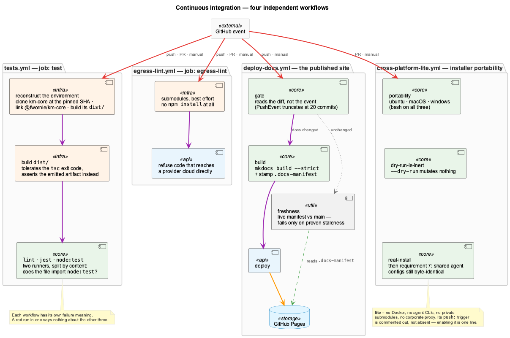

# Continuous Integration

Four GitHub Actions workflows guard this repository. They are independent — each
has its own triggers and its own failure meaning — and between them they cover
the test suite, the egress policy, the published documentation, and the
installer's portability.



All four run on GitHub-hosted `ubuntu-latest` runners except where a job
explicitly asks for macOS or Windows. None of them has access to Docker, the
agent CLIs, the private `integrations/*` submodules, or a corporate proxy; what
that costs, and where those gaps are covered instead, is set out under
[Cross-platform](#cross-platform-installer-portability) below.

| Workflow | File | Triggers | Proves |
|---|---|---|---|
| **tests** | `tests.yml` | push to `main`, every PR, manual | The whole suite passes — lint, jest, and `node:test` |
| **Egress Lint** | `egress-lint.yml` | push to `main`, every PR, manual | No new code dials a provider cloud directly |
| **Deploy Documentation** | `deploy-docs.yml` | push to `main`, manual | The published site matches `main` |
| **Cross-platform** | `cross-platform-lite.yml` | every PR, manual | The installer works on Linux, macOS and Windows |

Only `cross-platform-lite` skips pushes to `main` — it is PR-and-dispatch only,
with the `push:` trigger commented out in the file rather than absent, so
enabling it is a one-line change.

---

## tests — the suite

The gate that matters most, and the one that runs on every push to `main`.

### Two runners, and why the split is by content

The repository has two test systems, and a file belongs to exactly one:

| Runner | Owns | Invoked by |
|---|---|---|
| **jest** | `**/test/**/*.test.js`, `**/tests/**/*.test.js` | `npm run test:jest` |
| **node:test** | Any file that imports `node:test` | `npm run test:node` |

`scripts/lib/test-inventory.mjs` is the single source of truth for that
ownership, and it classifies **by content — does the file import `node:test`?**
— not by filename. A naming convention would need a second check to enforce it;
the import is the fact that actually decides which runner can execute the file.
Most `node:test` suites are `.test.mjs`, which jest's `testMatch` never collects
at all, so a misfiled suite would be invisible rather than failing.

`node:test` suites are not confined to `tests/`. The inventory walks `tests`,
`test`, `src`, `scripts` and `lib/lsl`, because assertions live in
`src/live-logging` and `scripts/` too.

The workflow runs the two halves as **separate steps**, so the summary says
which one failed, and `node:test` carries `if: ${{ !cancelled() }}` so it runs
even when jest is red. Chaining them would hide the second result for as long as
the first was broken.

Locally, `npm test` runs both.

### Reconstructing the environment

Four setup steps are load-bearing. Each exists because its absence was
reproduced in a `linux/amd64` container, and skipping any one of them fails
tests in a way that looks unrelated to the missing piece.

**1. Clone `lib/km-core` explicitly.** It is a submodule pinned by an SSH URL.
The job checks out with `submodules: false` — `submodules: true` would fail on
the private `integrations/*` submodules, which the tests do not need — then
clones km-core over HTTPS at exactly the SHA the superproject points at, read
from the gitlink with `git ls-tree`. Testing against the pinned SHA is the point:
CI runs the same km-core the developer has.

**2. Recreate the `@fwornle/km-core` symlink.** It is hand-made and appears in no
`package.json`, so `npm ci` neither creates nor restores it. Without it, thirteen
suites die instantly with `ERR_MODULE_NOT_FOUND`. This is the same wiring that
breaks on a developer machine whenever `node_modules` is wiped or pruned.

**3. Build km-core.** Its `dist/` is gitignored, so a fresh clone has no built
km-core at all and nothing can import it until `npm run build` has run there.

**4. Build this repo's `dist/`.** Also gitignored. Skipping it costs roughly
sixty failures on `Could not locate module ../../dist/embedding/embedding-service.js`.

### The build step tolerates type errors, and verifies the emit instead

`npm run build` is `tsc -p tsconfig.json`. It exits 2 on a handful of
pre-existing type errors in `src/ontology/` — but `noEmitOnError` is off, so it
**still emits**, and the emitted `dist/` is what the tests import.

Failing the job on that exit code would block the suite on type debt unrelated
to it, so the step tolerates the non-zero exit and asserts the artifact directly:

```bash
npm run build || echo "tsc reported type errors — emit continues (no noEmitOnError)"
test -f dist/embedding/embedding-service.js || exit 1
```

This has a consequence when reading a red run: those `src/ontology/*.ts`
annotations appear on **every** run, green or red. They are never the reason a
run failed. See [Reading a red run](#reading-a-red-run).

### Dependencies the tests need that the source does not

`npm ci` at the root must supply everything any suite needs at import time, even
when the code under test lives elsewhere.

The clearest case is `esbuild`. Several `node:test` suites exercise the
dashboard's routing modules — `integrations/system-health-dashboard/src/components/llm-routing/*.ts`
— which exist only as TypeScript, and node's ESM loader does not read TypeScript.
The suites transpile them at import time through `tests/helpers/dashboard-ts.mjs`.

`system-health-dashboard` is a plain directory rather than a submodule, so its
`src/` **is** present on the runner — but its `node_modules/` is gitignored and
nothing installs it there. Resolving a transpiler out of that directory
therefore works on a developer machine and fails on the runner. `esbuild` is a
**root devDependency** for exactly this reason, so plain `require('esbuild')`
resolves after `npm ci`; the helper falls back to the dashboard's own copy only
for a partially-installed checkout.

Those suites load their modules with **top-level `await`**, deliberately. With
`describe`, a root-level async `before` hook does not gate the suites in this
node version: every test reports `cancelled`, which the runner counts as neither
pass nor fail, so the file goes **green while executing nothing**. An import the
module graph itself waits on cannot do that. Do not convert one to a hook.

### What does not run on a runner

Two lists in `scripts/lib/test-inventory.mjs`, with different meanings:

- **`EXCLUDED`** — never run by `npm test`, anywhere. Currently
  `lib/knowledge-api` (a self-contained package with its own toolchain and its
  own `npm test`) and one deliberate RED stub whose header says it fails by
  design until named plans land.
- **`CI_SKIPPED`** — skipped **only when `process.env.CI` is set**. Locally every
  one of these still runs, because locally every one of them passes.

A suite belongs in `CI_SKIPPED` only when the thing it needs cannot exist on a
hosted runner: macOS-only tooling, a live `obs-api`, gitignored local run
artifacts, or the sibling `_work/rapid-llm-proxy` repository. It is explicitly
not a way to quieten a failing test — entries once parked there as
"not root-caused" turned out to be portability bugs in the tests and were fixed
rather than skipped.

Every entry carries the reason it was verified against, and **both runners print
their skip and exclusion lists on every run**, so a skip stays visible rather
than looking like a test that does not exist.

### Reproducing a failure locally

Set `CI=true` — that alone activates `CI_SKIPPED` and matches what the runner
executes:

```bash
CI=true npm run test:node
CI=true npm run test:jest
npm run lint
```

For failures that only appear on the runner, the missing piece is usually an
uninstalled directory rather than the platform. Move it aside and re-run:

```bash
mv integrations/system-health-dashboard/node_modules{,.hidden}
CI=true npm run test:node
mv integrations/system-health-dashboard/node_modules{.hidden,}
```

---

## Egress Lint

Fails the build when new code constructs a direct provider-cloud client — a
`new OpenAI(` / `new Anthropic(` without a `baseURL` — or a new in-process
`LLMService` outside the ratcheted allowlist. All LLM traffic is meant to reach
a provider through the local proxy, and this is the check that keeps it that way.

The scanner is `scripts/lint-egress.mjs` and it needs **no npm install at all**;
it runs straight from the checkout.

Submodules are initialised **best-effort**: the job rewrites the SSH pins to
HTTPS, then initialises each one individually, and a pin that cannot be reached —
a local-only commit, a private repo — downgrades to a `::warning::` rather than
failing the lint. The scanner reports which roots it actually covered, so partial
coverage is stated rather than assumed.

Sanctioned exceptions live in `config/egress-lint-allowlist.json` and are
reviewed through the diff.

---

## Deploy Documentation

Publishes the MkDocs site to GitHub Pages. Four jobs, and the interesting part
is that two of them exist to catch the other two being wrong.

| Job | Runs when | Does |
|---|---|---|
| `gate` | always | Decides whether this push touched anything the site renders |
| `build` | `gate` said yes | `mkdocs build --strict`, stamps a manifest, uploads the artifact |
| `freshness` | `gate` said no, on a push | Asks the **live site** whether it is still current |
| `deploy` | `gate` said yes | Publishes to Pages |

### The gate reads the diff, not the event

`gate` compares `github.event.before..HEAD` with `git diff` rather than using a
top-level `paths:` filter. GitHub truncates the `PushEvent` commits array at 20
commits, so a larger push — a multi-day local backlog — cannot match a path
filter and silently skips the workflow. A `workflow_dispatch` always builds.

The pattern it matches covers `docs/`, `docs-content/`, `mkdocs.yml` and the
workflow file itself. **`docs/` is not redundant with `docs-content/`**: several
files under `docs-content/` are symlinks into `docs/`, and updating one changes
the symlink's *target*, not the symlink, so `git diff --name-only` reports only
the `docs/` path.

### `freshness` — the guard for a wrong gate

A gate that skips is normal; most pushes are code-only and must not rebuild. What
is not normal is a gate skipping while the site is stale — and that failure is
invisible by construction, because `build: skipped` reports the whole run as
**success**.

So rather than trusting the pattern, `freshness` checks the invariant directly:
the content hash of everything mkdocs renders, symlinks resolved
(`scripts/docs-manifest.sh`), must equal the hash the live site is serving from
`/.docs-manifest`. It is independent of the gate's pattern by design.

It is **asymmetric on purpose**: it fails only on positive evidence of staleness,
a hash mismatch. If the manifest cannot be fetched — Pages not yet live, a
network blip — it warns and passes. A guard that goes red on its own
infrastructure gets disabled, and then protects nothing.

When it fails it names the fix: publish now with
`gh workflow run deploy-docs.yml --ref main`, then widen the gate's pattern —
preferring a whole source directory over an enumeration, since an enumeration has
to be maintained and forgetting to extend it fails exactly this silently.

---

## Cross-platform (installer portability)

Runs on every pull request and on manual dispatch.

| Job | Runs on | Proves |
|---|---|---|
| `portability` | ubuntu, macOS, Windows (Git Bash) | Every tracked `*.sh` is valid bash; `install.sh` detects the OS; `--ci` gates warn-and-continue instead of aborting; `test-coding.sh --ci` exits 0 |
| `dry-run-is-inert` | ubuntu | `install.sh --ci --dry-run` exits 0 and mutates **nothing** — neither the working tree nor `$HOME` |
| `real-install` | ubuntu | A real `./install.sh --ci` completes, `bin/coding --help` works, and shared agent configs are byte-identical afterwards |

`real-install` is the job that catches what sourcing cannot. Before it existed,
CI only *sourced* `install.sh` and called `detect_platform` /
`check_dependencies` / `detect_agents`, leaving `install_node_dependencies`
unreachable on every OS — the npm and proxy paths were never executed anywhere.
Sourcing also leaves `set -euo pipefail` inactive, so it tested different shell
semantics than a real run.

### What "lite" means

| Proven here | Not proven here |
|---|---|
| Shell portability across three OSes | A full working service stack |
| OS detection | Docker image builds |
| Unattended gates warn-and-continue | Agent CLI auth (claude / gh copilot) |
| A real install completes on Linux | Private submodules |
| A default install leaves `$HOME` untouched | Behaviour behind a corporate proxy |

### Architecture coverage is split deliberately

GitHub's hosted runners are **amd64**, so `real-install` exercises the
`tokenizers-linux-x64-gnu` path natively. `scripts/test-install-linux.sh` builds
for the **host** architecture, so on an Apple Silicon machine it exercises
`tokenizers-linux-arm64-gnu` instead. Between them both Linux architectures are
covered, but neither covers both alone — a green local run is not evidence about
amd64. Pass `--amd64` / `--arm64` to pin one explicitly.

Two gaps are covered off-CI rather than here:

- **Corporate-proxy behaviour** — `scripts/test-install-linux.sh` runs a real
  `./install.sh` in an Ubuntu 24.04 container across three network shapes
  (direct; proxy-only via a squid sidecar with egress blocked; no-egress), plus
  an `arch` shape for the platform-specific fastembed tokenizer. It runs from a
  developer machine, including macOS.
- **Full stack** — register self-hosted runners with Docker, an authenticated
  agent CLI and submodule access, then run `install.sh --yes` followed by
  `scripts/test-coding.sh`.

### Unattended flags

Used by CI, usable by any automation:

- `install.sh --ci` (or `CI=true`) — non-interactive; declines optional system
  changes; downgrades missing Docker / agent CLI / core-dep gates from fatal to
  warnings so a portability run completes with a summary.
- `install.sh --yes` (or `CODING_INSTALL_YES=1`) — non-interactive; auto-approves
  system changes; keeps hard requirements hard. Does **not** extend to agent
  scope or background services, which need `CODING_INSTALL_GLOBAL_AGENTS=1` /
  `CODING_INSTALL_SYSTEM_SERVICES=1`. The full mutation surface is catalogued in
  `docs/install-scope-and-host-impact.md`.
- `install.sh --dry-run` — prints the mutation manifest and exits 0, touching
  nothing at all, not even the install log.
- `test-coding.sh --ci` (or `CI=true`) — runs every check but records unsatisfied
  ones as non-fatal `[CI-SKIP]`, so a healthy headless runner is not marked
  failed. The requirement-7 check is deliberately exempt: a global write is a
  real regression, not an unsatisfied precondition, so it fails hard even under
  `--ci`.

---

## Reading a red run

**Start from the failing step, not the annotations.** The Actions summary lists
annotations from the whole run, and in `tests` the `src/ontology/*.ts` type
errors are present on every run including green ones — they come from the build
step that tolerates them by design. Open the job and find which step is red:

```bash
gh run view <run-id> --repo fwornle/coding --json jobs | python3 -c "
import sys,json
for j in json.load(sys.stdin)['jobs']:
    for s in j['steps']: print(s['conclusion'], s['name'])"
```

**A `node:test` file that fails with no subtests did not run.** A file-level
`not ok` with `failureType: 'testCodeFailure'`, no nested results and a duration
of a few tens of milliseconds is a crash during module evaluation — a failed
import, not a failed assertion. Look at what the file imports at top level, and
at whether that thing exists on a runner.

**A suite reporting `cancelled` also did not run.** Cancelled counts as neither
pass nor fail, so a file can report it for every test and still let the run go
green. This is what a root-level async `before` hook does to a `describe` suite;
see [Dependencies the tests need](#dependencies-the-tests-need-that-the-source-does-not).

**A green `deploy-docs` run does not mean the site was rebuilt.** `gate` skipping
leaves `build` and `deploy` as `skipped` and the run as success. The `freshness`
job is what turns a wrong skip into a red run — if it warned instead of checking,
the site's freshness is unverified rather than confirmed.
