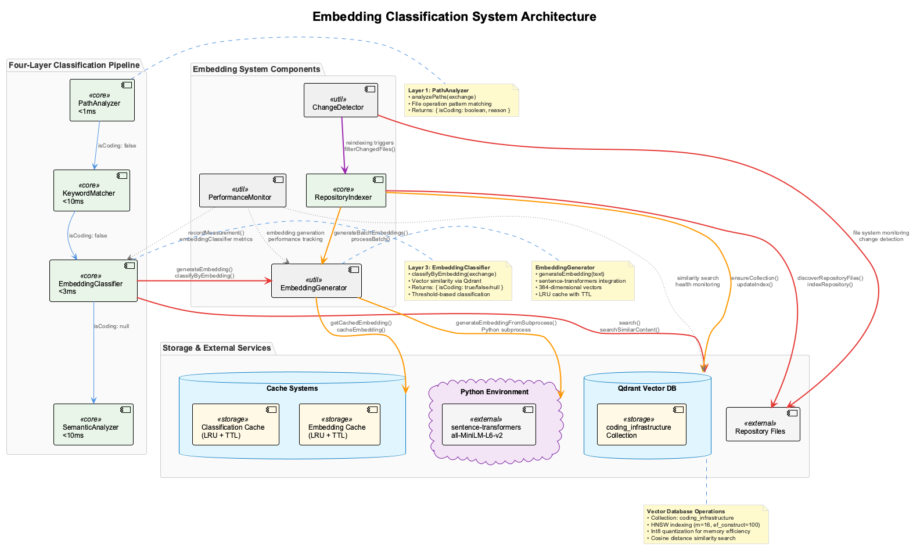
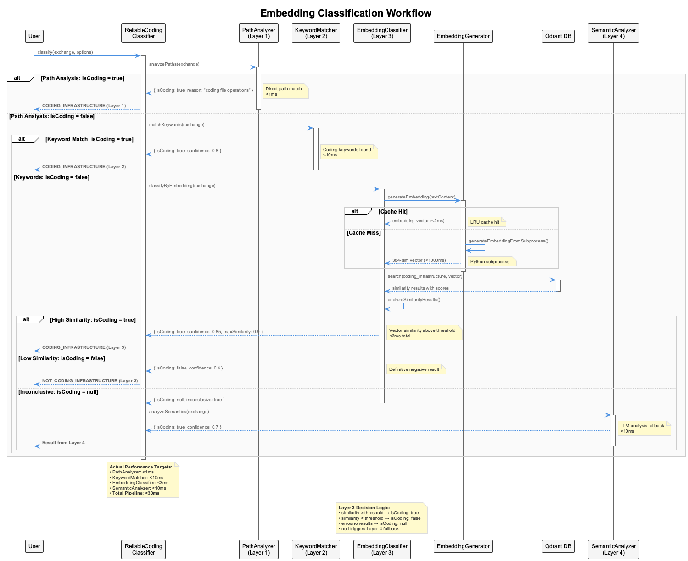

# Embedding Classification System

A sophisticated four-layer classification system that integrates semantic vector similarity search into the Live Session Logging (LSL) infrastructure for intelligent coding session categorization.

## Table of Contents

- [Overview](#overview)
- [Architecture](#architecture)
- [Components](#components)
- [Performance](#performance)
- [Configuration](#configuration)
- [Getting Started](#getting-started)
- [API Reference](#api-reference)
- [Troubleshooting](#troubleshooting)
- [Performance Tuning](#performance-tuning)

## Overview

The Embedding Classification System extends the existing ReliableCodingClassifier with a new Layer 3 that uses semantic vector similarity search via Qdrant vector database and sentence-transformers embeddings. This enables more intelligent classification when path-based and keyword-based approaches are inconclusive.

### Key Features

- **Four-Layer Architecture**: Path → Keyword → Embedding → Semantic
- **High Performance**: <3ms embedding layer, <30ms total pipeline
- **Vector Search**: Powered by Qdrant with HNSW indexing and int8 quantization
- **Intelligent Caching**: LRU cache with TTL for embedding results
- **Automatic Indexing**: Repository content scanning and incremental updates
- **Change Detection**: Heuristic-based triggers for reindexing
- **Comprehensive Monitoring**: Performance metrics and alerting

### Performance Targets

| Component | Target | Description |
|-----------|--------|-------------|
| Embedding Generation (cached) | <2ms | Cached embedding retrieval |
| Embedding Generation (cold) | <1000ms | Fresh embedding generation |
| Similarity Search | <3ms | Qdrant vector search |
| Embedding Layer | <3ms | Complete Layer 3 operation |
| Total Pipeline | <30ms | End-to-end classification |
| Repository Indexing | <5min | Initial full indexing |
| Incremental Updates | <30s | Changed file reindexing |

## Architecture

The embedding classification system integrates seamlessly into the existing four-layer classification pipeline:



The system operates through a sophisticated four-layer decision cascade where each layer has specific performance targets and fallback mechanisms. When the PathAnalyzer (Layer 1) cannot directly match file patterns, the system progresses through KeywordMatcher (Layer 2), then EmbeddingClassifier (Layer 3) for semantic vector similarity, and finally SemanticAnalyzer (Layer 4) for deep LLM analysis.

### Classification Workflow



The workflow demonstrates the intelligent progression through classification layers with performance optimization through caching and early exits. Each layer is designed to make quick, confident decisions when possible, only falling through to more expensive layers when necessary.

## Components

### 1. EmbeddingGenerator (`src/utils/EmbeddingGenerator.js`)

Manages sentence-transformers integration via Python subprocess for generating 384-dimensional embeddings.

**Key Features:**
- **Model**: sentence-transformers/all-MiniLM-L6-v2
- **Dimensions**: 384
- **Batch Processing**: Configurable batch sizes
- **Caching**: LRU cache with TTL support
- **Error Recovery**: Graceful subprocess failure handling

**Performance:**
- Cached embeddings: <2ms
- Cold generation: <1000ms
- Batch throughput: ~100 items/second

### 2. RepositoryIndexer (`src/live-logging/RepositoryIndexer.js`)

Scans repository content and populates the Qdrant vector database with semantic embeddings.

**Key Features:**
- **Content Discovery**: Glob-based file pattern matching
- **Chunking**: Intelligent text segmentation with overlap
- **Incremental Updates**: Change-based reindexing
- **Metadata**: File path, content type, and timestamp tracking

**Supported Patterns:**
- `**/*.md` - Documentation files
- `**/README*` - README files
- `**/CLAUDE.md` - Project instructions
- `package.json` - Configuration files
- `src/**/*.js` - Source code
- `.spec-workflow/**/*` - Specification documents

### 3. EmbeddingClassifier (`src/live-logging/EmbeddingClassifier.js`)

Layer 3 of the four-layer classification system, providing semantic vector similarity search.

**Key Features:**
- **Similarity Search**: Cosine distance with configurable thresholds
- **Confidence Scoring**: Transparent decision rationale
- **Performance Optimization**: HNSW indexing with int8 quantization
- **Fallback Integration**: Seamless handoff to Layer 4

**Decision Logic:**
```javascript
if (topScore >= config.similarity_threshold && topScore >= config.confidence_threshold) {
  return { decision: 'coding', confidence: topScore, layer: 3 };
} else {
  return { decision: null, confidence: 0, layer: 3 }; // Falls to Layer 4
}
```

### 4. ChangeDetector (`src/live-logging/ChangeDetector.js`)

Monitors repository changes and triggers reindexing when significant modifications occur.

**Key Features:**
- **File System Watching**: Efficient change detection
- **Heuristic Analysis**: Smart significance assessment
- **Debouncing**: Prevents excessive reindexing
- **Pattern Focus**: Prioritizes documentation and configuration changes

**Trigger Conditions:**
- Documentation file changes (3x weight)
- Minimum 2 files changed
- Significance threshold exceeded (20%)
- Debounced change detection (5 second delay)

### 5. Performance Monitoring

Extended PerformanceMonitor with embedding-specific metrics and alerting.

**Metrics Tracked:**
- Embedding generation times (cached vs. cold)
- Similarity search performance
- Cache hit rates and efficiency
- Memory usage and optimization
- Repository indexing throughput
- Change detection accuracy

## Configuration

The system is configured via `config/live-logging-config.json`:

```json
{
  "embedding_classifier": {
    "enabled": true,
    "qdrant": {
      "host": "localhost",
      "port": 6333,
      "collection_name": "coding_infrastructure",
      "timeout": 5000,
      "retries": 3,
      "index_config": {
        "vectors": { "size": 384, "distance": "Cosine" },
        "hnsw_config": { "m": 16, "ef_construct": 100 },
        "quantization_config": { "scalar": { "type": "int8" } }
      }
    },
    "embedding": {
      "model": "sentence-transformers/all-MiniLM-L6-v2",
      "dimensions": 384,
      "python_timeout": 10000,
      "batch_size": 32,
      "cache_size": 1000,
      "cache_ttl": 3600000
    },
    "classification": {
      "similarity_threshold": 0.7,
      "confidence_threshold": 0.8,
      "max_response_time": 3,
      "fallback_to_semantic": true
    }
  }
}
```

### Configuration Sections

| Section | Purpose | Key Settings |
|---------|---------|--------------|
| `qdrant` | Vector database configuration | Host, port, collection, indexing |
| `embedding` | Embedding generation settings | Model, caching, batch processing |
| `classification` | Search and decision parameters | Thresholds, performance limits |
| `repository_indexing` | Content scanning configuration | File patterns, chunking, limits |
| `change_detection` | Reindexing trigger settings | Scan intervals, significance |
| `performance` | Optimization parameters | Caching, memory, concurrency |
| `monitoring` | Metrics and alerting | Performance tracking, logging |

## Getting Started

### Prerequisites

1. **Qdrant Vector Database**
   ```bash
   docker run -p 6333:6333 qdrant/qdrant
   ```

2. **Python with sentence-transformers**
   ```bash
   pip install sentence-transformers torch
   ```

3. **Node.js Dependencies**
   ```bash
   npm install @qdrant/js-client-rest
   ```

### Quick Start

1. **Start Qdrant**
   ```bash
   docker run -d -p 6333:6333 qdrant/qdrant
   ```

2. **Initialize System**
   ```javascript
   const { EmbeddingClassifier } = require('./src/live-logging/EmbeddingClassifier');
   const config = require('./config/live-logging-config.json');
   
   const classifier = new EmbeddingClassifier(config.embedding_classifier);
   await classifier.initialize();
   ```

3. **Index Repository**
   ```bash
   node scripts/reindex-coding-infrastructure.js --full --validate
   ```

4. **Test Classification**
   ```javascript
   const result = await classifier.classify(
     'Implement semantic search functionality',
     '/path/to/file.js'
   );
   console.log(result); // { decision: 'coding', confidence: 0.85, layer: 3 }
   ```

### Integration Example

```javascript
// Integrate with ReliableCodingClassifier
const ReliableCodingClassifier = require('./src/live-logging/ReliableCodingClassifier');

const classifier = new ReliableCodingClassifier();
await classifier.initialize(); // Automatically includes embedding layer

// Four-layer classification
const result = await classifier.classify('Add vector search capabilities', '/src/search.js');
// Automatically routes through: Path → Keyword → Embedding → Semantic
```

## Performance Tuning

### Embedding Generation Optimization

1. **Batch Processing**
   ```json
   {
     "embedding": {
       "batch_size": 32,  // Optimal for most systems
       "parallel_processing": true,
       "max_concurrent": 4
     }
   }
   ```

2. **Caching Strategy**
   ```json
   {
     "embedding": {
       "cache_size": 1000,      // Increase for higher hit rates
       "cache_ttl": 3600000,    // 1 hour TTL
       "cache_embeddings": true
     }
   }
   ```

### Vector Search Optimization

1. **HNSW Parameters**
   ```json
   {
     "qdrant": {
       "index_config": {
         "hnsw_config": {
           "m": 16,              // Higher = better recall, slower build
           "ef_construct": 100,  // Higher = better quality, slower build
           "max_indexing_threads": 2
         }
       }
     }
   }
   ```

2. **Quantization Settings**
   ```json
   {
     "qdrant": {
       "index_config": {
         "quantization_config": {
           "scalar": {
             "type": "int8",        // Reduces memory usage
             "always_ram": true     // Keeps quantized vectors in RAM
           }
         }
       }
     }
   }
   ```

### Memory Management

1. **Memory Limits**
   ```json
   {
     "performance": {
       "memory_limit": 524288000,  // 500MB limit
       "gc_threshold": 0.8         // Trigger GC at 80%
     }
   }
   ```

2. **Monitoring**
   ```javascript
   const monitor = new PerformanceMonitor();
   monitor.recordMemoryUsage(process.memoryUsage().heapUsed / 1024 / 1024);
   
   // Check memory health
   const health = monitor.checkEmbeddingHealth();
   if (health.status !== 'healthy') {
     console.log('Memory issues:', health.issues);
   }
   ```

## API Reference

### EmbeddingClassifier

#### `classify(prompt, filePath, options)`
Performs semantic vector similarity classification.

**Parameters:**
- `prompt` (string): User input text to classify
- `filePath` (string): File path context for classification
- `options` (object): Classification options
  - `skipCache` (boolean): Skip embedding cache
  - `maxCandidates` (number): Limit search results

**Returns:** Promise<ClassificationResult>
```javascript
{
  decision: 'coding' | null,
  confidence: number,        // 0.0 to 1.0
  layer: 3,
  reasoning: string,
  candidates: Array<{
    content: string,
    score: number,
    metadata: object
  }>,
  performance: {
    embeddingTime: number,
    searchTime: number,
    totalTime: number
  }
}
```

#### `initialize()`
Initializes the embedding classifier and its dependencies.

**Returns:** Promise<boolean>

#### `getCacheStats()`
Returns cache performance statistics.

**Returns:** Object
```javascript
{
  hits: number,
  misses: number,
  hitRate: number,
  size: number,
  maxSize: number
}
```

### RepositoryIndexer

#### `indexRepository(repositoryPath)`
Performs full repository indexing.

**Parameters:**
- `repositoryPath` (string): Absolute path to repository

**Returns:** Promise<IndexingResult>
```javascript
{
  success: boolean,
  filesProcessed: number,
  chunksCreated: number,
  pointsIndexed: number,
  duration: number,
  errors: Array<string>
}
```

#### `reindexChangedFiles(filePaths)`
Performs incremental reindexing of specific files.

**Parameters:**
- `filePaths` (Array<string>): Files to reindex

**Returns:** Promise<IndexingResult>

### ChangeDetector

#### `detectChanges()`
Analyzes repository for significant changes.

**Returns:** Promise<ChangeResult>
```javascript
{
  significantChange: boolean,
  files: Array<string>,
  changeScore: number,
  reasons: Array<string>
}
```

#### `startWatching(repositoryPath)`
Begins file system monitoring.

**Parameters:**
- `repositoryPath` (string): Repository to monitor

**Returns:** Promise<void>

## Troubleshooting

### Common Issues

#### 1. Qdrant Connection Failed
```
Error: Qdrant connection failed: connect ECONNREFUSED 127.0.0.1:6333
```

**Solutions:**
- Verify Qdrant is running: `docker ps | grep qdrant`
- Check port configuration in `live-logging-config.json`
- Ensure no firewall blocking port 6333

#### 2. Python Subprocess Timeout
```
Error: Embedding generation failed: Python subprocess timeout
```

**Solutions:**
- Increase `python_timeout` in configuration
- Verify sentence-transformers installation: `pip list | grep sentence-transformers`
- Check Python path and subprocess compatibility

#### 3. High Memory Usage
```
Warning: High memory usage: 512MB
```

**Solutions:**
- Reduce `batch_size` in embedding configuration
- Decrease `cache_size` for embeddings
- Enable garbage collection: `node --expose-gc`

#### 4. Poor Classification Accuracy
```
Low cache hit rate: 15%
```

**Solutions:**
- Increase cache size and TTL
- Optimize similarity and confidence thresholds
- Review repository indexing patterns
- Add more training content to index

#### 5. Slow Similarity Search
```
Similarity search >5ms consistently
```

**Solutions:**
- Optimize HNSW parameters (reduce `m` or `ef_construct`)
- Enable int8 quantization
- Increase Qdrant memory allocation
- Check system resource availability

### Performance Diagnostics

#### Monitor System Health
```javascript
const monitor = new PerformanceMonitor();
const embeddingHealth = monitor.checkEmbeddingHealth();
const generalHealth = monitor.healthCheck();

console.log('Embedding Health:', embeddingHealth);
console.log('General Health:', generalHealth);
```

#### Generate Performance Report
```javascript
const report = monitor.getEmbeddingMetrics();
console.log('Performance Report:', JSON.stringify(report, null, 2));
```

#### Analyze Cache Efficiency
```javascript
const classifier = new EmbeddingClassifier(config);
const stats = classifier.getCacheStats();
console.log(`Cache Hit Rate: ${stats.hitRate}%`);
```

### Debug Mode

Enable detailed logging by setting configuration:
```json
{
  "embedding_classifier": {
    "debug": {
      "enabled": true,
      "log_embeddings": true,
      "log_qdrant_operations": true,
      "verbose_classification": true
    }
  }
}
```

### Log Analysis

Monitor system logs for performance issues:
```bash
# Monitor classification performance
tail -f logs/embedding-classification.log | grep "SLOW"

# Check memory usage patterns  
tail -f logs/performance.log | grep "memory"

# Analyze cache effectiveness
tail -f logs/embedding-classification.log | grep "cache"
```

---

For additional support, refer to:
- [Configuration Guide](./configuration.md)
- [Architecture Deep Dive](./architecture.md)
- [Performance Benchmarks](./benchmarks.md)
- [Migration Guide](./migration.md)