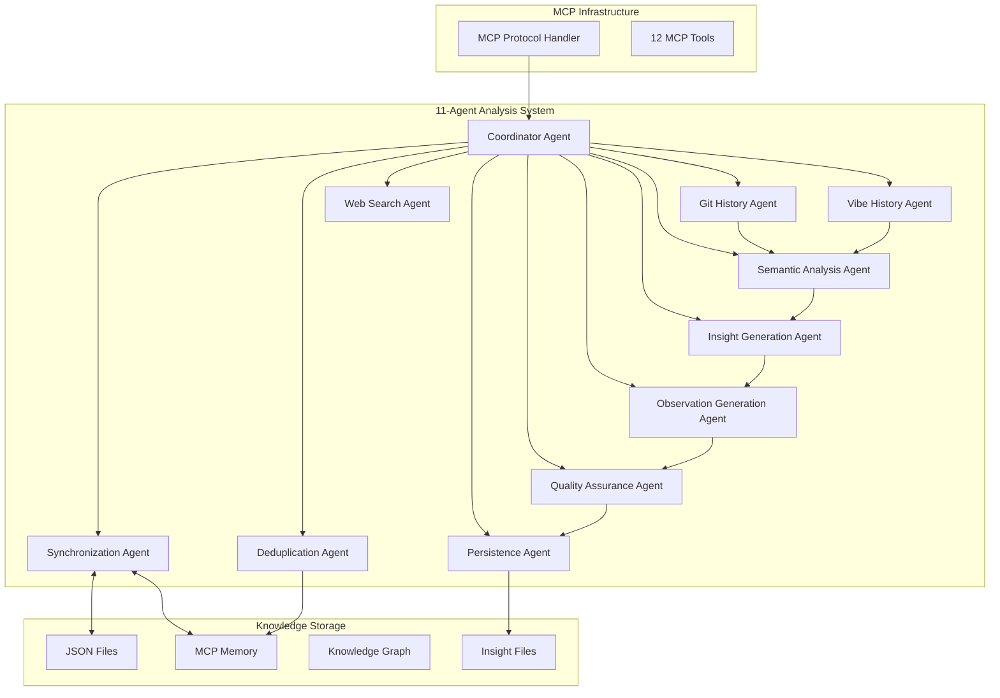

# Unified Semantic Analysis System

🚀 **Unified 11-Agent Semantic Analysis System** serving both Claude Code and GitHub CoPilot with single infrastructure and intelligent coordination.

## Overview

The Semantic Analysis System is a comprehensive distributed agent framework designed to analyze code repositories, extract meaningful patterns, and manage knowledge bases with enterprise-grade reliability. The system has been significantly enhanced with new infrastructure agents and advanced capabilities.

## ✨ Key Features

### Core Capabilities
- **Multi-agent Architecture**: Specialized agents for different analysis and management tasks
- **Direct Node.js Calls**: High-performance direct function calls, no messaging overhead  
- **Code Analysis**: Deep git repository analysis with commit history processing
- **Pattern Extraction**: Automated identification of architectural and design patterns
- **Knowledge Integration**: Seamless integration with multiple knowledge management systems
- **MCP Integration**: Full compatibility with Model Context Protocol

### 🆕 Enhanced Features (New)
- **📊 Bidirectional Synchronization**: Real-time sync between graph databases and JSON files
- **🔍 Semantic Deduplication**: AI-powered duplicate detection and merging
- **🔗 Automatic Relations**: Smart entity relationship creation
- **📝 Entity Validation**: Comprehensive validation pipeline
- **⚡ Performance Optimization**: Caching, batching, and efficient processing
- **🔄 Version Management**: Complete rollback capabilities with conflict resolution

## Quick Start

```bash
# Start Claude Code with integrated MCP server
claude-mcp

# The semantic analysis server starts automatically
# Access all 12 tools and 11 agents through Claude Code
```

> **📋 Standalone Server**: The semantic analysis system is now available as a [standalone Node.js MCP server](../../../integrations/mcp-server-semantic-analysis/) with comprehensive documentation.

## Enhanced Architecture



## 📚 Documentation

### Core Documentation
- **[Enhanced Architecture](enhanced-architecture.md)** - Complete enhanced system architecture
- **[Architecture](architecture.md)** - Original system architecture  
- **[Installation Guide](installation.md)** - Complete setup and configuration
- **[Use Cases](use-cases.md)** - Comprehensive usage examples
- **[API Reference](api-reference.md)** - Agent APIs and interfaces
- **[Workflows](workflows.md)** - Common usage patterns
- **[Troubleshooting](troubleshooting.md)** - Common issues and solutions

### Integration Guides
- **[MCP Server Setup](mcp-server-setup.md)** - Claude Code integration

## 🤖 11-Agent Analysis System

### 1 Orchestration Agent (Workflow Management)

#### 1. Coordinator Agent
Orchestrates all workflow execution, manages task scheduling, coordinates agent interactions, and handles error recovery with rollback capabilities.

### 8 Core Analysis Agents (Sequential Workflow)

#### 2. Git History Agent
Analyzes Git commit history from checkpoint, extracts meaningful changes and patterns from repository evolution.

#### 3. Vibe History Agent  
Processes conversation history from `.specstory/history` files, extracting context and insights from previous sessions.

#### 4. Semantic Analysis Agent
Performs deep code analysis, correlating Git changes with conversation context to identify patterns and architectural insights.

#### 5. Web Search Agent
Conducts context-aware web searches to validate references, discover documentation, and research external patterns.

#### 6. Insight Generation Agent
Generates comprehensive insights and creates PlantUML diagrams based on analysis results with LLM support.

#### 7. Observation Generation Agent
Creates structured, UKB-compatible observations from insights, ensuring proper knowledge base integration.

#### 8. Quality Assurance Agent
Validates all outputs with auto-correction capabilities, ensuring accuracy and completeness of analysis results.

#### 9. Persistence Agent
Handles knowledge base persistence, creates checkpoints, and manages the storage of validated insights.

### 2 Infrastructure Agents (Supporting Services)

#### 10. Synchronization Agent
**Purpose**: Ensures bidirectional sync between graph databases and JSON files

**Key Features**:
- ✅ **Multi-adapter support**: MCP Memory Service + file systems
- ✅ **Real-time sync**: Change detection with conflict resolution
- ✅ **Version management**: Rollback capabilities with history
- ✅ **Data integrity**: Checksum validation and consistency checks

#### 11. Deduplication Agent
**Purpose**: Detects and merges semantically similar entities

**Key Features**:
- ✅ **AI-powered similarity**: Semantic embedding analysis
- ✅ **Smart merging**: Configurable strategies and thresholds  
- ✅ **Batch processing**: Efficient duplicate detection and removal
- ✅ **Entity grouping**: Visualization support for similar patterns

## 🔗 Integration

The enhanced system integrates with:
- **Claude Code**: Via MCP server for AI-assisted development
- **UKB System**: For knowledge base management
- **VKB System**: For knowledge visualization
- **Git Repositories**: For automatic code analysis
- **Multiple Graph Databases**: MCP Memory Service, Graphology DB
- **CI/CD Pipelines**: GitHub Actions, automated analysis
- **IDEs**: VS Code extensions, real-time suggestions

## 🚀 Getting Started

1. **Prerequisites**: Node.js 18+, API keys (Anthropic, OpenAI optional)
2. **Installation**: Follow the [installation guide](installation.md)
3. **Configuration**: Set up API keys, paths, and agent configuration
4. **Testing**: Run the test suite to verify installation
5. **Usage**: Start with basic [use cases](use-cases.md)

## 🎯 Use Cases

- **Code Analysis**: Repository pattern analysis and commit history insights
- **Knowledge Management**: Automatic knowledge base population from conversations
- **Deduplication**: Semantic duplicate detection and merging
- **Synchronization**: Multi-environment knowledge base sync
- **Team Collaboration**: Real-time knowledge updates across team members
- **CI/CD Integration**: Automated analysis in development pipelines

For detailed examples, see the [use cases guide](use-cases.md).

## 📈 Performance & Monitoring

- **Metrics**: Agent health, sync performance, deduplication effectiveness
- **Logging**: Structured JSON logs with correlation IDs
- **Health Checks**: Real-time system monitoring
- **Observability**: Performance tracking and resource utilization

---

**Next Steps**: 
- Review the [enhanced architecture](enhanced-architecture.md) for detailed technical specifications
- Follow the [installation guide](installation.md) for step-by-step setup
- Explore [use cases](use-cases.md) for practical implementation examples

## Legacy Integration

### Available MCP Tools

The semantic analysis system is fully integrated into your Claude Code setup through the MCP (Model Context Protocol) server. When you start `claude-mcp`, the following tools become available:

| Tool | Description | Use Case |
|------|-------------|----------|
| `analyze_repository` | Analyzes code repositories for patterns | Code review, architecture analysis |
| `analyze_conversation` | Extracts insights from conversations | Knowledge capture from discussions |
| `search_web` | Intelligent technical documentation search | Research, problem-solving |
| `search_technical_docs` | Targeted documentation search | API reference, tutorials |
| `create_knowledge_entity` | Adds entities to knowledge graph | Manual knowledge capture |
| `search_knowledge` | Searches existing knowledge base | Knowledge discovery |
| `start_workflow` | Orchestrates complex analysis tasks | Comprehensive analysis |
| `sync_with_ukb` | Syncs with traditional ukb system | Data migration, backup |
| `get_system_status` | Shows agent and system health | Monitoring, debugging |

### Traditional UKB Compatibility

The semantic analysis system **complements** rather than **replaces** the traditional ukb command:

| Scenario | Recommended Tool | Reason |
|----------|------------------|---------|
| **Automatic Analysis** | AI Tools (MCP) | Faster, more comprehensive |
| **Manual Insight Entry** | `ukb --interactive` | Human-curated knowledge |
| **Bulk Processing** | AI Workflows | Handles large datasets |
| **Quick Manual Entry** | `ukb --interactive` | Direct, familiar interface |
| **Complex Research** | AI + Web Search | Comprehensive analysis |

## Related Documentation

### 🚀 Standalone MCP Server
- **[MCP Server Documentation](../../../integrations/mcp-server-semantic-analysis/README.md)** - Complete standalone server documentation
- **[Installation Guide](../../../integrations/mcp-server-semantic-analysis/docs/installation/README.md)** - Detailed setup and configuration
- **[Architecture Details](../../../integrations/mcp-server-semantic-analysis/docs/architecture/README.md)** - Technical architecture and design patterns
- **[API Reference](../../../integrations/mcp-server-semantic-analysis/docs/api/README.md)** - Complete tool and agent API documentation

### Legacy Semantic Analysis System
- [Enhanced Architecture](./enhanced-architecture.md) - Complete enhanced system architecture
- [Architecture Details](./architecture.md) - Original technical architecture
- [API Reference](./api-reference.md) - Complete API documentation
- [Workflow Guide](./workflows.md) - Workflow configuration and usage
- [Troubleshooting](./troubleshooting.md) - Common issues and solutions

### Traditional Tools
- [UKB Documentation](../ukb/README.md) - Traditional knowledge base management
- [VKB Documentation](../vkb/README.md) - Knowledge visualization tools

### System Integration
- [Installation Guide](../../installation/quick-start.md) - System setup and installation
- [MCP Configuration](../../installation/mcp-configuration.md) - Claude Code integration setup