# Semantic Analysis System

🚀 **Enhanced Multi-Agent Semantic Analysis System** with advanced synchronization, deduplication, and knowledge management capabilities.

## Overview

The Semantic Analysis System is a comprehensive distributed agent framework designed to analyze code repositories, extract meaningful patterns, and manage knowledge bases with enterprise-grade reliability. The system has been significantly enhanced with new infrastructure agents and advanced capabilities.

## ✨ Key Features

### Core Capabilities
- **Multi-agent Architecture**: Specialized agents for different analysis and management tasks
- **Hybrid Communication**: MQTT for events, JSON-RPC for commands  
- **Code Analysis**: Deep git repository analysis with commit history processing
- **Pattern Extraction**: Automated identification of architectural and design patterns
- **Knowledge Integration**: Seamless integration with multiple knowledge management systems
- **MCP Integration**: Full compatibility with Model Context Protocol

### 🆕 Enhanced Features (New)
- **📊 Bidirectional Synchronization**: Real-time sync between graph databases and JSON files
- **🔍 Semantic Deduplication**: AI-powered duplicate detection and merging
- **🔗 Automatic Relations**: Smart entity relationship creation
- **📝 Entity Validation**: Comprehensive validation pipeline
- **⚡ Performance Optimization**: Caching, batching, and efficient processing
- **🔄 Version Management**: Complete rollback capabilities with conflict resolution

## Quick Start

```bash
# Start the enhanced agent system
npm run start:agents

# Start MCP server (for Claude Code integration)
npm run start:mcp
```

## Enhanced Architecture

```mermaid
graph TB
    subgraph "Agent Layer"
        SA[Semantic Analysis Agent]
        WS[Web Search Agent]
        KG[Knowledge Graph Agent ✨]
        CO[Coordinator Agent]
        SY[Synchronization Agent 🆕]
        DD[Deduplication Agent 🆕]
        DA[Documentation Agent 🆕]
    end
    
    subgraph "Infrastructure"
        MQTT[MQTT Broker]
        RPC[JSON-RPC Server]
        EB[Event Bus]
    end
    
    subgraph "Enhanced Storage"
        JSON[JSON Files]
        MCP[MCP Memory]
        GDB[Graphology DB]
        VER[Version Storage 🆕]
    end
    
    SA --> EB
    WS --> EB
    KG --> EB
    CO --> EB
    SY --> EB
    DD --> EB
    DA --> EB
    
    EB --> MQTT
    EB --> RPC
    
    SY <--> JSON
    SY <--> MCP  
    SY <--> GDB
    SY --> VER
    
    KG <--> MCP
    DD <--> MCP
```



## 📚 Documentation

### Core Documentation
- **[Enhanced Architecture](enhanced-architecture.md)** - Complete enhanced system architecture
- **[Architecture](architecture.md)** - Original system architecture  
- **[Installation Guide](installation.md)** - Complete setup and configuration
- **[Use Cases](use-cases.md)** - Comprehensive usage examples
- **[API Reference](api-reference.md)** - Agent APIs and interfaces
- **[Workflows](workflows.md)** - Common usage patterns
- **[Troubleshooting](troubleshooting.md)** - Common issues and solutions

### Integration Guides
- **[MCP Server Setup](mcp-server-setup.md)** - Claude Code integration

## 🤖 Enhanced Agent System

### Core Agents

#### Semantic Analysis Agent
Analyzes code repositories and extracts meaningful patterns from commit history with enhanced LLM support.

#### Knowledge Graph Agent ✨ (Enhanced)
- **Automatic relation creation** to CollectiveKnowledge and project nodes
- **Entity validation** with comprehensive checks
- **Duplicate detection** before entity creation
- **Type-based relations** (Patterns, Documentation, Insights hubs)
- **Technology relations** based on metadata

#### Coordinator Agent
Orchestrates workflows across multiple agents and manages task scheduling with quality assurance.

#### Web Search Agent
Performs context-aware web searches to validate references and discover documentation.

### 🆕 Infrastructure Agents (New)

#### Synchronization Agent
**Purpose**: Ensures bidirectional sync between graph databases and JSON files

**Key Features**:
- ✅ **Multi-adapter support**: MCP Memory Service + Graphology Database
- ✅ **File watching**: Real-time change detection with debouncing
- ✅ **Conflict resolution**: Latest-wins, merge, manual strategies
- ✅ **Version management**: Rollback capabilities with history
- ✅ **Checksum validation**: Prevents infinite sync loops

#### Deduplication Agent
**Purpose**: Detects and merges semantically similar entities

**Key Features**:
- ✅ **Embedding generation**: OpenAI, sentence-transformers, local TF-IDF
- ✅ **Similarity detection**: Cosine, Euclidean, Manhattan, Pearson, Jaccard
- ✅ **Automatic merging**: Configurable strategies and thresholds
- ✅ **Batch processing**: Periodic deduplication with performance optimization
- ✅ **Entity grouping**: Visualization support for similar entities

#### Documentation Agent (Planned)
**Purpose**: Automated insight document generation

**Planned Features**:
- Markdown document generation
- PlantUML/Mermaid diagram creation
- Code snippet integration
- Reference validation and enrichment

## 🔗 Integration

The enhanced system integrates with:
- **Claude Code**: Via MCP server for AI-assisted development
- **UKB System**: For knowledge base management
- **VKB System**: For knowledge visualization
- **Git Repositories**: For automatic code analysis
- **Multiple Graph Databases**: MCP Memory Service, Graphology DB
- **CI/CD Pipelines**: GitHub Actions, automated analysis
- **IDEs**: VS Code extensions, real-time suggestions

## 🚀 Getting Started

1. **Prerequisites**: Node.js 18+, API keys (Anthropic, OpenAI optional)
2. **Installation**: Follow the [installation guide](installation.md)
3. **Configuration**: Set up API keys, paths, and agent configuration
4. **Testing**: Run the test suite to verify installation
5. **Usage**: Start with basic [use cases](use-cases.md)

## 🎯 Use Cases

- **Code Analysis**: Repository pattern analysis and commit history insights
- **Knowledge Management**: Automatic knowledge base population from conversations
- **Deduplication**: Semantic duplicate detection and merging
- **Synchronization**: Multi-environment knowledge base sync
- **Team Collaboration**: Real-time knowledge updates across team members
- **CI/CD Integration**: Automated analysis in development pipelines

For detailed examples, see the [use cases guide](use-cases.md).

## 📈 Performance & Monitoring

- **Metrics**: Agent health, sync performance, deduplication effectiveness
- **Logging**: Structured JSON logs with correlation IDs
- **Health Checks**: Real-time system monitoring
- **Observability**: Performance tracking and resource utilization

---

**Next Steps**: 
- Review the [enhanced architecture](enhanced-architecture.md) for detailed technical specifications
- Follow the [installation guide](installation.md) for step-by-step setup
- Explore [use cases](use-cases.md) for practical implementation examples

## Legacy Integration

### Available MCP Tools

The semantic analysis system is fully integrated into your Claude Code setup through the MCP (Model Context Protocol) server. When you start `claude-mcp`, the following tools become available:

| Tool | Description | Use Case |
|------|-------------|----------|
| `analyze_repository` | Analyzes code repositories for patterns | Code review, architecture analysis |
| `analyze_conversation` | Extracts insights from conversations | Knowledge capture from discussions |
| `search_web` | Intelligent technical documentation search | Research, problem-solving |
| `search_technical_docs` | Targeted documentation search | API reference, tutorials |
| `create_knowledge_entity` | Adds entities to knowledge graph | Manual knowledge capture |
| `search_knowledge` | Searches existing knowledge base | Knowledge discovery |
| `start_workflow` | Orchestrates complex analysis tasks | Comprehensive analysis |
| `sync_with_ukb` | Syncs with traditional ukb system | Data migration, backup |
| `get_system_status` | Shows agent and system health | Monitoring, debugging |

### Traditional UKB Compatibility

The semantic analysis system **complements** rather than **replaces** the traditional ukb command:

| Scenario | Recommended Tool | Reason |
|----------|------------------|---------|
| **Automatic Analysis** | AI Tools (MCP) | Faster, more comprehensive |
| **Manual Insight Entry** | `ukb --interactive` | Human-curated knowledge |
| **Bulk Processing** | AI Workflows | Handles large datasets |
| **Quick Manual Entry** | `ukb --interactive` | Direct, familiar interface |
| **Complex Research** | AI + Web Search | Comprehensive analysis |

## Related Documentation

### Semantic Analysis System
- [Enhanced Architecture](./enhanced-architecture.md) - Complete enhanced system architecture
- [Architecture Details](./architecture.md) - Original technical architecture
- [API Reference](./api-reference.md) - Complete API documentation
- [Workflow Guide](./workflows.md) - Workflow configuration and usage
- [Troubleshooting](./troubleshooting.md) - Common issues and solutions

### Traditional Tools
- [UKB Documentation](../ukb/README.md) - Traditional knowledge base management
- [VKB Documentation](../vkb/README.md) - Knowledge visualization tools

### System Integration
- [Installation Guide](../../installation/quick-start.md) - System setup and installation
- [MCP Configuration](../../installation/mcp-configuration.md) - Claude Code integration setup