# Enhanced Semantic Analysis System Architecture

## Overview

The Semantic Analysis System has been significantly enhanced with new agents and capabilities for comprehensive knowledge management, synchronization, and deduplication. This document outlines the enhanced architecture and new features.

## Enhanced Agent Architecture

### New Agents Added

#### 1. Synchronization Agent
**Purpose**: Ensures bidirectional sync between graph databases and JSON files

**Key Features**:
- ✅ **Multi-adapter support**: MCP Memory Service + Graphology Database
- ✅ **File watching**: Real-time change detection with debouncing
- ✅ **Conflict resolution**: Latest-wins, merge, manual strategies
- ✅ **Version management**: Rollback capabilities with history
- ✅ **Checksum validation**: Prevents infinite sync loops

**Components**:
```
agents/synchronization/
├── index.js                    # Main agent
├── adapters/
│   ├── mcp-adapter.js         # MCP Memory Service adapter
│   └── graphology-adapter.js  # Graphology Database adapter
├── watchers/
│   └── file-watcher.js        # File system monitoring
├── resolvers/
│   └── conflict-resolver.js   # Conflict detection and resolution
└── managers/
    └── version-manager.js     # Version control and rollback
```

#### 2. Deduplication Agent
**Purpose**: Detects and merges semantically similar entities

**Key Features**:
- ✅ **Embedding generation**: OpenAI, sentence-transformers, local TF-IDF
- ✅ **Similarity detection**: Cosine, Euclidean, Manhattan, Pearson, Jaccard
- ✅ **Automatic merging**: Configurable strategies and thresholds
- ✅ **Batch processing**: Periodic deduplication with performance optimization
- ✅ **Entity grouping**: Visualization support for similar entities

**Components**:
```
agents/deduplication/
├── index.js                    # Main agent
├── generators/
│   └── embedding-generator.js # Vector embedding creation
├── detectors/
│   └── similarity-detector.js # Multi-metric similarity calculation
└── mergers/
    └── entity-merger.js       # Intelligent entity merging
```

#### 3. Enhanced Knowledge Graph Agent
**Enhanced Features**:
- ✅ **Automatic relation creation** to CollectiveKnowledge and project nodes
- ✅ **Entity validation** with comprehensive checks
- ✅ **Duplicate detection** before entity creation
- ✅ **Type-based relations** (Patterns, Documentation, Insights hubs)
- ✅ **Technology relations** based on metadata

## System Architecture Diagram

```mermaid
graph TB
    subgraph "Client Layer"
        CLI[CLI Interface]
        MCP[MCP Client]
        HTTP[HTTP Client]
        UI[Web Dashboard]
    end
    
    subgraph "API Layer"
        MCP_SERVER[MCP Server]
        REST[REST API]
        GQL[GraphQL API]
    end
    
    subgraph "Enhanced Agent Layer"
        subgraph "Core Agents"
            SA[Semantic Analysis Agent]
            KG[Knowledge Graph Agent ✨]
            CO[Coordinator Agent]
        end
        
        subgraph "Infrastructure Agents ⭐ NEW"
            SY[Synchronization Agent]
            DD[Deduplication Agent]
            DA[Documentation Agent]
        end
        
        subgraph "Utility Agents"
            WS[Web Search Agent]
            QA[Quality Assurance Agent]
        end
    end
    
    subgraph "Communication Layer"
        MQTT[MQTT Broker]
        RPC[JSON-RPC Server]
        EB[Event Bus]
    end
    
    subgraph "Enhanced Storage Layer ✨"
        subgraph "Graph Databases"
            MEM[MCP Memory Service]
            GDB[Graphology Database]
        end
        
        subgraph "Synchronized Files"
            JSON_C[shared-memory-coding.json]
            JSON_U[shared-memory-ui.json]
            JSON_R[shared-memory-resi.json]
        end
        
        subgraph "Version Control ⭐ NEW"
            VER[Version Storage]
            BAK[Backup Storage]
        end
    end
    
    CLI --> REST
    MCP --> MCP_SERVER
    HTTP --> REST
    UI --> GQL
    
    MCP_SERVER --> KG
    REST --> CO
    GQL --> CO
    
    SA --> EB
    KG --> EB
    CO --> EB
    SY --> EB
    DD --> EB
    DA --> EB
    WS --> EB
    QA --> EB
    
    EB --> MQTT
    EB --> RPC
    
    SY <--> MEM
    SY <--> GDB
    SY <--> JSON_C
    SY <--> JSON_U
    SY <--> JSON_R
    SY --> VER
    SY --> BAK
    
    KG <--> MEM
    DD <--> MEM
```



## Enhanced Knowledge Graph Structure

### Automatic Relation Creation

The enhanced Knowledge Graph Agent now automatically creates relations to ensure proper connectivity:


### Validation Rules

**Entity Validation Pipeline**:
1. **Name Validation**: Required, max 200 chars, valid character set
2. **Type Validation**: Must be from approved list
3. **Significance Validation**: Range 1-10
4. **Metadata Validation**: Team assignment, technology arrays
5. **Duplicate Check**: Similarity detection before creation

## Synchronization Architecture

### Multi-Storage Synchronization


### Conflict Resolution Strategies

| Strategy | Description | Use Case |
|----------|-------------|----------|
| `latest-wins` | Newest timestamp wins | Fast resolution |
| `merge` | Intelligent content merge | Complex changes |
| `manual` | Human intervention required | Critical conflicts |

## Deduplication Pipeline

### Embedding-Based Similarity Detection


### Similarity Metrics Supported

- **Cosine Similarity**: Best for text embeddings
- **Euclidean Distance**: Good for numerical features
- **Manhattan Distance**: Robust to outliers
- **Pearson Correlation**: Linear relationships
- **Jaccard Index**: Set-based similarity

## Data Flow Architecture

### Enhanced Entity Creation Flow

```mermaid
sequenceDiagram
    participant Client
    participant KG as Knowledge Graph Agent
    participant DD as Deduplication Agent
    participant SY as Sync Agent
    participant Storage
    
    Client->>KG: Create Entity Request
    KG->>KG: Validate Entity Structure
    KG->>DD: Check for Semantic Duplicates
    DD-->>KG: Similarity Analysis
    
    alt High Similarity Found (>0.95)
        KG->>DD: Auto-merge entities
        DD-->>KG: Merged entity
    else Medium Similarity (0.85-0.95)
        KG->>KG: Create with duplicate warning
    else Low Similarity (<0.85)
        KG->>KG: Create normally
    end
    
    KG->>KG: Create Automatic Relations
    Note over KG: • CollectiveKnowledge<br/>• Team nodes<br/>• Type-based hubs<br/>• Technology nodes
    
    KG->>Storage: Store Entity & Relations
    KG->>SY: Trigger Sync
    SY->>SY: Sync to All Storage Systems
    KG-->>Client: Entity Created with Relations
```



## Configuration

### Enhanced Agent Configuration

```yaml
# Enhanced semantic-analysis-system configuration
agents:
  synchronization:
    enabled: true
    graphDb:
      type: mcp  # or 'graphology'
    files:
      sharedMemoryPaths:
        - /path/to/shared-memory-coding.json
        - /path/to/shared-memory-ui.json
        - /path/to/shared-memory-resi.json
    conflict:
      strategy: latest-wins
      autoResolveThreshold: 0.95
    versioning:
      maxVersions: 50
      compressionEnabled: true
  
  deduplication:
    enabled: true
    embedding:
      provider: openai
      model: text-embedding-ada-002
    similarity:
      metric: cosine
      threshold: 0.8
    merging:
      strategy: auto
      preserveHistory: true
    automation:
      autoMerge: false
      batchThreshold: 0.9
      periodicEnabled: true
      interval: 3600000  # 1 hour
  
  knowledge-graph:
    enabled: true
    validation:
      enableDuplicateCheck: true
      enableNameValidation: true
    relations:
      createAutomaticRelations: true
      createCentralNodes: true
      createTechnologyRelations: true
```

## Performance Optimizations

### Synchronization Performance
- **Debounced file watching**: Prevents excessive operations
- **Checksum validation**: Avoids unnecessary processing
- **Batch operations**: Optimizes bulk updates
- **Connection pooling**: Efficient resource utilization

### Deduplication Performance  
- **Embedding caching**: Reduces computation overhead
- **Batch processing**: Optimizes similarity calculations
- **Configurable thresholds**: Balances accuracy vs. performance
- **Periodic scheduling**: Spreads load over time

## Monitoring and Observability

### Key Metrics

```yaml
metrics:
  synchronization:
    - sync_operations_total
    - sync_conflicts_total
    - sync_latency_seconds
    - file_watch_events_total
  
  deduplication:
    - embedding_generation_total
    - similarity_calculations_total
    - auto_merges_total
    - duplicate_detection_accuracy
  
  knowledge_graph:
    - entities_created_total
    - relations_created_total
    - validation_failures_total
    - automatic_relations_created_total
```

### Health Checks

```bash
# Check system health
curl http://localhost:8081/health

# Response includes all enhanced agents
{
  "status": "healthy",
  "agents": {
    "synchronization": "running",
    "deduplication": "running", 
    "knowledge-graph": "running"
  },
  "storage": {
    "mcp_memory": "connected",
    "json_files": "synchronized",
    "versions": "available"
  }
}
```

## Migration from Previous Version

### Automatic Migration

The system includes automatic migration for existing knowledge bases:

```bash
# Migrate existing knowledge base
npm run migrate:knowledge-base

# Verify migration
npm run verify:migration

# Create initial relations for existing entities
npm run relations:create-missing
```

### Manual Migration Steps

1. **Backup existing data**:
   ```bash
   cp shared-memory-*.json backup/
   ```

2. **Update configuration**:
   ```bash
   cp config/agents.example.yaml config/agents.yaml
   # Edit with new agent configurations
   ```

3. **Initialize new agents**:
   ```bash
   npm run init:new-agents
   ```

4. **Verify automatic relations**:
   ```bash
   npm run verify:relations
   ```

## Future Enhancements

### Planned Features

1. **Documentation Agent**: Automated insight document generation
2. **Quality Assurance Agent**: Advanced validation and compliance
3. **Analytics Dashboard**: Real-time system monitoring
4. **Machine Learning**: Enhanced similarity detection
5. **Distributed Deployment**: Kubernetes orchestration

### Roadmap

- **Phase 1** ✅: Core agents (Synchronization, Deduplication, Enhanced Knowledge Graph)
- **Phase 2** 🚧: Quality Assurance and Documentation agents
- **Phase 3** 📋: Advanced analytics and ML integration
- **Phase 4** 📋: Enterprise features and distributed deployment

## Troubleshooting

### Common Issues

**Sync Conflicts**:
```bash
# Check sync status
curl http://localhost:8080/sync/status

# Resolve conflicts manually
curl -X POST http://localhost:8080/sync/conflicts/resolve \
  -d '{"conflictId": "conflict_123", "resolution": {"strategy": "use-latest"}}'
```

**Deduplication Issues**:
```bash
# Check embedding cache
curl http://localhost:8080/deduplication/cache/status

# Clear cache if needed
curl -X POST http://localhost:8080/deduplication/cache/clear
```

**Missing Relations**:
```bash
# Recreate automatic relations
curl -X POST http://localhost:8080/knowledge-graph/relations/recreate

# Verify relations
curl http://localhost:8080/knowledge-graph/entity/{id}/relations
```

This enhanced architecture provides a robust, scalable foundation for semantic analysis with comprehensive synchronization, deduplication, and knowledge management capabilities.