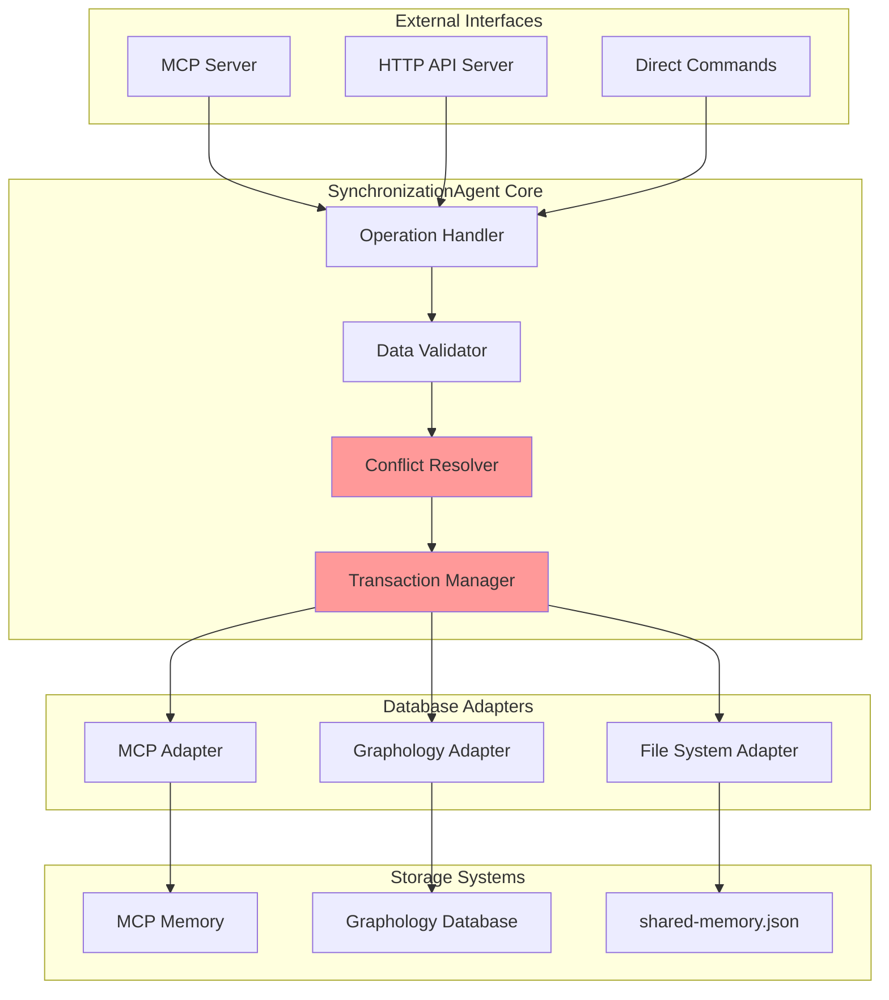

# SynchronizationAgent - Single Source of Truth

## Overview

The **SynchronizationAgent** is the most critical component in the unified semantic analysis system. It serves as the **single source of truth** for data integrity, ensuring that knowledge entities and relationships remain consistent across all storage systems regardless of which AI coding assistant (Claude Code or GitHub CoPilot) is being used.

## Core Responsibilities

### 1. **Multi-Database Synchronization**
- Ensures identical data across MCP Memory, Graphology, and shared-memory.json
- Handles bidirectional synchronization between different storage formats
- Maintains referential integrity across all databases

### 2. **Conflict Resolution**
- Automatically resolves conflicts when the same entity is modified simultaneously
- Implements timestamp-based and content-based resolution strategies
- Provides manual conflict resolution for complex cases

### 3. **Data Integrity Validation**
- Validates entity schemas before storage
- Ensures all required fields are present and properly formatted
- Maintains relationship consistency across entities

### 4. **Atomic Operations**
- Guarantees that operations either succeed on all databases or fail safely
- Implements rollback mechanisms for failed operations
- Provides transaction-like behavior across multiple storage systems

## Architecture



## Implementation

### Class Structure

```typescript
export class SynchronizationAgent {
  private mcpAdapter: MCPAdapter | null = null;
  private graphologyAdapter: GraphologyAdapter | null = null;
  private fileAdapter: FileSystemAdapter | null = null;
  private activeAdapters: Set<string> = new Set();
  private logger: Logger;
  private transactionManager: TransactionManager;
  
  constructor(config: SyncAgentConfig) {
    this.logger = new Logger('synchronization-agent');
    this.transactionManager = new TransactionManager();
  }
}
```

### Initialization

```typescript
async initialize(): Promise<void> {
  try {
    // Initialize adapters based on configuration
    if (this.config.adapters.mcp.enabled) {
      this.mcpAdapter = new MCPAdapter(this.config.adapters.mcp);
      await this.mcpAdapter.initialize();
      this.activeAdapters.add('mcp');
    }
    
    if (this.config.adapters.graphology.enabled) {
      this.graphologyAdapter = new GraphologyAdapter(this.config.adapters.graphology);
      await this.graphologyAdapter.initialize();
      this.activeAdapters.add('graphology');
    }
    
    if (this.config.adapters.file.enabled) {
      this.fileAdapter = new FileSystemAdapter(this.config.adapters.file);
      await this.fileAdapter.initialize();
      this.activeAdapters.add('file');
    }
    
    // Verify initial consistency
    await this.performInitialSync();
    
    this.logger.info(`SynchronizationAgent initialized with adapters: ${Array.from(this.activeAdapters).join(', ')}`);
  } catch (error) {
    this.logger.error('Failed to initialize SynchronizationAgent:', error);
    throw error;
  }
}
```

### Core Operations

#### Create Entity

```typescript
async createEntity(entity: KnowledgeEntity): Promise<SyncResult> {
  const transaction = this.transactionManager.begin();
  
  try {
    // Validate entity structure
    const validatedEntity = await this.validateEntity(entity);
    
    // Generate unique ID if not provided
    if (!validatedEntity.id) {
      validatedEntity.id = this.generateEntityId(validatedEntity.name);
    }
    
    // Check for duplicates
    const existing = await this.findExistingEntity(validatedEntity);
    if (existing) {
      throw new DuplicateEntityError(`Entity ${validatedEntity.name} already exists`);
    }
    
    // Execute on all active adapters
    const results = await this.executeOnAllAdapters('createEntity', validatedEntity);
    
    // Verify all operations succeeded
    if (this.allOperationsSucceeded(results)) {
      await transaction.commit();
      this.logger.info(`Entity created successfully: ${validatedEntity.name}`);
      return { success: true, entityId: validatedEntity.id, results };
    } else {
      await transaction.rollback();
      throw new SyncError('Failed to create entity on all databases', results);
    }
    
  } catch (error) {
    await transaction.rollback();
    this.logger.error(`Failed to create entity ${entity.name}:`, error);
    throw error;
  }
}
```

#### Update Entity

```typescript
async updateEntity(entityId: string, updates: Partial<KnowledgeEntity>): Promise<SyncResult> {
  const transaction = this.transactionManager.begin();
  
  try {
    // Get current entity versions from all databases
    const currentVersions = await this.getAllVersions(entityId);
    
    // Check for conflicts
    const conflicts = this.detectConflicts(currentVersions);
    if (conflicts.length > 0) {
      const resolved = await this.resolveConflicts(conflicts);
      if (!resolved.success) {
        throw new ConflictResolutionError('Unable to resolve conflicts', resolved.conflicts);
      }
    }
    
    // Apply updates to authoritative version
    const authoritativeVersion = this.getAuthoritativeVersion(currentVersions);
    const updatedEntity = this.mergeUpdates(authoritativeVersion, updates);
    
    // Validate updated entity
    const validatedEntity = await this.validateEntity(updatedEntity);
    
    // Execute update on all adapters
    const results = await this.executeOnAllAdapters('updateEntity', entityId, validatedEntity);
    
    if (this.allOperationsSucceeded(results)) {
      await transaction.commit();
      this.logger.info(`Entity updated successfully: ${entityId}`);
      return { success: true, entityId, results };
    } else {
      await transaction.rollback();
      throw new SyncError('Failed to update entity on all databases', results);
    }
    
  } catch (error) {
    await transaction.rollback();
    this.logger.error(`Failed to update entity ${entityId}:`, error);
    throw error;
  }
}
```

#### Search Entities

```typescript
async searchEntities(query: SearchQuery): Promise<SearchResult[]> {
  try {
    // Try primary adapter first (usually fastest)
    const primaryAdapter = this.getPrimaryAdapter();
    if (primaryAdapter) {
      const results = await primaryAdapter.searchEntities(query);
      this.logger.debug(`Search completed via ${primaryAdapter.getName()}: ${results.length} results`);
      return results;
    }
    
    // Fallback to any available adapter
    for (const adapterName of this.activeAdapters) {
      try {
        const adapter = this.getAdapter(adapterName);
        const results = await adapter.searchEntities(query);
        this.logger.debug(`Search completed via fallback ${adapterName}: ${results.length} results`);
        return results;
      } catch (error) {
        this.logger.warn(`Search failed on ${adapterName}:`, error);
        continue;
      }
    }
    
    throw new Error('No adapters available for search');
    
  } catch (error) {
    this.logger.error('Search operation failed:', error);
    throw error;
  }
}
```

### Conflict Resolution

```typescript
async resolveConflicts(conflicts: EntityConflict[]): Promise<ConflictResolution> {
  const resolutions: ConflictResolution[] = [];
  
  for (const conflict of conflicts) {
    try {
      const resolution = await this.resolveEntityConflict(conflict);
      resolutions.push(resolution);
    } catch (error) {
      this.logger.error(`Failed to resolve conflict for entity ${conflict.entityId}:`, error);
      resolutions.push({
        success: false,
        entityId: conflict.entityId,
        error: error.message
      });
    }
  }
  
  return {
    success: resolutions.every(r => r.success),
    resolutions,
    conflicts: resolutions.filter(r => !r.success).map(r => r.entityId)
  };
}

private async resolveEntityConflict(conflict: EntityConflict): Promise<ConflictResolution> {
  const { entityId, versions } = conflict;
  
  // Strategy 1: Timestamp-based resolution (latest wins)
  if (this.config.conflictResolution.strategy === 'timestamp_wins') {
    const latest = this.getLatestVersion(versions);
    await this.applyVersionToAllAdapters(entityId, latest);
    
    return {
      success: true,
      entityId,
      strategy: 'timestamp_wins',
      chosenVersion: latest.source
    };
  }
  
  // Strategy 2: Merge observations
  if (this.config.conflictResolution.strategy === 'merge_observations') {
    const merged = this.mergeEntityVersions(versions);
    await this.applyVersionToAllAdapters(entityId, merged);
    
    return {
      success: true,
      entityId,
      strategy: 'merge_observations',
      chosenVersion: 'merged'
    };
  }
  
  // Strategy 3: Manual resolution required
  return {
    success: false,
    entityId,
    error: 'Manual resolution required',
    versions
  };
}
```

### Adapter Management

```typescript
async executeOnAllAdapters(operation: string, ...args: any[]): Promise<AdapterResults> {
  const results: AdapterResults = {};
  
  for (const adapterName of this.activeAdapters) {
    try {
      const adapter = this.getAdapter(adapterName);
      results[adapterName] = await adapter[operation](...args);
    } catch (error) {
      this.logger.error(`${operation} failed on ${adapterName}:`, error);
      results[adapterName] = { error: error.message };
    }
  }
  
  return results;
}

private getAdapter(name: string): DatabaseAdapter {
  switch (name) {
    case 'mcp':
      if (!this.mcpAdapter) throw new Error('MCP adapter not initialized');
      return this.mcpAdapter;
    case 'graphology':
      if (!this.graphologyAdapter) throw new Error('Graphology adapter not initialized');
      return this.graphologyAdapter;
    case 'file':
      if (!this.fileAdapter) throw new Error('File adapter not initialized');
      return this.fileAdapter;
    default:
      throw new Error(`Unknown adapter: ${name}`);
  }
}

private getPrimaryAdapter(): DatabaseAdapter | null {
  // MCP is preferred for speed when available
  if (this.activeAdapters.has('mcp') && this.mcpAdapter) {
    return this.mcpAdapter;
  }
  
  // Graphology as secondary choice
  if (this.activeAdapters.has('graphology') && this.graphologyAdapter) {
    return this.graphologyAdapter;
  }
  
  // File system as fallback
  if (this.activeAdapters.has('file') && this.fileAdapter) {
    return this.fileAdapter;
  }
  
  return null;
}
```

### Health Monitoring

```typescript
async getHealthStatus(): Promise<HealthStatus> {
  const adapterHealth: Record<string, AdapterHealth> = {};
  
  for (const adapterName of this.activeAdapters) {
    try {
      const adapter = this.getAdapter(adapterName);
      const startTime = Date.now();
      await adapter.ping();
      const latency = Date.now() - startTime;
      
      adapterHealth[adapterName] = {
        status: 'healthy',
        latency,
        lastCheck: new Date().toISOString()
      };
    } catch (error) {
      adapterHealth[adapterName] = {
        status: 'unhealthy',
        error: error.message,
        lastCheck: new Date().toISOString()
      };
    }
  }
  
  const overallStatus = Object.values(adapterHealth).every(h => h.status === 'healthy') 
    ? 'healthy' 
    : 'degraded';
  
  return {
    status: overallStatus,
    adapters: adapterHealth,
    activeAdapters: Array.from(this.activeAdapters),
    lastSync: this.lastSyncTime?.toISOString(),
    conflictCount: await this.getConflictCount()
  };
}
```

## Configuration

### Configuration Schema

```typescript
interface SyncAgentConfig {
  enabled: boolean;
  adapters: {
    mcp: {
      enabled: boolean;
      timeout: number;
      retries: number;
    };
    graphology: {
      enabled: boolean;
      host: string;
      port: number;
      timeout: number;
    };
    file: {
      enabled: boolean;
      path: string;
      backup: boolean;
    };
  };
  conflictResolution: {
    strategy: 'timestamp_wins' | 'merge_observations' | 'manual';
    autoResolve: boolean;
  };
  performance: {
    batchSize: number;
    cacheTTL: number;
    syncInterval: number;
  };
}
```

### Default Configuration

```yaml
# semantic-analysis-system/config/agents.yaml
synchronization:
  enabled: true
  adapters:
    mcp:
      enabled: true
      timeout: 30000
      retries: 3
    graphology:
      enabled: true
      host: localhost
      port: 8765
      timeout: 30000
      autoDetect: true
    file:
      enabled: true
      path: ../shared-memory.json
      backup: true
  
  conflictResolution:
    strategy: timestamp_wins
    autoResolve: true
  
  performance:
    batchSize: 50
    cacheTTL: 300000
    syncInterval: 60000
```

## Error Handling

### Error Types

```typescript
export class SyncError extends Error {
  constructor(message: string, public results?: AdapterResults) {
    super(message);
    this.name = 'SyncError';
  }
}

export class ConflictResolutionError extends Error {
  constructor(message: string, public conflicts?: EntityConflict[]) {
    super(message);
    this.name = 'ConflictResolutionError';
  }
}

export class DuplicateEntityError extends Error {
  constructor(message: string) {
    super(message);
    this.name = 'DuplicateEntityError';
  }
}
```

### Error Recovery

```typescript
async recoverFromError(error: SyncError): Promise<RecoveryResult> {
  this.logger.warn('Attempting error recovery:', error.message);
  
  try {
    // Check which adapters failed
    const failedAdapters = this.identifyFailedAdapters(error.results);
    
    // Attempt to restore from successful adapters
    const successfulAdapters = this.getSuccessfulAdapters(error.results);
    if (successfulAdapters.length > 0) {
      return await this.restoreFromSuccessfulAdapters(failedAdapters, successfulAdapters);
    }
    
    // If all failed, attempt restoration from backup
    return await this.restoreFromBackup();
    
  } catch (recoveryError) {
    this.logger.error('Error recovery failed:', recoveryError);
    return { success: false, error: recoveryError.message };
  }
}
```

## Performance Optimization

### Batch Operations

```typescript
async batchCreateEntities(entities: KnowledgeEntity[]): Promise<BatchSyncResult> {
  const batches = this.chunkArray(entities, this.config.performance.batchSize);
  const results: BatchResult[] = [];
  
  for (const batch of batches) {
    try {
      const batchResult = await this.processBatch(batch);
      results.push(batchResult);
    } catch (error) {
      this.logger.error('Batch processing failed:', error);
      results.push({ success: false, error: error.message, entities: batch });
    }
  }
  
  return this.aggregateBatchResults(results);
}
```

### Caching Strategy

```typescript
private cache = new Map<string, CachedEntity>();
private cacheStats = { hits: 0, misses: 0 };

async getCachedEntity(id: string): Promise<KnowledgeEntity | null> {
  const cached = this.cache.get(id);
  
  if (cached && !this.isCacheExpired(cached)) {
    this.cacheStats.hits++;
    return cached.entity;
  }
  
  this.cacheStats.misses++;
  
  // Fetch from database and cache
  const entity = await this.fetchEntityFromDatabase(id);
  if (entity) {
    this.cache.set(id, {
      entity,
      timestamp: Date.now(),
      ttl: this.config.performance.cacheTTL
    });
  }
  
  return entity;
}
```

## Testing

### Unit Tests

```typescript
describe('SynchronizationAgent', () => {
  let agent: SynchronizationAgent;
  let mockMCPAdapter: jest.Mocked<MCPAdapter>;
  let mockGraphologyAdapter: jest.Mocked<GraphologyAdapter>;
  
  beforeEach(() => {
    mockMCPAdapter = createMockMCPAdapter();
    mockGraphologyAdapter = createMockGraphologyAdapter();
    agent = new SynchronizationAgent(testConfig);
  });
  
  describe('createEntity', () => {
    it('should create entity on all adapters', async () => {
      const entity = createTestEntity();
      
      mockMCPAdapter.createEntity.mockResolvedValue({ success: true });
      mockGraphologyAdapter.createEntity.mockResolvedValue({ success: true });
      
      const result = await agent.createEntity(entity);
      
      expect(result.success).toBe(true);
      expect(mockMCPAdapter.createEntity).toHaveBeenCalledWith(entity);
      expect(mockGraphologyAdapter.createEntity).toHaveBeenCalledWith(entity);
    });
    
    it('should rollback on partial failure', async () => {
      const entity = createTestEntity();
      
      mockMCPAdapter.createEntity.mockResolvedValue({ success: true });
      mockGraphologyAdapter.createEntity.mockRejectedValue(new Error('Database error'));
      
      await expect(agent.createEntity(entity)).rejects.toThrow('Failed to create entity');
      expect(mockMCPAdapter.rollback).toHaveBeenCalled();
    });
  });
});
```

### Integration Tests

```typescript
describe('SynchronizationAgent Integration', () => {
  it('should maintain consistency across real databases', async () => {
    const agent = new SynchronizationAgent(integrationConfig);
    await agent.initialize();
    
    const entity = createTestEntity();
    await agent.createEntity(entity);
    
    // Verify entity exists in all databases
    const mcpEntity = await agent.mcpAdapter.getEntity(entity.id);
    const graphologyEntity = await agent.graphologyAdapter.getEntity(entity.id);
    const fileEntity = await agent.fileAdapter.getEntity(entity.id);
    
    expect(mcpEntity).toEqual(expect.objectContaining(entity));
    expect(graphologyEntity).toEqual(expect.objectContaining(entity));
    expect(fileEntity).toEqual(expect.objectContaining(entity));
  });
});
```

## Monitoring and Alerts

### Metrics Collection

```typescript
interface SyncMetrics {
  operations: {
    create: { count: number; successRate: number; avgLatency: number };
    update: { count: number; successRate: number; avgLatency: number };
    delete: { count: number; successRate: number; avgLatency: number };
  };
  conflicts: {
    detected: number;
    resolved: number;
    manual: number;
  };
  adapters: Record<string, {
    uptime: number;
    errorRate: number;
    avgLatency: number;
  }>;
}
```

### Health Checks

```typescript
async performHealthCheck(): Promise<HealthCheckResult> {
  const checks = [
    this.checkAdapterConnectivity(),
    this.checkDataConsistency(),
    this.checkConflictStatus(),
    this.checkPerformanceMetrics()
  ];
  
  const results = await Promise.allSettled(checks);
  
  return {
    overall: results.every(r => r.status === 'fulfilled') ? 'healthy' : 'unhealthy',
    checks: results,
    timestamp: new Date().toISOString()
  };
}
```

## See Also

- [Unified System Overview](../../architecture/unified-system-overview.md)
- [Multi-Database Architecture](../../architecture/unified-memory-systems.md)
- [MCP Adapter Implementation](mcp-adapter.md)
- [Graphology Adapter Implementation](graphology-adapter.md)