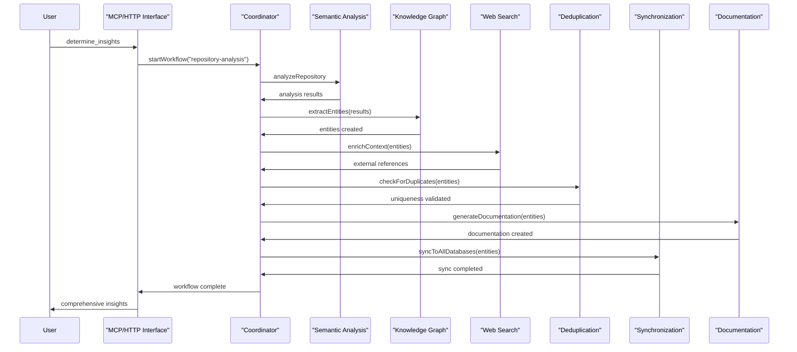
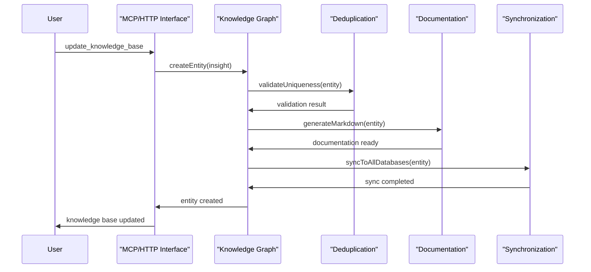
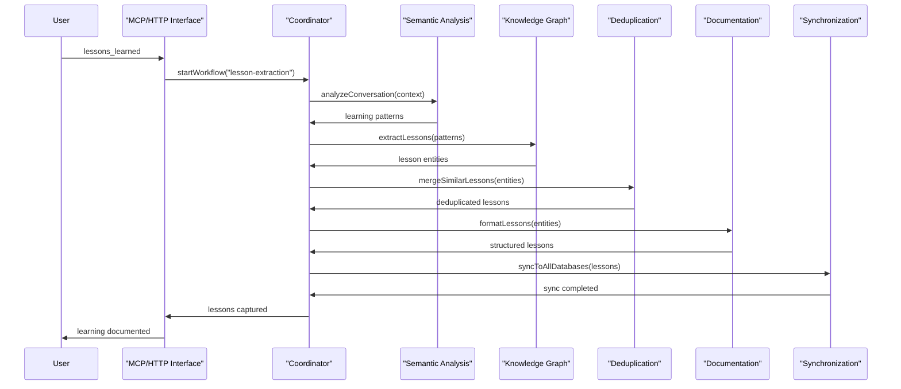

# Unified 7-Agent System Architecture

## Overview

The unified semantic analysis system consists of **7 specialized agents** that work together to provide comprehensive code analysis, knowledge extraction, and intelligent insights. This same agent system serves both Claude Code (via MCP tools) and GitHub CoPilot (via VSCode integration), ensuring consistent analysis quality regardless of the AI coding assistant being used.

## Agent System Philosophy

### 1. **Single Agent Infrastructure**
- All AI coding assistants use the **same agents**
- Consistent analysis algorithms and logic
- Shared knowledge base and insights
- Unified command interface

### 2. **Specialized Agent Roles**
- Each agent has a specific responsibility
- Agents communicate via MQTT for async operations
- JSON-RPC for synchronous method calls
- Coordinator orchestrates complex workflows

### 3. **Fault Tolerance & Resilience**
- Agents can operate independently when others fail
- Graceful degradation of functionality
- Automatic recovery and retry mechanisms
- Health monitoring and diagnostics

## 7-Agent Architecture


### 1. Coordinator Agent
**Role**: Workflow orchestration and management
**Responsibilities**:
- Start and manage complex multi-agent workflows
- Track progress and handle errors
- Coordinate between different agents
- Provide status reporting and monitoring

```typescript
interface CoordinatorAgent {
  startWorkflow(type: WorkflowType, params: WorkflowParams): Promise<WorkflowResult>;
  getWorkflowStatus(workflowId: string): Promise<WorkflowStatus>;
  scheduleTask(task: ScheduledTask): Promise<TaskSchedule>;
  cancelWorkflow(workflowId: string): Promise<void>;
}
```

### 2. Semantic Analysis Agent
**Role**: Core code and conversation analysis
**Responsibilities**:
- Repository commit analysis
- Conversation log processing  
- Pattern recognition in code changes
- Significance scoring and classification

```typescript
interface SemanticAnalysisAgent {
  analyzeRepository(params: RepoAnalysisParams): Promise<AnalysisResult>;
  analyzeConversation(params: ConversationParams): Promise<ConversationInsights>;
  extractPatterns(code: string[]): Promise<CodePattern[]>;
  scoreSignificance(change: CodeChange): Promise<number>;
}
```

### 3. Knowledge Graph Agent
**Role**: Entity and relationship management
**Responsibilities**:
- Extract structured entities from analysis
- Create and manage relationships
- Maintain graph structure integrity
- Handle entity lifecycle operations

```typescript
interface KnowledgeGraphAgent {
  createEntity(entity: KnowledgeEntity): Promise<EntityResult>;
  createRelationship(from: string, to: string, type: string): Promise<RelationshipResult>;
  updateEntity(id: string, updates: Partial<KnowledgeEntity>): Promise<EntityResult>;
  searchEntities(query: SearchQuery): Promise<EntitySearchResult[]>;
}
```

### 4. Web Search Agent
**Role**: External documentation and research
**Responsibilities**:
- Search technical documentation
- Find relevant external resources
- Validate technical claims
- Enrich context with external knowledge

```typescript
interface WebSearchAgent {
  searchTechnicalDocs(technology: string, topic: string): Promise<DocumentationResult[]>;
  searchWeb(query: string, domains?: string[]): Promise<WebSearchResult[]>;
  validateTechnicalClaim(claim: string): Promise<ValidationResult>;
  enrichContext(entities: KnowledgeEntity[]): Promise<EnrichedEntity[]>;
}
```

### 5. SynchronizationAgent (CRITICAL)
**Role**: Single source of truth for data integrity
**Responsibilities**:
- Ensure consistency across all databases
- Handle conflict resolution
- Manage multi-database synchronization
- Provide atomic operations across storage systems

```typescript
interface SynchronizationAgent {
  syncToAllDatabases(entity: KnowledgeEntity): Promise<SyncResult>;
  resolveConflicts(conflicts: EntityConflict[]): Promise<ConflictResolution>;
  validateConsistency(): Promise<ConsistencyReport>;
  performRecoverySync(): Promise<RecoveryResult>;
}
```

### 6. Deduplication Agent
**Role**: Prevent duplicate insights and maintain quality
**Responsibilities**:
- Detect similar or duplicate entities
- Prevent redundant knowledge creation
- Merge similar insights
- Maintain knowledge base quality

```typescript
interface DeduplicationAgent {
  checkForDuplicates(entity: KnowledgeEntity): Promise<DuplicateCheckResult>;
  findSimilarEntities(entity: KnowledgeEntity): Promise<SimilarityResult[]>;
  mergeEntities(entities: KnowledgeEntity[]): Promise<MergedEntity>;
  validateUniqueness(entities: KnowledgeEntity[]): Promise<UniquenessReport>;
}
```

### 7. Documentation Agent
**Role**: Create structured documentation and reports
**Responsibilities**:
- Generate markdown documentation
- Create diagrams and visualizations
- Format insights consistently
- Maintain documentation templates

```typescript
interface DocumentationAgent {
  generateMarkdown(entity: KnowledgeEntity): Promise<string>;
  createDiagram(type: DiagramType, data: any): Promise<DiagramResult>;
  formatInsight(insight: RawInsight): Promise<FormattedInsight>;
  applyTemplate(templateName: string, data: any): Promise<string>;
}
```

## Agent Communication Architecture

### MQTT Message Bus (Asynchronous)
```
Topic Structure:
- agents/semantic/analysis/request
- agents/knowledge/entity/created
- agents/web/search/completed
- agents/sync/conflict/detected
- agents/coordinator/workflow/status
```

### JSON-RPC Server (Synchronous)
```
Method Structure:
- coordinator.startWorkflow
- semantic.analyzeRepository
- knowledge.createEntity
- sync.resolveConflicts
- documentation.generateMarkdown
```

## Unified Command Workflows

### 1. "determine_insights" Workflow



### 2. "update_knowledge_base" Workflow



### 3. "lessons_learned" Workflow



## Infrastructure Components

### MQTT Broker
```yaml
# Configuration
broker:
  host: localhost
  port: 1883
  keepalive: 60
  qos: 1
  retain: false
  
topics:
  agents: agents/+/+/+
  workflows: workflows/+/+
  health: health/+
```

### JSON-RPC Server
```yaml
# Configuration
rpc:
  host: localhost
  port: 8080
  timeout: 30000
  maxConcurrent: 10
  
methods:
  - coordinator.*
  - semantic.*
  - knowledge.*
  - sync.*
  - documentation.*
```

### Health Monitoring
```typescript
interface AgentHealth {
  agentId: string;
  status: 'healthy' | 'degraded' | 'unhealthy';
  lastHeartbeat: string;
  capabilities: string[];
  performance: {
    avgResponseTime: number;
    requestCount: number;
    errorRate: number;
  };
}

interface SystemHealth {
  overall: 'healthy' | 'degraded' | 'unhealthy';
  agents: AgentHealth[];
  infrastructure: {
    mqtt: { status: string; latency: number };
    rpc: { status: string; latency: number };
  };
  lastCheck: string;
}
```

## Agent Configuration

### Global Configuration
```yaml
# semantic-analysis-system/config/agents.yaml
agents:
  coordinator:
    enabled: true
    maxConcurrentWorkflows: 5
    defaultTimeout: 300000
    
  semantic:
    enabled: true
    analysisDepth: 10
    significanceThreshold: 7
    
  knowledge:
    enabled: true
    maxEntitiesPerBatch: 50
    validationStrict: true
    
  web:
    enabled: true
    searchTimeout: 10000
    maxResults: 20
    allowedDomains: ["docs.", "github.com", "stackoverflow.com"]
    
  synchronization:
    enabled: true
    adapters:
      mcp: true
      graphology: true
      file: true
    conflictResolution: timestamp_wins
    
  deduplication:
    enabled: true
    similarityThreshold: 0.8
    mergeStrategy: preserve_both
    
  documentation:
    enabled: true
    templates: ["insight", "pattern", "lesson"]
    outputFormat: markdown
```

### Individual Agent Configuration
```yaml
# semantic-analysis-system/config/semantic-agent.yaml
semantic:
  analysis:
    patterns:
      enabled: true
      minSignificance: 5
    conversations:
      enabled: true
      contextWindow: 1000
    repository:
      commitDepth: 20
      fileTypes: [".js", ".ts", ".py", ".md"]
  
  scoring:
    significance:
      architecture: 9-10
      patterns: 7-9
      bugs: 4-6
      style: 1-3
```

## Deployment Architecture

### Single Machine Deployment
```yaml
# docker-compose.yml
version: '3.8'
services:
  mqtt-broker:
    image: eclipse-mosquitto:2.0
    ports:
      - "1883:1883"
      
  agent-system:
    build: ./semantic-analysis-system
    depends_on:
      - mqtt-broker
    environment:
      - MQTT_BROKER=mqtt://mqtt-broker:1883
      - RPC_PORT=8080
      - ANTHROPIC_API_KEY=${ANTHROPIC_API_KEY}
    volumes:
      - ./shared-memory.json:/app/shared-memory.json
      - ./logs:/app/logs
```

### Distributed Deployment
```yaml
# Each agent can run on separate machines
coordinator:
  image: semantic-analysis/coordinator
  environment:
    - MQTT_BROKER=mqtt://broker.example.com:1883
    - AGENT_ID=coordinator-01
    
semantic:
  image: semantic-analysis/semantic
  environment:
    - MQTT_BROKER=mqtt://broker.example.com:1883
    - AGENT_ID=semantic-01
    - ANTHROPIC_API_KEY=${ANTHROPIC_API_KEY}
```

## Performance and Scaling

### Performance Metrics
```typescript
interface PerformanceMetrics {
  agents: Record<string, {
    requestsPerSecond: number;
    avgResponseTime: number;
    errorRate: number;
    memoryUsage: number;
    cpuUsage: number;
  }>;
  workflows: {
    avgCompletionTime: number;
    successRate: number;
    concurrent: number;
  };
  communication: {
    mqttLatency: number;
    rpcLatency: number;
    messageRate: number;
  };
}
```

### Scaling Strategies
1. **Horizontal Scaling**: Run multiple instances of resource-intensive agents
2. **Load Balancing**: Distribute requests across agent instances
3. **Caching**: Cache frequently accessed entities and results
4. **Async Processing**: Use MQTT for non-blocking operations

## Troubleshooting

### Common Issues

#### 1. Agent Communication Failures
**Symptoms**: Agents not responding, workflow timeouts
**Diagnosis**:
```bash
# Check MQTT broker
mosquitto_sub -t "agents/+/+/+"
# Check agent health
curl http://localhost:8080/health
```

#### 2. Synchronization Conflicts
**Symptoms**: Inconsistent data across databases
**Diagnosis**:
```bash
# Check sync agent status
curl http://localhost:8765/api/sync/status
# Review conflict logs
tail -f logs/synchronization.log
```

#### 3. Performance Degradation
**Symptoms**: Slow response times, high resource usage
**Diagnosis**:
```bash
# Monitor system metrics
get_system_status
# Check agent performance
@KM system metrics
```

## Testing

### Integration Testing
```typescript
describe('7-Agent System Integration', () => {
  it('should complete full workflow', async () => {
    const workflow = await coordinator.startWorkflow('repository-analysis', {
      repository: './test-repo',
      depth: 5
    });
    
    const result = await coordinator.waitForCompletion(workflow.id);
    
    expect(result.status).toBe('completed');
    expect(result.entities).toHaveLength(3);
    expect(result.insights).toHaveLength(2);
  });
});
```

### Load Testing
```typescript
describe('Agent System Load Tests', () => {
  it('should handle concurrent workflows', async () => {
    const workflows = await Promise.all(
      Array(10).fill(null).map(() => 
        coordinator.startWorkflow('repository-analysis', testParams)
      )
    );
    
    const results = await Promise.all(
      workflows.map(w => coordinator.waitForCompletion(w.id))
    );
    
    expect(results.every(r => r.status === 'completed')).toBe(true);
  });
});
```

## See Also

- [SynchronizationAgent Details](synchronization-agent.md)
- [MCP Server Setup](mcp-server-setup.md)
- [Unified System Overview](../../architecture/unified-system-overview.md)
- [Agent Communication Protocols](agent-communication.md)