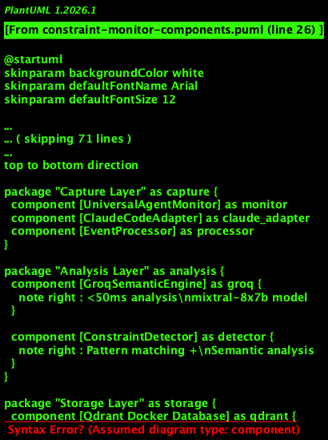
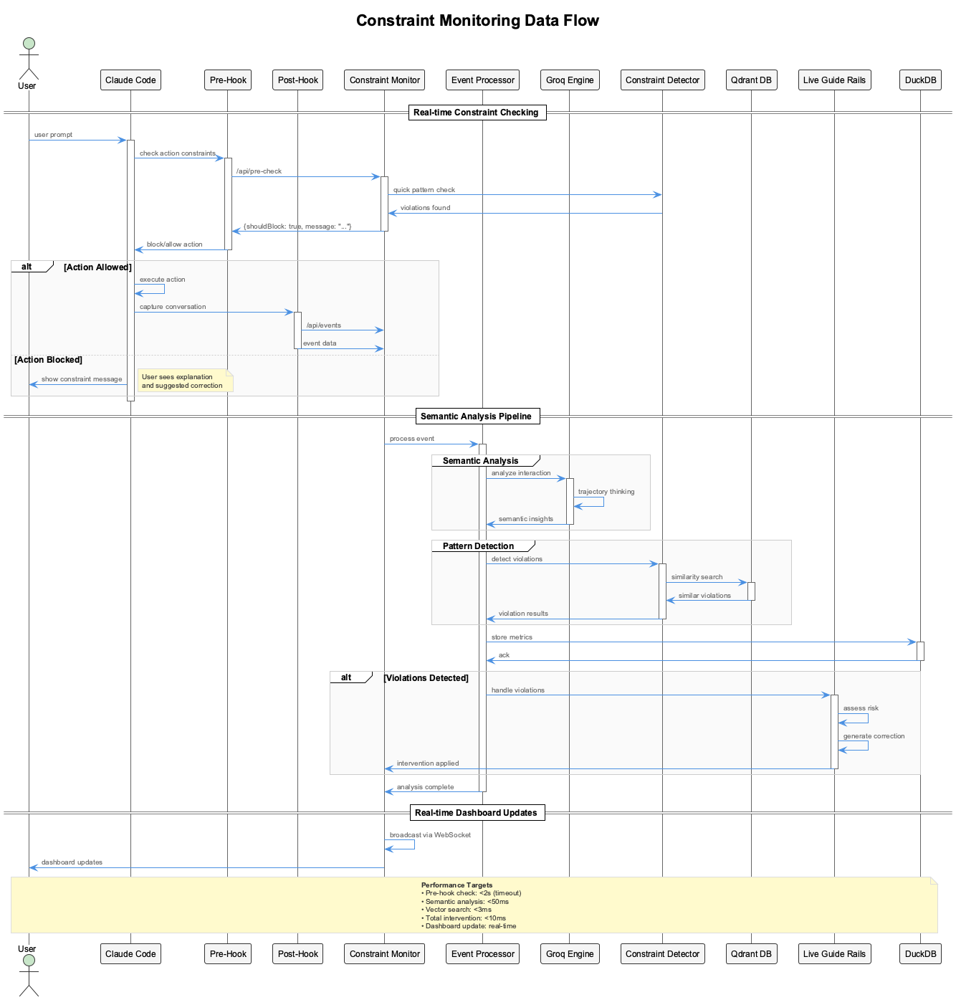

# Constraints - Code Quality Enforcement

Real-time code quality enforcement through PreToolUse hooks that block violations before execution.

## What It Does

The Constraint Monitoring System provides **real-time enforcement** of coding standards through hook interception:

- **PreToolUse Hook Enforcement** - Blocks violations BEFORE tool execution
- **18 Active Constraints** - Security, architecture, code quality, PlantUML, documentation
- **Severity-Based Enforcement** - CRITICAL/ERROR blocks, WARNING/INFO allows with feedback
- **Compliance Scoring** - Real-time scoring (0-10) with violation impact tracking
- **Dashboard Monitoring** - Live violation feed, trends, and compliance metrics at `http://localhost:3030`
- **LSL Integration** - All interactions logged via PostToolUse hooks for analysis

## Architecture

### Hook Integration Flow


The system uses **two hook types** working together:

1. **PreToolUse Hooks** → Constraint enforcement (blocks BEFORE execution)
2. **PostToolUse Hooks** → LSL logging (captures AFTER execution)

### System Components



**Directory Structure**:
```
integrations/mcp-constraint-monitor/
  src/
    hooks/
      pre-tool-hook-wrapper.js        # PreToolUse entry point
      real-time-constraint-hook.js    # Core enforcement logic
    enforcement/
      ConstraintEnforcer.js           # Main enforcement engine
      PatternMatcher.js               # Regex pattern matching
      ComplianceCalculator.js         # Scoring and metrics
    dashboard/
      api/                             # REST API (port 3031)
      ui/                              # Next.js dashboard (port 3030)
  constraints.yaml                     # 18 constraint definitions
  test-all-constraints-comprehensive.js    # Automated testing
  INTERACTIVE-TEST-PROMPTS.md              # Manual test scenarios
```

**Hook Configuration** (`~/.claude/settings.json`):
```json
{
  "hooks": {
    "PreToolUse": [
      {
        "matcher": "*",
        "hooks": [{
          "type": "command",
          "command": "node /path/to/coding/integrations/mcp-constraint-monitor/src/hooks/pre-tool-hook-wrapper.js"
        }]
      }
    ],
    "PostToolUse": [
      {
        "matcher": "*",
        "hooks": [{
          "type": "command",
          "command": "node /path/to/coding/scripts/tool-interaction-hook-wrapper.js"
        }]
      }
    ]
  }
}
```

## 18 Active Constraints

### Security (2 constraints) - 100% Detection ✅

| Constraint ID | Severity | Description |
|---------------|----------|-------------|
| `no-hardcoded-secrets` | CRITICAL | Detects hardcoded API keys, secrets, tokens |
| `no-eval-usage` | CRITICAL | Prevents dynamic code execution |

### Architecture (3 constraints) - 100% Detection ✅

| Constraint ID | Severity | Description |
|---------------|----------|-------------|
| `no-parallel-files` | CRITICAL | Prevents version suffixes (v2, enhanced, improved) |
| `debug-not-speculate` | ERROR | Requires concrete debugging over speculation |
| `no-evolutionary-names` | ERROR | Prevents evolutionary naming (fixed, patched, modified) |

### Code Quality (5 constraints) - 20% Detection ⚠️

| Constraint ID | Severity | Status |
|---------------|----------|--------|
| `proper-error-handling` | ERROR | ✅ Detected |
| `no-console-log` | WARNING | ❌ Pattern needs refinement |
| `no-var-declarations` | WARNING | ❌ Pattern needs refinement |
| `proper-function-naming` | INFO | ❌ Pattern needs refinement |
| `no-magic-numbers` | INFO | ❌ Pattern needs refinement |

### PlantUML (5 constraints) - 40% Detection ⚠️

| Constraint ID | Severity | Status |
|---------------|----------|--------|
| `plantuml-standard-styling` | ERROR | ✅ Detected |
| `plantuml-file-organization` | INFO | ✅ Detected |
| `plantuml-file-location` | WARNING | ❌ Pattern needs refinement |
| `plantuml-diagram-workflow` | INFO | ❌ Pattern needs refinement |
| `plantuml-readability-guidelines` | INFO | ❌ Pattern needs refinement |

### Documentation (3 constraints) - 0% Detection ❌

All documentation constraints need pattern refinement:
- `image-reference-pattern` (WARNING)
- `documentation-filename-format` (INFO)
- `update-main-readme` (INFO)

**Overall Detection Rate: 8/18 (44%)**
**Critical/Error Blocking: 100% effective** ✅

## How It Works

### 1. Tool Call Interception




When Claude attempts a tool call:

1. **PreToolUse Hook Fires**: Before tool execution begins
2. **Constraint Check**: Analyzes tool parameters against 18 active constraints
3. **Pattern Matching**: Regex patterns detect violations
4. **Severity Evaluation**: Determines enforcement action based on severity
5. **Decision**:
   - **CRITICAL/ERROR**: 🛑 **BLOCK** - Tool call prevented, exit code 1
   - **WARNING/INFO**: ⚠️ **ALLOW** - Tool call proceeds with feedback, exit code 0
6. **Dashboard Logging**: Violation logged via API POST to dashboard
7. **PostToolUse Hook**: LSL logs complete interaction (if tool executed)

### 2. Severity Levels & Enforcement

| Severity | Compliance Impact | Enforcement | Exit Code | Tool Call |
|----------|-------------------|-------------|-----------|-----------|
| **CRITICAL** | -3.0 | 🛑 **BLOCK** | 1 | Prevented |
| **ERROR** | -2.0 | 🛑 **BLOCK** | 1 | Prevented |
| **WARNING** | -1.0 | ⚠️ **ALLOW** | 0 | Proceeds with warning |
| **INFO** | -0.5 | ℹ️ **ALLOW** | 0 | Proceeds with info |

### 3. Compliance Score Calculation

**Algorithm**:
- Start with perfect score of 10.0
- Subtract points based on violation severity:
  - CRITICAL: -3.0 points
  - ERROR: -2.0 points
  - WARNING: -1.0 points
  - INFO: -0.5 points
- Clamp result between 0 and 10

### 4. Violation Response Examples

**Critical/Error (Blocked)**:
```
🚫 **CONSTRAINT VIOLATION DETECTED - EXECUTION BLOCKED**

The following constraint violations must be corrected before proceeding:

**1. CRITICAL: No hardcoded secrets allowed**
   Pattern detected in file_path parameter

**Suggestion:**
Use environment variables instead:
const API_KEY = process.env.API_KEY;

**Compliance Impact:** Score reduced from 10.0 to 7.0

View detailed information: http://localhost:3030
LOGGED TO DASHBOARD [coding]: no-hardcoded-secrets (critical)
```

**Warning/Info (Allowed)**:
```
⚠️ **CONSTRAINT WARNING**

**1. WARNING: Avoid console.log in production code**
   Use Logger.log() instead for structured logging

**Compliance Score:** 9.0/10.0

View details: http://localhost:3030
LOGGED TO DASHBOARD [coding]: no-console-log (warning)

✅ Tool call proceeding with warning
```

## Dashboard & Monitoring

### Dashboard UI (Port 3030)

**Start Dashboard**:
```bash
cd /Users/q284340/Agentic/coding/integrations/mcp-constraint-monitor
PORT=3030 npm run dashboard
```

**URL**: `http://localhost:3030`

**Features**:
- **Real-time Violation Feed**: Live updates as violations occur
- **Compliance Score Gauge**: Visual 0-10 scoring with trend indicators
- **7-Day Trend Chart**: Historical compliance tracking
- **Project Selector**: Filter by project (coding, curriculum-alignment, nano-degree)
- **Constraint Toggles**: Enable/disable constraints dynamically
- **Risk Level Indicators**: Visual severity classification

### API Server (Port 3031)

**Start API**:
```bash
cd /Users/q284340/Agentic/coding/integrations/mcp-constraint-monitor
PORT=3031 npm run api
```

**Key Endpoints**:

| Endpoint | Method | Description |
|----------|--------|-------------|
| `/api/violations` | GET | List violations (with `?project=` filter) |
| `/api/violations` | POST | Log new violation |
| `/api/health` | GET | Server health check |
| `/api/compliance/:project` | GET | Get compliance score for project |
| `/api/constraints` | GET | List all enabled constraints |

**Example**:
```bash
# Get violations for coding project
curl http://localhost:3031/api/violations?project=coding

# Response includes violations with severity, compliance score, and summary stats
```

## Testing


### Automated Testing

**Script**: `test-all-constraints-comprehensive.js`

Tests all 18 constraints by calling hook functions directly:

```bash
cd /Users/q284340/Agentic/coding/integrations/mcp-constraint-monitor
node test-all-constraints-comprehensive.js
```

**Output Summary**:
- Constraints tested: 18/18
- Violations detected: 8
- Violations blocked: 8
- Pattern fixes needed: 10

**Test Results**:
- **Detection Rate**: 8/18 (44%)
- **Blocking Accuracy**: 100% (all detected violations blocked correctly)
- **False Positives**: 0
- **Response Time**: <50ms per check

### Interactive Testing

**Guide**: `INTERACTIVE-TEST-PROMPTS.md`

Real Claude Code sessions with live hook interception:

```bash
# 1. Start Claude session
coding --claude

# 2. Issue test prompts from INTERACTIVE-TEST-PROMPTS.md
# Example: Test hardcoded secret detection

# 3. Collect results from LSL transcripts
node collect-test-results.js
```

**Evidence Captured**:
- User's test prompt
- Hook interception message
- Blocking vs. allowing decision
- Claude's adaptive response
- Dashboard logging confirmation

## Installation

Hooks are automatically installed via `./install.sh`:

```bash
cd /Users/q284340/Agentic/coding
./install.sh
```

**What gets installed**:
1. ✅ PreToolUse hook → constraint enforcement
2. ✅ PostToolUse hook → LSL logging
3. ✅ Hook configuration merged into `~/.claude/settings.json`
4. ✅ Backup created before modification

## Configuration

### Constraint Definitions

**File**: `integrations/mcp-constraint-monitor/constraints.yaml`

**Example Constraint**:
```yaml
- id: no-hardcoded-secrets
  group: security
  pattern: 'API_KEY|SECRET|TOKEN pattern here'
  message: 'CRITICAL: Potential hardcoded secret detected'
  severity: critical
  enabled: true
  suggestion: Use environment variables instead
```

### Enable/Disable Constraints

Edit `constraints.yaml` and set `enabled: false` for any constraint:

```yaml
- id: no-console-log
  enabled: false  # Disable this constraint
```

## Key Files

**Core System**:
- `integrations/mcp-constraint-monitor/src/hooks/pre-tool-hook-wrapper.js` - PreToolUse hook entry
- `integrations/mcp-constraint-monitor/src/enforcement/ConstraintEnforcer.js` - Enforcement engine
- `integrations/mcp-constraint-monitor/constraints.yaml` - Constraint definitions

**Dashboard**:
- `integrations/mcp-constraint-monitor/src/dashboard/api/` - REST API (port 3031)
- `integrations/mcp-constraint-monitor/src/dashboard/ui/` - Next.js UI (port 3030)

**Testing**:
- `integrations/mcp-constraint-monitor/test-all-constraints-comprehensive.js` - Automated tests
- `integrations/mcp-constraint-monitor/INTERACTIVE-TEST-PROMPTS.md` - Manual test scenarios
- `integrations/mcp-constraint-monitor/collect-test-results.js` - LSL evidence collector

## Integration

**Related Systems**:
- [LSL](../lsl/) - PostToolUse hooks log all constraint interactions
- [Health System](../health-system/) - Monitors constraint monitor service health
- [Trajectories](../trajectories/) - Status line shows compliance score with trajectory state

**Status Line Display**: `[🛡️ {compliance}% {trajectory}]`

Example: `[🛡️ 94% ⚙️ IMP]` shows 94% constraint compliance and "implementing" trajectory state.

## See Also

- [MCP Constraint Monitor Integration](../../integrations/mcp-constraint-monitor/README.md) - Integration details
- [Testing Guide](../../integrations/mcp-constraint-monitor/TESTING.md) - Complete testing documentation
