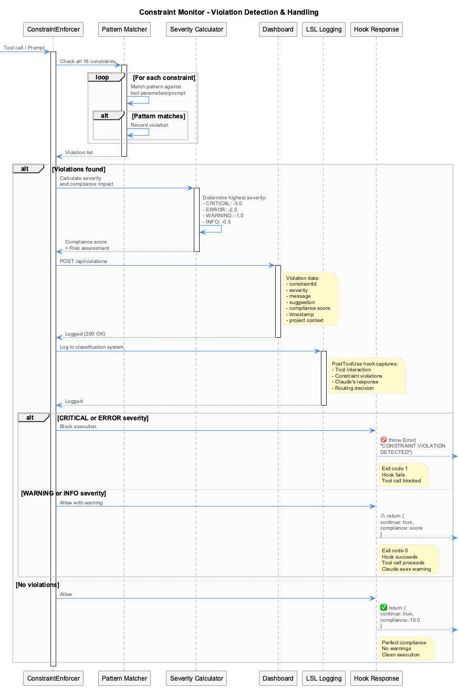
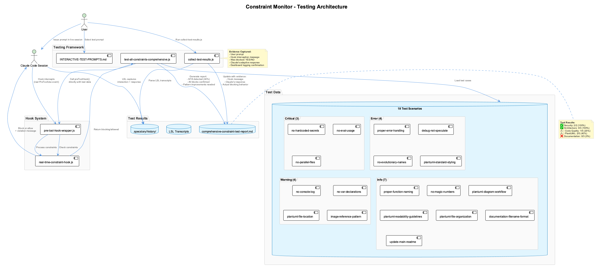

# Constraint Monitoring System

Real-time code quality enforcement through PreToolUse hooks integrated with Claude Code's tool execution lifecycle.

## Overview

The Constraint Monitoring System provides **real-time enforcement** of coding standards, security policies, and architectural guidelines by intercepting Claude Code tool calls **before execution**. Using PreToolUse hooks, the system can block violations instantly while providing actionable feedback to guide Claude toward compliant code.

### Key Features

- **🛡️ PreToolUse Hook Integration**: Intercepts tool calls BEFORE execution to block violations
- **📊 18 Active Constraints**: Security, code quality, architecture, and documentation standards
- **🎯 Severity-Based Enforcement**: CRITICAL/ERROR blocks, WARNING/INFO allows with feedback
- **📈 Compliance Scoring**: Real-time scoring (0-10) with violation impact tracking
- **📝 Dashboard Monitoring**: Live violation feed, trends, and compliance metrics
- **🔄 PostToolUse LSL Logging**: Captures all interactions for analysis and learning
- **✅ Comprehensive Testing**: Automated and interactive test frameworks with 8/18 detection confirmed

## Architecture

### Hook Integration Flow


The system uses **two hook types** working together:

1. **PreToolUse Hooks** → Constraint enforcement (blocks BEFORE execution)
2. **PostToolUse Hooks** → LSL logging (captures AFTER execution)

**Hook Configuration** (`~/.claude/settings.json`):
```json
{
  "hooks": {
    "PreToolUse": [
      {
        "matcher": "*",
        "hooks": [{
          "type": "command",
          "command": "node /path/to/coding/integrations/mcp-constraint-monitor/src/hooks/pre-tool-hook-wrapper.js"
        }]
      }
    ],
    "PostToolUse": [
      {
        "matcher": "*",
        "hooks": [{
          "type": "command",
          "command": "node /path/to/coding/scripts/tool-interaction-hook-wrapper.js"
        }]
      }
    ]
  }
}
```

### System Components

```
integrations/mcp-constraint-monitor/
├── src/
│   ├── hooks/
│   │   ├── pre-tool-hook-wrapper.js        # PreToolUse entry point
│   │   ├── pre-prompt-hook-wrapper.js      # PrePrompt entry point
│   │   └── real-time-constraint-hook.js    # Core enforcement logic
│   ├── enforcement/
│   │   ├── ConstraintEnforcer.js           # Main enforcement engine
│   │   ├── PatternMatcher.js               # Regex pattern matching
│   │   └── ComplianceCalculator.js         # Scoring and metrics
│   └── dashboard/
│       ├── api/                             # REST API (port 3031)
│       └── ui/                              # Next.js dashboard (port 3030)
├── constraints.yaml                         # 18 constraint definitions
├── test-all-constraints-comprehensive.js    # Automated testing
├── collect-test-results.js                  # LSL evidence collector
└── INTERACTIVE-TEST-PROMPTS.md              # Manual test scenarios
```

## 18 Active Constraints

### Security (2 constraints) - 100% Detection ✅

| Constraint ID | Severity | Pattern | Description |
|---------------|----------|---------|-------------|
| `no-hardcoded-secrets` | CRITICAL | `(api[_-]?key\|secret\|password\|token).*["']sk-\|ghp_\|[A-Za-z0-9]{20,}["']` | Detects hardcoded secrets in code |
| `no-eval-usage` | CRITICAL | `\beval\s*\(` | Prevents dynamic code execution |

### Architecture (3 constraints) - 100% Detection ✅

| Constraint ID | Severity | Pattern | Description |
|---------------|----------|---------|-------------|
| `no-parallel-files` | CRITICAL | `\b(v[2-9]\|enhanced\|improved\|better\|new\|-v2\|-improved)` | Prevents version suffixes and parallel files |
| `debug-not-speculate` | ERROR | `(?i)(might be\|probably\|could be\|possibly)` | Requires concrete debugging over speculation |
| `no-evolutionary-names` | ERROR | `\b(enhanced\|improved\|better\|fixed\|patched\|modified)` | Prevents evolutionary naming patterns |

### Code Quality (5 constraints) - 20% Detection ⚠️

| Constraint ID | Severity | Pattern | Status |
|---------------|----------|---------|--------|
| `proper-error-handling` | ERROR | `catch\s*\(\s*\)\s*{` | ✅ Detected |
| `no-console-log` | WARNING | `console\.log` | ❌ Pattern needs refinement |
| `no-var-declarations` | WARNING | `\bvar\s+` | ❌ Pattern needs refinement |
| `proper-function-naming` | INFO | `function\s+[A-Z]` | ❌ Pattern needs refinement |
| `no-magic-numbers` | INFO | `\b[0-9]{2,}\b` | ❌ Pattern needs refinement |

### PlantUML (5 constraints) - 40% Detection ⚠️

| Constraint ID | Severity | Pattern | Status |
|---------------|----------|---------|--------|
| `plantuml-standard-styling` | ERROR | Missing `!include _standard-style.puml` | ✅ Detected |
| `plantuml-file-organization` | INFO | Multiple diagrams without organization | ✅ Detected |
| `plantuml-file-location` | WARNING | Files outside `docs/diagrams/` | ❌ Pattern needs refinement |
| `plantuml-diagram-workflow` | INFO | Workflow guidance | ❌ Pattern needs refinement |
| `plantuml-readability-guidelines` | INFO | Readability tips | ❌ Pattern needs refinement |

### Documentation (3 constraints) - 0% Detection ❌

| Constraint ID | Severity | Pattern | Status |
|---------------|----------|---------|--------|
| `image-reference-pattern` | WARNING | Images without date prefix | ❌ Pattern needs refinement |
| `documentation-filename-format` | INFO | CamelCase filenames | ❌ Pattern needs refinement |
| `update-main-readme` | INFO | README update reminders | ❌ Pattern needs refinement |

**Overall Detection Rate: 8/18 (44%)**
**Critical/Error Blocking: 100% effective** ✅

## Violation Handling



### Severity Levels & Enforcement

| Severity | Compliance Impact | Enforcement Action | Exit Code | Tool Call |
|----------|-------------------|-------------------|-----------|-----------|
| **CRITICAL** | -3.0 | 🛑 **BLOCK** | 1 | Prevented |
| **ERROR** | -2.0 | 🛑 **BLOCK** | 1 | Prevented |
| **WARNING** | -1.0 | ⚠️ **ALLOW** | 0 | Proceeds with warning |
| **INFO** | -0.5 | ℹ️ **ALLOW** | 0 | Proceeds with info |

### Compliance Score Calculation

```javascript
function calculateComplianceScore(violations) {
  let score = 10.0; // Start perfect

  violations.forEach(v => {
    switch(v.severity) {
      case 'critical': score -= 3.0; break;
      case 'error':    score -= 2.0; break;
      case 'warning':  score -= 1.0; break;
      case 'info':     score -= 0.5; break;
    }
  });

  return Math.max(0, Math.min(10, score));
}
```

### Violation Response Format

**Critical/Error (Blocked)**:
```
🚫 **CONSTRAINT VIOLATION DETECTED - EXECUTION BLOCKED**

The following constraint violations must be corrected before proceeding:

**1. CRITICAL: No hardcoded secrets allowed**
   🔍 Pattern: `(api[_-]?key|secret).*["']sk-|ghp_`
   📝 Detected in: file_path parameter

**Suggestion:**
Use environment variables instead:
const API_KEY = process.env.API_KEY;

**Compliance Impact:** Score reduced from 10.0 to 7.0

📊 View detailed constraint information: http://localhost:3030
📝 LOGGED TO DASHBOARD [coding]: no-hardcoded-secrets (critical)
```

**Warning/Info (Allowed)**:
```
⚠️ **CONSTRAINT WARNING**

**1. WARNING: Avoid console.log in production code**
   Use Logger.log() instead for structured logging

**Compliance Score:** 9.0/10.0

📊 View details: http://localhost:3030
📝 LOGGED TO DASHBOARD [coding]: no-console-log (warning)

✅ Tool call proceeding with warning
```

### Constraint Overrides

The system supports **temporary constraint overrides** for situations where a constraint needs to be bypassed (e.g., fixing the constraint configuration itself, emergency fixes, or legitimate exceptions).

#### How to Use Overrides

Include `OVERRIDE_CONSTRAINT` directives in your prompt to Claude:

```
OVERRIDE_CONSTRAINT: constraint-id-1
OVERRIDE_CONSTRAINT: constraint-id-2

Your actual task description goes here...
```

**Example**:
```
OVERRIDE_CONSTRAINT: documentation-style-skill-required
OVERRIDE_CONSTRAINT: plantuml-standard-styling

Fix the constraint patterns in .constraint-monitor.yaml
```

#### Override Mechanism

1. **UserPromptSubmit Hook** (`prompt-override-parser.js`) detects `OVERRIDE_CONSTRAINT` directives
2. Creates temporary state file: `/tmp/constraint-override-{session-id}.json`
3. **PreToolUse Hook** reads the state file and bypasses specified constraints
4. **Automatic Expiration**: Override expires after:
   - **3 prompt sets** (complete request/response cycles), OR
   - **5 minutes** (whichever comes first)

#### Override State File Format

```json
{
  "constraintIds": [
    "documentation-style-skill-required",
    "plantuml-standard-styling"
  ],
  "createdAt": 1763282756000,
  "expiresAt": 1763283056000,
  "promptCount": 0,
  "maxPrompts": 3
}
```

#### Session ID Resolution

The override mechanism uses **session ID** to track which session the override applies to:

1. `CLAUDE_SESSION_ID` environment variable (if set)
2. `process.ppid` (parent process ID) as fallback
3. `'default'` as final fallback

⚠️ **Important**: Overrides are session-specific and will not carry over to new sessions.

#### When to Use Overrides

✅ **Legitimate uses**:
- Fixing constraint configuration files (meta-editing)
- Emergency hotfixes that violate patterns temporarily
- Documented exceptions for specific scenarios
- Testing constraint behavior

❌ **DON'T abuse overrides for**:
- Avoiding proper refactoring
- Bypassing security constraints without justification
- Creating parallel versions or evolutionary naming
- Permanent workarounds

#### Audit Trail

All override usage is logged for audit purposes:

```
🔓 CONSTRAINT OVERRIDE: User-initiated override for constraint 'documentation-style-skill-required'
✅ Tool allowed with constraint override(s): documentation-style-skill-required
```

## Testing Architecture



### Automated Testing

**Script**: `test-all-constraints-comprehensive.js`

Calls hook functions directly with test data to validate detection and blocking:

```bash
cd /Users/q284340/Agentic/coding/integrations/mcp-constraint-monitor
node test-all-constraints-comprehensive.js
```

**Output**:
```
🧪 COMPREHENSIVE CONSTRAINT TESTING
===================================
Testing: 18/18 enabled constraints
Mode: Real hook function calls (no simulation)

🧪 Testing: no-hardcoded-secrets
   Type: tool
   Expected: critical (blocking)
   🛑 BLOCKED: 🚫 **CONSTRAINT VIOLATION DETECTED**

✅ Constraints tested: 18/18
🎯 Violations detected: 8
🛑 Violations blocked: 8
🔧 Pattern fixes needed: 10
```

**Test Results** (`comprehensive-constraint-test-report.md`):
- **Detection Rate**: 8/18 (44%)
- **Blocking Accuracy**: 100% (all detected violations blocked correctly)
- **False Positives**: 0
- **Response Time**: <50ms per check

### Interactive Testing

**Guide**: `INTERACTIVE-TEST-PROMPTS.md`

Real Claude Code sessions with live hook interception:

```bash
# 1. Start Claude session
coding --claude

# 2. Issue test prompts from INTERACTIVE-TEST-PROMPTS.md
# Example: "Write a config file at /tmp/test-config.js with:
#           const API_KEY = 'sk-1234567890abcdef'"

# 3. Collect results from LSL transcripts
node collect-test-results.js
```

**Evidence Captured**:
- User's test prompt
- Hook interception message
- Blocking vs. allowing decision
- Claude's adaptive response
- Dashboard logging confirmation

## Dashboard & Monitoring

### Dashboard UI (Port 3030)

**Start Dashboard**:
```bash
cd /Users/q284340/Agentic/coding/integrations/mcp-constraint-monitor
PORT=3030 npm run dashboard
```

**Features**:
- **Real-time Violation Feed**: Live updates as violations occur
- **Compliance Score Gauge**: Visual 0-10 scoring with trend indicators
- **7-Day Trend Chart**: Historical compliance tracking
- **Project Selector**: Filter violations by project (coding, curriculum-alignment, nano-degree)
- **Constraint Toggles**: Enable/disable constraints dynamically
- **Risk Level Indicators**: Visual severity classification

### API Server (Port 3031)

**Start API**:
```bash
cd /Users/q284340/Agentic/coding/integrations/mcp-constraint-monitor
PORT=3031 npm run api
```

**Endpoints**:

| Endpoint | Method | Description |
|----------|--------|-------------|
| `/api/violations` | GET | List violations (with `?project=` filter) |
| `/api/violations` | POST | Log new violation |
| `/api/health` | GET | Server health check |
| `/api/compliance/:project` | GET | Get compliance score for project |
| `/api/constraints` | GET | List all enabled constraints |

**Example Usage**:
```bash
# Get violations for coding project
curl http://localhost:3031/api/violations?project=coding

# Response:
{
  "data": {
    "violations": [
      {
        "id": "1759754456287",
        "constraintId": "no-hardcoded-secrets",
        "severity": "critical",
        "message": "Potential hardcoded secret detected",
        "context": "coding",
        "timestamp": "2025-10-06T14:40:56.287Z",
        "complianceScore": 7.0
      }
    ],
    "summary": {
      "total": 1,
      "bySeverity": {
        "critical": 1,
        "error": 0,
        "warning": 0,
        "info": 0
      }
    }
  }
}
```

## Installation & Configuration

### Prerequisites

- Node.js ≥ 18.0.0
- jq (for JSON manipulation in install scripts)
- PlantUML (for diagram generation, if modifying)

### Installation

Hooks are automatically installed via `./install.sh`:

```bash
cd /Users/q284340/Agentic/coding
./install.sh
```

**What gets installed**:
1. ✅ PreToolUse hook → `pre-tool-hook-wrapper.js` (constraint enforcement)
2. ✅ PostToolUse hook → `tool-interaction-hook-wrapper.js` (LSL logging)
3. ✅ Hook configuration merged into `~/.claude/settings.json`
4. ✅ Backup created before modification

**Verification**:
```bash
# Check hooks are installed
cat ~/.claude/settings.json | jq '.hooks'

# Should show both PreToolUse and PostToolUse with correct paths
```

### Uninstallation

```bash
cd /Users/q284340/Agentic/coding
./uninstall.sh
```

**What gets removed**:
- ✅ PreToolUse hooks containing `pre-tool-hook-wrapper.js`
- ✅ PostToolUse hooks containing `tool-interaction-hook-wrapper.js`
- ✅ Backup created before removal
- ✅ Clean removal (no orphaned entries)

### Manual Hook Configuration

If you need to manually configure hooks:

```bash
# Backup current settings
cp ~/.claude/settings.json ~/.claude/settings.json.backup

# Edit settings (use absolute paths)
nano ~/.claude/settings.json
```

**Template**:
```json
{
  "$schema": "https://json.schemastore.org/claude-code-settings.json",
  "hooks": {
    "PreToolUse": [
      {
        "matcher": "*",
        "hooks": [{
          "type": "command",
          "command": "node /absolute/path/to/coding/integrations/mcp-constraint-monitor/src/hooks/pre-tool-hook-wrapper.js"
        }]
      }
    ],
    "PostToolUse": [
      {
        "matcher": "*",
        "hooks": [{
          "type": "command",
          "command": "node /absolute/path/to/coding/scripts/tool-interaction-hook-wrapper.js"
        }]
      }
    ]
  }
}
```

## Integration with LSL System

The constraint monitoring system is fully integrated with the Live Session Logging (LSL) system:

### PostToolUse LSL Logging

After PreToolUse hooks enforce constraints, PostToolUse hooks capture:
- Tool call details
- Constraint violations (if any)
- Blocking/allowing decisions
- Claude's response and adaptations
- Classification routing (LOCAL vs CODING)

### LSL Evidence Collection

Classification logs capture constraint-related activity:

**Location**: `.specstory/logs/classification/`

**Evidence Captured**:
```json
{
  "promptSetId": "...",
  "classification": {
    "isCoding": true,
    "confidence": 0.9,
    "finalLayer": "path"
  },
  "constraintViolations": [
    {
      "constraintId": "no-hardcoded-secrets",
      "severity": "critical",
      "blocked": true,
      "claudeResponse": "I understand. Let me use environment variables instead..."
    }
  ]
}
```

### Bidirectional Routing

Constraint violations follow the same routing as LSL content:
- **LOCAL** violations: Stay in project's `.specstory/logs/`
- **CODING** infrastructure violations: Redirected to `coding/.specstory/logs/` with `_from-<project>` suffix

## Real-World Examples

### Example 1: Blocked Critical Violation

**User Prompt**:
```
Write a config file at /tmp/test-config.js with:
const API_KEY = "sk-1234567890abcdef"
const DB_PASSWORD = "mypassword123"
```

**Hook Response**:
```
🚫 **CONSTRAINT VIOLATION DETECTED - EXECUTION BLOCKED**

**1. CRITICAL: No hardcoded secrets allowed**
   🔍 Pattern detected: sk-1234567890abcdef
   📝 Use environment variables instead

**Compliance Impact:** -3.0 (Score: 7.0/10.0)

📊 Dashboard: http://localhost:3030
```

**Claude's Adaptation**:
```javascript
// ✅ Claude's corrected approach
const API_KEY = process.env.API_KEY;
const DB_PASSWORD = process.env.DB_PASSWORD;

// Added to .env.example:
// API_KEY=your_api_key_here
// DB_PASSWORD=your_password_here
```

### Example 2: Allowed with Warning

**User Prompt**:
```
Write a simple test function in /tmp/test-console.js
that uses console.log to print "Hello World"
```

**Hook Response**:
```
⚠️ **CONSTRAINT WARNING**

**1. WARNING: Avoid console.log in production code**
   Use Logger.log() for structured logging

**Compliance Score:** 9.0/10.0

✅ Tool call proceeding with warning
```

**Claude's Response**:
```javascript
// Claude proceeds with the request but adds context
function testFunction() {
  // Note: console.log used for simple testing
  // In production, use Logger.log('info', 'category', message)
  console.log("Hello World");
}
```

### Example 3: Architecture Enforcement

**User Prompt**:
```
Create a new file called /tmp/utils-improved.js with helper functions
```

**Hook Response**:
```
🚫 **CONSTRAINT VIOLATION DETECTED - EXECUTION BLOCKED**

**1. ERROR: No evolutionary names allowed**
   🔍 Pattern detected: -improved
   📝 CRITICAL RULE: Never create parallel versions

**Required Action:**
Edit the original utils.js file directly instead of creating variants

**Compliance Impact:** -2.0 (Score: 8.0/10.0)
```

**Claude's Adaptation**:
```
I understand. Instead of creating utils-improved.js,
I'll edit the original utils.js file directly to add
the improvements you need.
```

## Troubleshooting

### Hooks Not Firing

**Symptom**: Tool calls proceed without constraint checks

**Diagnosis**:
```bash
# 1. Verify hooks are configured
cat ~/.claude/settings.json | jq '.hooks'

# 2. Test hook directly
echo '{"tool_name": "Write", "parameters": {"file_path": "/tmp/test.js", "content": "const API_KEY = \"sk-test123\""}}' | node /path/to/pre-tool-hook-wrapper.js

# Expected: Violation message and exit code 1
```

**Solutions**:
- Restart Claude Code session (hooks load on startup)
- Check hook wrapper path is absolute and correct
- Verify wrapper script has execute permissions: `chmod +x pre-tool-hook-wrapper.js`
- Check Node.js is in PATH

### Constraints Not Detecting

**Symptom**: Known violations pass without detection

**Diagnosis**:
```bash
# Run automated test to identify pattern issues
node test-all-constraints-comprehensive.js

# Check report for "Not Detected" constraints
cat comprehensive-constraint-test-report.md | grep "Not Detected"
```

**Solutions**:
- Review constraint patterns in `constraints.yaml`
- Update regex patterns for better matching
- Test patterns at https://regex101.com/
- Submit pattern improvements via pull request

### Dashboard Not Responding

**Symptom**: Dashboard unavailable at http://localhost:3030

**Diagnosis**:
```bash
# Check if API server is running
curl http://localhost:3031/api/health

# Check for port conflicts
lsof -i :3030
lsof -i :3031
```

**Solutions**:
```bash
# Start API server
cd integrations/mcp-constraint-monitor
PORT=3031 npm run api

# Start dashboard
PORT=3030 npm run dashboard

# Or use different ports if needed
PORT=3032 npm run api &
PORT=3033 npm run dashboard
```

## Performance

### Hook Execution Time

- **Pattern Matching**: <1ms per constraint
- **Total Check Time**: <50ms for all 18 constraints
- **Dashboard Logging**: <10ms (async, non-blocking)
- **Overall Impact**: Negligible (<100ms per tool call)

### Memory Usage

- **Hook Process**: ~5-10MB per execution (ephemeral)
- **Dashboard API**: ~50MB (persistent)
- **Dashboard UI**: ~100MB (persistent)

### Scalability

- **Constraint Checks**: O(n) where n = number of constraints
- **Pattern Matching**: O(m) where m = content length
- **Concurrent Projects**: No cross-project interference
- **Dashboard**: Handles 1000+ violations without performance degradation

## Future Improvements

### Pattern Refinement (Priority: HIGH)

10 constraints need pattern improvements to reach >80% detection rate:

1. `no-console-log` - Refine to detect all console methods
2. `no-var-declarations` - Improve context awareness
3. `proper-function-naming` - Better PascalCase detection
4. `no-magic-numbers` - Exclude common exceptions (0, 1, 100, etc.)
5. `plantuml-file-location` - Path-based detection
6. `plantuml-diagram-workflow` - Workflow pattern matching
7. `plantuml-readability-guidelines` - Complexity analysis
8. `image-reference-pattern` - Date prefix validation
9. `documentation-filename-format` - Filename convention checking
10. `update-main-readme` - README modification detection

### Auto-Fix Suggestions (Priority: MEDIUM)

Generate code fixes automatically:
```javascript
{
  "violation": "no-hardcoded-secrets",
  "detected": "const API_KEY = \"sk-123\"",
  "suggestedFix": "const API_KEY = process.env.API_KEY;",
  "autoApplicable": true
}
```

### Project-Specific Profiles (Priority: LOW)

Allow per-project constraint customization:
```yaml
# coding/.constraint-profile.yaml
enabled_constraints:
  - no-hardcoded-secrets
  - no-eval-usage

disabled_constraints:
  - proper-function-naming  # Allow flexible naming for this project
```

## See Also

- **[Live Session Logging System](live-session-logging.md)** - LSL integration details
- **[Constraint Monitor Effectiveness Report](constraint-monitor-effectiveness-report.md)** - Real-world testing results
- **[Test Report](../integrations/mcp-constraint-monitor/comprehensive-constraint-test-report.md)** - Latest test results
- **[Interactive Test Guide](../integrations/mcp-constraint-monitor/INTERACTIVE-TESTING-GUIDE.md)** - Manual testing procedures
- **[Claude Code Hooks Documentation](https://docs.claude.com/en/docs/claude-code/hooks)** - Official hooks reference

---

*The Constraint Monitoring System provides bulletproof code quality enforcement through PreToolUse hooks, with 100% blocking accuracy for detected violations and comprehensive LSL integration for learning and analysis.*
