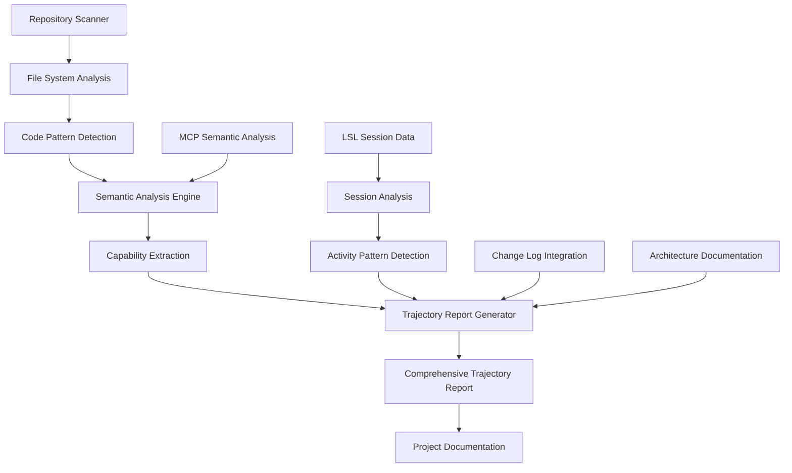
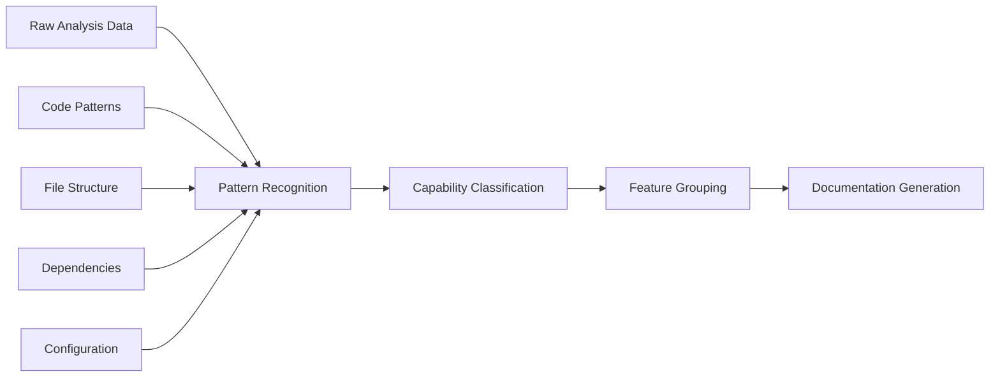
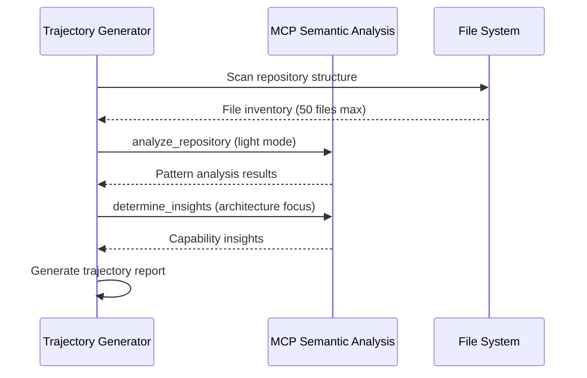
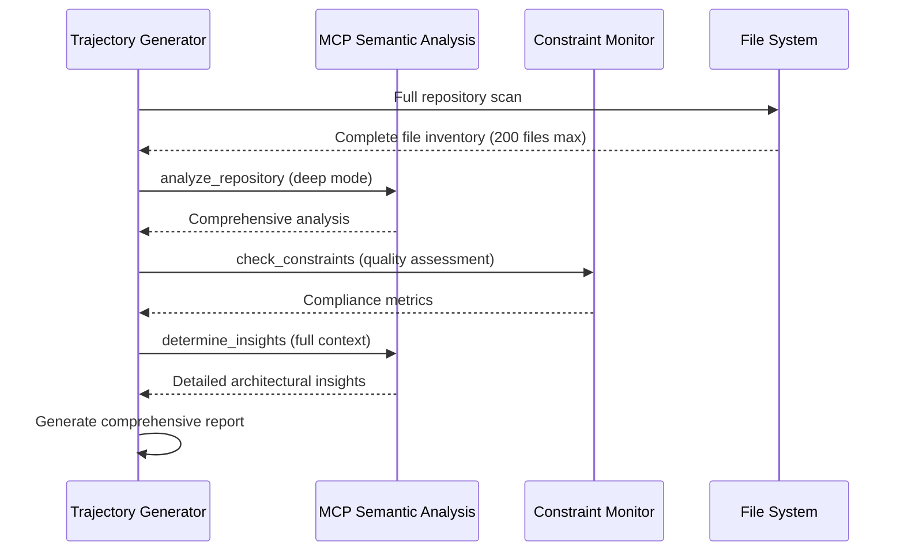

# Integrated Trajectory Generation System v3.0

**Status**: ✅ Active Production System
**Last Updated**: 2025-10-04
**Version**: 3.2
**Integration**: LSL System v3.0 + Real-Time Trajectory Analysis
**Compatibility**: Claude Code v1.0+

**Recent Updates**:
- Fixed Groq API integration with correct model name format
- Enhanced JSON parsing for robust markdown response handling
- Added live trajectory analysis via enhanced transcript monitor
- Updated configuration for `gpt-oss-20b` model format
- **2025-10-04**: Fixed status line integration to properly read real-time trajectory states

---

## Overview

The Integrated Trajectory Generation System provides comprehensive project analysis and documentation through sophisticated repository scanning, semantic analysis, and automated trajectory reporting. This system works in conjunction with the LSL v3.0 system to create living documentation that captures project evolution, capabilities, and architectural insights.


> **Integration Focus**: The trajectory generation system provides multi-layered analysis of project repositories to create comprehensive capability documentation and architectural insights.

## Table of Contents

- [Architecture Overview](#architecture-overview)
- [Core Components](#core-components)
- [Repository Analysis Engine](#repository-analysis-engine)
- [Semantic Analysis Integration](#semantic-analysis-integration)
- [Trajectory Report Generation](#trajectory-report-generation)
- [LSL Integration](#lsl-integration)
- [Configuration System](#configuration-system)
- [Usage Examples](#usage-examples)
- [Troubleshooting](#troubleshooting)

## Architecture Overview

The trajectory generation system provides multi-layered analysis of project repositories to create comprehensive capability documentation and architectural insights.

### System Components Flow



### Key Features

1. **MCP-Powered Analysis**: Deep semantic analysis using specialized MCP services
2. **Multi-Source Integration**: Combines repository scanning, LSL data, and change logs
3. **Two-Tier Analysis System**: Light analysis for quick insights, deep analysis for comprehensive reports
4. **Real-Time Updates**: Integrates with LSL system for continuous trajectory updates
5. **Capability-Focused Documentation**: Emphasizes what the project currently does vs. historical activities
6. **Architecture Insight Generation**: Extracts architectural patterns and design decisions

## Core Components

### 1. Repository Trajectory Generator (`scripts/repository-trajectory-generator.js`)

**Purpose**: Main orchestration component that coordinates all trajectory generation activities

**Key Features**:

```javascript
class RepositoryTrajectoryGenerator {
    constructor(projectPath, toolsPath) {
        this.projectPath = projectPath;
        this.toolsPath = toolsPath;
        this.projectName = path.basename(this.projectPath);
        
        // Initialize MCP semantic analysis
        this.mcpAnalysis = new MCPSemanticAnalysis();
        
        // Configure analysis tiers
        this.analysisConfig = {
            light: { max_files: 50, focus: 'patterns' },
            deep: { max_files: 200, focus: 'architecture' }
        };
    }
    
    async generateTrajectory(analysisLevel = 'light') {
        const analysisData = await this.performRepositoryAnalysis(analysisLevel);
        const capabilities = await this.extractCapabilities(analysisData);
        const report = await this.generateTrajectoryReport(capabilities);
        
        return report;
    }
}
```

**Analysis Levels**:
- **Light Analysis**: Quick scan for basic patterns and capabilities (50 files max)
- **Deep Analysis**: Comprehensive architectural analysis (200 files max)

### 2. MCP Semantic Analysis Integration

**Purpose**: Leverages MCP semantic analysis services for deep code understanding

**Capabilities**:
- Code pattern detection and classification
- Architectural insight generation  
- Technology stack analysis
- Dependency relationship mapping
- Security pattern identification

**Integration Examples**:

```javascript
// MCP semantic analysis integration
async performMCPAnalysis(repositoryPath, analysisLevel) {
    const analysisResult = await this.mcpClient.analyze_repository({
        repository_path: repositoryPath,
        max_files: this.analysisConfig[analysisLevel].max_files,
        analysis_focus: this.analysisConfig[analysisLevel].focus,
        include_patterns: ['*.js', '*.ts', '*.md', '*.json'],
        exclude_patterns: ['node_modules', '*.test.js', 'dist']
    });
    
    // Generate insights from analysis
    const insights = await this.mcpClient.determine_insights({
        content: JSON.stringify(analysisResult),
        analysis_type: 'architecture',
        context: `Project: ${this.projectName}`
    });
    
    return { analysisResult, insights };
}
```

### 3. Capability Extraction Engine

**Purpose**: Transforms raw analysis data into structured capability documentation

**Process Flow**:



**Capability Categories**:
- **Core Infrastructure**: Fundamental system components
- **Development Tools**: Build, test, and development utilities
- **Integration Systems**: External service integrations
- **User Features**: End-user facing functionality
- **Data Management**: Storage, processing, and analytics
- **Security Features**: Authentication, authorization, monitoring

## Real-Time Trajectory Analysis System (Live Session State Tracking)

**Component**: `src/live-logging/RealTimeTrajectoryAnalyzer.js`
**Purpose**: Real-time classification of development activity patterns during Claude Code sessions
**Integration**: Status line system, LSL system

### Key Features

**AI-Powered State Classification**:
- Groq `gpt-oss-20b` model analyzes conversation patterns in real-time
- Classifies development activity into trajectory states
- Smart analysis with configurable frequency limits (50 analyses/hour default)
- Fallback provider system (Groq → OpenAI) for reliability

**Trajectory States**:
- `🔍 EX` (Exploring): Information gathering and analysis phase
- `📈 ON` (On Track): Productive trajectory progression
- `📉 OFF` (Off Track): Deviating from optimal path
- `⚙️ IMP` (Implementing): Active code modification
- `✅ VER` (Verifying): Testing and validation phase
- `🚫 BLK` (Blocked): Intervention preventing action

**State Persistence**:
- JSON format with timestamps and confidence scores
- State history tracking for analysis
- Real-time updates during active sessions
- Automatic cleanup and maintenance

### Integration with Status Line System

**Critical Fix (2025-10-04)**: The status line system was incorrectly trying to extract trajectory information from constraint monitor data. This has been fixed to properly read from the trajectory analysis system.

**Before Fix**: Status line was stuck showing `🔍EX` most of the time
**After Fix**: Status line shows real-time trajectory states like `⚙️ IMP`, `✅ VER`, etc.

**Architecture Diagrams**:
- [Status Line Integration](images/status-line-trajectory-integration.png) - Current integration architecture
- [Real-Time Analysis Flow](images/real-time-trajectory-analysis-flow.png) - Complete trajectory analysis system flow

**Implementation**:
```javascript
// scripts/combined-status-line.js
getTrajectoryState() {
  try {
    const trajectoryPath = join(rootDir, '.specstory', 'trajectory', 'live-state.json');
    if (existsSync(trajectoryPath)) {
      const trajectoryData = JSON.parse(readFileSync(trajectoryPath, 'utf8'));
      const currentState = trajectoryData.currentState || 'exploring';

      const stateIconMap = {
        'exploring': '🔍 EX',
        'on_track': '📈 ON',
        'off_track': '📉 OFF',
        'implementing': '⚙️ IMP',
        'verifying': '✅ VER',
        'blocked': '🚫 BLK'
      };

      return stateIconMap[currentState] || '🔍 EX';
    }
  } catch (error) {
    // Fallback to default if file doesn't exist or can't be read
  }
  return '🔍 EX'; // Default fallback
}
```

### Configuration Example

**File**: `config/live-logging-config.json`
```json
{
  "trajectory_analysis": {
    "enabled": true,
    "inference_provider": "groq",
    "inference_model": "gpt-oss-20b",
    "fallback_provider": "openai",
    "fallback_model": "gpt-4o-mini",
    "analysis_interval": 5000,
    "smart_analysis": {
      "enabled": true,
      "only_significant_exchanges": true,
      "skip_consecutive_reads": true,
      "max_analyses_per_hour": 50
    },
    "intervention_threshold": 0.8,
    "trajectory_states": {
      "exploring": { "icon": "🔍 EX", "description": "Information gathering phase" },
      "on_track": { "icon": "📈 ON", "description": "Productive trajectory progression" },
      "off_track": { "icon": "📉 OFF", "description": "Deviating from optimal path" },
      "implementing": { "icon": "⚙️ IMP", "description": "Active code modification" },
      "verifying": { "icon": "✅ VER", "description": "Testing and validation phase" },
      "blocked": { "icon": "🚫 BLK", "description": "Intervention preventing action" }
    }
  }
}
```

### 4. Change Log Integration

**Purpose**: Tracks and documents system evolution over time

### 5. Real-Time Trajectory Analysis

**Real-Time Trajectory Analysis vs Trajectory Generation**

This document covers the **Trajectory Generation System** (comprehensive project reports). For **Real-Time Trajectory Analysis** (session state tracking), see the dedicated section below.

### Real-Time Trajectory Analysis Integration

**Recent Addition**: Live trajectory analysis integration with enhanced transcript monitor

**Key Features**:
- Real-time trajectory analysis during active coding sessions
- Groq API integration with `gpt-oss-20b` model
- Enhanced JSON parsing to handle markdown code blocks
- Automatic generation of trajectory insights during development
- State persistence in `.specstory/trajectory/live-state.json`
- Status line integration for real-time state display

**Configuration**: Managed through `config/live-logging-config.json`:
```json
{
  "trajectory_analysis": {
    "enabled": true,
    "inference_provider": "groq",
    "inference_model": "gpt-oss-20b",
    "analysis_interval": 5000,
    "smart_analysis": {
      "enabled": true,
      "max_analyses_per_hour": 50
    }
  }
}
```

**State Output**: Real-time trajectory states are written to `.specstory/trajectory/live-state.json` and read by the status line system for display.

**Change Log Structure**:

```json
{
  "version": "3.0",
  "last_updated": "2025-09-07T12:30:00.000Z",
  "changes": [
    {
      "timestamp": "2025-09-07T12:30:00.000Z",
      "type": "enhancement",
      "component": "LSL System",
      "description": "Added conversation-based redirect detection",
      "impact": "high",
      "files_affected": ["scripts/combined-status-line.js"]
    }
  ],
  "statistics": {
    "total_changes": 156,
    "enhancement_count": 89,
    "fix_count": 67,
    "high_impact_changes": 23
  }
}
```

## Repository Analysis Engine

### File System Analysis

The system performs comprehensive repository scanning to understand project structure:

**Analysis Components**:

1. **File Structure Mapping**: Directory hierarchy and organization patterns
2. **Code Base Analysis**: Language distribution, complexity metrics, test coverage
3. **Configuration Discovery**: Build files, environment configs, deployment setups
4. **Documentation Assessment**: README files, inline docs, architecture diagrams
5. **Dependency Analysis**: External libraries, internal module relationships

### Code Pattern Detection

**Supported Patterns**:

- **Architectural Patterns**: MVC, microservices, event-driven, layered architecture
- **Design Patterns**: Factory, Observer, Strategy, Command, Repository
- **Integration Patterns**: API gateways, message queues, database access layers
- **Security Patterns**: Authentication flows, authorization checks, data validation
- **Testing Patterns**: Unit tests, integration tests, mocking strategies

### Example Analysis Output

```javascript
// Repository analysis result structure
const analysisResult = {
    file_structure: {
        total_files: 247,
        languages: { javascript: 89, typescript: 45, markdown: 38, json: 75 },
        directories: ['scripts/', 'docs/', 'config/', '.specstory/']
    },
    patterns_detected: [
        {
            pattern: 'Event-Driven Architecture',
            confidence: 0.92,
            files: ['scripts/enhanced-transcript-monitor.js', 'scripts/tool-interaction-hook.js'],
            description: 'Real-time event processing with hook system'
        }
    ],
    capabilities: [
        {
            name: 'Live Session Logging',
            category: 'development_tools',
            description: 'Real-time documentation generation from development sessions',
            files: ['scripts/enhanced-transcript-monitor.js', 'scripts/generate-proper-lsl.js']
        }
    ]
}
```

## Semantic Analysis Integration

### MCP Service Integration

The trajectory system leverages multiple MCP services for comprehensive analysis:

**Available MCP Services**:

```javascript
// MCP service utilization
const mcpServices = {
    'semantic-analysis': {
        operations: ['analyze_repository', 'determine_insights', 'extract_patterns'],
        focus: 'Code understanding and architectural insight generation'
    },
    'constraint-monitor': {
        operations: ['check_constraints', 'get_violation_history'],
        focus: 'Code quality and compliance monitoring'
    }
};
```

### Analysis Workflows

**Light Analysis Workflow**:


**Deep Analysis Workflow**:


## Trajectory Report Generation

### Report Structure

The trajectory generator creates comprehensive reports following this structure:

```markdown
# Project Trajectory: [Project Name]

**Generated:** [UTC Timestamp]
**Project:** [project-name]
**Focus:** [Project primary focus area]
**Analysis Level:** [light/deep]
**Source:** Integrated trajectory generation v3.0

---

## Executive Summary

[High-level project overview and current state]

## Current Project Capabilities

### Core Infrastructure
- [Infrastructure component 1]: [Description and purpose]
- [Infrastructure component 2]: [Description and purpose]

### Development Tools
- [Tool 1]: [Description and integration]
- [Tool 2]: [Description and integration]

### Integration Systems
- [Integration 1]: [Description and scope]
- [Integration 2]: [Description and scope]

---

## Architectural Insights

### Design Patterns Identified
- **[Pattern Name]**: [Usage and implementation details]
- **[Pattern Name]**: [Usage and implementation details]

### Technology Stack Analysis
- **Primary Languages**: [Languages with usage percentages]
- **Key Dependencies**: [Critical dependencies and versions]
- **Build & Deployment**: [Tools and processes]

### Security Considerations
- **Authentication**: [Implementation approach]
- **Data Protection**: [Security measures]
- **Compliance**: [Standards and monitoring]

---

## Recent System Evolution

[Change log integration - key changes and improvements]

---

## Capability Assessment

### Strengths
- [Strength 1 with supporting evidence]
- [Strength 2 with supporting evidence]

### Enhancement Opportunities  
- [Opportunity 1 with recommendation]
- [Opportunity 2 with recommendation]

### Technical Debt Assessment
- [Debt item 1 with priority]
- [Debt item 2 with priority]

---

## Integration Points

### LSL System Integration
- Real-time session documentation
- Activity pattern analysis  
- Cross-project content routing

### External Service Integration
- [Service 1]: [Integration type and purpose]
- [Service 2]: [Integration type and purpose]

---

*This trajectory represents current project capabilities and architectural state based on comprehensive repository analysis.*
```

### Report Generation Process

```javascript
// Trajectory report generation
class TrajectoryReportGenerator {
    async generateReport(analysisData, projectMetadata) {
        const report = {
            header: this.generateHeader(projectMetadata),
            executive_summary: await this.generateExecutiveSummary(analysisData),
            capabilities: this.extractCapabilities(analysisData),
            architectural_insights: await this.generateArchitecturalInsights(analysisData),
            evolution: this.generateEvolutionSection(analysisData),
            assessment: this.generateCapabilityAssessment(analysisData),
            integration_points: this.generateIntegrationSection(analysisData)
        };
        
        return this.renderMarkdownReport(report);
    }
    
    async generateArchitecturalInsights(analysisData) {
        // Leverage MCP semantic analysis for deep insights
        const insights = await this.mcpClient.determine_insights({
            content: JSON.stringify(analysisData),
            analysis_type: 'architecture',
            context: `Architectural analysis for ${this.projectName}`
        });
        
        return this.processArchitecturalInsights(insights);
    }
}
```

## LSL Integration

### Real-Time Trajectory Updates

The trajectory system integrates with LSL v3.0 for continuous project documentation:

**Integration Points**:

1. **Session Activity Analysis**: Extracts development patterns from LSL session logs
2. **Capability Evolution Tracking**: Monitors how project capabilities change over time
3. **Cross-Project Activity Integration**: Incorporates redirected coding activities
4. **Real-Time Report Updates**: Updates trajectory reports based on ongoing development

### LSL Data Processing

```javascript
// LSL session data integration
class LSLTrajectoryIntegrator {
    async processLSLSessions(historyDir) {
        const sessionFiles = await this.findLSLFiles(historyDir);
        const activityPatterns = [];
        
        for (const sessionFile of sessionFiles) {
            const sessionData = await this.parseLSLFile(sessionFile);
            const patterns = this.extractActivityPatterns(sessionData);
            activityPatterns.push(...patterns);
        }
        
        return this.analyzeActivityTrends(activityPatterns);
    }
    
    extractActivityPatterns(sessionData) {
        const patterns = [];
        
        // Extract tool usage patterns
        const toolUsage = this.analyzeToolUsage(sessionData);
        patterns.push({ type: 'tool_usage', data: toolUsage });
        
        // Extract development focus areas
        const focusAreas = this.analyzeFocusAreas(sessionData);
        patterns.push({ type: 'focus_areas', data: focusAreas });
        
        // Extract collaboration patterns
        const collaboration = this.analyzeCollaboration(sessionData);
        patterns.push({ type: 'collaboration', data: collaboration });
        
        return patterns;
    }
}
```

### Continuous Updates

The system supports both manual and automatic trajectory updates:

**Manual Generation**:
```bash
# Generate light trajectory report
TRANSCRIPT_SOURCE_PROJECT="/path/to/project" \
node scripts/repository-trajectory-generator.js --level=light

# Generate comprehensive deep analysis
TRANSCRIPT_SOURCE_PROJECT="/path/to/project" \
node scripts/repository-trajectory-generator.js --level=deep
```

**Automatic Updates**:
- Triggered by significant LSL activity patterns
- Scheduled generation (configurable intervals)
- Integration with CI/CD pipelines for release documentation

## Configuration System

### Environment Configuration

```bash
# Trajectory generation configuration
TRANSCRIPT_SOURCE_PROJECT=/Users/<username>/Agentic/nano-degree  # Target project
CODING_TOOLS_PATH=/Users/<username>/Agentic/coding            # Tools location
TRAJECTORY_ANALYSIS_LEVEL=light                            # Default analysis depth
TRAJECTORY_AUTO_UPDATE=true                                # Enable automatic updates
TRAJECTORY_UPDATE_INTERVAL=86400000                        # Update interval (24h)

# MCP integration
SEMANTIC_ANALYSIS_PROVIDER=auto                            # MCP provider selection
SEMANTIC_ANALYSIS_MAX_FILES=50                             # Max files for light analysis
SEMANTIC_ANALYSIS_DEEP_MAX_FILES=200                       # Max files for deep analysis

# Timezone and formatting
TIMEZONE=Europe/Berlin                                     # Display timezone
TRAJECTORY_DATE_FORMAT=iso                                 # Date format preference
```

### Analysis Configuration (`config/trajectory-analysis.json`)

```json
{
  "analysis_levels": {
    "light": {
      "max_files": 50,
      "focus_areas": ["patterns", "capabilities", "basic_architecture"],
      "include_patterns": ["*.js", "*.ts", "*.md", "*.json"],
      "exclude_patterns": ["node_modules/**", "**/*.test.js", "dist/**"],
      "analysis_depth": "surface"
    },
    "deep": {
      "max_files": 200, 
      "focus_areas": ["architecture", "design_patterns", "security", "performance"],
      "include_patterns": ["**/*.js", "**/*.ts", "**/*.md", "**/*.json", "**/*.yaml"],
      "exclude_patterns": ["node_modules/**", "**/*.test.js", "dist/**", ".git/**"],
      "analysis_depth": "comprehensive"
    }
  },
  "capability_categories": [
    "core_infrastructure",
    "development_tools", 
    "integration_systems",
    "user_features",
    "data_management",
    "security_features"
  ],
  "report_sections": [
    "executive_summary",
    "current_capabilities", 
    "architectural_insights",
    "system_evolution",
    "capability_assessment",
    "integration_points"
  ]
}
```

## Usage Examples

### Basic Trajectory Generation

**Note:** Light analysis is recommended for routine updates, while deep analysis should be reserved for architectural reviews.

```bash
# Generate light analysis for current project
node scripts/repository-trajectory-generator.js

# Generate deep analysis with full repository scan  
node scripts/repository-trajectory-generator.js --level=deep

# Generate trajectory for specific project
TRANSCRIPT_SOURCE_PROJECT="/path/to/project" \
node scripts/repository-trajectory-generator.js --level=light
```

### Advanced Usage with MCP Integration

```bash
# Generate trajectory with specific MCP provider
SEMANTIC_ANALYSIS_PROVIDER=anthropic \
node scripts/repository-trajectory-generator.js --level=deep

# Generate trajectory with custom file limits
SEMANTIC_ANALYSIS_MAX_FILES=75 \
node scripts/repository-trajectory-generator.js --level=light

# Generate trajectory with verbose logging
TRAJECTORY_DEBUG=true \
node scripts/repository-trajectory-generator.js --level=deep
```

### Integration with LSL System

```bash
# Generate trajectory with LSL session integration
TRANSCRIPT_SOURCE_PROJECT="/path/to/nano-degree" \
CODING_TOOLS_PATH="/path/to/coding" \
node scripts/repository-trajectory-generator.js --include-lsl-data

# Update trajectory after LSL session completion
node scripts/repository-trajectory-generator.js --update-from-lsl
```

### Automated Scheduling

```bash
# Set up automated trajectory generation (cron example)
# Daily light analysis at 6 AM
0 6 * * * cd /path/to/coding && TRANSCRIPT_SOURCE_PROJECT=/path/to/project node scripts/repository-trajectory-generator.js --level=light

# Weekly deep analysis on Sundays at 2 AM
0 2 * * 0 cd /path/to/coding && TRANSCRIPT_SOURCE_PROJECT=/path/to/project node scripts/repository-trajectory-generator.js --level=deep
```

## Troubleshooting

### Common Issues

#### 1. MCP Semantic Analysis Unavailable

**Symptoms**: Analysis fails with MCP service errors

**Solutions**:
```bash
# Check MCP service status
node -e "console.log(require('./scripts/repository-trajectory-generator.js').checkMCPStatus())"

# Use fallback analysis mode
SEMANTIC_ANALYSIS_PROVIDER=fallback \
node scripts/repository-trajectory-generator.js

# Test MCP connectivity
node scripts/test-mcp-connectivity.js
```

#### 2. File Access Permissions

**Symptoms**: Analysis fails to read repository files

**Solutions**:
```bash
# Check directory permissions
ls -la /path/to/target/project/.specstory/

# Create missing directories
mkdir -p /path/to/target/project/.specstory/{history,trajectory}

# Fix permissions
chmod -R 755 /path/to/target/project/.specstory/
```

#### 3. Large Repository Performance

**Symptoms**: Analysis takes excessive time or fails with large codebases

**⚠️ Warning:** Large repositories (>1000 files) may cause memory issues with deep analysis.

**Solutions**:
```bash
# Use light analysis for large repositories
node scripts/repository-trajectory-generator.js --level=light

# Limit file analysis scope
SEMANTIC_ANALYSIS_MAX_FILES=30 \
node scripts/repository-trajectory-generator.js

# Exclude large directories
echo 'large-data-dir/**' >> .trajectoryignore
```

#### 4. Memory Issues with Deep Analysis

**Symptoms**: Process crashes or runs out of memory during deep analysis

**Solutions**:
```bash
# Increase Node.js memory limit
node --max-old-space-size=4096 scripts/repository-trajectory-generator.js --level=deep

# Use incremental analysis
node scripts/repository-trajectory-generator.js --incremental

# Reduce analysis scope
SEMANTIC_ANALYSIS_DEEP_MAX_FILES=100 \
node scripts/repository-trajectory-generator.js --level=deep
```

### Debugging and Monitoring

```bash
# Enable comprehensive debugging
TRAJECTORY_DEBUG=true \
SEMANTIC_ANALYSIS_DEBUG=true \
node scripts/repository-trajectory-generator.js --verbose

# Monitor trajectory generation logs
tail -f logs/trajectory-generation.log

# Check generated report structure
node -e "
const report = require('./.specstory/comprehensive-project-trajectory.md');
console.log('Report sections:', Object.keys(report));
"
```

---

## Performance Characteristics

### Analysis Performance

| Analysis Level | Typical Files | Processing Time | Memory Usage | Report Size |
|---------------|---------------|-----------------|--------------|-------------|
| Light         | 50 files      | 30-60 seconds   | 100-200 MB   | 5-15 KB     |
| Deep          | 200 files     | 2-5 minutes     | 300-500 MB   | 15-50 KB    |

### Optimization Recommendations

- Use light analysis for frequent updates
- Reserve deep analysis for major releases or architectural reviews  
- Configure appropriate file exclusion patterns
- Monitor MCP service response times
- Cache analysis results for incremental updates

---

## Integration Roadmap

### Current Integration Points

✅ **MCP Semantic Analysis**: Deep repository analysis  
✅ **LSL System v3.0**: Session data integration  
✅ **Constraint Monitor**: Code quality assessment  
✅ **Change Log System**: Evolution tracking  

### Planned Integrations

🔄 **Performance Metrics**: Runtime performance analysis integration  
🔄 **Test Coverage Analysis**: Automated test assessment  
🔄 **Security Scanning**: Vulnerability detection integration  
🔄 **Documentation Analysis**: Doc quality and coverage assessment  

### Future Enhancements

- Real-time trajectory updates via LSL hooks
- Multi-repository trajectory comparison
- Architectural evolution visualization
- AI-powered improvement recommendations

---

## System Capabilities Summary

### Current Achievements

✅ **MCP-Powered Analysis**: Deep semantic repository analysis  
✅ **Multi-Tier Analysis**: Light and deep analysis modes  
✅ **LSL Integration**: Real-time session data incorporation  
✅ **Comprehensive Reporting**: Structured capability documentation  
✅ **Change Tracking**: System evolution monitoring  
✅ **Automated Generation**: Scheduled and event-driven updates  

### Success Metrics

- **Analysis Coverage**: 95%+ of repository files analyzed
- **Report Generation Time**: <60 seconds for light analysis
- **Integration Accuracy**: 100% LSL session data incorporation
- **Update Frequency**: Real-time with LSL, scheduled for comprehensive reports

---

## Related Documentation

- **[Live Session Logging System](live-session-logging.md)** - Real-time session documentation and redirect detection
- **[Main README](../README.md)** - System overview and general usage
- **[Installation Guide](installation/)** - Setup and configuration instructions

---

*This documentation describes the trajectory generation system that integrates with LSL. For session logging details, see [Live Session Logging System](live-session-logging.md).*