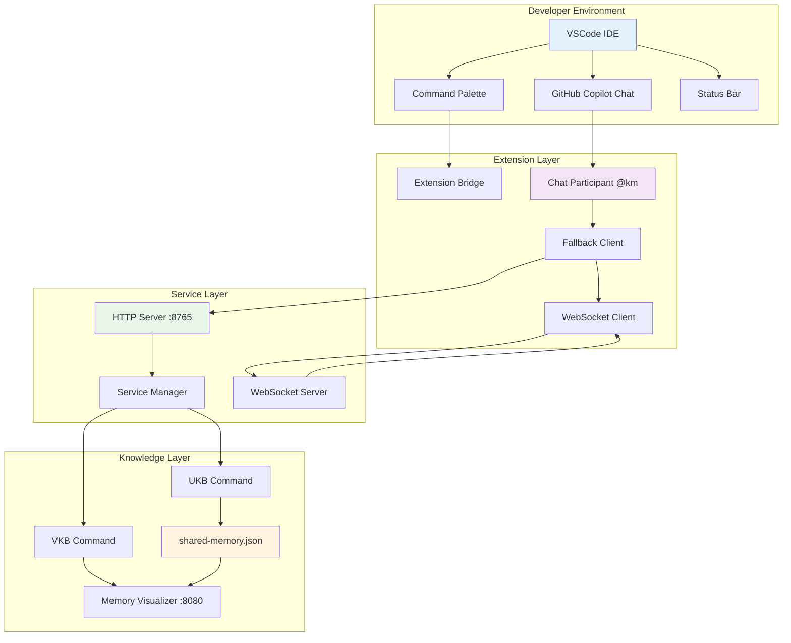
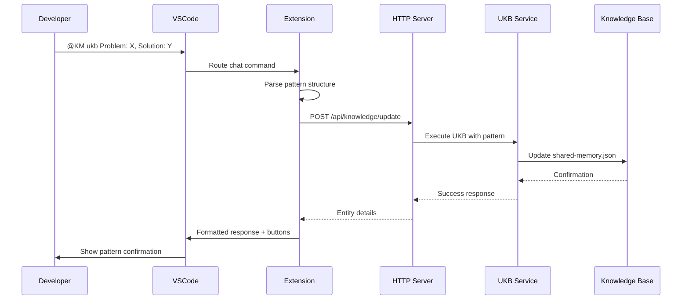
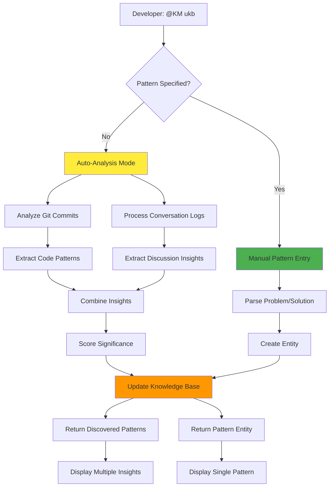
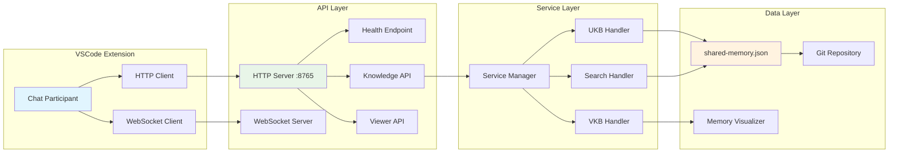
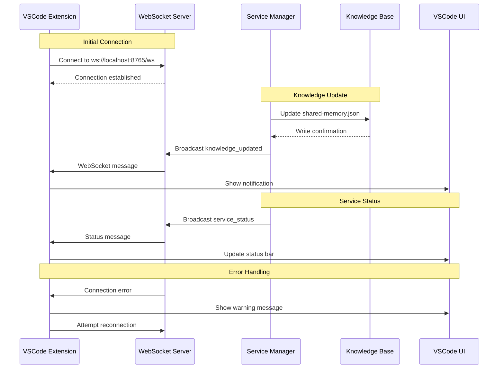
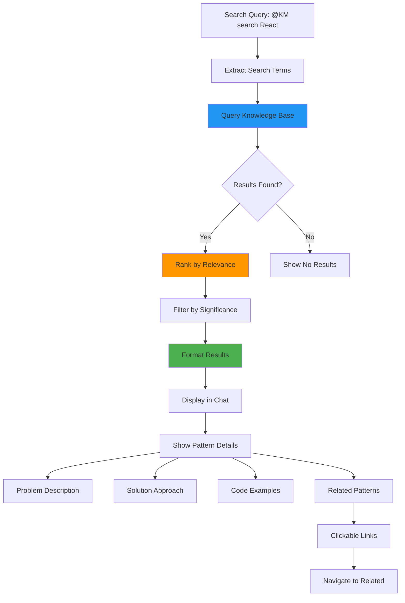
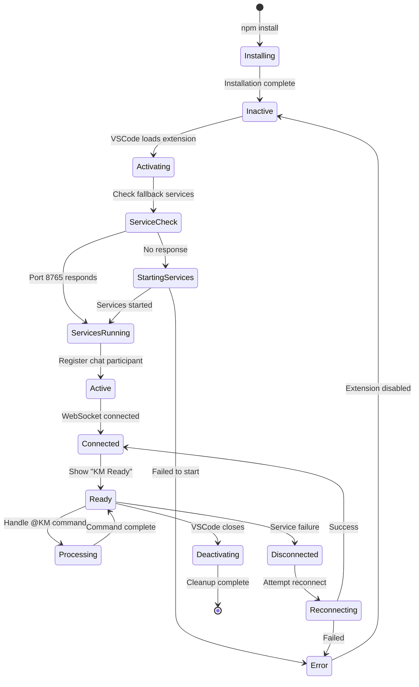

# VSCode Extension Integration - Mermaid Diagrams

## System Overview



## Command Flow Sequence



## Auto-Analysis Workflow



## Service Communication Architecture



## Real-time Update Flow



## Pattern Search and Discovery



## Team Knowledge Sharing

```mermaid
flowchart TB
    subgraph "Developer A Environment"
        A1[VSCode A]
        A2[Extension A]
        A3[Local Git]
    end
    
    subgraph "Developer B Environment" 
        B1[VSCode B]
        B2[Extension B]
        B3[Local Git]
    end
    
    subgraph "Shared Resources"
        S1[Git Repository]
        S2[shared-memory.json]
        S3[Team Knowledge Base]
    end
    
    A2 --> A3: Update local KB
    A3 --> S1: Push changes
    S1 --> S2: Sync shared-memory.json
    S2 --> S3: Update team knowledge
    S3 --> B3: Pull changes
    B3 --> B2: Load new patterns
    B2 --> B1: Display in VSCode
    
    style S2 fill:#ff9800
    style S3 fill:#4caf50
```

## Extension Lifecycle Management

