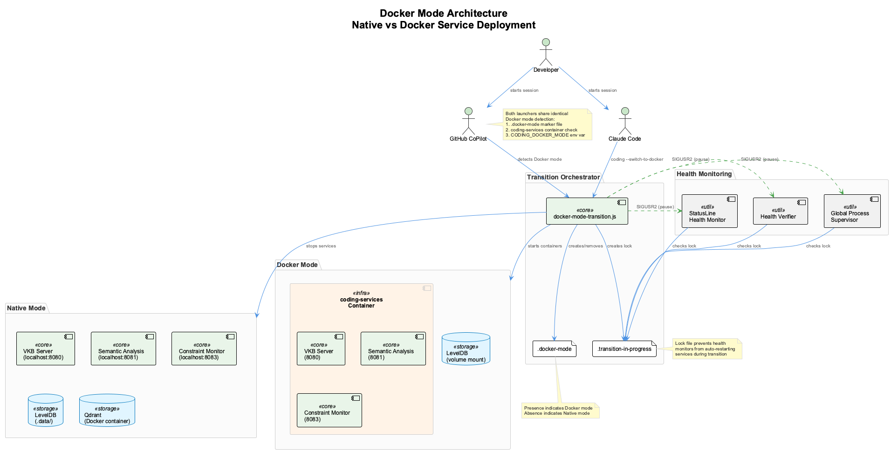

# Docker Mode Transition

This document describes the Docker Mode Transition system that enables safe, transparent transitions between native and Docker service deployment modes.

## Overview

The coding infrastructure supports two deployment modes for its core services:

| Mode | Description | Use Case |
|------|-------------|----------|
| **Native** | Services run as Node.js processes | Development, debugging, lower resource usage |
| **Docker** | Services run in Docker containers | Isolation, reproducibility, CI/CD environments |

The transition system ensures:
- No data loss during mode switches
- Multi-session support (multiple projects running simultaneously)
- Health monitoring respects transition state
- Automatic rollback on failure

## Architecture



### Components

1. **Transition Orchestrator** (`scripts/docker-mode-transition.js`)
   - Creates lock file to signal transition in progress
   - Broadcasts pause/resume signals to health monitors
   - Manages graceful service shutdown and startup
   - Implements automatic rollback on failure

2. **Health Monitors** (modified to respect transition)
   - `health-verifier.js` - Skips verification during transition
   - `global-process-supervisor.js` - Skips restarts during transition
   - `statusline-health-monitor.js` - Shows transition status, skips auto-healing

3. **Lock File** (`.transition-in-progress`)
   - Prevents health monitors from auto-restarting services
   - Contains transition metadata (mode, PID, sessions)
   - Automatically cleaned up after transition

4. **Mode Marker** (`.docker-mode`)
   - Presence indicates Docker mode
   - Absence indicates Native mode

## State Machine


The system supports these states:
- **Native Mode**: Services running as Node.js processes
- **Docker Mode**: Services running in Docker containers
- **Transition In Progress**: Switching between modes
- **Rolling Back**: Restoring previous mode after failure

## Transition Flow


### Step-by-Step Process

1. **Check Prerequisites**
   - Verify no transition already in progress
   - Determine current mode from `.docker-mode` marker

2. **Create Lock & Pause Monitoring**
   - Create `.transition-in-progress` with metadata
   - Broadcast SIGUSR2 to all health monitors (pause)

3. **Stop Source Services**
   - Native: Send SIGTERM to processes, wait for graceful shutdown
   - Docker: Run `docker compose down`

4. **Start Target Services**
   - Docker: Create `.docker-mode`, run `docker compose up -d`
   - Native: Remove `.docker-mode`, run `start-services.sh`

5. **Health Verification**
   - Poll `/health` endpoint for up to 60 seconds
   - On success: remove lock, resume monitoring
   - On failure: initiate rollback

6. **Rollback (if needed)**
   - Kill partially started services
   - Restore previous mode
   - Remove lock file
   - Resume monitoring

## CLI Commands

### Switch to Docker Mode

```bash
coding --switch-to-docker
```

Transitions all services from native Node.js processes to Docker containers.

### Switch to Native Mode

```bash
coding --switch-to-native
```

Transitions all services from Docker containers back to native Node.js processes.

### Check Mode Status

```bash
coding --mode-status
```

Shows current mode and any active transition:

```
📊 Mode Status:
   Current Mode: 💻 native
   Transition: ✅ None
   Active Sessions: 2
   Sessions:
     - claude-12345-1705934400 (3 services)
     - project-ui-template (1 services)
```

## Direct CLI Usage

The transition orchestrator can also be used directly:

```bash
# Transition to Docker
node scripts/docker-mode-transition.js to-docker --verbose

# Transition to Native
node scripts/docker-mode-transition.js to-native --verbose

# Check status
node scripts/docker-mode-transition.js status

# Check if transition is in progress (for scripts)
node scripts/docker-mode-transition.js check

# Force remove lock file (emergency)
node scripts/docker-mode-transition.js unlock
```

## Signal Handling

Health monitors respond to these signals during transitions:

| Signal | Effect |
|--------|--------|
| SIGUSR2 | Pause monitoring and auto-healing |
| SIGUSR1 | Resume normal operation |

The orchestrator broadcasts these signals automatically during transitions.

## Lock File Format

The `.transition-in-progress` file contains:

```json
{
  "startTime": "2026-01-22T10:00:00.000Z",
  "fromMode": "native",
  "toMode": "docker",
  "pid": 12345,
  "sessions": ["claude-12345-1705934400", "project-coding"],
  "status": "in_progress",
  "lastUpdate": "2026-01-22T10:00:30.000Z"
}
```

Lock files older than 5 minutes are considered stale and automatically cleaned up.

## Troubleshooting

### Transition Stuck

If a transition appears stuck:

1. Check lock file age:
   ```bash
   cat .transition-in-progress
   ```

2. If stale (>5 min), force unlock:
   ```bash
   coding --mode-status  # Usually cleans up stale locks
   # Or manually:
   node scripts/docker-mode-transition.js unlock
   ```

### Services Not Starting After Transition

1. Check port availability:
   ```bash
   lsof -i:8080,8081,8083
   ```

2. Check Docker containers (if Docker mode):
   ```bash
   docker ps
   docker compose -f docker/docker-compose.yml logs
   ```

3. Check native processes (if native mode):
   ```bash
   node scripts/process-state-manager.js status
   ```

### Health Monitors Not Resuming

If health monitors remain paused after transition:

1. Manually send resume signal:
   ```bash
   pkill -USR1 -f health-verifier.js
   pkill -USR1 -f global-process-supervisor.js
   pkill -USR1 -f statusline-health-monitor.js
   ```

2. Or restart the monitors:
   ```bash
   node scripts/monitoring-verifier.js --install-all
   ```

## Implementation Files

| File | Purpose |
|------|---------|
| `scripts/docker-mode-transition.js` | Core transition orchestrator |
| `scripts/health-verifier.js` | Modified to respect transition lock |
| `scripts/global-process-supervisor.js` | Modified to respect transition lock |
| `scripts/statusline-health-monitor.js` | Shows transition status, skips healing |
| `scripts/launch-claude.sh` | Waits for transition before startup |
| `bin/coding` | CLI commands for mode switching |

## API for Programmatic Use

```javascript
import DockerModeTransition from './scripts/docker-mode-transition.js';
import { isTransitionLocked, getTransitionLockData } from './scripts/docker-mode-transition.js';

// Create instance
const transition = new DockerModeTransition({ verbose: true });

// Check current mode
const mode = await transition.getCurrentMode(); // 'native' or 'docker'

// Check if transition in progress
const locked = await isTransitionLocked();
const lockData = await getTransitionLockData();

// Get full status
const status = await transition.getStatus();

// Perform transition
const result = await transition.transition('docker');
if (result.success) {
  console.log('Transitioned to Docker mode');
} else {
  console.error('Transition failed:', result.message);
}
```

## Related Documentation

- [Health Verification System](./health-monitoring.md)
- [Process State Manager](./process-state-manager.md)
- [Docker Deployment](./docker-deployment.md)
