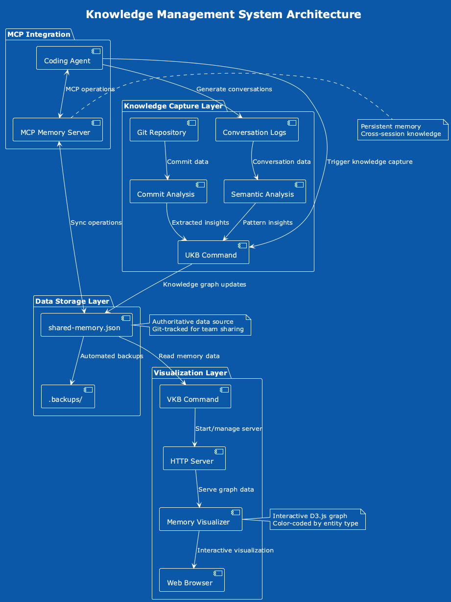
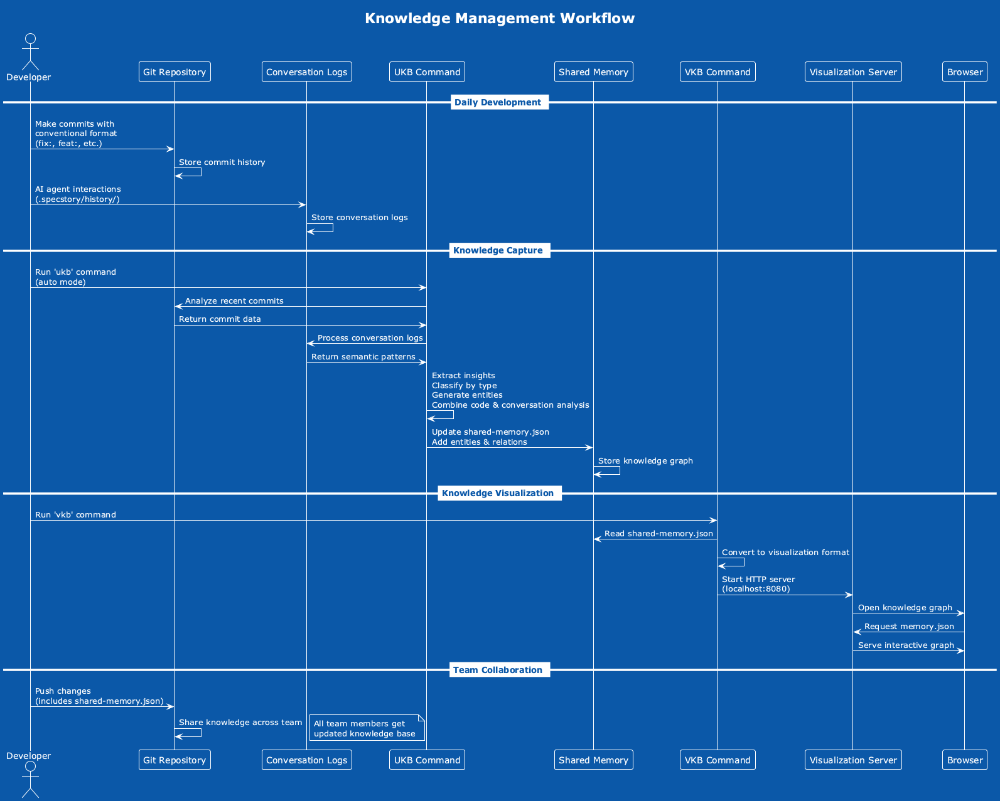

# Knowledge Management System Documentation

## Table of Contents

1. [Overview](#overview)
2. [Architecture](#architecture)
3. [User Workflows](#user-workflows)
4. [Knowledge Base Schema](#knowledge-base-schema)
5. [Commands Reference](#commands-reference)
6. [Visualization System](#visualization-system)
7. [Team Collaboration](#team-collaboration)
8. [Configuration](#configuration)
9. [Troubleshooting](#troubleshooting)

## Overview

The Knowledge Management (KM) system is designed to automatically capture, organize, and visualize programming insights and patterns from development work. It transforms conventional git commits into a structured knowledge graph that helps teams identify transferable solutions and best practices.

### Key Features

- **Automatic Knowledge Capture**: Extracts insights from git commits using conventional commit format
- **Interactive Visualization**: Web-based graph interface for exploring knowledge relationships
- **Transferable Patterns**: Central hub for cross-project reusable solutions
- **Team Sharing**: Git-tracked knowledge base for seamless team collaboration
- **MCP Integration**: Persistent memory across Claude Code sessions

### Core Concepts

- **CodingKnowledge Hub**: Central green node containing transferable programming patterns
- **Project Insights**: Specific learnings tied to individual projects
- **Technical Patterns**: Reusable solutions like logging patterns, state management, etc.
- **Relationship Mapping**: Connections showing how insights relate to projects and patterns

## Architecture



The system consists of three main layers:

### 1. Knowledge Capture Layer

- **Git Repository**: Source of commit data and conventional commit messages
- **UKB Command**: Analyzes commits and extracts structured insights
- **Commit Analysis**: Classifies commits by type (fix, feat, perf, etc.)

### 2. Data Storage Layer

- **shared-memory.json**: Authoritative knowledge graph data (git-tracked)
- **Backup System**: Automated backups in `.backups/` directory
- **MCP Integration**: Persistent memory for Claude Code sessions
- **Conversation Logging**: Automatic capture of Claude Code conversations in `.specstory/history/`

### 3. Visualization Layer

- **VKB Command**: Server management and data conversion
- **HTTP Server**: Serves interactive graph on localhost:8080
- **Memory Visualizer**: D3.js-based interactive graph interface

## User Workflows



### Daily Development Workflow

1. **Normal Development**:
   - Write code and make git commits using conventional format
   - Example: `fix: resolve memory leak in timeline rendering`
   - Example: `feat: add conditional logging pattern for debug mode`

2. **Knowledge Capture**:
   - Run `ukb` at end of coding session
   - System automatically analyzes recent commits
   - Extracts insights and updates knowledge graph

3. **Knowledge Exploration**:
   - Run `vkb` to start visualization server
   - Browse interactive graph at localhost:8080
   - Explore relationships between projects and patterns

4. **Team Sharing**:
   - Git push/pull automatically shares knowledge updates
   - All team members benefit from collective insights

### Knowledge Discovery Workflow

1. **Pattern Recognition**:
   - Identify common solutions across projects
   - Tag patterns as transferable knowledge
   - Link to central CodingKnowledge hub

2. **Cross-Project Learning**:
   - Use visualization to find similar patterns
   - Apply successful solutions to new projects
   - Build institutional knowledge

## Knowledge Base Schema


### Entity Types

| Entity Type | Color | Purpose | Examples |
|-------------|--------|---------|----------|
| `System` | Green | Central hubs and core systems | CodingKnowledge hub |
| `Project` | Blue | Software projects | TimelineProject, KnowledgeManagementProject |
| `TransferableKnowledge` | Default | Reusable patterns across projects | ConditionalLoggingPattern, ReduxStateManagementPattern |
| `TechnicalInsight` | Default | Project-specific technical learnings | ViewportFilteringOptimization, CrossPlatformBashScripting |
| `CodingInsight` | Default | Insights from commit analysis | Bug fixes, feature implementations |
| `Technology` | Default | Technologies and tools | MCP, ThreeJS, React |
| `Component` | Default | Software components | TimelineAxis, BottomBar |
| `Feature` | Default | Application features | Debug mode, camera cycling |
| `Architecture` | Default | Architectural patterns | MVI, Redux store architecture |

### Relationship Types

| Relation Type | Purpose | Example |
|---------------|---------|---------|
| `contains` | Hub contains patterns | CodingKnowledge → ConditionalLoggingPattern |
| `implemented in` | Pattern used in project | ConditionalLoggingPattern → TimelineProject |
| `uses` | Technology dependency | ThreeJSReactIntegrationPattern → ThreeJS |
| `derived from` | Pattern extracted from | ConditionalLoggingPattern ← ConditionalDebugRendering |
| `generated insight` | Project produced insight | TimelineProject → ViewportFilteringOptimization |
| `benefits from` | Improvement relationship | CodingKnowledge ← KnowledgeGraphRedesign |

### Data Structure

```json
{
  "metadata": {
    "version": "1.0.0",
    "total_entities": 14,
    "total_relations": 20,
    "last_updated": "2025-06-05T14:10:00Z"
  },
  "entities": [
    {
      "name": "CodingKnowledge",
      "entityType": "System",
      "observations": ["Central hub for transferable programming knowledge..."],
      "significance": 10,
      "created": "2025-06-05T13:30:00Z"
    }
  ],
  "relations": [
    {
      "from": "CodingKnowledge",
      "relationType": "contains",
      "to": "ConditionalLoggingPattern",
      "created": "2025-06-05T13:30:00Z"
    }
  ]
}
```

## Commands Reference

### UKB (Update Knowledge Base)

**Purpose**: Capture insights from recent development work

```bash
ukb [options]
```

**Options**:

- `--auto` (default): Automatically analyze and capture insights
- `--interactive`: Manual insight entry mode
- `--help`: Show usage information

**What it does**:

1. Analyzes git commits from current session
2. Extracts metadata (language, project, impact)
3. Classifies commits by conventional format
4. Generates entities and relationships
5. Updates `shared-memory.json`

**Example output**:

```
🧠 UKB - Update Knowledge Base v3.0
🤖 Running in AUTOMATIC mode
Creating entity: feature_timeline_20250605_1 (significance: 5/10)
📊 Entities: 14, Relations: 20
✅ Knowledge base updated successfully!
```

### VKB (View Knowledge Base)

**Purpose**: Manage visualization server

```bash
vkb [command]
```

**Commands**:

- `start` (default): Start visualization server
- `stop`: Stop server
- `restart`: Restart server
- `status`: Check server status
- `logs`: View server logs

**Server details**:

- **URL**: <http://localhost:8080>
- **Port**: 8080 (configurable)
- **Process**: Background HTTP server
- **Data source**: `shared-memory.json`

## Visualization System

### Interactive Graph Features

1. **Node Interactions**:
   - Click nodes to view detailed information
   - Drag nodes to reposition
   - Hover for quick preview

2. **Filtering Options**:
   - Filter by entity type
   - Filter by relationship type
   - Search by name or content

3. **Visual Encoding**:
   - Colors indicate entity types
   - Node size reflects significance
   - Edge thickness shows relationship strength

### Navigation

- **Zoom**: Mouse wheel or pinch gestures
- **Pan**: Click and drag background
- **Reset**: Double-click background to reset view
- **Search**: Use search box to find specific nodes

### Entity Details Panel

Clicking any node shows:

- Entity name and type
- Full observations list
- Significance rating
- Creation date
- All relationships (inbound/outbound)

## Team Collaboration

### Git Integration

The knowledge base is designed for team sharing:

```bash
# Share knowledge updates
git add shared-memory.json
git commit -m "feat: add logging pattern insights"
git push

# Get team updates
git pull  # Automatically updates shared-memory.json
vkb restart  # Refresh visualization
```

### Collaboration Workflow

1. **Individual Work**: Each developer captures insights with `ukb`
2. **Knowledge Sharing**: Regular git push/pull shares insights
3. **Team Review**: Periodic visualization sessions to identify patterns
4. **Pattern Extraction**: Promote successful solutions to transferable knowledge

### Conflict Resolution

If multiple team members update the knowledge base simultaneously:

1. Git will flag conflicts in `shared-memory.json`
2. Manually resolve conflicts (usually safe to keep both sets of entities)
3. Update entity counts in metadata section
4. Commit resolved version

## Claude Code Conversation Logging

### Automatic Conversation Capture

The system includes automatic logging of all Claude Code conversations through the Claude Logger MCP server. This creates a searchable history of AI interactions that complements the knowledge graph.

### Enabling Auto-Logging

1. **Start automatic logging**:
   ```
   User: Enable automatic logging
   ```
   
2. All subsequent conversations are automatically saved to:
   ```
   .specstory/history/YYYY-MM-DD-Auto-logged Claude Code Session.md
   ```

3. **Check logging status**:
   ```
   User: Is auto-logging active?
   ```

4. **Stop logging**:
   ```
   User: Stop logging
   ```

### SpecStory Integration

- **Directory**: `.specstory/history/` contains all conversation logs
- **Format**: SpecStory-compatible markdown with metadata
- **Content**: Full conversation history with timestamps, tools used, and model info
- **Searchable**: Compatible with SpecStory VS Code extension for searching past interactions

### Benefits

- **Learning from Past Sessions**: Review how problems were solved previously
- **Team Knowledge Sharing**: Share AI conversation insights with team
- **Pattern Recognition**: Identify recurring challenges and solutions
- **Audit Trail**: Complete history of AI-assisted development work

## Configuration

### System Requirements

- **Git**: Version control for knowledge sharing
- **Python 3**: HTTP server for visualization
- **Node.js**: Memory visualizer dependencies
- **jq**: JSON processing in shell scripts
- **PlantUML**: (Optional) For documentation diagrams

### Environment Setup

The knowledge base expects these directory structures:

```
~/Claude/
├── shared-memory.json              # Main knowledge base
├── knowledge-management/
│   ├── ukb                        # Update command
│   ├── vkb                        # View command
│   └── dist/                      # Visualization files
└── docs/                          # Documentation
```

### Visualization Configuration

VKB server configuration in `vkb` script:

```bash
SERVER_PORT=8080
SHARED_MEMORY="/Users/q284340/Claude/shared-memory.json"
VISUALIZER_DIR="/Users/q284340/Agentic/memory-visualizer"
```

## Troubleshooting

### Common Issues

#### 1. Server Won't Start

**Problem**: VKB server fails to start or shows port conflicts

**Solutions**:

```bash
vkb stop           # Stop any existing servers
lsof -ti:8080 | xargs kill -9  # Force kill port 8080 processes
vkb start          # Start fresh server
```

#### 2. Knowledge Not Updating

**Problem**: Recent commits not appearing in knowledge base

**Solutions**:

- Ensure commits use conventional format (`fix:`, `feat:`, etc.)
- Run `ukb` from the correct git repository
- Check git log to verify commits exist
- Verify `shared-memory.json` was updated

#### 3. Visualization Not Loading

**Problem**: Browser shows errors or blank page

**Solutions**:

```bash
vkb restart        # Restart server
vkb logs          # Check server logs
# Check browser console for JavaScript errors
```

#### 4. Memory File Corruption

**Problem**: `shared-memory.json` contains invalid JSON

**Solutions**:

```bash
# Restore from backup
cp .backups/shared-memory-backup-*.json shared-memory.json

# Or restore from git history
git log --oneline shared-memory.json
git checkout <commit-hash> shared-memory.json
```

### Performance Optimization

For large knowledge bases (100+ entities):

1. **Regular Cleanup**: Remove outdated or duplicate insights
2. **Selective Loading**: Use entity type filters to reduce rendering load
3. **Backup Management**: Clean old backups periodically

### Debug Mode

Enable debug logging in UKB:

```bash
export DEBUG=1
ukb --auto
```

This provides detailed output about:

- Commit analysis results
- Entity creation process
- Relationship mapping
- File I/O operations

---

## See Also

- [Team Knowledge Setup Guide](../TEAM_KNOWLEDGE_SETUP.md)
- [Main Repository README](../README.md)
- [PlantUML Source Files](puml/)
- [Generated Diagrams](imag/)
