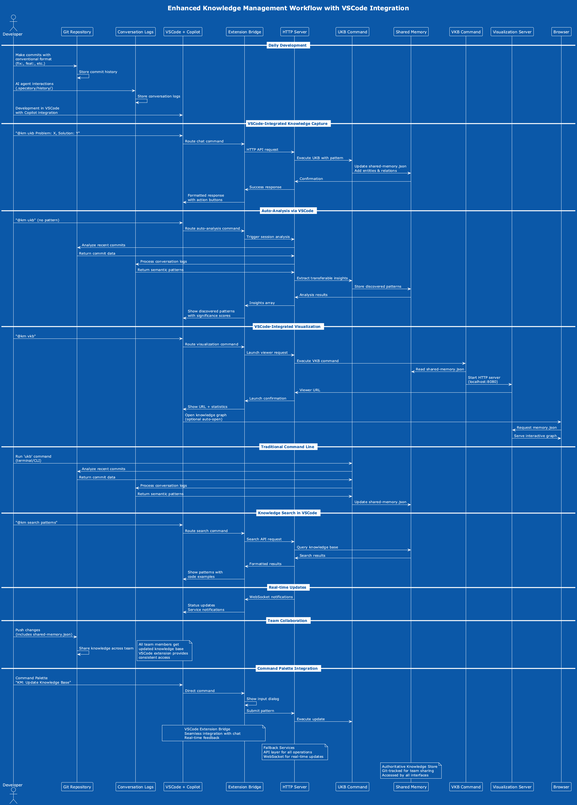

# Enhanced Knowledge Management Workflow

## Overview

The knowledge management system now supports multiple interaction modes, including traditional command-line tools and seamless VSCode integration through GitHub Copilot chat. This enhanced workflow provides developers with flexible options for capturing and accessing knowledge.

## Workflow Diagram



## Workflow Modes

### 1. VSCode-Integrated Workflow

#### Knowledge Capture via Chat
```
Developer: @KM ukb Problem: API responses are slow, Solution: implement Redis caching
VSCode Extension: ✅ Knowledge base updated successfully!
Entity: APICachingPattern
Type: Pattern
Significance: 8/10
```

**Process:**
1. Developer types `@KM ukb` command in Copilot chat
2. Extension parses the problem/solution structure
3. HTTP API sends pattern to knowledge management service
4. Knowledge base is updated with new entity
5. Real-time confirmation displayed in chat interface

#### Auto-Analysis Mode
```
Developer: @KM ukb
Extension: 🔍 Auto-analyzing session data for transferable insights...
Found 3 transferable insights with significance > 7
```

**Process:**
1. Developer triggers auto-analysis without specific pattern
2. System analyzes recent git commits and conversation logs
3. Machine learning algorithms extract transferable patterns
4. Insights are classified and stored with significance scores
5. Results displayed with pattern details and code examples

#### Knowledge Visualization
```
Developer: @KM vkb
Extension: 🌐 Knowledge base viewer launched at: http://localhost:8080
Statistics: 47 entities, 23 relations, last updated 2025-06-16
```

**Process:**
1. Developer requests knowledge graph visualization
2. Extension triggers HTTP API to launch viewer service
3. Memory visualizer starts on localhost:8080
4. Interactive D3.js graph loads with current knowledge base
5. Developer can explore entities, relations, and search patterns

#### Knowledge Search
```
Developer: @KM search React optimization
Extension: Found 5 results:
### MemoizationPattern (9/10)
Problem: Components re-render unnecessarily
Solution: Use React.memo and useMemo strategically
```

**Process:**
1. Developer searches for specific patterns or technologies
2. Extension queries knowledge base with fuzzy search
3. Results ranked by relevance and significance
4. Formatted response shows problem, solution, and code examples
5. Action buttons provide quick access to related patterns

### 2. Traditional Command-Line Workflow

#### Manual UKB Execution
```bash
ukb --interactive
# Prompts for pattern details
# Updates shared-memory.json
# Shows confirmation with entity details
```

#### Automated Analysis
```bash
ukb
# Auto-analyzes git commits
# Processes conversation logs
# Extracts insights automatically
# Updates knowledge base
```

#### Knowledge Visualization
```bash
vkb
# Starts HTTP server on localhost:8080
# Opens browser with interactive graph
# Provides search and filter capabilities
```

### 3. Hybrid Workflow Integration

The system supports seamless switching between command-line and VSCode modes:

1. **Shared Knowledge Base**: Both interfaces access the same `shared-memory.json`
2. **Real-time Sync**: Changes from any interface are immediately available to others
3. **Consistent API**: Same underlying services power both interaction modes
4. **Team Collaboration**: Git-tracked knowledge base ensures team-wide synchronization

## Advanced Features

### Real-time Updates
- **WebSocket Integration**: VSCode extension receives live updates from services
- **Status Notifications**: Service status changes displayed in status bar
- **Knowledge Updates**: Team members see new patterns immediately
- **Error Handling**: Connection issues and service failures handled gracefully

### Pattern Recognition
- **Code Analysis**: Analyzes commit diffs for architectural patterns
- **Conversation Mining**: Extracts insights from AI agent interactions
- **Cross-project Learning**: Patterns discovered in one project benefit others
- **Significance Scoring**: Machine learning ranks pattern importance (1-10)

### Team Collaboration
- **Git Integration**: Knowledge base versioned with source code
- **Shared Vocabulary**: Consistent pattern names across team
- **Onboarding Aid**: New developers can explore existing knowledge
- **Best Practice Sharing**: Proven solutions easily discoverable

## Benefits by Role

### For Individual Developers

**VSCode Integration Benefits:**
- No context switching required
- Natural language pattern capture
- Instant visual feedback
- Auto-analysis discovers hidden patterns

**Command-Line Benefits:**
- Scriptable for CI/CD integration
- Batch processing for large codebases
- Detailed configuration options
- Integration with existing workflows

### For Development Teams

**Knowledge Sharing:**
- Centralized pattern repository
- Git-based synchronization
- Cross-project learning
- Consistent documentation

**Quality Improvement:**
- Pattern compliance verification
- Architectural decision tracking
- Code review insights
- Technical debt identification

### For Team Leads

**Visibility:**
- Knowledge growth metrics
- Pattern adoption tracking
- Team learning analytics
- Architecture evolution insights

**Decision Support:**
- Historical pattern effectiveness
- Technology adoption patterns
- Team knowledge gaps
- Best practice recommendations

## Usage Guidelines

### When to Use VSCode Integration

- **During active development** - Capture insights as they occur
- **Code review sessions** - Document discovered patterns
- **Pair programming** - Collaborative knowledge capture
- **Learning exploration** - Search for relevant patterns

### When to Use Command Line

- **Batch analysis** - Process large commit histories
- **CI/CD integration** - Automated knowledge updates
- **System administration** - Service management and configuration
- **Advanced analysis** - Custom insight extraction scripts

### Best Practices

1. **Regular Capture**: Use `@KM ukb` frequently during development
2. **Auto-Analysis**: Run periodic auto-analysis for comprehensive coverage
3. **Team Reviews**: Regularly review and refine captured patterns
4. **Documentation**: Maintain clear problem/solution descriptions
5. **Significance**: Assign realistic significance scores (8+ for critical patterns)

## Configuration

### VSCode Extension Settings
```json
{
    "kmCopilot.fallbackServicePort": 8765,
    "kmCopilot.autoStartServices": true,
    "kmCopilot.enableWebSocket": true,
    "kmCopilot.debugMode": false
}
```

### Service Configuration
```bash
# Start with full services
coding --copilot

# Custom port
coding --copilot --port 8765

# Specific services only
coding --copilot --services=memory,browser,logger
```

## Troubleshooting

### Common Issues

#### Extension Not Responding
1. Check "KM Ready" status in status bar
2. Verify fallback services are running: `curl http://localhost:8765/health`
3. Restart services: `coding --copilot`

#### WebSocket Connection Failed
1. Check firewall settings for port 8765
2. Disable WebSocket temporarily: `"kmCopilot.enableWebSocket": false`
3. Check for port conflicts: `lsof -i :8765`

#### Knowledge Base Sync Issues
1. Verify `shared-memory.json` permissions
2. Check git status for uncommitted changes
3. Run manual sync: `ukb --sync`

## Future Enhancements

### Planned Features
- **AI-Powered Suggestions**: Claude-generated pattern recommendations
- **Team Analytics**: Knowledge growth and adoption metrics
- **Integration Hub**: Connect with JIRA, Slack, and GitHub
- **Pattern Templates**: Pre-built templates for common scenarios

### Roadmap
- **Q3 2025**: Enhanced auto-analysis with larger language models
- **Q4 2025**: Team collaboration features and real-time sharing
- **Q1 2026**: Enterprise integrations and advanced analytics

## Related Documentation

- [VSCode Extension Bridge](vscode-extension-bridge.md)
- [UKB Comprehensive Guide](ukb-comprehensive-guide.md)
- [MCP Memory Server Architecture](mcp-memory-server-architecture.md)
- [Cross-Project Knowledge System](cross-project-knowledge-system.md)