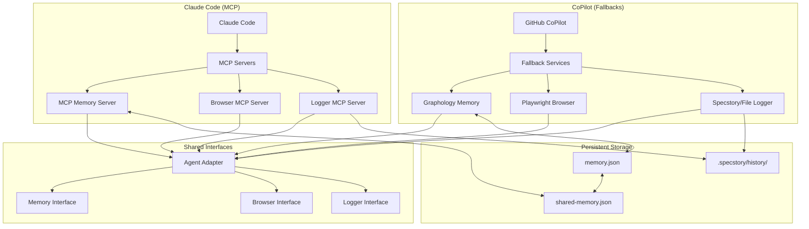
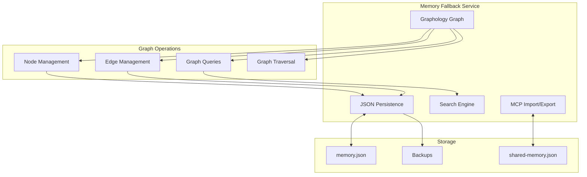
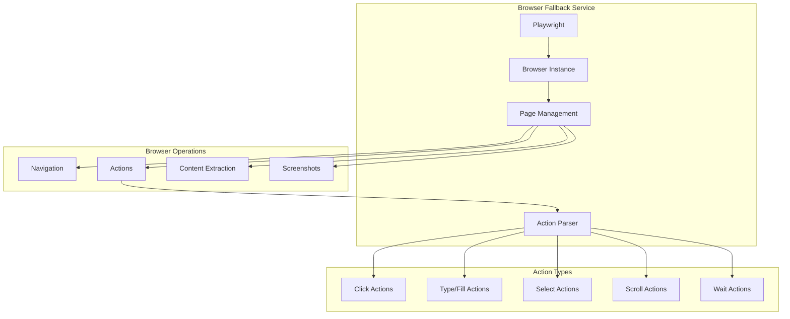
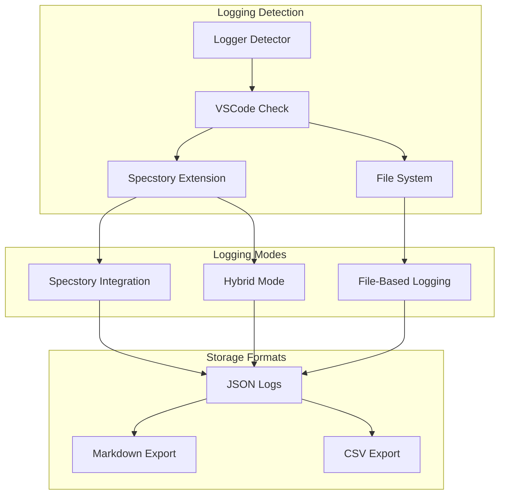
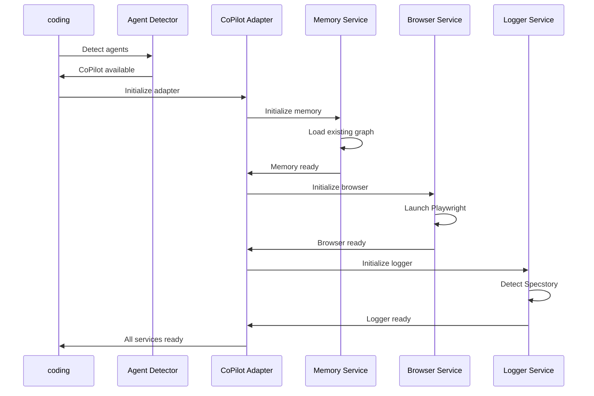

# Fallback Services Architecture

This document describes the fallback services that provide feature parity for GitHub CoPilot users, ensuring they have access to the same memory, browser automation, and logging capabilities as Claude Code users.

## Overview

The fallback services system implements the same feature set as Claude Code's MCP servers using pure JavaScript solutions, ensuring no agent lock-in and consistent functionality across different AI coding assistants.

## Architecture Overview



## Memory Fallback Service (Graphology)

### Why Graphology?

After evaluating multiple graph database options, **Graphology** was chosen for the memory fallback because:

- ✅ **Pure JavaScript** - No native dependencies
- ✅ **Lightweight** - Small footprint, fast startup
- ✅ **Feature-rich** - Full graph operations, algorithms
- ✅ **Persistent** - JSON serialization/deserialization
- ✅ **Compatible** - Can import/export MCP memory format

### Architecture



### Implementation

```javascript
class MemoryFallbackService {
  constructor(config) {
    this.graph = new Graph({ multi: true });
    this.dbPath = config.dbPath || '.coding-tools/memory.json';
  }

  async createEntities(entities) {
    for (const entity of entities) {
      const nodeId = this.getNodeId(entity.name);
      this.graph.addNode(nodeId, {
        ...entity,
        created: new Date().toISOString()
      });
    }
    await this.saveGraph();
  }

  async searchNodes(query) {
    const results = [];
    this.graph.forEachNode((node, attributes) => {
      if (this.matchesQuery(attributes, query)) {
        results.push(this.formatNode(node, attributes));
      }
    });
    return results;
  }
}
```

### Performance Characteristics

| Operation | Complexity | Performance |
|-----------|------------|-------------|
| **Add Node** | O(1) | ~0.1ms |
| **Add Edge** | O(1) | ~0.1ms |
| **Search** | O(n) | ~1ms/1000 nodes |
| **Traversal** | O(V+E) | ~5ms/1000 nodes |
| **Persistence** | O(V+E) | ~10ms/1000 nodes |

## Browser Fallback Service (Playwright)

### Architecture



### Implementation

```javascript
class BrowserFallbackService {
  async initialize() {
    this.browser = await playwright.chromium.launch({
      headless: false
    });
    this.page = await this.browser.newPage();
  }

  async act(action, variables = {}) {
    const actionLower = action.toLowerCase();
    
    if (actionLower.includes('click')) {
      const selector = this.extractSelector(action, variables);
      await this.page.click(selector);
      return { success: true, action: 'clicked', selector };
    }
    
    if (actionLower.includes('type')) {
      const selector = this.extractSelector(action, variables);
      const text = this.extractText(action, variables);
      await this.page.fill(selector, text);
      return { success: true, action: 'typed', selector, text };
    }
    
    // Additional action types...
  }
}
```

### Action Parser

The action parser interprets natural language commands into browser actions:

```javascript
class ActionParser {
  parseAction(action) {
    const patterns = [
      { 
        pattern: /click (?:the )?(.+)/i, 
        type: 'click',
        extract: (match) => ({ selector: match[1] })
      },
      { 
        pattern: /type "(.+)" (?:in|into) (?:the )?(.+)/i, 
        type: 'type',
        extract: (match) => ({ text: match[1], selector: match[2] })
      },
      {
        pattern: /scroll (?:to )?(.+)/i,
        type: 'scroll',
        extract: (match) => ({ target: match[1] })
      }
    ];
    
    for (const { pattern, type, extract } of patterns) {
      const match = action.match(pattern);
      if (match) {
        return { type, ...extract(match) };
      }
    }
    
    throw new Error(`Could not parse action: ${action}`);
  }
}
```

## Logging Fallback Service

### Multi-Modal Logging Strategy



### Specstory Integration

```javascript
class SpecstoryAdapter {
  async initialize() {
    // Try multiple connection methods
    this.extensionApi = await this.connectViaHTTP() || 
                       await this.connectViaIPC() ||
                       await this.connectViaFileWatch();
    return !!this.extensionApi;
  }

  async connectViaHTTP() {
    const ports = [7357, 7358, 7359];
    for (const port of ports) {
      try {
        const response = await this.httpRequest({
          hostname: 'localhost',
          port,
          path: '/api/status'
        });
        
        if (response.includes('specstory')) {
          return { log: (data) => this.httpLog(port, data) };
        }
      } catch (error) {
        // Try next port
      }
    }
    return null;
  }

  async connectViaFileWatch() {
    const watchDir = path.join(os.homedir(), '.specstory', 'watch');
    await fs.mkdir(watchDir, { recursive: true });
    
    return {
      log: async (data) => {
        const filename = `${Date.now()}-${process.pid}.json`;
        await fs.writeFile(
          path.join(watchDir, filename),
          JSON.stringify(data, null, 2)
        );
      }
    };
  }
}
```

### File-Based Logging

```javascript
class LoggerFallbackService {
  async logConversation(entry) {
    // Try Specstory first
    if (this.hasSpecstory) {
      const logged = await this.specstoryAdapter.logConversation(entry);
      if (logged) return { success: true, method: 'specstory' };
    }
    
    // Fallback to file-based
    const sessionFile = path.join(this.logDir, `${this.sessionId}.json`);
    const session = JSON.parse(await fs.readFile(sessionFile, 'utf8'));
    
    session.entries.push({
      ...entry,
      timestamp: new Date().toISOString(),
      index: session.entries.length
    });
    
    await fs.writeFile(sessionFile, JSON.stringify(session, null, 2));
    return { success: true, method: 'file' };
  }
}
```

## Service Lifecycle Management

### Initialization Sequence



### Cleanup and Shutdown

```javascript
class CoPilotAdapter {
  async cleanup() {
    const cleanupTasks = [];
    
    if (this.memoryService) {
      cleanupTasks.push(this.memoryService.saveGraph());
    }
    
    if (this.browserService) {
      cleanupTasks.push(this.browserService.closeBrowser());
    }
    
    if (this.loggingService) {
      cleanupTasks.push(this.loggingService.flushLogs());
    }
    
    await Promise.all(cleanupTasks);
  }
}
```

## Error Handling and Resilience

### Graceful Degradation

```javascript
class ResilientService {
  async executeWithFallback(operation, fallback) {
    try {
      return await operation();
    } catch (error) {
      console.warn(`Primary operation failed: ${error.message}`);
      return await fallback();
    }
  }
  
  async memoryCreate(entities) {
    return await this.executeWithFallback(
      () => this.memoryService.createEntities(entities),
      () => this.saveToFileSystem(entities)
    );
  }
}
```

### Service Health Monitoring

```javascript
class ServiceHealthMonitor {
  constructor(services) {
    this.services = services;
    this.healthChecks = new Map();
  }
  
  async checkHealth() {
    const results = {};
    
    for (const [name, service] of Object.entries(this.services)) {
      try {
        const health = await service.healthCheck();
        results[name] = { status: 'healthy', ...health };
      } catch (error) {
        results[name] = { status: 'unhealthy', error: error.message };
      }
    }
    
    return results;
  }
}
```

## Performance Optimization

### Lazy Loading

```javascript
class LazyService {
  constructor() {
    this._service = null;
  }
  
  async getService() {
    if (!this._service) {
      this._service = await this.initializeService();
    }
    return this._service;
  }
  
  async operation() {
    const service = await this.getService();
    return await service.operation();
  }
}
```

### Caching Strategy

```javascript
class CachedMemoryService {
  constructor(baseService) {
    this.baseService = baseService;
    this.cache = new LRUCache({ maxSize: 1000 });
  }
  
  async searchNodes(query) {
    const cacheKey = `search:${query}`;
    
    if (this.cache.has(cacheKey)) {
      return this.cache.get(cacheKey);
    }
    
    const results = await this.baseService.searchNodes(query);
    this.cache.set(cacheKey, results);
    return results;
  }
}
```

## Compatibility and Migration

### MCP Format Compatibility

```javascript
class MCPCompatibilityLayer {
  convertToMCPFormat(graphData) {
    return {
      nodes: graphData.nodes.map(node => ({
        name: node.name,
        entityType: node.entityType,
        observations: node.observations || []
      })),
      edges: graphData.edges.map(edge => ({
        from: edge.from,
        to: edge.to,
        relationType: edge.relationType
      }))
    };
  }
  
  convertFromMCPFormat(mcpData) {
    return {
      nodes: mcpData.nodes || [],
      edges: mcpData.edges || []
    };
  }
}
```

### Data Migration

```javascript
async function migrateFromClaudeToGraph() {
  // Read MCP memory data
  const mcpData = await readMCPMemory();
  
  // Initialize graph service
  const graphService = new MemoryFallbackService();
  await graphService.initialize();
  
  // Import data
  await graphService.importFromMCP(mcpData);
  
  console.log('Migration completed successfully');
}
```

## Testing Strategy

### Unit Tests

```javascript
describe('Fallback Services', () => {
  test('Memory service CRUD operations', async () => {
    const memory = new MemoryFallbackService();
    await memory.initialize();
    
    await memory.createEntities([testEntity]);
    const results = await memory.searchNodes('test');
    expect(results).toHaveLength(1);
  });
  
  test('Browser service navigation', async () => {
    const browser = new BrowserFallbackService();
    await browser.initialize();
    
    const result = await browser.navigate('https://example.com');
    expect(result.success).toBe(true);
  });
});
```

### Integration Tests

```javascript
describe('Service Integration', () => {
  test('CoPilot adapter full workflow', async () => {
    const adapter = new CoPilotAdapter();
    await adapter.initialize();
    
    // Test memory operations
    await adapter.memoryCreate([testEntity]);
    const results = await adapter.memorySearch('test');
    expect(results).toHaveLength(1);
    
    // Test browser operations
    await adapter.browserNavigate('https://example.com');
    const content = await adapter.browserExtract();
    expect(content).toBeDefined();
    
    await adapter.cleanup();
  });
});
```

This fallback services architecture ensures that GitHub CoPilot users have access to the same powerful features as Claude Code users, while maintaining performance, reliability, and compatibility across the agent-agnostic ecosystem.