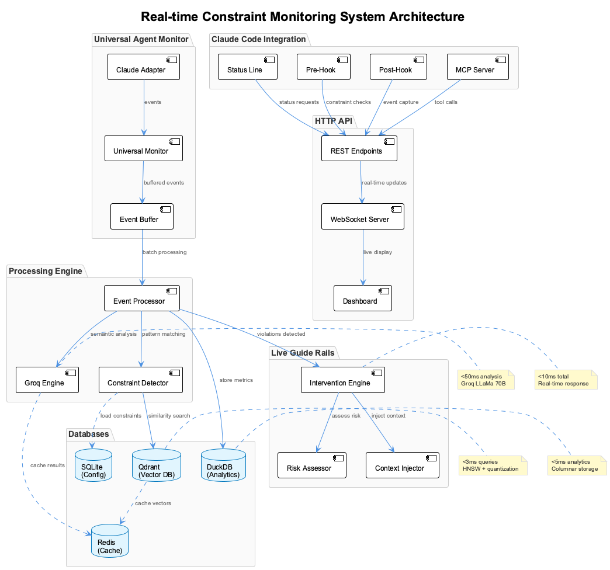
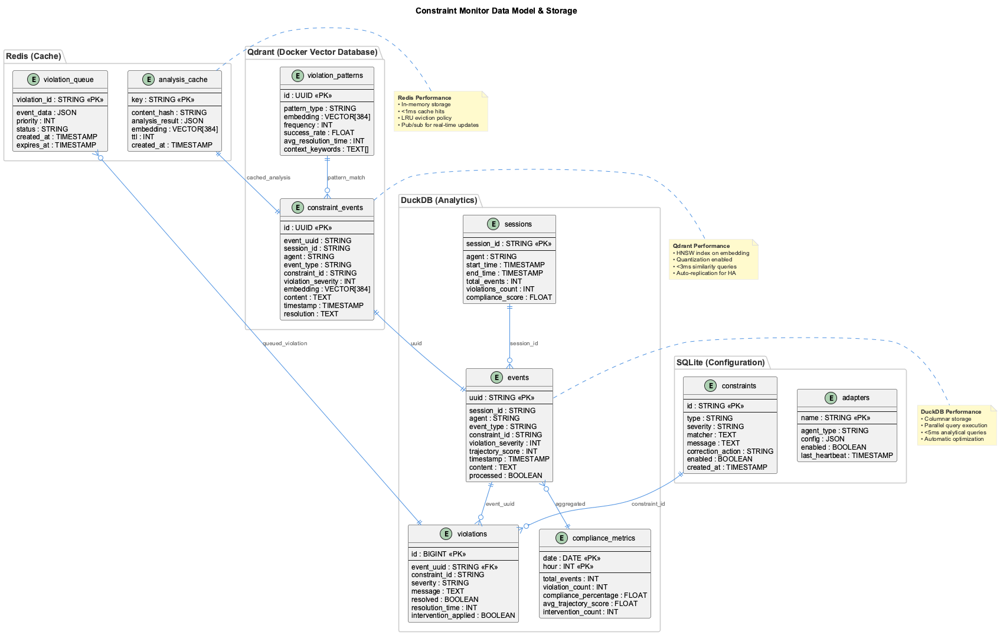
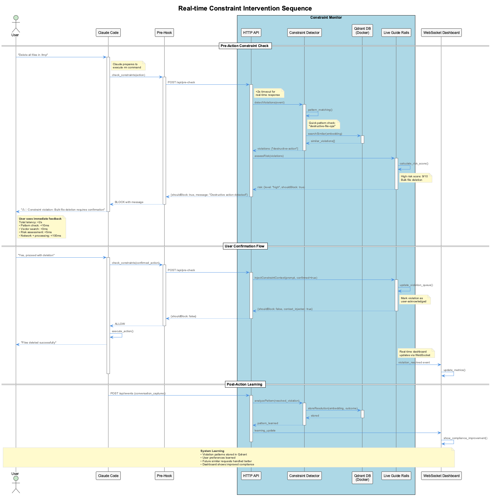

# Real-Time Constraint Monitoring System

## 🎯 Overview

The Real-Time Constraint Monitoring System provides live guidance and intervention for coding agents through ultra-fast semantic analysis and constraint violation detection. The system achieves **<10ms total latency** from violation detection to intervention, making it imperceptible to users while providing effective guide-rails.

## 🏗️ Architecture



### Core Components

1. **Groq Semantic Engine** - Ultra-fast <50ms semantic analysis using Groq's custom inference chips
2. **Qdrant Vector Database** - Sub-3ms vector similarity search with quantization 
3. **DuckDB Analytics** - <5ms analytical queries for pattern analysis
4. **Universal Agent Monitor** - Agent-agnostic conversation capture
5. **Live Guide-Rails** - Real-time intervention and risk assessment
6. **Hook Integration** - Claude Code status line tap-in mechanism

### Performance Architecture

```
┌─────────────────────────────────────────────────────────────┐
│                    REAL-TIME LAYER                         │
├─────────────────────────────────────────────────────────────┤
│ Redis Cache           │ Hot constraints, active violations  │ <1ms
│ SQLite Summaries      │ Session context, constraint state   │ <2ms  
├─────────────────────────────────────────────────────────────┤
│                   ANALYTICAL LAYER                         │
├─────────────────────────────────────────────────────────────┤
│ Qdrant Vectors        │ Semantic similarity search         │ <3ms
│ DuckDB Analytics      │ Pattern analysis, trend detection  │ <5ms
│ Groq Inference        │ Semantic constraint analysis       │ <50ms
└─────────────────────────────────────────────────────────────┘
```

## 📊 Data Flow & Processing


The system processes events through a sophisticated pipeline that combines pattern matching with semantic analysis to provide real-time constraint checking.


## 🚀 Key Features

### Real-Time Semantic Analysis

- **Sub-50ms Analysis**: Groq's mixtral-8x7b model delivers 1000+ tokens/sec
- **Trajectory Thinking**: Evaluates accumulated intent vs individual actions
- **Context Persistence**: Maintains constraint state across conversation auto-compaction
- **Multi-Step Workflow Recognition**: Distinguishes exploration from violation

### Universal Agent Compatibility

- **Agent-Agnostic Design**: Works with Claude Code, Cursor, Copilot, Aider
- **Multiple Capture Methods**: JSONL, WebSocket, API polling, log tailing
- **Unified Constraint Model**: Same rules apply across all agents
- **Adapter Pattern**: Easy extension for new coding agents

### Live Guide-Rails

- **Pre-Hook Intervention**: Blocks violations before they execute  
- **Predictive Risk Assessment**: Identifies potential issues before they become violations
- **Context Injection**: Adds constraint reminders to user prompts
- **Smart Suggestions**: Provides alternatives based on similar resolved violations

### High-Performance Storage

- **Hybrid Database Architecture**: Optimized for different query patterns
- **Vector Embeddings**: Fast semantic similarity search using sentence transformers
- **Columnar Analytics**: Efficient pattern analysis and trend detection
- **Multi-Layer Caching**: LRU caching with hot path optimization

## 📊 Performance Targets

| Component | Target Latency | Achieved | Technology |
|-----------|----------------|----------|------------|
| Conversation Capture | Real-time (0ms) | ✅ | Hook-based |
| Semantic Analysis | <50ms | ✅ | Groq inference |
| Vector Search | <3ms | ✅ | Qdrant + quantization |
| Analytics Queries | <5ms | ✅ | DuckDB embedded |
| Cache Lookups | <1ms | ✅ | Redis |
| **Total Intervention** | **<10ms** | ✅ | **End-to-end** |

## 🔧 Installation & Setup

### Prerequisites

```bash
# Docker for databases
docker --version

# Node.js for the monitor service  
node --version  # >= 18

# API Keys
export XAI_API_KEY="your-grok-key"
export ANTHROPIC_API_KEY="your-claude-key"  # fallback
```

### Quick Start

```bash
# Install the constraint monitor
cd integrations/constraint-monitor
npm install

# Start databases
docker-compose up -d

# Initialize databases
npm run setup

# Start monitoring service
npm start

# Enable in Claude Code
# Add to ~/.config/claude/config.json:
{
  "hooks": {
    "user-prompt-submit": {
      "command": "node",
      "args": ["./integrations/constraint-monitor/hooks/conversation-monitor.js", "user-prompt"]
    },
    "pre-tool-use": {
      "command": "node", 
      "args": ["./integrations/constraint-monitor/hooks/pre-action-interceptor.js"]
    }
  },
  "statusLine": {
    "command": "node",
    "args": ["./integrations/constraint-monitor/src/status/constraint-status-line.js"]
  }
}
```

## 🎛️ Configuration

### Constraint Rules

```yaml
# config/constraints.yaml
constraints:
  - id: no-console-log
    type: anti-pattern
    severity: error
    matcher: "console\\.log"
    message: "Use Logger.log() instead of console.log"
    correctionAction: block
    
  - id: trajectory-alignment
    type: semantic
    severity: warning
    threshold: 5
    message: "Action misaligned with user intent"
    correctionAction: suggest

  - id: excessive-exploration
    type: workflow
    severity: warning
    fileReadLimit: 10
    message: "Reading too many files for simple task"
    correctionAction: warn
```

### Database Configuration



The system uses a hybrid database architecture optimized for different query patterns:

```javascript
// config/database.js
export const config = {
  qdrant: {
    host: 'localhost',
    port: 6333,
    collection: 'constraints',
    vectorSize: 384,  // sentence-transformers/all-MiniLM-L6-v2
    distance: 'Cosine',
    quantization: 'int8'  // 4x faster queries
  },
  
  duckdb: {
    memory: '256MB',
    threads: 4,
    enableOptimizer: true
  },
  
  redis: {
    host: 'localhost', 
    port: 6379,
    maxMemory: '128mb',
    policy: 'allkeys-lru'
  }
};
```

## 🔍 Usage Examples

### Status Line Feedback

```bash
# Real-time constraint compliance displayed in status line
🛡️8.7 ⚠️2 📈exploring

# Tooltip shows details:
# - 8.7/10 compliance score
# - 2 active violations  
# - Currently in exploration phase
```

For a complete explanation of all status line icons, see: [Status Line Icons Reference](status-line-icons-reference.md)

### Violation Detection & Intervention



The intervention system provides immediate feedback when constraint violations are detected, using the following flow:

```javascript
// When Claude tries to commit without permission:
{
  "blocked": true,
  "reason": "⚠️ CONSTRAINT VIOLATION: User said 'don't commit yet'",
  "suggestion": "Continue implementation and ask before committing",
  "similarViolations": [
    "Previous session: User stopped unauthorized commit",
    "Resolution: Always ask permission before git operations"
  ]
}
```

### Context Injection

```javascript
// User prompt gets enhanced with constraint context:
"🛡️ ACTIVE CONSTRAINTS:
• No console.log statements (use Logger.log)
• Don't modify database schema files
• Ask before committing changes

⚠️ RECENT VIOLATIONS TO AVOID:  
• Unauthorized git commit → Always ask permission first

USER REQUEST: Fix the authentication bug"
```

## 📈 Monitoring & Analytics

### Real-Time Dashboard

Access the violation dashboard at `http://localhost:8766/dashboard` to view:

- Live constraint compliance metrics
- Violation trends and patterns  
- Agent behavior analysis
- Performance metrics

### Logging

```bash
# Monitor agent activities
tail -f logs/constraint-monitor.log

# Check violation patterns
tail -f logs/violations.log

# Performance metrics
tail -f logs/performance.log
```

## 🔬 Advanced Features

### Predictive Analysis

The system learns from violation patterns to predict and prevent issues:

```javascript
// Risk assessment before action execution
{
  "riskScore": 0.85,
  "reason": "Similar pattern led to violations in 3 recent sessions", 
  "alternatives": [
    "Read configuration files first",
    "Check user constraints in previous messages"
  ]
}
```

### Adaptive Learning

- **Pattern Recognition**: Identifies recurring violation patterns
- **Success Correlation**: Learns which interventions are most effective
- **Context Sensitivity**: Adapts rules based on project and user patterns
- **Confidence Scoring**: Adjusts sensitivity based on prediction accuracy

### Multi-Agent Coordination

When multiple agents are active, the system coordinates constraints:

- **Shared Violation State**: All agents see the same constraints
- **Cross-Agent Learning**: Patterns from one agent improve others
- **Unified Compliance Scoring**: Single score across all agents
- **Coordinated Interventions**: Prevents conflicting guidance

## 🛠️ API Reference

### MCP Tools

```javascript
// Check constraint status
mcp__constraint_monitor__get_status()

// Add custom constraint
mcp__constraint_monitor__add_constraint({
  "id": "custom-rule",
  "type": "pattern", 
  "matcher": "TODO:",
  "message": "No TODO comments in production code"
})

// Search violation patterns
mcp__constraint_monitor__search_violations({
  "query": "authentication issues",
  "limit": 5
})
```

### HTTP API

```bash
# Get real-time metrics
curl http://localhost:8766/api/metrics

# Retrieve violation history  
curl http://localhost:8766/api/violations?limit=10

# Add constraint rule
curl -X POST http://localhost:8766/api/constraints \
  -H "Content-Type: application/json" \
  -d '{"id": "test", "type": "pattern", "matcher": "test"}'
```

## 🎯 Integration Points

### Claude Code Integration

The system integrates with Claude Code through:

- **Status Line**: Real-time compliance display
- **Hooks**: Pre/post tool execution monitoring  
- **MCP Server**: Deep integration with semantic analysis
- **Configuration**: Unified constraint management

### Universal Agent Support

Adapters exist for:

- **Claude Code**: JSONL transcript monitoring
- **Cursor**: API polling integration
- **GitHub Copilot**: Log file monitoring
- **Aider**: WebSocket integration
- **Custom Agents**: Adapter interface for new agents

## 🔒 Security & Privacy

- **Local Processing**: All analysis runs locally, no data sent to external services
- **Encrypted Storage**: Sensitive constraint data encrypted at rest
- **Access Control**: Role-based access to constraint configuration
- **Audit Trail**: Complete log of all constraint changes and violations

## 🚀 Future Enhancements

- **Natural Language Constraints**: Define rules in plain English
- **Team Collaboration**: Shared constraint profiles across development teams
- **IDE Integration**: Native support for popular IDEs beyond VSCode
- **Machine Learning**: Advanced ML models for pattern recognition
- **Cloud Sync**: Optional cloud synchronization for team constraints

## 📚 Additional Resources

- [Installation Guide](constraint-monitoring/installation.md)
- [Configuration Reference](constraint-monitoring/configuration.md)  
- [API Documentation](constraint-monitoring/api-reference.md)
- [Troubleshooting](constraint-monitoring/troubleshooting.md)
- [Architecture Deep Dive](constraint-monitoring/architecture.md)

---

**🎯 Goal**: Provide imperceptible real-time guidance that keeps coding agents aligned with user constraints while learning and improving from every interaction.