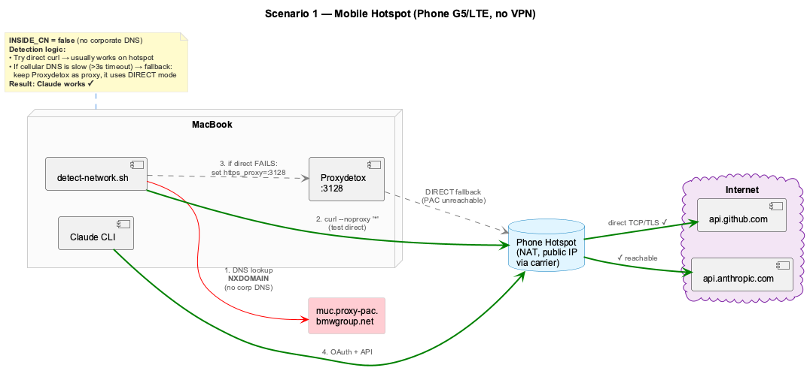
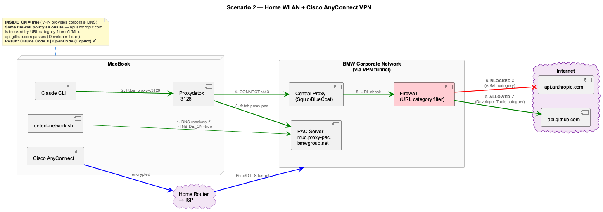
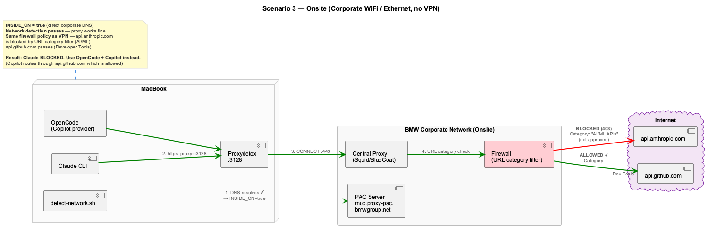
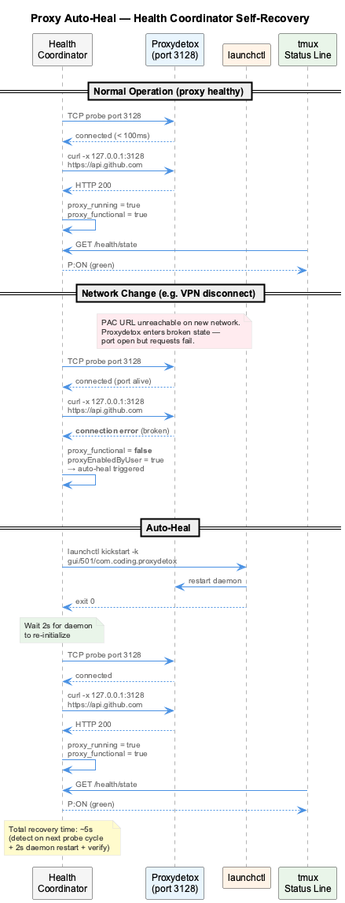
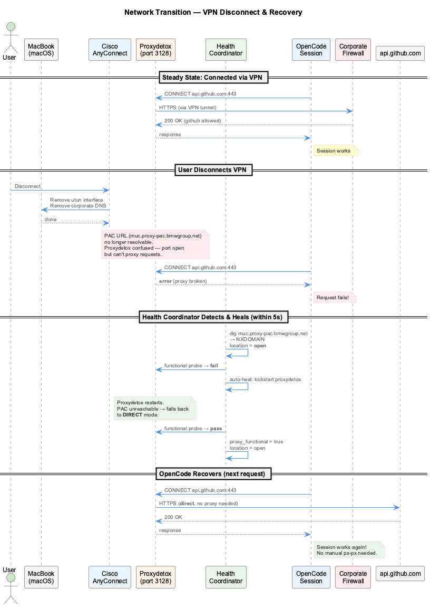

# Network Configuration

## Overview

The coding system operates across three network scenarios. Each has different
connectivity paths and implications for which AI providers are reachable.

**Key fact:** `api.anthropic.com` is blocked by the corporate URL category filter
in all scenarios (VPN, onsite, hotspot). Only `api.github.com` (GitHub Copilot)
passes the firewall. Claude Code therefore only works when routed through
a non-corporate network path.

## Network Scenarios

### Scenario 1: Mobile Hotspot (G5/LTE)

Use case: working from anywhere without VPN — tethered to a phone.

- **N:OPEN** — no corporate DNS, no VPN tunnel
- macOS System Auto Proxy (PAC URL) is configured but **PAC fetch fails**
  (corporate DNS unavailable → `muc.proxy-pac.bmwgroup.net` unresolvable)
- Proxydetox falls back to **DIRECT** mode (no PAC needed)
- `api.github.com` reachable via Proxydetox DIRECT → **OpenCode works**
- `api.anthropic.com` reachable (no firewall) → **Claude Code works** (if
  API key is available)

**Previous bug (fixed):** `detect-network.sh` unset all proxy env vars before
testing connectivity when outside CN. Direct curl with a 3s timeout could fail
on slow cellular DNS. With proxy vars gone, the fallback proxy test also failed
→ "No internet". Fix: preserve proxy vars until direct connectivity is confirmed.

### Scenario 2: VPN from Home

Use case: working from home, connected to corporate network via Cisco AnyConnect.

- **N:CN** — AnyConnect provides corporate DNS and routing
- PAC URL resolves → Proxydetox fetches PAC → routes through corporate proxy
- `api.github.com` passes the firewall → **OpenCode works**
- `api.anthropic.com` **blocked** (URL category filter: AI/ML) → **Claude Code fails**

### Scenario 3: Onsite (Corporate Network)

Use case: working from a BMW office, connected to the corporate LAN/WLAN.

- **N:CN** — direct corporate network access
- Same firewall policy as VPN
- `api.github.com` passes → **OpenCode works**
- `api.anthropic.com` **blocked** → **Claude Code fails**

## Connectivity Matrix

| Scenario | Network | Proxy | api.github.com | api.anthropic.com | OpenCode | Claude Code |
|----------|---------|-------|----------------|-------------------|----------|-------------|
| Hotspot  | N:OPEN  | DIRECT fallback | OK | OK | OK | OK* |
| VPN      | N:CN    | PAC → Corp Proxy | OK | **Blocked** | OK | **Fails** |
| Onsite   | N:CN    | PAC → Corp Proxy | OK | **Blocked** | OK | **Fails** |

*\* Requires Anthropic API key configured*

## Proxy Architecture

### Components

- **macOS System Auto Proxy** — PAC URL (`muc.proxy-pac.bmwgroup.net/proxy.pac`)
  always configured in Network Preferences
- **Proxydetox** — local proxy daemon on `127.0.0.1:3128`, managed via launchd.
  Reads the system PAC and routes traffic accordingly. Falls back to DIRECT when
  PAC is unreachable.
- **Cisco AnyConnect** — VPN client providing corporate DNS and IP routing
- **Corporate Proxy** — upstream proxy that applies URL category filtering
  (blocks AI/ML endpoints like `api.anthropic.com`)

### Proxy Status Commands

| Command | Effect |
|---------|--------|
| `px`    | **Toggle** proxy ON/OFF (loads/unloads Proxydetox launchd plist) |
| `px s`  | **Show** proxy status without toggling |

### Protocol Stack

| Layer | Component | Role |
|-------|-----------|------|
| L7 | curl / Node.js HTTP client | Application request |
| L7 | Proxydetox (`127.0.0.1:3128`) | Local HTTP proxy, PAC evaluation |
| L7 | Corporate Proxy | URL filtering, DLP |
| L4 | Cisco AnyConnect | VPN tunnel (when connected) |
| L3 | macOS Network | Interface routing (Wi-Fi, cellular, VPN) |

## Auto-Heal: Proxy Recovery

The health coordinator automatically detects and recovers from proxy failures
caused by sleep/wake cycles or network transitions (e.g., disconnecting VPN).

### How It Works

1. Health coordinator probes Proxydetox every 15 seconds (functional test via
   `api.github.com`, not just port check)
2. If proxy is user-enabled but non-functional → switches to **5-second probe
   interval** (rapid recovery mode)
3. Auto-kickstarts Proxydetox via `launchctl kickstart -k`
4. Proxydetox reinitializes on new network, falls back to DIRECT if PAC
   unreachable
5. Next application request succeeds (proxy vars still point to
   `127.0.0.1:3128`)

### Sleep/Wake Detection

The health coordinator detects wake-from-sleep by comparing timestamps between
successive ticks. If the gap exceeds 15 seconds (normal tick is 5s), it triggers
an immediate network re-probe and proxy health check rather than waiting for the
next scheduled cycle.

## Network Transition Flow

When switching between network environments (e.g., leaving VPN), the system
handles the transition automatically:

### Startup Detection (`detect-network.sh`)

1. **DNS probe** — resolves `muc.proxy-pac.bmwgroup.net` to determine CN
   membership
2. **Proxy configuration** — if inside CN, enables proxy; if outside, preserves
   existing proxy vars (does NOT blindly unset them)
3. **Connectivity test** — tests direct first, then via proxy if direct fails
4. **Proxydetox health** — if user-enabled but port dead, auto-restarts via
   launchctl

### Runtime Recovery (Health Coordinator)

- Continuous functional probing of proxy (not just port liveness)
- Automatic kickstart on failure detection
- Rapid probe mode (5s) when proxy is in recovery
- Wake-from-sleep detection triggers immediate re-probe
