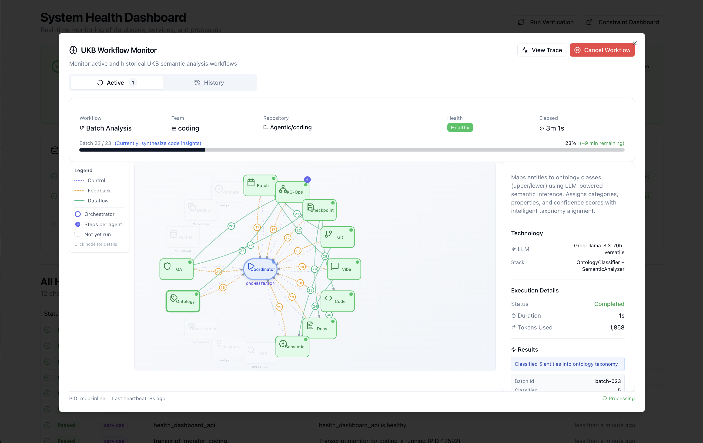
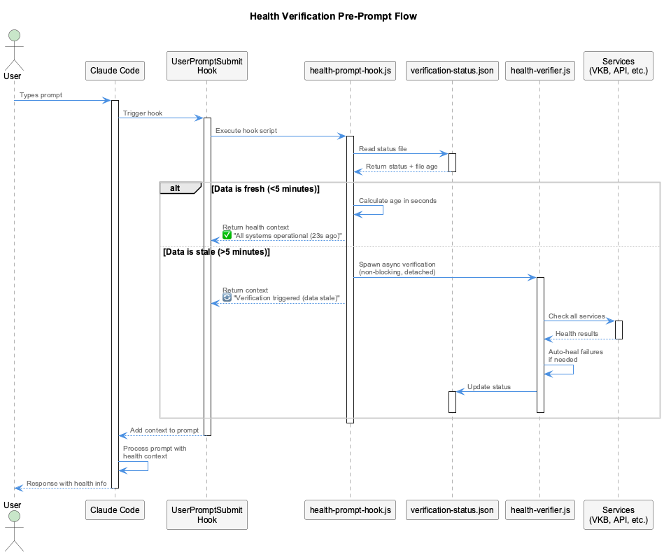

# Health System

Automatic system health monitoring and self-healing that ensures a stable development environment.


## What It Provides

The Health System provides **failsafe monitoring** with automatic verification and recovery:

- **Pre-Prompt Checks** - Verifies system health before every Claude prompt
- **Self-Monitoring** - The health system monitors itself
- **Auto-Healing** - Automatically restarts failed services
- **Status Line** - Real-time indicators in Claude Code status bar with API quota monitoring
- **Dashboard** - Visual monitoring at `http://localhost:3032` with 4-card system (Databases, Services, Processes, API Quota)

## Architecture


### Core Components

The health system is built on interconnected components with active supervision:


| Component | File | Purpose |
|-----------|------|---------|
| **GlobalProcessSupervisor** | `global-process-supervisor.js` | Active supervision - 30s checks, restarts dead services |
| **HealthVerifier** | `health-verifier.js` | Core verification engine with dynamic discovery & auto-healing |
| **StatusLineHealthMonitor** | `statusline-health-monitor.js` | Health aggregation for Claude Code status bar |
| **CombinedStatusLine** | `combined-status-line.js` | Status display + fallback supervisor (60s rate limit) |
| **EnhancedTranscriptMonitor** | `enhanced-transcript-monitor.js` | Real-time per-project transcript monitoring |
| **LiveLoggingCoordinator** | `live-logging-coordinator.js` | Logging orchestration with multi-user support |
| **ProcessStateManager** | `process-state-manager.js` | Unified registry with atomic file locking (used by all) |

### Supervision Architecture


**Active Supervision Layer** - GlobalProcessSupervisor actively monitors and restarts dead services
**Verification Layer** - HealthVerifier runs periodic checks with dynamic project discovery
**Status Aggregation Layer** - StatusLineHealthMonitor + CombinedStatusLine display health
**Per-Project Layer** - EnhancedTranscriptMonitor + LiveLoggingCoordinator per session
**Core Infrastructure** - ProcessStateManager provides unified process registry

### Key Features

- **Dynamic Discovery** - Discovers ALL projects from PSM, health files, and Claude transcript directories
- **Active Supervision** - GlobalProcessSupervisor actively restarts dead monitors within 30 seconds
- **Cooldown Protection** - 5-minute cooldown per service prevents restart storms
- **Rate Limiting** - Max 10 restarts per hour per service
- **Fallback Supervision** - CombinedStatusLine provides backup restart capability

## Component Details

### GlobalProcessSupervisor (`scripts/global-process-supervisor.js`) - Active Supervision
- **Active supervision of ALL transcript monitors and global services**
- 30-second supervision loop with dynamic project discovery
- Discovers projects from: PSM registry, health files, Claude transcript directories
- 5-minute cooldown per service prevents restart storms
- Max 10 restarts per hour per service (safety limit)
- Heartbeat file: `.health/supervisor-heartbeat.json`
- Started via: `start-services-robust.js` or manually

### ProcessStateManager (`scripts/process-state-manager.js`) - Core Infrastructure
- Unified registry for all system processes
- Atomic file operations via proper-lockfile
- Session-aware process tracking (global, per-project, per-session)
- Storage: `.live-process-registry.json`

### HealthVerifier (`scripts/health-verifier.js`) - Verification Layer
- Core verification engine with 60-second periodic checks
- **Dynamic discovery of ALL projects** (enabled via `dynamic_discovery: true` in config)
- Checks databases (LevelDB, Qdrant, SQLite, Memgraph), services, processes
- Generates health scores (0-100) per service
- Triggers auto-healing via HealthRemediationActions

### StatusLineHealthMonitor (`scripts/statusline-health-monitor.js`) - Status Aggregation
- Health aggregation for Claude Code status bar
- 15-second update interval with auto-healing
- **Only shows sessions with running transcript monitors**
- Outputs to: `.logs/statusline-health-status.txt`

### CombinedStatusLine (`scripts/combined-status-line.js`) - Status Display + Fallback
- Displays health status in Claude Code status bar
- **`ensureAllTranscriptMonitorsRunning()`** - Fallback supervisor for all projects
- 60-second rate limiting to prevent restart storms
- Acts as backup if GlobalProcessSupervisor is not running

### EnhancedTranscriptMonitor (`scripts/enhanced-transcript-monitor.js`) - Per-Project
- Real-time transcript monitoring per project
- 2-second check interval for prompt detection
- Writes health files to centralized `.health/` directory
- Generates LSL files in `.specstory/history/`

### LiveLoggingCoordinator (`scripts/live-logging-coordinator.js`) - Logging
- Orchestrates live logging components
- Manages LSLFileManager and operational logging
- Multi-user support with user hash tracking
- Performance metrics collection

### Supporting Components

**Pre-Prompt Hook** (`scripts/health-prompt-hook.js`)
- Runs automatically before every Claude prompt
- Returns cached status if fresh (<5 minutes)
- Spawns async verification if stale

**Auto-Healing** (`scripts/health-remediation-actions.js`)
- Automatic service restart capabilities
- Database lock cleanup
- Zombie process termination

**Crash Recovery** (`scripts/start-services-robust.js`)
- Pre-startup cleanup of dangling processes
- Automatic cleanup after VSCode/Claude crashes
- Graceful shutdown tracking for crash detection

**Orphan Cleanup** (`bin/cleanup-orphans`)
- Manual cleanup utility for orphaned processes
- Targets stuck ukb/vkb operations, invalid transcript monitors
- Dry-run mode for safe previewing

**Status Line Display** (`scripts/combined-status-line.js`)
- Reads from StatusLineHealthMonitor output
- Real-time indicators in Claude Code status bar
- Multi-session support with smart abbreviations

**API Quota Checker** (`lib/api-quota-checker.js`)
- Shared library for LLM provider quota monitoring
- Multi-provider support with smart caching
- Used by both statusline and dashboard

**Dashboard** (`integrations/system-health-dashboard/`)
- React-based real-time visualization at port 3032
- 4-card monitoring system (Databases, Services, Processes, API Quota)
- UKB Workflow Monitor with visual workflow graph of agent execution
- Service status indicators
- Auto-healing history
- Manual restart controls
- Real-time API quota tracking



## What It Monitors

### Databases
- **LevelDB** - Knowledge graph storage
- **Qdrant** - Vector database (port 6333)
- **SQLite** - Analytics database
- **Memgraph** - Code graph database (port 7687 Bolt protocol, port 3100 Lab UI)
- **CGR Cache** - Code graph index staleness (commit tracking)

### Services
- **VKB Server** - Knowledge visualization (port 8080)
- **Constraint Monitor** - Code quality enforcement (port 3031)
- **Dashboard Server** - Health dashboard (port 3030)
- **Health API** - Self-monitoring API (port 3033)

### Processes
- Stale PID detection
- Zombie cleanup
- Resource monitoring

### Transcript Monitor
- **LSL Health** - Verifies transcript monitor is running and processing
- **Exchange Activity** - Tracks exchange count and last processed UUID
- **Suspicious Activity** - Detects stuck or stale monitors

### API Quota
- **Groq** - Free tier (`Gq●`) or monthly billing (`Gq$2JAN`)
- **Google Gemini** - Free tier quota (15 RPM, 1M TPD)
- **Anthropic Claude** - Prepaid credits (`A$18`) or billing-based
- **OpenAI** - Prepaid credits or billing-based
- **X.AI (Grok)** - Free credits monitoring (`X$25`)

## How It Works



**Quick Flow**:
1. User issues Claude prompt
2. Pre-prompt hook fires
3. Check health status (<5 min old? Use cache : Spawn verification)
4. Background verification checks all systems
5. Auto-healing triggers if failures detected
6. Status updated in dashboard and status line

**Detailed Flow**: See [Enhanced Health Monitoring](./enhanced-health-monitoring.md)

## Quick Start

### View Dashboard

```bash
# Dashboard automatically available at:
http://localhost:3032

# Or start manually:
cd integrations/system-health-dashboard
npm run dev
```

### Check System Health

```bash
# Manual health check
node scripts/health-verifier.js

# View status
cat .health/verification-status.json | jq '.'
```

### Status Line

The status line appears automatically in Claude Code:

```
[C🟢 UT🫒] [🛡️ 67% 🔍EX] [Gq$2JAN A$18 X$25] [📚✅] [🏥✅] 📋17-18
```

**Components:**
- `[C🟢 UT🫒]` - Active sessions with activity icons (sleeping sessions hidden)
- `[🛡️ 67% 🔍EX]` - Constraint compliance percentage + trajectory state
- `[Gq$2JAN A$18 X$25]` - API quota status (Groq $2 spent in Jan, etc.)
- `[📚✅]` - Knowledge system status (icons only, no counts)
- `[🏥✅]` - Unified health (GCM + Health Verifier + Enforcement)
- `📋17-18` - LSL time window (HHMM-HHMM)

See [Status Line System](./status-line.md) for complete documentation.

## Detailed Documentation

### In-Depth Guides

- **[Status Line System](./status-line.md)** - Complete status line documentation including architecture, state diagrams, multi-session support, and configuration
- **[Enhanced Health Monitoring](./enhanced-health-monitoring.md)** - Comprehensive health monitoring system with auto-recovery, plug'n'play behavior, and session management
- **[4-Layer Architecture](./4-layer-architecture-implementation-plan.md)** - Detailed architectural design and implementation plan
- **[Monitoring System](./monitoring-system.md)** - Core monitoring components and integration patterns
- **[Process Management](./process-management-analysis.md)** - Process lifecycle management and recovery mechanisms
- **[Robust Startup System](./robust-startup-system.md)** - Service startup, initialization, and failsafe mechanisms

### Related Systems

- **[System Health Dashboard](../../integrations/system-health-dashboard/)** - Dashboard UI and API documentation
- **[LSL](../lsl/)** - Health events logged in session logs
- **[Constraints](../constraints/)** - Constraint monitor is a monitored service
- **[Knowledge Management](../knowledge-management/)** - Monitors VKB, LevelDB, Qdrant
- **[Trajectories](../trajectories/)** - Trajectory state shown in status line

## Key Files

**Core Health Components**:
- `scripts/global-process-supervisor.js` - Active supervision of all services
- `scripts/process-state-manager.js` - Unified process registry with atomic locking
- `scripts/health-verifier.js` - Core verification with dynamic discovery & auto-healing
- `scripts/statusline-health-monitor.js` - Health aggregation daemon
- `scripts/combined-status-line.js` - Status display + fallback supervisor
- `scripts/enhanced-transcript-monitor.js` - Per-project monitoring
- `scripts/live-logging-coordinator.js` - Logging orchestration

**Supporting Scripts**:
- `scripts/health-prompt-hook.js` - Pre-prompt integration
- `scripts/health-remediation-actions.js` - Auto-healing actions
- `scripts/start-services-robust.js` - Service startup with supervisor
- `lib/api-quota-checker.js` - API quota checking (shared library)

**Data Files**:
- `.live-process-registry.json` - ProcessStateManager registry
- `.health/supervisor-heartbeat.json` - GlobalProcessSupervisor heartbeat
- `.health/verification-status.json` - HealthVerifier output
- `.health/*-transcript-monitor-health.json` - Per-project health files
- `.logs/statusline-health-status.txt` - StatusLineHealthMonitor output

**Configuration**:
- `config/health-verification-rules.json` - Health check rules with `dynamic_discovery` flag

**Dashboard**:
- `integrations/system-health-dashboard/server.js` - API server (port 3033)
- `integrations/system-health-dashboard/src/` - React UI (port 3032)
- `integrations/system-health-dashboard/src/store/slices/apiQuotaSlice.ts` - API quota state

## Troubleshooting

**Dashboard not loading?**
```bash
curl http://localhost:3033/api/health
PORT=3030 npm run dashboard
```

**Services stuck unhealthy?**
```bash
node scripts/health-verifier.js
cat .health/verification-status.json | jq '.'
```

**Auto-healing not working?**
```bash
cat logs/health-remediation.log
cat scripts/health-checks-config.json | jq '.vkb_server.auto_heal'
```

For comprehensive troubleshooting, see [Enhanced Health Monitoring](./enhanced-health-monitoring.md#troubleshooting).
