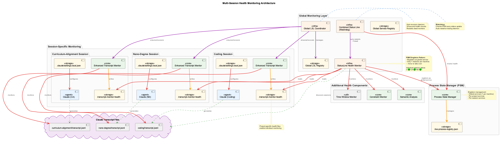

# Health System

Automatic system health monitoring and self-healing that ensures a stable development environment.


## What It Provides

The Health System provides **failsafe monitoring** with automatic verification and recovery:

- **Pre-Prompt Checks** - Verifies system health before every Claude prompt
- **Self-Monitoring** - The health system monitors itself
- **Auto-Healing** - Automatically restarts failed services
- **Status Line** - Real-time indicators in Claude Code status bar with API quota monitoring
- **Dashboard** - Visual monitoring at `http://localhost:3032` with 4-card system (Databases, Services, Processes, API Quota)

## Architecture


### 9 Core Classes

The health system is built on 9 interconnected classes across 6 architectural layers:


| Layer | Class | File | Purpose |
|-------|-------|------|---------|
| 0 | **SystemMonitorWatchdog** | `system-monitor-watchdog.js` | Ultimate failsafe - runs via cron/launchd, ensures GSC always runs |
| 1 | **GlobalServiceCoordinator** | `global-service-coordinator.js` | Self-healing daemon managing all critical services |
| 1 | **GlobalLSLCoordinator** | `global-lsl-coordinator.js` | Multi-project transcript monitoring manager |
| 2 | **MonitoringVerifier** | `monitoring-verifier.js` | Pre-session verification (exit 0=OK, 1=FAIL, 2=WARN) |
| 3 | **HealthVerifier** | `health-verifier.js` | Core verification engine with auto-healing |
| 4 | **StatusLineHealthMonitor** | `statusline-health-monitor.js` | Health aggregation for Claude Code status bar |
| 5 | **EnhancedTranscriptMonitor** | `enhanced-transcript-monitor.js` | Real-time per-project transcript monitoring |
| 5 | **LiveLoggingCoordinator** | `live-logging-coordinator.js` | Logging orchestration with multi-user support |
| Core | **ProcessStateManager** | `process-state-manager.js` | Unified registry with atomic file locking (used by all) |

### 6-Layer Protection Architecture



**Layer 0: System Failsafe** - SystemMonitorWatchdog runs via launchd
**Layer 1: Service Management** - GlobalServiceCoordinator + GlobalLSLCoordinator
**Layer 2: Pre-Session Verification** - MonitoringVerifier validates before Claude starts
**Layer 3: Health Verification** - HealthVerifier runs periodic checks with auto-healing
**Layer 4: Presentation** - StatusLineHealthMonitor aggregates and displays health
**Layer 5: Per-Project** - EnhancedTranscriptMonitor + LiveLoggingCoordinator per session

## Core Components

### 9 Health System Classes

**ProcessStateManager** (`scripts/process-state-manager.js`) - Core Infrastructure
- Unified registry for all system processes
- Atomic file operations via proper-lockfile
- Session-aware process tracking (global, per-project, per-session)
- Storage: `.live-process-registry.json`

**SystemMonitorWatchdog** (`scripts/system-monitor-watchdog.js`) - Layer 0
- Ultimate failsafe "monitor monitoring the monitor"
- Runs via system cron/launchd every minute
- Ensures GlobalServiceCoordinator is always running
- Cannot be killed by user processes

**GlobalServiceCoordinator** (`scripts/global-service-coordinator.js`) - Layer 1
- Self-healing service management daemon
- 15-second health checks with exponential backoff recovery
- Manages: constraint API, constraint dashboard, MCP servers
- Maintains service registry

**GlobalLSLCoordinator** (`scripts/global-lsl-coordinator.js`) - Layer 1
- Multi-project transcript monitoring manager
- 30-second health checks on all registered projects
- Auto-recovery of dead Enhanced Transcript Monitors
- Maintains: `.global-lsl-registry.json`

**MonitoringVerifier** (`scripts/monitoring-verifier.js`) - Layer 2
- Pre-session verification of all monitoring systems
- Exit codes: 0=OK, 1=Critical failure (MUST NOT START), 2=Warning
- Validates: watchdog, coordinator, project registration, service health

**HealthVerifier** (`scripts/health-verifier.js`) - Layer 3
- Core verification engine with 60-second periodic checks
- Checks databases (LevelDB, Qdrant, SQLite, Memgraph), services, processes
- Generates health scores (0-100) per service
- Triggers auto-healing via HealthRemediationActions

**StatusLineHealthMonitor** (`scripts/statusline-health-monitor.js`) - Layer 4
- Health aggregation for Claude Code status bar
- 15-second update interval with auto-healing
- **Only shows sessions with running transcript monitors**
- Outputs to: `.logs/statusline-health-status.txt`

**EnhancedTranscriptMonitor** (`scripts/enhanced-transcript-monitor.js`) - Layer 5
- Real-time transcript monitoring per project
- 2-second check interval for prompt detection
- Writes health files to centralized `.health/` directory
- Generates LSL files in `.specstory/history/`

**LiveLoggingCoordinator** (`scripts/live-logging-coordinator.js`) - Layer 5
- Orchestrates live logging components
- Manages LSLFileManager and operational logging
- Multi-user support with user hash tracking
- Performance metrics collection

### Supporting Components

**Pre-Prompt Hook** (`scripts/health-prompt-hook.js`)
- Runs automatically before every Claude prompt
- Returns cached status if fresh (<5 minutes)
- Spawns async verification if stale

**Auto-Healing** (`scripts/health-remediation-actions.js`)
- Automatic service restart capabilities
- Database lock cleanup
- Zombie process termination

**Crash Recovery** (`scripts/start-services-robust.js`)
- Pre-startup cleanup of dangling processes
- Automatic cleanup after VSCode/Claude crashes
- Graceful shutdown tracking for crash detection

**Orphan Cleanup** (`bin/cleanup-orphans`)
- Manual cleanup utility for orphaned processes
- Targets stuck ukb/vkb operations, invalid transcript monitors
- Dry-run mode for safe previewing

**Status Line Display** (`scripts/combined-status-line.js`)
- Reads from StatusLineHealthMonitor output
- Real-time indicators in Claude Code status bar
- Multi-session support with smart abbreviations

**API Quota Checker** (`lib/api-quota-checker.js`)
- Shared library for LLM provider quota monitoring
- Multi-provider support with smart caching
- Used by both statusline and dashboard

**Dashboard** (`integrations/system-health-dashboard/`)
- React-based real-time visualization at port 3032
- 4-card monitoring system (Databases, Services, Processes, API Quota)
- Service status indicators
- Auto-healing history
- Manual restart controls
- Real-time API quota tracking

## What It Monitors

### Databases
- **LevelDB** - Knowledge graph storage
- **Qdrant** - Vector database (port 6333)
- **SQLite** - Analytics database
- **Memgraph** - Code graph database (port 7687 Bolt protocol, port 3100 Lab UI)

### Services
- **VKB Server** - Knowledge visualization (port 8080)
- **Constraint Monitor** - Code quality enforcement (port 3031)
- **Dashboard Server** - Health dashboard (port 3030)
- **Health API** - Self-monitoring API (port 3033)

### Processes
- Stale PID detection
- Zombie cleanup
- Resource monitoring

### Transcript Monitor
- **LSL Health** - Verifies transcript monitor is running and processing
- **Exchange Activity** - Tracks exchange count and last processed UUID
- **Suspicious Activity** - Detects stuck or stale monitors

### API Quota
- **Groq** - Free tier quota (7.2M tokens/day, 14.4K RPM)
- **Google Gemini** - Free tier quota (15 RPM, 1M TPD)
- **Anthropic Claude** - Billing-based (estimated status)
- **OpenAI** - Billing-based (estimated status)
- **X.AI (Grok)** - Free credits monitoring ($25)

## How It Works


**Quick Flow**:
1. User issues Claude prompt
2. Pre-prompt hook fires
3. Check health status (<5 min old? Use cache : Spawn verification)
4. Background verification checks all systems
5. Auto-healing triggers if failures detected
6. Status updated in dashboard and status line

**Detailed Flow**: See [Enhanced Health Monitoring](./enhanced-health-monitoring.md)

## Quick Start

### View Dashboard

```bash
# Dashboard automatically available at:
http://localhost:3032

# Or start manually:
cd integrations/system-health-dashboard
npm run dev
```

### Check System Health

```bash
# Manual health check
node scripts/health-verifier.js

# View status
cat .health/verification-status.json | jq '.'
```

### Status Line

The status line appears automatically in Claude Code:

```
[🏥 95% | 🛡️ 94% ⚙️ IMP | [Gq● A$18 O○ X$25] | 📋🟠2130-2230(3min) | C ND]
```

**Components:**
- 🏥 95% - System health percentage
- 🛡️ 94% - Constraint compliance percentage
- ⚙️ IMP - Trajectory state (implementing)
- [Gq● A$18 O○ X$25] - API quota status:
  - Gq● - Groq (green dot = available)
  - A$18 - Anthropic ($18 remaining credit)
  - O○ - OpenAI (empty dot = unavailable/no key)
  - X$25 - X.AI ($25 remaining credit)
- 📋🟠2130-2230 - LSL window (orange = active, time range)
- C ND - Active projects (C=coding, ND=nano-degree)

See [Status Line System](./status-line.md) for complete documentation.

## Detailed Documentation

### In-Depth Guides

- **[Status Line System](./status-line.md)** - Complete status line documentation including architecture, state diagrams, multi-session support, and configuration
- **[Enhanced Health Monitoring](./enhanced-health-monitoring.md)** - Comprehensive health monitoring system with auto-recovery, plug'n'play behavior, and session management
- **[4-Layer Architecture](./4-layer-architecture-implementation-plan.md)** - Detailed architectural design and implementation plan
- **[Monitoring System](./monitoring-system.md)** - Core monitoring components and integration patterns
- **[Process Management](./process-management-analysis.md)** - Process lifecycle management and recovery mechanisms
- **[Robust Startup System](./robust-startup-system.md)** - Service startup, initialization, and failsafe mechanisms

### Related Systems

- **[System Health Dashboard](../../integrations/system-health-dashboard/)** - Dashboard UI and API documentation
- **[LSL](../lsl/)** - Health events logged in session logs
- **[Constraints](../constraints/)** - Constraint monitor is a monitored service
- **[Knowledge Management](../knowledge-management/)** - Monitors VKB, LevelDB, Qdrant
- **[Trajectories](../trajectories/)** - Trajectory state shown in status line

## Key Files

**9 Core Health Classes** (in layer order):
- `scripts/process-state-manager.js` - Core: Unified process registry with atomic locking
- `scripts/system-monitor-watchdog.js` - Layer 0: Ultimate failsafe (cron/launchd)
- `scripts/global-service-coordinator.js` - Layer 1: Service management daemon
- `scripts/global-lsl-coordinator.js` - Layer 1: Multi-project LSL manager
- `scripts/monitoring-verifier.js` - Layer 2: Pre-session verification
- `scripts/health-verifier.js` - Layer 3: Core verification with auto-healing
- `scripts/statusline-health-monitor.js` - Layer 4: Health aggregation daemon
- `scripts/enhanced-transcript-monitor.js` - Layer 5: Per-project monitoring
- `scripts/live-logging-coordinator.js` - Layer 5: Logging orchestration

**Supporting Scripts**:
- `scripts/health-prompt-hook.js` - Pre-prompt integration
- `scripts/health-remediation-actions.js` - Auto-healing actions
- `scripts/combined-status-line.js` - Status line display
- `lib/api-quota-checker.js` - API quota checking (shared library)

**Data Files**:
- `.live-process-registry.json` - ProcessStateManager registry
- `.global-lsl-registry.json` - GlobalLSLCoordinator registry
- `.health/verification-status.json` - HealthVerifier output
- `.health/*-transcript-monitor-health.json` - Per-project health files
- `.logs/statusline-health-status.txt` - StatusLineHealthMonitor output

**Dashboard**:
- `integrations/system-health-dashboard/server.js` - API server (port 3033)
- `integrations/system-health-dashboard/src/` - React UI (port 3032)
- `integrations/system-health-dashboard/src/store/slices/apiQuotaSlice.ts` - API quota state

## Troubleshooting

**Dashboard not loading?**
```bash
curl http://localhost:3033/api/health
PORT=3030 npm run dashboard
```

**Services stuck unhealthy?**
```bash
node scripts/health-verifier.js
cat .health/verification-status.json | jq '.'
```

**Auto-healing not working?**
```bash
cat logs/health-remediation.log
cat scripts/health-checks-config.json | jq '.vkb_server.auto_heal'
```

For comprehensive troubleshooting, see [Enhanced Health Monitoring](./enhanced-health-monitoring.md#troubleshooting).
