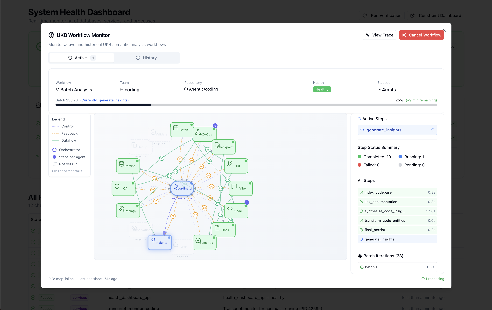
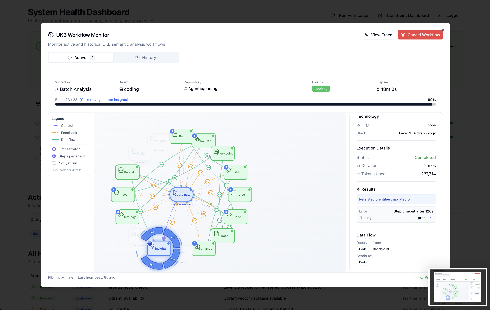

# Enhanced Health Monitoring System

## Overview

The Enhanced Health Monitoring System provides comprehensive health tracking and status reporting across all Claude Code sessions. This system includes individual session monitoring, smart abbreviation generation, auto-recovery mechanisms, multi-project coordination through a 6-layer protection architecture with 9 core classes, and real-time API quota monitoring for LLM providers.


## System Architecture

### 6-Layer Protection Architecture


The system implements a robust 6-layer monitoring protection with 9 core classes:

| Layer | Class | Purpose |
|-------|-------|---------|
| **Layer 0** | SystemMonitorWatchdog | Ultimate failsafe - runs via cron/launchd, ensures GSC always runs |
| **Layer 1** | GlobalServiceCoordinator | Self-healing daemon managing all critical services |
| **Layer 1** | GlobalLSLCoordinator | Multi-project transcript monitoring manager |
| **Layer 2** | MonitoringVerifier | Pre-session verification (exit 0=OK, 1=FAIL, 2=WARN) |
| **Layer 3** | HealthVerifier | Core verification engine with auto-healing |
| **Layer 4** | StatusLineHealthMonitor | Health aggregation for Claude Code status bar |
| **Layer 5** | EnhancedTranscriptMonitor | Real-time per-project transcript monitoring |
| **Layer 5** | LiveLoggingCoordinator | Logging orchestration with multi-user support |
| **Core** | ProcessStateManager | Unified registry with atomic file locking (used by all) |


### Core Components (9 Classes by Layer)

#### Core Infrastructure: ProcessStateManager (`scripts/process-state-manager.js`)
- Unified registry for all system processes (`.live-process-registry.json`)
- Atomic file operations via proper-lockfile
- Session-aware process tracking (global, per-project, per-session)
- Used by ALL other health system classes

#### Layer 0: SystemMonitorWatchdog (`scripts/system-monitor-watchdog.js`)
- Ultimate failsafe "monitor monitoring the monitor"
- Runs via system cron/launchd every minute
- Ensures GlobalServiceCoordinator is always running
- Cannot be killed by user processes

#### Layer 1: GlobalServiceCoordinator (`scripts/global-service-coordinator.js`)
- Self-healing service management daemon
- 15-second health checks with exponential backoff recovery
- Manages: constraint API, constraint dashboard, MCP servers
- Service registry maintenance

#### Layer 1: GlobalLSLCoordinator (`scripts/global-lsl-coordinator.js`)
- Multi-project transcript monitoring manager
- 30-second health checks on all registered projects
- Auto-recovery of dead Enhanced Transcript Monitors
- Maintains: `.global-lsl-registry.json`

#### Layer 2: MonitoringVerifier (`scripts/monitoring-verifier.js`)
- Pre-session verification of all monitoring systems
- Exit codes: 0=OK, 1=Critical failure (MUST NOT START), 2=Warning
- Validates: watchdog, coordinator, project registration, service health

#### Layer 3: HealthVerifier (`scripts/health-verifier.js`)
- Core verification engine with 15-second periodic checks
- Checks databases (LevelDB, Qdrant, SQLite, Memgraph, CGR Cache), services, processes
- Generates health scores (0-100) per service
- Triggers auto-healing via HealthRemediationActions
- **Daemon Robustness**: Heartbeat mechanism, error handlers, and external watchdog

#### Layer 4: StatusLineHealthMonitor (`scripts/statusline-health-monitor.js`)
- Health aggregation for Claude Code status bar
- 15-second update interval with auto-healing
- **Only shows sessions with running transcript monitors**
- Outputs to: `.logs/statusline-health-status.txt`

#### Layer 5: EnhancedTranscriptMonitor (`scripts/enhanced-transcript-monitor.js`)
- Real-time per-project transcript monitoring
- 2-second check interval for prompt detection
- Writes health files to centralized `.health/` directory
- Generates LSL files in `.specstory/history/`

#### Layer 5: LiveLoggingCoordinator (`scripts/live-logging-coordinator.js`)
- Orchestrates live logging components
- Manages LSLFileManager and operational logging
- Multi-user support with user hash tracking
- Performance metrics collection

### Supporting Components

#### Combined Status Line (`scripts/combined-status-line.js`)
- Reads from StatusLineHealthMonitor output
- Unified status display across all Claude Code sessions
- Individual session status with smart abbreviations
- Integration with constraint monitoring and semantic analysis

#### API Quota Checker (`lib/api-quota-checker.js`)
- Shared library for checking LLM provider quotas
- Multi-provider support (Groq, Google, Anthropic, OpenAI, X.AI)
- Two-tier caching strategy (30s real-time, 5min estimated)
- Used by both statusline and dashboard for consistency

## StatusLine Architecture


### Session Discovery Methods

The system uses multiple discovery methods to ensure all active sessions are monitored:

1. **Registry-based Discovery**: Uses Global LSL Registry for registered sessions
2. **Dynamic Discovery**: Scans Claude transcript directories for unregistered sessions
3. **Cross-reference Validation**: Verifies monitor processes are alive and healthy
4. **Live Transcript Scanning**: Finds sessions regardless of activity age (removed 1-hour filter)

**Recent Enhancement**: Removed the 1-hour transcript activity filter to ensure dormant sessions like nano-degree are properly discovered and displayed. The system now shows all sessions with existing transcript monitors, regardless of when they last had activity.

### Smart Abbreviation Engine

Project names are automatically abbreviated using intelligent algorithms:

- **coding** → **C**
- **curriculum-alignment** → **CA** 
- **nano-degree** → **ND**
- **project-management** → **PM**
- **user-interface** → **UI**

The algorithm handles:
- Single words: First letter (coding → C)
- Hyphenated words: First letter of each part (curriculum-alignment → CA)
- Camel case: Capital letters (projectManagement → PM)
- Multiple separators: Intelligent parsing

## Auto-Recovery Mechanisms


### Plug'n'Play Behavior

The system provides seamless recovery without requiring user intervention:

1. **Dead Monitor Detection**: Identifies stale or crashed monitor processes
2. **Automatic Recovery**: Spawns new monitors for unmonitored sessions
3. **Registry Updates**: Maintains accurate process tracking
4. **Health Verification**: Confirms recovery success

### Recovery Scenarios

- **Stale PID Recovery**: Detects and replaces dead process IDs
- **Missing Monitor Recovery**: Creates monitors for active but unmonitored sessions
- **Coordinator Recovery**: Restarts coordination processes when needed
- **Health Check Recovery**: Resumes health checking when coordinator fails

### Global Monitoring Enhancements

**Recent Additions**: Enhanced constraint monitoring system now includes:

1. **Port Connectivity Monitoring**: Tests dashboard (port 3030) and API (port 3031) connectivity
2. **CPU Usage Detection**: Identifies stuck processes consuming excessive CPU (>50%)
3. **Process Health Validation**: Verifies running processes match expected PIDs
4. **Stuck Server Detection**: Automatically detects and reports unresponsive dashboard servers

**Implementation**: Added comprehensive health checks in `statusline-health-monitor.js`:
- HTTP connectivity tests for dashboard and API endpoints
- Process CPU monitoring via `ps` command parsing
- Automatic detection of high CPU usage processes
- Integration with global monitoring to catch issues that previously went unnoticed

## Daemon Robustness Mechanism

The HealthVerifier daemon implements a defense-in-depth approach to ensure continuous, uninterrupted health monitoring. This addresses scenarios where Node.js daemons can fail silently (e.g., setInterval timers stopping without error).


### Heartbeat Mechanism

The daemon writes a heartbeat file every verification cycle to prove liveness:

**Location**: `.health/verifier-heartbeat.json`

```json
{
  "pid": 64832,
  "timestamp": "2025-12-14T07:32:42.292Z",
  "uptime": 30.98,
  "memoryUsage": 11647584,
  "cycleCount": 2
}
```

**Key Fields**:
- `pid`: Process ID for external verification
- `timestamp`: Last heartbeat time (detects stale daemons)
- `cycleCount`: Number of completed verification cycles
- `uptime`: Process uptime in seconds

### Error Handlers

Global error handlers prevent silent failures:

```javascript
process.on('uncaughtException', (error) => {
  this.log(`UNCAUGHT EXCEPTION: ${error.message}`, 'ERROR');
  // Log but don't exit - attempt recovery
});

process.on('unhandledRejection', (reason) => {
  this.log(`UNHANDLED REJECTION: ${reason}`, 'ERROR');
  // Log but don't exit - attempt recovery
});
```

### Timer Self-Check

A secondary interval monitors the main timer:

```javascript
this.timerCheckInterval = setInterval(() => {
  if (!this.timer) {
    this.log('Main timer cleared unexpectedly! Restarting...', 'ERROR');
    this.timer = setInterval(runCycle, interval);
  }
}, interval * 2);
```

### API Server Watchdog

The System Health API server (`server.js`) includes a watchdog that monitors the daemon:

**Watchdog Flow**:
1. On every `/api/health-verifier/status` request, check daemon heartbeat
2. If heartbeat is stale (>60s) or process is dead, restart daemon
3. Log watchdog actions for debugging

**Key Methods**:
- `checkDaemonHeartbeat()`: Reads heartbeat file, checks process liveness via `kill(pid, 0)`
- `restartDaemon()`: Stops existing daemon (if any) and spawns new one

```javascript
checkDaemonHeartbeat() {
  const heartbeat = JSON.parse(readFileSync(heartbeatPath));
  const age = Date.now() - new Date(heartbeat.timestamp).getTime();

  // Check if process is alive
  try {
    process.kill(heartbeat.pid, 0);  // Signal 0 = check existence
    processAlive = true;
  } catch (e) {
    processAlive = false;
  }

  return {
    alive: processAlive && age < 60000,
    staleMs: age,
    pid: heartbeat.pid,
    reason: !processAlive ? 'process dead' : (age >= 60000 ? 'heartbeat stale' : 'ok')
  };
}
```

### Defense-in-Depth Summary

| Layer | Mechanism | Protection |
|-------|-----------|------------|
| Internal | Error Handlers | Catches uncaught exceptions/rejections |
| Internal | Timer Self-Check | Detects if setInterval stops |
| External | Heartbeat File | Proves daemon is alive and cycling |
| External | API Watchdog | Auto-restarts stale/dead daemons |

This multi-layer approach ensures the health verification daemon remains operational even in adverse conditions like memory pressure, unhandled errors, or mysterious timer failures.

## Health Dashboard

The system includes a real-time web-based health dashboard accessible at `http://localhost:3032` that provides comprehensive monitoring across four key areas:

### Dashboard Features


**Monitoring Cards:**

1. **Databases** (LevelDB, Qdrant, CGR Cache)
   - Real-time connection status
   - Lock detection and ownership tracking
   - Availability monitoring
   - CGR Cache staleness tracking (commits behind, threshold-based alerts)

2. **Services** (VKB Server, Constraint Monitor, Dashboard)
   - Port connectivity checks
   - Process health validation
   - Service uptime tracking

3. **Processes** (Process Registry, Stale PIDs)
   - Process State Manager (PSM) status
   - Automatic stale PID cleanup
   - Process lifecycle tracking

4. **API Quota** (LLM Providers)
   - Real-time quota monitoring for all configured providers
   - Provider status: Groq, Google Gemini, Anthropic Claude, OpenAI, X.AI (Grok)
   - Usage percentage and remaining quota display
   - Color-coded health indicators (🟢 operational, 🟡 warning, 🔴 error)
   - Support for both free tier and billing-based providers
   - Auto-refresh every 5 seconds

**API Quota Provider Support:**

| Provider | Abbreviation | Quota Type | Display |
|----------|--------------|------------|---------|
| Groq | Gq | Free tier (7.2M tokens/day) | Shows percentage |
| Google Gemini | Ggl | Free tier (15 RPM, 1M TPD) | Shows percentage |
| Anthropic Claude | A | Billing-based | Estimated status |
| OpenAI | O | Billing-based | Estimated status |
| X.AI (Grok) | X | Free credits ($25) | Shows percentage |

**Dashboard Actions:**
- **Run Verification**: Manually trigger health verification
- **Auto-Healing**: Toggle automatic recovery mechanisms
- **Live Updates**: Real-time status updates every 5 seconds
- **Violation Tracking**: Detailed view of active system violations
- **Recommendations**: Actionable suggestions for system health improvement

### UKB Workflow Monitor

The dashboard includes a dedicated UKB Workflow Monitor that provides visual tracking of knowledge base update workflows:


**Features:**
- **Visual Multi-Agent Workflow Graph** - Hub-and-spoke visualization showing the Coordinator orchestrating 13 specialized agents (Git, Vibe, Code, Semantic, Ontology, QA, etc.)
- **Agent Status Indicators** - Real-time execution status per agent (running, completed, not yet run)
- **Pipeline Statistics** - Commits processed, sessions analyzed, candidates discovered vs. final entities
- **Deduplication Metrics** - Shows reduction percentage (e.g., 86.9% reduction from raw to final)
- **Entity Breakdown** - Final counts by type (GraphDatabase, MCPAgent, System, Pattern, etc.)
- **Execution Details** - Duration, LLM provider used (e.g., Groq llama-3.3-70b), completion status
- **Historical View** - Browse past workflow executions with full details



**Sub-Steps Visualization:**

The workflow graph now displays sub-steps for multi-step agents. Click the blue badge on an agent node to expand and view its internal processing steps:


Each sub-step arc shows the step name and can be clicked to view detailed information including inputs, outputs, and LLM usage:



**Sub-Steps Features:**
- **Auto-expand on running**: When a multi-step agent starts executing, its sub-steps automatically expand with animation
- **Pulsing animation**: Running agents display a pulsing glow effect on their sub-step arcs
- **Rotating indicator**: A rotating dashed circle shows active processing
- **Click to select**: Click any sub-step arc to view its detailed information in the sidebar
- **Inputs/Outputs**: Each sub-step shows what data it receives and produces
- **LLM Usage**: Indicates whether the sub-step uses no LLM, fast, standard, or premium models

**Execution Tracing:**


The "View Trace" button opens the execution trace modal showing the complete timeline of all workflow steps with detailed timing, outputs, and any errors encountered.

**Access:** Click the "UKB Workflow Monitor" card on the dashboard or navigate to the dedicated tab.

## StatusLine Display Format

### Current Display
```
[C🟢 UT🫒] [🛡️ 67% 🔍EX] [Gq● A$18 X$25] [📚✅] [🏥✅] 📋17-18
```

### Component Breakdown

| Component | Icon | Description | Example |
|-----------|------|-------------|---------|
| Active Sessions | `[C🟢 UT🫒]` | Project abbreviations with activity icons | C=coding (active), UT=ui-template (fading) |
| Constraint Compliance | `🛡️ 67%` | Code quality compliance | 67% compliance |
| Trajectory State | `🔍EX` | Development activity | EX=exploring, IMP=implementing |
| API Quota | `[Gq● A$18 X$25]` | LLM provider availability | Groq available, Anthropic $18 |
| Knowledge System | `[📚✅]` | Knowledge extraction status | ✅=healthy, ⚠️=issues |
| Unified Health | `[🏥✅]` | GCM + Health Verifier + Enforcement | ✅=all healthy |
| LSL Time Window | `📋17-18` | Session time range | 17:00-18:00 |

### Session Activity Indicators

Sessions use a graduated color scheme based on time since last activity:

| Icon | Status | Time Since Activity | Display |
|------|--------|---------------------|---------|
| 🟢 | Active | < 5 minutes | Shown |
| 🌲 | Cooling | 5 - 15 minutes | Shown |
| 🫒 | Fading | 15 min - 1 hour | Shown |
| 🪨 | Dormant | 1 - 6 hours | Shown |
| ⚫ | Inactive | 6 - 24 hours | Shown |
| 💤 | Sleeping | > 24 hours | **Hidden** |

### Unified Health Indicator

The `[🏥...]` indicator combines:
- **GCM (Global Coding Monitor)**: Session coordinator health
- **Health Verifier**: Service, database, process health
- **Constraint Enforcement**: Whether constraints are actively enforced

| Display | Meaning |
|---------|---------|
| `[🏥✅]` | All systems healthy |
| `[🏥⚠️]` | Issues detected - check dashboard |
| `[🏥⏰]` | Health data stale (>2 min old) |
| `[🏥❌]` | Critical issues |
| `[🏥💤]` | Health verifier offline |

**Note**: Violation counts are no longer shown. Details available on dashboard at http://localhost:3033.

### Session Filtering

**Sleeping sessions (>24 hours) are automatically hidden** to reduce status line clutter:
- Only sessions active within 24 hours are displayed
- Sessions rediscover automatically when they become active
- Keeps status line focused on relevant projects

## Health Data Storage

### Centralized Health Files

All health files are centralized in the coding project's `.health/` directory to maintain clean git workspaces:

- **Location**: `/Users/q284340/Agentic/coding/.health/`
- **Pattern**: `{projectName}-transcript-monitor-health.json`
- **Git Management**: Excluded via coding's `.gitignore`

#### File Structure
```
coding/.health/
├── coding-transcript-monitor-health.json
├── curriculum-alignment-transcript-monitor-health.json
└── nano-degree-transcript-monitor-health.json
```

#### Health File Format
```json
{
  "timestamp": 1759046473900,
  "projectPath": "/Users/q284340/Agentic/coding",
  "transcriptPath": "/Users/.../coding/ff78b04f-7bf1-47f3-8bd5-95fad54132bf.jsonl",
  "status": "running",
  "userHash": "g9b30a",
  "metrics": {
    "memoryMB": 14,
    "memoryTotalMB": 27,
    "cpuUser": 6114958,
    "cpuSystem": 1783796,
    "uptimeSeconds": 6812,
    "processId": 78580
  },
  "transcriptInfo": {
    "status": "active",
    "sizeBytes": 2453561,
    "ageMs": 1417,
    "lastFileSize": 2453561
  },
  "activity": {
    "lastExchange": "b23853b3-26e9-42b2-ac52-a50817818382",
    "exchangeCount": 20,
    "isSuspicious": false,
    "suspicionReason": null
  },
  "streamingActive": true,
  "errors": []
}
```

#### Benefits of Centralization
- **Clean Git Workspaces**: No volatile files in other projects
- **Single .gitignore**: Only coding project needs health file exclusions
- **Centralized Management**: All health data in one location
- **Zero User Configuration**: No .gitignore modifications needed in other projects

### Registry Files

#### Global LSL Registry (`.global-lsl-registry.json`)
Tracks all registered projects and their monitor processes:

```json
{
  "version": "1.0.0",
  "lastUpdated": 1759046468558,
  "projects": {
    "coding": {
      "projectPath": "/Users/q284340/Agentic/coding",
      "monitorPid": 97464,
      "startTime": 1759044222756,
      "lastHealthCheck": 1759046468551,
      "status": "active"
    }
  },
  "coordinator": {
    "pid": 55661,
    "startTime": 1759045928531,
    "healthCheckInterval": 30000
  }
}
```

## Configuration

### Environment Variables

```bash
# Enable enhanced monitoring
ENHANCED_MONITORING=true

# Health check intervals
HEALTH_CHECK_INTERVAL=15000
COORDINATOR_HEALTH_INTERVAL=30000

# Auto-recovery settings
AUTO_RECOVERY_ENABLED=true
RECOVERY_TIMEOUT=10000

# StatusLine settings
STATUSLINE_ABBREVIATIONS=true
STATUSLINE_INDIVIDUAL_STATUS=true
```

### Integration with CLAUDE.md

The system integrates seamlessly with the existing `coding/bin/coding` workflow:

1. **Startup**: `coding` command starts all services including health monitoring
2. **Session Management**: Auto-discovery and monitoring of new Claude Code sessions
3. **StatusLine Integration**: Real-time status updates in all active sessions
4. **Auto-Recovery**: Transparent recovery without user intervention

## Implementation Details

### Key Files Modified

#### `scripts/statusline-health-monitor.js`
Enhanced session discovery and smart abbreviation logic:

```javascript
// Dynamic discovery via Claude transcript files
const claudeProjectsDir = path.join(process.env.HOME || '/Users/q284340', '.claude', 'projects');

if (fs.existsSync(claudeProjectsDir)) {
  const projectDirs = fs.readdirSync(claudeProjectsDir).filter(dir => dir.startsWith('-Users-q284340-Agentic-'));
  
  for (const projectDir of projectDirs) {
    // Extract project name: "-Users-q284340-Agentic-curriculum-alignment" -> "curriculum-alignment"
    const projectName = projectDir.replace(/^-Users-q284340-Agentic-/, '');
    // Generate smart abbreviation and check health
  }
}
```

#### `scripts/combined-status-line.js`
Individual session status parsing and display:

```javascript
// Extract individual session statuses from rawStatus
if (globalHealth.rawStatus) {
  const sessionsMatch = globalHealth.rawStatus.match(/\[Sessions:\s*([^\]]+)\]/);
  if (sessionsMatch) {
    const sessionStatuses = sessionsMatch[1].trim();
    parts.push(`${gcmIcon}${sessionStatuses}`);
  }
}
```

#### `scripts/global-lsl-coordinator.js`
Fixed coordinator PID registration for proper auto-recovery:

```javascript
startHealthMonitoring() {
  // Update coordinator PID in registry to reflect current process
  this.registry.coordinator.pid = process.pid;
  this.registry.coordinator.startTime = Date.now();
  this.saveRegistry();
  
  this.healthTimer = setInterval(() => {
    this.performHealthCheck().catch(error => {
      console.error(`Health check failed: ${error.message}`);
    });
  }, this.healthCheckInterval);
}
```

## Usage Examples

### Manual Health Check

```bash
# Check global health status
node scripts/statusline-health-monitor.js

# Check individual project health
node scripts/enhanced-transcript-monitor.js --project coding

# Trigger coordinator health check
node scripts/global-lsl-coordinator.js health-check
```

### StatusLine Integration

The enhanced statusLine automatically displays in all Claude Code sessions started via `coding/bin/coding`. No manual configuration required.

### Debugging Health Issues

```bash
# Check all process health
ps aux | grep -E "(transcript-monitor|global-lsl-coordinator)"

# Verify centralized health files
ls -la .health/

# Check registry status
cat .global-lsl-registry.json | jq .
```

## Troubleshooting

### Common Issues

#### Sessions Not Appearing in StatusLine
1. **Check Global LSL Registry**: Verify project is registered
2. **Check Claude Transcript Directory**: Ensure session has active transcript
3. **Verify Monitor Process**: Check if transcript monitor is running

#### Auto-Recovery Not Working
1. **Check Coordinator PID**: Verify coordinator process is current
2. **Check Health Check Interval**: Ensure health checks are running
3. **Manual Recovery**: Run `node scripts/global-lsl-coordinator.js health-check`

#### StatusLine Not Updating
1. **Check Combined Status Line**: Verify script is running
2. **Check Health Files**: Ensure health data is being written
3. **Restart Monitoring**: Restart via `coding/bin/coding`

### Health Check Commands

```bash
# Verify all components are working
node scripts/statusline-health-monitor.js --verify

# Test session discovery
node scripts/statusline-health-monitor.js --discover

# Check auto-recovery status
node scripts/global-lsl-coordinator.js status
```

## Performance Metrics

### Resource Usage
- **Memory per Monitor**: ~5-15MB
- **CPU Usage**: <1% per monitor during normal operation
- **Disk I/O**: Minimal (health file updates every 15 seconds)
- **Network**: None (local file system only)

### Scalability
- **Supported Sessions**: Unlimited (tested with 10+ concurrent sessions)
- **Discovery Time**: <100ms for session discovery
- **Recovery Time**: <5 seconds for auto-recovery
- **StatusLine Update**: Real-time (sub-second updates)

## Database Health Monitoring

### Database Lock Detection

The Process State Manager now includes comprehensive database health monitoring to prevent silent failures:

**Features:**
- **Pre-flight Lock Detection**: Checks for Level DB locks before opening database
- **Lock Owner Identification**: Uses `lsof` to identify which process holds database locks
- **Actionable Error Messages**: Provides clear instructions for resolving lock conflicts
- **Qdrant Health Checks**: Monitors vector database availability

**Implementation** (ProcessStateManager.checkDatabaseHealth):
```javascript
{
  levelDB: {
    available: boolean,
    locked: boolean,
    lockedBy: number | null  // PID of lock holder
  },
  qdrant: {
    available: boolean
  }
}
```

**Lock Conflict Resolution:**
When Level DB is locked by an unregistered process, the system:
1. Detects the lock during health checks
2. Identifies the PID of the lock holder
3. Reports the issue with severity level (critical)
4. Provides actionable remediation steps

### VKB Server Registration

The VKB (Visualize Knowledge Base) server now automatically registers with the Process State Manager:

**Registration Points:**
- **On Start**: Registers as global service with metadata (port, URL, log file)
- **On Stop**: Unregisters from PSM to maintain clean registry

**Benefits:**
- Health monitoring system can track VKB server status
- Database lock detection can identify VKB as lock holder
- Prevents coordination conflicts between VKB and UKB commands

### Fail-Fast Architecture

Replaced silent degradation anti-pattern with explicit error handling:

**Before** (Silent Degradation):
```javascript
try {
  await this.levelDB.open();
} catch (error) {
  console.warn('Running in-memory only mode');  // ❌ Data loss!
  this.inMemoryOnly = true;
}
```

**After** (Fail-Fast):
```javascript
// Pre-flight check for locks
const lockPath = path.join(this.dbPath, 'LOCK');
if (await lockFileExists(lockPath)) {
  const pid = await getLockHolderPid(lockPath);
  throw new Error(`Level DB locked by PID ${pid}. Stop VKB server first.`);
}

// NO fallback - database MUST be available
await this.levelDB.open();  // Throws on failure
```

**Impact:**
- ✅ No silent data loss
- ✅ Clear error messages with actionable steps
- ✅ ONE source of truth (Level DB only, no in-memory fallback)
- ✅ Adheres to CLAUDE.md "no fallback patterns" rule

### Implementation Status

**Currently Implemented (Layer 4):**
- ✅ Process State Manager with PID tracking
- ✅ Service registration (global, per-project, per-session)
- ✅ Database health monitoring with lock detection
- ✅ VKB server PSM integration
- ✅ Fail-fast database initialization
- ✅ Individual session transcript monitoring
- ✅ Combined status line with health metrics

**Partially Implemented:**
- ⚠️ Auto-recovery (some scenarios covered, not all)
- ⚠️ Multi-project coordination (basic registry, no active coordination)

**Now Implemented:**
- ✅ Layer 1: Watchdog (global service monitoring and auto-restart)
- ✅ StatusLine Health Monitor PSM integration with singleton pattern
- ✅ Auto-restart watchdog in combined-status-line.js
- ✅ Transcript Monitor Health Verification
- ⚠️ Layer 2: Coordinator (basic registry, no active coordination)
- ⚠️ Layer 3: Verifier (periodic health verification implemented)
- ⚠️ Proactive health remediation (partial - auto-restart only)

### Transcript Monitor Health Verification

The health system includes transcript monitor health as a verification rule, ensuring LSL files are being generated properly.

**Verification Points:**
- Monitor process is running (PID check)
- Health file is being updated (freshness check)
- Exchanges are being processed (activity tracking)
- No suspicious activity detected (stuck detection)

**Health File Location:** `.health/{projectName}-transcript-monitor-health.json`

**Key Metrics Tracked:**
```json
{
  "status": "running",
  "metrics": {
    "memoryMB": 41,
    "uptimeSeconds": 105,
    "processId": 11610
  },
  "activity": {
    "lastExchange": "uuid-here",
    "exchangeCount": 10,
    "isSuspicious": false
  }
}
```

## StatusLine Health Monitor - PSM Singleton Pattern

The StatusLine Health Monitor daemon now implements a robust singleton pattern via PSM integration to prevent duplicate instances and enable auto-restart:

### Singleton Pattern Features


**Registration Flow:**
1. On startup, daemon checks PSM for existing healthy instance
2. If found and `--force` not specified, exits with error message
3. If not found or `--force` specified, registers as global service
4. Refreshes health check timestamp every 30 seconds
5. On graceful shutdown, unregisters from PSM

**Key Benefits:**
- **No Duplicate Daemons**: Only one instance runs across all parallel coding sessions
- **Auto-restart**: `combined-status-line.js` detects missing daemon and restarts it
- **Clean Shutdown**: Proper unregistration on SIGTERM/SIGINT
- **Force Takeover**: `--force` flag kills existing instance and starts new one

### CLI Options

```bash
# Start daemon (will fail if already running)
node scripts/statusline-health-monitor.js --daemon

# Force start (kills existing instance)
node scripts/statusline-health-monitor.js --daemon --force

# With auto-healing enabled
node scripts/statusline-health-monitor.js --daemon --auto-heal

# Check help for all options
node scripts/statusline-health-monitor.js --help
```

### Watchdog Integration

The `combined-status-line.js` now includes a watchdog that checks PSM on every status update:

```javascript
async ensureStatuslineHealthMonitorRunning() {
  // 1. Check PSM for existing healthy instance
  const isRunning = await psm.isServiceRunning('statusline-health-monitor', 'global');

  if (isRunning) return; // Already running

  // 2. Fallback: Check status file freshness
  const age = Date.now() - statusFile.mtime;
  if (age < 30000) return; // File is fresh, likely running

  // 3. Not running - auto-restart it
  await this.startStatuslineHealthMonitor();
}
```

**Watchdog Flow:**
1. Every status update triggers watchdog check
2. Checks PSM for registered `statusline-health-monitor` service
3. Falls back to status file freshness check (< 30 seconds)
4. If daemon is missing, spawns new instance with `--daemon --auto-heal`

### PSM Registration Details

The daemon registers with PSM as a global service:

```javascript
await psm.registerService({
  name: 'statusline-health-monitor',
  type: 'global',
  pid: process.pid,
  script: 'statusline-health-monitor.js',
  metadata: {
    startedAt: new Date().toISOString(),
    updateInterval: 15000,
    autoHeal: true
  }
});
```

**PSM Service Types:**
- `global`: Machine-wide services (statusline-health-monitor, vkb-server)
- `per-project`: Project-specific services (enhanced-transcript-monitor)
- `per-session`: Session-specific services

### Viewing PSM Status

```bash
# Check all registered services
node scripts/process-state-manager.js status

# Output example:
📊 Process Health Status:
   Total: 5 | Healthy: 5 | Unhealthy: 0

Global Services:
   ✅ global-service-coordinator (PID: 13296, uptime: 9492m)
   ✅ global-lsl-coordinator (PID: 13816, uptime: 9491m)
   ✅ vkb-server (PID: 6074, uptime: 858m)
   ✅ statusline-health-monitor (PID: 39770, uptime: 1m)

Project Services:
   /Users/q284340/Agentic/coding:
     ✅ enhanced-transcript-monitor (PID: 40417, uptime: 0m)
```

**Note**: The 4-layer architecture diagram represents the design vision. Layer 1 (Watchdog) is now fully implemented via PSM singleton pattern and combined-status-line watchdog.

## Troubleshooting

### "Level DB is locked by another process"

**Cause**: VKB server or another process has exclusive lock on `.data/knowledge-graph/LOCK`

**Resolution**:
1. Check what's holding the lock: `lsof .data/knowledge-graph/LOCK`
2. Stop VKB server: `vkb server stop`
3. Or kill the process: `kill <PID>`
4. Retry your command

**Prevention**: The health monitoring system now detects this automatically and reports it in `ProcessStateManager.getHealthStatus()`.

### Database Unavailable Errors

With fail-fast architecture, these errors are now explicit instead of silent:

**Error Message**:
```
Failed to initialize graph database: Level DB is locked by another process (PID: 12345).
This is likely the VKB server. To fix:
  1. Stop VKB server: vkb server stop
  2. Or kill the process: kill 12345
  3. Then retry your command
```

**What Changed**: System no longer silently degrades to in-memory mode, preventing data loss.

## Future Enhancements

### Planned Features
1. **Web Dashboard**: Browser-based health monitoring interface
2. **Notification System**: Email/Slack alerts for critical issues
3. **Historical Analytics**: Long-term health trend analysis
4. **Advanced Recovery**: ML-based predictive recovery

### Configuration Improvements
1. **Dynamic Configuration**: Runtime configuration updates
2. **Project-Specific Settings**: Per-project health thresholds
3. **Custom Abbreviations**: User-defined project abbreviations
4. **StatusLine Themes**: Customizable status display formats

---

## Status Summary

✅ **Enhanced Health Monitoring System** - Fully operational with:
- Individual session status tracking
- Smart abbreviation generation
- Auto-recovery mechanisms
- Multi-project coordination
- Real-time StatusLine updates

The system provides robust, reliable health monitoring across all Claude Code sessions with automatic recovery and plug'n'play behavior for seamless user experience.