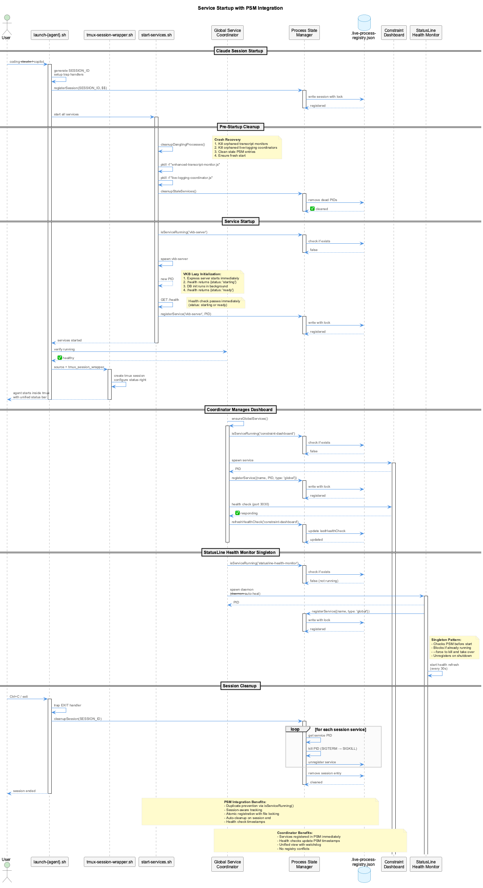

# Robust Startup System

## Overview

The Robust Startup System implements **retry-with-timeout** and **graceful degradation** patterns to prevent endless loops and ensure coding infrastructure starts reliably even when some services fail.

## Problem Statement

### Original Issues

Before the robust startup system, `coding/bin/coding` had several critical reliability problems:

1. **Endless Loops**: When VKB server failed to start, the health monitor would wait indefinitely without retry limits
2. **No Timeout Protection**: Services could hang during startup without any timeout mechanism
3. **All-or-Nothing**: If any service failed, the entire startup would block or fail ambiguously
4. **Port Checks Only**: Health verification only checked if ports were listening, not if services were actually functional
5. **No Degraded Mode**: Optional services that failed would block Claude startup unnecessarily

### Impact

Users experienced:
- Waiting indefinitely for coding to start when VKB server had issues
- Claude sessions blocked by non-critical service failures
- No clear visibility into which services failed and why
- Unable to use coding tools while waiting for optional services

## Solution Architecture

### Core Components

#### 1. **Service Starter Module** (`lib/service-starter.js`)

Reusable module providing:

```javascript
import { startServiceWithRetry } from '../lib/service-starter.js';

const result = await startServiceWithRetry(
  'VKB Server',
  async () => startVKBServer(),  // Start function
  async () => checkHealth(),      // Health check function
  {
    required: false,    // Optional service - degrade gracefully
    maxRetries: 3,      // Try 3 times then give up
    timeout: 30000,     // 30 second timeout per attempt
    exponentialBackoff: true  // 2s, 4s, 8s delays
  }
);
```

**Features**:
- Configurable retry limits (default: 3 attempts)
- Timeout protection per attempt (default: 30 seconds)
- Exponential backoff between retries (2s → 4s → 8s)
- Actual health verification (HTTP endpoints, not just ports)
- Service classification (required vs optional)
- Graceful degradation for optional services

#### 2. **Robust Service Starter** (`scripts/start-services-robust.js`)

Service orchestrator that:
- Starts services in logical order (required first, then optional)
- Applies retry logic independently per service
- Kills unhealthy processes before retry
- Reports clear status for each service
- Exits with proper codes (0 = success, 1 = critical failure)

#### 3. **Updated Start Script** (`start-services.sh`)

Entry point that:
- Defaults to robust mode (`ROBUST_MODE=true`)
- Allows fallback to legacy mode if needed
- Provides clear user feedback

### Service Classification

#### Required Services (Block startup if failed)

1. **Transcript Monitor** - Essential for LSL system
2. **Live Logging Coordinator** - Essential for session tracking

If these fail after all retries → **Claude startup blocked with clear error**

#### Optional Services (Degrade gracefully if failed)

1. **VKB Server** - Knowledge visualization (port 8080)
2. **Constraint Monitor** - Live guardrails system
3. **Semantic Analysis** - MCP semantic analysis server

If these fail after all retries → **Continue in DEGRADED mode with warning**

## Pre-Startup Cleanup

### Crash Recovery and Process Cleanup

Before starting any services, the robust startup system automatically cleans up dangling processes from crashed or abnormally terminated sessions. This ensures a clean slate and prevents startup failures due to zombie processes.



*Figure: Complete service startup flow showing pre-startup cleanup, PSM integration, and session cleanup*

**Problem**: When VSCode or Claude Code crashes:
- Transcript monitor processes remain running
- Live logging coordinator processes continue orphaned
- Process State Manager (PSM) contains stale entries
- New startup attempts fail due to competing processes

**Solution**: Automatic pre-startup cleanup runs before every service startup.

### Cleanup Process

```javascript
async function cleanupDanglingProcesses() {
  // 1. Kill all orphaned transcript monitors
  await execAsync('pkill -f "enhanced-transcript-monitor.js"');

  // 2. Kill all orphaned live-logging coordinators
  await execAsync('pkill -f "live-logging-coordinator.js"');

  // 3. Clean up stale PSM entries
  await psm.cleanupStaleServices();
}
```

### Graceful Shutdown Tracking

Normal session shutdowns are recorded in `.data/session-shutdowns.json`:

```json
{
  "claude-12345-1699364825": {
    "timestamp": "2025-11-17T12:34:56.789Z",
    "type": "graceful",
    "pid": 12345
  }
}
```

**Benefits**:
- Detects abnormal terminations (missing graceful shutdown record)
- Enables crash analytics
- Provides session continuity information

### Startup Output Example

```
═══════════════════════════════════════════════════════════════════════
🚀 STARTING CODING SERVICES (ROBUST MODE)
═══════════════════════════════════════════════════════════════════════

🧹 Pre-startup cleanup: Checking for dangling processes...

   Found 21 dangling transcript monitor process(es)
   Terminating dangling transcript monitors...
   ✅ Cleaned up transcript monitors
   Found 25 dangling live-logging coordinator process(es)
   Terminating dangling live-logging coordinators...
   ✅ Cleaned up live-logging coordinators
   Cleaning up stale Process State Manager entries...
   ✅ PSM cleanup complete

✅ Pre-startup cleanup complete - system ready for fresh start

📋 Starting REQUIRED services (Live Logging System)...
```

### Implementation

**File**: `scripts/start-services-robust.js`

The cleanup function runs at the start of `startAllServices()`:

```javascript
async function startAllServices() {
  console.log('🚀 STARTING CODING SERVICES (ROBUST MODE)');

  // Clean up any dangling processes from crashed sessions
  await cleanupDanglingProcesses();

  // Then proceed with normal service startup...
}
```

**Related Files**:
- `scripts/psm-session-cleanup.js` - Records graceful shutdowns
- `scripts/process-state-manager.js` - PSM with `cleanupStaleServices()` method
- `.data/session-shutdowns.json` - Graceful shutdown tracking

### Manual Cleanup Tool

For manual cleanup between sessions or when automatic cleanup isn't sufficient:

```bash
# Preview what would be cleaned
./bin/cleanup-orphans --dry-run

# Clean up orphaned processes manually
./bin/cleanup-orphans
```

The `cleanup-orphans` utility provides targeted cleanup of:
- Transcript monitors without valid project paths
- Stuck ukb/vkb operations
- Orphaned qdrant-sync processes
- Old shell snapshot processes

**See**: [Process Management Analysis](./process-management-analysis.md#automated-cleanup-tools) for detailed documentation

## Retry Strategy

### Algorithm

```
For each service attempt (1 to maxRetries):
  1. Start service with timeout protection
  2. Wait 2 seconds for initialization
  3. Run health check with timeout
  4. If healthy → SUCCESS
  5. If unhealthy:
     - Kill the unhealthy process
     - Wait with exponential backoff (2^attempt seconds)
     - Retry

If all retries exhausted:
  - Required service → THROW ERROR (blocks startup)
  - Optional service → RETURN DEGRADED STATUS (continue)
```

### Backoff Schedule

| Attempt | Delay Before Retry |
|---------|-------------------|
| 1       | 0s (immediate)    |
| 2       | 2s                |
| 3       | 4s                |
| 4       | 8s                |

### Timeout Protection

Each service startup attempt has two timeouts:

1. **Startup Timeout**: Process must start within timeout (default: 30s)
2. **Health Check Timeout**: Health verification must complete within 10s

If either timeout expires → Attempt fails, retry or degrade

## Health Verification

### Port-Based Health (Old Approach)

```bash
# PROBLEM: Port open ≠ server working
if lsof -i :8080 > /dev/null; then
    echo "✅ VKB running"  # FALSE POSITIVE!
fi
```

### HTTP Health Checks (Robust Approach)

```javascript
// SOLUTION: Actual HTTP health endpoint verification
const healthCheck = createHttpHealthCheck(8080, '/health');

const healthy = await healthCheck(); // true only if HTTP 200 OK
```

**VKB Server Health Endpoint** (`/health`):
```json
{
  "status": "healthy",
  "timestamp": 1729764523.456,
  "server": {
    "port": 8080,
    "pid": 12345,
    "uptime": 45.2
  }
}
```

### Process-Based Health (PID verification)

For background processes without HTTP endpoints:

```javascript
const healthCheck = createPidHealthCheck();

const serviceInfo = await startService();
const healthy = await healthCheck(serviceInfo);  // Checks if PID is running
```

## Usage

### Normal Startup (Robust Mode - Default)

```bash
./start-services.sh
```

Output example:
```
🚀 Starting Coding Services (Robust Mode)...
✨ Using robust startup mode with retry logic and graceful degradation

═══════════════════════════════════════════════════════════════════════
🚀 STARTING CODING SERVICES (ROBUST MODE)
═══════════════════════════════════════════════════════════════════════

📋 Starting REQUIRED services (Live Logging System)...

[ServiceStarter] ✅ Transcript Monitor started successfully on attempt 1/3
[ServiceStarter] ✅ Live Logging Coordinator started successfully on attempt 1/3

🔵 Starting OPTIONAL services (graceful degradation enabled)...

[ServiceStarter] ✅ VKB Server started successfully on attempt 1/3
[ServiceStarter] ⚠️  Constraint Monitor failed after 2 attempts - continuing in DEGRADED mode

═══════════════════════════════════════════════════════════════════════
📊 SERVICES STATUS SUMMARY
═══════════════════════════════════════════════════════════════════════

✅ Successfully started: 3 services
   - Transcript Monitor
   - Live Logging Coordinator
   - VKB Server

⚠️  Degraded (optional failed): 1 services
   - Constraint Monitor: Docker not running - required for Constraint Monitor

🎉 Startup complete in DEGRADED mode!

ℹ️  Some optional services are unavailable:
   - Constraint Monitor will not be available this session
═══════════════════════════════════════════════════════════════════════
```

### Legacy Mode (No Retry Logic)

```bash
ROBUST_MODE=false ./start-services.sh
```

Use only for debugging or if robust mode has issues.

## Failure Scenarios

### Scenario 1: VKB Server Fails (Optional Service)

**Before Robust System**:
- Would wait indefinitely or block startup
- User couldn't use coding tools
- No clear error message

**With Robust System**:
```
[ServiceStarter] 📍 Attempt 1/3 for VKB Server...
[ServiceStarter] ❌ VKB Server attempt 1/3 failed: Startup timeout
[ServiceStarter]    Waiting 2000ms before retry...
[ServiceStarter] 📍 Attempt 2/3 for VKB Server...
[ServiceStarter] ❌ VKB Server attempt 2/3 failed: Health check failed
[ServiceStarter]    Waiting 4000ms before retry...
[ServiceStarter] 📍 Attempt 3/3 for VKB Server...
[ServiceStarter] ❌ VKB Server attempt 3/3 failed: Port not listening
[ServiceStarter] ⚠️  VKB Server failed after 3 attempts - continuing in DEGRADED mode

🎉 Startup complete in DEGRADED mode!

ℹ️  VKB Server will not be available this session
```

Result: **Claude starts successfully** without VKB visualization

### Scenario 2: Transcript Monitor Fails (Required Service)

```
[ServiceStarter] 📍 Attempt 1/3 for Transcript Monitor...
[ServiceStarter] ❌ Transcript Monitor attempt 1/3 failed
[ServiceStarter] 📍 Attempt 2/3 for Transcript Monitor...
[ServiceStarter] ❌ Transcript Monitor attempt 2/3 failed
[ServiceStarter] 📍 Attempt 3/3 for Transcript Monitor...
[ServiceStarter] ❌ Transcript Monitor attempt 3/3 failed

💥 CRITICAL: Transcript Monitor failed after 3 attempts - BLOCKING startup

═══════════════════════════════════════════════════════════════════════
❌ Failed (required): 1 services
   - Transcript Monitor: Process failed to start

💥 CRITICAL: Required services failed - BLOCKING startup
═══════════════════════════════════════════════════════════════════════
```

Result: **Claude startup blocked** with clear error message

### Scenario 3: All Services Start Successfully

```
✅ Successfully started: 4 services
   - Transcript Monitor
   - Live Logging Coordinator
   - VKB Server
   - Constraint Monitor

🎉 Startup complete in FULL mode!
```

Result: **All features available**

## Configuration

### Service Retry Configuration

Edit `scripts/start-services-robust.js`:

```javascript
const SERVICE_CONFIGS = {
  vkbServer: {
    name: 'VKB Server',
    required: false,      // Optional - degrade gracefully
    maxRetries: 3,        // Try 3 times
    timeout: 30000,       // 30 second timeout per attempt
    startFn: async () => { /* ... */ },
    healthCheckFn: createHttpHealthCheck(8080, '/health')
  }
};
```

### Environment Variables

- `ROBUST_MODE=true` - Enable robust startup (default)
- `ROBUST_MODE=false` - Use legacy startup mode
- `VKB_DATA_SOURCE=combined` - Data source for VKB server

## Benefits

### 1. **No More Endless Loops**
- Clear retry limits prevent indefinite waiting
- Timeouts protect against hanging services

### 2. **Graceful Degradation**
- Optional services don't block Claude startup
- Clear communication about what's available/unavailable

### 3. **Better User Experience**
- Fast startup even when some services fail
- Clear status reporting
- Can use coding tools immediately

### 4. **Improved Reliability**
- Exponential backoff prevents overwhelming failing services
- Health verification ensures services actually work
- Process cleanup prevents zombie processes

### 5. **Easier Debugging**
- Detailed logs for each retry attempt
- Clear failure reasons
- Distinct exit codes

## Exit Codes

| Code | Meaning | Example |
|------|---------|---------|
| 0 | Success - all services started (FULL or DEGRADED mode) | VKB failed but optional |
| 1 | Critical failure - required service failed | Transcript Monitor failed |

## Troubleshooting

### VKB Server Won't Start

```bash
# Check VKB logs
tail -f /tmp/vkb-server.log

# Test VKB health endpoint
curl http://localhost:8080/health

# Check if port is blocked
lsof -i :8080
```

### Constraint Monitor Won't Start

```bash
# Check Docker status
docker info

# Check constraint monitor containers
docker ps --filter "name=constraint-monitor"

# Check docker-compose logs
cd integrations/mcp-constraint-monitor
docker-compose logs
```

### Services Keep Failing

1. **Check retry limits**: Increase `maxRetries` if needed
2. **Check timeout**: Increase `timeout` for slow-starting services
3. **Check health endpoint**: Verify `/health` returns 200 OK
4. **Check dependencies**: Ensure Docker, Node.js, Python are available

## Docker Auto-Start and Recovery

The launcher automatically manages Docker Desktop availability via `scripts/ensure-docker.sh`, eliminating the need for users to manually start Docker before running `coding`.

### Auto-Start Flow (macOS)

When the launcher detects that Docker is not running:

1. **Check Docker client** — Verifies the `docker` CLI is installed
2. **Check daemon responsiveness** — Runs `docker ps` with a 5-second timeout
3. **Start Docker Desktop** — Launches via `open -F -a "Docker"` and waits for the process to appear
4. **Wait for daemon** — Polls every second for up to 45 seconds with progress updates every 10 seconds

### Hung Docker Recovery

Docker Desktop can enter a "process running but daemon unresponsive" state (common after failed updates). The launcher detects and auto-recovers:

1. **Graceful quit** — `osascript -e 'quit app "Docker"'` (2s wait)
2. **Force kill** — `killall` for Docker Desktop, com.docker.backend, com.docker.vmnetd (3s wait)
3. **Verify gone** — Loop up to 5s checking processes
4. **Final force kill** — `pkill -9` for stubborn processes (2s wait)
5. **Relaunch** — `open -F -a "Docker"` and wait for daemon readiness

### Timeout Strategy

| Phase | Timeout | Purpose |
|-------|---------|---------|
| Daemon check | 5s | Quick responsiveness test |
| Initial wait | 45s (configurable via `DOCKER_TIMEOUT`) | Fresh launch startup |
| Smart elapsed | Remaining from 45s | Accounts for time already spent |
| Restart recovery | +30s | Additional time after auto-restart |
| Minimum fallback | 10s | Always gives at least 10s more |

If Docker still isn't ready after all timeouts, the launcher continues with a warning — it does not block startup.

### Linux Support

On Linux, the launcher uses `systemctl start docker` if systemd is available. If not, it displays the appropriate manual command.

---

## Network Environment Resilience

The launcher ensures reliable operation across all network environments via `scripts/detect-network.sh`, which is sourced during `agent-common-setup.sh` initialization.

### 4-Environment Matrix

The system is tested and works in all combinations:

| Environment | CN Detection | Proxy Handling | Behavior |
|-------------|-------------|----------------|----------|
| Corporate + proxy | SSH/HTTPS probe | Auto-configured | Full access via proxy |
| Corporate, no proxy | SSH/HTTPS probe | Warning issued | Degraded (no external access) |
| Public + proxy set | Skipped | Uses existing `HTTP_PROXY` | Full access |
| Public, no proxy | Skipped | None needed | Direct access |

### Detection Strategy

**Corporate Network Detection** (3 layers with fallback):

1. **Environment override**: `CODING_FORCE_CN=true|false` — Instant, bypasses probing
2. **SSH probe**: Tests SSH access to corporate GitHub (5s timeout, case-insensitive response matching)
3. **HTTPS fallback**: Tests HTTPS access to corporate GitHub (5s timeout)

**Proxy Auto-Configuration** (conditional on CN detection):

1. Check if `HTTP_PROXY` already set and working → skip
2. Test external access (google.de) → if works, no proxy needed
3. Probe `127.0.0.1:3128` for proxydetox service → auto-configure if found
4. Verify proxy works after configuration → warn if still failing

### Timeout Design

All network probes use **strict 5-second timeouts** to prevent hangs on unreliable networks. The launcher never blocks indefinitely on network operations.

### Non-Blocking Failures

Network detection issues never block startup:
- CN detection failure → assumes public network, proceeds
- Proxy configuration failure → warns and proceeds in degraded mode
- External access unavailable → warns that Docker pulls/npm installs may fail

---

## E2E Test Coverage

Comprehensive end-to-end tests validate all environment combinations via `tests/integration/launcher-e2e.sh`.

### Test Matrix (8 Core Scenarios)

| # | CN | Proxy | Agent | Verified |
|---|-----|-------|-------|----------|
| 1 | Yes | Yes | Claude | Output assertions |
| 2 | Yes | Yes | CoPilot | Output assertions |
| 3 | Yes | No | Claude | Warning assertions |
| 4 | Yes | No | CoPilot | Warning assertions |
| 5 | No | Yes | Claude | Output assertions |
| 6 | No | Yes | CoPilot | Output assertions |
| 7 | No | No | Claude | Output assertions |
| 8 | No | No | CoPilot | Output assertions |

### Additional Tests (9 more)

- Agent flag equivalence (`--copi` = `--copilot`)
- `--claude` flag behavior
- Invalid agent rejection
- `--help` output
- `--verbose` logging
- Docker auto-start logic
- Dry-run markers
- `CODING_FORCE_CN` override (true and false)

### Test Approach

- Uses `--dry-run` flag to skip blocking operations (Docker wait, service start, agent launch)
- Uses `CODING_FORCE_CN` environment variable to mock CN detection without network access
- Output assertion functions: `assert_output_contains`, `assert_output_not_contains`, `assert_exit_code`
- Color-coded results with pass/fail/skip counters

### Running Tests

```bash
# Run full test suite
./tests/integration/launcher-e2e.sh

# Verbose mode (shows output from passing tests too)
./tests/integration/launcher-e2e.sh --verbose
```

---

## Future Enhancements

- [ ] Add parallel service startup (currently sequential)
- [ ] Add service dependency management (start A before B)
- [ ] Add automatic service recovery/restart on crash
- [ ] Add metrics collection for startup times
- [ ] Add circuit breaker pattern for repeatedly failing services
- [ ] Add health monitoring dashboard

## References

- `lib/service-starter.js` - Core retry logic module
- `scripts/start-services-robust.js` - Service orchestrator
- `start-services.sh` - Entry point script
- `scripts/ensure-docker.sh` - Docker auto-start and recovery
- `scripts/detect-network.sh` - Corporate network and proxy detection
- `scripts/agent-common-setup.sh` - Shared agent initialization
- `tests/integration/launcher-e2e.sh` - E2E test suite
- `memory-visualizer/api-server.py` - VKB health endpoint implementation
