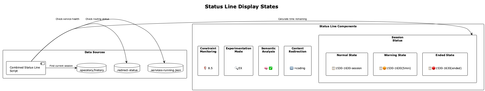

# Status Line System

Real-time visual indicators of system health and development activity in the Claude Code status bar.

## What It Shows

The Status Line provides a **compact, real-time view** of all system activity across multiple Claude Code sessions.



### Example Display

```
[🏥 95% | 🛡️ 94% ⚙️ IMP | 📋🟠2130-2230(3min) →coding]
```

### Reading the Status Line

**Format**: `[🏥 health | 🛡️ compliance trajectory | 📋 lsl-status]`

**Components**:
- `🏥 95%` - **System Health**: Overall health score (0-100%)
- `🛡️ 94%` - **Constraint Compliance**: Code quality compliance percentage
- `⚙️ IMP` - **Trajectory State**: Current development activity
- `📋🟠2130-2230(3min)` - **LSL Status**: Logging window and activity
- `→coding` - **Active Project**: Project with recent activity

### Trajectory States

- `🔍 EX` (Exploring) - Information gathering and analysis
- `📈 ON` (On Track) - Productive progression
- `📉 OFF` (Off Track) - Deviating from optimal path
- `⚙️ IMP` (Implementing) - Active code modification
- `✅ VER` (Verifying) - Testing and validation
- `🚫 BLK` (Blocked) - Intervention preventing action

### LSL Status Indicators

**Color Coding**:
- 🟢 Green - Session window open (>1 hour remaining)
- 🟠 Orange - Window closing soon (<1 hour)
- 🔴 Red - Window closed or expired

**Format**: `🟢HHMM-HHMM(Xmin)` where:
- `HHMM-HHMM` - Session time window
- `(Xmin)` - Minutes since last activity
- `→project` - Project with activity

## Architecture


### Core Components

**1. Combined Status Line** (`scripts/combined-status-line.js`)
- Unified status display across all Claude Code sessions
- Integration with health monitoring, constraint monitoring, and trajectory analysis
- Real-time updates via health check integration
- Smart abbreviations for compact display

**2. Status Line Integration**


**Data Sources**:
- **Health System**: Provides system health scores from `.health/verification-status.json`
- **Constraint Monitor**: Provides compliance percentage from constraint API
- **Trajectory Analyzer**: Provides current development state from `.specstory/trajectory/live-state.json`
- **LSL System**: Provides logging status from Global LSL Registry

### Session Discovery

The system uses multiple discovery methods to ensure all active sessions are monitored:

**Discovery Methods**:
1. **Registry-based Discovery**: Uses Global LSL Registry for registered sessions
2. **Dynamic Discovery**: Scans Claude transcript directories for unregistered sessions
3. **Cross-reference Validation**: Verifies monitor processes are alive and healthy
4. **Live Transcript Scanning**: Finds sessions regardless of activity age

**Recent Enhancement**: Removed the 1-hour transcript activity filter to ensure dormant sessions like nano-degree are properly discovered and displayed.

### Smart Abbreviation Engine

Project names are automatically abbreviated using intelligent algorithms:

**Examples**:
- **coding** → **C**
- **curriculum-alignment** → **CA**
- **nano-degree** → **ND**
- **project-management** → **PM**
- **user-interface** → **UI**

**Algorithm Handles**:
- Single words: First letter (coding → C)
- Hyphenated words: First letter of each part (curriculum-alignment → CA)
- Camel case: Capital letters (projectManagement → PM)
- Multiple separators: Intelligent parsing

## Multi-Session Support

The status line displays information for **multiple active Claude Code sessions** simultaneously.

### Session Consolidation

**Single Session Display**:
```
[🏥 95% | 🛡️ 94% ⚙️ IMP | 📋🟠2130-2230(3min) →coding]
```

**Multi-Session Display**:
```
[🏥 95% | 🛡️ 94% ⚙️ IMP | 📋C:🟢1400-1500(2m) CA:🟠2130-2230(15m)]
```

Where:
- `C:` - coding project
- `CA:` - curriculum-alignment project
- Each with its own LSL status

### Session Prioritization

**Activity-Based Priority**:
1. Most recently active project shown first
2. `→` indicator points to active project
3. Dormant sessions shown with abbreviated status

## How It Works

### Status Line Update Flow


**Update Sequence**:
1. **Health Check Trigger**: Pre-prompt hook fires
2. **Status Collection**:
   - Read health verification status
   - Query constraint monitor API
   - Read trajectory state file
   - Scan LSL registry
3. **Status Aggregation**: Combine all indicators
4. **Display Update**: Update Claude Code status bar
5. **Cache**: Store for next check

### Update Frequency

**Triggered By**:
- User prompts (via pre-prompt hook)
- Health verification completion
- Trajectory state changes
- LSL activity events

**Caching**:
- Health status cached for 5 minutes
- Constraint compliance cached for 1 minute
- Trajectory state read on every update
- LSL status read on every update

### Integration Points

**File Locations**:
- Health: `.health/verification-status.json`
- Trajectory: `.specstory/trajectory/live-state.json`
- LSL Registry: `.lsl/global-registry.json`
- Constraint API: `http://localhost:3031/api/compliance/:project`

## State Diagrams

### Service Lifecycle States


**Health States**:
- **Healthy** (Green) - Service operational (score 80-100)
- **Degraded** (Yellow) - Service impaired (score 50-79)
- **Unhealthy** (Red) - Service failing (score 0-49)
- **Unknown** (Gray) - Cannot determine status

**Transitions**:
- Health check success → Healthy
- Partial failure → Degraded
- Complete failure → Unhealthy
- Check timeout → Unknown

### Status Display States

**Color Transitions**:
- Green → Orange: 1 hour until session window closes
- Orange → Red: Session window has closed
- Red → Green: New session window opened

## Configuration

### Status Line Configuration

**File**: `config/status-line-config.json`

```json
{
  "enabled": true,
  "update_interval_ms": 5000,
  "cache_duration_ms": 300000,
  "health_source": ".health/verification-status.json",
  "trajectory_source": ".specstory/trajectory/live-state.json",
  "lsl_registry": ".lsl/global-registry.json",
  "constraint_api": "http://localhost:3031/api/compliance/{project}",
  "abbreviation_style": "smart",
  "multi_session_display": true,
  "max_sessions_displayed": 5
}
```

**Configuration Options**:
- `enabled`: Toggle status line on/off
- `update_interval_ms`: How often to check for updates (default: 5000ms)
- `cache_duration_ms`: How long to cache health status (default: 5 minutes)
- `abbreviation_style`: `smart` | `first-letter` | `full-name`
- `multi_session_display`: Show multiple sessions or just active one
- `max_sessions_displayed`: Maximum sessions to show (default: 5)

## Usage

### Starting the Status Line

The status line is **automatically started** with the `coding` command:

```bash
# Start Claude Code with status line
coding

# Status line updates appear in Claude Code status bar
```

### Manual Status Line Check

```bash
# Get current status line output
node scripts/combined-status-line.js

# Example output:
# [🏥 95% | 🛡️ 94% ⚙️ IMP | 📋🟠2130-2230(3min) →coding]
```

### Troubleshooting

**Status line not updating?**
```bash
# Check if health verifier is running
ps aux | grep health-verifier

# Manually trigger health check
node scripts/health-verifier.js

# Check status files exist
ls -la .health/verification-status.json
ls -la .specstory/trajectory/live-state.json
```

**Wrong project showing as active?**
```bash
# Check LSL registry
cat .lsl/global-registry.json | jq '.'

# Verify activity timestamps
cat .lsl/global-registry.json | jq '.sessions[] | {project, last_activity}'
```

**Abbreviations incorrect?**
```bash
# Test abbreviation engine
node scripts/combined-status-line.js --test-abbreviations

# Manual abbreviation override in config
# Edit config/status-line-config.json
```

## Key Files

**Core System**:
- `scripts/combined-status-line.js` - Main status line script
- `scripts/health-verifier.js` - Health status provider
- `src/live-logging/RealTimeTrajectoryAnalyzer.js` - Trajectory state provider
- `.lsl/global-registry.json` - LSL session registry
- `.health/verification-status.json` - Health status cache
- `.specstory/trajectory/live-state.json` - Trajectory state

**Configuration**:
- `config/status-line-config.json` - Status line configuration

**Integration**:
- `scripts/health-prompt-hook.js` - Triggers status line updates
- `integrations/mcp-constraint-monitor/` - Provides compliance data

## Related Documentation

- [Health System Overview](./README.md) - Main health system documentation
- [Enhanced Health Monitoring](./enhanced-health-monitoring.md) - Comprehensive health monitoring details
- [Trajectory System](../trajectories/README.md) - Trajectory analysis documentation
- [LSL System](../lsl/README.md) - Live session logging documentation
- [Constraint Monitoring](../constraints/README.md) - Code quality enforcement
