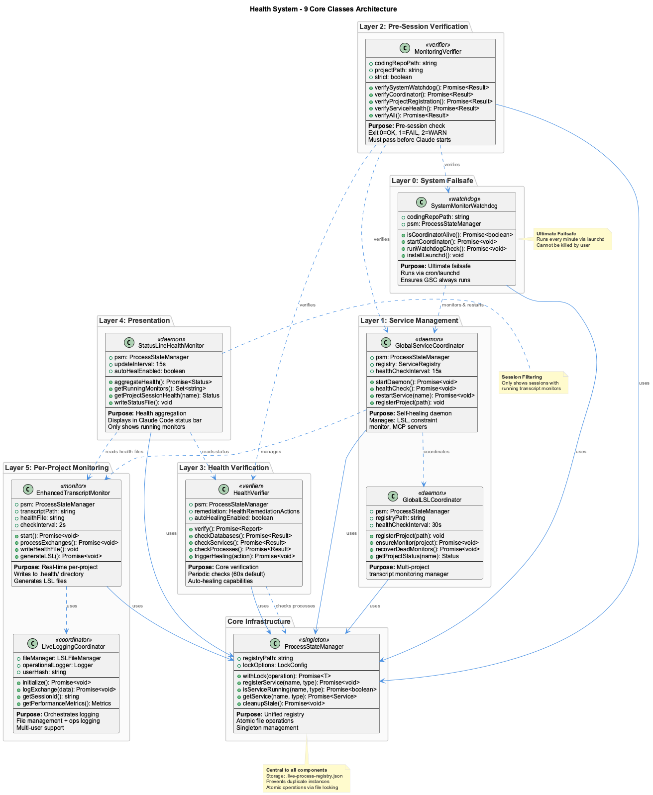
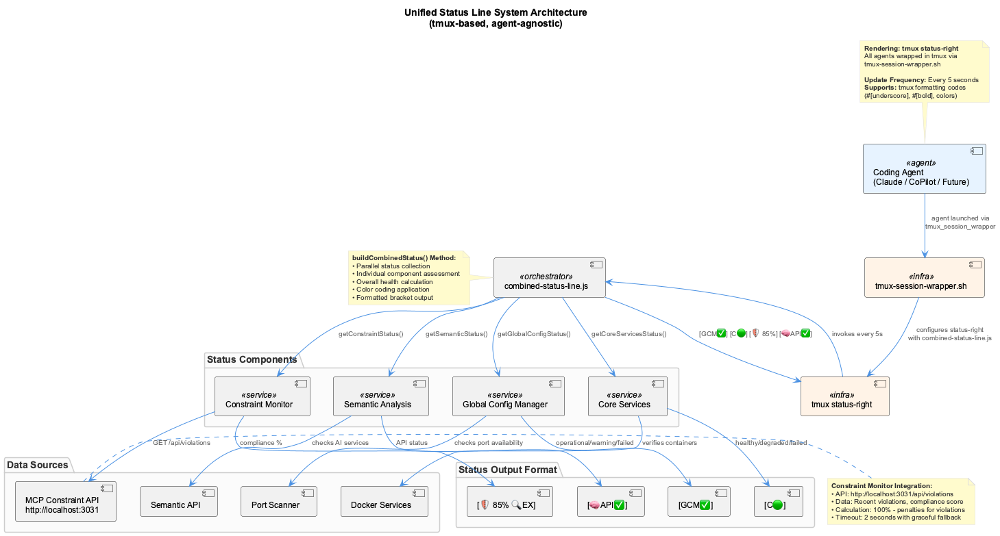
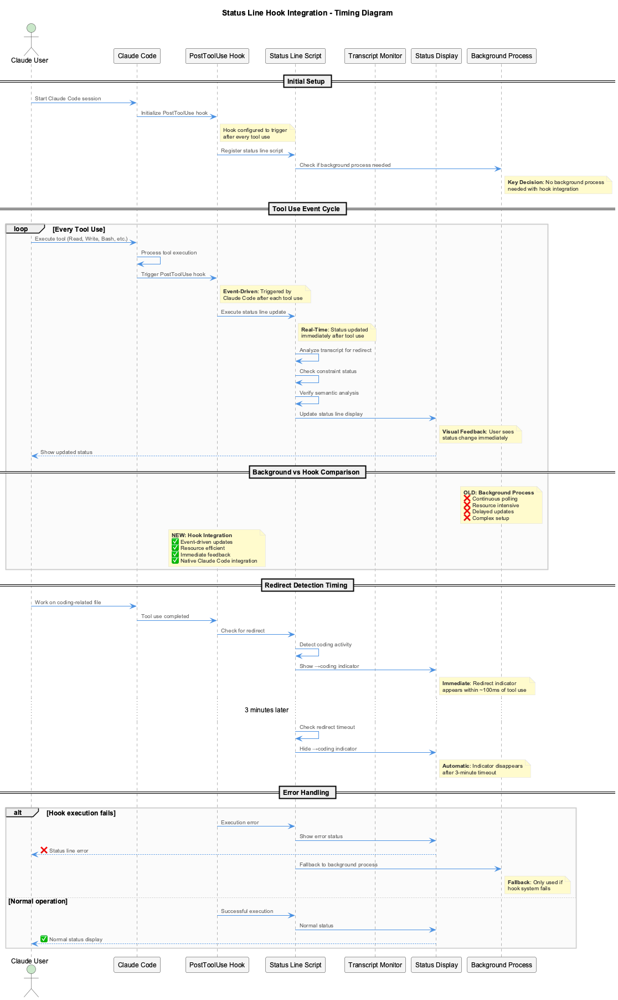
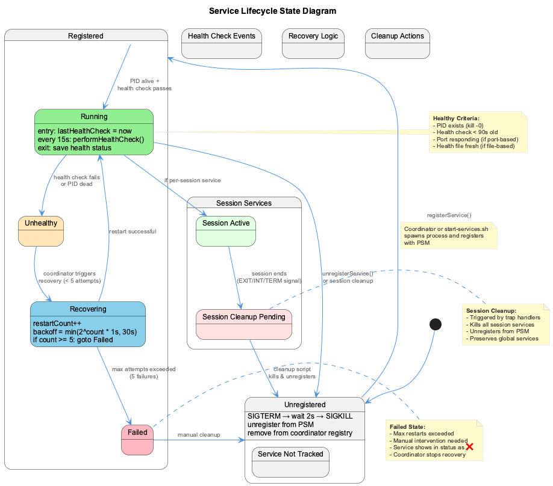

# Status Line System

> **Phase 33 architecture (current).** This document describes the historical multi-layer rendering pipeline. The current model is documented in [`docs-content/guides/status-line.md`](../../docs-content/guides/status-line.md). Key changes since this doc was last fully reviewed:
>
> - The `[🐳MCP:...]` Docker MCP block has been removed from the rendered output.
> - The `[🏥...]` health badge reads live from the coordinator at `:3034/health/state`; the `.health/verification-status.json` file is no longer written.
> - Per-pane LSL status comes from the coordinator's `lsl_by_project` rollup + `lsl[*].transcriptPath` mtime; the `.logs/statusline-health-status.txt` file is no longer written.
> - The right edge is anchored with codepoint-floor padding (≥220 codepoints, after stripping zero-width tmux markup) plus a non-breaking-space terminator (U+00A0) to survive tmux's `#(shell-cmd)` trailing-whitespace strip.
> - The graduated cooling lifecycle (🟢 → 🟠 → 🟤 → ⚫ → 💤) is preserved and is now driven by `lsl[*].transcriptPath` mtime instead of in-memory monitor state.
> - `[program:health-verifier]` and `[program:browser-access]` supervisord blocks are gone.

Real-time visual indicators of system health and development activity, rendered in the **tmux status bar** for all coding agents (Claude Code, CoPilot, and future agents).

## Tmux-Based Rendering

All agents are wrapped in tmux sessions via the shared `scripts/tmux-session-wrapper.sh`. The status line is rendered using tmux's `status-right` directive, which invokes `scripts/status-line-fast.cjs` every 5 seconds. This CJS (CommonJS) fast-path reads a pre-rendered cache file in ~60ms, eliminating the 2-18 second ESM module loading penalty that occurs under system load. When the cache is stale, it triggers a background refresh via `combined-status-line.js`.

**Key benefits:**
- Unified rendering across all agents (no agent-specific status line code)
- Full support for tmux formatting codes (underline, bold, colors)
- Consistent status bar positioning at the bottom of the terminal
- Mouse support forwarded to the agent running inside tmux
- Ultra-fast cache-based rendering (~60ms) — never blanks under load

## What It Shows

The Status Line provides a **compact, real-time view** of all system activity across multiple coding agent sessions.


### Example Display

**Native Mode:**
```
[🏥✅] [Gq$0FEB A$0 O$0 X$25] [C🟢 UT🟤] [🔒67% 🔍EX] [📚✅] 📋17-18
```

**Docker Mode:**
```
[🐳] [🐳MCP:SA✅CM✅CGR✅] [🏥✅] [C🟢 UT🟤] [🔒67% 🔍EX] [📚✅] 📋17-18
```

### Reading the Status Line

**Format**: `[🐳] [🐳MCP:health] [🏥 health] [sessions] [🔒compliance] [📚 knowledge] 📋time`

**Components**:
- `[🐳]` - **Docker Mode**: Indicator that system is running in Docker mode (only shown in Docker mode)
- `[🐳MCP:SA✅CM✅CGR✅]` - **Docker MCP Health**: Health of containerized MCP SSE servers (Docker mode only)
- `[🏥✅]` - **System Health**: Unified health (infrastructure + services)
- `[C🟢 UT🟤]` - **Active Sessions**: Project abbreviations with activity icons
- `🔒67%` - **Constraint Compliance**: Code quality compliance percentage (with optional `🟡N` violations sub-segment when non-zero)
- `[📚✅]` - **Knowledge Pipeline**: Observation/digest/insight pipeline freshness — driven by observation write age (healthy <15 min · stale 15 min–6 h · stalled >6 h · disabled empty · unreachable obs_api down). Source: `state.knowledge_pipeline` at `:3034/health/state`.
- `📋17-18` - **LSL Time Window**: Session time range (HHMM-HHMM)

### Internal Health Status (Raw Output)

The statusline-health-monitor writes detailed health to `.logs/statusline-health-status.txt`:

```
[GCM:✅] [Sessions: C:🟢] [Guards:✅] [DB:✅] [VKB:✅] [Dash:✅]
```

**Internal Components**:
| Label | Ports | Service | Description |
|-------|-------|---------|-------------|
| `GCM` | - | Global Process Supervisor | Session coordinator and auto-restart |
| `Sessions` | - | Transcript Monitors | Per-project Claude session health |
| `Guards` | 3030/3031 | Constraint Monitor | Dashboard and API for code quality |
| `DB` | - | Databases | LevelDB, SQLite, Qdrant, Memgraph |
| `VKB` | 8080 | Knowledge Visualization | Graph visualization server |
| `Dash` | 3032/3033 | System Health Dashboard | UI and API for health monitoring |

**Icons**: ✅ healthy, 🟡 warning (with reason), 🔴 unhealthy (with reason), ❓ unknown

### Docker Mode Indicator

When running in Docker mode, the status line displays additional indicators for containerized services.

**Docker Mode Detection:**
Docker mode is detected when:
- The `.docker-mode` marker file exists in the coding repository
- OR the `CODING_DOCKER_MODE=true` environment variable is set

**Docker MCP Health Display** (`[🐳MCP:...]`):

| Abbreviation | Service | Port | Health Check |
|--------------|---------|------|--------------|
| `SA` | Semantic Analysis | 3848 | `http://localhost:3848/health` |
| `CM` | Constraint Monitor | 3849 | `http://localhost:3849/health` |
| `CGR` | Code Graph RAG | 3850 | `http://localhost:3850/health` |

**Status Icons:**
- `✅` - Service healthy and responding
- `❌` - Service down or not responding
- `⚠️` - Service responding but with issues

**Examples:**
- `[🐳MCP:SA✅CM✅CGR✅]` - All Docker MCP services healthy
- `[🐳MCP:SA✅CM❌CGR✅]` - Constraint Monitor is down
- `[🐳MCP:SA⚠️CM✅CGR✅]` - Semantic Analysis has issues

### Unified Health Status Indicator

The `[🏥...]` section shows **unified system health** combining:
- **GCM (Global Coding Monitor)**: Session coordinator health
- **Health Verifier**: Service, database, and process health
- **Constraint Enforcement**: Whether constraints are actively enforced

| Display | Meaning | Action |
|---------|---------|--------|
| `[🏥✅]` | All systems healthy | None needed |
| `[🏥🟡]` | Issues detected | Check dashboard for details |
| `[🏥⏰]` | **Stale** - verification data >2 minutes old | Health verifier may have crashed |
| `[🏥❌]` | Critical issues or error | Immediate attention required |
| `[🏥💤]` | Health verifier offline | Start health verifier |

**Note**: Violation counts are no longer shown in the status line. Details are available on the health dashboard at http://localhost:3033.

**Common Causes of `[🏥🟡]` (Issues)**:
- Constraint enforcement disabled
- Service health check failures
- Database connectivity issues
- Stale PIDs in process registry

**To Fix Issues**:
```bash
# Check health details
node scripts/health-verifier.js status

# Manually trigger verification with auto-heal
node scripts/health-verifier.js --auto-heal

# Or restart all services
coding --restart-services
```

The health verifier runs every 60 seconds with auto-healing enabled.

### Transcript Discovery Auto-Heal

The statusline-health-monitor detects **broken transcript monitors** — monitors that are running but cannot find their project's Claude JSONL transcript file (e.g., due to path encoding mismatches).

**Detection**: If a monitor has been running >2 minutes with `transcriptPath: null`, the health monitor identifies it as a broken state.

**Remediation**: The broken monitor is killed via `SIGTERM`. The Global Process Supervisor automatically restarts it, picking up any fixes to the transcript discovery logic.

**Status Line**: Affected sessions show `🟡` (warning) with "Transcript discovery failed — restarting monitor" instead of silently disappearing.

**Path Encoding**: Claude Code encodes project paths by replacing both `/` and `_` with `-`. For example, `/Users/foo/Agentic/_work/my-project` becomes `-Users-foo-Agentic--work-my-project`. The transcript monitor's `getProjectDirName()` must match this encoding exactly.

### LSL Status Indicators

**Color Coding**:
- 🟢 Green - Session window open (>1 hour remaining)
- 🟠 Orange - Window closing soon (<1 hour)
- 🔴 Red - Window closed or expired

**Format**: `🟢HHMM-HHMM(Xmin)` where:
- `HHMM-HHMM` - Session time window
- `(Xmin)` - Minutes since last activity
- `→project` - Project with activity

### Session Activity Indicators

Session activity uses a **unified graduated color scheme** that transitions smoothly from active to dormant. **All sessions are always displayed** - sleeping sessions show as 💤, never hidden.

| Icon | Status | Time Since Activity | Description |
|------|--------|---------------------|-------------|
| 🟢 | Active | < 5 minutes | Active session with recent activity |
| 🟠 | Cooling | 5 - 30 minutes | Session cooling down |
| 🟤 | Fading | 30 min - 6 hours | Session fading, still tracked |
| ⚫ | Inactive | 6 - 24 hours | Session inactive but tracked |
| 💤 | Sleeping | > 24 hours | Long-term dormant session |
| ❌ | Error | Any | Health check failed or service crash |

**Session Lifecycle**:
```
🟢 Active → 🟠 Cooling → 🟤 Fading → ⚫ Inactive → 💤 Sleeping
   <5min      5-15min     15m-1hr     1-6hr        6-24hr       >24hr
```

**Sessions are only removed** when the agent process has exited (session closed). A session with a running agent always shows as 🟢 Active, regardless of transcript age.

**No Yellow Status**: The system intentionally avoids yellow (🟡) for session inactivity. Yellow is reserved for actual warnings (e.g. stale health data). Normal session inactivity is shown through the graduated cooling sequence.

**Agent Age Cap**: When an agent process (claude, copilot, opencode) is running, the displayed age is capped at the transcript monitor's uptime. This prevents a freshly started session in a project with old transcripts from immediately showing as dormant. The session starts as 🟢 and naturally progresses through the cooling scheme based on how long the current session has been idle.

**Not-Found Transcript Guard**: Agents that don't produce Claude-compatible transcripts (e.g., OpenCode) have `transcriptInfo.status: 'not_found'` with `ageMs: 0`. The age cap logic skips these sessions — they correctly display as ⚫ inactive instead of falsely showing as 🟢 active.

**Activity Age Calculation**:
- Uses `transcriptInfo.ageMs` from health file (actual transcript inactivity)
- Falls back to health file timestamp if transcript age unavailable
- For stale health files (>5 min old), uses health file age as minimum to ensure closed sessions aren't falsely shown as active
- Capped at monitor uptime when agent is running (prevents stale transcript age from showing dormant on fresh sessions)

**Design Rationale**: Projects that aren't actively being worked on should show gradual "cooling" colors rather than alarming red/orange/yellow. These colors are reserved for actual errors and warnings, not normal session lifecycle states.

## Architecture

The Status Line is part of the **6-Layer Health System** with 9 core classes:



The StatusLineHealthMonitor (Layer 4) aggregates health from all other layers and outputs to the Combined Status Line display.



### Core Components

**1. Status Line Fast-Path** (`scripts/status-line-fast.cjs`)
- Ultra-fast CommonJS cache reader (~60ms) — invoked by tmux `status-right` every 5 seconds
- Reads pre-rendered status from `.logs/combined-status-line-cache.txt`
- If cache <60s old: serves immediately (no Node.js ESM overhead)
- If cache >20s old: triggers background refresh via `combined-status-line.js` (detached)
- Falls back to synchronous full CSL only if cache missing or >60s stale
- Solves the 2-18 second ESM module resolution penalty under high system load

**2. Combined Status Line** (`scripts/combined-status-line.js`)
- Full status display with all segments (health, quota, sessions, compliance, knowledge, LSL)
- Writes cache to `.logs/combined-status-line-cache.txt` after successful generation
- **GPS heartbeat gate**: ensure* supervision functions only run when GPS heartbeat is stale (>60s)
- When GPS is running (normal): display-only, no process spawning
- When GPS is dead: fallback supervisor for GPS, SHM, and transcript monitors
- Smart abbreviations for compact display

**3. Status Line Integration**

**Data Sources**:
- **Health System**: Provides system health scores from `.health/verification-status.json`
- **Constraint Monitor**: Provides compliance percentage from constraint API
- **LSL System**: Provides logging status from Global LSL Registry

### Session Discovery

The system uses multiple discovery methods to find all active sessions:

**Discovery Methods**:
1. **Running Monitor Detection**: Checks `ps aux` for running `enhanced-transcript-monitor.js` processes
2. **Agent Process Detection**: Scans for `claude`, `copilot`, and `opencode` processes via `ps -eo pid,comm` and resolves project from working directory via `lsof`
3. **Registry-based Discovery**: Uses Global LSL Registry for registered sessions
4. **Dynamic Discovery**: Scans Claude transcript directories for unregistered sessions
5. **Health File Validation**: Uses centralized health files from `.health/` directory

**Key Behavior**:
- Sessions with a **running agent process** use age capped at monitor uptime (graduated cooling from session start)
- Sessions with running transcript monitors but no active agent use graduated activity icons
- Sessions WITHOUT running monitors BUT with a running agent are shown as 💤 (no monitor yet)
- Sessions are **only removed** when the agent process has exited — never hidden
- The Global Process Supervisor automatically restarts dead monitors within 30 seconds

**Multi-Agent Support**:
- **Claude**: Detected via `ps -eo pid,comm` with exact match on `claude`
- **Copilot**: Detected via path-ending match `/copilot$` (comm shows full binary path)
- **OpenCode**: Detected via path-ending match `/opencode$` (comm shows full binary path)
- New agents can be added to the detection loop in `getRunningAgentSessions()`

**Example**:
- `[C🟢 UT🟢]` - coding and ui-template both active
- `[C🟢 CA🟠]` - coding active, curriculum-alignment cooling
- `[C🟢 UT🟤 CA🟤]` - coding active, ui-template fading, curriculum-alignment dormant
- Sessions only removed when agent process exits (never hidden while running)

### Smart Abbreviation Engine

Project names are automatically abbreviated using intelligent algorithms:

**Examples**:
- **coding** → **C**
- **curriculum-alignment** → **CA**
- **nano-degree** → **ND**
- **project-management** → **PM**
- **user-interface** → **UI**

**Algorithm Handles**:
- Single words: First letter (coding → C)
- Hyphenated words: First letter of each part (curriculum-alignment → CA)
- Camel case: Capital letters (projectManagement → PM)
- Multiple separators: Intelligent parsing

## Multi-Session Support

The status line displays information for **multiple active coding agent sessions** simultaneously. Only sessions active within the last 24 hours are shown.

### Session Display

**Single Active Session**:
```
[🏥✅] [Gq$0FEB A$0 O$0 X$25] [C🟢] [🔒67% 🔍EX] [📚✅] 📋17-18
```

**Multiple Active Sessions**:
```
[🏥🟡] [Gq$0FEB A$0 O$0 X$25] [C🟢 UT🟤 CA🟠] [🔒67% 🔍EX] [📚✅] 📋17-18
```

Where:
- `C` - coding project (active)
- `UT` - ui-template project (fading)
- `CA` - curriculum-alignment project (cooling)
- Current project is underlined in terminal

### Session Prioritization

**Activity-Based Priority**:
1. Most recently active project shown first
2. `→` indicator points to active project
3. Dormant sessions shown with abbreviated status

## How It Works

### Status Line Update Flow



**Cache Fast-Path (normal operation)**:
1. **Tmux fires** `status-line-fast.cjs` every 5 seconds
2. **Cache check**: Read `.logs/combined-status-line-cache.txt`
3. If cache <60s old → **serve immediately** (~60ms, no further processing)
4. If cache >20s old → trigger **background refresh** (detached `combined-status-line.js`)
5. If cache missing/stale → synchronous fallback to full CSL

**Full Refresh (background or fallback)**:
1. **Status Collection**:
   - Read health verification status
   - Query constraint monitor API
   - Scan LSL registry
2. **Status Aggregation**: Combine all indicators
3. **Display**: Output full status bar
4. **Cache Write**: Save to `.logs/combined-status-line-cache.txt`
5. **GPS Heartbeat Check**: If GPS heartbeat >60s stale, run ensure* functions as fallback supervisor

### Update Frequency

**Triggered By**:
- Tmux `status-right` every 5 seconds (via fast-path cache)
- Background refresh when cache >20s old
- Full CSL fallback when cache missing

**Caching**:
- Pre-rendered status cache (fast-path): 60s TTL, 20s background refresh trigger
- Health status cached for 5 minutes
- Constraint compliance cached for 1 minute
- LSL status read on every update

### Integration Points

**File Locations**:
- Health: `.health/verification-status.json`
- LSL Registry: `.lsl/global-registry.json`
- Constraint API: `http://localhost:3031/api/compliance/:project`

## State Diagrams

### Service Lifecycle States



**Unified Health States** (for `[🏥...]` indicator):
- **Healthy** (✅) - All systems operational (GCM + Health Verifier + Enforcement)
- **Warning** (⚠️) - Issues detected - check dashboard for details
- **Stale** (⏰) - Health data older than 2 minutes
- **Critical** (❌) - Critical issues requiring immediate attention
- **Offline** (💤) - Health verifier not running

**Session Activity States** (for project sessions - graduated cooling scheme):
- **Active** (🟢) - Currently active (< 5 min)
- **Cooling** (🟠) - Recently active (5-30 min)
- **Fading** (🟤) - Activity fading (30 min - 6 hr)

- **Inactive** (⚫) - Session idle (6-24 hr) - last visible state
- **Sleeping** (💤) - Long-term dormant (> 24 hr) - still shown

**Transitions**:
- Health check success → Healthy (✅)
- GCM or Health Verifier issues → Warning (⚠️)
- Critical failures → Critical (❌)
- Time passage → 🟢 → 🟠 → 🟤 → ⚫ → 💤
- Sessions only removed when agent exits, never hidden while running

### Status Display States

**Color Transitions**:
- Green → Orange: 1 hour until session window closes
- Orange → Red: Session window has closed
- Red → Green: New session window opened

## Configuration

### Status Line Configuration

**File**: `config/status-line-config.json`

```json
{
  "enabled": true,
  "update_interval_ms": 5000,
  "cache_duration_ms": 300000,
  "health_source": ".health/verification-status.json",
  "lsl_registry": ".lsl/global-registry.json",
  "constraint_api": "http://localhost:3031/api/compliance/{project}",
  "abbreviation_style": "smart",
  "multi_session_display": true,
  "max_sessions_displayed": 5
}
```

**Configuration Options**:
- `enabled`: Toggle status line on/off
- `update_interval_ms`: How often to check for updates (default: 5000ms)
- `cache_duration_ms`: How long to cache health status (default: 5 minutes)
- `abbreviation_style`: `smart` | `first-letter` | `full-name`
- `multi_session_display`: Show multiple sessions or just active one
- `max_sessions_displayed`: Maximum sessions to show (default: 5)

## Usage

### Starting the Status Line

The status line is **automatically started** with the `coding` command. All agents are wrapped in tmux, and the tmux `status-right` is configured to run `combined-status-line.js`:

```bash
# Start any agent - tmux wrapping is automatic
coding              # Status line renders in tmux status bar
coding --claude     # Same tmux wrapping
coding --copilot    # Same tmux wrapping
```

The tmux wrapper (`scripts/tmux-session-wrapper.sh`) handles:
- Creating a tmux session named `coding-{agent}-{PID}`
- Configuring `status-right` to invoke `status-line-fast.cjs` (CJS fast-path cache reader)
- Nesting guard: if already in tmux, configures the current session instead
- Mouse forwarding for interactive agent use

### Manual Status Line Check

```bash
# Get current status line output (fast-path from cache)
node scripts/status-line-fast.cjs

# Force full refresh (bypasses cache)
node scripts/combined-status-line.js

# Example output:
# [🏥🟡] [Gq$0FEB A$0 O$0 X$25] [C🟢 UT🟤] [🔒67% 🔍EX] [📚✅] 📋17-18
```

### Troubleshooting

**Status bar completely blank?**
```bash
# Check if the cache file exists and is recent
ls -la .logs/combined-status-line-cache.txt

# Test the fast-path directly
time node scripts/status-line-fast.cjs

# If cache is stale/missing, force a full refresh
node scripts/combined-status-line.js

# Check for process spawn storm (should be <80 Node processes)
ps aux | grep node | wc -l

# If >100 processes, kill the coordinator and let GPS restart cleanly
ps aux | grep global-service-coordinator | grep -v grep
```

**Status line not updating?**
```bash
# Check if health verifier is running
ps aux | grep health-verifier

# Manually trigger health check
node scripts/health-verifier.js

# Check status files exist
ls -la .health/verification-status.json
```

**Wrong project showing as active?**
```bash
# Check LSL registry
cat .lsl/global-registry.json | jq '.'

# Verify activity timestamps
cat .lsl/global-registry.json | jq '.sessions[] | {project, last_activity}'
```

**Session not showing that should be?**
```bash
# Check if agent process is detected (claude, copilot, opencode)
ps -eo pid,comm | awk '/claude$|copilot$|opencode$/ {print}'

# Check if the agent's cwd resolves to the right project
lsof -p <PID> 2>/dev/null | grep cwd

# Check if transcript monitor is running for that project
ps aux | grep enhanced-transcript-monitor | grep PROJECT_NAME

# Sessions show if: agent process running OR transcript monitor running
```

**Closed session still showing?**

```bash
# This shouldn't happen with the new logic - only sessions with running monitors are shown
# If it does, restart the statusline-health-monitor daemon:
node scripts/statusline-health-monitor.js --daemon --auto-heal --force
```

**Session shows wrong activity age (e.g., showing 🟢 when inactive)?**

```bash
# Check the health file for that project
cat .health/PROJECT-transcript-monitor-health.json | jq '{transcriptAge: .transcriptInfo.ageMs, timestamp}'

# The transcriptAge should be used (actual transcript inactivity)
# If health file is stale (>5 min old), file age is used as minimum
```

**Abbreviations incorrect?**

```bash
# Test abbreviation engine
node scripts/combined-status-line.js --test-abbreviations

# Manual abbreviation override in config
# Edit config/status-line-config.json
```

**Docker MCP services showing unhealthy?**

```bash
# Check if Docker containers are running
docker compose -f docker/docker-compose.yml ps

# Test individual health endpoints
curl http://localhost:3848/health  # Semantic Analysis
curl http://localhost:3849/health  # Constraint Monitor
curl http://localhost:3850/health  # Code Graph RAG

# Check container logs for errors
docker compose -f docker/docker-compose.yml logs coding-services

# Restart Docker services if needed
docker compose -f docker/docker-compose.yml restart
```

**Docker mode not detected?**

```bash
# Check for Docker mode marker
ls -la .docker-mode

# Or check environment variable
echo $CODING_DOCKER_MODE

# Enable Docker mode
touch .docker-mode
# OR
export CODING_DOCKER_MODE=true
```

## Terminal Title Broadcasting

The status line system now includes **automatic terminal title updates** that work even for idle sessions.

### How It Works

Every 15 seconds, the statusline-health-monitor broadcasts status to all Claude session terminals via ANSI escape codes:

```
Terminal Tab: "C🟢 | UT🟤 CA🟠"
              ↑          ↑
        Current     Other active sessions
        project     (sleeping sessions hidden)
```

This means you can see the current status of ALL sessions by looking at any terminal's tab or title bar, even if that session is idle.

### Benefits

- **Always visible status**: No need to type to update the status line
- **Cross-session awareness**: Each terminal shows status of all projects
- **Minimal overhead**: Only writes to TTYs when status changes

### Terminal Compatibility

Works with terminals that support ANSI OSC (Operating System Command) escape sequences when written directly to TTY:

| Terminal | Status | Notes |
|----------|--------|-------|
| iTerm2 | ✅ Works | Full OSC 0 support |
| Terminal.app | ✅ Works | Native macOS terminal |
| VS Code Terminal | ❌ Limited | Does not process OSC 0 from external TTY writes |
| tmux | ✅ Works | All agents now run inside tmux (primary rendering target) |

**VSCode Limitation**: VSCode's integrated terminal captures TTY output and does not interpret OSC escape sequences written directly to the TTY device from external processes. The status line within the terminal content still updates on activity.

### Troubleshooting Terminal Titles

**Titles not updating?**
```bash
# Check if statusline-health-monitor is running
ps aux | grep statusline-health-monitor

# Check logs for TTY detection
grep -i tty ~/.logs/statusline-health.log

# Verify Claude processes have TTYs
ps -eo pid,tty,comm | grep claude
```

## Key Files

**Core System**:

- `scripts/tmux-session-wrapper.sh` - Shared tmux wrapper that configures status bar for all agents
- `scripts/status-line-fast.cjs` - Ultra-fast CJS cache reader (~60ms) — invoked by tmux `status-right`
- `scripts/combined-status-line.js` - Full status line renderer + fallback supervisor (writes cache)
- `scripts/combined-status-line-wrapper.js` - ESM wrapper (backup; primary is fast-path CJS)
- `scripts/statusline-health-monitor.js` - Session health monitor daemon (detects running monitors, writes status)
- `scripts/health-verifier.js` - Health status provider
- `.lsl/global-registry.json` - LSL session registry
- `.health/verification-status.json` - Health status cache
- `.health/*-transcript-monitor-health.json` - Per-project health files (centralized in coding project)
- `.logs/statusline-health-status.txt` - Rendered status line output
- `.logs/combined-status-line-cache.txt` - Pre-rendered status cache (served by fast-path)

**Configuration**:

- `config/status-line-config.json` - Status line configuration

**Integration**:

- `scripts/health-prompt-hook.js` - Triggers status line updates
- `integrations/mcp-constraint-monitor/` - Provides compliance data

## Related Documentation

- [Health System Overview](./README.md) - Main health system documentation
- [Enhanced Health Monitoring](./enhanced-health-monitoring.md) - Comprehensive health monitoring details
- [LSL System](../lsl/README.md) - Live session logging documentation
- [Constraint Monitoring](../constraints/README.md) - Code quality enforcement
