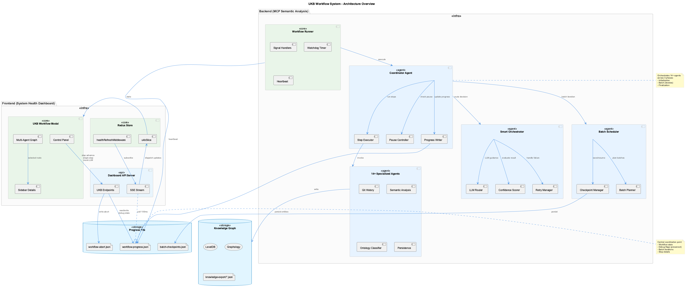
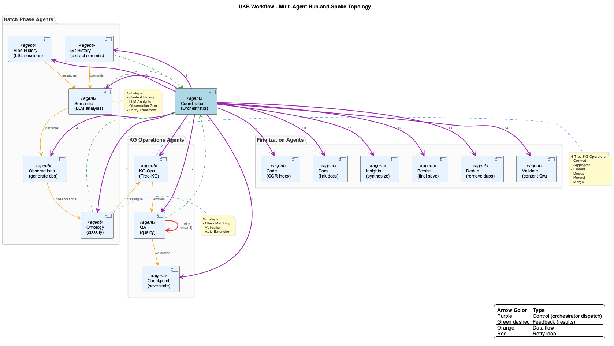
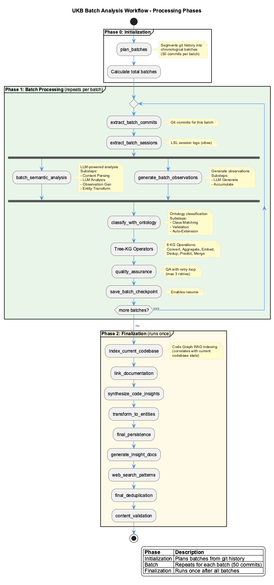
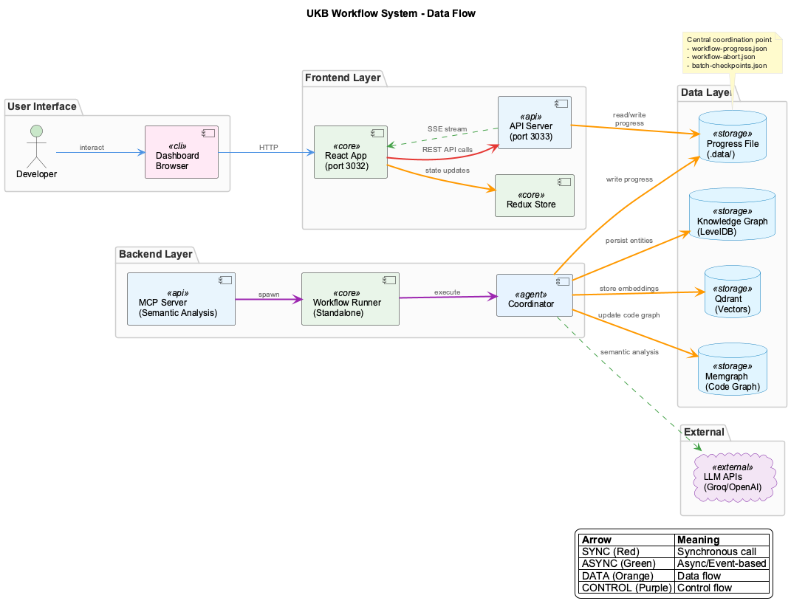
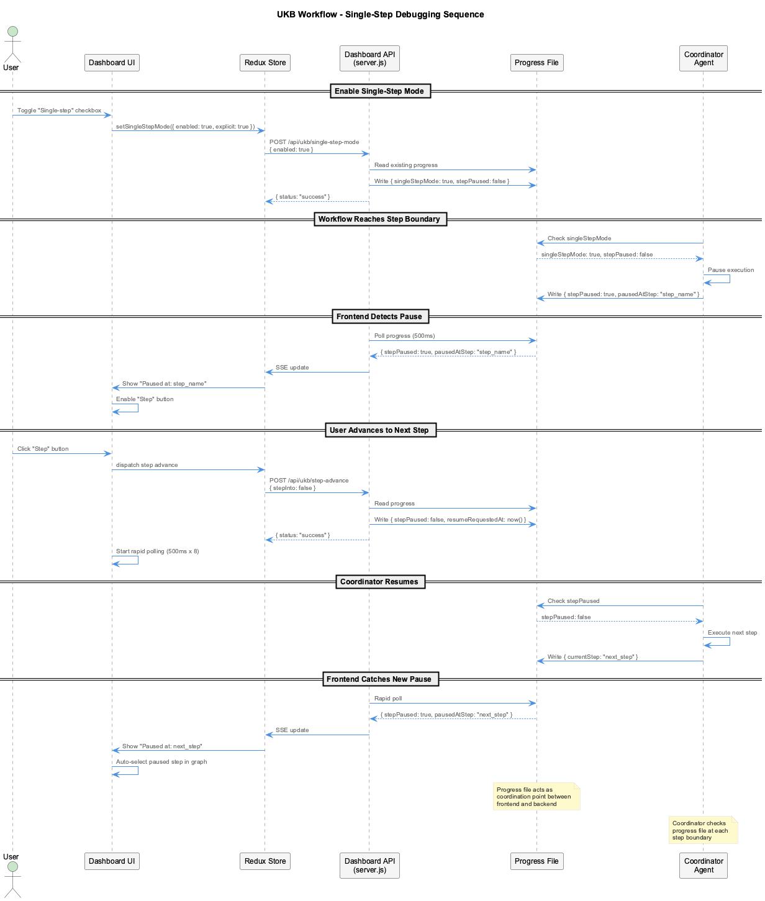
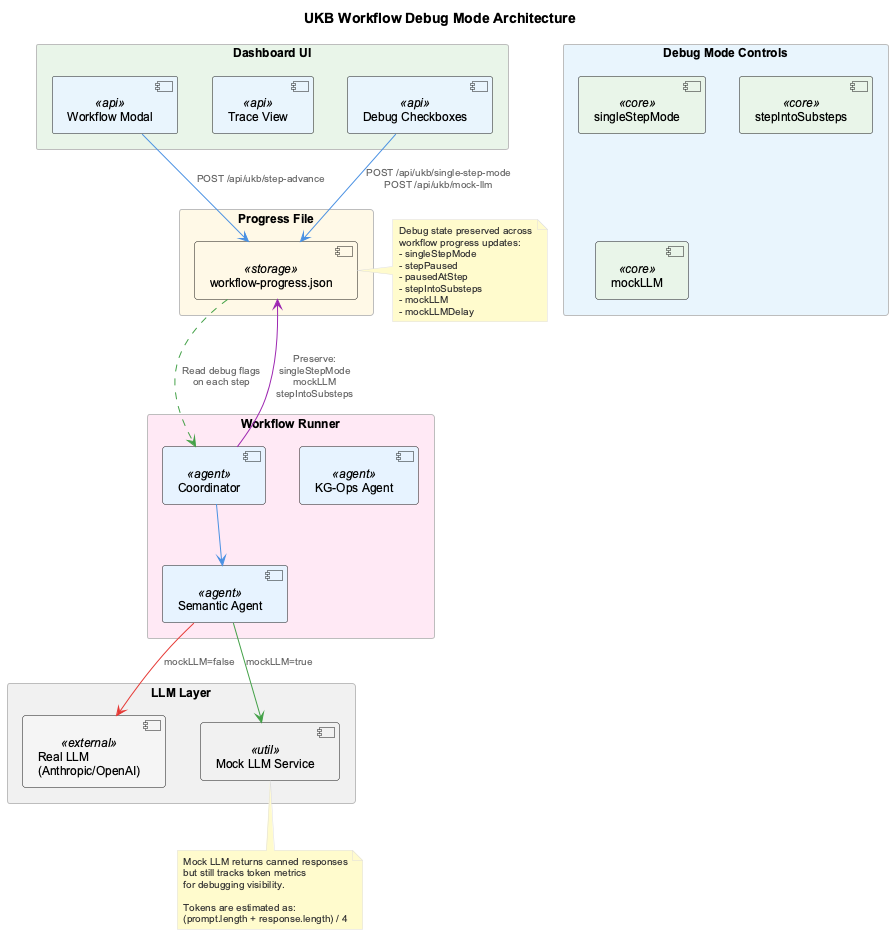
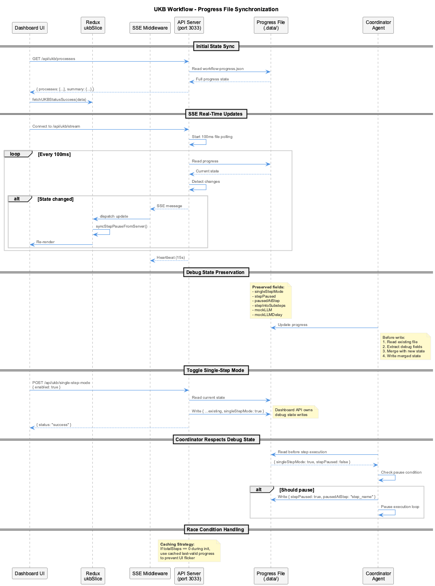

# UKB Workflow System Architecture

This document describes the comprehensive architecture of the UKB (Update Knowledge Base) workflow system, covering both the backend execution engine and the frontend visualization/control dashboard.

## Overview

The UKB workflow system consists of:

1. **Backend (MCP Semantic Analysis Server)** - Executes multi-agent workflows
2. **Frontend (System Health Dashboard)** - Visualizes and controls workflow execution
3. **Progress File** - Central coordination point between frontend and backend



## Architecture Components

### Backend Components

| Component | Location | Purpose |
|-----------|----------|---------|
| Workflow Runner | `mcp-server-semantic-analysis/src/workflow-runner.ts` | Standalone process for resilient execution |
| Coordinator Agent | `mcp-server-semantic-analysis/src/agents/coordinator.ts` | Orchestrates 14+ specialized agents |
| Smart Orchestrator | `mcp-server-semantic-analysis/src/orchestrator/smart-orchestrator.ts` | LLM-powered routing decisions |
| Batch Scheduler | `mcp-server-semantic-analysis/src/agents/batch-scheduler.ts` | Plans chronological batches |
| SSE Server | `mcp-server-semantic-analysis/src/sse-server.ts` | Real-time update streaming |

### Frontend Components

| Component | Location | Purpose |
|-----------|----------|---------|
| API Server | `system-health-dashboard/server.js` | REST endpoints for workflow control |
| Redux Store | `system-health-dashboard/src/store/slices/ukbSlice.ts` | Workflow state management |
| Workflow Modal | `system-health-dashboard/src/components/ukb-workflow-modal.tsx` | Main UI component |
| Multi-Agent Graph | `system-health-dashboard/src/components/workflow/multi-agent-graph.tsx` | Visualization |
| SSE Middleware | `system-health-dashboard/src/store/middleware/healthRefreshMiddleware.ts` | Real-time sync |

## Multi-Agent Topology

The workflow uses a **hub-and-spoke topology** with the Coordinator at the center:



### Specialized Agents

| Agent | Phase | Description |
|-------|-------|-------------|
| Git History | Batch | Extracts commits for analysis |
| Vibe History | Batch | Extracts LSL session logs |
| Semantic | Batch | LLM-powered pattern analysis |
| Observations | Batch | Generates structured observations |
| Ontology | Batch | Classifies entities against ontology |
| KG-Ops | Batch | Tree-KG operators (6 substeps) |
| QA | Batch | Quality assurance with retry |
| Checkpoint | Batch | Saves resumable state |
| Code (CGR) | Finalization | Indexes current codebase |
| Docs | Finalization | Links documentation |
| Insights | Finalization | Synthesizes insights |
| Persist | Finalization | Final persistence |
| Dedup | Finalization | Removes duplicates |
| Validate | Finalization | Content validation |

## Batch Processing Workflow

The batch-analysis workflow processes git history in chronological batches:



### Three Phases

1. **Initialization Phase**
   - `plan_batches`: Segments git history into 50-commit batches

2. **Batch Phase** (repeats for each batch)
   - Extract commits and sessions
   - Semantic analysis with LLM
   - Generate observations
   - Ontology classification
   - Tree-KG operations
   - Quality assurance
   - Save checkpoint

3. **Finalization Phase** (runs once after all batches)
   - Code Graph RAG indexing
   - Documentation linking
   - Insight synthesis
   - Final persistence and validation

## Data Flow



### Key Data Paths

1. **User → Dashboard → API → Progress File**: Control commands
2. **Progress File → API → SSE → Redux → UI**: State updates
3. **Coordinator → Progress File**: Workflow state writes
4. **Coordinator → Knowledge Graph**: Entity persistence

## Single-Step Debugging

The system supports step-by-step workflow debugging:



### Debugging Controls

| Control | API Endpoint | Description |
|---------|--------------|-------------|
| Single-step mode | `POST /api/ukb/single-step-mode` | Toggle pause at step boundaries |
| Step advance | `POST /api/ukb/step-advance` | Advance to next step/substep |
| Step into | `POST /api/ukb/step-advance { stepInto: true }` | Enter substeps |
| Mock LLM | `POST /api/ukb/mock-llm` | Use mock LLM responses |

### Full Debug Mode

For comprehensive debugging, start workflows with all debug flags enabled:

```bash
# Via MCP tool
mcp__semantic-analysis__execute_workflow
  workflow_name: "batch-analysis"
  async_mode: true
  debug: true
  parameters: {
    team: "coding",
    singleStepMode: true,
    mockLLM: true,
    stepIntoSubsteps: true
  }
```



### Mock LLM Mode

When `mockLLM: true` is enabled:

1. **No real API calls** - All LLM calls use canned responses from `llm-mock-service.ts`
2. **Token metrics still tracked** - Tokens are estimated as `(prompt.length + response.length) / 4`
3. **Fast execution** - Mock responses return immediately (configurable delay)
4. **Dashboard visibility** - LLM calls and tokens appear in trace view for debugging

The mock service generates realistic but synthetic responses for:
- Semantic analysis (entity/relation extraction)
- Observation generation
- Ontology classification
- Quality assurance checks

**Note**: Mock LLM is recommended for debugging to avoid API costs and latency.

### Substep Support

Some agents have substeps (e.g., Semantic Analysis):
- `sem_data_prep` - Content Parsing
- `sem_llm_analysis` - LLM Analysis
- `sem_observation_gen` - Observation Generation
- `sem_entity_transform` - Entity Transform

When `stepIntoSubsteps` is enabled, the workflow pauses at each substep boundary.

## Progress File Synchronization



### Progress File Format

```json
{
  "workflowId": "wf_123456",
  "workflowName": "batch-analysis",
  "status": "running",
  "currentStep": "batch_semantic_analysis",
  "stepsCompleted": 5,
  "totalSteps": 24,
  "batchProgress": {
    "currentBatch": 3,
    "totalBatches": 10
  },
  "batchIterations": [...],
  "stepsDetail": [...],
  "singleStepMode": true,
  "stepPaused": true,
  "pausedAtStep": "sem_llm_analysis",
  "mockLLM": false,
  "lastUpdate": "2026-01-28T10:00:00Z"
}
```

### Debug State Preservation

The Coordinator preserves debug state fields across progress updates:
- `singleStepMode`
- `stepPaused`
- `pausedAtStep`
- `stepIntoSubsteps`
- `mockLLM`
- `mockLLMDelay`

This prevents race conditions where workflow updates could overwrite user-controlled debug state.

## API Reference

### UKB Endpoints (Port 3033)

| Method | Endpoint | Description |
|--------|----------|-------------|
| GET | `/api/ukb/status` | Summary of running workflows |
| GET | `/api/ukb/processes` | Detailed process list with steps |
| POST | `/api/ukb/start` | Start new workflow |
| POST | `/api/ukb/cancel` | Cancel running workflow |
| POST | `/api/ukb/single-step-mode` | Toggle single-step mode |
| POST | `/api/ukb/step-advance` | Advance to next step |
| POST | `/api/ukb/mock-llm` | Toggle mock LLM mode |
| GET | `/api/ukb/stream` | SSE endpoint for real-time updates |
| GET | `/api/ukb/history` | List completed workflows |
| GET | `/api/workflows/definitions` | Get workflow YAML definitions |

## Error Handling & Recovery

### Crash Recovery

The Workflow Runner handles:
- SIGTERM, SIGINT signals
- Unhandled rejections and exceptions
- Watchdog timer (max duration)
- Heartbeat mechanism (30s interval)

### Retry Logic

The Smart Orchestrator implements:
- Max 3 retries per step
- Confidence threshold: 0.5
- Progressive tightening on QA failures
- Partial result acceptance after max retries

### Stale Detection

| State | Heartbeat Age | Description |
|-------|---------------|-------------|
| Healthy | < 2 min | Normal operation |
| Stale | 2-5 min | May need attention |
| Frozen | > 5 min | Likely stuck |
| Dead | > 5 min + failures | Process terminated |

## Performance Optimization

### Learned Progress Estimation

After workflow completion, timing statistics are updated:
- Average batch duration
- Per-step durations
- Finalization time

These enable more accurate ETA predictions on subsequent runs.

### Parallelization

- Code Graph RAG: 5 concurrent LLM calls
- Persistence: 10 concurrent entity writes
- Content Validation: 3+ concurrent calls

## File Locations

### Backend
```
integrations/mcp-server-semantic-analysis/
├── src/
│   ├── workflow-runner.ts       # Standalone runner
│   ├── agents/coordinator.ts    # Main orchestrator
│   ├── agents/batch-scheduler.ts
│   └── orchestrator/smart-orchestrator.ts
└── config/workflows/
    └── batch-analysis.yaml      # Workflow definition
```

### Frontend
```
integrations/system-health-dashboard/
├── server.js                    # API endpoints
└── src/
    ├── store/slices/ukbSlice.ts
    ├── store/middleware/healthRefreshMiddleware.ts
    └── components/
        ├── ukb-workflow-modal.tsx
        └── workflow/
            ├── multi-agent-graph.tsx
            ├── constants.ts
            └── trace-modal.tsx
```

### Runtime Data
```
.data/
├── workflow-progress.json       # Active workflow state
├── workflow-abort.json          # Abort signal
├── batch-checkpoints.json       # Batch progress
└── workflow-<id>.pid            # Process ID tracking
```

## See Also

- [Getting Started](../getting-started.md) - Initial setup guide
- [Troubleshooting](../troubleshooting.md) - Common issues and solutions
- [System Overview](../system-overview.md) - High-level architecture
