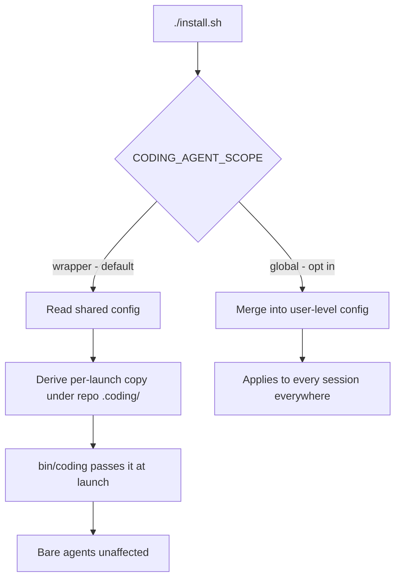

# Install Scope and Host Impact

What `./install.sh` changes on your machine, what it deliberately does not, and
how to see the whole list before running it.

The short version: **a default install does not change how bare `claude`,
`copilot` or `opencode` behave.** Everything this project adds to an agent is
supplied per launch by `bin/coding`, not written into your shared config.

## See it first

```bash
./install.sh --dry-run
```

This prints the full mutation manifest and exits 0 without touching anything —
not even the install log, which would otherwise contradict the claim.

## The one question that decides host impact

The installer asks whether to configure your agents globally. **The default is
no.** The answer is stored in `.env` as `CODING_AGENT_SCOPE`:

| Value | Meaning |
|---|---|
| `wrapper` (default) | Agents are configured per launch, by `bin/coding`. Your shared config files are read, never written. |
| `global` | Hooks, MCP servers and slash commands are merged into your user-level agent config, so they also apply to bare agent sessions in every other project. |



Two things about unattended runs, because they are easy to get wrong:

- `--yes` auto-approves system changes, but it does **not** select global scope.
  That inverts the usual meaning of `--yes` on purpose: an unattended run must
  never silently reconfigure your agents. Global scope requires an explicit
  `--global-agents` or `CODING_INSTALL_GLOBAL_AGENTS=1`.
- Background services (the LLM proxy at login) are the same: they need
  `CODING_INSTALL_SYSTEM_SERVICES=1`. Previously `--yes` alone installed a
  login-persistent daemon.

## How each agent is configured without writing to shared files

| Agent | Per-launch seam | Notes |
|---|---|---|
| **claude** | `--settings` + `--plugin-dir` | `scripts/build-claude-runtime-config.mjs` reads `~/.claude/settings.json` **read-only**, deep-merges our hooks into a copy at `.coding/runtime/claude-settings.json`, and builds `.coding/claude-plugin/` from `.claude/commands/`. The merge is done by us rather than relying on `--settings` merge semantics, which are unspecified for the `hooks` key — getting that wrong would silently disable your own hooks. `--strict-mcp-config` is deliberately never passed, since it would suppress your own MCP servers. |
| **opencode** | `OPENCODE_CONFIG_CONTENT` | Plugins are spliced into the JSON already used to pass the provider (`config/agents/opencode.sh`). Absolute repo paths, so plugins stay live rather than going stale as copies in `$HOME`. |
| **copilot** | none — see below | |

### The copilot gap, stated plainly

Copilot's `enableFileHooks` (in `~/.copilot/settings.json`) and `trustedFolders`
(in `~/.copilot/config.json`) have **no per-launch equivalent**: no flag, no
config-directory environment variable. Only `--additional-mcp-config` is
session-scoped.

So copilot file hooks are a **separate opt-in**, off even in global scope,
enabled with `CODING_INSTALL_COPILOT_HOOKS=1`. The requirement that bare agents
stay unchanged is met here by *not doing it*, not by solving it. With it off,
copilot under `bin/coding` still gets MCP servers and transcript capture; only
post-tool knowledge injection is dormant. Note also that the `config.json`
rewrite discards JSONC comments, which is why it is disclosed as its own row.

## The mutation manifest

`mutation_manifest()` in `install.sh` is the **source of truth**. The table below
is a copy for reading; if the two ever disagree, believe the script. (`uninstall.sh`
is bound to the same table by documentation rather than by code — the two could
drift, and closing that properly means extracting the table to a sourceable file.)

### Inside the repo — removed entirely if you delete it

| Path | Action | Why |
|---|---|---|
| `node_modules/` | create | Node dependencies |
| `.env` | append | local settings (history repo URL, feature flags) |
| `.npmrc` | create | proxy for npm, only if env vars are not honoured |
| `.git/hooks/pre-commit` | replace | knowledge-snapshot guard; original saved as `pre-commit.coding-orig` |
| `lib/km-core` | checkout | git submodule required for session logging |
| `.coding/` | create | per-launch agent config, so nothing global has to change |
| `.specstory/history/` | clone or init | private session-history checkout |

### In your home directory — ours alone, reverted by `./uninstall.sh`

| Path | Action | Why |
|---|---|---|
| `~/bin/coding` | symlink | makes the `coding` command available on PATH |
| `$SHELL_RC` | one marker block | exports `CODING_REPO` and adds `bin/` to PATH |

### Shared with your own tools — changes how bare agents behave

Skipped unless you opt in.

| Path | Action | Why |
|---|---|---|
| `~/.claude/settings.json` | merge hooks | hooks would run for **every** claude session, in every project |
| `~/.claude.json` | merge mcpServers | MCP servers visible to bare `claude` everywhere |
| `~/.claude/commands/` | copy skills | slash commands available to bare `claude` everywhere |
| `~/.config/opencode/opencode.json` | merge plugins | plugins load in every opencode session |
| `~/.copilot/settings.json` | `enableFileHooks` | separate opt-in: lets repo hooks fire in **any** of your repos |
| `~/.copilot/config.json` | add `trustedFolders` | separate opt-in: trusts this repo; rewrite drops JSONC comments |

### Background services that survive logout

Skipped unless you opt in with `CODING_INSTALL_SYSTEM_SERVICES=1`.

| Path | Action | Platform |
|---|---|---|
| `~/Library/LaunchAgents/com.coding.llm-cli-proxy.plist` | create + load | macOS |
| `~/.config/systemd/user/llm-cli-proxy.service` | create + enable | Linux / WSL |

## Backups: one, not many

Three files used to accumulate a new `.backup.<timestamp>` copy on **every** run,
unpruned. Each now keeps exactly one `.coding-orig` from before the installer
first touched it — the copy that actually has restore value:

- `~/.claude.json`
- `~/.claude/settings.json`
- `~/.config/opencode/opencode.json`
- plus `.git/hooks/pre-commit`, which previously had no backup at all

`./uninstall.sh` **reports** these rather than deleting them, and points out any
leftover `.coding-backup.<timestamp>` files from older installs so you can prune
them yourself.

## Your shell rc file

The installer writes **one** marker-delimited block to `$SHELL_RC` only.

It used to run seven `sed -i.bak` passes over all four of `~/.bashrc`,
`~/.bash_profile`, `~/.zshrc` and `~/.zprofile` on every run, before the sandbox
guard, with no confirmation. Because each pass overwrote the same `.bak`, the
original was not recoverable. Measured against a realistic `.zshrc`, it destroyed
6 of 8 lines — including aliases, exports and PATH entries that had nothing to do
with this project. That behaviour is gone.

## Migration from an earlier global install

Choosing `wrapper` does not by itself undo a previous global install.
`cleanup_stale_global_artifacts()` detects and surgically removes what we left
behind — our command files, hooks whose command names this repo, our opencode
plugins and their `opencode.json` entries — while leaving your own hooks,
plugins, commands, theme and model settings alone.

Without that step the wrapper choice would be quietly untrue on any machine that
had run an older installer.

## How this is kept honest

`scripts/test-coding.sh` hashes every shared agent config, runs the seven
functions that used to write to them at default scope, hashes again, and asserts
byte-identity. That check fails hard even under `--ci`: a global write is a real
regression, not an unsatisfied environment precondition. CI additionally runs a
real `./install.sh --ci` on Linux and re-checks the same invariant afterwards —
see [Cross-platform CI](./ci/README.md).

## Related

- [Getting Started](./getting-started.md) — prerequisites and first run
- [Cross-platform CI](./ci/README.md) — what is verified, and where
