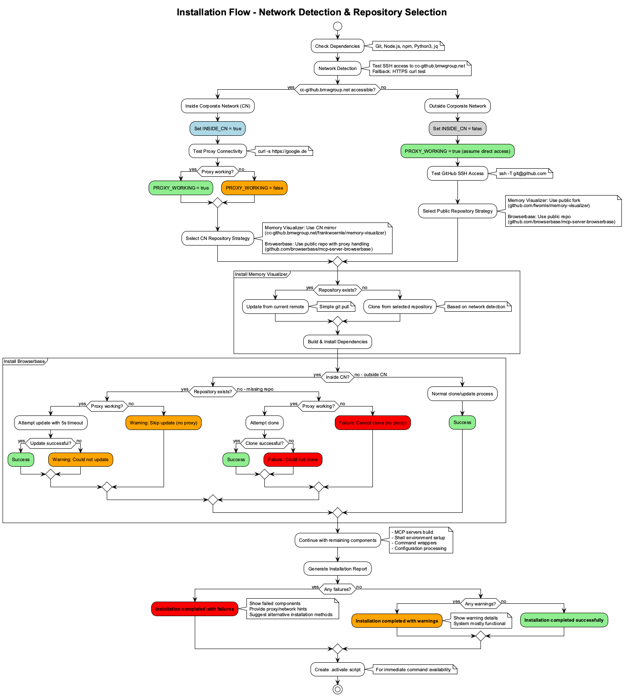
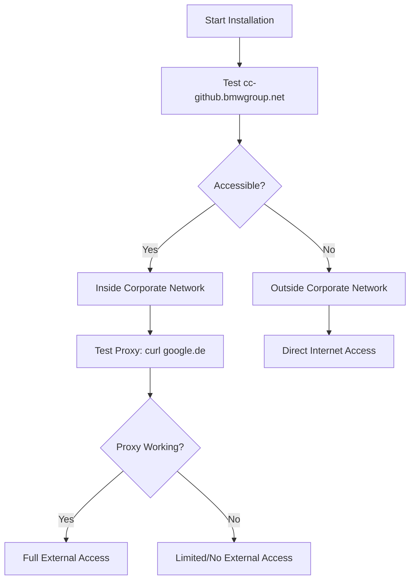

# Installation Architecture Documentation

## Overview

The Claude Knowledge Management System uses a sophisticated network-aware installation strategy that automatically adapts to different network environments (Corporate Network vs Public Internet) and handles repository access intelligently.



*Complete installation flow with network detection and repository selection logic*

## Repository Architecture

### Repository Types

1. **Mirrored Repositories**
   - **memory-visualizer**: Has both CN mirror and public fork
   - CN Mirror: `cc-github.bmwgroup.net/frankwoernle/memory-visualizer`
   - Public Fork: `github.com/fwornle/memory-visualizer`
   - Contains team-specific modifications and customizations

2. **Public-Only Repositories**
   - **browserbase/mcp-server-browserbase**: No CN mirror, public only
   - Public Repo: `github.com/browserbase/mcp-server-browserbase`
   - Upstream repository without modifications

### Network Detection Logic



## Installation Strategies

### Inside Corporate Network (CN)

**Memory Visualizer (Mirrored):**
- Always uses CN mirror: `cc-github.bmwgroup.net/frankwoernle/memory-visualizer`
- Rationale: Contains team modifications not available in public version

**Browserbase (Public-Only):**
- Repository exists + Proxy working → Update successfully
- Repository exists + No proxy → Skip update, continue with existing
- Repository missing + Proxy working → Clone successfully  
- Repository missing + No proxy → Fail with helpful error

### Outside Corporate Network

**All Repositories:**
- Use public repositories
- Memory Visualizer: Uses public fork `github.com/fwornle/memory-visualizer`
- Browserbase: Uses upstream `github.com/browserbase/mcp-server-browserbase`

## Graceful Degradation Strategy

### Success Levels

1. **Full Success** 🟢
   - All repositories cloned/updated successfully
   - All components built and installed
   - All features available

2. **Partial Success with Warnings** 🟡
   - Core components installed
   - Some repositories couldn't be updated (existing versions used)
   - Most features available

3. **Partial Success with Failures** 🔴
   - Core components installed
   - Some repositories missing and couldn't be cloned
   - Reduced functionality

### Error Handling

**Network-Related Failures:**
- Proxy detection prevents hanging operations
- Timeouts ensure installation continues
- Clear error messages with actionable hints

**Repository Access Failures:**
- SSH failures fall back to HTTPS
- HTTPS failures are logged with context
- Missing repositories don't block entire installation

## Proxy Detection

### Test Method
```bash
timeout 5s curl -s --connect-timeout 5 https://google.de >/dev/null 2>&1
```

### Rationale
- Google.de is a stable, external endpoint
- Tests actual HTTP/HTTPS proxy functionality
- Fast timeout prevents installation delays
- More reliable than testing specific git hosts

## Status Reporting

### Installation Report Categories

**Warnings Array:**
- Repository update failures (non-critical)
- Proxy/network access issues
- Build warnings that don't prevent functionality

**Failures Array:**
- Missing repositories that couldn't be cloned
- Critical build failures
- Missing dependencies that prevent core functionality

### User Guidance

**Inside CN with Proxy Issues:**
1. Check proxy configuration
2. Run installer outside corporate network
3. Manual repository setup instructions

**SSH Access Issues:**
1. SSH key configuration links
2. Alternative HTTPS methods
3. Repository access verification steps

## Implementation Details

### Key Functions

1. **`detect_network_and_set_repos()`**
   - Tests cc-github.bmwgroup.net accessibility
   - Sets global repository URL variables
   - Determines CN vs public network status

2. **`test_proxy_connectivity()`**
   - Tests external internet access
   - Sets proxy working flag
   - Only runs inside CN

3. **`handle_non_mirrored_repo_cn()`**
   - Intelligent handling for public repos inside CN
   - Graceful fallback for proxy issues
   - Status tracking for reporting

4. **`show_installation_status()`**
   - Comprehensive status reporting
   - Color-coded success/warning/failure display
   - Actionable hints for resolving issues

### Global State Variables

```bash
INSIDE_CN=false                    # Network location flag
PROXY_WORKING=false                # External access capability
INSTALLATION_WARNINGS=()           # Non-critical issues
INSTALLATION_FAILURES=()           # Critical failures
```

## Testing Scenarios

### Scenario Matrix

| Network | Proxy | Memory Visualizer | Browserbase | Expected Result |
|---------|-------|------------------|-------------|-----------------|
| CN | Working | CN Mirror | Clone/Update Public | Full Success |
| CN | Blocked | CN Mirror | Use Existing/Fail | Partial Success |
| Public | N/A | Public Fork | Public Repo | Full Success |

### Manual Testing Commands

```bash
# Test CN detection
ssh -T git@cc-github.bmwgroup.net

# Test proxy functionality  
curl -s --connect-timeout 5 https://google.de

# Test repository access
git clone git@cc-github.bmwgroup.net:frankwoernle/memory-visualizer.git /tmp/test-cn
git clone git@github.com:fwornle/memory-visualizer.git /tmp/test-public
```

This architecture ensures robust, network-aware installation that gracefully handles corporate network restrictions while maximizing functionality in all environments.