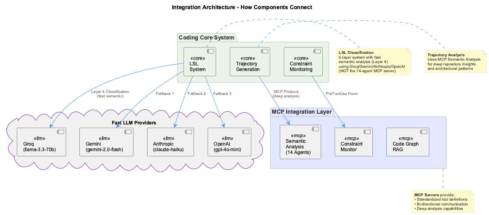

# Integration Components

The Coding system uses **self-contained integration components**, each maintained as a separate application with its own repository structure and comprehensive documentation.

## Integration Philosophy

Each integration component:

1. **Self-Contained** - Complete with own README, docs, tests, and dependencies
2. **Well-Documented** - Comprehensive documentation in component directory
3. **Independently Maintained** - Own versioning and release cycle
4. **Loosely Coupled** - Communicates via standard protocols (MCP, HTTP, CLI)
5. **Easily Replaceable** - Can be swapped without affecting core system

---

## Available Integrations

### MCP Servers

#### MCP Semantic Analysis Server
**Location**: `integrations/mcp-server-semantic-analysis/`

**What it provides:**
- 14 specialized AI agents for code analysis (including code graph and ontology classification)
- Repository scanning and pattern extraction
- AST-based code indexing via Memgraph
- Ontology classification for knowledge entities
- PlantUML diagram generation
- Knowledge base synchronization
- Comprehensive semantic analysis workflows

**Documentation**: [mcp-semantic-analysis.md](mcp-semantic-analysis.md) | [Full README](https://github.com/fwornle/mcp-server-semantic-analysis/blob/main/README.md)

#### MCP Constraint Monitor
**Location**: `integrations/mcp-constraint-monitor/`

**What it provides:**
- Real-time constraint enforcement via PreToolUse hooks
- 18 configurable constraints across 4 severity levels
- REST API (port 3031) and Dashboard UI (port 3030)
- Compliance scoring and violation tracking
- Interactive and automated testing frameworks

**Documentation**: [mcp-constraint-monitor.md](mcp-constraint-monitor.md) | [Full README](https://github.com/fwornle/mcp-constraint-monitor/blob/main/README.md)

### Code Analysis

#### Code Graph RAG
**Location**: `integrations/code-graph-rag/`

**What it provides:**
- Graph-based code analysis using Memgraph
- Semantic code search and relationship mapping
- Call graph analysis and dependency tracing
- MCP tools for querying code structure
- Visual graph exploration via Memgraph Lab

**Ports**: Memgraph (7687), Lab UI (3100) - configured in `.env.ports`

**Documentation**: [code-graph-rag.md](code-graph-rag.md) | [GitHub](https://github.com/anthropics/code-graph-rag)

#### Serena AST Analysis
**Location**: `integrations/serena/`

**What it provides:**
- AST-based semantic code search
- Structure-aware code navigation
- Security vulnerability detection
- Refactoring support with dependency analysis
- Cross-language analysis support

**Documentation**: [serena-ast-analysis.md](serena-ast-analysis.md) | [Full README](https://github.com/oraios/serena/blob/main/README.md)

### Browser Automation

#### Browser Access (Stagehand)
**Location**: `integrations/browser-access/`

**What it provides:**
- MCP server for browser automation
- Web scraping and interaction
- Automated testing support
- Page navigation and data extraction

**Documentation**: [browser-access.md](browser-access.md) | [Full README](../../integrations/browser-access/README.md)

### Editor Integration

#### VSCode CoPilot Integration
**Location**: `integrations/vscode-km-copilot/`

**What it provides:**
- Enhanced GitHub CoPilot with knowledge management
- Command palette integration (View/Update KB)
- CoPilot chat commands (`@KM`)
- Seamless UKB/VKB access from VSCode

**Documentation**: [vscode-copilot.md](vscode-copilot.md) | [Full README](../../integrations/vscode-km-copilot/README.md)

---

## Integration Architecture

### How Integrations Connect



The core systems communicate with integrations through different protocols:

**LSL System**:
- Uses fast LLM providers (Groq/OpenAI) for Layer 4 semantic classification
- Does NOT use the 14-agent MCP Semantic Analysis server (that's for deep analysis)
- Classification happens in milliseconds with budget-conscious models

**Trajectory Generation**:
- Uses MCP Semantic Analysis (14 agents, 11 use LLM) for deep repository insights
- Uses Serena AST for code structure analysis
- Comprehensive architectural pattern extraction

**Constraint Monitoring**:
- Uses PreToolUse hooks to intercept tool calls before execution
- MCP Constraint Monitor provides dashboard and API (ports 3030/3031)

### Communication Protocols

**MCP (Model Context Protocol)**
- Primary integration method for Claude Code
- Standardized tool definitions
- Bi-directional communication
- Resource and prompt support

**HTTP APIs**
- REST endpoints for dashboards
- Webhook support for events
- Status monitoring endpoints

**CLI Commands**
- Direct script execution
- Shell integration
- Pipe-able output

**File-Based**
- Shared JSON files (knowledge base)
- LSL markdown files
- Configuration files

---

## Installation & Configuration

### Automatic Installation

All integrations are installed via main installer:

```bash
cd ~/Agentic/coding
./install.sh

# This installs:
# ✓ MCP Semantic Analysis Server
# ✓ MCP Constraint Monitor
# ✓ Serena AST Analysis
# ✓ Browser Access (optional)
# ✓ VSCode CoPilot Extension (optional)
```

### Manual Installation

To install specific integration:

```bash
cd integrations/<integration-name>
npm install
npm run build  # if applicable

# Follow integration-specific setup in its README
```

### MCP Configuration

MCP servers are configured in Claude Code's config:

**Location**: `~/.config/Claude/claude_desktop_config.json`

```json
{
  "mcpServers": {
    "semantic-analysis": {
      "command": "node",
      "args": ["/path/to/coding/integrations/mcp-server-semantic-analysis/build/index.js"]
    },
    "constraint-monitor": {
      "command": "node",
      "args": ["/path/to/coding/integrations/mcp-constraint-monitor/src/mcp-server.js"]
    },
    "serena": {
      "command": "node",
      "args": ["/path/to/coding/integrations/serena/src/mcp/server.js"]
    }
  }
}
```

---

## Integration Development

### Creating New Integration

1. **Create Component Directory**
   ```bash
   mkdir integrations/my-integration
   cd integrations/my-integration
   ```

2. **Initialize with README**
   ```bash
   npm init
   # Create comprehensive README.md
   ```

3. **Implement Interface**
   - MCP server (for Claude Code)
   - HTTP API (for dashboards)
   - CLI commands (for shell)

4. **Add to Installer**
   ```bash
   # Update install.sh to include new integration
   ```

5. **Document Integration**
   ```bash
   # Create docs/integrations/my-integration.md
   ```

### Integration Checklist

- [ ] Self-contained directory structure
- [ ] Comprehensive README.md
- [ ] API/CLI documentation
- [ ] Installation instructions
- [ ] Configuration examples
- [ ] Usage examples
- [ ] Troubleshooting guide
- [ ] Integration tests
- [ ] Version management

---

## Troubleshooting

### MCP Servers Not Loading

```bash
# Check Claude Code config
cat ~/.config/Claude/claude_desktop_config.json

# Check server logs
ls ~/.claude/logs/mcp*.log
tail ~/.claude/logs/mcp-semantic-analysis.log

# Test server directly
node integrations/mcp-server-semantic-analysis/build/index.js
```

### Integration Not Working

```bash
# Verify installation
ls integrations/<integration-name>

# Check dependencies
cd integrations/<integration-name>
npm install

# Test standalone
npm test  # if tests available
```

### Port Conflicts

```bash
# Check what's using ports
lsof -i :3030  # Constraint Dashboard
lsof -i :3031  # Constraint API
lsof -i :8080  # Memory Visualizer

# Kill conflicting process
kill <PID>
```

---

## See Also

- [System Overview](../system-overview.md) - How integrations fit into overall system
- [Getting Started](../getting-started.md) - Installation and setup
- [Architecture](../architecture/overview.md) - System design and patterns

---

*Each integration maintains its own comprehensive documentation. See individual component READMEs for detailed information.*
