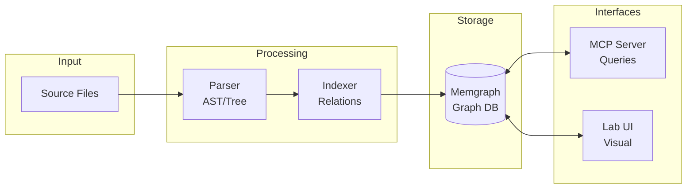

# Code Graph RAG

Graph-based code analysis using Memgraph for semantic code understanding, relationship mapping, and intelligent code navigation.

## Overview

Code Graph RAG indexes your codebase into a graph database (Memgraph), enabling:

- **Semantic Code Search** - Find code by meaning, not just text matching
- **Relationship Mapping** - Understand how functions, classes, and modules connect
- **Call Graph Analysis** - Trace function calls and dependencies
- **Impact Analysis** - Identify what code is affected by changes

## Architecture



**Components:**
- **Parser** - Extracts AST/syntax tree from source files
- **Indexer** - Builds relationships between code elements
- **Memgraph** - Stores the graph database (Bolt protocol)
- **MCP Server** - Provides query interface for Claude Code
- **Lab UI** - Visual graph exploration interface

## Port Configuration

All ports are configured in `.env.ports` (single source of truth):

| Service | Port | Protocol | Description |
|---------|------|----------|-------------|
| Memgraph | 7687 | Bolt | Graph database query protocol |
| Memgraph HTTP | 7444 | HTTP | Memgraph HTTP interface |
| Memgraph Lab | 3100 | HTTP | Visual graph exploration UI |

**Environment Variables**:
```bash
MEMGRAPH_BOLT_PORT=7687    # Bolt protocol port
MEMGRAPH_HTTPS_PORT=7444   # HTTP interface port
MEMGRAPH_LAB_PORT=3100     # Lab UI port
```

## Installation

Code Graph RAG is installed automatically with the main installer:

```bash
./install.sh
```

### Manual Installation

```bash
# Ensure Docker is running
docker info

# Start services with port configuration from .env.ports
cd integrations/code-graph-rag
docker-compose up -d
```

The startup script (`scripts/start-services-robust.js`) automatically:
1. Reads port configuration from environment variables
2. Passes ports to docker-compose at runtime
3. Performs TCP health checks on Memgraph (Bolt protocol)

## Usage

### Via MCP Tools

The Code Graph RAG provides MCP tools accessible in Claude Code:

```javascript
// Index a repository
mcp__code-graph-rag__index_repository()

// Query the code graph
mcp__code-graph-rag__query_code_graph({
  natural_language_query: "What functions call UserService.create_user?"
})

// Get source code for a function
mcp__code-graph-rag__get_code_snippet({
  qualified_name: "app.services.UserService.create_user"
})
```

### Via Memgraph Lab

Access the visual graph explorer at `http://localhost:3100`:

1. Connect to `memgraph:7687` (or `localhost:7687` from host)
2. Run Cypher queries to explore the graph
3. Visualize relationships between code elements

**Example Cypher Queries**:
```cypher
// Find all classes
MATCH (c:Class) RETURN c.name LIMIT 10;

// Find function dependencies
MATCH (f:Function)-[:CALLS]->(g:Function)
RETURN f.name, g.name;

// Find class hierarchy
MATCH (c:Class)-[:EXTENDS]->(parent:Class)
RETURN c.name, parent.name;
```

## Health Monitoring

Memgraph health is monitored by the system health dashboard:

- **Protocol**: TCP (Bolt) - NOT HTTP
- **Health Check**: Raw socket connection to port 7687
- **Dashboard**: Visible in System Health Dashboard (`http://localhost:3032`)

### Manual Health Check

```bash
# Check if Memgraph is accepting connections
node -e "
const net = require('net');
const socket = new net.Socket();
socket.setTimeout(5000);
socket.on('connect', () => { console.log('Memgraph OK'); socket.destroy(); });
socket.on('error', (e) => { console.log('Memgraph FAIL:', e.code); });
socket.connect(7687, 'localhost');
"
```

## Docker Configuration

The `code-graph-rag` submodule contains a `docker-compose.yaml` with persistence and auto-restart:

```yaml
services:
  memgraph:
    image: memgraph/memgraph-mage
    ports:
      - "${MEMGRAPH_PORT:-7687}:7687"
      - "${MEMGRAPH_HTTP_PORT:-7444}:7444"
    volumes:
      - ./shared-data:/import
      - memgraph-data:/var/lib/memgraph  # Persistent data - survives container restarts
    restart: unless-stopped  # Auto-restart on failure or Docker restart
  lab:
    image: memgraph/lab
    ports:
      - "${LAB_PORT:-3000}:3000"
    environment:
      QUICK_CONNECT_MG_HOST: memgraph
    restart: unless-stopped

# Named volumes for data persistence
volumes:
  memgraph-data:
    name: code-graph-rag-memgraph-data
```

### Fast CSV Bulk Loading

The indexer uses Memgraph's `LOAD CSV` for fast bulk import:

```
shared-data/                    →  /import (mounted in container)
├── nodes/
│   ├── function.csv (5MB)         LOAD CSV FROM '/import/nodes/...'
│   ├── class.csv                         ↓
│   ├── method.csv               ┌─────────────────┐
│   └── ...                      │    Memgraph     │
└── relationships.csv (29MB)     │   Graph Engine  │
                                 └────────┬────────┘
                                          ↓
                     memgraph-data:/var/lib/memgraph (persistent)
```

- **CSV files** = Staging format for bulk import (regenerated on re-index)
- **Memgraph volume** = Actual graph storage (persisted)

### Persistence

**The code graph index is persisted** via Docker named volume `code-graph-rag-memgraph-data`. This means:
- Index survives container restarts and recreation
- No need to re-index (20+ min) after `docker-compose down/up`
- Data persists across Docker daemon restarts

To verify persistence is working:
```bash
docker volume ls | grep memgraph
# Should show: code-graph-rag-memgraph-data
```

To completely reset the index (if needed):
```bash
docker-compose -f integrations/code-graph-rag/docker-compose.yaml down -v
# The -v flag removes the named volume
```

**Note**: This is a git submodule. Port customization is achieved by passing environment variables at startup time:

```javascript
// From start-services-robust.js
const composeEnv = {
  ...process.env,
  MEMGRAPH_PORT: String(PORTS.MEMGRAPH_BOLT),
  MEMGRAPH_HTTP_PORT: String(PORTS.MEMGRAPH_HTTPS),
  LAB_PORT: String(PORTS.MEMGRAPH_LAB)
};
await execAsync('docker-compose up -d', { cwd: codeGraphRagDir, env: composeEnv });
```

## Troubleshooting

### Memgraph Not Starting

```bash
# Check Docker status
docker ps | grep memgraph

# Check container logs
docker logs memgraph

# Restart services
docker-compose -f integrations/code-graph-rag/docker-compose.yaml down
docker-compose -f integrations/code-graph-rag/docker-compose.yaml up -d
```

### Connection Refused

```bash
# Verify port is listening
lsof -i :7687

# Check firewall/network
nc -zv localhost 7687
```

### Health Check Shows DEGRADED

The health check uses TCP socket connection (not HTTP). If Memgraph shows DEGRADED but is actually running:

1. Verify Docker container is up: `docker ps | grep memgraph`
2. Check Bolt port is exposed: `docker port memgraph`
3. Test TCP connection manually (see Health Check section above)

### Lab UI Not Accessible

```bash
# Check Lab container
docker logs lab

# Verify Lab port
lsof -i :3100

# Access Lab UI
open http://localhost:3100
```

## Related Documentation

- [Health System](../health-system/README.md) - System health monitoring including Memgraph
- [Getting Started](../getting-started.md) - Port configuration and installation
- [System Overview](../system-overview.md) - How Code Graph RAG fits into the system
